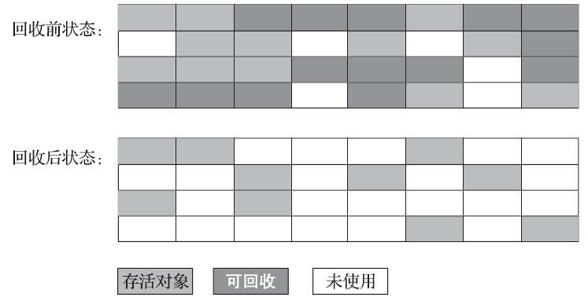
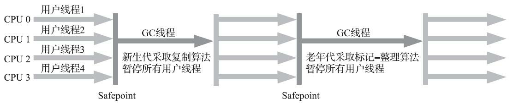

# JVM笔记


**字节码文件->类加载系统**: **class文件中不会存放方法/字段的最终内存布局** Java**虚拟机需要在类加载时从常量池获得对应的符号引用然后在类创建时/运行时解析到具体内存**中


## 自动内存管理 

### 第2章　Java内存区域与内存溢出异常

#### 2.2　运行时数据区域


##### 运行时数据区的变迁


**程序计数器、Java虚拟机栈、本地方法栈都是线程私有的 Java堆和方法区都是线程共享的**

##### 2.2.1　程序计数器

**程序计数器是当前线程执行字节码指令的行号指示器** 也是**唯一一个没有规定OOM情况的内存空间**

**字节码解释器**(程序控制流的解释器)**通过更改程序计数器的值选取需执行的字节码指令来完成分支、循环、跳转、异常处理、线程恢复等功能**

**Java虚拟机的多线程是线程轮流切换的**且**任何一个确定的时刻一个处理器只会执行一个线程中的指令** **程序计数器保证了在线程切换后恢复到当前线程正确的执行位置** 如果执行的是**Java方法 计数器会记录当前字节码指令的地址** 如果是**本地方法 计数器值为空(undefined)**

##### 2.2.2　Java虚拟机栈

**Java虚拟机栈描述的是Java方法执行的线程内存模型**: 每个**方法执行**时虚拟机栈都会同步**创建一个栈帧来储存当前方法的局部变量表、操作数栈、动态连接、方法出口等信息**(在8.2有详细说明) 每个**方法被调用到执行完毕对应着其栈帧入栈和出栈**

《Java虚拟机规范》中规定了**虚拟机栈会出现两类异常**：

1. **StackOverflowError: 当前线程请求的栈深度大于虚拟机所允许的深度**
2. **OutOfMemoryError: 虚拟机可以动态扩展的情况下, 栈扩展时无法申请到足够内存** **(HotSpot栈容量不可动态扩展 但如果线程申请栈空间失败也会抛OOM)**

##### 2.2.3　本地方法栈

**与Java虚拟机栈的功能相似 为本地(Native)方法服务**

##### 2.2.4　Java堆

**Java堆是占用虚拟机内存最大的一块内存空间，“几乎”所有对象实例都在堆中分配内存** (‘几乎’--**即时编译**让对象实例可以在**栈上分配或做标量替换**、未来可能会出现的**值类型支持**) 同时也**被垃圾收集器管理**

**回收内存**角度：**分代/区域划分仅仅是垃圾收集器的特性和设计风格来更好的回收内存 不是堆中具体实现的内存布局**

**分配内存**角度：堆会**给多个线程提供其私有的分配缓冲区(TLAB)来提升对象分配的效率** 

**Java堆可以处于逻辑连续但物理上不连续的内存空间中 **

《Java虚拟机规范》规定了当**无法给实例分配足够内存或堆无法扩展时会抛OOM异常**

##### 2.2.5　方法区

**方法区是用于存储已被虚拟机加载的类型信息、常量、静态变量、即时编译后的代码缓存等数据的逻辑空间(永久代(在虚拟机的运行时数据区中存储数据)和元空间(在本地内存中存储数据)都是方法区的实现)** 

HotSpot虚拟机**JDK6、7、8的方法区不同实现**：

- **JDK6时使用永久代作为方法区的实现** 使得其内部的**垃圾收集器基于分代设计可以同时管理分了新生代和老年代的Java堆和方法区(永久代)的内存** **省去专门编写方法区内存管理的代码** 致使Java程序**更容易遇到内存溢出**的问题
- **JDK7时使用永久代作为方法区的实现** 但将永久代中的**字符串常量池和静态变量移到Java堆中**
- **JDK8时使用元空间作为方法区的实现  JDK7中永久代剩余的信息存储在元空间里**

**回收内存**：相对Java堆来说回收并不频繁 主要**回收方法区中的常量池和类型卸载**

《Java虚拟机规范》规定**如果方法区无法满足新的内存分配需求时将抛出OOM异常**

##### 2.2.6　运行时常量池

**运行时常量池是方法区的一部分**

主要**存放编译期生成的各种字面量和符号引用(Class文件中的常量池表的数据)**、**符号引用解析后的直接引用**、**运行期动态生成的常量**

《Java虚拟机规范》规定**常量池无法再申请到内存时抛出OOM异常**

##### 2.2.7　直接内存

**直接内存不在虚拟机运行时数据区中** (**JDK8后本地内存分为直接内存和元空间两部分**)

**NIO可以使用Native函数库直接分配堆外内存** 然后通过一个存在堆中的DirectByteBuffer对象作为堆外内存的引用来进行操作 这种方式可以**避免在Java堆和Native堆中来回复制数据提高性能**(https://www.zhihu.com/question/438698030)

**NIO操作的是JVM Off Heap**


**如果忽略直接内存导致各个内存区域总和大于物理内存限制则会出现OOM异常**

#### 2.3　HotSpot虚拟机对象探秘 

##### 2.3.1　对象的创建

**对象(不包含数组/Class对象)的创建过程**如下

1. **虚拟机执行字节码new指令** 
2. 检查**这个指令**的**参数是否能在常量池中定位到一个类的符号引用** 

3. 检查这个**符号引用代表的类是否已被加载、解析和初始化过**  **没有须先执行相应的类加载过程(7.3)**
4. **类加载检查** 
5. 虚拟机将**为新生对象分配内存** (对象**所需内存的大小在类加载完成后便可完全确定**)

   1. 为对象分配空间实际上是**把一块确定大小的内存块从Java堆中划分出来**  

      1. **指针碰撞**: **假设Java堆中内存是绝对规整**的，所有被使用过的内存都被放在一边，空闲的内存被放在另一边，**中间放着一个指针作为分界点的指示**器，那所分配内存就仅仅是**把那个指针向空闲空间方向挪动一段与对象大小相等的距离**
      2. **空闲列表**: 如果**Java堆中的内存并不是规整**的，已被使用的内存和空闲的内存相互交错在一起，**虚拟机就必须维护一个列表**，**记录上哪些内存块是可用**的，在**分配的时候从列表中找到一块足够大的空间划分给对象实例，并更新列表上的记录**
   2. **选择哪种分配方式由Java堆是否规整决定**，而**Java堆是否规整又由所采用的垃圾收集器是否带有空间压缩整理（Compact）的能力决定**。
      1. 使用**Serial、ParNew等带压缩整理过程的收集器**时，系统采用的**分配算法是指针碰撞**，既**简单又高效**；
      2. 使用**CMS这种基于清除（Sweep）算法的收集器**时
         1. 理论上就只能**采用较为复杂的空闲列表**来分配内存 
         2. 实际上在**CMS的实现**里面，为了能在多数情况下分配得更快，设计了一个叫作**Linear Allocation Buffer的分配缓冲区**，**通过空闲列表拿到一大块分配缓冲区之后，在它里面仍然可以使用指针碰撞方式来分配**
   3. **对象创建在虚拟机中是非常频繁的行为**，即使仅仅**修改一个指针所指向的位置，在并发情况下也并不是线程安全**的 **解决这个问题**有两种可选方案：
      1. 一种是**对分配内存空间的动作进行同步处理**——实际上虚拟机是采用**CAS配上失败重试**的方式**保证更新操作的原子性**

      2. 另外一种是**把内存分配的动作按照线程划分在不同的空间之中进行**，即**每个线程在Java堆中新生代Eden区预先分配一小块内存**，称为本地线程分配缓冲（Thread Local Allocation Buffer，**TLAB**），**哪个线程要分配内存，就在哪个线程的TLAB中分配**
         1. **-XX:TLABWasteTargetPercent 设置TLAB可用的Eden区百分比 默认1%**
         2. **-XX:+PrintTLAB 查看TLAB空间使用情况**
      

6. 虚拟机必须将**分配到的内存空间（但不包括对象头）都初始化为零值** (如**使用TLAB可以提前至TLAB分配时顺便进行**) 该初始化操作**保证了对象的实例字段在Java代码中可以不赋初始值就直接使用**，**使程序能访问到这些字段的数据类型所对应的零值**
7. **对对象进行必要的对象头信息设置**
8. **虚拟机new指令执行完成** 
9. **执行<init> ()方法，按照程序员的意愿对对象进行初始化**

##### 2.3.2　对象的内存布局(堆中)

###### 对象头（Header）

**对象头主要包含两类信息：Mark Word和类型指针**

**Mark Word**：**存储对象的运行时数据**, 如哈希码HashCode、GC分代年龄、锁状态标志、线程持有的锁、偏向线程ID、偏向时间戳等信息**是有着动态定义的数据结构** 可以在**极小的空间内存储尽量多的数据**并**根据对象的状态复用自己的存储空间**

**类型指针**： **对象指向它的类型元数据的指针** **确定该对象是哪个类的实例** 

**Note**: 如果对象是**数组** 对象头中还**必须有一块用于记录数组长度的数据**

###### 实例数据（Instance Data）

实例数据部分是**对象真正存储的有效信息 即程序代码定义的各种类型的字段内容(父类继承/子类中定义) ** 

**父类中定义的变量会出现在子类之前**

###### 对齐填充（Padding）

仅仅起到**占位符作用** 

**HotSpot**虚拟机的自动内存管理系统要求**对象起始地址必须是8字节的整数倍**：**对象必须是8字节的整数倍**

##### 2.3.3　对象的访问定位

**创建对象的目的是为了使用对象** Java**通过栈上的reference数据来操作和访问堆上的具体对象**

主流的访问方式主要有使用**句柄和直接指针**两种

###### 句柄

1. Java**堆中会划分出一块内存来作为句柄池**
2. **reference中存储的就是对象的句柄地址**
3. **句柄中包含了对象实例数据与类型数据各自具体的地址信息** 

**好处**就是**reference中存储的是稳定句柄地址**，在**对象被移动**（**垃圾收集时移动对象是非常普遍的行为**）时只会**改变句柄中的实例数据指针**，而 **reference本身不需要被修改**


###### 直接指针

使用直接指针时Java堆中**对象的内存布局**就**必须考虑如何放置访问类型数据的相关信息**，**reference中存储的直接就是对象地址**

好处就是**速度更快，访问对象时节省了一次指针定位的时间开销** **HotSpot主要使用直接指针进行对象访问**


#### 2.4　实战：OutOfMemoryError异常

| VM 参数                         | 参数指令                                                     |
| ------------------------------- | ------------------------------------------------------------ |
| -Xms                            | 设置堆最小值                                                 |
| -Xmx                            | 设置堆最大值                                                 |
| -XX:+HeapDumpOnOutOfMemoryError | 出现OOM时Dump出堆内存转储快照                                |
| -Xss                            | 设置栈容量                                                   |
| -Xoss                           | 设置本地方法栈容量(HotSpot中无效)                            |
| -XX：PermSize                   | JDK6/7中设置永久代初始大小                                   |
| -XX：MaxPermSize                | JDK6/7中设置永久代最大值                                     |
| -XX：MetaspaceSize              | JDK8及以后设置元空间初始大小 达到该值触发垃圾回收进行类型卸载 |
| -XX：MaxMetaspaceSize           | JDK8及以后设置元空间最大值 默认为-1(不限制--只受限于本地内存) |
| -XX：MinMetaspaceFreeRatio      | 在垃圾收集之后控制最小的元空间剩余容量的百分比 <br />可减少因为元空间不足导致的垃圾收集的频率。 |
| -XX：MaxDirectMemorySize        | 设置直接内存容量 不设置则默认与堆最大值(Xmx)大小一致         |

##### 2.4.1　Java堆溢出

**不断创建对象并且这些对象都跟GC Roots有可达路径(不会被回收)**->**总容量超过最大堆容量限制**->**OOM(Heap space)**

tip: **设置堆最小值=堆最大值可避免堆自动扩展**

堆内存转储快照分析: **确认内存泄漏**还是**内存溢出(内存中导致OOM的对象都是必要的)**

- **内存泄漏找GC Roots引用链**
- **内存溢出找堆参数设置(Xms/Xmx)**

##### 2.4.2　虚拟机栈和本地方法栈溢出

**栈帧无法分配内存<使用Xss减少栈容量/定义大量本地变量(增大栈帧本地变量表长度)>**->**StackOverflowError**

##### 2.4.3　方法区和运行时常量池溢出

运行时产生大量的类填满方法区->OOM(JDK6/7: PermGen space)

###### String.intern()

**如果字符串常量池已经包含一个等于此String对象的字符串则返回池中该字符串的String对象的引用 没有包含则将此String对象的字符串放到池中再返回该String对象的引用**

##### 2.4.4　本机直接内存溢出

**越过DirectByteBuffer用Unsafe.allocateMemory()申请向操作系统分配内存->OOM**

**直接内存溢出明显特征是Heap Dump文件里不会看到明显异常且文件很小+直接/间接(NIO)用DirectByteBuffer**

### 第3章　垃圾收集器与内存分配策略

#### 3.1　概述

由于**Java堆和方法区需要在运行期间动态管理内存 这两个区域的内存分配和回收是动态的**

#### 3.2　对象已死？

##### 3.2.1　引用计数算法

**引用计数算法在每个对象中各添加一个引用计数器 每当对象被引用时计数器值加一 引用失效时计数器值减一 在任意时刻计数器为0的对象就是不会被使用的对象** 但只使用引用计数算法**很难解决对象之间循环引用**的问题

##### 3.2.2　可达性分析算法

**可达性分析算法通过一系列称为GC Roots的对象作为根节点 对象会跟GC Roots以引用关系形成一条路径(引用链) 如果对象跟所有GC Roots间都没有任何引用链连接(GC Roots到对象不可达)  这说明该对象是不会被使用的对象**

**固定可以作为GC Roots的对象**

- **Java虚拟机栈(栈帧中的本地变量表)中引用的对象** e.g. 线程使用到的参数、局部变量、临时变量等
- **方法区中类静态属性引用的对象** e.g. 类的引用类型静态变量
- **方法区中常量引用的对象** e.g. 字符串常量池里的引用
- **本地方法栈中Native方法引用的对象**
- **虚拟机内部使用的对象** e.g. 基础数据类型对应的Class对象、常驻异常对象、系统类加载器
- 所有**被同步锁(Synchronized 关键字)持有的对象**
- JMXBean、JVMTI注册的回调、本地代码缓存等

**局部回收：某个区域里的对象完全有可能被位于堆中其他区域的对象所引用 所以也要把这些关联区域的对象加入到GC Roots集合中**

##### 3.2.3　再谈引用

**传统的引用即reference类型数据, 其存放这另外一块内存的起始地址并代表某内存/对象的引用** **对象只有被引用和未被引用的状态** JDK1.2之后**拓展了拥有更多复杂引用状态的引用以支持一些系统缓存功能的应用**

- **强引用**：**引用赋值 new关键字创建的对象 只要强引用关系存在 被强引用的对象不会被垃圾回收**

  ```java
  A a = new A();
  ```

- **软引用**：**还有用但非必需的对象 系统即将发生OOM时被软引用的对象会被列入回收范围进行垃圾回收 如果回收还是没有足够内存则抛OOM异常**

  - **-XX:SoftRefLRUPolicyMSPerMB 控制每MB堆空闲空间中软引用存活时间 默认为1s**

  ```java
  Object object = new Object(); 
  SoftReference<Object> softRef = new SoftReference<Object>(object); 
  object = null;  
  ```

- **弱引用**：**比软引用强度更弱的非必需对象 只要发生垃圾回收就会把被弱引用的对象(弱引用建立引用的对象没有强引用)回收**

  ```java
  Object object = new Object(); 
  WeakReference<Object> weakRef = new WeakReference<Object>(object); 
  object = null;  
  ```

- **虚引用**：**最弱的引用 被虚引用的对象只是为了对象被回收时收到系统通知**

  ```java
  Object object = new Object(); 
  ReferenceQueue<Object> refQueue = new ReferenceQueue<Object>(); 
  PhantomReference<Object> ref = new PhantomReference<Object>(object, refQueue); 
  object = null;
  ```

##### 3.2.4　生存还是死亡？

对象真正意义上的死亡至少要经历两次标记过程

- **第一次标记**：**可达性分析后发现没有对象与GC Roots的引用链** 
- 筛选：**对象是否有必要执行finalize()方法**
  - **没有必要执行: 对象没有覆盖finalize()方法/finalize()方法已经被虚拟机调用过 -> 被回收**
  - **有必要执行: 对象被放置在F-Queue队列中 被虚拟机创建的Finalizer线程触发finalize()方法** 
    - **第二次标记：收集器对F-Queue进行第二次标记** 
      - 如果对象**在finalize()方法中重新建立起跟GC Roots的引用链 -> 不会被回收**
      - 如果还是**没有引用链 -> 被回收**

Note: **由于其运行代价高昂、不确定性大、无法保证各个对象的调用顺序 不建议使用finalize()方法 改用try-finally **

##### 3.2.5　回收方法区

**方法区的回收相对Java堆要更严格且收效甚微** 主要**回收两部分内容：废弃常量和不再使用的类型**

**废弃常量回收**：与堆中对象回收很相似 如果**字符串A曾经进入常量池中 但是当前程序没有任何一个字符串对象的值是A** (即**已经没有任何字符串对象引用常量池的A常量且虚拟机中也没有区域引用该字面量**) 垃圾收集器则会将该常量**从常量池回收** **常量池中其他类/接口/方法/字段的符号引用同理**

**回收类型(类型卸载)**：**判定类型属于不再被使用的类**需要**同时满足以下三个条件**

- **该类所有实例都被回收 堆中已经不存在该类及其子类的实例**
- **加载该类的类加载器被回收** **除非是可替换类加载器(OSGi热部署、JSP重加载)否则很难达成该条件**
- **该类对应在堆中的Class对象没有在任何地方被引用且无法通过反射访问该类的方法**

**自定义类加载器的应用中通常需要虚拟机具备类型卸载的能力给方法区减负**

#### 3.3　垃圾收集算法

**垃圾收集算法是内存回收的方法论**

##### 3.3.1　分代收集理论

分代收集是符合大多数程序运行实际情况的经验法则 建立在三个分代假说之上

1. **弱分代假说：绝大多数对象都是朝生夕灭的(生存时间都较短)**
2. **强分代假说：熬过越多次垃圾回收的对象就越难消亡**
3. **跨代引用假说：跨代引用相对同代引用来说仅占极少数** (根据强弱分代假说 **存在互相引用关系的对象更倾向于同生共死**: 新生代对象跨代引用的老年代对象难以消亡 则该新生代对象也会在数次垃圾回收后存活进而晋升到老年代消除跨代引用)

根据跨代引用假说 只需在**新生代建立一个全局数据结构: 记忆集(3.4.4)来把老年代分成若干小块来标识有跨代引用的老年代块 发生Minor GC时只会把有跨代引用的老年代块加入到GC Roots集合里 无需再扫描整个老年代来标记**

**GC名词**

- 部分收集（**Partial GC**）：指目标**不是完整收集整个Java堆的垃圾收集**，其中又分为： 
  - 新生代收集（**Minor GC/Young GC**）：指目标只**是新生代的垃圾收集**

  - 老年代收集（**Major GC/Old GC**）：指目标**只是老年代的垃圾收集**。目前**只有CMS收集器会有单独收集老年代的行为**

  - 混合收集（**Mixed GC**）：指目标是**收集整个新生代以及部分老年代**的垃圾收集。目前**只有G1收集器会有这种行为**

- 整堆收集（**Full GC**）：**收集整个Java堆和方法区的垃圾收集**

##### 3.3.2　标记-清除算法

**标记-清除算法分为两个阶段 标记阶段标记出所有需要回收的对象 清除阶段回收掉所有被标记的对象**

该算法是**最基础的垃圾收集算法 因为后续算法都是基于改进该算法衍生的** 标记-清除主要有**两个缺点**

- **执行效率不稳定：标记和清除的执行效率会随着对象数量的增长而降低**
- **内存空间碎片化：标记清除后会产生大量不连续的内存区域 碎片区域过多->需分配大对象时没有足够连续内存->另一次垃圾回收**



##### 3.3.3　标记-复制算法

**标记-复制算法又称复制算法 每次只使用一半可用内存区域 用完将还存活的对象复制到另外一半内存区域 然后将用完内存的这块区域全部清理 在多数对象都可回收的情况下只需要复制少量存活对象进行半区回收且不用考虑有空间碎片的问题**

由于**新生代的对象大多都存活时间短, 熬不过第一次垃圾收集 大多虚拟机都使用复制算法来回收新生代** 例如**HotSpot虚拟的新生代垃圾收集器**都将**新生代分为Eden区和两块Survivor区(8:1:1) 每次只用Eden和一块Survivor分配内存 MinorGC时把存活的对象复制到另外一块Survivor中 直接清理用过的Eden和Survivor** 如果**另外的Survivor空间不足以容纳存活的对 则依赖老年代进行分配担保(3.8.5)**

**缺点是空间浪费严重 可用内存缩减了一半**


##### 3.3.4　标记-整理算法

**标记-整理算法也分为两个阶段 标记阶段和标记-清除算法一致 整理阶段把存活对象都向内存空间一端移动 然后清理掉边界以外的内存**

**标记-清除算法是非移动式的回收算法 而标记-整理算法是移动式的算法** 两者**都有被作为老年代的回收算法使用** 因为**针对老年代这种大量对象存活的区域 需要对是否移动对象做出决策来决定垃圾收集算法**

- **移动对象：内存回收复杂 必须暂停用户线程且在有大量存活对象时进行移动会导致程序出现较长时间的停顿(Stop The World)**
- **不移动对象：内存分配复杂 停顿时间更短 效率提升 但碎片化严重的情况会依赖更复杂的内存分配机制来解决(分区空闲分配链表)且会由于内存访问频繁降低程序的吞吐量**

Note: **CMS收集器会采用两种算法结合**的方式来进行垃圾回收: **大多数时间使用标记-清除算法 直到内存碎片化严重到大对象分配时再使用标记-整理获得规整内存**


#### 3.4　HotSpot的算法细节实现

##### 3.4.1　根节点枚举

**所有垃圾收集器根据可达性算法来判定对象存活都要经历两个阶段**

- **根节点枚举：虚拟机使用一组名为OopMap的数据结构(直接得到哪些地方存放着对象引用)来节省查询GC Roots对象的引用位置 但仍需要暂停所有用户线程(Stop The World)来冻结对象引用关系以确保分析的准确性**
- **查找引用链：耗时最长但可以做到跟用户线程并发进行**

##### 3.4.2　安全点

由于**程序运行时引用关系变化频繁 OopMap为每一个关系变化生成一条指令是不现实的** **HotSpot实际上只在特定位置记录引用关系变化** 这些位置就是**安全点** **代码指令流只能执行到安全点时才能暂停** 所以需要**斟酌安全点的选取**：指令需要**具有能让程序长时间执行的特征** (**指令序列的复用：方法调用、循环跳转、异常跳转**等)

对于安全点还有一个问题就是如何在**垃圾收集时让所有线程都跑到最近的安全点停顿**

- **抢断式中断：垃圾收集时系统先把所有用户线程中断 然后把不在安全点的线程恢复运行使其跑到安全点上** 
- **主动式中断：垃圾收集时设置并让各个线程主动轮询一个中断标志位** 发现中断标志时各线程**在自己最近的安全点上主动挂起** **轮询标志的地方要和安全点重合(包括所有创建对象和其他需要在Java堆上分配内存的区域以避免没有足够内存分配新对象)** **HotSpot使用内存保护陷阱把安全点轮询+触发线程中断精简至只有一条汇编指令**

##### 3.4.3　安全区域

**安全点机制仅保证了程序执行时不久就会遇到可进行垃圾回收的安全点** 但是还需要**安全区域(伸长的安全点)来保证程序不执行的时候(没有分配处理器时间--用户线程处于Sleep/Blocked状态)有一段引用关系不会变化的代码片段(在这个片段任意地方都可以进行垃圾回收)**

**线程离开安全区域时要检查虚拟机是否完成根节点枚举**

- **完成 线程继续执行 只当无事发生**
- **没完成 等到可以离开区域的信号(完成根节点枚举)才可离开**

##### 3.4.4　记忆集与卡表

**记忆集是用来记录从非收集区域指向收集区域的指针集合** **具体实现**可能会有三种方式

- 字长精度：每个记录精确到一个机器字长 机器字包含跨代指针
- 对象精度：每个记录精确到一个对象 对象包含跨代指针
- **卡表：每个记录精确到一块内存区域 区域内有对象包含跨代指针**
  - 目前**最常用的记忆集实现**形式 **定义了记忆集的记录精度、与堆内存的映射关系**
  - **HotSpot使用字节数组来实现卡表** **每个元素都对应着其标识的内存区域中的卡页**
    - **卡页**是一块**特定以2的N次幂字节数为大小的内存块** (HotSpot中为2^9=512字节)
    - 卡页内有一个(或更多)对象的字段
      - **字段存在跨代指针 把卡表对应的数组元素值标识为1(元素变脏)** 
      - 字段**不存在跨代指针 把卡表对应的数组元素值标识为0**
  - **垃圾回收时只需要筛选出变脏元素就能知道哪些内存块包含跨代指针 把这些内存块放到GC Roots集合中**

##### 3.4.5　写屏障

**卡表元素何时变脏：其他分代区域中对象引用本区域对象(引用类型赋值)时其对应的卡表元素就会变脏**

**卡表元素如何变脏：写屏障**

- 在**虚拟机层面对引用类型赋值这个动作做一个AOP切面** 
- **赋值前部分的写屏障为写前屏障** **赋值时会产生一个环形通知供程序做额外动作** **赋值后部分的写屏障为写后屏障**
- **写屏障会使虚拟机为所有赋值操作生成相应指令** 如果**收集器在写屏障时增加更新卡表操作 会产生额外开销**(相比扫描老年代代价小)

**伪共享：多线程修改互相独立的且共享同一缓存行的多个变量时 变量间会彼此影响(写回、无效化、同步)导致性能降低**

**卡表在高并发场景下会出现伪共享问题 解决方案是采用有条件(检查卡表标记 只有当卡表元素未被标记才将其标记为变脏)的写屏障**

##### 3.4.6　并发的可达性分析

**可达性分析的扫描过程** 使用**三色标记**推导

- **白色：表示对象尚未被垃圾收集器访问过**
  - **可达性分析刚开始时所有的对象都是白色的**
  - **分析结束仍然是白色的对象--不可达对象**
- **黑色：表示对象已经被垃圾收集器访问过且这个对象的所有引用都已经扫描过**
  - **黑色代表已经扫描过且是安全存活的**
  - **如果有其他对象引用指向了黑色对象，无须重新扫描一遍**
  - **黑色对象不可能直接（不经过灰色对象）指向某个白色对象**
- **灰色：表示对象已经被垃圾收集器访问过但这个对象上至少存在一个引用还没有被扫描过**

如果**用户线程与收集器并发工作**：**收集器在对象图上标记颜色，同时用户线程在修改引用关系——即修改对象图的结构** 会出现两种情况

- **把原本消亡的对象错误标记为存活 产生了浮动垃圾 下次收集可被清理**
- **把原本存活的对象错误标记为已消亡 程序肯定会发生错误**


当且仅当以下**两个条件同时满足**时，出现**对象消失问题(原本应该是黑色的对象被误标为白色)**

- **赋值器插入了一条或多条从黑色对象到白色对象的新引用**
- **赋值器删除了全部从灰色对象到该白色对象的直接或间接引用**

**解决并发扫描时的对象消失问题**，只需**破坏这两个条件的任意一个**即可

- **增量更新（Incremental Update）: 黑色对象一旦新插入了指向白色对象的引用之后就变回灰色对象**
- **原始快照（Snapshot At The Beginning/SATB）: 无论引用关系删除与否, 都会按照刚刚开始扫描那一刻的对象图快照来进行搜索**

**CMS是基于增量更新来做并发标记 而G1、Shenandoah则用原始快照来实现并发标记**

#### 3.5　经典垃圾收集器

**垃圾收集器是内存回收的实践者** **HotSpot虚拟机的垃圾收集器**如图所示 共有**7种作用于不同分代的收集器和7种收集器组合**

1. **Serial+Serial Old **
2. **Serial+CMS (JDK9 后废弃) **
3. **ParNew+CMS+Serial Old **
4. **ParNew + Serial Old (JDK9 后废弃)**
5. **Parallel Scavenge+Serial Old **
6. **Parallel Scavenge+Parallel Old **
7. **G1**


##### 概念解释

###### 并发与并行

**从3.5.2 ParNew收集器开始 会有很多涉及并行和并发概念的垃圾收集器**

**并行**：**并行描述的是多条垃圾收集器线程之间的关系**，**同一时间有多条这样的线程在协同工作，通常默认此时用户线程是处于等待状态**

**并发**：**并发描述的是垃圾收集器线程与用户线程之间的关系**，说明**同一时间垃圾收集器线程与用户线程都在运行**。由于用户线程并未被冻结，所以程序仍然能响应服务请求，但由于垃圾收集器线程占用了一部分系统资源，此时应用程序的处理的**吞吐量将受到一定影响**

###### 吞吐量

3.5.3 Parallel Scavenge收集器会涉及吞吐量的概念

**吞吐量就是处理器用于运行用户代码的时间与处理器总消耗时间的比值**， 即：


如果虚拟机完成某个任务，**用户代码加上垃圾收集总共耗费了100分钟，其中垃圾收集花掉1分钟，那吞吐量就是99%**。

由于与吞吐量关系密切，**Parallel Scavenge收集器也经常被称作“吞吐量优先收集器”** 

还有一个参数**-XX：+UseAdaptiveSizePolicy** 被激活之后 **虚拟机会根据当前系统的运行情况收集性能监控信息**，**动态调整这些参数以提供最合适的停顿时间或者最大的吞吐量**。这种调节方式称为垃圾收集的**自适应的调节策略（GC Ergonomics）**

**高吞吐量可以最高效率地利用处理器资源，尽快完成程序的运算任务**，主要**适合在后台运算而不需要太多交互的分析任务**

###### 停顿时间

**垃圾收集停顿时间缩短是以牺牲吞吐量和新生代空间为代价换取的**： **系统把新生代调得小一些**，**收集300MB新生代肯定比收集500MB快**，但这也直接**导致垃圾收集发生得更频繁**，**原来10秒收集一次、每次停顿100毫秒**，**现在变成5秒收集一次、每次停顿70毫秒**。**停顿时间的确在下降**，但**吞吐量也降下来了**

**停顿时间越短就越适合需要与用户交互或需要保证服务响应质量的程序，良好的响应速度能提升用户体验**

##### 3.5.1　Serial收集器

**Serial收集器是最基础、历史最悠久的单线程工作的收集器** **进行垃圾收集时，它在工作时必须暂停其他所有工作线程(Stop the World)** 但**仍是HotSpot虚拟机运行在客户端模式下的默认新生代收集器**，**相比其他收集器的单线程版本简单而高效**，对于**内存资源受限的环境**，它是所有收集器里**额外内存消耗（Memory Footprint）最小**的 **微服务应用分配给虚拟机管理的内存一般来说并不会特别大 所以Serial的停顿时间只有100毫秒内 可以被用户接受**

###### Serial/Serial Old收集器运行示意图



##### 3.5.2　ParNew收集器

**ParNew收集器实质上是Serial收集器的多线程并行版本。 除了Serial收集器外，目前只有它能与CMS收集器配合工作**

自**JDK 9开始** **ParNew加CMS收集器的组合就不再是官方推荐的服务端模式下的收集器解决方案**了。官方**希望它能完全被G1所取代**，还**取消了ParNew加 Serial Old以及Serial加CMS这两个收集器组合**且使**ParNew收集器作为专门处理CMS的新生代部分合并入CMS收集器**

###### ParNew/Serial Old收集器运行示意图


##### 3.5.3　Parallel Scavenge收集器

**Parallel Scavenge**是基于**标记-复制算法**实现的**并行收集的多线程新生代收集器** **其关注点是达到一个可控制的吞吐量**

HotSpot提供了两个参数用于**精确控制吞吐量**：

**控制最大垃圾收集停顿时间**: **-XX：MaxGCPauseMillis**参数允许的值是一个**大于0的毫秒数** 

**直接设置吞吐量大小**: **-XX：GCTimeRatio**参数的值则应当是一个**大于0小于100的整数**，也就是垃圾收集时间占总时间的比率，相当于吞吐量的倒数。譬如把此参数设置为19，那允许的最大垃圾收集时间就占总时间的5% （即1/(1+19)），默认值为99，即允许最大1%（即1/(1+99)）的垃圾收集时间。

##### 3.5.4　Serial Old收集器

**Serial Old是针对老年代收集(使用标记-整理算法)的单线程收集器 与Serial收集器组合供客户端模式下的HotSpot虚拟机使用**。

**在服务端模式下，它可能有两种用途**

- 在**JDK 5以及之前的版本中与Parallel Scavenge收集器搭配使用**
- **作为CMS收集器发生失败时的后备预案，在并发收集发生Concurrent Mode Failure时使用**

##### 3.5.5　Parallel Old收集器

**Parallel Old是Parallel Scavenge收集器的老年代版本**，支持**多线程并发**收集，基于**标记-整理**算法实现

**吞吐量优先的Parallel Scavenge收集器终于有了比较名副其实的搭配**

**注重吞吐量或者处理器资源较为稀缺**时都可以**优先考虑Parallel Scavenge加Parallel Old**收集器这个组合

###### Parallel Scavenge/Parallel Old收集器运行示意图


##### 3.5.6　CMS收集器

**CMS收集器是多线程(基于标记-清除算法)的以获取最短回收停顿时间为目标的收集器 可以给用户良好的交互体验**

CMS收集器的**运作过程分为四步**

1. **初始标记：标记GC Roots能关联到的对象 耗时很短但需要暂停所有用户线程(Stop The World)** 
2. **并发标记：从GC Roots关联对象开始遍历整个对象图 耗时最长但可与用户线程并发运行**
3. **重新标记：由于并发标记期间并发运行的用户线程还会产生引用关系变化导致部分标记变化 重新标记需要修正这部分标记变化的记录 耗时较短但需要暂停所有用户线程(Stop The World)** 
4. **并发清除：清除标记阶段被判定死亡的对象 耗时较长 因为使用标记-清除算法不需要移动对象 该阶段也可以与用户线程并发运行**

由于整个运作过程中**耗时长的并发标记和并发清除都可以并发执行** **总体上可以说CMS的内存回收是与用户线程并发执行的**

###### CMS收集器运行示意图


**优点**

- **并发收集**
- **低停顿**

**缺点**

- **对处理器资源非常敏感(面向并发设计的程序通病)** **并发阶段**(并发标记/清除)**会占用一部分线程导致应用程序变慢 总吞吐量降低**
- **无法处理浮动垃圾->并发失败->Full GC(Stop The World)**
  - **浮动垃圾：CMS并发阶段时用户线程在标记阶段过后产生且无法在当次垃圾收集中处理的垃圾对象**
  - **垃圾回收(并发清除)阶段还需要预留用户线程执行的内存 如果预留的不够会导致并发失败**(Concurrent Mode Failure) 此时**启用备用Serial Old重新进行老年代垃圾回收->停顿时间变长**
- **内存碎片化(采用标记-清除算法收集器通病)**

##### 3.5.7　Garbage First收集器

**G1是总体基于标记-整理算法(两个Region之间基于复制算法)实现的多线程收集器 开创了面向局部收集的设计思路和基于Region的内存布局格式 由于JDK8后提供了并发类卸载的支持使之成为全功能垃圾收集器(在延迟可控的情况下获得尽可能高的吞吐量)** **也是主要面向服务端的应用且在JDK9时成为服务端模式下的默认垃圾收集器** 

**G1可以对堆内存中任意部分组成回收集来回收** **根据哪块内存垃圾最多收益最大来衡量回收对象(Mixed GC)**

为了**建立停顿时间模型 G1采用了基于Region的堆内存布局并辅以带优先级的区域回收方式**

- **把连续的Java堆划分为多个大小相等的Region(独立区域)** 
- 以**Region作为最小的回收单位 有计划的避免在Java堆中进行全区域的GC** 
- **跟踪各个Region里**垃圾**回收的价值(回收所获的空间大小+所需时间的经验值)** 
- 在**后台维护一个根据用户设定允许的收集停顿时间的优先级列表来优先处理回收价值(即收益)最大的Region** 
- 整个过程保证了G1在**有限时间内可以获得尽可能高的收集效率**

**Region 角色可根据需要变更 根据不同区域可采用不同策略处理 各区域为一系列Region(不需要连续)的动态集合**

- **新生代**
  - **Eden**
  - **Survivor**
- **老年代**
- **Humongous: 专门存大对象(大小超过一个Region容量的一半) 大多数的时候被当作老年代的一部分来看**
  - **超过整个Region容量的超级大对象会被存放在N个连续的Humongous Region中**

细节问题：

- **跨Region引用对象：每个Region都维护各自的记忆集来记录并标记别的Region指向自己的指针在哪些卡页范围内**
  - G1记忆集的数据结构本质是**哈希表**：**Key：别的Region起始地址** **Value：存储卡表索引号的集合**
  - 双向的卡表结构实现较复杂且占据更多内存 (额外内存耗费相当于Java堆内存的10%-20%)
- **并发标记阶段保证收集线程和用户线程互不干扰**
  - **原始快照(SATB)算法**
  - 为**每一个Region设计两个TAMS指针把Region中的一部分空间划分出来用于并发回收时的新对象分配** 如果内存分配速度超过内存回收速度会导致Full GC
- **建立可靠停顿预测模型**
  - 以衰减均值为理论基础 **记录每个Region的回收耗时、记忆集里的脏元素数量等分析出平均值、标准偏差、置信度等信息**
  - **衰减均值能更准确的表示最近的平均状态**--**Region的统计状态越新越能决定其回收的价值->不超过期望停顿时间获得最高收益**

G1的**新生代**运行过程：**Eden区和Survivor区复制到空白区**

G1运行过程(**老年代)**大致可分为四步

1. **初始标记：标记GC Roots能直接关联到的对象 修改TAMS指针值使其能够在可用Region中正确分配对象 耗时短(与MinorGC同步完成)需要停顿用户线程**
2. **并发标记：**从GC Roots开始**对堆中对象进行可达性分析 递归扫描整个堆里的对象图找出需要回收的对象** **耗时最长但可与用户线程并发运行** 对象图扫描完成后需要**重新处理原始快照记录下的在并发时有引用变动的对象**
3. **最终标记：处理并发标记结束后遗留的原始快照记录** **需要停顿用户线程**
4. **筛选回收**：**更新Region统计数据 对Region的价值排序 根据期望停顿时间规划回收Region并构成回收集 将回收集中的存活对象复制到空Region里 清理回收集Region 需要停顿用户线程(需移动对象) 由多个收集线程并行完成**

###### G1收集器运行示意图


| G1                                                         | CMS                                           |
| ---------------------------------------------------------- | --------------------------------------------- |
| **主由标记-整理算法实现(Region之间采用复制算法) 无碎片化** | **主由标记-清除算法实现 有碎片化**            |
| **大内存应用表现更优**                                     | **小内存应用表现更优**                        |
| **可以指定最大停顿时间**                                   | **不可以指定最大停顿时间**                    |
| **分Region内存布局**                                       | **传统堆内存布局**                            |
| **按收益/优先级动态确定回收集**                            | **固定分代回收**                              |
| **内存占用和程序额外执行负载高**                           | **内存占用和程序额外执行负载低**              |
| **卡表实现复杂且记忆集占据很多空间**                       | **卡表实现简单 记忆表可以省下新生代维护开销** |
| **写前屏障跟踪并发时的指针状况**                           | **无写前屏障**                                |
| **写后屏障进行更烦琐的卡表维护操作**                       | **写后屏障进行卡表维护操作**                  |
| **写屏障的操作需要放到类似消息队列的结构中做异步处理**     | **写屏障的操作是同步的**                      |


#### 3.6　低延迟垃圾收集器

##### 3.6.1　Shenandoah收集器

##### 3.6.2　ZGC收集器

#### 3.7　选择合适的垃圾收集器

##### 3.7.2　收集器的权衡 

- **应用程序的主要关注点**(不可能三角)
  - **吞吐量**：**如数据分析、科学计算**类的任务，目标是能**尽快算出结果**
  - **延迟**：**如SLA应用，停顿时间直接影响服务质量 高延迟会导致事务超时**
  - **内存占用**：**客户端应用或者嵌入式应用**
- **运行应用的基础设施**
  - **硬件规格**
  - **处理器的数量**
  - **可分配内存**
  - 选择的**操作系统**是Linux、Solaris还是Windows
- **使用JDK的发行商**和**版本号**

**示例**：**面向用户**的**B/S系统准备选择垃圾收集器**，**延迟时间为主要关注点**

- **C4收集器**：**适合充足的预算但没有太多调优经验 可以使用带商业技术支持的专有硬件或者软件解决方案**
- **ZGC收集器**：**没有足够预算**，但能**掌控软硬件型号，使用较新的版本**且**特别注重延迟**
- **Shenandoah收集器**：**对收集器的稳定性有所顾虑**或**应用必须运行在Windows操作系统下**
- **CMS收集器**：**内存规模为4GB到6GB以下的堆内存 软硬件基础设施和JDK版本都比较落后**
- **G1收集器**：**内存规模超过6GB的堆内存 软硬件基础设施和JDK版本都比较落后**

##### 3.7.3　虚拟机及垃圾收集器日志

直到**JDK 9 HotSpot所有功能的日志都收归到了“-Xlog”参数上** 

```
-Xlog[:[selector][:[output][:[decorators][:output-options]]]]
```

命令行中**最关键的参数是选择器（Selector）**，它**由标签（Tag）和日志级别（Level）共同组成**。 

**标签**可理解为**虚拟机中某个功能模块的名字**，表示**日志框架用户希望得到虚拟机哪些功能的日志输出** **垃圾收集器的标签名称为“gc”**

**日志级别从低到高，共有Trace，Debug，Info，Warning，Error，Off六种级别**，日志级别**决定了输出信息的详细程度**，**默认级别为Info** 还可以使用**修饰器（Decorator）来要求每行日志输出都附加上额外的内容** **默认值是uptime、level、tags这三个**

以下均以JDK 9的G1收集器为例子，**展示在JDK 9统一日志框架前、后是如何获得垃圾收集器过程的相关信息**

1）查看GC基本信息，在JDK 9之前使用-XX：+PrintGC，JDK 9后使用-Xlog：gc：

```bash
bash-3.2$ java -Xlog:gc GCTest 
[0.222s][info][gc] Using G1 
[2.825s][info][gc] GC(0) Pause Young (G1 Evacuation Pause) 26M->5M(256M) 355.623ms 
[3.096s][info][gc] GC(1) Pause Young (G1 Evacuation Pause) 14M->7M(256M) 50.030ms 
[3.385s][info][gc] GC(2) Pause Young (G1 Evacuation Pause) 17M->10M(256M) 40.576ms
```

2）查看GC详细信息，在JDK 9之前使用-XX：+PrintGCDetails，在JDK 9之后使用-X-log：gc*

```bash
bash-3.2$ java -Xlog:gc* GCTest
```

3）查看GC前后的堆、方法区可用容量变化，在JDK 9之前使用-XX：+PrintHeapAtGC，JDK 9之 后使用-Xlog：gc+heap=debug

```bash
bash-3.2$ java -Xlog:gc+heap=debug GCTest
```

4）查看GC过程中用户线程并发时间以及停顿的时间，在JDK 9之前使用-XX：+PrintGCApplicationConcurrentTime以及-XX：+PrintGCApplicationStoppedTime，JDK 9之后使用-Xlog： safepoint

```bash
bash-3.2$ java -Xlog:safepoint GCTest
```

5）查看收集器Ergonomics机制（自动设置堆空间各分代区域大小、收集目标等内容，从Parallel收 集器开始支持）自动调节的相关信息。在JDK 9之前使用-XX：+PrintAdaptive-SizePolicy，JDK 9之后 使用-Xlog：gc+ergo*=trace

```bash
bash-3.2$ java -Xlog:gc+ergo*=trace GCTest
```

6）查看熬过收集后剩余对象的年龄分布信息，在JDK 9前使用-XX：+PrintTenuring-Distribution， JDK 9之后使用-Xlog：gc+age=trace

```bash
bash-3.2$ java -Xlog:gc+age=trace GCTest
```

###### JDK 9前后日志参数变化


##### 3.7.4　垃圾收集器参数总结


#### 3.8　实战：内存分配与回收策略

##### 垃圾回收机制

**在新生代中，每次垃圾收集时都发现有大批对象死去 只有少量存活 选用复制算法 只需要付出少量存活对象的复制成本就可以完成收集（有 eden 和 survivor 供复制，有 老年代最分配担保）**

**老年代中因为对象存活率高、没有额外空间对它进行分配担保，就 必须使用“标记-清理”或者“标记-整理”算法来进行回收**

- Minor GC：新对象先放入 eden 区，当 eden 满了会触发 Minor GC（采用复制算法）
  - 复制对象无法全部放入 Survivor，只好通过分配担保机制提前转移到老年代中 
  - 大对象（长字符串或长数组等需要大量连续空间的对象）直接进入老年代（防止大 对象在 eden 和 Survivor 中经常复制）通过-XX:PretenureSizeThreshold 参数设置 （如 3MB），大于这个参数的直接进入老年代 
  - 长期存活对象进入老年代（默认 15 岁）

- Full GC（等于 Major GC）

  - 每次进行 Minor GC 时，JVM 会计算 **Survivor 区移至老年区的对象的平均大小**，如果这个值**大于老年区的剩余值大小则进行一次 Full GC**

  - 老年代空间不足时触发 Full GC：只有在新生代对象转入或创建为大对象、大数组时才会出现老年代不足的现象（大对象直接进入老年代）分配担保
  - 永久代满（永久代 JDK8 被移除）

**优化 Full GC 本身不会先进行 Minor GC**，我们可以配置，**让 Full GC 之前先进行一次 Minor GC**，因为老年代很多对象都会引用到新生代的对象，**先进行一次 Minor GC 可以提高老年代 GC 的速度**

1. **JVM将可用的堆空间分为新生代（eden 区、from survivor 区、survivor to 区）**
2. **新建对象总是在 eden 区中被创建**
3. **当 eden 区空间已满， 就触发一次 Minor gc，将还被使用的对象复制到 from 区 eden 区可供继续创建对象**
4. **当 eden 区再次用完，再触发一次 Minor gc，将 eden 区和 from 区还在被使用的对象复制到 to 区**
5. **下一次 Minor gc 则是将 eden 区和 to 区还被使用的对象复制到 from 区**
6. **经过多次 Minor gc，某些对象会在 from 区和 to 区多次复制 如果超过某个阈值对象还未被释放，则将对象复制到老年代**
7. **如果老年代空间也已用完，那么 就会触发 full gc全量回收**
8. **永久代的垃圾回收主要有两部分：废弃常量和无用的类**

**实战基于Serial+Serial Old收集器组合**

##### 3.8.1　对象优先在Eden分配

执行testAllocation()中**分配allocation4对象的语句时会发生一次Minor GC**，这次回收的结果是新生代6651KB变为148KB，而总内存占用量则几乎没有减少（因为allocation1、2、3三个对象都是存活 的，虚拟机几乎没有找到可回收的对象）。产生这次垃圾收集的原因是为allocation4分配内存时，发现 Eden已经被占用了6MB，剩余空间已不足以分配allocation4所需的4MB内存，因此发生Minor GC。垃圾收集期间虚拟机又发现已有的三个2MB大小的对象全部无法放入Survivor空间（Survivor空间只有 1MB大小），所以只好通过分配担保机制提前转移到老年代去。

这次收集结束后，4MB的allocation4对象顺利分配在Eden中。因此程序执行完的结果是**Eden占用 4MB（被allocation4占用），Survivor空闲，老年代被占用6MB（被allocation1、2、3占用）**

```java
private static final int _1MB = 1024 * 1024;

/** * VM参数：-verbose:gc -Xms20M -Xmx20M -Xmn10M -XX:+PrintGCDetails -XX:SurvivorRatio=8 */ 
public static void testAllocation() { 
  byte[] allocation1, allocation2, allocation3, allocation4;

  allocation1 = new byte[2 * _1MB];

  allocation2 = new byte[2 * _1MB];

  allocation3 = new byte[2 * _1MB];

  allocation4 = new byte[4 * _1MB]; // 出现一次Minor GC

}
```

```
[GC [DefNew: 6651K->148K(9216K), 0.0070106 secs] 6651K->6292K(19456K), 0.0070426 secs] [Times: user=0.00 sys=0.0 
Heap

def new generation total 9216K, used 4326K [0x029d0000, 0x033d0000, 0x033d0000) 
eden space 8192K, 51% used [0x029d0000, 0x02de4828, 0x031d0000) 
from space 1024K, 14% used [0x032d0000, 0x032f5370, 0x033d0000) 
to space 1024K, 0% used [0x031d0000, 0x031d0000, 0x032d0000)

tenured generation total 10240K, used 6144K [0x033d0000, 0x03dd0000, 0x03dd0000) 
the space 10240K, 60% used [0x033d0000, 0x039d0030, 0x039d0200, 0x03dd0000)

compacting perm gen total 12288K, used 2114K [0x03dd0000, 0x049d0000, 0x07dd0000) 
the space 12288K, 17% used [0x03dd0000, 0x03fe0998, 0x03fe0a00, 0x049d0000) 

No shared spaces configured.
```

##### 3.8.2　大对象直接进入老年代

**大对象就是指需要大量连续内存空间的Java对象，最典型的大对象便是那种很长的字符串，或者元素数量很庞大的数组**

HotSpot虚拟机提供了**-XX：PretenureSizeThreshold 参数**，指定**大于该设置值的对象直接在老年代分配**，这样做的目的就是**避免在Eden区及两个Survivor区之间来回复制，产生大量的内存复制操作**。

**Eden空间几乎没有被使用，而老年代的10MB空间被使用了40%，也就是4MB的allocation对象直接就分配在老年代中**，这是因为XX：PretenureSizeThreshold被设置为3MB（就是3145728，这个参数不能与-Xmx之类的参数一样直接写3MB），因此超过3MB的对象都会直接在老年代进行分配。

```java
private static final int _1MB = 1024 * 1024;

/** 
* VM参数：-verbose:gc -Xms20M -Xmx20M -Xmn10M -XX:+PrintGCDetails -XX:SurvivorRatio=8 
* -XX:PretenureSizeThreshold=3145728 (只对Serial和ParNew两款新生代收集器有效)
*/ 
public static void testPretenureSizeThreshold() { 
  byte[] allocation;
  allocation = new byte[4 * _1MB]; //直接分配在老年代中
}
```

```
Heap

def new generation total 9216K, used 671K [0x029d0000, 0x033d0000, 0x033d0000) 
eden space 8192K, 8% used [0x029d0000, 0x02a77e98, 0x031d0000) 
from space 1024K, 0% used [0x031d0000, 0x031d0000, 0x032d0000) 
to space 1024K, 0% used [0x032d0000, 0x032d0000, 0x033d0000)

tenured generation total 10240K, used 4096K [0x033d0000, 0x03dd0000, 0x03dd0000) 
the space 10240K, 40% used [0x033d0000, 0x037d0010, 0x037d0200, 0x03dd0000)

compacting perm gen total 12288K, used 2107K [0x03dd0000, 0x049d0000, 0x07dd0000) 
the space 12288K, 17% used [0x03dd0000, 0x03fdefd0, 0x03fdf000, 0x049d0000) No shared spaces configured.
```

##### 3.8.3　长期存活的对象将进入老年代

对象通常在Eden区里诞生，如果经过**第一次Minor GC后仍然存活，并且能被Survivor容纳**的话，该对象会被**移动到Survivor空间**中，并且**将其对象年龄设为1岁**。对象在**Survivor区中每熬过一次Minor GC，年龄就增加1岁**，当它的**年龄增加到一定程度（默认为15）**，就会被**晋升到老年代**中。**对象晋升老年代的年龄阈值**，可以通过参数**-XX：MaxTenuringThreshold**设置。

```java
private static final int _1MB = 1024 * 1024;

/** 
* VM参数：-verbose:gc -Xms20M -Xmx20M -Xmn10M -XX:+PrintGCDetails -XX:Survivor-

Ratio=8 -XX:MaxTenuringThreshold=1 -XX:+PrintTenuringDistribution 
*/ 
@SuppressWarnings("unused") 
public static void testTenuringThreshold() {

  byte[] allocation1, allocation2, allocation3;

  allocation1 = new byte[_1MB / 4]; // 什么时候进入老年代决定于XX:MaxTenuringThreshold设置

  allocation2 = new byte[4 * _1MB];

  allocation3 = new byte[4 * _1MB];

  allocation3 = null;

  allocation3 = new byte[4 * _1MB];

}
```

-XX：MaxTenuringThreshold=1参数来运行的结果

```
[GC [DefNew Desired Survivor size 524288 bytes, new threshold 1 (max 1) 
- age 1: 414664 bytes, 414664 total 
: 4859K->404K(9216K), 0.0065012 secs] 4859K->4500K(19456K), 0.0065283 secs] [Times: user=0.02 sys=0.00, real=0.0 
[GC [DefNew 
Desired Survivor size 524288 bytes, new threshold 1 (max 1) : 4500K->0K(9216K), 0.0009253 secs] 8596K->4500K(19456K), 0.0009458 secs] [Times: user=0.00 sys=0.00, real=0.00 

Heap

def new generation total 9216K, used 4178K [0x029d0000, 0x033d0000, 0x033d0000) 
eden space 8192K, 51% used [0x029d0000, 0x02de4828, 0x031d0000) 
from space 1024K, 0% used [0x031d0000, 0x031d0000, 0x032d0000) 
to space 1024K, 0% used [0x032d0000, 0x032d0000, 0x033d0000)

tenured generation total 10240K, used 4500K [0x033d0000, 0x03dd0000, 0x03dd0000) 
the space 10240K, 43% used [0x033d0000, 0x03835348, 0x03835400, 0x03dd0000)

com\pacting perm gen total 12288K, used 2114K [0x03dd0000, 0x049d0000, 0x07dd0000) 
the space 12288K, 17% used [0x03dd0000, 0x03fe0998, 0x03fe0a00, 0x049d0000) No shared spaces configured.
```

以-XX：MaxTenuringThreshold=15参数来运行的结果

```
[GC [DefNew Desired Survivor size 524288 bytes, new threshold 15 (max 15)

- age 1: 414664 bytes, 414664 total

: 4859K->404K(9216K), 0.0049637 secs] 4859K->4500K(19456K), 0.0049932 secs] [Times: user=0.00 sys=0.00, real=0.0 [GC [DefNew Desired Survivor size 524288 bytes, new threshold 15 (max 15)

- age 2: 414520 bytes, 414520 total

: 4500K->404K(9216K), 0.0008091 secs] 8596K->4500K(19456K), 0.0008305 secs] [Times: user=0.00 sys=0.00, real=0.0 Heap

def new generation total 9216K, used 4582K [0x029d0000, 0x033d0000, 0x033d0000) 
eden space 8192K, 51% used [0x029d0000, 0x02de4828, 0x031d0000) 
from space 1024K, 39% used [0x031d0000, 0x03235338, 0x032d0000) 
to space 1024K, 0% used [0x032d0000, 0x032d0000, 0x033d0000)

tenured generation total 10240K, used 4096K [0x033d0000, 0x03dd0000, 0x03dd0000) 
the space 10240K, 40% used [0x033d0000, 0x037d0010, 0x037d0200, 0x03dd0000)

compacting perm gen total 12288K, used 2114K [0x03dd0000, 0x049d0000, 0x07dd0000) 
the space 12288K, 17% used [0x03dd0000, 0x03fe0998, 0x03fe0a00, 0x049d0000) No shared spaces configured.
```

##### 3.8.4　动态对象年龄判定

为了**能更好地适应不同程序的内存状况**，HotSpot虚拟机并不是永远要求对象的年龄必须达到XX：MaxTenuringThreshold才能晋升老年代，如果在**Survivor空间中相同年龄所有对象大小的总和大于Survivor空间的一半，年龄大于或等于该年龄的对象就可以直接进入老年代**，无须等到-XX： MaxTenuringThreshold中要求的年龄

运行结果中**Survivor占用仍然为0%，而老年代比预期增加了6%，也就是说allocation1、allocation2 对象都直接进入了老年代**，并没有等到15岁的临界年龄。因为这**两个对象加起来已经到达了512KB， 并且它们是同年龄**的，满足同年对象达到Survivor空间一半的规则。我们只要注释掉其中一个对象的 new操作，就会发现另外一个就不会晋升到老年代了

```java
private static final int _1MB = 1024 * 1024;

/** 
* VM参数：-verbose:gc -Xms20M -Xmx20M -Xmn10M -XX:+PrintGCDetails -XX:SurvivorRatio=8 -XX:MaxTenuringThreshold=15 -XX:+PrintTenuringDistribution 
*/ 
@SuppressWarnings("unused") 
public static void testTenuringThreshold2() {

	byte[] allocation1, allocation2, allocation3, allocation4;

  allocation1 = new byte[_1MB / 4]; // allocation1+allocation2大于survivo空间一半

  allocation2 = new byte[_1MB / 4];

  allocation3 = new byte[4 * _1MB];

  allocation4 = new byte[4 * _1MB];

  allocation4 = null;

	allocation4 = new byte[4 * _1MB];

}
```

```
[GC [DefNew 
Desired Survivor size 524288 bytes, new threshold 1 (max 15) 
- age 1: 676824 bytes, 676824 total 
: 5115K->660K(9216K), 0.0050136 secs] 5115K->4756K(19456K), 0.0050443 secs] [Times: user=0.00 sys=0.01, real=0.0 
[GC [DefNew 
Desired Survivor size 524288 bytes, new threshold 15 (max 15) 
: 4756K->0K(9216K), 0.0010571 secs] 8852K->4756K(19456K), 0.0011009 secs] [Times: user=0.00 sys=0.00, real=0.00 

Heap

def new generation total 9216K, used 4178K [0x029d0000, 0x033d0000, 0x033d0000) 
eden space 8192K, 51% used [0x029d0000, 0x02de4828, 0x031d0000) 
from space 1024K, 0% used [0x031d0000, 0x031d0000, 0x032d0000) 
to space 1024K, 0% used [0x032d0000, 0x032d0000, 0x033d0000)

tenured generation total 10240K, used 4756K [0x033d0000, 0x03dd0000, 0x03dd0000) 
the space 10240K, 46% used [0x033d0000, 0x038753e8, 0x03875400, 0x03dd0000)

compacting perm gen total 12288K, used 2114K [0x03dd0000, 0x049d0000, 0x07dd0000) 
the space 12288K, 17% used [0x03dd0000, 0x03fe09a0, 0x03fe0a00, 0x049d0000) No shared spaces configured.
```

##### 3.8.5　空间分配担保

在发生Minor GC之前，虚拟机必须先检查**老年代最大可用的连续空间是否大于新生代所有对象总空间**，如果这个条件成立，那这一次Minor GC可以确保是安全的。如果不成立，则虚拟机会先查看-XX：HandlePromotionFailure参数的设置值**是否允许担保失败**（Handle Promotion Failure）；如果**允许，那会继续检查老年代最大可用的连续空间是否大于历次晋升到老年代对象的平均大小**，如果**大于，将尝试进行一次Minor GC**，尽管这次Minor GC是有风险的；如果**小于，或者-XX： HandlePromotionFailure设置不允许冒险，那这时就要改为进行一次Full GC**。

**取之前每一次回收晋升到老年代对象容量的平均大小作为经验值，与老年代的剩余空间进行比较，决定是否进行Full GC来让老年代腾出更多空间** 取历史平均值来比较其实**仍然是一种赌概率**的解决办法 假如某次**Minor GC存活后的对象突增**，远远高于历史平均值的话，依然会**导致担保失败(Full GC)**

```java
private static final int _1MB = 1024 * 1024;

/** 
* VM参数：-Xms20M -Xmx20M -Xmn10M -XX:+PrintGCDetails -XX:SurvivorRatio=8 -XX:-Handle-

PromotionFailure 
*/ 
@SuppressWarnings("unused") 
public static void testHandlePromotion() {

  byte[] allocation1, allocation2, allocation3, allocation4, allocation5, alloca-tion6, allocation7;

  allocation1 = new byte[2 * _1MB];

  allocation2 = new byte[2 * _1MB];

  allocation3 = new byte[2 * _1MB];

  allocation1 = null;

  allocation4 = new byte[2 * _1MB];

  allocation5 = new byte[2 * _1MB];

  allocation6 = new byte[2 * _1MB];

  allocation4 = null; allocation5 = null; allocation6 = null;

  allocation7 = new byte[2 * _1MB];

}
```

以-XX：HandlePromotionFailure=false参数来运行的结果

```
[GC [DefNew: 6651K->148K(9216K), 0.0078936 secs] 6651K->4244K(19456K), 0.0079192 secs] [Times: user=0.00 sys=0.0 
[GC [DefNew: 6378K->6378K(9216K), 0.0000206 secs][Tenured: 4096K->4244K(10240K), 0.0042901 secs] 10474K->4244K(1
```

以-XX：HandlePromotionFailure=true参数来运行的结果

```
[GC [DefNew: 6651K->148K(9216K), 0.0054913 secs] 6651K->4244K(19456K), 0.0055327 secs] [Times: user=0.00 sys=0.0 
[GC [DefNew: 6378K->148K(9216K), 0.0006584 secs] 10474K->4244K(19456K), 0.0006857 secs] [Times: user=0.00 sys=0.0
```

**JDK 6 Update 24之后**的规则变为**只要老年代的连续空间大于新生代对象总大小或者历次晋升的平均大小，就会进行Minor GC，否则将进行Full GC**

##### 3.8.6　触发Full GC的情况

1. **老年代空间不足**

   1. **新生代对象转入**
   2. **大对象/数组**
   3. **如执行Full GC后空间仍然不足：OOM: Java Heap Space**

   应对措施：**尽量做到让对象在Minor GC时被回收、让对象在新生代多存活一段时间、不要创建过大的对象/数组**

2. **永久代(JDK7前)空间满**

   1. **系统加载/反射调用的类/方法较多且不采用CMS作为垃圾收集器**
   2. **如执行Full GC后空间仍然不足：OOM: PermGen Space**

   应对措施：**增大永久代空间、转用CMS收集器**

3. **CMS GC出现Promotion Failure/Concurrent Mode Failure**

   1. GC日志中出现**Promotion Failed：进行Minor GC时 Survivor、老年代都放不下**
   2. GC日志中出现**Concurrent Mode Failure：执行CMS(Major) GC的同时老年代放不下新加入的对象**

   应对措施：**增大survivor/老年代空间、调低触发CMS GC的比率**

4. **Minor GC晋升到老年代的对象平均大小大于老年代剩余空间 (3.8.4 动态对象年龄判定)**

5. **显式调用System.gc()方法**

   1. 可通过**-XX:+DisableExplicitGC禁止调用System.gc()**

### 第4章　虚拟机性能监控、故障处理工具

#### 4.1　GC日志

##### 输出到控制台

- **-XX：+PrintGCTimeStamps（打印GC停顿时间）**
- **-XX：+PrintGC（打印GC简要信息）**
- **-XX：+PrintGCDetails（打印GC详细信息）**
- **-XX：+PrintGCApplicationStoppedTime（打印GC造成应用暂停的时间）**

##### 输出到指定文件

- **-Xloggc：gc.log**

##### 用于GC跟踪分析

- **-verbose：gc（打印GC信息）**
- **-XX：+PrintTenuringDistribution（输出显示在survivor空间里面有效的对象年龄情况）**

#### 4.2　基础故障处理工具

##### 4.2.1　jps：虚拟机进程状况工具

**jps: 可以列出正在运行的虚拟机进程并显示虚拟机执行主类(main()函数所在的类)名称以及本地虚拟机唯一ID(LVMID)** 

因为**其他工具都需要根据LVMID确定监控的是那一个进程** 所以**jps也是被使用频率最高**的工具

```shell
jps [ options ] [ hostid ]
```

```shell
honne@honneMacBook-Pro ~ % jps -l
35259 jdk.jcmd/sun.tools.jps.Jps
```

###### options


###### hostid

**jps还可以通过RMI协议查询开启了RMI服务的远程虚拟机进程状态，参数hostid为RMI注册表中注册的主机名**

##### 4.2.2　jstat：虚拟机统计信息监视工具

**jstat显示本地或远程虚拟机进程中的类加载、内存、垃圾收集、即时编译等运行时数据 常用与纯文本时在运行期定位虚拟机性能问题**

```
jstat [ option vmid [interval[s|ms] [count]] ]
```

###### option

主要分为三类：**类加载、垃圾收集、运行期编译状况 **


###### vmid

- 本地虚拟机线程：VMID = LVMID
- 远程虚拟机线程：VMID=[protocol:][//]lvmid[@hostname[:port]/servername]

###### interval

查询间隔

###### count

查询次数 默认1

例：需要每250毫秒查询一次进程2746垃圾收集状况 共查询20次

```shell
jstat -gc 2746 250 20
```

```
jstat -gcutil 2764 
S0 			S1 			E 			O 			P 			YGC 			YGCT 			FGC 			FGCT 			GCT 
0.00 		0.00 		6.20		41.42		47.20		16				0.105			3					0.472			0.577
```

- **新生代Eden区（E，表示Eden）使用了6.2%的空间**
- **2个Survivor区 （S0、S1，表示Survivor0、Survivor1）里面都是空的**
- **老年代（O，表示Old）和永久代（P，表示 Permanent）则分别使用了41.42%和47.20%的空间**
- **程序运行以来共发生Minor GC（YGC，表示Young GC）16次，总耗时0.105秒**
- **发生Full GC（FGC，表示Full GC）3次，总耗时（FGCT，表示Full GC Time）为0.472秒**
- **所有GC总耗时（GCT，表示GC Time）为0.577秒**

##### 4.2.3　jinfo：Java配置信息工具

**jinfo可实时查看和调整虚拟机参数** 

```
jinfo [option] pid
```

###### option

**用-flag选项/-XX: +PrintFlagsFinal(JDK6以上)可以查到未被显式指定的参数系统默认值**

**JDK6后可以用-flag[+|-]name或者-flag name=value在运行期修改可变的参数值**

可以用-sysprops选项把虚拟机进程的System.getProperties()内容打印出来

###### pid

线程id

##### 4.2.4　jmap：Java内存映像工具

**jmap用于生成堆转储快照(heapdump/dump文件)、查询finalize执行队列、Java堆和方法区的详细信息(空间使用率/所用收集器类型)**

```shell
jmap [ option ] vmid
```

###### option


###### vmid

如jstat上述

例：

```shell
jmap -dump:format=b,file=eclipse.bin 3500 
Dumping heap to C:\Users\IcyFenix\eclipse.bin ... 
Heap dump file created
```

##### 4.2.5　jhat：虚拟机堆转储快照分析工具

jhat与jmap搭配使用来分析堆转储快照 

```shell
jhat eclipse.bin 
Reading from eclipse.bin...
Dump file created Fri Nov 19 22:07:21 CST 2010 
Snapshot read, resolving...
Resolving 1225951 objects...
Chasing references, expect 245 dots.... 
Eliminating duplicate references...
Snapshot resolved.
Started HTTP server on port 7000 
Server is ready.
```

用户在浏览器中输入http://localhost:7000/可以看到分析结果

##### 4.2.6　jstack：Java堆栈跟踪工具

**jstack用于生成虚拟机当前时刻的线程快照来指导没有相应的线程在后台做什么/等待什么资源以定位线程出现长时间停顿的原因(线程间死锁、死循环、请求外部资源导致的长时间挂起)**

**线程快照(threaddump/javacore文件)：虚拟机当前每一条线程正在执行的方法堆栈集合**

```
jstack [ option ] vmid
```

###### option


###### vmid

如jstat上述

**JDK5以上使用Thread.getAllStackTraces()方法可以做到jstack的大部分功能**

#### 4.3　可视化故障处理工具

##### 4.3.1　JHSDB：基于服务性代理的调试工具


**JHSDB是基于服务性代理实现的进程外调试工具**

**服务性代理：HotSpot中一组用于映射Java虚拟机运行信息且主要基于Java语言实现的API集合 可以在一个独立的虚拟机进程里分析其他虚拟机的内部数据/还原转储快照的运行状态信息**

###### 示例

**通过JHSDB验证变量的存储位置**

```java
// VM args: -Xmx10m -XX:+UseSerialGC -XX:-UseCompressedOops
public class JHSDB_TestCase {
    static class Test {
        static ObjectHolder staticObj = new ObjectHolder(); // 随着Test类型信息存在方法区
        ObjectHolder instanceObj = new ObjectHolder(); // 随着Test的对象实例存在Java堆
        void foo() {
            ObjectHolder localObj = new ObjectHolder(); // 存放在foo方法栈帧的局部变量表中
            System.out.println("done"); // 这里设一个断点 }
        }
    }
    private static class ObjectHolder {
    }

    public static void main(String[] args) {
        Test test = new JHSDB_TestCase.Test();
        test.foo();
    }
}
```

```shell
honne@honneMacBook-Pro ~ % jps -l
35542 org.jetbrains.jps.cmdline.Launcher
35543 org.example.prac.JHSDB_TestCase
35418 
35548 jdk.jcmd/sun.tools.jps.Jps
```

```shell
honne@honneMacBook-Pro ~ % sudo jhsdb hsdb --pid 35543
```


**先去堆找 Tools->Heap Parameters**： **查找收集器内存布局**


**Windows->Console：用scanoops指令查找新生代(Eden起始地址-To Survivor结束地址)中的ObjectHolder实例**

如图 **地址都落在Eden区(对象优先在Eden区分配内存)**


**Tools->Inspector：展示了对象头和指向对象元数据的指针(Java类型的名字、继承关系、实现接口关系、字段信息、方法信息、运行时常量池的指针、内嵌的虚方法表/接口方法表等)**


**Windows->Console：用revptrs指令根据堆中对象实例找出引用实例的指针**

**用Inspector查看第一个指针找到了引用该对象Class实例：staticObj实例字段** (HotSpot把**静态变量与类型映射的Class对象放在堆中**)


**继续找第二个指针：在Java堆上的Test对象的instanceObj字段上**


**第三个指针：null**：**revstrs不支持查找栈上的指针引用** **在Java Thread->main->Stack Memory中查看线程的栈内存**


##### 4.3.2　JConsole：Java监视与管理控制台

**JConsole是基于JMX的可视化监视管理工具**

JMX：开放性技术，其中的**MBean可以对系统进行信息收集和参数动态调整**

###### 内存监控

**JConsole的“内存”页签相当于可视化的jstat命令**

```java
// -Xms100m -Xmx100m -XX:+UseSerialGC
public class JCONSOLE_TestCase {
    /** * 内存占位符对象，一个OOMObject大约占64KB */
    static class OOMObject {
        public byte[] placeholder = new byte[64 * 1024];
    }
    public static void fillHeap(int num) throws InterruptedException {

        List<OOMObject> list = new ArrayList<OOMObject>();

        for (int i = 0; i < num; i++) {
            // 稍作延时，令监视曲线的变化更加明显
            Thread.sleep(50);
            list.add(new OOMObject());
        }
        System.gc();
    }
    public static void main(String[] args) throws Exception {
        fillHeap(1000);
//        System.gc();
    }
}
```


1. 虚拟机启动参数只限制了Java堆为100MB，但没有明确使用-Xmn参数指定新生代大小 能否**从监控图中估算出新生代的容量**？

   图中**Eden空间**为27328KB，Eden与Survivor空间比例的默认值为**8∶1**，整个新生代空间大约为27328KB**×125%**=34160KB

   

2. 为何执行了System.gc()之后，图中代表老年代的柱状图仍然显示峰值状态，代码需要如何调整才能让System.gc()回收掉填充到堆中的对象？

   执行System.gc()之后，**空间未能回收是因为List<OOMObject>list对象仍然存活**，fillHeap()方法仍然没有退出，因此list对象在System.gc()执行时**仍然处于作用域之内** **System.gc()移动到fillHeap()方法外调用就可以回收掉全部内存**


###### 线程监控

**“线程”页签的功能就相当于可视化的jstack命令**

```java
public class JCONSOLE_DeadLockTestCase {
    /** * 线程死锁等待演示 */
    static class SynAddRunnable implements Runnable {

        int a, b;

        public SynAddRunnable(int a, int b) { this.a = a; this.b = b;

        }

        @Override public void run() {

            synchronized (Integer.valueOf(a)) { synchronized (Integer.valueOf(b)) { System.out.println(a + b); }

            } }

    }

    public static void main(String[] args) {

        for (int i = 0; i < 100; i++) {

            new Thread(new SynAddRunnable(1, 2)).start(); new Thread(new SynAddRunnable(2, 1)).start();

        }
    }
}
```


##### 4.3.3　VisualVM：多合-故障处理工具

VisualVM是基于NetBeans平台的插件扩展支持开发工具 支持以下功能

- 显示虚拟机进程以及进程的配置、环境信息（jps、jinfo）

- 监视应用程序的处理器、垃圾收集、堆、方法区以及线程的信息（jstat、jstack）

- dump以及分析堆转储快照（jmap、jhat）

- 方法级的程序运行性能分析，找出被调用最多、运行时间最长的方法

- 离线程序快照：收集程序的运行时配置、线程dump、内存dump等信息建立一个快照，可以将快照发送开发者处进行Bug反馈。

- 其他插件

###### 可生成、浏览堆/线程转储快照


###### BTrace

可以用来**打印调用堆栈、参数、返回值, 性能监视、定位连接/内存泄漏、解决多线程竞争**等问题

##### 4.3.4　Java　Mission　Control：可持续在线的监控工具

###### JFR

JFR的基本工作逻辑是**开启一系列事件的录制动作**  启动飞行记录时，可以进行**记录时间、垃圾收集器、编译器、方法采样、线程记录、异常记录、网络和文件I/O、事件记录等选项和频率设定** 飞行记录报告里**包含以下几类信息**

- **一般信息：关于虚拟机、操作系统和记录的一般信息**
- **内存：关于内存管理和垃圾收集的信息**
- **代码：关于方法、异常错误、编译和类加载的信息**
- **线程：关于应用程序中线程和锁的信息**
- **I/O：关于文件和套接字输入、输出的信息**
- **系统：关于正在运行Java虚拟机的系统、进程和环境变量的信息**
- **事件：关于记录中的事件类型的信息，可以根据线程或堆栈跟踪，按照日志或图形的格式查看**

**JFR**不仅可以像MBean那样**在垃圾收集时获得分代大小、收集次数、时间、占用率等结果型数据** 还能看到**内存在特定时间段(正常/TLAB/外部)分配的对象、分配速率/压力大小、分配归属线程、对象分代晋升等过程类信息**

#### 4.4　HotSpot虚拟机插件及工具

##### JITWatch

**编译日志工具 可以看到编译的类/方法对应Java源代码、字节码、即时编译器生成的汇编代码**等

### 第5章　调优案例分析与实战

#### 5.2　案例分析

##### 5.2.1　大内存硬件上的程序部署策略

**单体应用在大内存硬件上主要有两种部署方式**

1. **通过一个单独的Java虚拟机实例来管理Java堆内存**
   1. **保证用户交互性强、停顿时间少** 
      1. **预算充足 使用低延迟收集器**
      2. **使用Parallel Scavenge/Old组合**
         1. **需把应用的Full GC频率控制为低到不会在用户使用时发生(用户少时定时任务触发Full GC)**
         2. **稳定老年代(朝生夕灭+没有成批量生存时间久的大对象产生)才能控制Full GC频率**
   2. **缓解回收大块堆内存而导致的长时间停顿：增量回收(G1)**
   3. **必须有64位Java虚拟机的支持：64位性能测试不如同版本32位(压缩指针、处理器缓存行容量)且消耗内存较大(指针膨胀、数据类型对齐补白) 开启压缩指针功能可缓解**
   4. **必须保证应用程序足够稳定：一旦发生堆内存溢出不能dump出堆转储快照(内存过大)** 只能**用JMC等工具监控**
2. **同时使用多个Java虚拟机建立逻辑集群**： **在一台物理机器上启动并给多个应用服务器进程分配不同端口+前端搭建负载均衡器用反向代理分配访问请求**
   1. **尽可能利用硬件资源：使用无session复制的亲合式集群就不必考虑集群环境了**
   2. **节点竞争全局资源：磁盘竞争(各节点对同一个磁盘文件采取并发写操作)易发生I/O异常**
   3. **难以高效率利用一些资源池：各节点持有各自资源池造成资源浪费--用JNDI解决(但更复杂)**
   4. **使用32位虚拟机：各节点收到内存限制(windows 2GB linux/unix 最高4GB=2^32)**
   5. **内存浪费：本地缓存大量使用HashMap(每个节点都有一份缓存)--考虑改成集中式缓存**

**CMS收集器：响应速度快、处理器资源敏感度低、文档服务的主要压力集中在磁盘和内存访问**

##### 5.2.2　集群间同步导致的内存溢出

**堆转储快照->被集群共享数据写频繁->网络情况不能满足传输要求->重发数据导致内存堆积->不定期内存溢出**

##### 5.2.3　堆外内存导致的溢出错误

**查看系统日志(异常堆栈)->直接内存的垃圾只能Full GC被回收+使用NIO操作/Direct Memory耗用直接内存不算入堆中**

**->堆转储快照文件小/生成不出来/垃圾收集不频繁/新生代、老年代、方法区内存稳定**

实践角度出现的**堆外内存**

- **直接内存**：可通过-XX：MaxDirectMemorySize调整大小，**内存不足时抛出OutOfMemoryError(：Direct buffer memory)**
- **线程堆栈**：可通过-Xss调整大小，内存不足时抛出StackOverflowError（如果线程请求的栈深度大于虚拟机所允许的深度）或者OutOfMemoryError（如果Java虚拟机栈容量可以动态扩展，当栈扩展时无法申请到足够的内存）
-  **Socket缓存区**：**连接多时较耗费内存** 如果**无法分配缓存区**，可能会抛出**IOException：Too many open files异常**
- **JNI代码：本地方法会占用本地方法栈和本地内存**
- **虚拟机和垃圾收集器自身内存**

##### 5.2.4　外部命令导致系统缓慢

**大并发压力测试 请求相应时间慢->drace脚本查看耗费最多处理器资源->shell脚本中fork创建新线程占用资源->改用Java的API**

##### 5.2.5　服务器虚拟机进程崩溃

**Web服务系统双方服务速度不对等导致堆积线程/Socket连接->运行期间频繁出现虚拟机进程崩溃/自动关闭->改成异步调用消息队列**

##### 5.2.6　不恰当数据结构导致内存占用过大

生成100万个以上HashMap：**仅GC调优**

**直接将Survivor空间去掉: 加入参数-XX：SurvivorRatio=65536、-XX：MaxTenuringThreshold=0或者-XX：+Always-Tenure**

**HashMap空间效率低**: **示例HashMap<Long, Long> = 88 byte 空间效率为有效数据(16)/总内存(88)=18%**

- **存放数据(8 byte)+Mark Word(8 byte)+Klass指针(8 byte) * 2 = 48 (Key & Value)**
- **Key+Value组成Map.Entry(16 byte)+next字段(8 byte)**
- **int型hash字段(4 byte)+空白对齐(4 byte)+HashMapRef(8 byte)**

##### 5.2.7　由Windows虚拟内存导致的长时间停顿

**生成收集器日志：**

- **-XX：+PrintGCApplicationStoppedTime**
- **-XX：+PrintGCDateStamps**
- **-Xloggc：gclog.log**
- **-XX：+PrintReferenceGC**

##### 5.2.8　由安全点导致长时间停顿

###### 操作系统时间概念

- 处理器时间是线程占用处理器一个核心的耗时计数
- 时钟时间是现实世界中的时间计数 
- user：进程执行用户态代码所耗费的处理器时间

- sys：进程执行核心态代码所耗费的处理器时间

- real：执行动作从开始到结束耗费的时钟时间

- 单核单线程 处理器时间等于时钟时间
- 多核环境下，同一个时钟时间内有多少处理器核心正在工作，就会有多少倍的处理器时间被消耗和记录下来

在**垃圾收集调优时主要依据real时间为目标来优化**程序

**垃圾收集时间短+用户线程停顿长->超出正常TTSP(Time To Safepoint)**

**查看安全点日志：-XX： +PrintSafepointStatistics和-XX：PrintSafepointStatisticsCount=1**

**查找慢线程：-XX： +SafepointTimeout和-XX：SafepointTimeoutDelay=调优时间**

#### 5.3　实战：Eclipse运行速度调优

##### 5.3.2　升级JDK版本的性能变化及兼容问题

###### Java堆中监视曲线

**“堆大小”的曲线与“使用的堆”的曲线一直都有很大的间隔距离且每当两条曲线开始出现互相靠近的趋势时，“堆大小”的曲线就会快速向上转向(虚拟机内部在进行堆扩容--没有指定Xms=Xmx->视情况伸缩扩展)，而“使用的堆”的曲线会向下转向(触发GC->内存用量少)** 


###### 永久代的监视曲线

**“PermGen大小”的曲线与“使用的PermGen”的曲线几乎完全重合**: **永久代中已经没有可回收的资源 (“使用的PermGen”的曲线不会向下发展且“PermGen大小”的曲线不能向上发展(永久代中没有空间可以扩展))** ->**永久代导致的内存溢出**


##### 5.3.3　编译时间和类加载时间的优化

**类加载时间：字节码验证耗时->禁止字节码验证过程来优化：-XVerify: none(编译代码必须可靠安全)**

**编译时间：即时编译产生->禁止编译器运作：-Xint**

##### 5.3.4　调整内存设置控制垃圾收集频率

**三大块非用户程序时间：类加载、编译、GC**

**GC时间：耗时最长 随着程序运行持续运作**

**老年代扩展->Full GC->-Xms=-Xmx&&-XX： PermSize=-XX：MaxPermSize(固定老年代/永久代容量避免扩展带来的性能消耗)**

**参数-XX：+DisableExplicitGC可屏蔽掉显式垃圾收集System.gc()**

可以通过以下几个参数要求虚拟机**生成GC日志**：

- **-XX：+PrintGCTimeStamps（打印GC停顿时间）**
- **-XX：+PrintGCDetails（打印GC详细信息）**
- **-verbose：gc（打印GC信息，输出内容已被前一 个参数包括，可以不写）**
- **-Xloggc：gc.log**

## 虚拟机执行子系统

### Java代码执行机制

#### Java源码编译机制

JDK中的**javac编译器需要先把Java代码编译为class文件才能执行后续代码** 大致分为三步

1. **分析和输入到符号表(Parse and Enter)**
   1. **Parse：将代码字符串转变为token序列(词法分析)**然后**根据语法把token序列生成抽象语法树(语法分析)**
   2. **Enter：将符号输入到符号集**(确定类的超类型和接口、添加默认构造器、将类中出现的符号输入到类的符号表中)
2. **注解处理**
   1. **处理用户自定义注解**以节省共用代码编写
3. **语义分析和生成class文件**
   1. **基于抽象语法树进行语义分析** 
   2. **开始生成class文件** 
      1. **实例成员初始化器收集到构造器中**
      2. **静态成员初始化器收集为<clinit>方法**
      3. **后序遍历抽象语法树生成字节码**
      4. **少量代码转换/优化(如String相加转变为StringBuilder)**
      5. **从符号表生成class文件**

**class文件信息**

- **结构信息：class文件格式版本号及各部分数量/大小**
- **元数据：java源码中声明和变量的信息**
  - **类/继承的超类/实现的接口的声明信息**
  - **Field域和方法声明信息和常量池**
- **方法信息：java源码中语句和表达式对应的信息**
  - **字节码**
  - **异常处理器表**
  - **求值栈大小/类型记录**
  - **局部变量区**
  - **调试用符号信息**

```java
public class Foo{
    private static final int  MAX_COUNT = 1000 ;
    private static int  count = 0 ;
    public int bar() throws Exception{
        if(++count >= MAX_COUNT){
            count = 0 ;
            throw new Exception("count overflow");
        }
        return count;
    }
}
```

```shell
javac -g Foo.java # 加上-g是为了生成所有的调试信息，包括局部变量名及行号信息
javap -c -s -l -verbose Foo # 查看编译后的class文件
```

```java
public class org.example.prac.Foo
  // class文件格式版本号
  minor version: 0
  major version: 55
  // 访问标志
  flags: (0x0021) ACC_PUBLIC, ACC_SUPER
  // 类/继承超类/实现的接口的声明信息
  this_class: #3                          // org/example/prac/Foo
  super_class: #7                         // java/lang/Object
  interfaces: 0, fields: 2, methods: 3, attributes: 1
// 常量池：存放了所有的Field名称、方法名、方法签名、类型名、代码及class文件中的常量值
Constant pool:
   #1 = Methodref          #7.#27         // java/lang/Object."<init>":()V
   #2 = Fieldref           #3.#28         // org/example/prac/Foo.count:I
   #3 = Class              #29            // org/example/prac/Foo
   #4 = Class              #30            // java/lang/Exception
   #5 = String             #31            // count overflow
   #6 = Methodref          #4.#32         // java/lang/Exception."<init>":(Ljava/lang/String;)V
   #7 = Class              #33            // java/lang/Object
   #8 = Utf8               MAX_COUNT
   #9 = Utf8               I
  #10 = Utf8               ConstantValue
  #11 = Integer            1000
  #12 = Utf8               count
  #13 = Utf8               <init>
  #14 = Utf8               ()V
  #15 = Utf8               Code
  #16 = Utf8               LineNumberTable
  #17 = Utf8               LocalVariableTable
  #18 = Utf8               this
  #19 = Utf8               Lorg/example/prac/Foo;
  #20 = Utf8               bar
  #21 = Utf8               ()I
  #22 = Utf8               StackMapTable
  #23 = Utf8               Exceptions
  #24 = Utf8               <clinit>
  #25 = Utf8               SourceFile
  #26 = Utf8               Foo.java
  #27 = NameAndType        #13:#14        // "<init>":()V
  #28 = NameAndType        #12:#9         // count:I
  #29 = Utf8               org/example/prac/Foo
  #30 = Utf8               java/lang/Exception
  #31 = Utf8               count overflow
  #32 = NameAndType        #13:#34        // "<init>":(Ljava/lang/String;)V
  #33 = Utf8               java/lang/Object
  #34 = Utf8               (Ljava/lang/String;)V
{
    // 符号输入到符号表时生成的默认构造器方法
  public org.example.prac.Foo();
    descriptor: ()V
    flags: (0x0001) ACC_PUBLIC
    Code:
      stack=1, locals=1, args_size=1
         0: aload_0
         1: invokespecial #1                  // Method java/lang/Object."<init>":()V
         4: return
      LineNumberTable:
        line 3: 0
      LocalVariableTable:
        Start  Length  Slot  Name   Signature
            0       5     0  this   Lorg/example/prac/Foo;
	// bar方法的元数据信息
  public int bar() throws java.lang.Exception;
    descriptor: ()I
    flags: (0x0001) ACC_PUBLIC
    Code:
      stack=3, locals=1, args_size=1
        // 方法对应的字节码
         0: getstatic     #2                  // Field count:I
         3: iconst_1
         4: iadd
         5: dup
         6: putstatic     #2                  // Field count:I
         9: sipush        1000
        12: if_icmplt     29
        15: iconst_0
        16: putstatic     #2                  // Field count:I
        19: new           #4                  // class java/lang/Exception
        22: dup
        23: ldc           #5                  // String count overflow
        25: invokespecial #6                  // Method java/lang/Exception."<init>":(Ljava/lang/String;)V
        28: athrow
        29: getstatic     #2                  // Field count:I
        32: ireturn
      LineNumberTable: // 对应字节码的源码行号信息
        line 7: 0
        line 8: 15
        line 9: 19
        line 11: 29
      LocalVariableTable: // 局部变量信息
        Start  Length  Slot  Name   Signature
            0      33     0  this   Lorg/example/prac/Foo;
      StackMapTable: number_of_entries = 1 // 记录有分支的情况
        frame_type = 29 /* same */
    Exceptions: // 异常处理器表
      throws java.lang.Exception

  static {};
    descriptor: ()V
    flags: (0x0008) ACC_STATIC
    Code:
      stack=1, locals=0, args_size=0
         0: iconst_0
         1: putstatic     #2                  // Field count:I
         4: return
      LineNumberTable:
        line 5: 0
}
SourceFile: "Foo.java"

```

#### 类加载机制 (下述第7章)

#### 类执行机制

JVM在**运行期需要对字节码进行解释并执行**

##### 字节码解释执行

**解释执行的效率较低**

**方法调用的字节码指令invokeXXX(详见8.3方法调用)**

###### 指令解释执行

**FDX循环方式：获取下一条指令将其解码并分派执行**(switch-threading、**token-threading**、direct-threading、subroutine-threading、inline-threading等)

**JVM主要采用token-threading的FDX循环方式**

###### 栈顶缓存

栈顶缓存**将操作数栈顶的值直接缓存在寄存器上减少寄存器和内存的交互**

###### 部分栈帧共享(8.2.2　操作数栈)

##### 编译执行

为**提升代码的执行性能** 虚拟机使用**JIT编译器支持在运行期将字节码编译为机器码** **HotSpot对执行频率高的代码进行编译 对执行不频繁的代码进行解释**

编译主要有**两种模式**

###### 客户端编译器(client compiler)

**又称C1** **轻量级编译 占用内存较少且制作少量性能开销比高的优化** 适合桌面交互式应用 有**多种针对方法块的局部优化方式**

- **寄存器分配：**JDK6以后采用**线性扫描寄存器分配算法**
- **方法内联：**如果**一个方法中的代码编译后的内部方法字节数<=35字节 则将调用到的方法指令直接植入当前方法中**
  - 加**-XX:+PrintInlining参数可查看方法内联** 
  - **辅助进行冗余消除**

- **去虚拟化**：**装载class文件后进行类层次分析** 如果**类中方法只提供一个实现类** 那么**对所有调用此方法的代码进行方法内联**
- **冗余消除：编译时根据运行时状况进行代码折叠/消除**

###### 服务端编译器(server compiler)

**又称C2 重量级编译 占用内存较多且采用大量传统编译技巧进行优化** 适合服务端应用 **收集程序运行信息(分支跳转频率、某条指令上出现过的类型、是否出现空值/异常) 有多种全局优化方式(标量替换/栈上分配/同步消除)都基于逃逸分析** 

**逃逸分析：根据运行状况判断方法中的变量是否会被外部读取 不会被外部读取则判定变量是逃逸的**

**标量(scalar)：是指一个无法再分解成更小的数据的数据 (Java 中的原始数据类型)**

**聚合量(Aggregate)：是指还可以分解的数据 (Java 中的对象就是聚合量(可以分解成其他聚合量和标量))**

- **寄存器分配：采用着色寄存器分配算法**
- **标量替换：用标量替换聚合量**
  - **如果创建对象未使用其中的全部变量则可以节省内存**
  - **代码执行的角度：无须再找对象的引用 速度变快**
- **栈上分配：如果变量没有逃逸 C2会直接在栈上创建对应的对象实例**
  - **速度快**
  - **回收时对象随着方法结束可直接被回收**
- **同步消除：如果同步的对象未逃逸 C2直接在编译时去掉同步**
- **编译分支频率执行高的代码**

**C1/C2主要替换的是方法调用的入口** 如果**运行后C1/C2编译出来的机器码不再符合优化条件则会逆优化回到解释执行**

###### OSR编译

**只替换循环代码体的入口**：**只有在循环代码体部分才执行编译后的机器码 其余部分由解释执行**

###### 多层编译

**在JDK7后使用-server模式运行**

- **解释器不再收集运行状况信息，只用于触发C1编译**
- **C1编译后生成带收集运行信息的代码**
- **C2基于C1编译后代码收集的运行信息进行激进优化 优化假设不成立退回C1编译的代码**

Java虚拟机**未选择在启动时即编译成机器码**

- **静态编译不能根据程序运行状况优化执行代码，C2收集运行数据越长的时间 编译出来的代码越优**
- **解释执行的启动速度比编译执行再启动块**
- **解释执行比编译执行更节省内存**

**程序在未编译期间解释执行方式比较慢 所以需要取权衡值** 通过**两个计数器来判定是否超过阈值**

**CompileThreshold：方法被调用多少次后编译为机器码 == 调用计数器：方法被调用次数统计器**

**OnStackReplacePercentage：计算是否触发OSR编译阈值 == 回边计数器：方法中循环执行部分代码的执行次数统计器**

##### 反射执行

**基于反射可以动态调用某对象实例中对应的方法、访问查看对象属性且无需在编写代码时就要确定创建的对象 实现对对象的灵活调用** 

**反射创建对象实例和方法调用的过程是动态的->方法调用的代码通过反射生成编译后可直接动态生成对应字节码**

###### **反射代码的关键执行过程**

1. **调用本地方法，使用调用者所在的类加载器来加载创建出的Class对象**

```java
Class actionClass = Class.forName(外部实现类);
```

2. **校验Class是否为public类型**，以确定类的执行权限，如**不是public类型直接抛出SecurityException**

3. **调用privateGetDeclaredMethods(对Class中所有方法集合做了缓存，第一次会调用本地方法去获取)来获取Class中的所有方法**

4. **扫描方法集合列表中是否有相同方法名及参数类型的方法**

   1. **如果有，则复制生成一个新的Method对象返回**

   1. **如果没有，则继续扫描父类、父接口中是否有该方法**
      1. **如果仍没找到则抛出NoSuchMethodException**

Note: **getMethod性能消耗较高：权限验证 + 扫描所有方法和Method对象复制**

```java
Method  method = actionClass.getMethod("execute", null);
```

2. **校验Class是否为public类型，如果权限不足，则直接抛出SecurityException**

3. 如果**没有缓存的构造器对象，则调用本地方法获取构造器，并复制生成一个新的构造器对象**，放入缓存；
   1. **没有空构造器抛InstantiationException**
   2. **校验构造器对象的权限**

4. **执行构造器对象的newInstance方法**
   1. **方法是否有缓存的ConstructorAccessor对象**
      1. 如果**没有**，则调用sun.reflect.ReflectionFactory**生成新的**ConstructorAccessor对象

5. 判断sun.reflect.ReflectionFactory**是否需要调用本地代码**
   1. 不调用本地代码可转交给 MethodAccessorGenerator来处理
6. MethodAccessorGenerator中的**generate方法根据Java Class格式规范生成字节码**
7. **字节码加载到当前的类加载器中，并实例化为ConstructorAccessor对象**，将此对象放入构造器对象的缓存中

**执行获取的constructorAccessor.newInstance**(和标准的方法调用没有任何区别)

```java
Object action = actionClass.newInstance(); 
```

这步的执行过程和上一步基本类似，只是在**生成字节码时方法改为了invoke**，其**调用目标改为了传入对象的方法**，同时类名改为了：sun/reflect/GeneratedMethodAccessor

```java
method.invoke(action, null);
```

### JVM线程资源同步及交互机制

#### 线程资源同步机制

JVM把对于**working memory(操作数栈)的操作分为了use、assign、load、store、lock和unlock 其操作指令由线程发出**

对于**main memory(Java堆)的操作分为了read、write、lock和unlock其操作指令由线程执行引擎发出**

- **use** 由线程发起，**将变量的值从working memory中复制到线程执行引擎中**
- **assign** 由线程发起，**将变量值复制到线程的working memory中**
- **load** 由线程发起，**将main memory中read到的值复制到working memory中**
- **store** 由线程发起，**负责将变量的值从working memory中复制到main memory中，并等待main memory通过write动作写入此值**
- **read** 由main memory发起，**从main memory中读取变量的值**
- **write** 由main memory发起，**将working memory的值写入到main memory中**
- **lock** 由线程发起，**同步操作main memory，给对象加上锁**
- **unlock** 由线程发起，**同步操作main memory，去除对象的锁**

**JVM中保证以下操作是按顺序执行的**

**1）同一个线程上的操作一定是顺序执行的**

**2）对于main memory上的同一个变量的操作一定是顺序执行的**

**3）对加了锁的main memory上的对象操作一定是顺序执行的**

##### **示例**

```java
int i = 0; 
public int getNextId(){ 
  return i++; 
}
```

1. **JVM首先在main memory给i分配一个内存存储场所，并存储其值0**

2. **线程启动后，会自动分配一片working memory区** 
3. **i++动作**
   1. **load i：线程发起装载i的请求->JVM线程执行引擎收到请求向main memory发起read i指令->执行read i过后执行load i指令**
   2. **read i：从main memory中读取i的值**

   3. **进行i+1操作：由线程完成**

   4. **store i：将i+1的值赋给i，然后存储到working memory中**

   5. **write i：一段时间后i的值会写回到main memory中**

**资源操作的脏数据可能会出现**

1. **working memory中的i值和main memory中的i值同步需要时间**
2. **i++由多个操作组成**

##### 避免资源操作的脏数据问题

###### synchronized

**可以保证操作的原子性**

```java
public synchronized int getNextId(){ 
  return i++; 
}
```

- **在执行其他动作前先按照对象实例ID加lock然后再执行i++**
- **如有其他线程并发访问getNextId方法, JVM可以看到该对象实例ID上有锁**
- **将其他线程放入等待执行的队列中**
- **当前线程执行完毕释放锁 标记为unlock**
- **下次线程调度到其他线程才可执行getNextId方法**

###### lock/unlock

**与synchronized机制原理大致相同 也可以保证操作原子性 加lock时需要手动unlock才能释放锁**

###### volatile

仅用于控制线程中对象的**可见性** **无法保证操作的原子性(线程不会将被volatile修饰的变量从main memory复制到 working memory中, 而是对main memory中的变量直接操作)**

#### 线程交互机制

**常规方法：wait/notify/notifyAll**

**wait：线程调用对象的wait方法->JVM线程执行引擎会将此线程放入一个wait sets中，并释放此对象的锁**

**在wait sets中的线程将不会被JVM线程执行引擎调度执行**

**notify：其它线程调用了此对象的notify方法时，会从wait sets中随机找一个等待在此对象的线程唤醒**

**notifyAll：其它线程调用了此对象的notifyAll方法时，会把在wait sets中所有等待在此对象的线程唤醒**

JDK5后，增加了并发包(提供了更多的方式来**支持线程间的交互**) 例如**Semphore的acquire和release、Condition的await和signal、CountDownLatch的await和countDown**

#### 线程状态及分析

为**跟踪运行时JVM线程的状况**，JDK及开源界提供了一些**帮助判断什么操作耗费资源，什么操作导致锁竞争激烈或死锁现象**的工具

1. **kill -3 [pid]**：**linux上输出线程信息至Console**

2. **jstack**：查看**线程信息**

3. **JConsole**：可用于**图形化跟踪查看运行时系统中线程的状况（运行状态、锁等待、堆栈、检测死锁等）**

4. **TDA**：用于**分析线程堆栈信息的图形化工具 比较方便地分析线程堆栈中等待锁的线程、各种状态的线程及运行时间较长的线程**等

5. **top命令 + ThreadDump**：linux中的**top**命令可**分析目前线程消耗CPU的状况 包括消耗CPU总时间及实时CPU消耗率比较**
      1. **linux上输入top，在进入top后按[shift]+[H]组合键，再按线程的方式查看线程ID、CPU的消耗状况等**
      2. **获取耗CPU的线程后，结合ThreadDump信息具体查看消耗CPU的线程在做的动作**
      3. Note：**top中显示的是十进制的线程ID**，而**ThreadDump中的nid（Native ID）对应的十六进制**，因此在**查找时需做进制转换**


6. **JProfiler**：商业版工具

### 第6章　类文件结构

#### 6.2　无关性的基石

Java虚拟机的语言无关性：

#### 6.3　Class类文件的结构

**Class文件是一组二进制流**(以**8个字节为基础单位** 需要占用8个字节以上就以高位在前的方式分割成多个8字节)且采用了一种结构体来存储数据 **结构体**中只有两种数据类型：**无符号数和表**

**无符号数**：**描述数字、数量值、索引引用或字符串值(utf-8)的基本数据类型**  (类型值u1/u2/u4/u8代表1/2/4/8字节的无符号数)

**表**：**描述有层次关系的以_info结尾的复合数据类型** **由多个无符号数/表构成** 基于表的复合结构 Class文件本身也是一张表

###### Class文件格式

|      类型      |        名称         |          数量           |
| :------------: | :-----------------: | :---------------------: |
|       u4       |        magic        |            1            |
|       u2       |    minor_version    |            1            |
|       u2       |    major_version    |            1            |
|       u2       | constant_pool_count |            1            |
|    cp_info     |    constant_pool    | constant_pool_count - 1 |
|       u2       |    access_flags     |            1            |
|       u2       |     this_class      |            1            |
|       u2       |     super_class     |            1            |
|       u2       |  interfaces_count   |            1            |
|       u2       |     interfaces      |    interfaces_count     |
|       u2       |    fields_count     |            1            |
|   field_info   |       fields        |      fields_count       |
|       u2       |    methods_count    |            1            |
|  method_info   |       methods       |      methods_count      |
|       u2       |  attributes_count   |            1            |
| attribute_info |     attributes      |    attributes_count     |

小节按class文件格式顺序: 魔数->次版本号->主版本号->常量池->访问标志->...

##### 6.3.1　魔数与Class文件的版本

**魔数**用来**确定这个文件是否为一个能被虚拟机接受Class文件** 固定为**0xCAFEBABE**

**次版本号**JDK1.2-12**固定为0** **主版本号**从45开始(**57 -- JDK13**)

##### 6.3.2　常量池

**常量池存放class文件的资源** 入口放2个字节的**从1开始的计数值代表常量数量constant pool count** 第0项常量空出是为了后面一些常量池的数据**表达不引用任何一个常量池项目时可以把索引值设置为0** 

常量池主要存两大类常量

**字面量**: final常量值、文本字符串

**符号引用**: 包package、全限定名、字段/方法的名称/描述符、方法句柄/类型、动态常量

常量池中**每一个常量都是一个_info表** 

表结构中**tag是区分常量类型的标志** **index是常量池的索引值** **length指的是当前常量的长度(字节)** **bytes长度是length的具体常量值**

**Java中方法/字段名的最大长度是65535**(u2): 都**需引用CONSTANT_Utf8_info**(length为u2)描述名称

###### 常量池中的17种数据类型的结构总表

| 类型                             | 项目                        | 类型 | 描述                                                         |
| -------------------------------- | --------------------------- | ---- | ------------------------------------------------------------ |
| CONSTANT_Utf8_info               | tag                         | u1   | 值为1                                                        |
|                                  | length                      | u2   | utf-8缩略编码字符串占用字节数                                |
|                                  | bytes                       | u1   | 长度为length的utf-8缩略编码字符串                            |
| CONSTANT_Integer_info            | tag                         | u1   | 值为3                                                        |
|                                  | bytes                       | u4   | 按照高位在前储存的int值                                      |
| CONSTANT_Float_info              | tag                         | u1   | 值为4                                                        |
|                                  | bytes                       | u4   | 按照高位在前储存的float值                                    |
| CONSTANT_Long_info               | tag                         | u1   | 值为5                                                        |
|                                  | bytes                       | u8   | 按照高位在前储存的long值                                     |
| CONSTANT_Double_info             | tag                         | u1   | 值为6                                                        |
|                                  | bytes                       | u8   | 按照高位在前储存的double值                                   |
| CONSTANT_Class_info              | tag                         | u1   | 值为7                                                        |
|                                  | index                       | u2   | 指向全限定名常量项的索引                                     |
| CONSTANT_String_info             | tag                         | u1   | 值为8                                                        |
|                                  | index                       | u2   | 指向字符串字面量的索引                                       |
| CONSTANT_Fieldref_info           | tag                         | u1   | 值为9                                                        |
|                                  | index                       | u2   | 指向声明字段的类或接口描述符CONSTANT_Class_info的索引项      |
|                                  | index                       | u2   | 指向字段描述符CONSTANT_NameAndType_info的索引项              |
| CONSTANT_Methodref_info          | tag                         | u1   | 值为10                                                       |
|                                  | index                       | u2   | 指向声明方法的类描述符CONSTANT_Class_info的索引项            |
|                                  | index                       | u2   | 指向名称及类型描述符CONSTANT_NameAndType_info的索引项        |
| CONSTANT_InterfaceMethodref_info | tag                         | u1   | 值为11                                                       |
|                                  | index                       | u2   | 指向声明方法的接口描述符CONSTANT_Class_info的索引项          |
|                                  | index                       | u2   | 指向名称及类型描述符CONSTANT_NameAndType_info的索引项        |
| CONSTANT_NameAndType_info        | tag                         | u1   | 值为12                                                       |
|                                  | index                       | u2   | 指向该字段或方法名称常量项的索引                             |
|                                  | index                       | u2   | 指向该字段或方法描述符常量项的索引                           |
| CONSTANT_MethodHandle_info       | tag                         | u1   | 值为15                                                       |
|                                  | refrence_kind               | u1   | 值必须在1-9之间，决定了方法句柄的类型，方法句柄的类型的值表示方法句柄字节码的行为 |
|                                  | refrence_index              | u2   | 值必须是对常量池的有效索引                                   |
| CONSTANT_MethodType_info         | tag                         | u1   | 值为16                                                       |
|                                  | descriptor_index            | u2   | 值必须对常量池的有效索引，常量池在该处的项必须是CONSTANT_Utf8_info表示方法的描述符 |
| CONSTANT_Dynamic_info            | tab                         | u1   | 值为17                                                       |
|                                  | bootstrap_method_attr_index | u2   | 值必须对当前Class文件中引导方法表的bootstrap_methods[]数组的有效索引 |
|                                  | name_and_type_index         | u2   | 值必须对当前常量池的有效索引，常量池中在该索引出的项必须是CONSTANT_NameAndType_info结构，表示方法名和方法描述符 |
| CONSTANT_InvokeDynamic_info      | tag                         | u1   | 值为18                                                       |
|                                  | bootstrap_method_attr_index | u2   | 值必须对当前Class文件中引导方法表的bootstrap_methods[]数组的有效索引 |
|                                  | name_and_type_index         | u2   | 值必须对当前常量池的有效索引，常量池中在该索引出的项必须是CONSTANT_NameAndType_info结构，表示方法名和方法描述符 |
| CONSTANT_Module_info             | tag                         | u1   | 值为19                                                       |
|                                  | name_index                  | u2   | 值必须对常量池的有效索引，常量池在该处的项必须是CONSTANT_Utf8_info表示模块名 |
| CONSTANT_Package_info            | tag                         | u1   | 值为20                                                       |
|                                  | name_index                  | u2   | 值必须对常量池的有效索引，常量池在该处的项必须是CONSTANT_Utf8_info表示包名 |

##### 6.3.3　访问标志

**访问标志用于识别类/接口的访问信息** 

例子：普通类: public/super : ACC_PUBLIC|ACC_SUPER = 0x0001|0x0020 = 0x0021

###### 具体的标志位以及标志的含义

| **Flag Name**  | **Value** | **Remarks**                                                  |
| -------------- | --------- | ------------------------------------------------------------ |
| ACC_PUBLIC     | 0x0001    | pubilc，包外可访问。                                         |
| ACC_PRIVATE    | 0x0002    | private，只可在类内访问。                                    |
| ACC_PROTECTED  | 0x0004    | protected，类内和子类中可访问。                              |
| ACC_STATIC     | 0x0008    | static，静态。                                               |
| ACC_FINAL      | 0x0010    | final，常量。                                                |
| ACC_SUPER      | 0x0020    | 是否允许使用invokespecial字节码指令的新语义                  |
| ACC_VOILATIE   | 0x0040    | volatile，直接读写内存，不可被缓存。不可和ACC_FINAL一起使用。 |
| ACC_TRANSIENT  | 0x0080    | transient，在序列化中被忽略的字段。                          |
| ACC_INTERFACE  | 0x0200    | 标识这是一个接口                                             |
| ACC_ABSTRACT   | 0x0400    | 是否为abstract类型 (接口/抽象类为真 其他类型为假)            |
| ACC_SYNTHETIC  | 0x1000    | synthetic，由编译器产生，不存在于源代码中。                  |
| ACC_ANNOTATION | 0x2000    | annotation, 注解类型                                         |
| ACC_ENUM       | 0x4000    | enum，枚举类型字段                                           |
| ACC_MODULE     | 0x8000    | 标识这是一个模块                                             |


### 第7章　虚拟机类加载机制

#### 7.1　概述

**类加载机制**是Java虚拟机将描述**类的数据从Class文件加载到内存**并**对其进行校验、解析、初始化为可以直接使用的Java类型**的过程

Java的**动态扩展**是因为**类型的加载链接初始化**都是Java程序**运行期完成**的

类型的整个生命周期：**加载 -> 验证 -> 准备 -> 解析 -> 初始化 -> 使用 -> 卸载**

​												 |<-------**连接**------->|


#### 7.2　类加载的时机

七个阶段大多都**交叉进行**但**加载 验证 准备 初始化 卸载的开始顺序是确定的** 

为了**支持Java的动态绑定**, **解析阶段在某些情况可以在初始化之后开始**

###### **初始化的时机**

Java虚拟机规范了有且只有**六种情况对类进行初始化(类型的主动引用)**(如果类型没有被初始化就需要初始化)

1. **虚拟机遇到**new、get/put/invokestatic**字节码指令**
   1. **使用new生成实例对象(new)**
   2. **读取/设置类型的静态字段 (getstatic/putstatic)**
   3. **调用静态方法(invokestatic)**
2. **类型的反射调用**
3. 类型的**父类没有被初始化**
4. **主类(包含main方法的类)**
5. JDK7后 **MethodHandle实例的解析**出现的某些方法句柄且**句柄的类未初始化**
6. JDK8后 **定义了默认方法的接口实现类初始化时接口需初始化**

**类型被动引用(不触发类初始化)**

1. **子类引用父类静态字段时不会触发子类初始化**：只有**直接定义静态字段的类才会初始化** Hotspot虚拟机定义该情况会出发子类加载
2. **定义类型的数组不会触发该类型的初始化**
3. **调用常量不会触发定义常量的类初始化**：**常量在编译阶段已经被存入常量池中**且**没有直接引用**到定义常量的**类**

**接口的初始化**

为了**给接口中成员变量进行初始化** 编译器也会为接口**生成<clinit>类构造器** 

接口初始化与类初始化的主要区别: **接口初始化时只有用到父接口时才初始化** (对比第三种类初始化情况)


#### 7.3　类加载的过程

##### 7.3.1　加载

**二进制字节流->方法区的类型数据->堆中实例化对应Class类的对象**

**非数组类型的加载** (**用类加载器加载** 开发可控性最强：可自定义类加载器来获取字节流)

1. **通过类的全限定名来获取定义类的二进制字节流**

   获取途径: zip/网络/运行时计算/其他文件(JSP)/数据库/...

2. 字节流中的**静态存储结构转化为方法区的运行时数据结构**

3. **内存中生成代表这个类的Class对象(方法区这个类的数据访问入口)**

**数组类型(二维及以上)的加载** (**不用类加载器加载 由虚拟机在内存中动态构造** 但数组类的元素类型是类加载器加载的)

数组类型**去掉一个维度为组件类型**, 去掉所有维度为元素类型

1. **组件类型是引用类型**: **递归采用非数组类型的加载过程来加载该类型** 然后在其**类加载器的类名称空间关联数组类**
2. **组件类型不是引用类型**: 在**启动类加载器的类名称空间关联数组类**
3. **可访问性**: **数组类和其组件类型的可访问性一致** 如果**其组件类型不是引用类型则为public**

##### 7.3.2　验证

验证是为了**确保Class文件中的字节流合规且不会危及虚拟机的安全**

验证分为**四个阶段**

###### 文件格式验证

**确认Class文件合规性(6.3) 保证加载阶段字节流可以转化存储为方法区的数据结构** 以下三阶段的验证都是基于方法区数据结构进行的

###### 元数据验证

**确认类的元数据的语义合规性**(是否有父类/合法的继承类/是否实现接口定义的所有方法)

###### 字节码验证

**通过数据流/控制流分析(类型检查)来确认类的方法体的合规性** (跳转到正确指令/确认有效类型转换) 

###### 符号引用验证

**确认类自身以外的信息合规性** 该验证会**在解析阶段发生** **检查类是否缺少/被禁止访问它依赖的资源(外部类、方法、字段**等)

##### 7.3.3　准备

准备阶段会**为静态变量(即static类变量)分配内存并设置初始值** (JDK8后静态变量存在堆中)

如果**静态变量被final修饰虚拟机则会生成ConstantValue属性**, 带有该属性的会**直接在准备阶段被赋指定值**

##### 7.3.4　解析

**解析阶段会将常量池内的符号引用替换为直接引用**

**符号引用**: **用一组符号无歧义的描述并定位到引用的目标** **与虚拟机实际内存布局无关**

**直接引用**: **用直接指向目标的指针/偏移量/间接定位的句柄来定位到引用目标 与虚拟机实际内存布局相关 代表目标必定在虚拟机内存中**

**具体执行时间:** 在**执行用于操作符号引用的字节码指令之前先对符号引用进行解析**  **初始化前：类加载时 初始化后：符号引用被使用时**

解析动作主要针对以下几类符号引用进行:

###### 类/接口的解析

**当前类D**把**符号引用N**解析为**类/接口C的直接引用**分为3步

1. **C不是数组类型**: 将**N的全限定名给D的类加载器来加载C** 加载出现异常解析失败 加载成功跳转到第3步
2. **C是数组类型**: **按照第1步加载C的元素类型** **虚拟机生成代表C的数组维度/元素的数组对象**
3. **加载无异常 C已经是虚拟机中有效的类/接口** **进行符号引用验证** 确认D对C的访问权限 无权限抛IllegalAccessError异常 否则解析成功

###### 字段解析

**解析字段符号引用前需要对字段所属类/接口的符号引用解析** 成功解析出**类/接口C** 然后对C进行下述**字段搜索**:

1. **C本身**包含简单名称和字段描述符与目标相匹配的字段则返回这个字段的直接引用 结束查找
2. 如果**C中实现了接口**, 从下往上递归**搜索有继承关系的接口/父接口** 如果**搜索接口本身**包含简单名称和字段描述符与目标相匹配的字段则返回这个字段的直接引用 结束查找
3. 从下往上递归**搜索有继承关系的C的父类** **父类**中包含简单名称和字段描述符与目标相匹配的字段则返回这个字段的直接引用 结束查找
4. 查找失败 抛NoSuchFieldError异常

实际情况中可能会出现**同名字段**出现在**某类的接口和父类**/**自己和父类的多个接口**中 javac会**拒绝编译**代码

###### 方法解析

**解析方法符号引用前需要对方法所属类/接口的符号引用解析** 成功解析出**类/接口C** 然后对C进行下述**方法搜索**:

1. **C是接口**: **抛IncompatibleClassChangeError异常**(Class文件格式类和接口的方法符号引用的常量类型是分开的)
2. **类C**包含简单名称和描述符与目标相匹配的方法 有则返回这个方法的直接引用 查找结束
3. **递归查找C的父类**是否包含简单名称和描述符与目标相匹配的方法 有则返回这个方法的直接引用 查找结束
4. **递归查找C实现的接口/父接口**是否包含简单名称和描述符与目标相匹配的方法 **有则代表是抽象类** 抛AbstractMethodError异常 查找结束 
5. 查找失败 抛NoSuchMethodError异常

**查找成功且返回方法直接引用**时会对这个方法进行**权限校验**

###### 接口方法解析

**解析接口方法符号引用前需要对接口方法所属类/接口的符号引用解析** 成功解析出**类/接口C** 然后对C进行下述**接口方法搜索**:

1. **C是类**: **抛IncompatibleClassChangeError异常**(Class文件格式类和接口的方法符号引用的常量类型是分开的)
2. **接口C**包含简单名称和描述符与目标相匹配的方法 有则返回这个方法的直接引用 查找结束
3. **递归查找C的父接口**是否包含简单名称和描述符与目标相匹配的方法 有则返回这个方法的直接引用 查找结束
4. **由于java的接口允许多重继承 如果C的不同父接口包含多个**简单名称和描述符与目标相匹配的方法 **返回其中一个**方法的直接引用 查找结束
5. 查找失败 抛NoSuchMethodError异常

**JDK9后**对接口方法进行**权限校验**(接口会有**静态私有方法的情况**)

##### 7.3.5　初始化

到了初始化阶段 虚拟机才**正式执行类中编写的程序代码 将主导权交给应用程序**

在初始化阶段会**根据程序代码初始化静态变量和其他资源**, 实际上是**执行<clinit>方法的过程**

**<clinit>方法介绍**

该方法由**编译器自动收集**当前**类的所有类变量的赋值动作和静态语句块(static{})中的语句合并产生**的 按照语句在源文件中出现的顺序收集 **静态语句块可以定义/访问出现在它之前的变量 只能定义不能访问出现在它之后的变量**

虚拟机保证了<clinit>方法**不需要显示的调用父类<clinit>方法** 一定是**父类<clinit>方法先执行** **在父类定义的静态语句块也会在子类变量赋值之前执行** 

如果**类中没有静态语句块也没有变量赋值 可以不生成<clinit>方法**

**<clinit>方法耗时长可能造成多个进程阻塞 同一个类加载器中一个类型只会被初始化一次**

#### 7.4　类加载器

**类加载器是实现通过一个类的全限定名来获取描述类的二进制字节流逻辑的代码 方便了应用程序自定义获取类的方式**

##### 7.4.1　类与类加载器

**任意一个类都必须和加载它的类加载器绑定共同确立在虚拟机中的唯一性** 

**每一个类加载器都有自己的类名称空间 且同一个类加载器实例对象中只能加载一次同样名称的类以实现类隔离**

**只有是同一个类加载器的两个类才有比较是否相等的意义**(**类加载器不同两个类必不相等**)

##### 7.4.2　双亲委派模型

从Java**虚拟机的视角来看类加载器只有两种: 启动类加载器(C++实现)和其他类加载器**

从**JDK8及之前**的Java语言来看**类加载器分为三层**:

- **启动(引导)类加载器**: 负责**加载存放在<JAVA_HOME>/lib目录下(或被-Xbootclasspath参数指定的路径)且虚拟机可识别的类库加载到虚拟机的内存中** 该加载器**无法被Java程序直接引用(以null代替)**
- **扩展类加载器**: 负责**加载存放在<JAVA_HOME>/lib/ext目录下(或被java.ext.dirs系统变量指定路径)的类库** 功能如其名 是Java**系统类库的扩展机制** 用户可以把通用类库放置在<JAVA_HOME>/lib/ext目录下拓展JavaSE功能
- **应用程序(系统)类加载器**: 负责**加载用户类路径(ClassPath)上的类库 是程序默认的类加载器**

**双亲委派模型**


**描述了Java各种类加载器之间的层次关系且规定除了启动类加载器其他的类加载器必须有自己的父类加载器**, 但**类加载器的父子关系是组合关系**而不是继承关系

**工作过程**：**类加载器收到类加载请求时 不会自己先尝试加载这个类 而是把请求委派给自己的父类加载器 所有的请求都会被委派到启动类加载器中 只有父加载器反馈无法完成类加载请求时(没有在其搜索范围内找到所需类)才会让子类自己尝试加载**

**好处**: **Java类随着其类加载器有了层次关系/树形结构**(例: **Object类在程序的各种类加载环境下都是同一个类**)

**loadClass实现**

```java
protected synchronized Class<?> loadClass(String name, boolean resolve) throws ClassNotFoundException {

// 首先，检查请求的类是否已经被加载过了 
  Class c = findLoadedClass(name); 
  // 没被加载过
  if (c == null) {
    try {
      if (parent != null) { 
        // 父类加载器不为null: 调用父加载器的loadclass方法
        c = parent.loadClass(name, false);} 
      else { 
        // 父类加载器为null: 把父加载器设置为启动类加载器
        c = findBootstrapClassOrNull(name);
			}
		} catch (ClassNotFoundException e) { 
      // 如果父类加载器抛出ClassNotFoundException 
      // 说明父类加载器无法完成加载请求
		}
		if (c == null) { 
      // 在父类加载器无法加载时 
      // 再调用本身的findClass方法来进行类加载 
      c = findClass(name);
		}
	} 
  if (resolve) { 
    resolveClass(c); 
  }
  return c;
}
```

**示例**

```java
public class ClassLoaderDemo {
    public static void main(String[] args) throws Exception{
        System.out.println(ClassLoaderDemo.class.getClassLoader());
        System.out.println(ClassLoaderDemo.class.getClassLoader().getParent());
        System.out.println(ClassLoaderDemo.class.getClassLoader().getParent().getParent());
    }
}
```

```shell
sun.misc.Launcher$AppClassLoader@18b4aac2 # 应用程序类加载器
sun.misc.Launcher$ExtClassLoader@75b84c92 # 扩展类加载器
null # 启动类加载器
```

##### 7.4.3　破坏双亲委派模型

双亲委派模型出现过三次较大规模的被破坏：

1. **类加载器的概念和ClassLoader在双亲委派模型出现之前已经出现** 为了**兼容已经存在的用户自定义类加载器的代码**(**无法避免loadClass会被子类覆盖**) 在ClassLoader中加了findClass方法并**引导用户尽量重写findClass来自定义类加载逻辑**
2. 如果有**基础类型要调回用户的代码(如JNDI/JDBC)** **而且启动类加载器不认识服务调用者SPI代码** 的情况  Java设计了**线程上下文类加载器 通过Thread.setContextClassLoader方法设置类加载器 如果创建线程时没设置 则从父线程中继承** JNDI可以通过线程上下文类加载器加载所需的SPI代码 这是一种**父类加载器去请求子类加载器完成类加载的行为**
3. **程序动态性**: **OSGi模块化热部署**使用了**网状结构的类加载模型 一些类查找是在平级的类加载器中进行的**

##### 7.4.4　类加载常见异常

###### ClassNotFoundException

最常见的异常，产生这个异常的原因是**在当前的ClassLoader中加载类时未找到类文**件，**对位于System ClassLoader只要加载的类不在Classpath中就会抛异常**，而对位于**UserDefined ClassLoader的类要具体查看这个ClassLoader加载类的过程，才能判断此ClassLoader要从什么位置加载到此类**

###### NoClassDefFoundError

造成此异常的主要原因是**加载的类中引用到的另外的类不存在**，例如**要加载A，而A中调用了B，B不存在或当前ClassLoader没法加载B，就会抛出这个异常。**下述例子中如果**采用Class.forName加载A时，虽能找到A.class，但此时B.class不存在，则会抛出NoClassDefFoundError**

```java
public class A{ 
	private B b = new B(); 
}
```

解决方式是**须先查看是加载哪个类时报出的，然后再确认该类中引用的类是否存在于当前ClassLoader能加载到的位置**

###### LinkageError

**在自定义ClassLoader的情况下更容易出现**，主要原因是**此类已经在ClassLoader加载过了，重复地加载会造成该异常**，因此要注意**避免在并发的情况下出现**这样的问题。

###### ClassCastException

该异常有多种原因，**合理使用泛型可相对减少此异常的触发**。原因中比较难查的是**两个A对象由不同的ClassLoader加载的情况，这时如果将其中某个A对象造型成另外一个A对象，也会报出ClassCastException**。


### 第8章　虚拟机字节码执行引擎

**虚拟机基于栈的体系结构在执行字节码 (栈方式的好处：代码紧凑、体积小)**

#### 8.2　运行时栈帧结构

**栈帧是帮助虚拟机进行方法调用和执行的数据结构**, 同时也是**Java虚拟机栈的栈元素** **其需要分配的内存(局部变量表大小和操作数栈的深度)已经在Java程序编译时分析出来并写入到Class文件中的code属性** **不受运行期数据的影响**

**方法调用**从Java**程序角度看同一时刻同一线程下所有方法都处于执行状态** 但从**执行引擎角度看只有在活动线程下的位于栈顶的方法才处于运行状态(当前栈帧) 所有执行引擎运行的字节码指令仅与当前栈帧有关**


##### 8.2.1　局部变量表

**局部变量表存储了方法的参数和局部变量 其最大容量由Class文件中Code属性里max_locals数据项确定** 

**变量槽是局部变量表的最小单位** 《Java虚拟机规范》规定了**每个变量槽都应能存放boolean、byte、char、short、int、float、reference、returnAddress数据类型** 其中**reference类型表示对一个对象实例的引用** 可以**直接或间接**的找到**对象在Java堆中的数据的起始地址或索引**和**对象所属数据类型在方法区中储存的类型信息** **returnAddress指向了一条字节码指令的地址 用来实现异常处理的跳转 现在很少见**了

 **虚拟机通过索引定位来使用局部变量表** **索引值范围是0～当前局部变量表的最大变量槽数** **访问32位数据类型时索引N代表使用第N个变量槽 访问64位数据类型时索引N代表使用第N个+第N+1个变量槽(虚拟机以高位对齐的方式为其分配两个连续的变量槽空间)** 

**方法被调用时** **局部变量表被用来完成实参到形参的传递** 如果执行的是**实例方法 局部变量表的第0位索引的变量槽是用于传递方法所属对象实例的引用(用this关键词访问)** 其余参数按从1开始顺序排列占用变量槽

为了**节省栈帧的内存耗用 变量槽是可重用的(如果程序计数器的值超出了某个变量的作用域 那么此变量的变量槽可被其他变量使用)** 但如果**代码离开变量V的作用域但后续没有对任何变量的操作 GC Roots还是和变量V之间保持引用链 不会回收变量V(即使V已没有作用)**

**所有的局部变量都需要赋值才能使用** 否则会**导致编译不通过/类加载失败(字节码验证阶段失败)**

##### 8.2.2　操作数栈

**操作数栈(操作栈)即为方法执行时字节码指令写入和提取内容的区域** 其**所需要的最大深度在Class文件中Code属性里max_stacks确定**

**操作数栈中每个元素都可以是任意Java数据类型 32位占1个栈容量 64位占2个** 但编译时/字节码验证时都要**验证操作数栈的数据类型是否与字节码指令的序列严格匹配** **大多数虚拟机在实现栈帧时**会进行**上栈帧的局部变量表和下栈帧的操作数栈重叠的优化处理 不仅节约一部分空间 也能在方法调用时可以直接共用一部分数据且省去一部分参数复制传递**


##### 8.2.3　动态连接

**每个栈帧包含了一个指向运行时常量池中该栈帧所属方法的引用来支持方法调用中的动态连接**

**符号引用->直接引用(8.3)**

**解析**：**符号引用在类加载/第一次使用时被转化为直接引用**

**动态连接**：**符号引用每一次运行时被转化为直接引用**

##### 8.2.4　方法返回地址

**方法退出等同于将当前栈帧出栈 可能执行的操作为**

- **恢复上层方法的局部变量表和操作数栈**
- 如有返回值 把**返回值压入调用者栈帧的操作数栈中**
- **调整程序计数器的值 使其指向方法调用指令的后面一条指令**

**主要有两种方式**

- **正常调用完成**：**执行引擎遇到任意一个方法返回的字节码指令** 如**有返回值则传递给上层方法调用者(调用当前方法的方法称为调用者/主调方法)**
- **异常调用完成**：**方法执行时遇到了异常且其没有被妥善处理(异常处理表中没有搜索到匹配的异常处理器)**

**方法返回地址基于方法退出的这两种方式会有变动**: 

- 如果**正常**调用完成 **栈帧会保存方法返回地址(主调方法的程序计数器值)** 
- 如果**异常**调用完成 **栈帧一般不保存方法返回地址(异常处理器表来确定)**

#### 8.3　方法调用

**方法调用不等同于方法执行 其唯一目的就是确认被调用方法的版本** **所有方法调用的目标方法在Class文件里都是在常量池里的符号引用** 

**调用不同类型方法时字节码指令集设计了不同的指令**

| 字节码指令      | 对应调用的方法                                     |
| --------------- | -------------------------------------------------- |
| invokestatic    | 静态方法                                           |
| invokespecial   | 实例构造器<init>方法、私有方法、父类中的方法       |
| invokevirtual   | 虚方法                                             |
| invokeinterface | 接口方法 运行时确定实现接口的对象                  |
| invokedynamic   | 运行时动态解析出调用点限定符引用的方法并执行该方法 |

**解析调用一定是静态的过程 在编译期间完全确定 而分派调用可能是静态的也可能是动态的**

##### 8.3.1　解析

**方法调用的解析：类加载的解析阶段会把一部分符号引用(方法在程序运行之前就有确定的调用版本且运行期不可变)转化为直接引用** 

**符合编译期可知运行期不可变的方法包括所有能被字节码指令invokestatic和invokespecial调用的方法以及被final修饰的方法** 这些方法会在**类加载时就把符号引用解析为直接引用(编译时明确以常量池项固化在字节码指令参数之中)且统称为非虚方法**

- **静态方法： 与类型直接关联** 
- **私有方法： 在外部不可被访问** 
- **实例构造器：<init>方法**
- **父类方法**
- **final修饰方法：被字节码指令invokevirtual调用** 这种方法**无法被覆盖 作为多态选择的唯一结果也没有其他可能的调用版本** 

##### 8.3.2　分派

**分派调用的过程是多态性的基本体现例如重载和重写的实现--虚拟机如何确定正确的目标方法**

###### 静态分派

**静态分派是发生在编译期间编译器(不是虚拟机)依赖静态类型决定方法执行版本**的分派动作 **最典型应用就是重载** 

**静态分派和重载示例**

```java
Human man = new Man();
```

- Human为变量的静态(外观)类型：静态类型的变化是在使用时发生 变量本身的静态类型不会改变且最终的静态类型编译期可知
- Man则为变量的实际(运行时)类型：实际类型变化的结果在运行时才可知 编译期程序并不知道对象/变量的实际类型

```java
// 实际类型变化 
// 对象human的实际类型是可变的，编译期间它完全是个“薛定谔的人”，
// 到底是Man还是Woman，必须等到程序运行到这行的时候才能确定
Human human = (new Random()).nextBoolean() ? new Man() : new Woman();

// 静态类型变化 
// 强制转型在编译期可知 
// 编译期完全可以明确转型的是Man还是Woman
sr.sayHello((Man) human);
sr.sayHello((Woman) human);
```

```java
Human man = new Man();
Human woman = new Woman();
```

上述代码定义了两个静态类型相同但实际类型不同的变量 但**编译器在重载时是通过静态类型作为判定依据的** **因为字面量的模糊性(无显式的静态类型) 在一些重载版本不是唯一的情况下编译器会通过语言、语法的规则来推断并选择最合适的版本**

**重载方法匹配优先级**

```java
public class Overload {
  public static void sayHello(Object arg) { System.out.println("hello Object"); } 
  public static void sayHello(int arg) { System.out.println("hello int"); } 
  public static void sayHello(long arg) { System.out.println("hello long"); } 
  public static void sayHello(Character arg) { System.out.println("hello Character"); } 
  public static void sayHello(char arg) { System.out.println("hello char"); } 
  public static void sayHello(char... arg) { System.out.println("hello char ..."); } 
  public static void sayHello(Serializable arg) { System.out.println("hello Serializable"); } 
  public static void main(String[] args) { 
    sayHello('a'); 
  }
}
```

输出 ('a'是一个char类型的数据，自然会寻找参数类型为char的重载方法)

```
hello char
```

注释掉 sayHello(char arg)方法 (**自动类型转换**，'a'除了可以代表一个字符串，还可以代表数字97)

```
hello int
```

注释掉sayHello(int arg)方法 (**两次自动类型转换**，'a'转型为整数97之后，进一步转型为长整数97L，匹配了参数类型 为long的重载)

```
hello long
```

**自动转型还能继续发生多次**，按照**byte>short>char>int>long>float>double的顺序转型进行匹配**

注释掉sayHello(long arg)方法 (**自动装箱**，'a'被包装为它的封装类型java.lang.Character，所以匹配到了参数类型为 Character的重载)

```
hello Character
```

注释掉sayHello(Character arg)方法 (**java.lang.Serializable**是java.lang.Character**类实现的一个接口**，**当自动装箱之后发现还是找不到装箱类**，但是**找到了装箱类所实现的接口类型**)

```
hello Serializable
```

sayHello(Serializable arg)方法 (**char装箱后转型为父类了**，如有多个父类，那将在继承关系中从下往上开始搜索，越接上层的优先级越低)

```
hello Object
```

sayHello(Object arg)也注释掉 (**变长参数的重载优先级是最低的**且如char转型为int，在变长参数中是不成立的)

```
hello char ...
```

###### 动态分派

**动态分派是发生在运行期间虚拟机依赖实际类型决定方法执行版**本的分派动作 **最典型的应用就是重写--多态性的核心体现**

**多态性的根源在于虚方法调用指令invokevirtual的执行逻辑**

**invokevirtual指令的运行时解析过程**大致分为以下几步：

1. 找到**操作数栈顶的第一个元素所指向的对象的实际类型，记作C**

2. 如果**在类型C中找到**与常量中的描述符和简单名称都**相符的方法**，做**访问权限校验**
   1. 如果**通过则返回这个方法的直接引用**，**查找结束**
   2. **不通过抛IllegalAccessError**

3. **按照继承关系从下往上依次对C的各个父类进行第二步的搜索和验证过程**

4. **没有找到合适的方法**，**抛AbstractMethodError**

方法**重写的本质**：正是**因为invokevirtual指令执行的第一步就是在运行期确定接收者的实际类型**，所以**invokevirtual指令并不是把常量池中方法的符号引用解析到直接引用上就结束**了，还会**根据方法接收者的实际类型来选择方法版本**

**字段没有多态性**：由于**字段不使用invokevirtual指令** 所以字段**永远不参与多态** **哪个类的方法访问某个名字的字段**时，该名字指的就是**这个类能看到的那个字段**。当子类声明了与父类同名的字段时，虽然在子类的内存中两个字段都会存在，但是**子类的字段会遮蔽父类的同名字段**

```java
public class FieldHasNoPolymorphic { 
  
  static class Father { 
    public int money = 1; 
    
    public Father() { 
      money = 2;
      showMeTheMoney(); 
    } 
    
    public void showMeTheMoney() { System.out.println("I am Father, i have $" + money); }
	} 
  
  static class Son extends Father {
    public int money = 3;
    
    public Son() {
      money = 4; 
      showMeTheMoney();
    }
    
    public void showMeTheMoney() { System.out.println("I am Son, i have $" + money);
	}

	public static void main(String[] args) { 
    Father gay = new Son(); 
    System.out.println("This gay has $" + gay.money); 
  }
}
```

结果

```
I am Son, i have $0 
I am Son, i have $4 
This gay has $2
```

输出两句都是“I am Son”，这是因为**Son类在创建时**，首先**隐式调用了Father的构造函数**，而**Father构造函数中对showMeTheMoney()的调用是一次虚方法调用**，**实际执行**的版本是 **Son::showMeTheMoney()方法** 而这时候虽然**父类的money字段已经被初始化成2**了，但**Son::showMeTheMoney()方法中访问的却是子类的money字段**，这时候**结果自然是0**，因为**它要到子类的构造函数执行时才会被初始化**。 **main()的最后一句通过静态类型访问到了父类中的money，输出了2**

###### 单分派和多分派

**方法的接收者与方法的参数统称为方法的宗量** **基于多少种宗量，可以将分派划分为单分派和多分派两种** **单分派是根据一个宗量对目标方法进行选择**，**多分派则是根据多于一个宗量对目标方法进行选择** **Java是静态多分派 动态单分派的语言**

```java
public class Dispatch {
  static class QQ {} 
  static class _360 {}
  
  public static class Father {
    public void hardChoice(QQ arg) { System.out.println("father choose qq"); }
    public void hardChoice(_360 arg) { System.out.println("father choose 360"); }
	} 
  
  public static class Son extends Father {
    public void hardChoice(QQ arg) { System.out.println("son choose qq"); }
    public void hardChoice(_360 arg) { System.out.println("son choose 360"); }
	}

	public static void main(String[] args) { 
    Father father = new Father(); 
    Father son = new Son(); 
    father.hardChoice(new _360());  // father choose 360
    son.hardChoice(new QQ());  // son choose qq
  }
}
```

首先是**编译阶段中编译器的选择过程(静态分派)**。这时候选择目标方法的依据有两点：**一是静态类型**是Father还是Son，**二是方法参数**是QQ还是360。这次选择结果的最终产物是**产生了两条invokevirtual指令**，两条指令的参数**分别为常量池中指向Father::hardChoice(360)及Father::hardChoice(QQ)方法的符号引用**。因为是**根据两个宗量进行选择**，所以 **Java语言的静态分派属于多分派类型**。

再看看**运行阶段中虚拟机的选择(动态分派)**。在执行“son.hardChoice(new QQ())”这行代码时，更准确地说，是在**执行这行代码所对应的invokevirtual指令时**，由于**编译期已经决定目标方法的签名必须为hardChoice(QQ)**，虚拟机此时不会关心传递过来的参数“QQ”到底是“腾讯QQ”还是“奇瑞QQ”，因为这时候**参数的静态类型、实际类型都对方法的选择不会构成任何影响**，**唯一可以影响虚拟机选择的因素只有该方法的接受者的实际类型是Father还是Son**。因为只有一个宗量作为选择依据 所以**Java语言的动态分派属于单分派类型**。

###### 虚拟机动态分派的实现

**动态分派是执行非常频繁的动作且需要运行时在接收者类型的方法元数据中搜索合适的目标方法**，**基于执行性能的考虑**，**虚拟机真正运行时一般不会如此频繁地去反复搜索类型元数据** **优化就是在方法区中建立一个虚方法表** **使用虚方法表索引来代替元数据查找以提高性能**

**虚方法表一般在类加载的连接阶段进行初始化 其中存放着各个方法的实际入口地址**。如果**某个方法在子类中没有被重写**，那**子类的虚方法表中的地址入口和父类相同方法的地址都指向父类的实现入口**。如果**子类中重写了这个方法，子类虚方法表中的地址也会被替换为指向子类实现版本的入口地址**


## 性能调优

### 寻找性能瓶颈

**资源消耗过多：CPU、文件IO、网络IO、内存方面**

**外部处理的性能不够：调用其他系统的功能或者数据库操作响应速度不够**

**程序响应速度慢：程序代码运行效率低、为充分使用资源、程序结构不合理**

**Java应用通常先分析资源消耗**

#### CPU中的一些概念

Linux中**CPU主要用于中断、内核、用户进程(优先级由大到小排序)的任务处理**

##### 上下文切换

**每个 CPU同一时间只能执行一个线程**且 Linux 采用的是**抢占式调度(每个线程分配一定的执行时间, 到达执行时间且有IO阻塞/其他高优先级线程需执行时则切换线程)**

**上下文切换在线程执行时间到达而切换到其它线程时被触发** **上下文切换过多->内核占据较多的 CPU使用->应用响应速度下降**

**Java应用**典型上下文切换触发情况：**文件IO、网络IO、线程休眠/阻塞(锁等待/线程sleep)**

##### 运行队列

**每个 CPU 都维护了一个可运行的线程队列** 通常建议控制在每个 CPU 核上的运行队列为 1-3 个

##### 利用率

**CPU 利用率**为 **CPU 在用户进程、内核、中断处理、 IO 等待、空闲五个部分使用的百分比**

建议**用户进程和内核进程消耗的 CPU 比率在 65%-70%/30%-35% 左右**

#### 查看CPU消耗情况

1.       **top**

**CPU行**中

- **us** 表示**用户进程处理**所占的百分比
- **sy** 表示**内核进程**所占的百分比
- **ni** 表示被 **nice 命令**改变优先级的任务所占的百分比
- **id** 表示 CPU **空闲**时间所占的百分比
- **wa** 表示为在执行的过程中**等待 IO** 所占的百分比
- **hi** 表示为**硬件中断**所占的百分比
- **si** 表示为**软件中断**所占的百分比


**查看每个核的消耗情况：进入 top 视图后按1**

**按线程查看 CPU 的消耗状况：在 top 视图按 shift+h**

2.       **pidstat**

要使用pidstat需先安装SYSSTAT 

```
pidstat [ 选项 ] [ <时间间隔> ] [ <次数> ]
```

**pidstat 1 2** ：在 **console 会每隔 1 秒输出目前活动进程的 CPU 消耗状况，共 2 次**

**查看某进程中线程的 CPU 消耗状况：pidstat –p [PID] –t 1 5**

#### 查找文件IO消耗情况

**pidstat**

**Linux主要通过 pidstat 来查找文件IO的消耗**

**查看线程的IO消耗状况：pidstat –d –t –p[pid] 1 100**  

**iostat**

**iostat可查看整个系统的文件 IO 消耗状况(无法跟踪进程的文件 IO 消耗状况)**

**当avg-cpu中%iowait 占了主要的百分比时，就要关注 IO 方面的消耗状况**

#### 查找网络IO消耗情况

Linux中可**采用sar来分析网络IO的消耗状况**

**sar -n FULL 1 2**：执行后以1秒为频率，共输出2次网络IO的消耗情况 

输出信息主要有三部分

- 网卡上成功接包和发包的信息
- 网卡上失败的接包和发包信息
- **sockets上的统计信息(Java应用主要关注其中的tcpsck/udpsck)**

#### 查找JVM以外内存消耗情况

- **vmstat**
  - **memory**
    - **swpd指虚拟内存中已使用的部分 过高通常是物理内存不够用**
    - **free指空闲物理内存**
    - **cache表示用于缓存的内存**
    - **swap**
      - **si指每秒从磁盘读至内存的数据量**
      - **so指每秒从内存写入磁盘的数据量**
- **sar -r：返回物理内存 可查询历史状况** 
- **top：可查看进程所消耗的内存量(Java进程消耗=JVM已分配内存+JVM外的物理内存)**
- **pidstat –r –p [pid] [interval] [times]：可查看进程所占用的物理内存和虚拟内存的大小**

#### 查找程序执行情况

使用**JProfile**等商业工具可**找出执行耗时比率最大的代码**

#### CPU消耗分析

**CPU 消耗严重主要体现在 us、 sy、 wa 或 hi 的值变高(用户进程、内核进程、等待IO、硬件中断)**

**Java 应用的CPU消耗主要体现在 us 、 sy** 两个值上

- **us 值过高**
  - **表示运行的应用消耗了大部分的 CPU**
  - **Java应用中**
    - **线程(执行无阻塞、循环、正则、计算动作)一直处于Runnable可运行状态**
    - **频繁GC**
  - **找出具体消耗 CPU 的线程的办法**
    - **通过 top 或 pidstat 命令找出消耗 CPU 严重的线程及其 ID**
    - **将线程ID 转化为十六进制的值**
    - **kill -3 [javapid] 或 jstack 的方式 dump 出应用的 java 线程信息**
    - **通过之前转化的十六进制的线程ID找到对应的 nid 值的线程**
    - **该线程即为消耗 CPU 的线程**

- **sy值过高**
  - **表示系统花费了更多的时间在进行线程切换**
  - **Java应用中**
    - **启动的线程比较多**(多数都处于**不断的阻塞和执行状态的变化**过程中)
  - **找出具体不断切换状态的线程的办法**
    - **kill -3 [javapid] 或 jstack -l [javapid] 的方式 dump 出应用的 java 线程信息**
    - **查看线程状态信息、锁信息**
    - **找出等待状态/锁竞争过多的线程**

#### 文件IO消耗分析

Linux 在**操作文件**时，会**优先将数据放入文件缓存区以提升文件IO速度** 如**物理空闲内存够用**，通常**只有写文件和第一次读取文件时会产生真正的文件IO**

**Java 应用造成文件 IO 消耗严重** **需要找到造成文件IO消耗高的代码(pidstat找到相应线程+jstack找到对应Java代码)**

- 主要是**多个线程需要进行大量内容写入(如频繁的日志写入)的动作**
- **磁盘设备本身处理速度慢**
- **文件系统慢**
- **操作的文件本身已经很大**

#### 网络IO消耗分析

**分布式Java应用中网络IO的消耗相对更多，特别要注意网卡中断是不是均衡地分配到各CPU的(通过cat/proc/interrupts查看)**

网络IO消耗高时Java应用只能**对线程dump查找产生大量网络IO操作的线程**

#### 内存消耗分析

- **JVM内部内存消耗**：**分析详见4.1-4.4** **正式环境下通常把-Xms和-Xmx设为相同值避免运行期自动堆扩展**
- **JVM以外内存消耗**：**创建线程/使用DirectByteBuffer才会操作堆外内存**
  - **swap的消耗**
  - **物理内存的消耗**

#### 程序执行慢原因分析

- **锁竞争激烈**：如数据库连接池中连接数为10 ，有50个或更多线程需要进行数据操作。
- **未充分使用硬件资源**：如机器为双核 CPU ，但程序中都是单线程串行的操作
- **数据量增长**：造成**程序执行慢的典型原因**，当数据库中单表的数据从 100 万上涨到 1 亿后，数据库的读写速度将大幅下降

### 调优

**调优通常可从硬件、操作系统、JVM、程序四方面入手 下述重点在JVM和程序方面的调优**

#### JVM调优

JVM调优主要是**内存管理方面(各个代的大小、GC策略)的调优**

##### 代大小调优

| VM 参数                  | 参数指令                                                     |
| ------------------------ | ------------------------------------------------------------ |
| -Xms                     | 设置堆最小值 默认物理内存1/64 空余堆内存大于70%减少到此最小值 |
| -Xmx                     | 设置堆最大值 默认物理内存1/4 空余堆内存小于40%增大到此最大值 |
| -Xmn                     | 设置新生代大小                                               |
| -XX:MaxTemuringThreshold | 设置新生代存活周期(默认为15 Parallel Scavenge不可用)         |
| -XX:SurvivorRatio        | 设置新生代各区域比例(默认为8)<br />R：SurvivorRatio && Y：Xmn<br />Eden = (R*Y)/(R+1+1) From = Y/(R+1+1) To   = Y/(R+1+1) |

###### 避免新生代过小

- **minorGC更频繁**
- **出现minorGC时一个survivor区满且老年代增长超过survivor区大小**
- **minorGC对象直接进入老年代**

**jstat跟踪GC状况**

- **调大新生代**
- **调大堆容量->单次GC时间变长**

###### 避免新生代过大

- **老年代变小->Full GC频繁执行**
- **minorGC耗时大幅度增加**

**新生代不宜过大**

- **新生代占堆的33%左右**

###### 避免survivor区过小/过大

- **survivor区变小->minor GC频率降低(Eden区变大)->超过suvivor区大小的对象在minor GC后没被回收直接进入老年代**
- **survivor区变大->minor GC频率增高(Eden区变小)->存储更多在minor GC存活的对象避免其进入老年代**

###### 合理设置新生代存活周期

**增大存活周期->对象在minor GC被回收概率增加但survivor区被占用更多**

##### GC策略调优

**对并行 GC 和并发 GC(串行 GC 性能太差不考虑)的测试结果**

**CMSCompactatFullCollection明显要比ParallelGC效果好，对应用造成的停顿时间短**

**目前内存管理方面， JVM 自身已经做得非常不错 不是有确切的GC造成性能低的就没必要做过多细节方面的调优**

#### 程序调优

##### CPU消耗严重解决方法

###### CPU us 高

**线程一直执行**：**增加Thread.sleep** 释放CPU执行权 以**损失单次执行性能为代价 但多线程应用可提高总体平均性能**

**状态扫描(线程需等待其他线程操作才能继续进行)**：**wait/notify机制**

**循环次数太多，正则，计算：结合业务场景调优**

**频繁GC：JVM调优/程序调优降低GC执行次数**

###### CPU sy 高

**启动线程过多：减少线程数、避免使用线程池不断创建线程、并发场景加缓冲队列减少系统出错率**

**线程间锁竞争激烈**：**减少锁竞争** 解决方法详见 资源消耗少 程序执行慢 小节

**锁竞争不可避免：使用协程支撑高并发量**

##### 文件IO消耗严重解决办法

**多个线程在写大量的数据到同一文件->文件迅速变大+写入速度变慢->各线程激烈争抢文件锁**

- **异步写文件**
- **批量读写**
- **限流**
- **限制文件大小**
- **采用缓冲区读文件**

##### 网络IO消耗严重解决办法

**同时需要发送或接收的包太多：限流(限制发送packet频率)**

##### 内存消耗严重解决办法(主要针对Java堆内存)

- **释放不必要的引用**
- **使用对象缓存池**
- **采用合理的缓存失效算法**：FIFO/LRU/LFU **控制对象缓存池中对象数量 避免其无限增长**
- **合理使用软引用/弱引用**：**占据内存但不必须存在的对象**可采用软/弱引用

#### 资源消耗少 程序执行慢

##### 锁竞争激烈

1. **使用并发包的类：其多数都采用了 lock-free 、 nonblocking 算法，减少了多线程情况下资源的锁竞争**
2. **Nonblocking 算法：基于 CAS 来做到无需 lock 就可实现资源一致性的保证（但CAS是基于不断的循环比较来保证资源一致性的，冲突较多的应用场景下CAS 会带来更高的CPU 消耗）**
   1. **Treiber 算法：主要用于实现栈的非阻塞操作**
   2. **Michael-Scott 非阻塞队列算法：主要用于实现队列的非阻塞操作 (java.util.concurrent.ConcurrentLinkedQueue)**
3. **尽可能少用锁：尽可能让锁最小化 只对需要控制的资源做加锁操作**
4. **拆分锁：独占锁拆分为多把锁(读写锁拆分、ConcurrentHashMap 中默认拆分为16把锁) 全局性质的操作会变得比较复杂**
5. **去除读写操作的互斥锁：CopyOnWrite(读不加锁写加锁) 可明显提升读的性能 适用读多写少的场合 坏处是造成更多的内存消耗**

##### 未充分使用硬件资源

**未充分使用CPU 即并行处理的场景中未使用足够的线程：单线程的计算，也可以拆分为多线程来分别计算，最后合并结果(fork-join)**

**未充分使用内存(数据/耗时资源缓存、页面片段缓存等)：充分使用内存来缓存数据**

**数据量大**：**充分而不过分使用硬件资源，合理调整JVM 以及合理使用JDK包**


## 高效并发

### 第12章　Java内存模型与线程

#### 12.1　概述

- **并发应用--多任务处理**
  - **充分利用计算机处理器的能力**
  - **同时对多个客户端提供服务--以每秒事务处理数(TPS)为重要指标**

#### 12.2　硬件的效率与一致性

##### **提高硬件效率**

- **高速缓存(Cache)：内存与处理器间的缓冲 其读写速度需尽可能接近处理器运算速度**
  - 计算机系统**加入一层或多层高速缓存来解决存储设备和处理器的运算速度差距**
  - 将**运算需要的数据复制到缓存中 运算结束后将结果同步回内存中**
  - 使**处理器无需等待内存的缓慢读写**
  - 引出了**缓存一致性问题**
- **乱序执行(Out of Order Execution)：处理器保证重组的乱序执行结果与顺序执行结果相一致**
  - **不保证程序语句计算的先后顺序和代码顺序一致**(计算任务之间的依赖情况亲其顺序性不能靠代码顺序保证)
  - **使处理器内部运算单元尽可能被充分利用**
  - 类比Java中**即时编译器的指令重排序**

##### **共享内存多核系统与缓存一致性**

- **每个处理器都有自己的高速缓存 但共享主内存**
- **多个不同处理器的计算任务都需同步主内存可能导致缓存数据不一致**
- **解决缓存不一致：遵循特定协议(规定读写操作)**

##### **内存模型**

**在特定操作协议下对特定内存/高速缓存进行读写访问的过程抽象 不同机器可有不同内存模型的实现**

#### 12.3　Java内存模型

**Java内存模型-JMM-Java Memory Model**

- **屏蔽各种硬件与操作系统的内存访问差异** 使**Java程序在各种平台下都能达到一致的内存访问效果**
- **定义了程序中各种变量的访问规则(变量值<-->内存)**
- **提高执行性能**
  - **没限制执行引擎使用处理器的特定寄存器/缓存来和主内存进行交互**
  - **没限制即时编译器指令重排序**
- **变量：实例字段、静态字段、构成数组对象的元素** **不包括局部变量/方法参数(线程私有不会被共享)**
  - **局部变量是reference类型时**其**本身是在线程私有**的(存在Java栈中局部变量表中) 但其**引用的对象是线程共享的**

##### 12.3.1　主内存与工作内存

| 物理硬件           | Java内存模型                        | Java内存区域(严格来说与JMM不是同一层次的内存划分) |
| ------------------ | ----------------------------------- | ------------------------------------------------- |
| **主内存**         | **主内存(物理上只是JVM内存一部分)** | Java**堆中对象实例数据**部分                      |
| **处理器高速缓存** | **工作内存**                        | Java**虚拟机栈**部分区域                          |

**主内存(Main Memory)：所有变量都存储在其中 线程不能直接读写主内存数据 负责完成线程间变量值传递****

**工作内存(Working Memory)**：即**线程各自的主内存副本(复制的是各自线程所需的变量) 线程对变量的所有操作都必须在这块区域进行**


##### 12.3.2　内存间交互操作

**主内存和工作内存间交互协议：规定一个变量怎么从主内存拷贝到工作内存/工作内存同步回主内存 且保证操作都是原子且不可再分的**

| 操作名             | 作用区域         | 实际作用                                                     |
| ------------------ | ---------------- | ------------------------------------------------------------ |
| **lock（锁定）**   | **主内存变量**   | **把变量标识为一条线程独占的状态**                           |
| **unlock（解锁）** | **主内存变量**   | **把处于锁定状态的变量释放 释放后的变量可被其他线程lock**    |
| **read（读取）**   | **主内存变量**   | **把变量的值从主内存传输到线程的工作内存中供load使用**       |
| **load（载入）**   | **工作内存变量** | **把read到的变量值放入工作内存的变量副本中**                 |
| **use（使用）**    | **工作内存变量** | **把工作内存中变量的值传递给执行引擎(需要使用变量的值的字节码指令会执行use)** |
| **assign（赋值）** | **工作内存变量** | **把一个从执行引擎接收的值赋给工作内存的变量(给变量赋值的字节码指令会执行assign)** |
| **store（存储）**  | **工作内存变量** | **把工作内存中一个变量的值传送到主内存中供write使用**        |
| **write（写入）**  | **主内存变量**   | **把store到的变量值放入主内存的变量中**                      |

- **把变量从主内存拷贝到工作内存：按顺序执行read和load 不强制连续执行**
- **把变量从工作内存同步回主内存：按顺序执行store和write 不强制连续执行**
- **不允许read/load、store/write 操作单独出现**：主内存变量拷贝时工作内存不接受变量/工作内存变量回写时主内存不接受变量
- **不允许线程丢弃其最近assign操作**：**工作内存变量改变时必须将变化结果同步到主内存**
- **不允许线程在没有assign时将工作内存变量回写到主内存**
- **新的变量只能在主内存生成**：**assign/load必须在use/store之前执行**
- **变量在同一时刻只允许一条线程对其进行lock操作** 且**lock需要和unlock结对出现(不能unlock其他线程的lock操作)**
- **lock操作时会清空工作内存中该变量的值 执行引擎需要重新执行load/assign初始化变量值**
- **unlock操作之前必须把该变量写回主内存(store/write)**

##### 12.3.3　volatile型变量特殊规则

关键字volatile是JVM提供的最轻量级的同步机制 其**读操作性能消耗与普通变量无异 写操作会慢一些(在本地代码插入内存屏障指令)**

###### volatile修饰的变量两大特性

- **保证该变量对所有线程的可见性**(当**一条线程修改了变量的值 新值会被其他线程立即得知**)

  - 该变量在**各个线程的工作内存中不存在一致性问题**
  - 但Java**运算操作符并非原子操作** 所以volatile变量并发情况并不安全
    - **i++：getstatic->iconst_1->iadd->putstatic**
      - getstatic将i值取到操作栈顶时 volatile会保证i值此时正确
      - **iconst_1、iadd时其他线程可能已经将值改变** 当前线程操作栈顶值过期
      - **putstatic把较小i值写回主内存**
    - 即使编译出来只有一条指令也不代表该指令是原子操作 解释器要运行多行代码实现其语义
  - 如果**不符合以下两个条件 仍需加锁**
    - **运算结果不依赖变量当前值/确保单一线程修改变量值**
    - **变量不需要与其他状态变量共同参与不变约束**

- **禁止指令重排序优化**

  - **指令重排序：处理器允许将多条指令不按程序规定顺序分开发送给各个电路单元处理 必须能正确处理指令依赖且得出正确结果**

  - **DCL单例模式**

    - 代码

      ```java
      // 懒汉式初始化
      public final class Singleton {
          private Singleton() { }
        	// 提供内存屏障
          private static volatile SingletonDemo INSTANCE = null;
          
          public static Singleton getInstance() {
            // 不锁 INSTANCE原因：INSTANCE 要重新赋值(初始值为null(没有引用) 不能对null加锁)
            
              if(INSTANCE == null) { // 线程不安全 INSTANCE暴露在synchronized之外
                
                  // 首次使用 getInstance() 才使用 synchronized 加锁，后续使用时无需加锁
                  synchronized(Singleton.class) {
                    
                      // 这里是线程安全的判断，防止其他线程在当前线程等待锁的期间完成了初始化
                      if (INSTANCE == null) { 
                          INSTANCE = new Singleton();
                      }
                  }
              }
              return INSTANCE;
          }
      }
      ```

    - 即时编译后 **使用volatile变量多执行了lock addl$0x0，(%esp)操作(**即内存屏障)
      - **内存屏障**：**重排序时不能把后面的指令重排序到内存屏障之前的位置 保证多处理器访问内存一致性**
      - lock addl$0x0，(%esp)中**lock**：将**本处理器的缓存写入内存 同时无效化其他处理器缓存**
      - lock addl$0x0，(%esp)：将**修改同步到主内存 所有之前到操作已执行完成(指令重排序无法越过内存屏障)**

###### volatile型变量特殊内存交互规则

假定**T表示一个线程**，**V和W分别表示两个volatile型变量**

- 在工作内存中，每次**使用V前都必须先从主内存刷新最新的值**，**保证能看见其他线程对变量V所做的修改**

  - **当且仅当**T对V执行的**前一个动作是load**时 T才能对V执行**use**动作 (**load->use顺序不可更改**)
  - T对V的**use动作和T对V的load、read动作相关联**的，**必须连续且一起出现**

- 在工作内存中，每次**修改V后都必须立刻同步回主内存中**，**保证其他线程可以看到自己对变量V所做的修改**

  - **当且仅当**T对V执行的**前一个动作是assign**时 T才能对V执行**store**动作 (**assign->store顺序不可更改**)
  - T对V的**assign动作和T对V的store、write动作相关联**的，**必须连续且一起出现**

- **volatile修饰的变量不会被指令重排序优化**，从而**保证代码的执行顺序与程序的顺序相同**

  - A：T对V实施use/assign	F：与A关联的load/store	P：和F关联对V的read/write

    B：T对W实施use/assign	G：与B关联的load/store	Q：和G关联对W的read/write

  - 如果**A先于B P一定先于Q**

##### 12.3.4　long和double型变量特殊规则

**非原子性协定：允许虚拟机将没有被volatile修饰的64位数据读写操作划分为两次32位的操作进行(自定义64位load/store/read/write)**

实际开发时**除非有明确可知的线程竞争** 否则**不需要因非原子性协定刻意把long/double变量声明为volatile**

##### 12.3.5　JMM模型特征

JMM模型特征：原子性、可见性、有序性

###### 原子性

**基本原子性变量操作：read、load、assign、use、store、write**

**基本数据类型的读写访问都具备原子性**

**更大范围保证原子性变量操作：lock、unlock** 其高层次**字节码指令monitorenter/monitorexit**隐式使用了lock/unlock 对应Java中**synchronized关键字**

###### 可见性

**当一个线程修改了共享变量值时其他线程可以立即得知更改结果 JMM通过变量修改后新值回写主内存+变量读取前主内存刷新变量值实现**

**volatile(12.3.3)、synchronized、final都保证了可见性**

- **synchronized（同步块）：对变量执行unlock之前必须把该变量回写到主内存里(store/write)**
- **final：被final修饰的字段在构造器中一旦被初始化完成且没有发生this引用逃逸 其他线程就能看见final字段值**

###### 有序性

1. 如果在**本线程内观察 所有操作都是有序的**（**线程内似表现为串行的语义**）
2. 如果在一**个线程中观察另一个线程 所有操作都是无序的**（**指令重排序**和**工作内存与主内存同步延迟**）

**volatile、synchronized保证了有序性**

- **volatile：禁止指令重排序**
- **synchronized：一个变量同一时刻只允许一条线程对其进行lock操作**--持有同一个锁的两个同步块只能串行进入

##### 12.3.6　先行发生原则

先行发生原则是**JMM定义的两项操作间的偏序关系** 且**时间先后顺序与其基本没有因果关系** **衡量并发安全问题必须以先行发生原则为准**

- **判断数据是否存在竞争**
- **判断线程是否安全**
- **解决并发环境下两个操作之间是否可能存在冲突的问题**

1. **程序次序规则（Program Order Rule）**：在一个线程内按照控制流顺序(非代码顺序)，书写在前面的操作先行 发生于书写在后面的操作。注意
2. **管程锁定规则（Monitor Lock Rule）**：一个**unlock操作先行发生于后面(时间先后)对同一个锁的lock操作**
3. **volatile变量规则（Volatile Variable Rule）**：对一个**volatile变量的写操作先行发生于后面(时间先后)对这个变量的读操作**
4. **线程启动规则（Thread Start Rule）**：Thread对象的**start()方法先行发生于此线程的每一个动作**
5. **线程终止规则（Thread Termination Rule）**：**线程中的所有操作都先行发生于对此线程的终止检测** (检测线程是否已经终止执行：Thread::join()、Thread::isAlive())
6. **线程中断规则（Thread Interruption Rule）**：**对线程interrupt()方法的调用先行发生于被中断线程的代码检测到中断事件的发生 (Thread::interrupted()可检测到是否有中断发生)
7. **对象终结规则（Finalizer Rule）**：一个对象的**初始化完成**（构造函数执行结束）**先行发生于它的 finalize()方法的开始**
8. **传递性（Transitivity）**：如果操作A先行发生于操作B，操作B先行发生于操作C，那么操作A先行发生于操作C

#### 12.4　Java与线程

##### 12.4.1　线程的实现

线程：**Java里进行处理器资源调度的最基本单位** 每个**已调用start方法且还未结束的Thread类实例**就代表一个线程

实现线程**主要有三种方式**：**内核线程实现(1:1)、用户线程实现(1:N)、用户线程+轻量级线程混合实现(N:M)**

###### 内核线程实现

**内核线程(KLT)**：**直接由操作系统内核支持**的线程 由**内核来完成线程切换** 由**调度器(内核操控)完成线程调度并将线程任务映射到处理器** 

**程序一般不会直接使用KLT** 而是**使用KLT的高级接口(轻量级线程)**

**轻量级进程(LWP)**：**由内核线程支持** **和内核线程间1:1关系**--**一对一线程模型** 每个LWP都是一个**独立调度单元**

LWP**局限性**：**各种线程操作(创建、析构、同步)都需要系统调用 代价高** 且**消耗内核资源**(每个LWP都需要一个KLT支持)

###### 用户线程实现

**用户线程(UT)**：广义上不是内核线程都是用户线程 狭义上指**完全建立在用户空间的线程库上且系统内核不能感知到UT的存在/实现**

**UT的建立、同步、销毁、调度完全在用户态完成** **不需要系统内核支援** 但**所有线程操作都需要用户程序处理**

###### 用户线程+轻量级线程混合实现

**UT可以支持大规模的用户线程并发**+**LWP则作为用户线程和内核线程之间的桥梁且可以使用内核提供的线程调度功能及处理器映射**

**用户线程的系统调用要通过轻量级进程完成 大大降低整个进程被完全阻塞的风险**

###### Java线程实现

主流JVM的线程模型都**基于操作系统原生线程模型**来实现，即**采用1：1的线程模型**

以HotSpot为例 其每一个**Java线程都是直接映射到一个操作系统原生线程来实现** HotSpot**不会干涉线程调度 全权由底层操作系统处理**

##### 12.4.2　Java线程调度

线程调度：**系统为线程分配处理器使用权的过程**

###### 协同式线程调度

**线程执行时间由线程本身来控制 执行任务完毕需要主动通知系统切换到其他线程**

**优点：实现简单 切换操作对线程自己可知**

**缺点：线程执行时间不可控 如果线程代码出现问题不告知系统切换线程 程序会持续阻塞**

###### 抢占式线程调度

由**系统分配和控制线程执行时间和决定线程切换** 

Java使用该调度方式 **线程可使用yield方法主动让出线程执行时间但无法主动获取线程执行时间** 可通过**设置线程优先级建议操作系统**分配

##### 12.4.3　状态转换

| 线程状态                       | 导致状态发生条件                                             |
| ------------------------------ | ------------------------------------------------------------ |
| **NEW（新建）**                | **线程刚被创建，但是并未启动**，还**没调用 start 方法**，只有线程对象，没有线程特征 |
| **Runnable（可运行）**         | 包括操作系统线程状态中的**Running(正在执行)和Ready(正在等待着操作系统为它分配执行时间)** |
| **Blocked（阻塞）**            | **线程被阻塞 等待着获取到另外一个线程持有的一个排它锁**      |
| **Waiting（无限等待）**        | 处于这种状态的线程**不会被分配处理器执行时间，要等待被其他线程显式唤醒** |
| **Timed Waiting （限期等待）** | **不会被分配处理器执行时间，无须等待被其他线程显式唤醒，在一定时间之后会由系统自动唤醒** |
| **Teminated（结束）**          | 已终止线程的线程状态，**线程已经结束执行**                   |

1. **NEW → RUNNABLE：调用 t.start() 方法**
2. **RUNNABLE <--> WAITING：**调用 **obj.wait()** 方法时 **调用 obj.notify()、obj.notifyAll()、t.interrupt()**
   1. **竞争锁成功**，t 线程从 **WAITING → RUNNABLE**
   2. 竞争锁**失败**，t 线程从 **WAITING → BLOCKED**
3. **RUNNABLE <--> WAITING：**当前线程**调用 t.join() 方法（当前线程在 t 线程对象的监视器上等待 即等待t运行完成）**
4. **RUNNABLE <--> WAITING：**当前线程**调用 LockSupport.park() / LockSupport.unpark(t) 方法** 
5. **RUNNABLE <--> TIMED_WAITING：**当前线程调用 **obj.wait(long n) 方法/调用 obj.notify()、obj.notifyAll()**
6. **RUNNABLE <--> TIMED_WAITING：**当前线程调用 **t.join(long n)** 方法
7. **RUNNABLE <--> TIMED_WAITING：**当前线程调用 **Thread.sleep(long n)** 方法
8. **RUNNABLE <--> TIMED_WAITING：**当前线程调用 **LockSupport.parkNanos()/LockSupport.parkUntil() 方法/调用LockSupport.unpark(t) 方法**
9. **RUNNABLE <--> BLOCKED：**t 线程用 **synchronized(obj) 获取了对象锁时竞争失败/成功**
10. **RUNNABLE <--> TERMINATED：线程执行完毕**


#### 12.5　Java与协程

##### 12.5.1　内核线程的局限

JVM主流选择**1:1内核线程模型**实现并发编程机制 但映射到**操作系统上的线程切换、调度成本高昂且数量有限** 

当请**求的执行时间短且数量多**的情况下**用户线程切换的开销**有可能**接近计算本身开销 造成浪费**

##### 12.5.2　协程的复苏 & 12.5.3　Java的解决方案

**内核线程的调度成本**主要是**用户态<->核心态**(状态转换：响应中断、保护、恢复执行现场)

```
线程A -> 系统中断 -> 线程B
```

- **上下文**
  - **程序员角度：方法调用过程中局部的变量和资源**
  - **线程角度：方法调用栈存储的各类信息**
  - **操作系统/硬件角度：存储在内存/缓存/寄存器的具体数值**

线程切换时**系统中断(各种寄存器/缓存拷贝**)：操作系统**把线程A上下文数据保存->恢复线程B挂起时寄存器、内存分页**等数据 重量级操作

**协程**

- 协程式调度**用户线程** 
- **优势：轻量**
- **劣势**：需要在**应用层面实现较多内容(调用栈、调度器等)**
- **有栈协程：保护、恢复调用栈**
  - 特例实现：**纤程** 
    - Microsoft有系统层面的纤程包做现场保存、恢复、调度纤程
    - **纤程并发分离**
      - **执行过程：维护执行现场、保护/恢复上下文状态**
      - **调度器：编排执行代码顺序**
      - 好处
        - **用户自行控制**执行过程/调度程序 
        - Java调度器(ForkJoinPool)可重用
- **无栈协程：有限状态机** 状态存在闭包里 即**await、async、yield**等关键字

### 第13章　线程安全与锁优化

#### 13.2　线程安全

线程安全：当**多个线程同时访问一个对象**时，如果**不用考虑这些线程在运行时环境下的调度和交替执行**，也**不需额外同步**，或者在调用方**进行任何其他协调操作时调用这个对象的行为(限定为单次调用)都可以获得正确结果** 那么**这个对象是线程安全**的

线程安全代码必须具备一个共同特征：**代码本身封装必要的正确性保障手段(同步互斥等) 调用者无须关心多线程调用**

##### 13.2.1　Java语言中的线程安全

**Java操作共享的数据有五类：不可变、绝对线程安全、相对线程安全、线程兼容、线程对立**

###### 不可变

**不可变对象：一定线程安全 对象方法实现/方法调用者都不需要实施线程安全保障措施** 只要不可变对象没有发生this引用逃逸的被创建出来 其外部的可见状态永远都不会改变（在**多线程中永远都不会出现不一致状态**）

**产生不可变对象**

- **基本数据类型+定义时加final关键字**
- **对象+对象自行保证其行为不会对其状态产生任何影响**
  - **将对象里面带有状态的变量全部声明为final**

###### 绝对线程安全

绝对线程安全的对象：**不管运行时环境如何 调用者都不需要任何额外的同步措施** 对象本身必须在其内部维护一组一致性的快照访问

即使是**线程安全类(类中所有方法都采取同步措施) 也无法保证绝对线程安全** (**多线程环境下方法执行顺序不一致会导致程序出错)**

###### 相对线程安全

相对线程安全：需要**保证对这个对象单次的操作是线程安全**的，调用者不需要进行额外的保障措施 但**对于一些特定顺序的连续调用**，就可能**需要在调用端使用额外的同步手段来保证调用的正确性** e.g. Vector、HashTable、ConcurrentHashMap

###### 线程兼容

线程兼容：**对象本身并不是线程安全**的 如调用端**正确地使用同步手段来保证对象在并发环境中可以安全地使用** e.g ArrayList、HashMap

###### 线程对立

线程对立：**不管调用端是否采取了同步措施，都无法在多线程环境中并发使用代码(排斥多线程)** 尽量避免 e.g.Thread::suspend()/resume()

##### 13.2.2　线程安全的实现方法

###### 互斥同步(阻塞同步)

- **同步：多个线程并发访问共享数据时保证该数据在同一时刻只被一条(信号量可以多条)线程使用**
- **互斥：实现同步的手段** 常见互斥实现：**临界区、互斥量、信号量**
- 互斥是因 同步是果：**互斥是方法 同步是目的**

**synchronized关键字**

- 最**基本互斥同步**手段
- **块结构的同步语法**
- **javac编译后 同步块前后分别形成monitorenter和monitorexit字节码指令**
  - **monitorenter**
    - **尝试获取对象锁**
      - **对象没被锁定/当前线程已经持有该锁 锁计数器值+1**
      - **对象被其他线程锁定：当前线程阻塞等待**
  - **monitorexit**
    - **锁计数器值-1**
  - **锁计数器值为0**
    - **锁被释放**
- **可重入性**
  - **一条线程能够反复进入被它自己持有锁的同步块**
  - 如果持有锁的线程再次获得该锁 将锁计数器值+1
  - 每次释放锁时锁计数器值-1
  - 当计数器的值为0 真正释放锁
- **持有锁线程不可被打断**
- **等待锁线程不会超时退出**
- 锁对象的**wait()、notify()、notifyAll()**方法配合**可以实现一个隐含的条件** **多条件只能加锁**

**ReentrantLock**

- **非块结构**的同步语法
- **持有锁线程可重入锁**
- **持有锁线程可被打断**
- **等待锁线程可被设置超时退出**
- **可设置公平锁**
- **可绑定多个条件(Condition对象)** 

**synchronized > ReentrantLock**

两者都满足需求时**优先使用synchronized**

- synchronized是在**Java语法层面的同步** **足够清晰、简单** 只需要**基础同步功能**优先使用synchronized
- **Lock需确保在finally块中释放锁** 使用synchronized则由**JVM来确保即使出现异常，锁也能被自动释放**
- 长远来看 JVM更**容易针对synchronized来进行优化**：JVM**可在线程/对象元数据找到synchronized中锁的相关信息**

###### 非阻塞同步

**乐观并发策略**

- **无视风险 先进行操作**
  - **没有其他线程争用共享数据，操作直接成功**
  - **共享的数据被争用，产生了冲突，进行其他补偿措施**
- **补偿措施：不断地重试，直到出现没有竞争的共享数据为止**
- **不再需要把线程阻塞挂起**
- 需要**硬件指令集的发展** 硬件保证某些看起来**需要多次操作的行为可以只通过一条处理器指令**就能完成
  - 必须要求**操作和冲突检测具备原子性**
  - 测试并设置（Test-and-Set）
  - 获取并增加（Fetch-and-Increment）
  - 交换（Swap）
  - **比较并交换（Compare-and-Swap，CAS）**：**Java里最终暴露出来的操作**
  - 加载链接/条件储存（Load-Linked/Store-Conditional，LL/SC）

**CAS指令**

- **三个操作数**：分别是**内存位置V（变量的内存地址**）、**旧的预期值A**和**准备设置的新值B**
- **执行时是一个原子操作 不会被其他线程中断**
  - **当且仅当V符合A时，处理器才会用B更新V的值**
  - **否则不执行更新**
  - 不管是否更新了V的值，都会返回V的旧值
- JDK5-8：Unsafe类Native方法执行CAS
- JDK9：VarHandle类开放面向用户程序CAS
- **逻辑漏洞：ABA问题**
  - 解决：阻塞同步(更高效)、AtomicStampedReference原子标记引用
  - **大部分情况下ABA不会影响并发正确性**

###### 无同步方案

**同步与线程安全两者没有必然的联系**  **同步只是保障存在共享数据争用时正确性的手段** 有一些代码天生就是线程安全的

**可重入代码（纯代码）**

1. **可以在代码执行的任何时刻中断** 
2. 转而去**执行另外一段代码**（包括**递归调用**其本身）
3. **在控制权返回后**
4. **原来的程序不会出现任何错误，也不会对结果有所影响**

特性

- **不依赖全局变量、存储在堆上的数据、公用的系统资源**
- **用到的状态量都由参数中传入**
- **不调用非可重入**的方法

可重入性：一个方法的返回结果是可以预测的，只要**输入了相同的数据就都能返回相同的结果**

**线程本地存储**

**共享数据的代码是否能保证在同一个线程中执行** 如能保证，我们就可以**把共享数据的可见范围限制在同一个线程之内**

**ThreadLocal类**

- **实现线程本地存储**的功能
- 每一个线程的Thread对象中都有一个**ThreadLocalMap对象**
  - 存储了一组**键值对**
    - **ThreadLocal.threadLocalHashCode为键**
    - **本地线程变量为值**
- **ThreadLocal对象就是当前线程的ThreadLocalMap的访问入口**

#### 13.3　锁优化

HotSpot自**JDK6**后实现了各种锁优化技术：**适应性自旋、锁消除、锁膨胀、轻量级锁、偏向锁等**

这些锁优化技术使**数据共享更高效、更好的解决线程竞争、提高了程序执行效率**

##### 13.3.1　自旋锁与自适应自旋

互斥同步对**性能最大的影响**是**阻塞**的实现：**挂起线程和恢复线程**的操作**都需要转入内核态中完成**

###### 自旋锁

**被阻塞的线程(争锁失败) 不放弃处理器的执行时间来执行一个忙循环(自旋)**

- **自旋等待不能代替阻塞**
- **避免了线程切换的开销**
- **占用处理器时间短：自旋等待效果很好**
- **占用处理器时间长：性能浪费**
  - **等待时间必须有一定限度**
    - **自旋次数默认值是10次 用-XX：PreBlockSpin更改**
    - **超过限定次数仍没有成功获得锁会正常挂起线程**

###### 自适应自旋

**自适应自旋**：JDK6对自旋锁的优化 **自旋时间不再固定** 而是**由前一次在同一个锁上的自旋时间和锁拥有者状态来决定**

- **同一个锁对象 自旋等待刚刚成功获得过锁且锁拥有者正在运行->自旋很有可能再次成功->允许自旋等待更长时间**
- **自旋很少成功获得锁->后续获取该锁时直接忽略自旋 避免浪费处理器资源**
- **程序运行时间越长 性能监控信息越完善 JVM对程序锁状况预测越精准**

##### 13.3.2　锁消除

###### 锁消除

**即时编译器在运行时对一些代码要求同步** 但**对被检测到不可能存在共享数据竞争的锁进行消除** **基于逃逸分析**

如果**堆中数据都不会逃逸被其他线程访问**->将**数据当作栈上数据 线程私有 无须同步加锁**

###### 看起来没有同步的字符串连接

```java
public String concatString(String s1, String s2, String s3) { 
  return s1 + s2 + s3; 
}
```

###### 即时编译转化的字符串连接

```java
public String concatString(String s1, String s2, String s3) { 
  StringBuffer sb = new StringBuffer(); 
  sb.append(s1); 
  sb.append(s2); 
  sb.append(s3); 
  return sb.toString(); 
}
```

1. 每个**StringBuffer.append()方法中都有一个同步块**，**锁就是StringBuffer实例（sb）对象**
2. **逃逸分析发现sb对象的动态作用域被限制在concatString()方法内部**
3. sb的**所有引用都永远不会逃逸到concatString()方法之外**，**其他线程无法访问到它**
4. **锁可以被安全地消除掉**

**解释执行依然会加锁** 但**即时编译后**就会**忽略所有同步措施**

##### 13.3.3　锁粗化

**原则上**编码时最好**只在共享数据的实际作用域中才进行同步**->需要同步的操作数量尽可能变少

**一系列的连续操作都对同一个对象反复加锁和解锁**+**加锁操作出现在循环体之中**+**频繁地进行互斥同步操作**->**不必要的性能损耗**

如果JVM检测到**一串零碎的操作都对同一个对象加锁** 将会把**加锁同步的范围扩展（粗化）到整个操作序列的外部**

##### 13.3.4　轻量级锁

**轻量级锁：在无竞争的情况下使用CAS操作去消除同步使用的互斥量** “轻量级”**是相对于使用操作系统互斥量来实现的传统锁**(“重量级”锁) **并不是用来代替重量级锁**的 在**没有多线程竞争的前提**下，**减少重量级锁产生的性能消耗**

###### 提升同步性能依据

- **对于绝大部分的锁，在整个同步周期内都是不存在竞争的**
- 如果**没有竞争**，轻量级锁便通过**CAS操作成功避免了使用互斥量的开销**
- 如果**存在锁竞争**，互斥量的本身开销外+发生了CAS操作的开销 **轻量级锁会比传统的重量级锁更慢**

###### MarkWord布局


###### 轻量级锁加锁流程

1. 在**代码即将进入同步块时**

   1. **同步对象没有被锁定**（锁标志位为“01”状态）

      1. JVM在**当前线程栈帧中建立锁记录(存储锁对象目前的Mark Word的拷贝Displaced Mark Word)**

         

      2. 使用**CAS**尝试把**对象的Mark Word更新为指向Lock Record的指针**

         1. 更新**成功**

            1. 该线程**拥有了这个对象的锁**
            2. **对象Mark Word的锁标志位转变为“00”--轻量级锁定状态**

            

         2. 更新**失败**

            1. **至少存在一条线程与当前线程竞争获取该对象的锁**
            2. **JVM检查对象的Mark Word是否指向当前线程的栈帧**
               1. **是 当前线程已经拥有了这个对象的锁**
                  1. **直接进入同步块继续执行**
               2. **否 锁对象已经被其他线程抢占了出现线程竞争同一把锁**
                  1. **轻量级锁失效 必须要膨胀为重量级锁 锁标志状态值变为“10”**
                  2. **Mark Word中存储的就是指向重量级锁（互斥量）的指针**
                  3. **等待锁的线程进入阻塞状态**

###### 轻量级锁解锁流程

1. **对象的 Mark Word仍然指向线程的锁记录**
2. 用**CAS**操作把**对象当前的Mark Word和线程中复制的Displaced Mark Word替换回来**
   1. **替换成功**，**同步过程顺利完成**
   2. **替换失败**，有其他线程尝试过获取该锁，**释放锁的同时唤醒被挂起的线程**

##### 13.3.5　偏向锁

**偏向锁：消除数据在无竞争情况下的同步原语 进一步提高程序的运行性能 在无竞争的情况下把整个同步都消除掉**

**锁会偏向于第一个获得它的线程 如果没有其他线程竞争 持有偏向锁的线程不需要再进行同步**

- **可提高同步无竞争程序性能** 
- 有TradeOff：偏向模式会**在锁总是被多个不同线程访问时多余** **可使用-XX：UseBiasedLocking来禁止偏向锁优化**

###### 偏向锁工作流程

**加锁**

1. **锁对象第一次被线程获取**
2. JVM把对象头中的标志位设置为“01”、把偏向模式设置为“1”，表示**进入偏向模式**
3. 使用**CAS**操作把**获取到这个锁的线程的ID记录在对象的Mark Word之中**
   1. CAS成功，**持有偏向锁线程每次进入这个锁同步块时JVM不再进行任何同步操作**（加锁、解锁、对Mark Word的更新操作）

**解锁**

**一旦另外一个线程去尝试获取这个锁 偏向模式马上结束**

- 根据**锁对象是否处于被锁定的状态决定** **是否撤销偏向**（偏向模式设置为“0”）
  - **撤销后标志位恢复到未锁定**（标志位 为“01”）
  - **轻量级锁定**（标志位为“00”）的状态 后续同步操作就**按照轻量级锁执行**


###### MarkWord中锁线程ID和对象HashCode的TradeOff

- 当一个对象**已经计算过一致性HashCode**后，它就**再也无法进入偏向锁状态**了
- 当一个对象**当前正处于偏向锁状态**，**需要计算其一致性HashCode时**
  - 它的**偏向状态会被立即撤销**，并且**锁会膨胀为重量级锁存储原来的HashCode**
