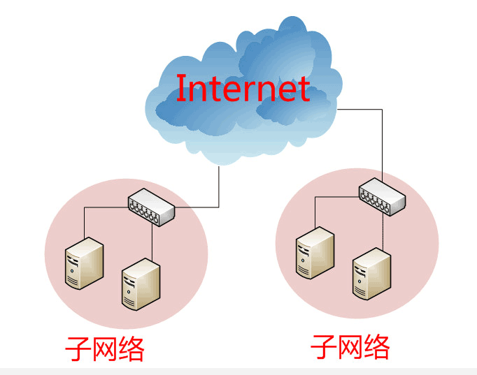
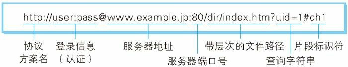
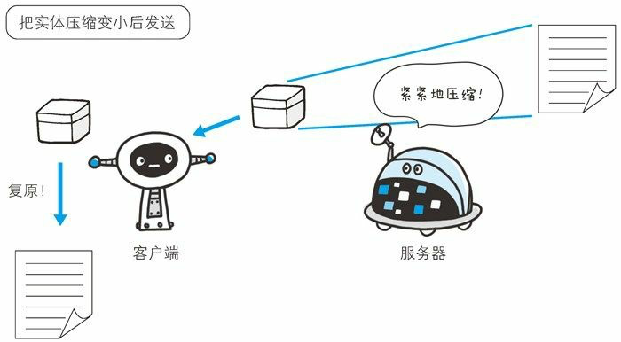

# 计网笔记

## 网络协议简介

### OSI模型

**用户<--->应用层<--->表示层<--->会话层<--->传输层<--->网络层<--->链路层<--->物理层<--->硬件**


**套接字提供的是上三层进入传输层的接口**

- 上三层处理具体网络应用的所有细节但对通信细节了解少 下四层对具体网络应用了解不多但可处理所有通信细节
- 上三层构成用户进程 下四层作为操作系统内核一部分提供

### 五层模型

**用户<--->应用层<--->传输层<--->网络层<--->链路层<--->物理层<--->硬件**

每一层都是为了完成某种功能 为了实现这些功能需要规定**各层都需遵守的规则：协议**

每层都有协议 **协议总称为互联网协议**


### 四层模型

**用户<--->应用层<--->传输层<--->网络层<--->物理链路层<--->硬件**

### TCP/IP协议


| 协议       | 描述                                                         |
| ---------- | ------------------------------------------------------------ |
| **IPv4**   | 使用**32位地址**为**TCP、UDP、SCTP、ICMP、IGMP**提供分组递送服务 |
| **IPv6**   | 使用**128位地址**为**TCP、UDP、SCTP、ICMPv6**提供分组递送服务 |
| **TCP**    | 传输控制协议 面向连接 使用套接字                             |
| **UDP**    | 用户数据报协议 无连接协议 使用数据报                         |
| **SCTP**   | 流控制传输协议                                               |
| **ICMP**   | 网络控制消息协议 处理在**路由器和主机之间流通的错误/控制信息** |
| **IGMP**   | 网络组管路协议 多播                                          |
| **ARP**    | 地址解析协议 IPv4->硬件地址                                  |
| **RARP**   | 反向地址解析协议 硬件地址->IPv4                              |
| **ICMPv6** | 综合ICMPv4、IGMP、ARP                                        |
| **BPF**    | BSD分组过滤器 提供对链路层访问能力                           |
| **DLPI**   | 链路层提供者接口 提供对链路层访问能力                        |

### 用户与协议的互动

#### 目标地址

发送应用层数据包需要知道对方的MAC地址和IP地址

#### 用户上网设置

##### 静态IP地址

设置以下四个参数才能实现静态IP上网

　* **本机的IP地址**
　　* **子网掩码**
　　* **网关的IP地址**
　　* **DNS的IP地址**

##### 动态IP地址

**自动分配动态IP**给计算机(**应用层-DHCP协议**)

### 实例：访问网页

#### 简易版

在浏览器地址栏键入URL，按下回车之后发生的几个事件：

1）浏览器向**DNS服务器请求解析该URL中的域名所对应的IP地址**

2）解析出IP地址后，**根据该IP地址和默认端口80，和服务器建立TCP连接**

3）浏览器发出**读取文件（URL中域名后面部分对应的文件）的HTTP请求**，该请求报文作为TCP三次握手的**第三个报文段发送给服务器**

4）服务器给出相应，**把对应的html文本发送给浏览器**

5）**释放TCP连接**

6）浏览器**将该文本显示出来**

#### 实际版

1. **设置好网络参数**(用户上网设置完成)
   1. **本机的IP地址：192.168.1.100**
   2. **子网掩码：255.255.255.0**
   3. **网关的IP地址：192.168.1.1**
   4. **DNS的IP地址：8.8.8.8**
2. 访问Google 向Google发送一个**网页请求数据包**
3. **DNS协议把网址**www.google.com**转换为IP地址** **向DNS的IP地址(8.8.8.8)发送DNS数据包(53端口)**
4. **DNS服务器响应** Google的IP为172.194.72.105 （**获得对方IP地址**）
5. 用**子网掩码判断IP地址是否在同一子网络**
   1. 子网掩码255.255.255.0
   2. 和本机自己的IP地址192.168.1.100 做AND运算 结果**192.168.1.0**
   3. 和Google的IP地址172.194.72.105做AND运算 结果**172.194.72.0**
   4. **Google与本机不在同一个子网络**
6. **通过网关192.168.1.1转发** **接收方的MAC地址将是网关的MAC地址**
7. **浏览网页用HTTP协议** HTTP协议**在TCP协议之上**
8. HTTP数据包嵌入TCP报文段 **本机选择端口 接收方Google的HTTP端口为80**
9. TCP数据包嵌入IP数据报 **设置双方IP地址** 发送方192.168.1.100（本机）接收方172.194.72.105（Google）
10. IP数据包嵌入帧 **设置双方的MAC地址** 发送方本机网卡地址 **接收方网关192.168.1.1的MAC地址(ARP协议)**
11. 多网关转发 收到帧 **按照IP分片序号 拼接**出完整数据包 **读取HTTP请求 做HTTP响应**
12. 本机收到响应显示网页

## 物理层

物理层是把**电脑连接起来的物理手段**(光缆/电缆/双绞线) 规定了网络的一些电器特性 主要作用是**传送电信号(0和1组成)**

## 链路层

链路层位于物理层上方 确定**电信号的分组解读方式**(多少电信号为一组/每个信号位有何意义)

### 以太网协议

#### **帧(Frame)**

为一组电信号构成的数据包 每个帧分为两部分：**标头(Head)和数据(Data)** 如**数据很长 需分多帧发送**

- **标头：数据包的说明项(包含发送者/接收者信息) 长度固定为18字节**
- **数据：数据包的具体内容 长度46～1500字节**


### MAC地址

以太网规定：**连入网络的所有设备都需要有网卡接口(帧在网卡之间传递)**

**MAC地址：定义了网卡地址** 即**帧的发送地址和接收地址** 用于定位网卡/帧的路经 **帧必须知道接收方的MAC地址才能发送**

每块网卡出厂都会拥有唯一的MAC地址 长度为48个二进制位(**12个十六进制数**) 

- 前6个十六进制数(00-B0-D0)为厂商编号
- 后6个十六进制数(86-BB-F7)是该厂商的网卡流水号


### 广播

1. **向同一子网络所有计算机发送帧**
2. **让每台计算机自行判断是否为接收方**
   1. **读取帧标头 找到接收方MAC地址**
   2. **与自身MAC地址比较**
      1. 相等 接受并处理帧
      2. 不相等 丢弃帧


### 网关

**两台主机不在同一个子网络时需要把IP数据报传送到两个子网络连接处的网关来处理**


### ARP协议

**两台主机在同一个子网络时(局域网)**可以使用该协议**得到对方的MAC地址**

**局域网每个主机都有ARP缓存(最近发起的IP地址->MAC地址映射记录 设超时值)**

1. 主机向局域网某个主机发送一个包含在帧中的数据包(包含查询主机的IP地址)
2. 先从自己的ARP缓存找
   1. 找到映射MAC地址直接发送
   2. 没有找到映射地址
      1. 在数据包中**对方的MAC地址这填FF:FF:FF:FF:FF:FF(广播地址)**
      2. 所有在子网络的主机都会收到这个数据包
      3. 从**数据包中取出IP地址 与自身IP地址进行比较**
         1. 两者**相同 向数据包发送者报告自己的MAC地址**
         2. 不相同 丢弃数据包

### 数据链路层

- 为IP模块发送和接受IP数据报
- 为ARP模块发送ARP请求和接受ARP应答
- 为RARP发送RARP请求和RARP应答

| IP协议     | ARP协议                                                      | RARP协议            |
| ---------- | ------------------------------------------------------------ | ------------------- |
| 定义IP地址 | **IP地址->MAC地址**                                          | **MAC地址->IP地址** |
| 网络层     | 网络层                                                       | 网络层              |
|            | **ARP攻击：伪造IP地址/MAC地址->ARP欺骗->产生大量ARP通信量->网络阻塞** |                     |

### 最大传输单元

#### MTU

**数据链路层中的网络对帧的长度都有限制** 不同链路层网络MTU值不同 以太网为1500字节

**MTU主要是为了限制一次传输的最大IP数据报的值** 如IP层数据报长度比数据链路层的MTU大->将IP数据报进行分片->每片小于MTU

| 网络                     | MTU(Byte) |
| ------------------------ | --------- |
| 超通道                   | 65535     |
| 16Mb/s 令牌环(IBM)       | 17914     |
| 4Mb/s 令牌环(IEEE 802.5) | 4464      |
| FDDI                     | 4352      |
| **以太网**               | **1500**  |
| IEEE 802.3/802.2         | 1492      |
| **X.25**                 | **576**   |
| 低时延                   | 296       |

#### 路径MTU

**路径MTU：两台通信主机路径中各网络(其链路层可能有不同的MTU)最小MTU** 取决于当时所选的路由->路径不对称时路径MTU不一致

可通过Traceroute确定路径MTU

1. 发送分组 设置IP首部不分片 
2. 第一个分组长度正好与出口MTU相等
3. 收到ICMP不可分片差错报文
4. 减少分组长度
5. 再用更小值重复1-4 直到找到最小MTU

## 网络层

网络层建立了**主机之间的通信**

以太网的**广播效率低且有局限性(**只能在发送者所在子网络中传递) 必须找到一种方法可以区分MAC地址所属网络



网络层引进一套新的地址(网络地址--**网址)来区分不同计算机是否属于同一个子网络** 网址由管理员分配

网址与MAC地址没有联系

- **网址确定计算机所在子网络** (先被处理)
- **MAC地址将帧送到子网络中目标网卡** (后被处理)

### IP协议

**IP协议：TCP/IP协议族中最核心的协议 规定网络地址 其定义的地址为IP地址** **为每台计算机分配IP地址 并确定哪些地址在同一子网络**

#### IPv4

网络地址由32个二进制组成 用分为4段段十进制数表示**IP地址** **0.0.0.0 ~ 255.255.255.255**


**IP地址分为两部分：网络和主机** （e.g. 假设前24位172.16.254为网络部分 后8位1为主机部分 则172.16.254.2处在同一子网络中）

**子网掩码**：定义IP地址的网络和主机位数 **判定两台计算机是否属于同一子网络** 形式上和IP地址无异 **网络部分全部为1 主机部分全部为0**

将**两个IP地址与子网掩码分别进行AND运算 结果如果相同则处于同一子网络**中 否则就不在

#### IP数据报

**TCP、UDP、ICMP、IGMP数据都以IP数据报的格式传输** 如果传输时**丢失IP数据报 IP协议会发送ICMP信息给信源(发送)端** 

IP数据报也包含两部分：标头和数据 **总长最大为65535字节**

- 标头：数据报的说明项(版本、长度、**IP地址**) **长度20～60字节**
- 数据：数据报的具体内容 长度最大为65515字节


将IP数据报放入帧中：

帧最大为1500字节 比IP数据报长度小很多 

**IP数据报超过1500字节时需要分割为几个帧分片传送 数据报不一定按序到达 但可到达目的地时按序重组** 


##### 格式


考虑网络承载能力时建议数据报大小：

- 实际**标准TCP/IP分组大小576字节**(为X2.5MTU 基本链路层最小MTU) 
- 实际数据大小为512字节(576-20(TCP)-20(IP)-24(路由协议头))

#### 校验和

仅**对IP数据报的首部进行校验**

#### IP路由选择

1. **优先搜索匹配主机**，能找到和IP地址完全一致的目标主机 向目标主机发包
2. 匹配主机失败，则**匹配同子网的路由器**，找到路由器，向路由器发包
3. 匹配同子网路由器失败，则**匹配同网号路由器**，找到路由器，向路由器发包
4. **搜索默认路由**且默认路由存在，则发包
5. 都失败 丢包

### ICMP协议

ICMP协议负责传递差错报文和其他需注意信息 通常被网络层或传输层使用 其数据**嵌入IP数据报中**传输

#### 差错报文

**IP数据报发生错误(主机/网络/协议/端口不可达)**时ICMP协议会发送差错报文给源主机**让网络层以上的协议做到可靠传输**

以下情况不会产生差错报文（防止广播风暴）：

- 差错报文本身
- 目的地址是广/多播地址的数据报
- 链路层广播数据报
- 不是IP分片的第一片
- 源地址不是单个主机的数据报

#### 查询报文

- **子网掩码查询**
- 时间戳查询
- **ping查询**

#### ping

ping是对两个TCP/IP系统进行**连通性测试**的工具 利用ICMP回显请求和应答报文 **不需经过传输层**

#### Traceroute

端口不可达：UDP数据报目的端口与正在使用的进程端口不符时会返回ICMP不可达报文

Traceroute用来侦测**源主机到目的主机之间所经过的路由情况** 利用ICMP报文和IP首部TTL字段

发送TTL字段为1的UDP数据报->收到ICMP超时报文->发送TTL字段+1的UDP数据报确定路径中的每个路由

->路由丢弃UDP数据报时返回ICMP超时报文->到达目的主机->ICMP选择不可达UDP端口->目的主机发送ICMP不可达报文

## 传输层

**端口：表示数据包供哪个进程使用 范围在0～65535 应用程序选用端口与服务器端口相连**

**传输层**就是**建立在端口间的通信** 确定主机和端口即能实现程序间通信进行程序开发 (Socket：Unix系统定义的主机+端口)

### UDP协议

UDP是**面向数据报协议**

#### UDP数据报

UDP数据报包含两部分：标头和数据 **理论总长最大为65535字节** 实际上会由于程序接口限制/IP数据报长度受限而长度变小

- 标头：数据包的说明项(发送/接收端口) **长度8字节**
- 数据：数据包的具体内容


将UDP数据报放入帧中：


#### 校验和

**对首部和数据都进行校验 可选**

#### 不可靠性

**没有超时/重传**功能 

**数据丢失会发送ICMP差错报文给源主机**

**关闭校验和时计算有误会将UDP数据报丢掉 不发送ICMP差错报文**

##### 数据报截断

**大于UDP数据报长度限制的数据报会被截断 数据丢失且不会收到任何通知**

### TCP协议

TCP协议即传输控制协议 TCP提供了**可靠的、面向连接的、面向字节流的**数据传输服务

- **可靠性：对端返回确认 无确认时自动重传并等待** 数次重传失败放弃传输(4-10min)
  - **TCP并不保证数据一定被对方接收** 
  - **数据可靠递送/故障可靠通知**：只能将数据送至对面 如果中途失败则通知用户(放弃重传+中断连接)
- **动态估算RTT**(客户和服务器往返时间)
- **数据排序**
- **流量控制**
- **拥塞控制**

#### TCP报文段


报文段首部为固定20字节

##### 源/目的端口号

**加上IP首部的源IP地址和目的IP地址，确定唯一的一个TCP连接**

通过**目的端口**来决定TCP将数据报交付于那个应用程序，**实现TCP的分用功能**

##### 序列号(Sequence Number)

占4个字节，序号的范围为[0,4284967296]

TCP是面向字节流的：在一个TCP连接中**传送的字节流中的每一个字节都按顺序编号**，首部中的序号字段则是指**本报文段所发送的数据的第一个字节的序号**

**序号循环使用**：当序号增加到最大值时，下一个序号就又回到了0

##### 确认号(Acknowledge Number)

当ACK标志位为1时有效，表示期望收到的下一个报文段的第一个数据字节的序号。

确认号为N，则表明到序号N-1为止的所有数据字节都已经被正确地接收到了。

##### 头部长度

TCP报文段的头部长度，它指出TCP报文段的数据部分的起始位置与TCP报文段的起始位置的距离。头部长度占4个字节，但它的单位是32位字，即以4字节为计算单位，因此头部长度的最大值为15*4=60个字节，这就意味着选项的长度不超过40个字节。

##### 保留位

必须为0

##### 六个控制位

**说明报文段的性质**

###### URG

与**首部中的紧急指针字段配合使用**

URG为1时，表明紧急指针字段有效，发送应用进程告诉发送方的TCP有紧急数据要传送 把**紧急数据插入到本报文段数据的最前面**

###### ACK

**仅当ACK=1时确认号字段才有效**，当ACK=0时，确认号无效

TCP规定，在**连接建立后所有的传送报文段都必须把ACK置1**

###### PSH

如果发送的报文段中PSH为1，则接收方接受到该报文段后，**直接将其交付给应用进程**，而不再等待整个缓存都填满后再向上交付。

###### RST

**复位标志**

RST=1时，表明TCP连接中**出现严重差错，必须释放连接，然后重新建立运输连接**。

###### SYN

**同步序号，用来发起一个连接** **SYN=1的报文段不能携带数据 但消耗一个序号**

当**SYN=1而ACK=0**时，表明这是一个**连接请求**报文段，若**对方同意建立连接**，在**响应的报文段SYN=1和ACK=1**

###### FIN

用来**释放一个连接**

当FIN=1时，表明**此报文段的发送方的数据已发送完毕，并要求释放连接**

##### 窗口

接收方让发送方下次发送报文段时设置的发送窗口的大小

##### 校验和

校验的字段范围包括**首部和数据**这两部分 端对端

##### 紧急指针

紧急指针当URG=1时才有效，它指出本报文段中的紧急数据的字节数 即使窗口为0时，也可发送紧急数据

##### 选项与填充

选项应该为4字节的整数倍，否则用0填充。最常见的**可选字段是最长报文大小MSS（Maximum Segment Size）**，每个连接方通常都在通信的**第一个报文段**中指明这个选项。它**指明本端所能接收的最大长度的报文段** 默认为536（20+20+536=576字节的IP数据报）

#### 连接过程

##### 一方主动连接--三次握手

1. 第一次握手
   1. **客户端**
      1. 主动打开 **CLOSED状态->SYN_SENT状态**
      2. 发送**连接请求**报文段(**SYN=1 ACK=0 sequence number=X**)
   2. **服务端**
      1. 未收到连接请求时 被动打开 CLOSE状态->LISTEN状态
2. 第二次握手
   1. **服务端**
      1. 收到连接请求报文段 **LISTEN状态->SYN_RCVD状态**
      2. 发送**连接请求确认**报文段(**SYN=1 ACK=1 sequence number=Y acknowledged number = X+1**)
3. 第三次握手
   1. **客户端**
      1. 收到服务端连接请求确认报文段 **SYN_SENT状态->ESTABLISHED状态**
      2. 发送**确认**报文段(**ACK=1 sequence number=X+1 acknowledged number=Y+1**)
   2. **服务端**
      1. 收到确认报文段 **SYN_RCVD状态->ESTABLISHED状态**


##### 双方同时主动连接

交换四个报文段(**双方的连接请求+连接请求确认**)


##### 为什么三次握手

**第三次握手防止已失效的请求报文段传送到服务端误判产生连接** 此时**客户端已经处于关闭状态 服务端只能等保活计时器超时才能释放连接 耗费服务器资源**


#### 释放过程

##### 一方主动释放--四次挥手

1. 第一次挥手
   1. **客户端**
      1. 主动关闭 **ESTABLISHED状态->FIN_WAIT1状态**
      2. 发送**连接释放**报文段(**FIN=1 ACK=1 sequence number=U acknowledged number=V**)
   2. **服务端**
      1. 未收到连接释放请求时 ESTABLISHED状态
2. 第二次挥手
   1. **服务端**
      1. 收到连接释放报文段 被动关闭  **ESTABLISHED状态->CLOSE_WAIT状态**
      2. 发送**确认**报文段(**ACK=1 sequence number=V acknowledged number=U+1**)
      3. **继续传输余下数据**
   2. **客户端**
      1. 收到确认报文段 **FIN_WAIT1状态->FIN_WAIT2状态**
3. 第三次挥手
   1. **服务端**
      1. 余下数据传输完成  **CLOSE_WAIT状态->LAST_ACK状态**
      2. 发送**连接释放**报文段(**FIN=1 ACK=1 sequence number=W acknowledged number=U+1**)
4. 第四次挥手
   1. **客户端**
      1. 收到连接释放报文段 **FIN_WAIT2状态->TIME_WAIT状态**
      2. 发送**确认**报文段(**ACK=1 sequence number=U+1 acknowledged number=W+1**)
      3. **等待2MSL TIME_WAIT状态->CLOSED状态**
   2. **服务端**
      1. 收到确认报文段 **LAST_ACK状态->CLOSED状态**


##### 双方同时释放连接

交换四个报文段(**双方的释放请求+释放请求确认+都等2MSL再关闭**)


##### 为什么等待2MSL

1. **保证客户端A发送的最后一个ACK可以到达服务端B 防止服务端B没有收到释放确认报文段而反复重传无法关闭**
2. **防止已失效的请求连接出现在当前连接中 任何迟到的报文段在2MSL时间内都会被丢弃**


#### MSS

MSS：**TCP报文段每次能传的最大数据分段** 当TCP报文段长度**大于MSS则需分段传输(端点重组)** 

该值会由发送/接收端双方协商决定 如用以太网一般为1460字节 用标准MTU则为536字节 最好取512倍数

#### 可靠性

1. 程序被分割为最合适发送的数据块(UDP数据报不会变)
2. 发送报文段时启动一个定时器 **等待对方确认收到报文段**
   1. 接收端**没及时收到 发送端重发**
   2. 接收端**收到报文段**
      1. **校验和有差错则丢弃报文段 不发送确认** 让**发送端超时重发**
      2. **校验和无差错则发送一个延迟确认**
3. 流量控制 防止较慢主机缓冲区溢出
4. 数据乱序时会**对数据重排序**
5. **丢弃重复IP数据报**

保持可靠性**主要靠超时重传** 但**如果ICMP报文丢失超时重传会失效** 最可靠方式：**只要得不到确认 发送方就重新发送直到得到确认为止**

#### 数据流类型

##### 交互数据流

**只需要做小流量数据交换（实时回显**等）针对**交互性要求高**的应用 在局域网不会堵塞 但**广域网中会出现网络拥塞** 

TCP提供两种策略提高数据发送效率从而降低网络负担：捎带ACK和Nagle算法

###### 捎带ACK

**接收端收到TCP报文段不立即发送ACK报文->等一段时间->等待过程中有接收端需要发送到发送端的数据->将该数据一同捎带ACK发送**

###### Nagle算法

**在TCP连接中只能有一个未被确认的报文段在传输**

##### 成块数据流

**传输数据量多且大** 针对**数据吞吐量要求高**的应用

###### 滑动窗口协议

允许发送端在**停止发送前和等待确认前可以连续发送多个分组** 加速数据传输

滑动窗口的滑动**以字节为单位** 发送/接收**窗口大小由三次握手前两次协商** **接收方使用累积ACK**

**窗口变化**

- **窗口合拢**：左边向右靠 **数据被发送后收到对方确认**
- **窗口张开**：右边向右移 **允许发送更多数据 另一端接收了已经确认的数据**
- **窗口收缩**：右边向左移 不建议 数据发送后不让发送导致窗口收缩
- 窗口不可能左移：收到向左移动ACK则为重复ACK 被丢弃

###### 发送接收缓冲区

- **缓冲空间和序号空间都是有限且可循环使用**的
- 滑动窗口大小**<=**收发缓冲区的大小

- 发送缓冲区：暂存发送方**准备发送的TCP报文段和已发送但尚未收到确认**的数据

- 接收缓冲区：暂存**按序到达但尚未被上层应用程序读取的数据和未按序到达**的数据

#### 流量控制(Flow Control)

**控制发送方速率** 使接收方及时接收

##### 示例

A是发送方 B是接收方 **rwnd(reveiver window)**即接收窗口大小


##### 糊涂窗口综合症

**接收方缓存已满且程序仅从接收方缓存一次读取1字节** **发送方收到1字节**rwnd 反复如此**效率很低**

解决

- **接收方等待一段时间再发送rwnd信息**
- **接收方缓存有一半空闲空间再发送rwnd信息**
- **发送方不发太小报文段 累积为足够大(接收方缓存一半以上)再发送报文段**

#### 四大定时器

##### 重传定时器

**计算TCP报文段超时重传时间**

- 每**发一个报文段**则**启动重传定时器** 
  - 定时器到时**未收到相应报文段确认** **重传报文段** 重传定时器**复位**
  - 定时器到时**收到相应报文段确认** **撤销**报文段重传定时器

##### 持续定时器

**解决零窗口通知导致的死锁问题**

1. TCP连接的一方收到对方的零窗口通知即启动持续计时器
2. 计时器到时发送零窗口探测报文段(1字节数据 序号不需要被确认且可持续重传)
   1. 对方收到探测报文段 确认目前的窗口值
      1. **窗口值仍为零** 将持续定时器**时间加倍重启**
      2. **窗口值不为零 打破死锁**
   2. 对方未收到探测报文段
      1. 在探测**报文段发出时同时启动重传定时器**
      2. **重传定时器超时 重传探测报文段**

##### 保活定时器

应对TCP连接间出现**长时间没有数据传输的情况**

1. **服务器每收到一次客户端的数据就重置保活计时器**(时间通常为2h)
2. 2h**没有收到客户端数据 服务端发送探测报文**
3. 之后**每隔75s发送一次**
4. **连续发送10次仍无响应 服务器终止连接**

##### 2MSL定时器

测量连接TIME_WAIT的时间(2MSL--报文段寿命的两倍) 

- **确保发送的最后一个ACK报文段能够到达对面** 
- **防止之前**与本连接相关由于**延迟失效的报文段而被误判为有效**

#### 拥塞控制(Congestion Control)

拥塞：**对网络中某一资源的需求超过了该资源所能提供的可用部分导致网络性能变差**

##### 拥塞控制算法

**防止过多数据注入网络使路由器/链路不会过载** 

假设**数据单方向传送且接收方缓存足够大(发送方的发送窗口由拥塞程度决定)** 且以**TCP报文段个数为讨论单位**

###### 慢开始&拥塞避免


###### 快重传&快回复


## 应用层

**应用层规定应用程序的数据格式 直接面对用户**

### 最终数据包结构


### DHCP协议

**建立在UDP协议之上**

DHCP规定：**每个子网络中**都有一个主机(**DHCP服务器)负责管理本网络所有IP地址** 

1. 当有新的计算机加入子网络 **需向DHCP服务器发送DHCP请求申请IP地址及相关网络参数** 
2. 请求数据包的结构为**以太网首部+IP首部+UDP首部+DHCP数据包**
3. 以太网首部设置**发送方的MAC地址(本机网卡地址)**和接收方(**DHCP服务器)的MAC地址(此时为广播地址)**
4. IP首部设置发送方IP地址和接收方IP地址（**此时都未知 发送方设为0.0.0.0 接收方设为255.255.255.255**）
5. UDP首部设置发送方端口和接收方端口（**DHCP协定为发送方68端口 接收方67端口**）
6. 广播发送数据包 **DHCP服务器通过IP首部信息判断出是发给自己**的
7. **DHCP服务器分配好IP地址** 发回**DHCP响应数据包** 
   1. 双方MAC地址
   2. **DHCP服务器IP地址(发送方IP)+广播地址(接收方IP)**
   3. 协定端口
   4. **分配的IP地址和具体参数包含在数据部分**
8. 新的计算机收到数据包 知晓各类参数(IP、子网掩码、网关IP、DNS的IP)

### URI & URL

#### URI 统一资源标识符

协议方案：访问资源时使用的协议类型名称(HTTP协议方案为http)

URI 即**Uniform Resource Identifier** 由**某协议方案表示资源的定位标识符** 用**字符串表示某互联网资源**

##### Uniform

规定**统一格式以处理多种资源**且无需根据上下文环境识别资源指定的访问方式

##### Resource

资源：**可标识的任何东西**

##### Identifier

标识符：**可标识的对象**

##### 绝对URI格式

**协议方案名**：获取访问资源时**指定的协议类型** 不分大小写 (例如http: 或 https:)

**登录信息(认证)**：指定获取服务端资源时的**登录信息** 可选

**服务器地址**：**DNS可解析的名称/IPv4/[IPv6]** 

**服务器端口号**：服务器连接的网络端口号 可选

**带层次的文件路径**：**服务器上的文件路径**(类似UNIX系统文件目录)来定位特指的资源

**查询字符串**：对已指定的文件路径内的资源**传入任意参数** 可选

**片段标识符**：标记出已获取资源中的**子资源**（文档内的某个位置）可选



#### URL 统一资源定位符

Uniform Resource Locator

表示资源地点在互联网中所处位置（网页地址） 是URI的子集 

### HTTP协议

HTTP协议用于**客户端和服务端间的通信**且在一条通信线路内**能明确区分两端角色**

**客户端：请求访问资源端**

**服务端：提供资源响应端**

#### HTTP报文(HTTP Message)

HTTP报文：由8位组字节流组成**用于HTTP协议交互的信息 是HTTP通信等基本单位** 

大致分为**报文首部和报文主体** 两者以空行划分 通常不一定有报文主体

##### **请求报文和响应报文结构**

请求报文由**方法、URI、HTTP 版本、HTTP 首部字段**等构成


响应报文由 **HTTP 版本、状态码（数字和原因短语）、HTTP 首部字段** 3 部分构成


**请求报文(上) 响应报文(下)实例**


##### HTTP首部

###### **报文首部**

报文首部内容**为两端分别处理请求和响应提供所需信息**

**报文首部**主要包括：

- **请求行：请求方法、请求URI、HTTP版本**
- **状态行：响应结果状态码、原因短语、HTTP版本**
- **首部字段：请求和响应的各种条件和属性的各类首部(通用首部、请求首部、响应首部、实体首部)**
- **其他**：RFC未定义首部(**Cookie**等)

###### **首部字段**

首部字段**为两端提供报文主体大小、所使用的语言、认证信息**等内容

由**首部字段名和字段值**构成

```
首部字段名: 字段值
Content-Type: text/html (表示报文主体对象类型)

可以有多个字段值
Keep-Alive: timeout=15, max=100

字段重复
优先处理第一次/最后出现
```

**通用首部字段**

双端都使用的首部

| 首部字段名            | 说明                           |
| --------------------- | ------------------------------ |
| **Cache-Control**     | **控制缓存的行为**             |
| **Connection**        | **逐跳首部、连接的管理**       |
| **Date**              | **创建报文的日期时间**         |
| **Pragma**            | **报文指令**                   |
| **Trailer**           | **报文末端的首部一览**         |
| **Transfer-Encoding** | **指定报文主体的传输编码方式** |
| **Upgrade**           | **升级为其他协议**             |
| **Via**               | **代理服务器的相关信息**       |
| **Warning**           | **错误通知**                   |

**请求首部字段**

请求报文中补充了**请求的附加内容、客户端信息、响应内容相关优先级**等内容

| 首部字段名          | 说明                                          |
| ------------------- | --------------------------------------------- |
| Accept              | 用户代理可处理的媒体类型                      |
| Accept-Charset      | 优先的字符集                                  |
| Accept-Encoding     | 优先的内容编码                                |
| Accept-Language     | 优先的语言（自然语言）                        |
| Authorization       | Web认证信息                                   |
| Expect              | 期待服务器的特定行为                          |
| From                | 用户的电子邮箱地址                            |
| Host                | 请求资源所在服务器                            |
| If-Match            | 比较实体标记（ETag）                          |
| If-Modified-Since   | 比较资源的更新时间                            |
| If-None-Match       | 比较实体标记（与 If-Match 相反）              |
| If-Range            | 资源未更新时发送实体 Byte 的范围请求          |
| If-Unmodified-Since | 比较资源的更新时间（与If-Modified-Since相反） |
| Max-Forwards        | 最大传输逐跳数                                |
| Proxy-Authorization | 代理服务器要求客户端的认证信息                |
| Range               | 实体的字节范围请求                            |
| Referer             | 对请求中 URI 的原始获取方                     |
| TE                  | 传输编码的优先级                              |
| User-Agent          | HTTP 客户端程序的信息                         |

**响应首部字段**

响应报文中补充了**响应的附加内容，也会要求客户端附加额外的内容信息**

| 首部字段名         | 说明                         |
| ------------------ | ---------------------------- |
| Accept-Ranges      | 是否接受字节范围请求         |
| Age                | 推算资源创建经过时间         |
| ETag               | 资源的匹配信息               |
| Location           | 令客户端重定向至指定URI      |
| Proxy-Authenticate | 代理服务器对客户端的认证信息 |
| Retry-After        | 对再次发起请求的时机要求     |
| Server             | HTTP服务器的安装信息         |
| Vary               | 代理服务器缓存的管理信息     |
| WWW-Authenticate   | 服务器对客户端的认证信息     |

**实体首部字段**

请求/响应报文**实体中补充了资源内容更新时间等实体有关信息**

| 首部字段名       | 说明                         |
| ---------------- | ---------------------------- |
| Allow            | 资源可支持的HTTP方法         |
| Content-Encoding | 实体主体适用的编码方式       |
| Content-Language | 实体主体的自然语言           |
| Content-Length   | 实体主体的大小（单位：字节） |
| Content-Location | 替代对应资源的URI            |
| Content-MD5      | 实体主体的报文摘要           |
| Content-Range    | 实体主体的位置范围           |
| Content-Type     | 实体主体的媒体类型           |
| Expires          | 实体主体过期的日期时间       |
| Last-Modified    | 资源的最后修改日期时间       |

**非HTTP/1.1首部字段**

**非正式**首部字段：**Cookie、Set-Cookie**、Content-Disposition

**End-to-end 首部 和 Hop-by-hop 首部**

**端到端首部转发给请求/响应的最终接收目标 必须保存在缓存生成的响应里 必须被转发**

**逐跳首部只对单次转发有效 通过缓存/代理时不再转发 使用时需提供Connection首部字段**

逐跳首部字段：Connection/Keep-Alive/Proxy-Authenticate/Proxy-Authorization/Trailer/TE/Transfer-Encoding/Upgrade

###### **HTTP/1.1通用首部字段**

###### Cache-Control

**操作缓存**

**缓存请求指令**

| 指令                | 参数   | 说明                                                         |
| ------------------- | ------ | ------------------------------------------------------------ |
| no-cache            | 无     | **强制向源服务器再次验证<br />不会接收缓存过的响应<br />不缓存过期的资源<br />** |
| no-store            | 无     | **不缓存请求或响应的任何内容** <br />请求中包含机密信息      |
| max-age = [ 秒]     | 必需   | **缓存时间数值比指定值小：接收缓存资源<br />指定值为0：缓存服务器把请求转发到源服务器** |
| max-stale( = [ 秒]) | 可省略 | **接收已过期的响应**                                         |
| min-fresh = [ 秒]   | 必需   | **期望在指定时间内的响应仍有效 <br />缓存服务器返回至少还未过指定时间的缓存资源** |
| no-transform        | 无     | 代理不可更改媒体类型                                         |
| only-if-cached      | 无     | **从缓存获取资源<br />缓存服务器不重新加载响应，也不会再次确认资源有效性** |
| cache-extension     | -      | 新指令标记（token）                                          |

**缓存响应指令**

| 指令             | 参数   | 说明                                                         |
| ---------------- | ------ | ------------------------------------------------------------ |
| public           | 无     | **可向任意方提供响应的缓存**                                 |
| private          | 可省略 | **仅向特定用户返回响应**                                     |
| no-cache         | 可省略 | **告知缓存服务器不能缓存资源<br />指定参数值时客户端收到后不能使用缓存<br />缓存前必须先确认其有效性** |
| no-store         | 无     | 不缓存请求或响应的任何内容 <br />**响应中包含机密信息**      |
| no-transform     | 无     | **代理/缓存不可更改媒体类型(防止压缩图片等)**                |
| must-revalidate  | 无     | **代理向源服务器再次验证即将返回的响应缓存目前是否仍然有效<br />无法连通缓存返回504(Gateway Timeout)<br />忽略请求的max-stale** |
| proxy-revalidate | 无     | 要求**中间缓存服务器对缓存的响应有效性再进行确认**           |
| max-age = [ 秒]  | 必需   | **缓存服务器不再对资源有效性进行确认<br />数值代表资源作为缓存的最长时间** |
| s-maxage = [ 秒] | 必需   | **公共缓存服务器**响应的最大Age值<br />使用该指令**直接忽略Expire字段/max-age指令** |
| cache-extension  | -      | **新指令标记（token）<br />可以扩展 Cache-Control 首部字 段内的指令<br />仅对能理解它的缓存服务器来说是有意义的** |

###### Connection

- **控制不再转发给代理的首部字段**

  - ```
    Connection: 不再转发的首部字段名
    ```

- **管理持久连接**

  - ```
    HTTP/1.1默认都是持久连接 服务端明确断开连接 可指定connection为close
    Connection: close
    
    旧版本的 HTTP 协议上维持持续连接 可指定connection为Keep-Alive
    Connection: Keep-Alive
    ```

###### Date

**创建HTTP报文的日期和时间**

###### Pragma

历史遗留字段 **只用于请求报文 要求所有中间服务器不返回缓存资源**

```
Pragma: no-cache

整体掌握全部中间服务器使用的HTTP协议版本
Cache-Control: no-cache 
Pragma: no-cache
```

###### Trailer

**事先说明在报文主体后记录了哪些首部字段** 用于HTTP/1.1分块传输编码时

```
Trailer: Expires
...(报文主体)...
0 
Expires: Tue, 28 Sep 2004 23:59:59 GMT
```

###### Transfer-Encoding

**规定了传输报文主体时采用的编码方式 HTTP/1.1仅对分块传输编码有效**

```
Transfer-Encoding: chunked
```

###### Upgrade

检**测 HTTP 协议及其他协议是否可使用更高的版本进行通信** 其**参数值可以用来指定一个完全不同的通信协议**

带Upgrade的请求 **101 Switching Protocols 状态码作为响应**


###### Via

**追踪报文转发 避免请求回环**


###### Warning

告知用户一些与缓存相关的问题的警告

```
Warning: [警告码][警告的主机:端口号]“[警告内容]”([日期时间])
```

| 警告码 | 警告内容                                          | 说明                                                         |
| ------ | ------------------------------------------------- | ------------------------------------------------------------ |
| 110    | Response is stale（响应已过期）                   | 代理返回已过期的资源                                         |
| 111    | Revalidation failed（再验证失败）                 | 代理再验证资源有效性时失败（服务器无法到达等原因）           |
| 112    | Disconnection operation（断开连接操 作）          | 代理与互联网连接被故意切断                                   |
| 113    | Heuristic expiration（试探性过期）                | 响应的使用期超过24小时<br />（有效缓存的设定时间大于24小时的情况下） |
| 199    | Miscellaneous warning（杂项警告）                 | 任意的警告内容                                               |
| 214    | Transformation applied（使用了转换）              | 代理对内容编码或媒体类型等执行了 某些处理时                  |
| 299    | Miscellaneous persistent warning（持久 杂项警告） | 任意的警告内容                                               |

##### HTTP状态码

HTTP状态码**表示客户端 HTTP 请求的返回结果、标记服务器端的处理是否正常、通知出现的错误**等情况

由**三位数字(第一位指定响应类别)和原因短语**组成

|         | 类别                                 | 原因短语                       |
| ------- | ------------------------------------ | ------------------------------ |
| **1XX** | **Informational（信息性状态码）**    | **接收的请求正在处理**         |
| **2XX** | **Success（成功状态码）**            | **请求正常处理完毕**           |
| **3XX** | **Redirection（重定向状态码）**      | **需要进行附加操作以完成请求** |
| **4XX** | **Client Error（客户端错误状态码）** | **服务器无法处理请求**         |
| **5XX** | **Server Error（服务器错误状态码）** | **服务器处理请求出错**         |

###### 200 OK

**从客户端发来的请求被服务器正确处理**

###### 204 No Content

**请求处理成功 返回响应报文中不含实体主体(无资源返回) 页面不更新** 一般只在**服务端不需要给客户端发送新信息内容**时使用

###### 206 Partial Content

客户端发送**范围请求** 服务端成功执行 **响应报文中包含由Content-Range指定范围的实体内容**

###### 301 Moved Permanently

**永久性重定向** 请求资源已被分配了新URI **以后都应使用新URI访问**

###### 302 Found

**临时性重定向** 请求资源已被分配了新URI **本次应使用新URI访问** 已移动的资源对应URI未来可能改变

###### 303 See Other

临时性重定向 请求资源存在另一个URI **应使用GET定向获取请求的资源** **和302相同功能但明确表示客户端应用GET获取资源** 

Note

当 **301、302、303** 响应状态码返回时，**几乎所有的浏览器都会把 POST 改成 GET，并删除请求报文内的主体，之后请求会自动再次发送** 

**301、302 标准是禁止将 POST 方法改变成 GET 方法的但实际使用时用户并不遵守**

###### 304 Not Modified

**客户端发送附带条件的请求(GET请求包含If-Match/If-ModifiedSince/If-None-Match/If-Range/If-Unmodified-Since 中任一首部)**

**服务端允许请求访问资源但未满足条件 不包含响应主体 和重定向无关**

###### 307 Temporary Redirect

**临时性重定向 和302相同含义 严格禁止POST变成GET**

###### 400 Bad Request

**表示请求报文存在语法错误**

###### 401 Unauthorized

**发送请求需要有认证信息（通过HTTP认证的）/ 如之前已有一次请求 则表示用户认证失败**


###### 403 Forbidden

**请求访问被服务端拒绝**(可能因为未获得访问授权、访问权限有问题等出现)

###### 404 Not Found

**服务器无法找到请求资源/拒绝请求不想说原因**

###### 500 Internal Server Error

**服务端执行请求发生错误**

###### 503 Service Unavailable

**服务器暂时处于超负载/停机维护状态 无法处理请求**

###### 状态码和状况不一致

例：Web 应用程序内部发生错误，状态码依然返回 200 OK

##### 多部分对象集合

**MIME机制**(Multipurpose Internet Mail Extensions **多用途因特网邮件扩展**)：**允许邮件处理文本、图片、视频等多个不同类型数据**

**多部分对象集合：用来容纳多份不同类型的数据**

HTTP采用了多部分对象集合：**报文主体内可含有多类型实体** **使用时需在首部字段加Content-type**

##### 获取部分内容

**可恢复机制：可从之前下载中断出恢复下载**

**范围请求：指定下载的实体范围来实现可恢复机制**

执行**范围请求用首部字段Range指定资源的byte范围** 

可响应范围请求时会**返回206 Partial Content响应报文** **不可响应范围请求时返回200 OK和完整实体内容**

```
5001~10000 字节
Range: bytes=5001-10000

从 5001 字节之后全部的
Range: bytes=5001-

从一开始到 3000 字节和 5000~7000 字节的多重范围
Range: bytes=-3000, 5000-7000
```

##### 内容协商

**当同一Web网站有不同形式但相同内容的页面时浏览器会根据内容协商显示对应形式的Web页面**

内容协商**以响应资源的语言、字符集、编码方式等作为判断基准**

###### 服务器驱动协商

由**服务端以请求首部字段为参考进行内容协商** 不一定筛选出最优形式

###### 客户端驱动协商

**由客户端(用户/JS脚本)从浏览器可选项列表手动选择** 

###### 透明协商

以上协商结合体 **两端各自进行内容协商**

#### HTTP实体(HTTP Entity)

HTTP实体是**请求或响应的有效载荷数据(补充项)** 由**实体首部和实体主体组成**

**通常报文主体即实体主体 当主体内容被编码时才会导致两者有差异**

##### 内容编码

指明**应用在实体内容上的编码格式** 保持**实体信息原样压缩** 编码后的实体**由客户端接收并解码**

常见内容编码：gzip、compress、deflate、identify(不编码)



##### 分块传输编码

传输大容量数据时**把实体主体数据分割成多块让浏览器逐步显示页面** 每块会用十六进制记录大小且最后一块使用0(CR+LF)标记


传输编码机制：HTTP/1.1在通信时按某种编码方式传输 仅作用于分块传输编码中

#### 无状态

HTTP是无状态协议 即**不保存请求和响应之间的通信状态** 在大量处理事务时可以确保协议的**可伸缩性** 

如需保持状态 就使用Cookie技术

#### 定位资源

**HTTP协议使用URI定位互联网资源** 客户端发送请求时**将请求URI包含在内**

```html
以 http://hackr.jp/index.htm 作为请求的例子

完整URI
GET http://hackr.jp/index.htm HTTP/1.1

首部字段Host写明网络域名/IP地址
GET /index.htm HTTP/1.1 
Host：hackr.jp
```

对服务器本身发送请求而不访问其他特定资源 用*代替请求URI

```
查询 HTTP 服务器端支持的 HTTP 方法种类
OPTIONS * HTTP/1.1
```

#### HTTP方法

##### GET--获取资源

**请求访问已被URI识别且经服务端解析后返回的响应内容**

| 请求 | GET /index.html HTTP/1.1 <br />Host: www.hackr.jp |
| ---- | ------------------------------------------------- |
| 响应 | 返回 index.html 的**页面资源**                    |

##### POST--传输实体的主体

POST**主要目的是传输实体主体而不是获取响应的主体内容**

| 请求 | POST /submit.cgi HTTP/1.1 <br />Host: www.hackr.jp <br />Content-Length: 1560（1560字节的数据） |
| ---- | ------------------------------------------------------------ |
| 响应 | 返回 submit.cgi 接收数据的处理结果                           |

##### GET vs POST

| GET                                         | POST                                                         |
| ------------------------------------------- | ------------------------------------------------------------ |
| 从服务器**获取数据**                        | 向服务器**传送数据**                                         |
| **参数值队列放到URL中**                     | 将表单内容放放在HTML HEADER内 **在URL上看不到**              |
| 服务端用**Request.QueryString**获取变量的值 | 服务端用**Request.Form**获取提交的数据                       |
| **数据量小**(<=2Kb)                         | **数据量大** 默认不限制                                      |
| 安全性低                                    | **安全性较GET高**                                            |
| 执行效率高 **比POST快**                     | 执行效率低<br />**请求包含更多首部字段<br />先发送请求头 后发送请求体(接收到100 continue响应再发)** |
| **适合查数据**                              | **适合数据增删改**                                           |

##### PUT--传输文件

PUT在**请求报文主力中包含文件内容然后保存到请求URI指定位置**

HTTP/1.1的PUT自身不带验证机制 存在安全性问题 可配合Web程序验证机制或REST标准解决

| 请求 | PUT /example.html HTTP/1.1 <br />Host: www.hackr.jp <br />Content-Type: text/html <br />Content-Length: 1560（1560 字节的数据） |
| ---- | ------------------------------------------------------------ |
| 响应 | 响应返回状态码 204 No Content（比如 ：该 html 已存在于服务器上） |

##### DELETE--删除文件

与PUT功能相反 **按请求URI删除指定资源** HTTP/1.1的DELETE同样不带验证机制

| 请求 | DELETE /example.html HTTP/1.1 <br />Host: www.hackr.jp       |
| ---- | ------------------------------------------------------------ |
| 响应 | 响应返回状态码 204 No Content（比如 ：该 html 已从该服务器上删除） |

##### HEAD--获得报文首部

与GET功能差不多 但**不返回报文主体部分** 用于**确认URI有效性和资源更新的日期时间**

| 请求 | HEAD /index.html HTTP/1.1 <br />Host: www.hackr.jp |
| ---- | -------------------------------------------------- |
| 响应 | 返回index.html有关的**响应首部**                   |

##### OPTIONS--询问支持的方法

OPTIONS用来**查询针对请求URI指定的资源支持**

| 请求 | OPTIONS * HTTP/1.1<br /> Host: www.hackr.jp                  |
| ---- | ------------------------------------------------------------ |
| 响应 | HTTP/1.1 200 OK <br />**Allow: GET, POST, HEAD, OPTIONS （返回服务器支持的方法）** |

##### TRACE--追踪路径

TRACE让**服务器端将以前的请求通信环回客户端** **客户端**可通过TRACE可以**查询发送出的请求是怎样被修改的**

不常用且易引发XST跨站追踪攻击

| 请求 | TRACE / HTTP/1.1 <br />Host: hackr.jp <br />Max-Forwards: 2  |
| ---- | ------------------------------------------------------------ |
| 响应 | HTTP/1.1 200 OK <br />Content-Type: message/http39<br />Content-Length: 1024<br/>TRACE / HTTP/1.1 <br />Host: hackr.jp <br />**Max-Forwards: 2（返回响应包含请求内容）** |

##### CONNECT--要求使用隧道协议连接代理

CONNET要求与代理服务器通信时建立隧道 实现隧道协议进行TCP通信 主要使用SSL/TLS把通信内容加密后经网络隧道传输

格式：**CONNECT 代理服务器名:端口号 HTTP版本**

| 请求 | CONNECT proxy.hackr.jp:8080 HTTP/1.1 <br />Host: proxy.hackr.jp |
| ---- | ------------------------------------------------------------ |
| 响应 | HTTP/1.1 200 OK（**之后进入网络隧道**）                      |

##### 使用方法下达命令

方法可以用于**指定请求的资源按期望产生某种行为**

| 方法    | 说明                   | 支持的 HTTP 协议版本 |
| ------- | ---------------------- | -------------------- |
| GET     | 获取资源               | 1.0、1.1             |
| POST    | 传输实体主体           | 1.0、1.1             |
| PUT     | 传输文件               | 1.0、1.1             |
| HEAD    | 获得报文首部           | 1.0、1.1             |
| DELETE  | 删除文件               | 1.0、1.1             |
| OPTIONS | 询问支持的方法         | 1.1                  |
| TRACE   | 追踪路径               | 1.1                  |
| CONNECT | 要求用隧道协议连接代理 | 1.1                  |
| LINK    | 建立和资源之间的联系   | 1.0                  |
| UNLINE  | 断开连接关系           | 1.0                  |

#### 节省通信量

HTTP协议的初始版本中，每进行一次 HTTP 通信就要断开一次TCP连接 **多资源请求时会造成TCP重复连接增加通信量**

##### 持久连接

解决以上通信量多开销问题 HTTP/1.1默认使用**持久连接(HTTP keep-alive)**方法解决

持久连接：**任意一端没有明确提出断开连接则一直保持TCP连接** **减少TCP连接重复建立/断开造成的额外开销 减轻服务器端负载**

##### 管线化

管线化pipelining：**不用等待响应可直接发送发送下一请求** **同一时刻并行发送多请求**

**请求数越多 管线化成效较持久连接更好**

#### Cookie--状态管理

Cookie技术在**请求和响应报文中写入Cookie信息以控制客户端状态**

1. **服务端在响应报文内设置首部字段信息Set-Cookie通知客户端保存Cookie** 
2. **下次客户端会自动在请求报文中加入Cookie值**
3. **服务端收到请求报文的Cookie 检查是哪一个客户端 对比服务器记录 得到相应客户端之前状态信息**


1. 请求报文（没有 Cookie 信息的状态）

```
GET /reader/ HTTP/1.1 
Host: hackr.jp 
*首部字段内没有Cookie的相关信息
```

2. 响应报文（服务器端生成 Cookie 信息）

```
HTTP/1.1 200 OK 
Date: Thu, 12 Jul 2012 07:12:20 GMT 
Server: Apache 
＜Set-Cookie: sid=1342077140226724; path=/; expires=Wed, 10-Oct-12 07:12:20 GMT＞ 
Content-Type: text/plain; charset=UTF-8
```


3. 请求报文（自动发送保存着的 Cookie 信息）

```
GET /image/ HTTP/1.1 
Host: hackr.jp 
Cookie: sid=1342077140226724
```

#### HTTP缺点

##### 明文通信

**HTTP报文使用明文方式发送**/**TCP/IP也可能被窃听**/**抓包工具Wireshark：获取HTTP请求/响应内容并解析**

##### 不验证通信方身份

**任何人都可发送请求**/**可能有伪装的服务端/客户端**/**无法确定通信的对方是否具备访问权限**/**无法阻止海量请求下的DoS拒绝服务攻击**

##### 无法证明报文完整性

**无法判断信息是否准确/接收内容可能有误(中间人攻击)/用散列值校验算法防止篡改但算法本身可能被篡改**

#### HTTPS

**HTTPS = HTTP+加密+认证+完整性保护**

##### SSL/TLS

HTTPS不是新协议 是**HTTP通信接口部分使用SSL(Secure Socket Layer)和TLS(Transport Layer Security)协议进行代替**

目前**主流版本SSL3.0和TLS1.0**

使用**SSL处理速度会变慢**

- **通信慢**
- **大量消耗CPU和内存资源**
- **SSL通信使HTTPS网络负载慢HTTP2～100倍**
- **必须进行加密处理消耗双端硬件资源**


##### 共享密钥加密

也叫**对称密钥加密 加密和解密共用同一密钥** 但在通信/传输过程中**发送密钥就有窃听风险 用公开密钥加密可以解决该问题**

##### 公开密钥加密

公开密钥加密使用**两把非对称密钥(私有密钥和公开密钥)** **密钥如果能够安全交换可仅使用公开密钥加密方式** 但是**速度比共享密钥加密慢**

**发送密文方使用对方(接收密文方)的公开密钥加密 接收密文方收到加密信息用自己的私有密钥解密**


**根据密文和公开密钥恢复信息原文需对离散对数求值 非常困难**

##### 公开密钥证书

单纯使用公开密钥加密**无法证明公开密钥的真实性** 由**数字证书认证机构(CA)和其相关机关颁发的公开密钥证书可以解决**该问题

###### 数字证书机构CA业务流程

1. **服务器运营人员向CA提出公开密钥申请**
2. **CA判明申请者身份 对已申请的公开密钥做数字签名 分配已签名的公开密钥 将公开密钥放入公钥证书并将两者绑定**
3. **服务器将公钥证书发送给客户端 进行公开密钥加密**
4. **客户端收到证书 使用其内公开密钥 对数字签名进行验证 验证通过**
   1. **认证服务器的公开密钥的是真实有效的CA**
   2. **服务器的公开密钥是真实的**


##### 混合加密机制

HTTPS采用共享密钥加密和公开密钥加密**共用**形式 各取其精华：**交换密钥使用公开密钥加密 建立通信交换报文使用共享密钥加密**


##### 安全通信机制

HTTPS通信步骤如下

1. 客户端发送**Client Hello报文(SSL版本+加密组件列表（加密算法及密钥长度等）)开始 SSL 通信**

2. 服务器以**Server Hello报文(SSL版本+客户端筛选出的加密组件)作为应答进行 SSL 通信**

3. 服务器**发送Certificate报文(公开密钥证书)**

4. 服务器发送**Server Hello Done报文**通知客户端**SSL首次握手协商部分结束**

5. 客户端发送**Client Key Exchange报文(包含Pre-master secret随机密码串且报文用服务端发送的公开密钥进行加密)**

6. 客户端发送**Change Cipher Spec报文(提示服务器，在此报文之后的通信会采用 Pre-master secret 密钥加密)**

7. 客户端发送**Finished报文(包含连接至今全部报文的整体校验值)**

8. 服务器发送**Change Cipher Spec报文**

9. 服务器发送**Finished 报文 第二次握手协商成功(正确解密客户端Finished报文)**

10. **Finished 报文交换 SSL连接建立完成 发送已被SSL保护的HTTP请求(附加MAC（Message Authentication Code）的报文摘要)**

11. **应用层协议通信，即发送 HTTP 响应(MAC 能够查知报文是否遭到篡改 保护报文的完整性)** 

12. 由**客户端断开连接发送 close_notify 报文** 之后再发送 TCP FIN 报文来**关闭与 TCP 的通信**


##### HTTPS缺点

**加密通信消耗CPU/内存资源 处理请求数量减少**

**购买证书开销大**

#### HTTP版本

##### HTTP1.0 vs HTTP1.1

| HTTP1.0                                                      | HTTP1.1                                                      |
| ------------------------------------------------------------ | ------------------------------------------------------------ |
| **默认每次请求都需要新建TCP连接**<br />(如需要持久连接heder加Connection： keep-alive) | **默认持久连接** 一个TCP连接可以传送多个请求                 |
| 无管线化                                                     | **管线化**/流水线处理请求 **服务端需要按请求顺序返回响应**   |
| 不支持Host请求头字段                                         | **支持Host请求头字段 <br />可明确表示访问Web站点<br />在一台Web服务器上可以在同一IP和端口上使用不同主机名(虚拟站点)** |
|                                                              | **支持状态管理、Cache缓存**相关请求/响应头                   |

##### HTTP1.1 vs HTTP2.0


#### 处理HTTP请求

1. **TCP连接 双端IP和Port Number放到Web服务器连接表(实时监听)** 

2. **接收HTTP请求**

3. **处理HTTP请求(解析请求头信息)**

   

4. **访问资源**

   1. **静态**资源：根据**URL地址去服务器找**
   2. **动态**资源：经过**CGI再用服务端脚本处理返回给前端**

5. **构建响应** 

   1. **找到资源** 响应信息：**响应对象类型、长度、状态码**
   2. **重定向响应 返回重定向** 客户端立即向重定向地址发请求

6. **发送响应** 把构建响应发送给客户端

7. **记录日志** **服务端**记录该请求响应过程

   


