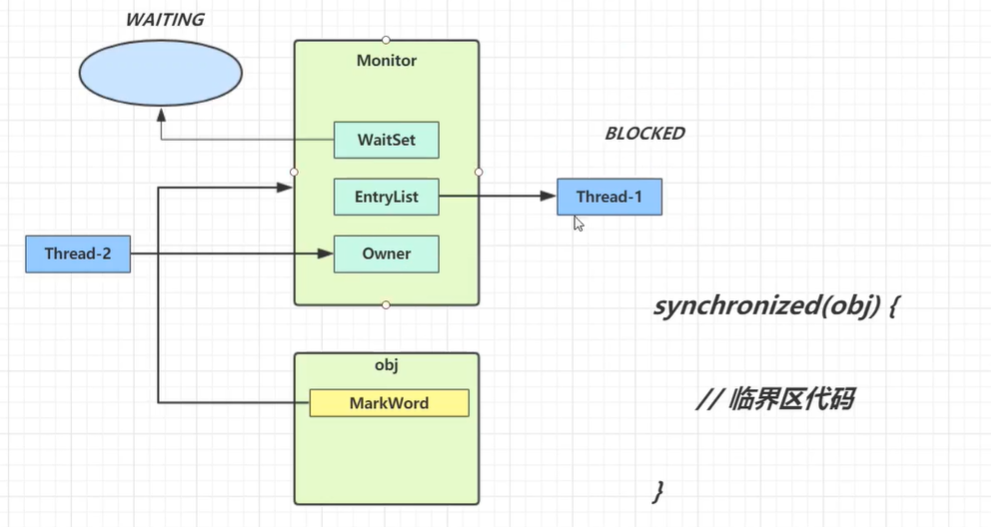
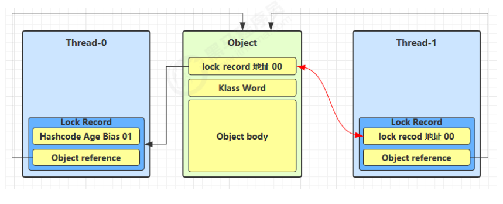
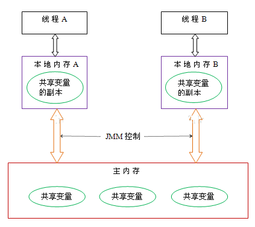
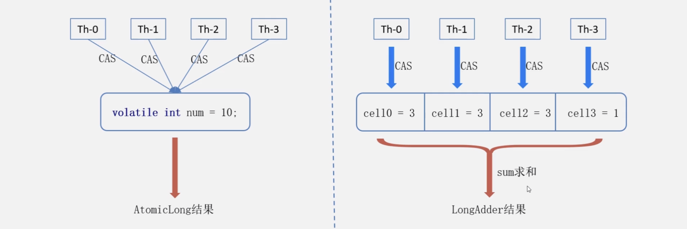
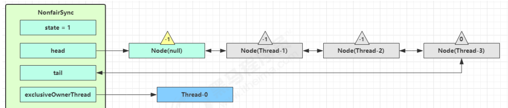

# 并发编程

## 进程与线程

### 进程概念

**进程(Process)**是系统进行**资源分配的基本单位** 可以视为**程序的一个动态实例**

### 线程概念

**线程(Thread)是进程内的指令流(基本CPU执行单元) 是系统独立调度的基本单位**

### 进程--线程对比

| 进程                                                         | 线程                                                         |
| ------------------------------------------------------------ | ------------------------------------------------------------ |
| 进程间**相互独立**                                           | 线程间**共享进程资源**(内存空间等)                           |
| **可包含多个线程**                                           | **进程的一个子集**                                           |
| **通信复杂**<br />同一计算机内进程通信**(IPC**)：<br />**信号量/共享存储/管道通信/消息队列**<br />**不同计算机内进程通信**：<br />**套接字** | **通信简单**(**多线程访问共享变量**)<br />**volatile/等待通知机制/join/ThreadLocal/MappedByteBuffer** |
| **上下文切换成本高**                                         | 上下文切换成本低                                             |

### 并行与并发

#### 并行(Concurrent)

**同一时刻 多个指令在单个cpu上交替执行**

**单个cpu通过任务调度器轮流处理多个线程的指令**


#### 并发(Parallel)

**同一时刻 多个指令在单个cpu上同时执行**

**多个cpu(每个cpu处理一个线程)并行处理每个线程**

如果**线程个数超出cpu核心个数，每个CPU还是会并发处理多个线程**


### 异步与同步

**异步：不需要等待结果返回能继续运行**

**同步：需要等待结果返回才能继续运行**

### 线程应用

1. **单核 cpu 下，多线程不能实际提高程序运行效率**
2. **多核 cpu 可以并行跑多个线程 但需要将任务合理设计才能提高程序运行效率**
3. **IO 操作不占用 cpu 但拷贝文件使用的是阻塞IO(线程需要等待IO结束--未充分利用线程) 需要非阻塞IO和异步 IO来进行优化**

## Java线程

### 创建和运行线程

#### Thread--线程和任务合并

Thread 创建线程方式：**创建线程类，匿名内部类方式**

* **start() 方法底层其实是给 CPU 注册当前线程，并且触发 run() 方法执行**
* **线程的启动必须调用 start() 方法(即多线程的实现)**，如**直接调用 run() 方法，主线程将执行该线程而不是调用线程**
* 建议线程先创建子线程，主线程的任务放在之后，否则主线程（main）永远先执行完

Thread 构造器：

* `public Thread()`
* `public Thread(String name)`

**优点：编码简单**

缺点：线程类已经继承了 Thread 类无法继承其他类了，功能不能通过继承拓展（**单继承的局限性**）

```java
// 构造方法的参数是给线程指定名字，推荐
Thread t1 = new Thread("t1") {
    @Override
    // run 方法内实现了要执行的任务
    public void run() {
        log.debug("hello");
    }
};
t1.start();
```

#### Runnable+Thread--线程和任务分开

Runnable 创建线程方式：创建线程类，匿名内部类方式

Thread 的构造器：

* `public Thread(Runnable target)`
* `public Thread(Runnable target, String name)`

优点：

1. 线程任务类只是**实现了 Runnable 接口**，可以继续继承其他类，**避免了单继承的局限性**

2. **同一个线程任务对象可以被包装成多个线程对象**

3. 适合多线程去共享同一资源

4. 实现**解耦操作**，线程任务代码可以被多个线程共享，线程**任务代码和线程独立**

5. **线程池可以放入实现 Runnable 或 Callable 线程任务对象**

缺点：代码复杂

```java
// 创建任务对象
Runnable task2 = new Runnable() {
    @Override
    public void run() {
        log.debug("hello");
    }
};

// 参数1（task2）是任务对象; 参数2（“t2”）是线程名字
Thread t2 = new Thread(task2, "t2");
t2.start();
```

**lambda简化**--有**FunctionalInterface注解**都可以简化

```java
// 创建任务对象
Runnable task2 = () -> log.debug("hello");

// 参数1 是任务对象; 参数2 是线程名字，推荐
Thread t2 = new Thread(task2, "t2");
t2.start();
```

#### Thread和Runnable原理

**Runnable易与线程池等高级API配合且让任务类脱离了Thread继承体系使Thread类使用更灵活**

1. **Thread 类本身也实现了 Runnable 接口** 类中有一个名为**target的成员变量** 
2. 如果**创建线程时传入Runnable的实例则会为target赋值**
3. **调用run方法**
   1. **target有值则执行runnable实例重写的run方法**
   2. **target无值则执行Thread实例重写的run方法**

```java
private Runnable target;

@Override
public void run() {
    if (target != null) {
        target.run();
    }
}
```

#### FutureTask+Thread

`public FutureTask(Callable<V> callable)`：未来任务对象，在线程执行完后得到线程的执行结果

**FutureTask 能够接收 Callable 类型的参数**，用来处理**有返回结果**的情况

优点：同 Runnable且**能得到线程执行的结果**

缺点：编码复杂

```java
// 创建任务对象 -- lambda简化
FutureTask<Integer> task3 = new FutureTask<>(() -> {
    log.debug("hello");
    return 100;
});

// 创建任务对象
FutureTask<Integer> task = new FutureTask<>(
  new Callable<Integer>() {
    @Override
    public Integer call() throws Exception {
      log.debug("hello");
      return 100;
    }
  }
);

// 参数1 是任务对象; 参数2 是线程名字
new Thread(task3, "t3").start();

// 主线程阻塞，同步等待 task 执行完毕的结果
Integer result = task3.get();
log.debug("结果是:{}", result);
```

### 查看进程/线程

#### windows

- 任务管理器可以查看进程和线程数，也可以用来杀死进程 
- `tasklist` 查看进程 
- `taskkill` 杀死进程 

#### linux 

- `ps -fe` 查看所有进程 
- `ps -fT -p <PID>` 查看某个进程（PID）的所有线程 
- `kill`杀死进程 
- `top` 按大写 H 切换是否显示线程 
- `top -H -p <PID>` 查看某个进程（PID）的所有线程 

#### Java 

- `jps` 命令查看所有 Java 进程 
- `jstack <PID>` 查看某个 Java 进程（PID）的所有线程状态 
- `jconsole` 来查看某个 Java 进程中线程的运行情况（图形界面）

### 线程运行原理

**每个线程都会使用一块Java虚拟机栈(简称栈)内存** 

**线程栈由多个栈帧(方法调用内存)组成 但每个线程只有一个活动栈帧对应当前执行方法**


#### 线程上下文切换

**因为以下一些原因导致 cpu 不再执行当前的线程，转而执行另一个线程的代码** 

- **线程的 cpu 时间片用完** 
- **垃圾回收** 
- **有更高优先级的线程需要运行** 
- **线程自己调用了 sleep、yield、wait、join、park、synchronized、lock 等方法** 

当上下文切换发生时，需要**由操作系统保存当前线程的状态**(程序计数器、虚拟机栈中每个栈帧的信息，如局部变量、操作数栈、返回地址等)，并**恢复另一个线程的状态**，Java 中使用每个线程栈的程序计数器来记住其下一条 jvm 指令的执行地址


### 常见方法


#### start() vs run()

##### start

使用 **start 是启动新的线程，此线程处于就绪（可运行）状态**，通过新的线程间接执行 run 中的代码

##### run

称为**线程体**，包含了要执行的这个线程的内容，方法运行结束，此线程随即终止 

**直接调用 run 是在主线程中执行了 run，没有启动新的线程**，需要顺序执行

**其异常不能抛出，只能 try/catch**

* 因为**父类中没有抛出任何异常，子类不能比父类抛出更多的异常**
* **异常不能跨线程传播回 main() 中**，因此**必须在本地进行处理**

#### sleep() vs yield()

##### sleep

* 调用 sleep 会让当前线程从 **`Running` 进入 `Timed Waiting` 状态（阻塞）**

  ```java
      public static void test_sleep() throws InterruptedException {
          Thread t = new Thread("t1") {
              @Override
              public void run() {
                  log.debug("t1 enter sleep");
                  try {
                      Thread.sleep(2000); // t1 sleep
  
                  } catch (InterruptedException e) {
                      throw new RuntimeException(e);
                  }
              }
          };
          t.start();
          log.debug("main enter sleep");
          Thread.sleep(1000); // main sleep
          log.debug("{}", t.getState()); // TIMED_WAITING
      }
  ```

* sleep过程中，**线程不会释放对象锁**

* **其它线程可以调用当前sleep线程的interrupt 方法打断正在睡眠的线程**，这时 sleep 方法会**抛出 InterruptedException**

  ```java
      public static void test_sleep_interrupt(){
          Thread t1 = new Thread("t1") {
              @Override
              public void run() {
                  log.debug("t1 enter sleep");
                  try {
                      Thread.sleep(2000); // t1 sleep
  
                  } catch (InterruptedException e) {
                      log.debug("t1 is interrupted");
                      e.printStackTrace();
                  }
              }
          };
          t1.start();
          log.debug("main enter sleep");
          try {
              Thread.sleep(1000); // main sleep
          } catch (InterruptedException e) {
              e.printStackTrace();
          }
          log.debug("interrupt t1");
          t1.interrupt();
      }
  ```

* **睡眠结束后的线程未必会立刻得到执行**，需要抢占 CPU

* 建议用 **TimeUnit 的 sleep 代替 Thread 的 sleep** 来获得更好的**可读性**

  ```java
  public static void test_sleep_timeunit() throws InterruptedException {
          log.debug("enter sleep");
          TimeUnit.SECONDS.sleep(1);
          log.debug("end sleep");
      }
  ```

###### sleep应用

在没有利用 cpu 来计算时，**不要让 while(true) 空转浪费 cpu**，这时可以**使用 yield 或 sleep 来让出 cpu 的使用权给其他程序**

```java
while(true) {
    try {
        Thread.sleep(50); // sleep 适用于无需锁同步的场景 
    } catch (InterruptedException e) {
        e.printStackTrace();
    }
}
```

**wait**防止空转浪费cpu

```java
synchronized(锁对象) {
    while(条件不满足) {
        try {
            锁对象.wait();
        } catch(InterruptedException e) {
            e.printStackTrace();
        }
    }
    // do sth...
}
```

**条件变量**防止空转浪费cpu

```java
lock.lock();
try {
    while(条件不满足) {
        try {
            条件变量.await();
        } catch (InterruptedException e) {
            e.printStackTrace();
        }
    }
    // do sth...
} finally {
    lock.unlock();
}
```

##### yield

* 调用 yield 会让当前线程从 **`Running` 进入 `Runnable` 状态 并提示线程调度器让出当前线程对 CPU 的使用**
* 具体的实现依赖于操作系统的任务调度器
* **会放弃 CPU 资源，锁资源不会释放**

```java
public static void test_yield() {
    Runnable r1 = () -> {
        int count = 0;
        for (int i = 0; i < 200; i++) {
            log.debug("---->1 " + "count "+ count++);
        }
    };
    Runnable r2 = () -> {
        int count = 0;
        for (int i = 0; i < 200; i++) {
            Thread.yield(); // t2 yield
            log.debug("                     ---->2 " + "count " + count++);
        }
    };
    new Thread(r1, "t1").start(); // t1 will generally finish first (depends on OS)
    new Thread(r2, "t2").start();
}
```

##### 线程优先级

- **线程优先级会提示调度器优先调度该线程**(仅仅是一个提示，调度器可以忽略它)
- 如果 **cpu 比较忙，那么优先级高的线程会获得更多的时间片**，但 cpu 闲时，优先级几乎没作用

```java
t1.setPriority(Thread.MIN_PRIORITY);
t2.setPriority(Thread.MAX_PRIORITY);
```

#### join()

##### 等待一个结果

```java
    static int result = 0;
    public static void main(String[] args) throws InterruptedException {
        test_join();
    }
    private static void test_join() throws InterruptedException {
        log.debug("main start");
        Thread t1 = new Thread(() -> {
            log.debug("t1 start");
            try {
                Thread.sleep(1000);
            } catch (InterruptedException e) {
                e.printStackTrace();
            }
            log.debug("t1 end");
            result = 10;
        }, "t1");
        t1.start();
        t1.join(); // 使当前(main)线程阻塞，等待t1线程执行完毕
        log.debug("result: {}", result); // result = 10
        log.debug("main end");
    }
```

##### 等待多个结果

```java
static int r1 = 0;
static int r2 = 0;
public static void main(String[] args) throws InterruptedException {
    test2();
}
private static void test2() throws InterruptedException {
    Thread t1 = new Thread(() -> {
        sleep(1);
        r1 = 10;
    });
    Thread t2 = new Thread(() -> {
        sleep(2);
        r2 = 20;
    });
    long start = System.currentTimeMillis();
    t1.start();
    t2.start();
    t1.join();
    t2.join();
    long end = System.currentTimeMillis();
  	// [main] honne.TestJoin - r1: 10 r2: 20 cost: 2008 以最多等待时间的线程为准(in this case: t2)
    log.debug("r1: {} r2: {} cost: {}", r1, r2, end - start);
}
```


##### 限时同步

```java
static int r1 = 0;
static int r2 = 0;
public static void main(String[] args) throws InterruptedException {
    test3();
}
public static void test3() throws InterruptedException {
    Thread t1 = new Thread(() -> {
        sleep(1); // 等够时间 r1: 10 r2: 0
      	sleep(3); // 没等够时间 r1: 0 r2: 0
        r1 = 10;
    });
    long start = System.currentTimeMillis();
    t1.start();
    // 线程执行结束会导致 join 结束
    t1.join(1500);
    long end = System.currentTimeMillis();
    log.debug("r1: {} r2: {} cost: {}", r1, r2, end - start);
}
```

#### interrupt()

`public void interrupt()`：**打断这个线程**，异常处理机制

`public static boolean interrupted()`：判断当前线程是否被打断，**打断返回 true，清除打断标记，连续调用两次一定返回 false**

`public boolean isInterrupted()`：**判断当前线程是否被打断，不清除打断标记**

**打断的线程会发生上下文切换**，操作系统会保存线程信息，抢占到 CPU 后会从中断的地方接着运行（打断不是停止）

##### 打断 sleep，wait，join 的线程 

sleep，wait，join都会让线程进入阻塞状态 

**打断 sleep 的线程, 会清空打断状态**

```java
private static void test1() throws InterruptedException {
    Thread t1 = new Thread(()->{
        sleep(1);
    }, "t1");
    t1.start();
    sleep(0.5);
    t1.interrupt();
    log.debug(" 打断状态: {}", t1.isInterrupted());
}

java.lang.InterruptedException: sleep interrupted
     at java.lang.Thread.sleep(Native Method)
     at java.lang.Thread.sleep(Thread.java:340)
     at java.util.concurrent.TimeUnit.sleep(TimeUnit.java:386)
     at cn.itcast.n2.util.Sleeper.sleep(Sleeper.java:8)
     at cn.itcast.n4.TestInterrupt.lambda$test1$3(TestInterrupt.java:59)
     at java.lang.Thread.run(Thread.java:745)
21:18:10.374 [main] c.TestInterrupt - 打断状态: false
```

##### 打断正常运行的线程

打断正常运行线程并**不会清空打断状态**

```java
private static void test2() throws InterruptedException {
    Thread t2 = new Thread(()->{
        while(true) {
            Thread current = Thread.currentThread();
            boolean interrupted = current.isInterrupted();
            if(interrupted) {
                log.debug(" 打断状态: {}", interrupted); // [t2] - 打断状态: true 
                break;
            }
        }
    }, "t2");
    t2.start();
    sleep(0.5);
    t2.interrupt();
}
```

##### 打断 park 线程

打断 park 线程, **不会清空打断状态**

```java
private static void test3() throws InterruptedException {
    Thread t1 = new Thread(() -> {
        log.debug("park...");
        LockSupport.park();
        log.debug("unpark...");
        log.debug("打断状态：{}", Thread.currentThread().isInterrupted());
      	LockSupport.park(); // 如果打断标记已经是 true, 则 park 会失效
      	log.debug("unpark..."); 
    }, "t1");
    t1.start();
    sleep(0.5);
    t1.interrupt();
}

23:19:31.041 [t1] DEBUG honne.interrupt - park...
23:19:32.045 [t1] DEBUG honne.interrupt - unpark...
23:19:32.046 [t1] DEBUG honne.interrupt - 打断状态：true
23:19:32.050 [t1] DEBUG honne.interrupt - unpark...
```

Note：**可以使用 Thread.interrupted() 清除打断状态**

```java
public static void test_park() {
  Thread t1 = new Thread("t1") {
    @Override
    public void run() {
      log.debug("park");
      LockSupport.park(); // 阻塞
      log.debug("unpark");

      log.debug("打断状态：{}", Thread.currentThread().isInterrupted()); // 打断标记为true
      LockSupport.park(); // 不阻塞
      log.debug("unpark with interrupt mark as true");

      log.debug("打断状态：{}", Thread.interrupted()); // 打断标记改为false
      LockSupport.park(); // 阻塞
      log.debug("unpark with interrupt mark as false"); // not print
    }
  };
  t1.start();
  try {
    Thread.sleep(1000);
  } catch (InterruptedException e) {
    e.printStackTrace();
  }
  t1.interrupt(); // 设置t1 running线程的中断标志位为true
}
```

#### 不推荐使用的方法

下列方法已过时，**容易破坏同步代码块，造成线程死锁**

* `public final void stop()`：停止线程运行

  废弃原因：方法粗暴，除非可能执行 finally 代码块以及释放 synchronized 外，**线程将直接被终止**，如果**线程持有 JUC 的互斥锁可能导致锁来不及释放，造成其他线程永远等待**

* `public final void suspend()`：**挂起（暂停）线程运行**

  废弃原因：如果目标线程在暂停时对系统资源持有锁，则在目标线程恢复之前没有线程可以访问该资源，如果**恢复目标线程的线程**在调用 resume 之前会尝试访问此共享资源，则会导致死锁

* `public final void resume()`：**恢复线程运行**

### 主线程&守护线程

**用户线程：平常创建的普通线程**

**守护线程**：服务于用户线程，只要**其它非守护线程运行结束了，即使守护线程代码没有执行完，也会强制结束**。守护进程是**脱离于终端并且在后台运行的进程**，脱离终端是为了避免在执行的过程中的信息在终端上显示

说明：当运**行的线程都是守护线程，Java 虚拟机将退出**(普通线程执行完后，JVM 是守护线程，不会继续运行下去)

常见的守护线程：

* **垃圾回收器线程就是一种守护线程**
* Tomcat 中的 Acceptor 和 Poller 线程都是守护线程，所以 Tomcat 接收到 shutdown 命令后，不会等待它们处理完当前请求

#### daemon

`public final void setDaemon(boolean on)`：如果是 true ，将此线程标记为守护线程 

线程**启动前**调用此方法：

```java
Thread t = new Thread() {
    @Override
    public void run() {
        log.debug("t开始运行...");
        sleep(2);
        log.debug("t运行结束...");
    }
};
// 设置该线程为守护线程
t.setDaemon(true);
t.start();

sleep(1);
log.debug("main运行结束...");


08:26:38.123 [t] c.TestDaemon - t开始运行...
08:26:39.215 [main] c.TestDaemon - main运行结束...
```

### 线程状态

#### 操作系统层面

- **初始状态**：仅是在**语言层面创建了线程对象**，还**未与操作系统线程关联** 
- **可运行状态（就绪状态）**：指**该线程已与操作系统线程关联，可以由 CPU 调度执行** 
- **运行状态**：指**获取了 CPU 时间片时的状态** 

- - 当 **CPU 时间片用完** 线程由**运行状态->可运行状态(上下文切换)**

- **阻塞状态**：**处于运行状态的线程调用阻塞API(如BIO)->进入阻塞状态 -> 阻塞IO操作完成->可运行状态**

- - **调度器不会调度没有被唤醒的处于阻塞状态的线程**

- **终止状态**：表示**线程已经执行完毕**，生命周期已经结束且不会再转换为其它状态


#### Java API 层面

`java.lang.Thread.State` 这个枚举中给出了六种线程状态：

| 线程状态                       | 导致状态发生条件                                             |
| ------------------------------ | ------------------------------------------------------------ |
| **NEW（新建）**                | 线程刚被创建，但是并未启动，还**没调用 start 方法**，只有线程对象，没有线程特征 |
| **Runnable（可运行）**         | **线程可以在 Java 虚拟机中运行的状态**，可能正在运行自己代码，也可能没有，这取决于操作系统处理器，调用了 t.start() 方法：就绪（经典叫法） |
| **Blocked（阻塞）**            | 当一个线程**试图获取一个对象锁，而该对象锁被其他的线程持有，则该线程进入 Blocked 状态**；当该线程**持有锁时，该线程将变成 Runnable 状态** |
| **Waiting（无限等待）**        | 一个线程在**等待另一个线程执行一个（唤醒）动作(notify/notifyAll)时，该线程进入 Waiting 状态**，进入这个状态后**不能自动唤醒自己** |
| **Timed Waiting （限期等待）** | **调用有超时参数的方法(Thread.sleep 、Object.wait)，将进入 Timed Waiting 状态**，这一状态将**一直保持到超时期满或者被唤醒时** |
| **Teminated（结束）**          | run 方法**正常退出而死亡**，或者因为**没有捕获的异常终止了 run 方法而死亡** |

1. **NEW → RUNNABLE：调用 t.start() 方法**
2. **RUNNABLE <--> WAITING：**调用 **obj.wait()** 方法时 **调用 obj.notify()、obj.notifyAll()、t.interrupt()**
   1. **竞争锁成功**，t 线程从 **WAITING → RUNNABLE**
   2. 竞争锁**失败**，t 线程从 **WAITING → BLOCKED**
3. **RUNNABLE <--> WAITING：**当前线程**调用 t.join() 方法（当前线程在 t 线程对象的监视器上等待 即等待t运行完成）**
4. **RUNNABLE <--> WAITING：**当前线程**调用 LockSupport.park() / LockSupport.unpark(t) 方法** 
5. **RUNNABLE <--> TIMED_WAITING：**当前线程调用 **obj.wait(long n) 方法/调用 obj.notify()、obj.notifyAll()**
6. **RUNNABLE <--> TIMED_WAITING：**当前线程调用 **t.join(long n)** 方法
7. **RUNNABLE <--> TIMED_WAITING：**当前线程调用 **Thread.sleep(long n)** 方法
8. **RUNNABLE <--> TIMED_WAITING：**当前线程调用 **LockSupport.parkNanos()/LockSupport.parkUntil() 方法/调用LockSupport.unpark(t) 方法**
9. **RUNNABLE <--> BLOCKED：**t 线程用 **synchronized(obj) 获取了对象锁时竞争失败/成功**
10. **RUNNABLE <--> TERMINATED：线程执行完毕**


## 共享模型--管程(悲观锁 阻塞)

### 线程共享问题

#### 临界区

**多线程**对**共享资源**进行**读写操作**的区域为**临界区**

#### 竞态条件

**多个线程在临界区内执行**且由于彼此代码**执行序列不同**导致**结果无法预测**则发生**竞态条件**

#### 避免临界区竞态条件

- **阻塞式**
  - **synchronized**：**对象锁 保证临界区内代码的原子性** 避免线程自行上下文切换
    - **互斥：保证临界区的竞态条件不发生 同一时刻只有一个线程执行临界区代码**
    - **同步：由于线程执行的先后顺序不同 需要一个线程等待其他线程运行到某条指令**
  - **lock**
- **非阻塞式**
  - **原子变量**

### synchronized

#### 三大特性

synchronized 可以保证**原子性、可见性、有序性(共享变量完全被其保护才可保证)**

**synchronized 无法禁止指令重排和处理器优化，为什么可以保证有序性可见性**

* **加锁后同一时间只有一个线程执行(相当于单线程) 单线程的数据依赖性的存在保证了指令重排没有问题**
* **线程加锁前，将清空工作内存中共享变量的值，使用共享变量时需要从主内存中重新读取最新的值**
* **线程解锁前，必须把共享变量的最新值刷新到主内存中**

#### 使用锁

**锁对象**：理论上可以是**任意的唯一对象** 建议使用**共享资源**

**临界区的代码对外是不可分割(不会被线程上下文切换打断)的**

##### 同步代码块

###### 同步代码块语法

```java
synchronized(锁对象){
	// 访问共享资源的核心代码(临界区代码)
}
```

###### 实例

```java
public class demo {
    static int counter = 0;
    // static修饰，则该唯一元素是属于类本身的，不属于对象，只与类一起加载一次
    static final Object room = new Object();
    public static void main(String[] args) throws InterruptedException {
        Thread t1 = new Thread(() -> {
            for (int i = 0; i < 5000; i++) {
                synchronized (room) {
                    counter++;
                }
            }
        }, "t1");
        Thread t2 = new Thread(() -> {
            for (int i = 0; i < 5000; i++) {
                synchronized (room) {
                    counter--;
                }
            }
        }, "t2");
        t1.start();
        t2.start();
        t1.join();
        t2.join();
        System.out.println(counter);
    }
}
```

##### 同步方法

**synchronized 修饰的方法即为同步方法**

**同步方法不具备继承性**，所以其子类是线程不安全的，如果**子类的方法也被 synchronized 修饰**，**两个锁对象其实是一把锁(子类对象)**

###### 同步方法语法

```java
//同步方法
修饰符 synchronized 返回值类型 方法名(方法参数) { 
	方法体；
}
//同步静态方法
修饰符 static synchronized 返回值类型 方法名(方法参数) { 
	方法体；
}
```

###### 实例方法

默认用 **this 作为锁对象**

```java
public synchronized void test() {} //等价于
public void test() {
    synchronized(this) {}
}
```

###### 静态方法

默认用**类名 .class 作为锁对象**

```java
class Test{
	public synchronized static void test() {}
}
//等价于
class Test{
    public void test() {
        synchronized(Test.class) {}
	}
}
```


##### 线程八锁

主要关注**锁住的对象是不是同一个**

* **锁住类对象**，**所有类的实例的方法都是安全**的，类的所有实例都相当于同一把锁
* **锁住 this 对象**，只有在**当前实例对象的线程内是安全**的，如果有**多个实例就不安全**
* **同一个类对象中的静态方法(类对象)和非静态方法(对象实例)上锁**之间**不会冲突**
* **不同对象实例间非静态方法(实例)执行不会冲突**，非静态方法属于实例
* **不同对象实例间静态方法执行会冲突**，静态方法属于类

1. 线程安全：同一个对象实例 1->2 或 2->1

```java
class Number{
    public synchronized void a() {
        log.debug("1");
    }
    public synchronized void b() {
    	log.debug("2");
    }
}

public static void main(String[] args) {
    Number n1 = new Number();
    new Thread(()->{ n1.a(); }).start();
    new Thread(()->{ n1.b(); }).start();
}

```

2. 线程安全：同一个对象实例 1秒后1->2 或 2->1秒后1

```java
class Number{
    public synchronized void a() {
        sleep(1);
        log.debug("1");
    }
    public synchronized void b() {
        log.debug("2");
    }
}

public static void main(String[] args) {
    Number n1 = new Number();
    new Thread(()->{ n1.a(); }).start();
    new Thread(()->{ n1.b(); }).start();
}

```

3. 线程不安全：c方法没有加锁  3->1秒后1->2 或 2->3->一秒后1 或 3->2->一秒后1

```java
class Number{
    public synchronized void a() {
        sleep(1);
        log.debug("1");
    }
    public synchronized void b() {
        log.debug("2");
    }
    public void c() {
        log.debug("3");
    }
}

public static void main(String[] args) {
    Number n1 = new Number();
    new Thread(()->{ n1.a(); }).start();
    new Thread(()->{ n1.b(); }).start();
    new Thread(()->{ n1.c(); }).start();
}

```

4. 线程不安全：a和b同步方法所属为不同实例 2->1秒后1

```java
class Number{
    public synchronized void a() {
        sleep(1);
        log.debug("1");
    }
    public synchronized void b() {
        log.debug("2");
    }
}

public static void main(String[] args) {
    Number n1 = new Number();
    Number n2 = new Number();
    new Thread(()->{ n1.a(); }).start();
    new Thread(()->{ n2.b(); }).start();
}

```

5. 线程不安全：a锁住类对象/b锁住实例对象 2->1秒后1

```java
class Number{
    public static synchronized void a() {
        sleep(1);
        log.debug("1");
    }
    public synchronized void b() {
    	log.debug("2");
    }
}

public static void main(String[] args) {
    Number n1 = new Number();
    new Thread(()->{ n1.a(); }).start();
    new Thread(()->{ n1.b(); }).start();
}
```

6. 线程安全：a和b都锁住类对象 2->1秒后1 或 1秒后1->2

```java
class Number{
    public static synchronized void a() {
        sleep(1);
        log.debug("1");
    }
    public static synchronized void b() {
        log.debug("2");
    }
}
    
public static void main(String[] args) {
    Number n1 = new Number();
    new Thread(()->{ n1.a(); }).start();
    new Thread(()->{ n1.b(); }).start();
}
```

7. 线程不安全：a锁住类对象/b锁住n2实例对象 2->1秒后1

```java
class Number{
    public static synchronized void a(){
        Thread.sleep(1000);
        System.out.println("1");
    }
    public synchronized void b() {
        System.out.println("2");
    }
}
public static void main(String[] args) {
    Number n1 = new Number();
    Number n2 = new Number();
    new Thread(()->{ n1.a(); }).start();
    new Thread(()->{ n2.b(); }).start();
}
```

8. 线程安全：a和b都锁住类对象 2->1秒后1 或 1秒后1->2

```java
class Number{
    public static synchronized void a(){
		Thread.sleep(1000);
        System.out.println("1");
    }
    public static synchronized void b() {
        System.out.println("2");
    }
}
public static void main(String[] args) {
    Number n1 = new Number();
    Number n2 = new Number();
    new Thread(()->{ n1.a(); }).start();
    new Thread(()->{ n2.b(); }).start();
}
```

### 线程安全分析

#### 成员变量和静态变量

* **没有被共享 线程安全**
* **被共享** 根据其状态是否能够改变(写)
  * **只有读操作 线程安全**
  * 有**读写操作 需要考虑线程安全问题**

#### 局部变量

* **本身线程安全**

* 引用的对象不一定线程安全（**逃逸分析**）

  * **引用对象没有逃离方法的作用访问 线程安全**(方法**各自有对应栈帧存储**)
  * **引用对象逃离方法的作用范围 需要考虑线程安全问题**
    * **暴露引用**：**其他传入局部变量的public方法被子类重写** 
    * 防止子类重写：**用private修饰传入局部变量的方法+用final修饰有公共局部变量资源的方法** 

* ```java
  public static void test() {
    int i = 10;
  	i++;
  }
  i++对应字节码只有一条指令iinc
  iinc		0, 1
  ```

#### 常见线程安全类

**String、Integer、StringBuffer、Random、Vector、Hashtable、java.util.concurrent(JUC)包中的类**

##### 方法调用线程安全分析

Note：**多个线程调用这些类同一个实例的单个方法(保证了其原子性)时线程安全 但多个方法组合保证不了原子性 只能保证方法内部安全**

```java
Hashtable table = new Hashtable();
// 线程1，线程2
if(table.get("key") == null) {
	table.put("key", value);
}
```


##### 无状态类

线程安全 **没有成员变量的类**

##### 不可变类

**线程安全** **String、Integer** 等由于**内部的状态不可以改变** 所以**方法线程安全**

例如String.**replace/substring方法**其底层是**新建一个对象，然后进行复制返回**

##### 实例分析

```java
Map<String,Object> map = new HashMap<>();	// 线程不安全
String S1 = "...";							// 线程安全
final String S2 = "...";					// 线程安全
Date D1 = new Date();						// 线程不安全
final Date D2 = new Date();					// 线程不安全，final让D2引用的对象不能变，但对象的内容可以变
```

**外星方法：抽象方法如果有局部变量参数，被重写后行为不确定可能造成线程不安全** 如`public abstract foo(Student s);`

```java
public class MyServlet extends HttpServlet {
  // 线程不安全
  private UserService userService = new UserServiceImpl();
	public void doGet(HttpServletRequest request, HttpServletResponse response) { 
    userService.update(...);
  }
}

public class UserServiceImpl implements UserService {
  // 成员变量 记录调用次数 
  private int count = 0;
  public void update() {
    // 临界区 没上锁
		count++;
	}
}
```

```java
public class MyServlet extends HttpServlet {
  // 线程安全 -- UserServiceImpl线程安全
  private UserService userService = new UserServiceImpl();
	public void doGet(HttpServletRequest request, HttpServletResponse response) { 
    userService.update(...);
  }
}

public class UserServiceImpl implements UserService {
  // 线程安全 -- 成员变量可共享 但UserDaoImpl中没有会被更改的属性
	private UserDao userDao = new UserDaoImpl();
  
	public void update() {
		userDao.update();
	}
}

// 线程安全 -- 无状态类(类中没有成员变量)
public class UserDaoImpl implements UserDao {
	public void update() {
    String sql = "update user set password = ? where username = ?";
    // 线程安全 -- 局部变量conn
    try (Connection conn = DriverManager.getConnection("","","")){
      ...
		} catch (Exception e) {
      ...
		}
	}
}
```

```java
public class MyServlet extends HttpServlet {
  // 线程不安全 -- UserServiceImpl线程不安全
  private UserService userService = new UserServiceImpl();
	public void doGet(HttpServletRequest request, HttpServletResponse response) { 
    userService.update(...);
  }
}

public class UserServiceImpl implements UserService {
  // 线程不安全 -- UserDaoImpl中成员变量可共享
	private UserDao userDao = new UserDaoImpl();
  
	public void update() {
		userDao.update();
	}
}

// 线程不安全 -- 类中有成员变量
public class UserDaoImpl implements UserDao {
  // 线程不安全 -- conn为共享成员变量
  private Connection conn = null;
	public void update() throws SQLException {
    String sql = "update user set password = ? where username = ?";
    conn = DriverManager.getConnection("","","");
    conn.close();
	}
}
```

### 锁原理

以32位虚拟机为例

- 普通对象
  - 对象头 64 bits <-> 8 bytes
    - Mark Word 32 bits <-> 4 bytes
    - Klass Word 32 bits <-> 4 bytes
- 数组对象
  - 对象头 96 bits <-> 12 bytes
    - Mark Word 32 bits <-> 4 bytes
    - Klass Word 32 bits <-> 4 bytes
    - array length 32 bits <-> 4 bytes

#### Mark Word 结构


#### Monitor 监视器/管程

每个 Java 对象都可以关联一个 Monitor 对象，Monitor 也是 class，其**实例存储在堆中**，如果使用 synchronized 给对象上锁（重量级）之后，该对象头的 Mark Word 中就被设置指向 Monitor 对象的指针，这就是重量级锁

##### 工作流程

* **开始时** Monitor 中 **Owner 为 null**
* 当 **Thread-2 执行 synchronized(obj)** 就会将 Monitor 的所有者 **Owner 置为 Thread-2**，Monitor 中只能有一个 Owner，**obj 对象的 Mark Word 指向 Monitor**，把**对象原有的 MarkWord 存入线程栈中的锁记录**中（轻量级锁部分详解）



* 在 Thread-2 上锁的过程，**Thread-3/4/5也执行 synchronized(obj)**，就会**进入 EntryList** BLOCKED（双向链表）
* **Thread-2 执行完**同步代码块的内容，**根据 obj 对象头中 Monitor 地址寻找**，设置 **Owner 为空**，把**线程栈的锁记录中的对象头的值设置回 MarkWord**
* **唤醒 EntryList 中等待的线程来竞争锁**，竞争是**非公平的**，如果这时有新的线程想要获取锁，可能直接就抢占到了，阻塞队列的线程就会继续阻塞


- **WaitSet** 中的 Thread-0/1，是**以前获得过锁，但条件不满足进入 WAITING 状态的线程（wait-notify 机制）**

注意：

* synchronized 必须是进入**同一个对象的 Monitor** 才有上述的效果
* 不加 synchronized 的对象不会关联监视器，不遵从以上规则

##### 字节码工作原理

```java
public class Main {
    static final Object lock = new Object();
    static int counter = 0;
    public static void main(String[] args) {
        synchronized (lock) {
            counter++;
        }
    }
}
```

```java
  public static void main(java.lang.String[]);
    descriptor: ([Ljava/lang/String;)V
    flags: (0x0009) ACC_PUBLIC, ACC_STATIC
    Code:
      stack=2, locals=3, args_size=1
         0: getstatic     #2 // lock引用 synchronized开始     // Field lock:Ljava/lang/Object; 
         3: dup
         4: astore_1				 // lock引用 -> slot 1							
         5: monitorenter		 // 将lock对象的Mark Word设为Monitor指针
         6: getstatic     #3 // <-counter                 // Field counter:I
         9: iconst_1				 // 准备常数counter
        10: iadd						 // counter++
        11: putstatic     #3 // ->counter                  // Field counter:I
        14: aload_1					 // <-lock引用
        15: monitorexit			 // 将lock对象的Mark Word重置 唤醒Entry List
        16: goto          24
        19: astore_2				 
        20: aload_1
        21: monitorexit
        22: aload_2
        23: athrow
        24: return
      Exception table:
         from    to  target type
             6    16    19   any
            19    22    19   any
      LineNumberTable:
        line 7: 0
        line 8: 6
        line 9: 14
        line 10: 24
      LocalVariableTable:
        Start  Length  Slot  Name   Signature
            0      25     0  args   [Ljava/lang/String;

```

Note：**方法级别的 synchronized 不会在字节码指令中有所体现**

### 锁升级(synchronized锁优化)

#### 升级过程

**synchronized 是可重入、不公平的重量级锁** **JDK6后**对其进行了**优化**

**Mark Word后三位**

- **001 无锁**
- **101 偏向锁**
- **X00 轻量级锁**
- **X10 重量级锁**

**无锁 -> 偏向锁 -> 轻量级锁 -> 重量级锁**	**(随着竞争的增加，只能锁升级，不能降级)**


#### 偏向锁

**由于轻量级锁每次重入仍然需要执行 CAS 操作** **JDK 6后引入偏向锁来优化**

偏向锁：**偏向于让第一个获取锁对象的线程**，这个线程**之后重新获取该锁不再需要同步操作**

* 当锁对象第一次被线程获得的时候进入偏向状态，**Mark Word后三位标记为 101**，同时**使用 CAS 操作将线程 ID(前54位) 记录到 Mark Word**。如果 **CAS 操作成功**，这个线程以后进入这个锁相关的同步块，**查看这个线程 ID 是自己的就表示没有竞争，就不需要再进行任何同步操作**

* 当**有另外一个线程去尝试获取这个锁对象时，偏向状态就宣告结束**，此时**撤销偏向（Revoke Bias）后恢复到未锁定或轻量级锁状态**

##### 偏向状态

* 如**偏向锁开启**（默认开启），那么**对象创建后**，**MarkWord 值为 0x05 即最后 3 位为 101，thread、epoch、age 都为 0**
* 偏向锁是**默认是延迟**的，不会在程序启动时立即生效
  * 避免延迟：加VM 参数 `-XX:BiasedLockingStartupDelay=0` 

  * **JDK 8 延迟 4s 开启偏向锁**原因：在刚**开始执行代码时，会有好多线程来抢锁，如果开偏向锁效率反而降低**

* 当**一个对象已经计算过 hashCode，就无法进入偏向状态**
* 禁用偏向锁：加 VM 参数 `-XX:-UseBiasedLocking` 

##### 撤销状态

* **调用对象的 hashCode**：偏向锁的对象 MarkWord 中存储的是线程 id，调用 hashCode 导致偏向锁被撤销
* 当**有其它线程使用偏向锁对象时**，会将偏向锁**升级为轻量级锁**
* **调用 wait/notify**，需要**申请 Monitor，进入 WaitSet**

##### 批量重偏向

如果**对象被多个线程访问但没有竞争 这时偏向了线程 T1 的对象仍有机会重新偏向 T2，重偏向会重置对象的 Thread ID**

当**撤销偏向锁阈值超过 20 次**后，JVM在给这些对象加锁时**重新偏向至加锁线程**

##### 批量撤销

当**撤销偏向锁阈值超过 40 次**后 **整个类的所有对象(包括新建对象)都会变为不可偏向的**

#### 轻量级锁

**一个对象有多个线程要加锁，但加锁的时间是错开的（即没有竞争）**，可以使用**轻量级锁来优化**，轻量级锁**对使用者不可见**

##### 可重入锁

**线程可以进入任何一个它已经拥有的锁所同步着的代码块**，可重入锁最大的作用是**避免死锁**

##### 锁重入实例

```java
static final Object obj = new Object();
public static void method1() {
    synchronized( obj ) {
        // 同步块 A
        method2();
    }
}
public static void method2() {
    synchronized( obj ) {
    	// 同步块 B
    }
}
```

* 创建**锁记录（Lock Record）对象**，每个线程的栈帧都会包含一个锁记录的结构，存储锁定对象的 Mark Word

  

* 让**锁记录中 Object reference 指向锁住的对象**，并尝试**用 CAS 替换 Object 的 Mark Word**，**将 Mark Word 的值存入锁记录**

* **CAS 替换成功，对象头中存储了锁记录地址和状态 00（轻量级锁）**表示由该**线程给对象加锁**


* 如果 **CAS 失败**，有两种情况

  * 如果是其它线程已经持有了该 Object 的轻量级锁，这时表明有竞争，进入锁膨胀过程
  * 如果是线程自己执行了 synchronized **锁重入，就添加一条 Lock Record 作为重入的计数** 


* 当**退出 synchronized 代码块（解锁时）**

  * 如果有**取值为 null 的锁记录**，表示**有重入**，这时重置锁记录，**表示重入计数减 1**
  * 如果**锁记录的值不为 null**，这时**使用 CAS 将 Mark Word 的值恢复给对象头**
    * **成功，则解锁成功**
    * **失败**，说明轻量级锁进行了**锁膨胀或已经升级为重量级锁，进入重量级锁解锁流程**

#### 锁膨胀(轻量级锁->重量级锁)

在**尝试加轻量级锁时CAS 操作无法成功**，可能是其它线程为此对象加上了轻量级锁（**有竞争**），这时**需要进行锁膨胀**(**轻量级锁变为重量级锁**)

##### 锁膨胀实例

* 当 Thread-1 进行轻量级加锁时，Thread-0 已经对该对象加了轻量级锁



* **Thread-1 加轻量级锁失败**，进入**锁膨胀流程**：**为 Object 对象申请 Monitor 锁**，**通过 Object 对象头获取到持锁线程**，将 **Monitor 的 Owner 置为 Thread-0**，将 **Object 的对象头指向重量级锁地址**，然后**自己进入 Monitor 的 EntryList** BLOCKED


* 当 **Thread-0 退出同步块解锁时，使用 CAS 将 Mark Word 的值恢复给对象头失败，这时进入重量级解锁**流程，即按**照 Monitor 地址找到 Monitor 对象，设置 Owner 为 null，唤醒 EntryList 中 BLOCKED 线程**

#### 自旋锁(重量级锁优化)

**重量级锁竞争**时，**尝试获取锁的线程不会立即阻塞** 而是使用**自旋**（默认 10 次）来进行优化，**采用循环的方式去尝试获取锁**

* **自旋会占用 CPU 时间** **单核 CPU 自旋就是浪费时间**(同一时刻只能运行一个线程) **多核 CPU 自旋才能发挥优势**
* **自旋失败的线程会进入阻塞状态**

优点：自旋时不会进入阻塞状态，**减少线程上下文切换的消耗**

缺点：当**自旋的线程越来越多**时，会不断的**消耗 CPU 资源**

##### 自旋成功


##### 自旋失败


#### 锁消除

锁消除：**对于被检测出不可能存在竞争的共享数据的锁进行消除**(JVM中**JIT即时编译器的优化**)

锁消除主要是**通过逃逸分析来支持**，如果堆上的共享数据不可能逃逸出去被其它线程访问到，那么就可以把它们当成私有数据对待，也就可以将它们的锁进行消除（同步消除：JVM 逃逸分析）

#### 锁粗化

**对相同对象多次加锁，导致线程发生多次重入**，频繁的加锁操作就会导致性能损耗，可以使用**锁粗化方式优化**

如果**虚拟机探测到一串的操作都对同一个对象加锁，将会把加锁的范围扩展（粗化）到整个操作序列的外部**

* 一些看起来没有加锁的代码，其实隐式的加了很多锁：

  ```java
  public static String concatString(String s1, String s2, String s3) {
      return s1 + s2 + s3;
  }
  ```

* String 是一个不可变的类，编译器会对 String 的拼接自动优化。在 JDK 1.5 之前，转化为 StringBuffer 对象的连续 append() 操作，每个 append() 方法中都有一个同步块

  ```java
  public static String concatString(String s1, String s2, String s3) {
      StringBuffer sb = new StringBuffer();
      sb.append(s1);
      sb.append(s2);
      sb.append(s3);
      return sb.toString();
  }
  ```

扩展到**第一个 append() 操作之前直至最后一个 append() 操作**之后，只需要**加锁一次**就可以

### 锁活跃性

#### 死锁

**多个线程同时被阻塞，它们中的一个或者全部都在等待某个资源被释放，由于线程被无限期地阻塞，因此程序不可能正常终止**

##### 产生条件

Java 死锁产生的四个必要条件：

1. **互斥条件**，即当资源被一个线程使用（占有）时，别的线程不能使用
2. **不可剥夺条件**，资源请求者不能强制从资源占有者手中夺取资源，资源只能由资源占有者主动释放
3. **请求和保持条件**，即当资源请求者在请求其他的资源的同时保持对原有资源的占有
4. **循环等待条件**，即存在一个等待循环队列：p1 要 p2 的资源，p2 要 p1 的资源，形成了一个等待环路

**四个条件都成立的时候，便形成死锁** 死锁情况下**打破上述任何一个条件都可破除死锁**

##### 定位死锁

- **使用 jps 定位进程 id，再用 `jstack id` 定位死锁**，找到死锁的线程去查看源码，解决优化
- **Linux 可以通过 top 先定位到 CPU 占用高的 Java 进程-> `top -Hp 进程id` 来定位线程->用 jstack <pid>的输出来看各个线程栈**
- **使用 jconsole**

#### 活锁

指的是**任务或者执行者没有被阻塞，由于某些条件没有满足**，导致一直**重复尝试—失败—尝试—失败**的过程

**两个线程互相改变对方的结束条件->谁也无法结束**

解决：使两线程**执行时间交错/睡眠时间设为随机数**

#### 饥饿

一个线程由于**优先级太低，始终得不到 CPU 调度执行，也不能够结束**

### wait-notify

#### 工作原理

1. **Owner 线程调用 wait 方法->进入 WaitSet 变为 WAITING 状态**
2. BLOCKED 和 **WAITING 的线程都处于阻塞状态，不占用 CPU 时间片**
   1. BLOCKED 线程会在 Owner 线程释放锁时唤醒
   2. **WAITING 线程会在 Owner 线程调用 notify 或 notifyAll 时唤醒**，唤醒后并不意味者立刻获得锁，**需要进入 EntryList 重新竞争**


#### API使用

只有**获取对象锁后才可以调用 `锁对象.wait()`**，**notify 随机唤醒一个线程**，**notifyAll 唤醒所有线程**去竞争 CPU

Object 类 API：

```java
public final void notify():唤醒正在等待对象监视器的单个线程。
public final void notifyAll():唤醒正在等待对象监视器的所有线程。
public final void wait():导致当前线程等待，直到另一个线程调用该对象的 notify() 方法或 notifyAll()方法。
public final native void wait(long timeout):有时限的等待, 到n毫秒后结束等待，或是被唤醒
```

说明：**wait 是挂起线程，需要唤醒的都是挂起操作**，阻塞线程可以自己去争抢锁，挂起的线程需要唤醒后去争抢锁

#### wait vs sleep

| wait方法                                                   | sleep方法                                                    |
| ---------------------------------------------------------- | ------------------------------------------------------------ |
| **属于Object类** 用于**线程间通信**                        | 属于**Thread类** **线程用来控制自身流程**                    |
| **需要和synchronized一起使用**且调用后**线程会释放对象锁** | **不强制和synchronized一起使用**且调用后**线程不会释放对象锁** |
| **必须放在同步方法/代码块中且获得锁时使用**                | **任意区域使用**                                             |

#### 代码优化

- **虚假唤醒**：**notify 只能随机唤醒**一个 WaitSet 中的线程 **可能唤醒不了正确的线程**
  - **采用 notifyAll**
- **notifyAll 仅解决某个线程的唤醒问题**，**使用 if + wait** 判断仅有一次机会，一旦条件不成立，**无法重新判断**
  - **用 while + wait**，当条件不成立，再次 wait

```java
// working thread
synchronized (lock) {
  while(condition not satisfied){
    lock.wait();
  }
}
// another thread
synchronized (lock) {
  lock.notifyAll();
}
```

```java
public class demo {
    static final Object room = new Object();
    static boolean hasCigarette = false;    //有没有烟
    static boolean hasTakeout = false;			//有没有外卖

    public static void main(String[] args) throws InterruptedException {
        new Thread(() -> {
            synchronized (room) {
                log.debug("有烟没？[{}]", hasCigarette);
                while (!hasCigarette) { // while防止虚假唤醒
                    log.debug("没烟，先歇会！");
                    try {
                        room.wait(); 
                    } catch (InterruptedException e) {
                        e.printStackTrace();
                    }
                }
                log.debug("有烟没？[{}]", hasCigarette);
                if (hasCigarette) {
                    log.debug("可以开始干活了");
                } else {
                    log.debug("没干成活...");
                }
            }
        }, "小南").start();

        new Thread(() -> {
            synchronized (room) {
                Thread thread = Thread.currentThread();
                log.debug("外卖送到没？[{}]", hasTakeout);
                if (!hasTakeout) {
                    log.debug("没外卖，先歇会！");
                    try {
                        room.wait();
                    } catch (InterruptedException e) {
                        e.printStackTrace();
                    }
                }
                log.debug("外卖送到没？[{}]", hasTakeout);
                if (hasTakeout) {
                    log.debug("可以开始干活了");
                } else {
                    log.debug("没干成活...");
                }
            }
        }, "小女").start();


        Thread.sleep(1000);
        new Thread(() -> {
            synchronized (room) {
                hasTakeout = true;
				//log.debug("烟到了噢！");
                log.debug("外卖到了噢！");
                room.notifyAll();
            }
        }, "送外卖的").start();
    }
}
```

### park-unpark

LockSupport线程工具类

#### 工作原理

类似生产者消费者

* 先 park：

  1. 当前线程**调用 Unsafe.park()** 方法
  2. **检查 _counter** ，本情况为 0，这时**获得 _mutex 互斥锁**
  3. **线程进入 _cond 条件变量挂起** **调用 Unsafe.unpark(Thread_0)** 方法，设置 _counter 为 1
  4. **唤醒 _cond 条件变量中的 Thread_0**，Thread_0 恢复运行，设置 _counter 为 0

  

* 先 unpark：

  1. **调用 Unsafe.unpark(Thread_0)** 方法，设置 _counter 为 1
  2. 当前线程**调用 Unsafe.park()** 方法
  3. **检查 _counter** ，本情况为 1，这时线程无需挂起
  4. 继续运行，设置 _counter 为 0

  

#### API使用

* `LockSupport.park()`：**暂停当前线程**，挂起原语
* `LockSupport.unpark(暂停的线程对象)`：**恢复某个线程的运行**

```java
public static void main(String[] args) {
    Thread t1 = new Thread(() -> {
        System.out.println("start...");	//1
				Thread.sleep(1000);// Thread.sleep(3000)
        // 先 park 再 unpark 和先 unpark 再 park 效果一样，都会直接恢复线程的运行
        System.out.println("park...");	//2
        LockSupport.park();
        System.out.println("resume...");//4
    },"t1");
    t1.start();
   	Thread.sleep(2000);
    System.out.println("unpark...");	//3
    LockSupport.unpark(t1);
}
```

#### wait vs park

| wait & notify(All)                                           | park & unpark                          |
| ------------------------------------------------------------ | -------------------------------------- |
| **必须配合 Object Monitor 一起使用**                         | **不需要**配合 Object Monitor 一起使用 |
| **notify 只能随机唤醒一个**等待线程/**notifyAll 是唤醒所有等待线程** | **以线程为单位来阻塞和唤醒线程**       |
| **不能先 notify**                                            | **可以先 unpark**                      |
| **wait 会释放锁资源**进入等待队列                            | **park 不会释放锁资源** 只阻塞当前线程 |

## 共享模型--内存

### JMM -- Java Memory Model

#### 模型概念

Java内存模型定义了主存/工作内存的抽象概念 

- 系统存在一个**主内存（Main Memory）Java 中所有变量都存储在主存中，对于所有线程都是共享的**
- 每条线程都有自己的**工作内存（Working Memory）**保存的是**主存中某些变量的拷贝**
- **线程对所有变量的操作都是先对变量进行拷贝，然后在工作内存中进行，不能直接操作主内存中的变量**
- 线程之间无法相互直接访问，**线程间的通信（传递）必须通过主内存来完成**

**JMM 作用**

* **屏蔽各种硬件和操作系统的内存访问差异**，实现让 Java 程序在各种平台下都能达到一致的内存访问效果
* **规定了线程和内存之间的一些关系**



**主内存和工作内存**

* **主内存：计算机的内存**，存储所有共享变量的值
* **工作内存：存储该线程使用到的共享变量在主内存的的值的副本拷贝**

**JVM 和 JMM 之间的关系**

JMM 中的主内存、工作内存与 JVM 中的 Java 堆、栈、方法区等并不是同一个层次的内存划分，这两者基本上是**没有关系**的，如果两者一定要**勉强对应起来：主内存主要对应于 Java 堆中的对象实例数据部分，而工作内存则对应于虚拟机栈中的部分区域**

#### 内存交互

Java 内存模型定义了 **8 个操作来完成主内存和工作内存的交互操作，每个操作都是原子的**

非原子协定：没有被 volatile 修饰的 long、double 外，默认按照两次 32 位的操作


* **lock：作用于主内存，将一个变量标识为被一个线程独占状态**（对应 **monitorenter**）
* **unclock：作用于主内存，将一个变量从独占状态释放**出来，释放后的变量才可以被其他线程锁定（对应 **monitorexit**）
* **read：作用于主内存，把一个变量的值从主内存传输到工作内存中**
* **load：作用于工作内存，在 read 之后执行，把 read 得到的值放入工作内存的变量副本中**
* **use：作用于工作内存，把工作内存中一个变量的值传递给执行引擎**，每当有**使用到变量的操作时都要使用该指令**
* **assign：作用于工作内存，把从执行引擎接收到的一个值赋给工作内存的变量**
* **store：作用于工作内存，把工作内存的一个变量的值传送到主内存中**
* **write：作用于主内存，在 store 之后执行，把 store 得到的值放入主内存的变量中**

#### 三大特性

##### 原子性

某个线程正在做某个具体业务时**不可被分割**，**要么同时成功，要么同时失败**，保证**指令不会受到线程上下文切换的影响** 

定义原子操作的使用规则

1. **不允许 read 和 load、store 和 write 操作之一单独出现，必须顺序执行**，但是**不要求连续**
2. **不允许一个线程丢弃 assign 操作，必须同步回主存**
3. 不允许一个线程无原因地（没有发生过任何 assign 操作）把数据从工作内存同步会主内存中
4. **一个新的变量只能在主内存中诞生**，不允许在工作内存中直接使用一个未被初始化（assign 或者 load）的变量，即**对一个变量实施 use 和 store 操作之前，必须先自行 assign 和 load 操作**
5. 一个变量在同一时刻只允许一条线程对其进行 lock 操作，但 lock 操作可以被同一线程重复执行多次，多次执行 lock 后，只有**执行相同次数的 unlock** 操作，变量才会被解锁，**lock 和 unlock 必须成对出现**
6. 如果对一个变量执行 lock 操作，将会**清空工作内存中此变量的值**，在执行引擎使用这个变量之前需要重新从主存加载
7. 如果一个变量事先**没有被 lock 操作锁定，则不允许执行 unlock 操作**，也不允许去 unlock 一个被其他线程锁定的变量
8. 对一个变量执行 unlock 操作之前，必须**先把此变量同步到主内存**中（执行 store 和 write 操作）

##### 可见性

当多个线程访问同一个变量时，一个线程修改了这个变量的值，其他线程能够**立即看得到修改的值**

###### 不可见问题

根本原因是由于**缓存的存在**，**线程持有的是共享变量的副本，无法感知其他线程对于共享变量的更改，导致读取的值不是最新的**

Note：**final 修饰的变量是不可变的，就算有缓存，也不会存在不可见的问题**

main 线程对 run 变量的修改对于 t 线程不可见，导致了 t 线程无法停止

```java
static boolean run = true;	//添加volatile
public static void main(String[] args) throws InterruptedException {
    Thread t = new Thread(()->{
        while(run){
        // ....
        }
	});
    t.start();
    sleep(1);
    run = false; // 线程t不会如预想的停下来
}
```

* 初始状态， t 线程刚开始从主内存读取了 run 的值到工作内存
* 因为 t 线程要频繁从主内存中读取 run 的值，**JIT 编译器会将 run 的值缓存至自己工作内存中**的高速缓存中，减少对主存中 run 的访问，提高效率
* 1 秒之后，**main 线程修改了 run 的值，并同步至主存**，而 **t 是从自己工作内存中的高速缓存中读取这个变量的值，结果永远是旧值**

##### 有序性

**在本线程内观察，所有操作都是有序的**；在一个线程**观察另一个线程，所有操作都是无序的（指令重排序）**

CPU 的基本工作是执行存储的指令序列，即程序，程序的执行过程实际上是不断地取出指令、分析指令、执行指令的过程，为了提高性能，编译器和处理器会对指令重排，一般分为以下三种：

```java
源代码 -> 编译器优化的重排 -> 指令并行的重排 -> 内存系统的重排 -> 最终执行指令
```

**五级指令流水线**

**取指令、指令译码、执行指令、访存取数和结果写回** CPU **可以在一个时钟周期内，同时运行五条指令的不同阶段（每个线程不同的阶段）**，本质上流水线技术**并不能缩短单条指令的执行时间，但变相提高了指令吞吐率**

处理器在进行重排序时，必须要考虑**指令之间的数据依赖性**

* **单线程环境也存在指令重排**，由于**存在依赖性，最终执行结果和代码顺序的结果一致**
* **多线程环境中线程交替执行**，由于**编译器优化重排，会获取其他线程处在不同阶段的指令同时执行**

### volatile

volatile 是 VM提供的**轻量级的同步机制 只能修饰变量**

- **保证可见性**
- **不保证原子性**
- **保证有序性（禁止当前线程指令重排）**

#### 指令重排

**volatile修饰的变量**可以用于**禁用指令重排**

##### 指令重排实例

```java
int num = 0;
boolean ready = false;
// 线程1 执行此方法
public void actor1(I_Result r) {
    if(ready) {
    	r.r1 = num + num;
    } else {
    	r.r1 = 1;
    }
}
// 线程2 执行此方法
public void actor2(I_Result r) {
	num = 2;
	ready = true;
}
```

指令执行有四种情况

1. 线程 1 先执行，ready = false，结果为 r.r1 = 1
2. 线程 2 先执行 num = 2，但还没执行 ready = true，线程 1 执行，结果为 r.r1 = 1

3. 线程 2 先执行 ready = true，线程 1 执行，进入 if 分支结果为 r.r1 = 4

4. **线程 2 执行 ready = true，切换到线程 1，进入 if 分支为 r.r1 = 0，再切回线程 2 执行 num = 2，发生指令重排**

#### 底层原理

##### 内存屏障

volatile变量会通过**汇编lock前缀指令进行缓存锁定** **线程修改其值后被写会主存 其他线程修改时重新从主存读取**

**lock前缀指令即内存屏障**（Memory Barrier/Fence）

* 对 volatile 变量的**写指令后会加入写屏障**
* 对 volatile 变量的**读指令前会加入读屏障**

内存屏障有三个作用

1. 确保对内存的读-改-写操作原子执行
2. **阻止屏障两侧的指令重排序**
3. **强制把缓存中的脏数据写回主内存**，让缓存行中相应的数据失效

###### 保证可见性

**写屏障(sfence)：保证在该屏障之前对共享变量(不止volatile变量)的改动都同步到主存**

```java
public void sfence(I_Result r) {
    num = 2;
    ready = true; // ready为volatile变量被修改
    // 写屏障
}
```

**读屏障(lfence)：保证在该屏障之后对共享变量的读取为主存最新数据(从主存刷新变量值)**

```java
public void lfence(I_Result r) {
    // ready为volatile变量
  	// 读屏障
    if(ready) {
    	r.r1 = num + num;
    } else {
    	r.r1 = 1;
    }
}
```

###### 保证有序性

* **写屏障**会确保指令重排序时，**不会将写屏障之前的代码排在写屏障之后**
* **读屏障**会确保指令重排序时，**不会将读屏障之后的代码排在读屏障之前**

###### 不能解决指令交错

* **写屏障仅仅是保证之后的读能够读到最新的结果**，但**不能保证其他线程的读跑到写屏障之前**

* 有序性的保证也只保证**本线程内相关代码不被重排序**

##### DCL(Double-Checked Locking)

**指令重排->DCL（双端检锁）机制不一定线程安全->加入 volatile 可以禁止指令重排->线程安全**

```java
// 懒汉式初始化
public final class Singleton {
    private Singleton() { }
    private static Singleton INSTANCE = null; 
    
    public static Singleton getInstance() {
      // 不锁 INSTANCE原因：INSTANCE 要重新赋值(初始值为null(没有引用) 不能对null加锁)
      
        if(INSTANCE == null) { // 线程不安全 INSTANCE暴露在synchronized之外
          
            // 首次使用 getInstance() 才使用 synchronized 加锁，后续使用时无需加锁
            synchronized(Singleton.class) {
              
                // 这里是线程安全的判断，防止其他线程在当前线程等待锁的期间完成了初始化
                if (INSTANCE == null) { 
                    INSTANCE = new Singleton();
                }
            }
        }
        return INSTANCE;
    }
}
```

**getInstance 方法对应的字节码**

```java
0: 	getstatic 		#2 		// Field INSTANCE:Ltest/Singleton;
3: 	ifnonnull 		37
6: 	ldc 			#3 		// class test/Singleton
8: 	dup
9: 	astore_0
10: monitorenter
11: getstatic 		#2 		// Field INSTANCE:Ltest/Singleton;
14: ifnonnull 27
17: new 			#3 		// class test/Singleton
20: dup
21: invokespecial 	#4 		// Method "<init>":()V
24: putstatic 		#2 		// Field INSTANCE:Ltest/Singleton;
27: aload_0
28: monitorexit
29: goto 37
32: astore_1
33: aload_0
34: monitorexit
35: aload_1
36: athrow
37: getstatic 		#2 		// Field INSTANCE:Ltest/Singleton;
40: areturn
```

* 17 表示创建对象，将对象引用入栈 
* 20 表示复制一份对象引用，引用地址
* **21 表示利用一个对象引用，调用构造方法初始化对象**
* **24 表示利用一个对象引用，赋值给 static INSTANCE**

**步骤 21 和 24 之间不存在数据依赖关系可能发生重排优化**

* 关键在于 0:getstatic 这行代码在 monitor 控制之外，可以越过 monitor 读取 INSTANCE 变量的值
* 当其他线程访问 INSTANCE 不为 null 时，由于 INSTANCE 实例未必已初始化，那么 t2 拿到的是将是一个未初始化完毕的单例返回，这就造成了线程安全的问题


**解决方法**

指令重排只会保证串行语义的执行一致性（单线程），但并不会关系多线程间的语义一致性

**引入 volatile保证单例模式的线程安全性**

```java
private static volatile SingletonDemo INSTANCE = null;
```

### happens-before 规则

JMM保证线程可见性与有序性的一套规则总结

1. **程序次序规则** (Program Order Rule)：一个线程内，**逻辑上书写在前面的操作先行发生于书写在后面的操作**

2. **锁定规则** (Monitor Lock Rule)：**线程解一个锁之前对变量的写会被刷到主存中 其他线程在这之后获取该锁时对变量的读可见**

3. **volatile 变量规则**  (Volatile Variable Rule)：**对 volatile 变量的写操作先行发生于后面对这个变量的读**

4. **传递规则** (Transitivity)：传递性 **操作A在操作B之前发生 + 操作B在操作C之前发生--->> 操 A在操作C之前发生**

5. **线程启动规则** (Thread Start Rule)：**Thread 对象的start()方法先行发生于此线程中的每一个操作**

   ```java
   static int x = 10; //线程 start 前对变量的写，对该线程开始后对该变量的读可见
   new Thread(()->{	System.out.println(x);	},"t1").start();
   ```

6. **线程中断规则** (Thread Interruption Rule)：对**线程 interrupt() 方法的调用先行发生于被中断线程的代码检测到中断事件的发生**

7. **线程终止规则** (Thread Termination Rule)：**线程中所有的操作都先行发生于线程的终止检测**，可以**通过 Thread.join() 方法结束**、Thread.isAlive() 的返回值手段检测到线程已经终止执行

8. **对象终结规则**(Finaizer Rule)：一个**对象的初始化完成（构造函数执行结束）先行发生于它的 finalize() 方法的开始**

## 共享模型--无锁(乐观锁 非阻塞)

### 乐观锁

1. 总是**假设最好(乐观)的情况** 每次去拿数据的时候都认为别人不会修改 -> **不会上锁**
2. **更新时判断**在此期间别的线程**有没有去更新这个数据** 
3. **数据被修改过，则获取现在最新的值**
4. **数据没被修改过，直接修改共享数据的值**

### CAS (Compare And Swap)

CAS是**CPU中线程安全的原子指令(比较工作内存和主内存的值 相同则进行相关操作 不相同则一直比较到两者值相同为止)** 

**基于乐观锁思想实现了无锁/无阻塞（线程不会阻塞/上下文切换）并发** 且**必须借助volatile来读取共享变量最新值** 

**缺点**

- CAS执行的是循环操作 如果**CAS一直失败会无限循环导致线程饥饿（使用CAS的线程数不要超过CPU的核心数）**
- **线程竞争激烈会导致CAS重试频繁** 影响效率
- **CAS只能保证一个共享变量的原子操作 多个共享变量只能用锁保证原子性**
- 导致ABA问题

### 原子数

常用原子数类：AtomicInteger、AtomicLong、AtomicBoolean

#### 常用类 AtomicInteger

* **`public AtomicInteger()`：初始化一个默认值为 0 的原子型 Integer**
* **`public AtomicInteger(int initialValue)`：初始化一个指定值的原子型 Integer**

#### AtomicInteger常用方法

| 方法                                                         | 作用                                                     |
| ------------------------------------------------------------ | -------------------------------------------------------- |
| public final int **get()**                                   | 获取 AtomicInteger 的值                                  |
| public final int **getAndIncrement()**                       | 以原子方式将当前值加 1，返回的是自增前的值（i++）        |
| public final int **incrementAndGet()**                       | 以原子方式将当前值加 1，返回的是自增后的值（++i）        |
| public final int **getAndSet(int value)**                    | 以原子方式设置为 newValue 的值，返回旧值                 |
| public final int **getAndAdd(int data)**                     | 以原子方式将当前实例值返回并将输入的数值与实例中的值相加 |
| public final int **addAndGet(int data)**                     | 以原子方式将输入的数值与实例中的值相加并返回             |
| public final int **getAndUpdate**(IntUnaryOperator updateFunction) | 以原子方式将当前实例值返回并以更新函数定义修改实例值     |

```java
    public static void main(String[] args) {
        AtomicInteger i = new AtomicInteger(0);
        System.out.println("i = " + i);                                         // i = 0
        System.out.println("i.incrementAndGet() = " + i.incrementAndGet());     // i.incrementAndGet() = 1
        System.out.println("i = " + i);                                         // i = 1
        System.out.println("i.getAndIncrement() = " + i.getAndIncrement());     // i.getAndIncrement() = 1
        System.out.println("i = " + i);                                         // i = 2
        System.out.println("i.get() = " + i.get());                             // i.get() = 2
        System.out.println("i = " + i);                                         // i = 2
        System.out.println("i.addAndGet(5) = " + i.addAndGet(5));               // i.addAndGet(5) = 7
        System.out.println("i = " + i);                                         // i = 7
        System.out.println("i.getAndAdd(5) = " + i.getAndAdd(5));               // i.getAndAdd(5) = 7
        System.out.println("i = " + i);                                         // i = 12
      	// i.getAndUpdate((x) -> x * 10) = 12
        System.out.println("i.getAndUpdate((x) -> x * 10) = " + i.getAndUpdate((x) -> x * 10));  
        System.out.println("i = " + i);                                         // i = 120
      	// i.updateAndGet((x) -> x * 3) = 360
        System.out.println("i.updateAndGet((x) -> x * 3) = " + i.updateAndGet((x) -> x * 3));       
        System.out.println("i = " + i);                                         // i = 360
    }
```

#### 底层原理

##### **自旋锁  + CAS 算法**

**CAS 算法**：有 3 个操作数（**内存值 V， 旧的预期值 A，要修改的值 B**）

* **A == V   此时可以修改，将 V 改为 B**
* **A != V**   此时不能修改，并**重新获取(自旋操作)现在的最新值**

##### getAndSet

```java
public final int getAndSet(int newValue) {
    /**
    * this: 		当前对象
    * valueOffset:	内存偏移量，内存地址
    */
    return unsafe.getAndSetInt(this, valueOffset, newValue);
}
```

**valueOffset：偏移量表示该变量值相对于当前对象地址的偏移**

**Unsafe根据内存偏移地址获取数据**

```java
valueOffset = unsafe.objectFieldOffset
                (AtomicInteger.class.getDeclaredField("value"));
//调用本地方法   -->
public native long objectFieldOffset(Field var1);
```

**unsafe**

```java
// val1: AtomicInteger对象本身，var2: 该对象值得引用地址，var4: 需要变动的数
public final int getAndSetInt(Object var1, long var2, int var4) {
    int var5;
    do {
        // var5: 用 var1 和 var2 找到的内存中的真实值
        var5 = this.getIntVolatile(var1, var2);
    } while(!this.compareAndSwapInt(var1, var2, var5, var4));

    return var5;
}
```

var5：从主内存中拷贝到工作内存中的值（每次都要**从主内存拿到最新的值到本地内存**），然后**执行 `compareAndSwapInt()` 再和主内存的值进行比较**，假设方法返回 false，那么就一直执行 while 方法，**直到期望的值和真实值一样，修改数据**

##### 内存可见性

变量 value 用 volatile 修饰，**保证了多线程之间的内存可见性，避免线程从工作缓存中获取失效的变量**

**CAS 必须借助 volatile 才能读取到共享变量的最新值来实现比较并交换的效果**

```java
private volatile int value
```

##### getAndUpdate

```java
public final int getAndUpdate(IntUnaryOperator updateFunction) {
    int prev, next;
    do {
        prev = get();	//当前值，cas的期望值
        next = updateFunction.applyAsInt(prev); // 期望值更新到该值 IntUnaryOperator.applyAsInt 一元操作更新
    } while (!compareAndSet(prev, next));//自旋
    return prev;
}
```

##### compareAndSet

```java
public final boolean compareAndSet(int expect, int update) {
    /**
    * this: 		当前对象
    * valueOffset:	内存偏移量，内存地址
    * expect:		期望的值
    * update: 		更新的值
    */
    return unsafe.compareAndSwapInt(this, valueOffset, expect, update);
}
```

### 原子引用

#### AtomicReference

构造方法：**`AtomicReference<T> atomicReference = new AtomicReference<T>()`**

常用方法

* `public final boolean compareAndSet(V expectedValue, V newValue)`：CAS 操作
* `public final void set(V newValue)`：将值设置为 newValue 
* `public final V get()`：返回当前值

```java
public class AtomicReferenceDemo {
    public static void main(String[] args) {
        Student s1 = new Student(33, "z3");
        
        // 创建原子引用包装类
        AtomicReference<Student> atomicReference = new AtomicReference<>();
        // 设置主内存共享变量为s1
        atomicReference.set(s1);

        // 比较并交换，如果现在主物理内存的值为 z3，那么交换成 l4
        while (true) {
            Student s2 = new Student(44, "l4");
            if (atomicReference.compareAndSet(s1, s2)) {
                break;
            }
        }
        System.out.println(atomicReference.get());
    }
}

class Student {
    private int id;
    private String name;
    //。。。。
}
```


#### ABA问题

ABA 问题：当**进行获取主内存值时，该内存值在写入主内存时已经被修改了 N 次，但是最终又改成原来的值**

**其他线程先把 A 改成 B 又改回 A**，主线程**仅能判断出共享变量的值与最初值 A 是否相同**，**不能感知到这种从 A 改为 B 又 改回 A** 这时 **CAS 虽然成功，但是过程存在问题**

解决方法：**用AtomicStampedReference检查版本号**

#### AtomicStampedReference

**`public AtomicStampedReference(V initialRef, int initialStamp)`：初始值和初始版本号**

常用方法

* **` public boolean compareAndSet(V expectedReference, V newReference, int expectedStamp, int newStamp)`**：**期望引用和期望版本号都一致才进行 CAS 修改数据**
* `public void set(V newReference, int newStamp)`：设置值和版本号
* `public V getReference()`：返回引用的值
* `public int getStamp()`：返回当前版本号

```java
public static void main(String[] args) {
    AtomicStampedReference<Integer> atomicReference = new AtomicStampedReference<>(100,1);
    int startStamp = atomicReference.getStamp();
    new Thread(() ->{
        int stamp = atomicReference.getStamp();
        atomicReference.compareAndSet(100, 101, stamp, stamp + 1);
        stamp = atomicReference.getStamp();
        atomicReference.compareAndSet(101, 100, stamp, stamp + 1);
    },"t1").start();

    new Thread(() ->{
        try {
            Thread.sleep(1000);
        } catch (InterruptedException e) {
            e.printStackTrace();
        }
        if (!atomicReference.compareAndSet(100, 200, startStamp, startStamp + 1)) {
            System.out.println(atomicReference.getReference());//100
            System.out.println(Thread.currentThread().getName() + "线程修改失败");
        }
    },"t2").start();
}
```

#### AtomicMarkableReference

只在乎CAS前**是否被更改过**

**`public AtomicMarkableReference(V initialRef, boolean initialMark)`：初始值和初始标记**

常用方法

* **` public boolean compareAndSet(V expectedReference, V newReference, boolean expectedMark, boolean newMark)`**：**期望引用和期望标记都一致才进行 CAS 修改数据**
* `public void set(V newReference, boolean newMark)`：设置值和标记
* `public V getReference()`：返回引用的值
* `public boolean isMarked()`：返回是否被标记

### 原子数组

**当修改的不是引用本身 而是引用里面的元素 需要用原子数组**来保证原子性

常用原子数组类：AtomicIntegerArray、AtomicLongArray、AtomicReferenceArray

**AtomicIntegerArray CAS方法**

```java
/**
*   i		the index
* expect 	the expected value
* update 	the new value
*/
public final boolean compareAndSet(int i, int expect, int update) {
    return compareAndSetRaw(checkedByteOffset(i), expect, update);
}
```

### 原子更新器

原子更新器类：AtomicReferenceFieldUpdater、AtomicIntegerFieldUpdater、AtomicLongFieldUpdater

利用字段更新器，可以**针对对象的某个域（Field）进行原子操作，只能配合 volatile 修饰的字段使用**，否则会出现异常 `IllegalArgumentException: Must be volatile type`

常用方法

* `static <U> AtomicIntegerFieldUpdater<U> newUpdater(Class<U> c, String fieldName)`：构造方法
* `abstract boolean compareAndSet(T obj, int expect, int update)`：CAS

```java
public class UpdateDemo {
    private volatile int field;
    
    public static void main(String[] args) {
        AtomicIntegerFieldUpdater fieldUpdater = AtomicIntegerFieldUpdater
            		.newUpdater(UpdateDemo.class, "field");
        UpdateDemo updateDemo = new UpdateDemo();
        fieldUpdater.compareAndSet(updateDemo, 0, 10);
        System.out.println(updateDemo.field);//10
    }
}
```

### 原子累加器

**原子累加器采用非阻塞CAS算法实现 性能高**

原子累加器类：**LongAdder**、DoubleAdder、**LongAccumulator**、DoubleAccumulator 

#### AtomicLong vs LongAdder



#### LongAdder vs LongAccumulator

| LongAdder                                                 | LongAccumulator                                              |
| --------------------------------------------------------- | ------------------------------------------------------------ |
| **是 LongAccumulator 类的一个特例**                       | **可以自定义累加规则，accumulatorFunction 为 null 时就等价于LongAddr** |
| 调用 **casBase** 时 使用**casBase(b = base, b + x)** 计算 | 调用 **casBase** 时 使用 **function.applyAsLong(b = base, x)** 来计算 |
| **内置累加规则**                                          | accumulatorFunction 是一个双目运算器接口，可**指定累加规则** |
| **只能提供默认的 0**                                      | 可以为累加器**提供非0的初始值(identity)**                    |

#### LongAdder

LongAdder 是 Java8 提供的类，**跟 AtomicLong 有相同功能**

LongAdder **尝试使用分段 CAS 以及自动分段迁移的方式来大幅度提升多线程高并发执行 CAS 操作的性能**

##### CAS优化

- **数据分离** **单点的更新压力分担到各个节点，空间换时间** **低并发直接更新 高并发分散减少竞争** 提高性能
- **分段 CAS 机制**
  - 在发生竞争时，**创建 Cell 数组用于将不同线程的操作离散（通过 hash 等算法映射）到不同的节点上**
  - **设置多个累加单元（会根据需要扩容，最大为 CPU 核数）**Therad-0 累加 Cell[0]  Thread-1 累加 Cell[1] 最后**将结果汇总**
  - 在**累加时操作的不同的 Cell 变量**->**减少了 CAS 重试失败**->**提高性能**
- **自动分段迁移机制**：**某个 Cell 的 value 执行 CAS 失败**，就会**自动寻找另一个 Cell 分段内的 value 值进行 CAS 操作**

##### 伪共享

```java
// Striped64.Cell
@sun.misc.Contended static final class Cell {
    volatile long value;
    Cell(long x) { value = x; }
    // 用 cas 方式进行累加, prev 表示旧值, next 表示新值
    final boolean cas(long prev, long next) {
    	return UNSAFE.compareAndSwapLong(this, valueOffset, prev, next);
    }
    // 省略不重要代码
}
```

**Cell 是以数组形式在内存中是连续存储的** 当 **Core-0 要修改 Cell[0]、Core-1 要修改 Cell[1]** **无论谁修改成功都会导致当前缓存行失效**，并**导致对方的数据失效** **其他线程需要重新去主存获取cell，影响效率**


**@sun.misc.Contended：防止缓存行伪共享**，在使用此注解的对象或字段的前后各增加 128 字节大小的 padding，使用 2 倍于大多数硬件缓存行让 CPU 将对象预读至缓存时**占用不同的缓存行**，这样就不会造成对方缓存行的失效


##### 源码解析

Striped64 类成员属性：

```java
// 表示当前计算机CPU数量
static final int NCPU = Runtime.getRuntime().availableProcessors()
// 累加单元数组, 懒惰初始化
transient volatile Cell[] cells;
// 基础值, 如果没有竞争, 则用 cas 累加这个域，当 cells 扩容时，也会将数据写到 base 中
transient volatile long base;
// 在 cells 初始化或扩容时只能有一个线程执行, 通过 CAS 更新 cellsBusy 置为 1 来实现一个锁
transient volatile int cellsBusy;
```

工作流程：

* cells 占用内存是相对比较大的，是惰性加载的，在无竞争或者其他线程正在初始化 cells 数组的情况下，直接更新 base 域

* 在第一次发生竞争时（casBase 失败）会创建一个大小为 2 的 cells 数组，将当前累加的值包装为 Cell 对象，放入映射的槽位上
* 分段累加的过程中，如果当前线程对应的 cells 槽位为空，就会新建 Cell 填充，如果出现竞争，就会重新计算线程对应的槽位，继续自旋尝试修改
* 分段迁移后还出现竞争就会扩容 cells 数组长度为原来的两倍，然后 rehash，**数组长度总是 2 的 n 次幂**，默认最大为 CPU 核数，但是可以超过，如果核数是 6 核，数组最长是 8 

方法分析：

* LongAdder.add：累加方法

  

  ```java
  public void add(long x) {
      // as 为累加单元数组的引用，b 为基础值，v 表示期望值
      // m 表示 cells 数组的长度 - 1，a 表示当前线程命中的 cell 单元格
      Cell[] as; long b, v; int m; Cell a;
      
      // cells 不为空说明 cells 已经被初始化，线程发生了竞争，去更新对应的 cell 槽位
      // 进入 || 后的逻辑去更新 base 域，更新失败表示发生竞争进入条件
      if ((as = cells) != null || !casBase(b = base, b + x)) {
          // uncontended 为 true 表示 cell 没有竞争
          boolean uncontended = true;
          
          // 条件一: true 说明 cells 未初始化，多线程写 base 发生竞争需要进行初始化 cells 数组
          //		  fasle 说明 cells 已经初始化，进行下一个条件寻找自己的 cell 去累加
          // 条件二: getProbe() 获取 hash 值，& m 的逻辑和 HashMap 的逻辑相同，保证散列的均匀性
          // 		  true 说明当前线程对应下标的 cell 为空，需要创建 cell
          //        false 说明当前线程对应的 cell 不为空，进行下一个条件【将 x 值累加到对应的 cell 中】
          // 条件三: 有取反符号，false 说明 cas 成功，直接返回，true 说明失败，当前线程对应的 cell 有竞争
          if (as == null || (m = as.length - 1) < 0 ||
              (a = as[getProbe() & m]) == null ||
              !(uncontended = a.cas(v = a.value, v + x)))
              longAccumulate(x, null, uncontended);
          	// 【uncontended 在对应的 cell 上累加失败的时候才为 false，其余情况均为 true】
      }
  }
  ```

* **Striped64.longAccumulate：cell 数组创建**

  1. **cells 已经初始化了，当前线程应该将数据写入到对应的 cell 中**
     1. **当前线程对应的索引下标的 Cell 为 null，需要创建 new Cell**
     2. **线程对应的 cell 有竞争, 改变线程对应的 cell 来重试 cas**
     3. **当前线程 rehash 过，如果新命中的 cell 不为空，就尝试累加，false 说明新命中也有竞争**
     4.  **cells 长度已经超过了最大长度 CPU 内核的数量或者已经扩容**
     5. **更改扩容意向，如果 n >= NCPU不会执行到这**
     6. **扩容逻辑 进行加锁**
  2. **cells 还未初始化，as 为null**
     1. **判断是否没有加锁，没有加锁就用 CAS 加锁**
     2. **判断是否其它线程在当前线程给 as 赋值之后修改了 cells**
  3. **其他线程在初始化 cells，当前线程将值累加到 base，累加成功直接结束自旋**

  

  

  

  ```java
  														// x  									null 					false | true
  final void longAccumulate(long x, LongBinaryOperator fn, boolean wasUncontended) {
      int h;
      // 当前线程还没有对应的 cell, 需要随机生成一个 hash 值用来将当前线程绑定到 cell
      if ((h = getProbe()) == 0) {
          // 初始化 probe，获取 hash 值
          ThreadLocalRandom.current(); 
          h = getProbe();	
          // 默认情况下 当前线程肯定是写入到了 cells[0] 位置，不把它当做一次真正的竞争
          wasUncontended = true;
      }
      // 表示【扩容意向】，false 一定不会扩容，true 可能会扩容
      boolean collide = false; 
      //自旋
      for (;;) {
          // as 表示cells引用，a 表示当前线程命中的 cell，n 表示 cells 数组长度，v 表示 期望值
          Cell[] as; Cell a; int n; long v;
          // 【CASE1】: 表示 cells 已经初始化了，当前线程应该将数据写入到对应的 cell 中
          if ((as = cells) != null && (n = as.length) > 0) {
              // CASE1.1: true 表示当前线程对应的索引下标的 Cell 为 null，需要创建 new Cell
              if ((a = as[(n - 1) & h]) == null) {
                  // 判断 cellsBusy 是否被锁
                  if (cellsBusy == 0) {   
                      // 创建 cell, 初始累加值为 x
                      Cell r = new Cell(x);  
                      // 加锁
                      if (cellsBusy == 0 && casCellsBusy()) {
                          // 创建成功标记，进入【创建 cell 逻辑】
                          boolean created = false;	
                          try {
                              Cell[] rs; int m, j;
                              // 把当前 cells 数组赋值给 rs，并且不为 null
                              if ((rs = cells) != null &&
                                  (m = rs.length) > 0 &&
                                  // 再次判断防止其它线程初始化过该位置，当前线程再次初始化该位置会造成数据丢失
                                  // 因为这里是线程安全的判断，进行的逻辑不会被其他线程影响
                                  rs[j = (m - 1) & h] == null) {
                                  // 把新创建的 cell 填充至当前位置
                                  rs[j] = r;
                                  created = true;	// 表示创建完成
                              }
                          } finally {
                              cellsBusy = 0;		// 解锁
                          }
                          if (created)			// true 表示创建完成，可以推出循环了
                              break;
                          continue;
                      }
                  }
                  collide = false;
              }
              // CASE1.2: 条件成立说明线程对应的 cell 有竞争, 改变线程对应的 cell 来重试 cas
              else if (!wasUncontended)
                  wasUncontended = true;
              // CASE 1.3: 当前线程 rehash 过，如果新命中的 cell 不为空，就尝试累加，false 说明新命中也有竞争
              else if (a.cas(v = a.value, ((fn == null) ? v + x : fn.applyAsLong(v, x))))
                  break;
              // CASE 1.4: cells 长度已经超过了最大长度 CPU 内核的数量或者已经扩容
              else if (n >= NCPU || cells != as)
                  collide = false; 		// 扩容意向改为false，【表示不能扩容了】
              // CASE 1.5: 更改扩容意向，如果 n >= NCPU，这里就永远不会执行到，case1.4 永远先于 1.5 执行
              else if (!collide)
                  collide = true;
              // CASE 1.6: 【扩容逻辑】，进行加锁
              else if (cellsBusy == 0 && casCellsBusy()) {
                  try {
                      // 线程安全的检查，防止期间被其他线程扩容了
                      if (cells == as) {     
                          // 扩容为以前的 2 倍
                          Cell[] rs = new Cell[n << 1];
                          // 遍历移动值
                          for (int i = 0; i < n; ++i)
                              rs[i] = as[i];
                          // 把扩容后的引用给 cells
                          cells = rs;
                      }
                  } finally {
                      cellsBusy = 0;	// 解锁
                  }
                  collide = false;	// 扩容意向改为 false，表示不扩容了
                  continue;
              }
              // 重置当前线程 Hash 值，这就是【分段迁移机制】
              h = advanceProbe(h);
          }
  
          // 【CASE2】: 运行到这说明 cells 还未初始化，as 为null
          // 判断是否没有加锁，没有加锁就用 CAS 加锁
          // 条件二判断是否其它线程在当前线程给 as 赋值之后修改了 cells，这里不是线程安全的判断
          else if (cellsBusy == 0 && cells == as && casCellsBusy()) {
              // 初始化标志，开始 【初始化 cells 数组】
              boolean init = false;
              try { 
                 	// 再次判断 cells == as 防止其它线程已经提前初始化了，当前线程再次初始化导致丢失数据
                  // 因为这里是【线程安全的，重新检查，经典 DCL】
                  if (cells == as) {
                      Cell[] rs = new Cell[2];	// 初始化数组大小为2
                      rs[h & 1] = new Cell(x);	// 填充线程对应的cell
                      cells = rs;
                      init = true;				// 初始化成功，标记置为 true
                  }
              } finally {
                  cellsBusy = 0;					// 解锁啊
              }
              if (init)
                  break;							// 初始化成功直接跳出自旋
          }
          // 【CASE3】: 运行到这说明其他线程在初始化 cells，当前线程将值累加到 base，累加成功直接结束自旋
          else if (casBase(v = base, ((fn == null) ? v + x :
                                      fn.applyAsLong(v, x))))
              break; 
      }
  }
  ```

* sum：获取**最终结果通过 sum 整合**，**保证最终一致性，不保证强一致性**

  ```java
  public long sum() {
      Cell[] as = cells; Cell a;
      long sum = base;
      if (as != null) {
          // 遍历 累加
          for (int i = 0; i < as.length; ++i) {
              if ((a = as[i]) != null)
                  sum += a.value;
          }
      }
      return sum;
  }
  ```


### Unsafe

**CAS 的核心类** **其对象提供了底层内存/线程操作的方法 只能通过反射获得**

Unsafe 类存在 sun.misc 包，其中所有方法都是 native 修饰的，都是直接调用**操作系统底层资源**执行相应的任务，基于该类可以直接操作特定的内存数据，其内部方法操作类似 C 的指针

模拟实现原子整数：

```java
public static void main(String[] args) {
    MyAtomicInteger atomicInteger = new MyAtomicInteger(10);
    if (atomicInteger.compareAndSwap(20)) {
        System.out.println(atomicInteger.getValue());
    }
}

class MyAtomicInteger {
    private static final Unsafe UNSAFE;
    private static final long VALUE_OFFSET;
    private volatile int value;

    static {
        try {
            //Unsafe unsafe = Unsafe.getUnsafe()这样会报错，需要反射获取
            Field theUnsafe = Unsafe.class.getDeclaredField("theUnsafe");
            theUnsafe.setAccessible(true);
            UNSAFE = (Unsafe) theUnsafe.get(null);
            // 获取 value 属性的内存地址，value 属性指向该地址，直接设置该地址的值可以修改 value 的值
            VALUE_OFFSET = UNSAFE.objectFieldOffset(
                		   MyAtomicInteger.class.getDeclaredField("value"));
        } catch (NoSuchFieldException | IllegalAccessException e) {
            e.printStackTrace();
            throw new RuntimeException();
        }
    }

    public MyAtomicInteger(int value) {
        this.value = value;
    }
    public int getValue() {
        return value;
    }

    public void compareAndSwap(int update) {
        while (true) {
            int prev = this.value;
            int next = update;
            //													当前对象  内存偏移量    期望值 更新值
            if (UNSAFE.compareAndSwapInt(this, VALUE_OFFSET, prev, update)) {
                System.out.println("CAS成功");
                break;
            }
        }
    }
}
```

## 共享模型--工具

### 线程池

#### 概念

**线程池：容纳多个可复用线程的容器 省去了频繁创建和销毁线程对象的操作**

1. **降低资源消耗，减少了创建和销毁线程的次数**，每个工作线程都可以被重复利用，可执行多个任务
2. **提高响应速度**，当任务到达时，如果有线程可以直接用，不会出现系统僵死
3. **提高线程的可管理性** 进行**统一的线程分配，调优和监控**

**池化：资源复用 在请求量大时优化应用性能 避免系统频繁建立连接**

#### 自定义线程池

##### 阻塞队列

```java
class BlockingQueue<T> {
    // 1. 任务队列
    private Deque<T> queue = new ArrayDeque<>();

    // 2. 锁
    private ReentrantLock lock = new ReentrantLock();

    // 3. 生产者条件变量
    private Condition fullWaitSet = lock.newCondition();

    // 4. 消费者条件变量
    private Condition emptyWaitSet = lock.newCondition();

    // 5. 容量
    private int capcity;

    public BlockingQueue(int capcity) {
        this.capcity = capcity;
    }

    // 带超时阻塞获取
    public T poll(long timeout, TimeUnit unit) {
        lock.lock();
        try {
            // 将 timeout 统一转换为 纳秒
            long nanos = unit.toNanos(timeout);
            while (queue.isEmpty()) {
                try {
                    // 返回值是剩余时间
                    if (nanos <= 0) {
                        return null;
                    }
                    nanos = emptyWaitSet.awaitNanos(nanos);
                } catch (InterruptedException e) {
                    e.printStackTrace();
                }
            }
            T t = queue.removeFirst();
            fullWaitSet.signal();
            return t;
        } finally {
            lock.unlock();
        }
    }

    // 阻塞获取
    public T take() {
      	// 加锁
        lock.lock();
        try {
            while (queue.isEmpty()) {
                try {
                  // 队列为空时 消费者条件变量等待
                    emptyWaitSet.await();
                } catch (InterruptedException e) {
                    e.printStackTrace();
                }
            }
          	// 队列不为空时 取队列首元素
            T t = queue.removeFirst();
          	// 唤醒生产者条件变量
            fullWaitSet.signal();
            return t;
        } finally {
          	// 解锁
            lock.unlock();
        }
    }

    // 阻塞添加
    public void put(T task) {
      	// 加锁
        lock.lock();
        try {
         		// 队列已满不能添加
            while (queue.size() == capcity) {
                try {
                    System.out.println("等待加入任务队列 {} ...", task);
                  	// 唤醒生产者条件变量
                    fullWaitSet.await();
                } catch (InterruptedException e) {
                    e.printStackTrace();
                }
            }
            System.out.println("加入任务队列 {}", task);
          	// 将任务加入队列尾部
            queue.addLast(task);
          	// 唤醒消费者条件变量
            emptyWaitSet.signal();
        } finally {
          	// 解锁
            lock.unlock();
        }
    }

    // 带超时时间阻塞添加
    public boolean offer(T task, long timeout, TimeUnit timeUnit) {
        lock.lock();
        try {
            long nanos = timeUnit.toNanos(timeout);
            while (queue.size() == capcity) {
                try {
                    if(nanos <= 0) {
                        return false;
                    }
                    System.out.println("等待加入任务队列 {} ...", task);
                    nanos = fullWaitSet.awaitNanos(nanos);
                } catch (InterruptedException e) {
                    e.printStackTrace();
                }
            }
            System.out.println("加入任务队列 {}", task);
            queue.addLast(task);
            emptyWaitSet.signal();
            return true;
        } finally {
            lock.unlock();
        }
    }
	
  	// 获取队列大小
    public int size() {
        lock.lock();
        try {
            return queue.size();
        } finally {
            lock.unlock();
        }
    }

    public void tryPut(RejectPolicy<T> rejectPolicy, T task) {
        lock.lock();
        try {
            // 判断队列是否满
            if(queue.size() == capcity) { // 队列已满 执行拒绝策略
                rejectPolicy.reject(this, task);
            } else {  // 有空闲
                System.out.println("加入任务队列 {}", task);
                queue.addLast(task);
                emptyWaitSet.signal();
            }
        } finally {
            lock.unlock();
        }
    }
}
```

##### 线程池

```java
class ThreadPool {
    // 任务队列
    private BlockingQueue<Runnable> taskQueue;

    // 线程集合
    private HashSet<Worker> workers = new HashSet<>();

    // 核心线程数
    private int coreSize;

    // 获取任务时的超时时间
    private long timeout;

    private TimeUnit timeUnit;

    private RejectPolicy<Runnable> rejectPolicy;

    // 执行任务
    public void execute(Runnable task) {
        // 当任务数没有超过 coreSize 时，直接交给 worker 对象执行
        // 如果任务数超过 coreSize 时，执行拒绝策略
        synchronized (workers) {
            if(workers.size() < coreSize) {
                Worker worker = new Worker(task);
                log.debug("新增 worker{}, {}", worker, task);
                workers.add(worker);
                worker.start();
            } else {
                taskQueue.tryPut(rejectPolicy, task);
            }
        }
    }

    public ThreadPool(int coreSize, long timeout, TimeUnit timeUnit, int queueCapcity, RejectPolicy<Runnable> rejectPolicy) {
        this.coreSize = coreSize;
        this.timeout = timeout;
        this.timeUnit = timeUnit;
        this.taskQueue = new BlockingQueue<>(queueCapcity);
        this.rejectPolicy = rejectPolicy;
    }

    class Worker extends Thread{
        private Runnable task;

        public Worker(Runnable task) {
            this.task = task;
        }

        @Override
        public void run() {
            // 执行任务
            // 1) 当 task 不为空，执行任务
            // 2) 当 task 执行完毕，再接着从任务队列获取任务并执行
//						take死等
//            while(task != null || (task = taskQueue.take()) != null) { 
            while(task != null || (task = taskQueue.poll(timeout, timeUnit)) != null) {
                try {
                    log.debug("正在执行...{}", task);
                    task.run();
                } catch (Exception e) {
                    e.printStackTrace();
                } finally {
                    task = null;
                }
            }
            synchronized (workers) {
                log.debug("worker 被移除{}", this);
                workers.remove(this);
            }
        }
    }
}
```

##### 拒绝策略

```java
@FunctionalInterface
interface RejectPolicy<T> {
    void reject(BlockingQueue<T> queue, T task);
}
```

##### 测试

```java
public class TestPool {
    public static void main(String[] args) {
        ThreadPool threadPool = new ThreadPool(1,
                1000, TimeUnit.MILLISECONDS, 1, (queue, task)->{
            // 拒绝策略
            // 1. 死等
//            queue.put(task);
            // 2) 带超时等待
//            queue.offer(task, 1500, TimeUnit.MILLISECONDS);
            // 3) 让调用者放弃任务执行
//            log.debug("放弃{}", task);
            // 4) 让调用者抛出异常
//            throw new RuntimeException("任务执行失败 " + task);
            // 5) 让调用者自己执行任务
            task.run();
        });
        for (int i = 0; i < 4; i++) {
            int j = i;
            threadPool.execute(() -> {
                try {
                    Thread.sleep(1000L);
                } catch (InterruptedException e) {
                    e.printStackTrace();
                }
                log.debug("{}", j);
            });
        }
    }
}

```

#### ThreadPoolExecutor

##### 线程池状态

| 状态       | 高3位 | 接收新任务 | 处理阻塞任务队列 | 说明                                      |
| ---------- | ----- | ---------- | ---------------- | ----------------------------------------- |
| RUNNING    | 111   | Y          | Y                |                                           |
| SHUTDOWN   | 000   | N          | Y                | 不接收新任务，但处理阻塞队列剩余任务      |
| STOP       | 001   | N          | N                | 中断正在执行的任务，并抛弃阻塞队列任务    |
| TIDYING    | 010   | -          | -                | 任务全执行完毕，活动线程为 0 即将进入终结 |
| TERMINATED | 011   | -          | -                | 终止状态                                  |

##### 构造方法

```java
public ThreadPoolExecutor(int corePoolSize,
                          int maximumPoolSize,
                          long keepAliveTime,
                          TimeUnit unit,
                          BlockingQueue<Runnable> workQueue,
                          ThreadFactory threadFactory,
                          RejectedExecutionHandler handler)
```

* **corePoolSize：核心线程数**，定义了**最小可以同时运行的线程数量**

* **maximumPoolSize：最大线程数**，当队列中存放的任务达到队列容量时，当前可以同时运行的数量变为最大线程数，创建线程并立即执行最新的任务，与核心线程数之间的差值又叫**救急线程**数

* **keepAliveTime：救急线程最大存活时间**，当线程池中的**线程数量大于 `corePoolSize`** 的时候，如果这时没有新的任务提交，**核心线程外的线程不会立即销毁，而是会等到 `keepAliveTime` 时间超过销毁**

* unit：`keepAliveTime` 参数的时间单位

* **workQueue：阻塞队列，存放被提交但尚未被执行的任务**

* **threadFactory：线程工厂**，创建新线程时用到，可以**为线程创建时起名字**

* **handler：拒绝策略，线程到达最大线程数仍有新任务时会执行拒绝策略**

  **RejectedExecutionHandler** 下有 4 个实现类：

  * **AbortPolicy**：让调用者**抛出 RejectedExecutionException 异常**，**默认策略**
  * **CallerRunsPolicy**：让调用者运行的调节机制，**将某些任务回退到调用者**，从而降低新任务的流量
  * **DiscardPolicy**：**直接丢弃任务**，不予任何处理也不抛出异常
  * **DiscardOldestPolicy**：**放弃队列中最早的任务**，把当前任务加入队列中尝试再次提交当前任务

##### 原理

1. 创建线程池，这时没有创建线程（**懒惰**），等待提交过来的任务请求，调用 execute 方法才会创建线程

2. 当调用 execute() 方法添加一个请求任务时，线程池会做如下判断：
   * 如果正在运行的线程数量小于 corePoolSize，那么马上创建线程运行这个任务
   * 如果正在运行的线程数量大于或等于 corePoolSize，那么将这个任务放入队列
   * 如果这时队列满了且正在运行的线程数量还小于 maximumPoolSize，那么会创建非核心线程**立刻运行这个任务**，对于阻塞队列中的任务不公平。这是因为创建每个 Worker（线程）对象会绑定一个初始任务，启动 Worker 时会优先执行
   * 如果队列满了且正在运行的线程数量大于或等于 maximumPoolSize，那么线程池会启动饱和**拒绝策略**来执行
3. 当一个线程完成任务时，会从队列中取下一个任务来执行

4. 当一个线程空闲超过一定的时间（keepAliveTime）时，线程池会判断：如果当前运行的线程数大于 corePoolSize，那么这个线程就被停掉，所以线程池的所有任务完成后最终会收缩到 corePoolSize 大小


##### newFixedThreadPool

创建一个**拥有 n 个线程的线程池**

```java
public static ExecutorService newFixedThreadPool(int nThreads) {
    return new ThreadPoolExecutor(nThreads, nThreads, 0L, TimeUnit.MILLISECONDS,
                                  new LinkedBlockingQueue<Runnable>());
}
```

* **核心线程数 == 最大线程数**（**没有救急线程**被创建）**无需超时时间**
* **LinkedBlockingQueue** 是一个**单向链表实现的阻塞队列**，**默认大小为 `Integer.MAX_VALUE`即无界队列**，可以放任意数量的任务，在**任务比较多的时候会导致 OOM**
* **适用于任务量已知，相对耗时的长期任务**

##### newCachedThreadPool

创建一个**可无限创建救急线程的线程池**

```java
public static ExecutorService newCachedThreadPool() {
    return new ThreadPoolExecutor(0, Integer.MAX_VALUE, 60L, TimeUnit.SECONDS,
                                  new SynchronousQueue<Runnable>());
}
```

* **核心线程数是 0**， 最大线程数是Integer.MAX_VALUE **全部都是救急线程**（60s 后可以回收），可能会创建大量线程，从而导致 **OOM**
* **SynchronousQueue 作为阻塞队列，没有容量**，对于每一个 take 的线程会阻塞直到有一个 put 的线程放入元素为止（类似**一手交钱、一手交货**）

* 适合**任务数比较密集，但每个任务执行时间较短**的情况

##### newSingleThreadExecutor

创建一个**单线程池**

```java
public static ExecutorService newSingleThreadExecutor() {
    return new FinalizableDelegatedExecutorService
        (new ThreadPoolExecutor(1, 1,0L, TimeUnit.MILLISECONDS,
                                new LinkedBlockingQueue<Runnable>()));
}
```

* 保证所有任务按照**指定顺序执行**，线程数固定为 1，**任务数多于 1 时会放入无界队列排队**，任务执行完毕，这唯一的线程也不会被释放

* 创建一个单线程串行执行任务，如果**任务执行失败而终止那么没有任何补救措施，线程池会新建一个线程**，保证池的正常工作

* Executors.newSingleThreadExecutor() 线程个数始终为 1，不能修改。FinalizableDelegatedExecutorService 应用的是装饰器模式，只对外暴露了 ExecutorService 接口，因此**不能调用 ThreadPoolExecutor 中特有的方法**

  原因：父类不能直接调用子类中的方法，需要反射或者创建对象的方式，可以调用子类静态方法

* **Executors.newFixedThreadPool(1) 初始时为 1，可以修改**。对外暴露的是 ThreadPoolExecutor 对象，可以强转后调用 setCorePoolSize 等方法进行修改

##### 提交任务

ExecutorService 类 API

| 方法                                                         | 说明                                                         |
| ------------------------------------------------------------ | ------------------------------------------------------------ |
| void execute(Runnable command)                               | 执行任务（Executor 类 API）                                  |
| Future<?> submit(Runnable task)                              | 提交任务 task()                                              |
| **Future submit(Callable<T> task)**                          | **提交任务 task，用返回值 Future 获得任务执行结果**          |
| **List<Future<T>> invokeAll(Collection<? extends Callable<T>> tasks)** | **提交 tasks 中所有任务**                                    |
| **List<Future<T>> invokeAll(Collection<? extends Callable<T>> tasks, long timeout, TimeUnit unit)** | 提交 tasks 中所有任务，**超时时间针对所有task，超时会取消没有执行完的任务，并抛出超时异常** |
| T invokeAny(Collection<? extends Callable<T>> tasks)         | 提交 tasks 中所有任务，**哪个任务先成功执行完毕，返回此任务执行结果，其它任务取消** |

execute 和 submit 都属于线程池的方法，对比

* execute 只能执行 Runnable 类型的任务，没有返回值； submit 既能提交 Runnable 类型任务也能提交 Callable 类型任务，底层是**封装成 FutureTask，然后调用 execute 执行**

* **execute 会直接抛出任务执行时的异常**，**submit 会吞掉异常** 可通过 **Future 的 get 方法将任务执行时的异常重新抛出**

##### 关闭线程池

ExecutorService 类 API

| 方法                                                  | 说明                                                         |
| ----------------------------------------------------- | ------------------------------------------------------------ |
| void shutdown()                                       | **线程池状态变为 SHUTDOWN**，等待任务执行完后关闭线程池，不会接收新任务，但**已提交任务会执行完，而且也可以添加线程（不绑定任务）** |
| List<Runnable> shutdownNow()                          | **线程池状态变为 STOP**，用 interrupt 中断正在执行的任务，直接关闭线程池，不会接收新任务，会将队列中的任务返回 |
| boolean isShutdown()                                  | 不在 RUNNING 状态的线程池，此执行者已被关闭，方法返回 true   |
| boolean isTerminated()                                | 线程池状态是否是 TERMINATED，如果所有任务在关闭后完成，返回 true |
| boolean awaitTermination(long timeout, TimeUnit unit) | 调用 shutdown 后，由于调用线程不会等待所有任务运行结束，如果它想在线程池 TERMINATED 后做些事情，可以利用此方法等待 |

##### 任务调度

###### Timer

Timer 实现**定时功能**

优点：**简单易用**

缺点：所有任务由同一个线程来调度串行执行 **前一个任务的延迟或异常都将会影响到之后的任务**

###### newScheduledThreadPool

**任务调度线程池 ScheduledThreadPoolExecutor** 继承 ThreadPoolExecutor 改进了任务间的影响

**构造方法**

`Executors.newScheduledThreadPool(int corePoolSize)`

```java
public ScheduledThreadPoolExecutor(int corePoolSize) {
    // 最大线程数固定为 Integer.MAX_VALUE，保活时间 keepAliveTime 固定为 0
    super(corePoolSize, Integer.MAX_VALUE, 0, NANOSECONDS,
          // 阻塞队列是 DelayedWorkQueue
          new DelayedWorkQueue());
}
```

**常用 API**

* `ScheduledFuture<?> schedule(Runnable/Callable<V>, long delay, TimeUnit u)`：延迟执行任务
* `ScheduledFuture<?> scheduleAtFixedRate(Runnable/Callable<V>, long initialDelay, long period, TimeUnit unit)`：定时执行周期任务，不考虑执行的耗时，参数为初始延迟时间、间隔时间、单位
* `ScheduledFuture<?> scheduleWithFixedDelay(Runnable/Callable<V>, long initialDelay, long delay, TimeUnit unit)`：定时执行周期任务，考虑执行的耗时，参数为初始延迟时间、间隔时间、单位

**基本使用**

* **延迟任务，但是出现异常并不会在控制台打印，也不会影响其他线程的执行**

  ```java
  public static void main(String[] args){
      // 线程池大小为1时也是串行执行
      ScheduledExecutorService executor = Executors.newScheduledThreadPool(2);
      // 添加两个任务，都在 1s 后同时执行
      executor.schedule(() -> {
      	System.out.println("任务1，执行时间：" + new Date());
          //int i = 1 / 0;
      	try { Thread.sleep(2000); } catch (InterruptedException e) { }
      }, 1000, TimeUnit.MILLISECONDS);
      
      executor.schedule(() -> {
      	System.out.println("任务2，执行时间：" + new Date());
      }, 1000, TimeUnit.MILLISECONDS);
  }
  ```

* **定时任务 scheduleAtFixedRate**：**一次任务的启动到下一次任务的启动**之间只要大于等于间隔时间，抢占到 CPU 就会立即执行

  ```java
  public static void main(String[] args) {
      ScheduledExecutorService pool = Executors.newScheduledThreadPool(1);
      System.out.println("start..." + new Date());
      
      pool.scheduleAtFixedRate(() -> {
          System.out.println("running..." + new Date());
          Thread.sleep(2000);
      }, 1, 1, TimeUnit.SECONDS);
  }
  
  /*start...Sat Apr 24 18:08:12 CST 2021
  running...Sat Apr 24 18:08:13 CST 2021
  running...Sat Apr 24 18:08:15 CST 2021
  running...Sat Apr 24 18:08:17 CST 2021
  ```

* **定时任务 scheduleWithFixedDelay**：**一次任务的结束到下一次任务的启动之间**等于间隔时间，抢占到 CPU 就会立即执行，这个方法才是真正的设置两个任务之间的间隔

  ```java
  public static void main(String[] args){
      ScheduledExecutorService pool = Executors.newScheduledThreadPool(3);
      System.out.println("start..." + new Date());
      
      pool.scheduleWithFixedDelay(() -> {
          System.out.println("running..." + new Date());
          Thread.sleep(2000);
      }, 1, 1, TimeUnit.SECONDS);
  }
  /*start...Sat Apr 24 18:11:41 CST 2021
  running...Sat Apr 24 18:11:42 CST 2021
  running...Sat Apr 24 18:11:45 CST 2021
  running...Sat Apr 24 18:11:48 CST 2021
  ```

##### 异常处理

**execute 会直接抛出任务执行时的异常，submit 会吞掉异常**

方法 1：**主动捉异常**

```java
ExecutorService executorService = Executors.newFixedThreadPool(1);
pool.submit(() -> {
    try {
        System.out.println("task1");
        int i = 1 / 0;
    } catch (Exception e) {
        e.printStackTrace();
    }
});
```

方法 2：**使用 Future 对象**

```java
ExecutorService executorService = Executors.newFixedThreadPool(1);
Future<?> future = pool.submit(() -> {
    System.out.println("task1");
    int i = 1 / 0;
    return true;
});
System.out.println(future.get());
```

ForkJoin

ForkJoin：线程池的实现，体现是**分治思想**，适用于能够进行**任务拆分的 CPU 密集型运算**，用于**并行计算**

任务拆分：将一个**大任务拆分为算法上相同的小任务，直至不能拆分**可以直接求解

* ForkJoin 在**分治的基础上加入了多线程**，把每个任务的分解和合并交给不同的线程来完成，提升了运算效率

* ForkJoin 使用 ForkJoinPool 来启动，是一个特殊的线程池，默认会**创建与 CPU 核心数大小相同的线程池**
* 任务**有返回值继承 RecursiveTask，没有返回值继承 RecursiveAction**

```java
public static void main(String[] args) {
    ForkJoinPool pool = new ForkJoinPool(4);
    System.out.println(pool.invoke(new MyTask(5)));
    //拆分  5 + MyTask(4) --> 4 + MyTask(3) -->
}

// 1~ n 之间整数的和
class MyTask extends RecursiveTask<Integer> {
    private int n;

    public MyTask(int n) {
        this.n = n;
    }

    @Override
    public String toString() {
        return "MyTask{" + "n=" + n + '}';
    }

    @Override
    protected Integer compute() {
        // 如果 n 已经为 1，可以求得结果了
        if (n == 1) {
            return n;
        }
        // 将任务进行拆分(fork)
        MyTask t1 = new MyTask(n - 1);
        t1.fork();
        // 合并(join)结果
        int result = n + t1.join();
        return result;
    }
}
```

继续拆分优化：

```java
class AddTask extends RecursiveTask<Integer> {
    int begin;
    int end;
    public AddTask(int begin, int end) {
        this.begin = begin;
        this.end = end;
    }
    
    @Override
    public String toString() {
        return "{" + begin + "," + end + '}';
    }
    
    @Override
    protected Integer compute() {
        // 5, 5
        if (begin == end) {
            return begin;
        }
        // 4, 5  防止多余的拆分  提高效率
        if (end - begin == 1) {
            return end + begin;
        }
        // 1 5
        int mid = (end + begin) / 2; // 3
        AddTask t1 = new AddTask(begin, mid); // 1,3
        t1.fork();
        AddTask t2 = new AddTask(mid + 1, end); // 4,5
        t2.fork();
        int result = t1.join() + t2.join();
        return result;
    }
}
```

**ForkJoinPool** 使用**工作窃取算法来提高 CPU 的利用率**

* **每个线程都维护了一个双端队列**，用来存储需要执行的任务
* **允许空闲的线程从其它线程的双端队列中窃取一个任务来执行**
  * **窃取的必须是最晚的任务**，避免和队列所属线程发生竞争，但是队列中只有一个任务时还是会发生竞争


### JUC

#### AQS原理

##### 概念

AQS：**AbstractQueuedSynchronizer** 是**阻塞式锁和相关的同步器工具的框架**，许多**同步类实现都依赖于该同步器**

- AQS 用state属性来表示资源的状态（分**独占模式和共享模式**），子类需要定义如何维护这个状态，控制如何获取锁和释放锁

  - state **使用 volatile 修饰配合 cas** 保证其修改时的原子性

  - state 表示**线程重入的次数（独占模式）或者剩余许可数（共享模式）**

    - **独占模式是只有一个线程能够访问资源，如 ReentrantLock**
      - **0 表示未加锁状态，大于 0 表示已经加锁状态**

    * **共享模式允许多个线程访问资源，如 Semaphore，ReentrantReadWriteLock** 是组合式

  * get/set/**compareAndSet**State --- 获取/设置/CAS设置状态

- 提供了FIFO**等待队列**(类似EntryList) 不支持优先级队列，**双向链表，便于出队入队**

- **支持多个条件变量(等待、唤醒机制)** (类似WaitSet)

- **阻塞恢复**

  - 使用 **park & unpark 来实现线程的暂停和恢复**，**命令的先后顺序不影响结果**
  - **park & unpark 针对线程**，不针对同步器，因此**控制粒度更为精细**
  - **park 线程可以通过 interrupt 打断**

- **获取锁**

  ```java
  while(state 状态不允许获取) {	// tryAcquire(arg)
      if(队列中还没有此线程) {
          入队并阻塞 park
      }
  }
  当前线程出队
  ```

- **释放锁**

  ```java
  if(state 状态允许了) {	// tryRelease(arg)
  	恢复阻塞的线程(s) unpark
  }
  ```

##### 自定义锁

```java
class MyLock implements Lock {
    //独占锁 不可重入
    class MySync extends AbstractQueuedSynchronizer {
        @Override
        protected boolean tryAcquire(int arg) {
            if (compareAndSetState(0, 1)) {
                // 加上锁 设置 owner 为当前线程
                setExclusiveOwnerThread(Thread.currentThread());
                return true;
            }
            return false;
        }
        @Override   //解锁
        protected boolean tryRelease(int arg) {
            setExclusiveOwnerThread(null);
            setState(0);//volatile 修饰的变量放在后面，防止指令重排
            return true;
        }
        @Override   //是否持有独占锁
        protected boolean isHeldExclusively() {
            return getState() == 1;
        }
        public Condition newCondition() {
            return new ConditionObject();
        }
    }

    private MySync sync = new MySync();

    @Override   //加锁（不成功进入等待队列等待）
    public void lock() {
        sync.acquire(1);
    }

    @Override   //加锁 可打断
    public void lockInterruptibly() throws InterruptedException {
        sync.acquireInterruptibly(1);
    }

    @Override   //尝试加锁，尝试一次
    public boolean tryLock() {
        return sync.tryAcquire(1);
    }

    @Override   //尝试加锁，带超时
    public boolean tryLock(long time, TimeUnit unit) throws InterruptedException {
        return sync.tryAcquireNanos(1, unit.toNanos(time));
    }
    
    @Override   //解锁
    public void unlock() {
        sync.release(1);
    }
    
    @Override   //条件变量
    public Condition newCondition() {
        return sync.newCondition();
    }
}
```

#### ReentrantLock

##### ReentrantLock vs synchronized

| ReentrantLock                               | synchronized                          |
| ------------------------------------------- | ------------------------------------- |
| **JDK实现**                                 | **JVM实现**                           |
| 性能高                                      | **优化后性能与ReentrantLock无异**     |
| **手动解锁**                                | **自动解锁**                          |
| **可中断**                                  | **不可中断**                          |
| **可设置公平锁/默认非公平锁**               | **非公平锁**                          |
| **可设置锁超时时间**                        | **一直等待**                          |
| **可重入锁**                                | **可重入锁**                          |
| **可以同时绑定多个condition对象(充当条件)** | 条件不满足时进入 Monitor WaitSet 等待 |

###### 公平锁

多个线程等待同一个锁时**必须按照申请顺序获得锁**

###### 非公平锁

多个线程等待同一个锁时竞争锁 **谁先抢到锁谁执行** **阻塞队列中必须按照申请顺序获得锁**

###### 锁超时

尝试获取锁，**超时获取不到直接放弃，不进入阻塞队列**

##### 使用锁

ReentrantLock 类 API

* `public void lock()`：**获得锁**
  * **锁没有被另一个线程占用->将锁定计数设置为 1**

  * **当前线程已经保持锁定->则保持计数增加 1** 

  * **锁被另一个线程保持->当前线程被禁用线程调度且在锁定已被获取之前处于休眠状态**

* `public void unlock()`：**尝试释放锁**
  * **当前线程是该锁的持有者->保持计数递减**
  * **保持计数现在为零->锁定被释放**
  * **当前线程不是该锁的持有者->抛出异常**

```java
ReentrantLock reentrantLock = new ReentrantLock();
// 获取锁
reentrantLock.lock();
try {
    // 临界区
} finally {
	// 释放锁
	reentrantLock.unlock();
}
```

##### 可重入

###### 概念&使用

**可重入**：**同一个线程如果首次获得了锁成为这把锁的拥有者，有权利再次获取这把锁**  Note：**申请锁数量=解除锁数量**

不可重入：**第二次获得锁时，自己也会被锁挡住，直接造成死锁**

```java
static ReentrantLock lock = new ReentrantLock();
public static void main(String[] args) {
    method1();
}
public static void method1() {
    lock.lock();
    try {
        System.out.println(Thread.currentThread().getName() + " execute method1");
        method2();
    } finally {
        lock.unlock();
    }
}
public static void method2() {
    lock.lock(); // 锁重入
    try {
        System.out.println(Thread.currentThread().getName() + " execute method2");
    } finally {
        lock.unlock();
    }
}
```

###### 锁重入原理

`NonfairSync#nonfairTryAcquire(int acquires)) ` 

**持有锁线程是当前线程 发生锁重入 state++**

`NonfairSync#tryRelease(int releases)`

**解锁时state-- 只有state减到0才解锁成功**

##### 可打断

###### 使用

**`public void lockInterruptibly()`：获得可打断的锁**

* **没有竞争此方法就会获取 lock 对象锁**
* **有竞争进入阻塞队列**，可以被其他线程用 interrupt 打断

Note：**采用不可中断模式使用了 interrupt 不会让等待状态中的线程中断**

```java
public static void main(String[] args) throws InterruptedException {    
    ReentrantLock lock = new ReentrantLock();    
    Thread t1 = new Thread(() -> {        
        try {            
            System.out.println("尝试获取锁");            
            lock.lockInterruptibly();        
        } catch (InterruptedException e) {            
            System.out.println("没有获取到锁，被打断，直接返回");            
            return;        
        }        
        try {            
            System.out.println("获取到锁");        
        } finally {            
            lock.unlock();        
        }    
    }, "t1");    
    lock.lock();    
    t1.start();    
    Thread.sleep(2000);    
    System.out.println("主线程进行打断锁");    
    t1.interrupt();
}
```

###### 实现原理

不可打断模式：即使它被打断，仍会驻留在 AQS 阻塞队列中，一直要**等到获得锁后才能得知自己被打断**了

可打断模式：AbstractQueuedSynchronizer#**acquireInterruptibly**，**被打断后会直接抛出异常**

##### 锁超时

**`public boolean tryLock()`：尝试获取锁，获取到返回 true，获取不到直接放弃，不进入阻塞队列**

`public boolean tryLock(long timeout, TimeUnit unit)`：在给定时间内获取锁，获取不到就退出

注意：tryLock 期间也可以被打断

```java
public static void main(String[] args) {
    ReentrantLock lock = new ReentrantLock();
    Thread t1 = new Thread(() -> {
        try {
            if (!lock.tryLock(2, TimeUnit.SECONDS)) {
                System.out.println("获取不到锁");
                return;
            }
        } catch (InterruptedException e) {
            System.out.println("被打断，获取不到锁");
            return;
        }
        try {
            log.debug("获取到锁");
        } finally {
            lock.unlock();
        }
    }, "t1");
    lock.lock();
    System.out.println("主线程获取到锁");
    t1.start();
    
    Thread.sleep(1000);
    try {
        System.out.println("主线程释放了锁");
    } finally {
        lock.unlock();
    }
}
```

##### 锁公平性

###### 非公平锁

ReentrantLock **默认是非公平锁**

```java
public ReentrantLock() {
    sync = new NonfairSync();
}
```

**非公平锁原理**

**加锁**

**NonfairSync 继承自 AQS**

**ReentrantLock.lock()**

```java
public void lock() {
    sync.lock();
}
```

* **没有竞争**：**ExclusiveOwnerThread** 属于 Thread-0，**state 设置为 1**

  ```java
  // ReentrantLock.NonfairSync#lock
  final void lock() {
      // 用 cas 尝试（仅尝试一次）将 state 从 0 改为 1, 如果成功表示【获得了独占锁】
      if (compareAndSetState(0, 1))
          // 设置当前线程为独占线程
          setExclusiveOwnerThread(Thread.currentThread());
      else
          acquire(1);//失败进入
  }
  ```

* **第一个竞争出现**：Thread-1 执行，**CAS 尝试将 state 由 0 改为 1，结果失败（第一次），进入 acquire 逻辑**

  

  ```java
  // AbstractQueuedSynchronizer#acquire
  public final void acquire(int arg) {
      // tryAcquire 尝试获取锁失败时, 会调用 addWaiter 将当前线程封装成node入队，acquireQueued 阻塞当前线程，
      // acquireQueued 返回 true 表示挂起过程中线程被中断唤醒过，false 表示未被中断过
      if (!tryAcquire(arg) && acquireQueued(addWaiter(Node.EXCLUSIVE), arg))
          // 如果线程被中断了逻辑来到这，完成一次真正的打断效果
          selfInterrupt();
  }
  ```

* 进入 **tryAcquire** 尝试获取锁

  * **加锁成功**
    * 当前 **AQS 处于无锁状态**
    * 加锁线程就是当前线程，说明发生了**锁重入**

  * **仍然失败（第二次）**

  ```java
  // ReentrantLock.NonfairSync#tryAcquire
  protected final boolean tryAcquire(int acquires) {
      return nonfairTryAcquire(acquires);
  }
  // 抢占成功返回 true，抢占失败返回 false
  final boolean nonfairTryAcquire(int acquires) {
      final Thread current = Thread.currentThread();
      // state 值
      int c = getState();
      // 条件成立说明当前处于【无锁状态】
      if (c == 0) {
          //如果还没有获得锁，尝试用cas获得，这里体现非公平性: 不去检查 AQS 队列是否有阻塞线程直接获取锁        
      	if (compareAndSetState(0, acquires)) {
              // 获取锁成功设置当前线程为独占锁线程。
              setExclusiveOwnerThread(current);
              return true;
           }    
  	}    
     	// 如果已经有线程获得了锁, 独占锁线程还是当前线程, 表示【发生了锁重入】
  	else if (current == getExclusiveOwnerThread()) {
          // 更新锁重入的值
          int nextc = c + acquires;
          // 越界判断，当重入的深度很深时，会导致 nextc < 0，int值达到最大之后再 + 1 变负数
          if (nextc < 0) // overflow
              throw new Error("Maximum lock count exceeded");
          // 更新 state 的值，这里不使用 cas 是因为当前线程正在持有锁，所以这里的操作相当于在一个管程内
          setState(nextc);
          return true;
      }
      // 获取失败
      return false;
  }
  ```

* 接下来**进入 addWaiter** 逻辑，**构造 Node 队列**（**不是阻塞队列**），**前置条件是当前线程获取锁失败**，说明**有线程占用了锁**

  * 图中黄色三角表示该 Node 的 waitStatus 状态，其中 0 为默认**正常状态**

  * Node 的创建是懒惰的，其中第一个 Node 称为 **Dummy（哑元）或哨兵**，用来**占位，并不关联线程**

    

  ```java
  // AbstractQueuedSynchronizer#addWaiter，返回当前线程的 node 节点
  private Node addWaiter(Node mode) {
      // 将当前线程关联到一个 Node 对象上, 模式为独占模式   
      Node node = new Node(Thread.currentThread(), mode);
      Node pred = tail;
      // 快速入队，如果 tail 不为 null，说明存在队列
      if (pred != null) {
          // 将当前节点的前驱节点指向 尾节点
          node.prev = pred;
          // 通过 cas 将 Node 对象加入 AQS 队列，成为尾节点，【尾插法】
          if (compareAndSetTail(pred, node)) {
              pred.next = node;// 双向链表
              return node;
          }
      }
      // 初始时队列为空，或者 CAS 失败进入这里
      enq(node);
      return node;
  }
  ```

  ```java
  // AbstractQueuedSynchronizer#enq
  private Node enq(final Node node) {
      // 自旋入队，必须入队成功才结束循环
      for (;;) {
          Node t = tail;
          // 说明当前锁被占用，且当前线程可能是【第一个获取锁失败】的线程，【还没有建立队列】
          if (t == null) {
              // 设置一个【哑元节点】，头尾指针都指向该节点
              if (compareAndSetHead(new Node()))
                  tail = head;
          } else {
              // 自旋到这，普通入队方式，首先赋值尾节点的前驱节点【尾插法】
              node.prev = t;
              // 【在设置完尾节点后，才更新的原始尾节点的后继节点，所以此时从前往后遍历会丢失尾节点】
              if (compareAndSetTail(t, node)) {
                  //【此时 t.next  = null，并且这里已经 CAS 结束，线程并不是安全的】
                  t.next = node;
                  return t;	// 返回当前 node 的前驱节点
              }
          }
      }
  }
  ```

* **线程节点加入队列成功**，进入 AbstractQueuedSynchronizer#**acquireQueued** 逻辑**阻塞线程**

  * acquireQueued 会在一个**自旋中不断尝试获得锁，失败后进入 park 阻塞**

  * 如果**当前线程是在 head 节点后，会再次 tryAcquire 尝试获取锁，state 仍为 1 则失败（第三次）**

  ```java
  final boolean acquireQueued(final Node node, int arg) {
      // true 表示当前线程抢占锁失败，false 表示成功
      boolean failed = true;
      try {
          // 中断标记，表示当前线程是否被中断
          boolean interrupted = false;
          for (;;) {
              // 获得当前线程节点的前驱节点
              final Node p = node.predecessor();
              // 前驱节点是 head, FIFO 队列的特性表示轮到当前线程可以去获取锁
              if (p == head && tryAcquire(arg)) {
                  // 获取成功, 设置当前线程自己的 node 为 head
                  setHead(node);
                  p.next = null; // help GC
                  // 表示抢占锁成功
                  failed = false;
                  // 返回当前线程是否被中断
                  return interrupted;
              }
              // 判断是否应当 park，返回 false 后需要新一轮的循环，返回 true 进入条件二阻塞线程
              if (shouldParkAfterFailedAcquire(p, node) && parkAndCheckInterrupt())
                  // 条件二返回结果是当前线程是否被打断，没有被打断返回 false 不进入这里的逻辑
                  // 【就算被打断了，也会继续循环，并不会返回】
                  interrupted = true;
          }
      } finally {
          // 【可打断模式下才会进入该逻辑】
          if (failed)
              cancelAcquire(node);
      }
  }
  ```

  * 进入 shouldParkAfterFailedAcquire 逻辑，**将前驱 node 的 waitStatus 改为 -1**，返回 false；waitStatus 为 -1 的节点用来唤醒下一个节点

  ```java
  private static boolean shouldParkAfterFailedAcquire(Node pred, Node node) {
      int ws = pred.waitStatus;
      // 表示前置节点是个可以唤醒当前节点的节点，返回 true
      if (ws == Node.SIGNAL)
          return true;
      // 前置节点的状态处于取消状态，需要【删除前面所有取消的节点】, 返回到外层循环重试
      if (ws > 0) {
          do {
              node.prev = pred = pred.prev;
          } while (pred.waitStatus > 0);
          // 获取到非取消的节点，连接上当前节点
          pred.next = node;
      // 默认情况下 node 的 waitStatus 是 0，进入这里的逻辑
      } else {
          // 【设置上一个节点状态为 Node.SIGNAL】，返回外层循环重试
          compareAndSetWaitStatus(pred, ws, Node.SIGNAL);
      }
      // 返回不应该 park，再次尝试一次
      return false;
  }
  ```

  * shouldParkAfterFailedAcquire 执行完毕回到 acquireQueued ，再次 tryAcquire 尝试获取锁，这时 state 仍为 1 获取失败（第四次）
  * 当再次进入 shouldParkAfterFailedAcquire 时，这时其前驱 node 的 waitStatus 已经是 -1 了，返回 true
  * 进入 parkAndCheckInterrupt， Thread-1 park（灰色表示）

  ```java
  private final boolean parkAndCheckInterrupt() {
      // 阻塞当前线程，如果打断标记已经是 true, 则 park 会失效
      LockSupport.park(this);
      // 判断当前线程是否被打断，清除打断标记
      return Thread.interrupted();
  }
  ```

* 有**多个线程经历竞争失败**后

  

**解锁**

**ReentrantLock.unlock()**

```java
public void unlock() {
    sync.release(1);
}
```

Thread-0 释放锁，进入 release 流程

* 进入 tryRelease，设置 exclusiveOwnerThread 为 null，state = 0

* 当前队列不为 null，并且 head 的 waitStatus = -1，进入 unparkSuccessor

  ```java
  // AbstractQueuedSynchronizer#release
  public final boolean release(int arg) {
      // 尝试释放锁，tryRelease 返回 true 表示当前线程已经【完全释放锁，重入的释放了】
      if (tryRelease(arg)) {
          // 队列头节点
          Node h = head;
          // 头节点什么时候是空？没有发生锁竞争，没有竞争线程创建哑元节点
          // 条件成立说明阻塞队列有等待线程，需要唤醒 head 节点后面的线程
          if (h != null && h.waitStatus != 0)
              unparkSuccessor(h);
          return true;
      }    
      return false;
  }
  ```

  ```java
  // ReentrantLock.Sync#tryRelease
  protected final boolean tryRelease(int releases) {
      // 减去释放的值，可能重入
      int c = getState() - releases;
      // 如果当前线程不是持有锁的线程直接报错
      if (Thread.currentThread() != getExclusiveOwnerThread())
          throw new IllegalMonitorStateException();
      // 是否已经完全释放锁
      boolean free = false;
      // 支持锁重入, 只有 state 减为 0, 才完全释放锁成功
      if (c == 0) {
          free = true;
          setExclusiveOwnerThread(null);
      }
      // 当前线程就是持有锁线程，所以可以直接更新锁，不需要使用 CAS
      setState(c);
      return free;
  }
  ```

* 进入 AbstractQueuedSynchronizer#**unparkSuccessor** 方法，**唤醒当前节点的后继节点**

  * 找到队列中距离 head 最近的一个没取消的 Node，unpark 恢复其运行，本例中即为 Thread-1
  * 回到 Thread-1 的 acquireQueued 流程

  ```java
  private void unparkSuccessor(Node node) {
      // 当前节点的状态
      int ws = node.waitStatus;    
      if (ws < 0)        
          // 【尝试重置状态为 0】，因为当前节点要完成对后续节点的唤醒任务了，不需要 -1 了
          compareAndSetWaitStatus(node, ws, 0);    
      // 找到需要 unpark 的节点，当前节点的下一个    
      Node s = node.next;    
      // 已取消的节点不能唤醒，需要找到距离头节点最近的非取消的节点
      if (s == null || s.waitStatus > 0) {
          s = null;
          // AQS 队列【从后至前】找需要 unpark 的节点，直到 t == 当前的 node 为止，找不到就不唤醒了
          for (Node t = tail; t != null && t != node; t = t.prev)
              // 说明当前线程状态需要被唤醒
              if (t.waitStatus <= 0)
                  // 置换引用
                  s = t;
      }
      // 【找到合适的可以被唤醒的 node，则唤醒线程】
      if (s != null)
          LockSupport.unpark(s.thread);
  }
  ```

  **从后向前的唤醒的原因**：enq 方法中，节点是尾插法，首先赋值的是尾节点的前驱节点，此时前驱节点的 next 并没有指向尾节点，从前遍历会丢失尾节点

* 唤醒的线程会从 park 位置开始执行，如果加锁成功（没有竞争），会设置

  * exclusiveOwnerThread 为 Thread-1，state = 1
  * head 指向刚刚 Thread-1 所在的 Node，该 Node 会清空 Thread
  * 原本的 head 因为从链表断开，而可被垃圾回收（图中有错误，原来的头节点的 waitStatus 被改为 0 了）

  

* 如果这时有其它线程来竞争**（非公平）**，例如这时有 Thread-4 来了并抢占了锁

  * Thread-4 被设置为 exclusiveOwnerThread，state = 1
  * Thread-1 再次进入 acquireQueued 流程，获取锁失败，重新进入 park 阻塞

  

###### 公平锁

开启公平锁：**`ReentrantLock lock = new ReentrantLock(true)`**

Note：公平锁**一般没有必要，会降低并发度**

```java
public ReentrantLock(boolean fair) {
    sync = fair ? new FairSync() : new NonfairSync();
}
```

**公平锁原理**

与非公平锁**主要区别在于 tryAcquire 方法**：**先检查 AQS 队列中是否有前驱节点，没有才去 CAS 竞争**

```java
static final class FairSync extends Sync {
    private static final long serialVersionUID = -3000897897090466540L;
    final void lock() {
        acquire(1);
    }

    protected final boolean tryAcquire(int acquires) {
        final Thread current = Thread.currentThread();
        int c = getState();
        if (c == 0) {
            // 先检查 AQS 队列中是否有前驱节点, 没有(false)才去竞争
            if (!hasQueuedPredecessors() &&
                compareAndSetState(0, acquires)) {
                setExclusiveOwnerThread(current);
                return true;
            }
        }
        // 锁重入
        return false;
    }
}
```

```java
public final boolean hasQueuedPredecessors() {    
    Node t = tail;
    Node h = head;
    Node s;    
    // 头尾指向一个节点，链表为空，返回false
    return h != t &&
        // 头尾之间有节点，判断头节点的下一个是不是空
        // 不是空进入最后的判断，第二个节点的线程是否是本线程，不是返回 true，表示当前节点有前驱节点
        ((s = h.next) == null || s.thread != Thread.currentThread());
}
```

##### 条件变量

###### 使用

ReentrantLock 类**获取 Condition 对象：`Condition cond = lock.newCondition();`**

Condition 类 API

* **`void await()`：当前线程从运行状态进入等待状态，释放锁**
* **`void signal()`：唤醒一个等待在 Condition 上的线程，但是必须获得与该 Condition 相关的锁**

使用流程：

* **await / signal 前需要获得锁**
* **await 执行后会释放锁进入 ConditionObject 等待**
* **await 的线程被唤醒/打断(线程在条件队列被打断会抛出中断异常)/超时去重新竞争 lock 锁**
* **竞争 lock 锁成功后，从 await 后继续执行**

```java
public static void main(String[] args) throws InterruptedException {    
    ReentrantLock lock = new ReentrantLock();
    //创建新的条件变量
    Condition condition1 = lock.newCondition();
    Condition condition2 = lock.newCondition();
    new Thread(() -> {
        try {
            lock.lock();
            System.out.println("进入等待");
            //进入休息室等待
            condition1.await();
            System.out.println("被唤醒了");
        } catch (InterruptedException e) {
            e.printStackTrace();
        } finally {
            lock.unlock();
        }    
    }).start();
    Thread.sleep(1000);
    //叫醒
    new Thread(() -> {
        try {            
            lock.lock();
            //唤醒
            condition2.signal();
        } finally {
            lock.unlock();
        }
    }).start();
}
```

###### await原理

总体流程是将 await 线程包装成 node 节点放入 ConditionObject 的条件队列，如果被唤醒就将 node 转移到 AQS 的执行阻塞队列，等待获取锁，**每个 Condition 对象都包含一个等待队列**

* 开始 Thread-0 持有锁，调用 await，线程进入 ConditionObject 等待，直到被唤醒或打断，调用 await 方法的线程都是持锁状态的，所以说逻辑里**不存在并发**
* **创建新的 Node 状态为 -2（Node.CONDITION）**，关联 Thread-0，**加入等待队列尾部**
* Thread-0 进入 **AQS 的 fullyRelease** 流程，**释放同步器上的锁**
* fullyRelease 中会 **unpark AQS 队列中的下一个节点竞争锁**，假设 Thread-1 竞争成功
* Thread-0 进入 isOnSyncQueue 逻辑判断节点**是否移动到阻塞队列**，**没有就 park 阻塞 Thread-0**
* await 线程 park 后如果被 unpark 或者被打断，都会进入 checkInterruptWhileWaiting **判断线程是否被打断**：**在条件队列被打断的线程需要抛出异常**
* 处理中断状态

###### singal原理

- 假设 Thread-1 要来唤醒 Thread-0，进入 ConditionObject 的 doSignal 流程，**取得等待队列中第一个 Node**，即 Thread-0 所在 Node，必须持有锁才能唤醒, 因此 doSignal 内线程安全
- 执行 transferForSignal，**先将节点的 waitStatus 改为 0，然后加入 AQS 阻塞队列尾部**，将 Thread-3 的 waitStatus 改为 -1
- Thread-1 释放锁，进入 unlock 流程

#### 读写锁

##### ReentrantReadWriteLock

ReentrantReadWriteLock 的**读锁是共享锁(同时间可被多个线程持有) 写锁是独占锁(同时间只能被一个线程所持有)**

- 实现了**读-读并发 读-写/写-写互斥** 提高性能
- **读锁不支持条件变量**
- **重入时升级不支持**：**持有读锁的情况下去获取写锁**->**获取写锁永久等待**，需要**先释放读，再去获得写**
- **重入时降级支持**：**持有写锁的情况下去获取读锁**->**只有当前线程会持有读锁(写锁会互斥其他的锁)**

###### 使用

* `public ReentrantReadWriteLock()`：默认构造方法，非公平锁
* `public ReentrantReadWriteLock(boolean fair)`：true 为公平锁

常用API

* `public ReentrantReadWriteLock.ReadLock readLock()`：返回读锁
* `public ReentrantReadWriteLock.WriteLock writeLock()`：返回写锁
* `public void lock()`：加锁
* `public void unlock()`：解锁
* `public boolean tryLock()`：尝试获取锁

```java
public static void main(String[] args) {
    ReentrantReadWriteLock rw = new ReentrantReadWriteLock();
    ReentrantReadWriteLock.ReadLock r = rw.readLock();
    ReentrantReadWriteLock.WriteLock w = rw.writeLock();

    new Thread(() -> {
        r.lock();
        try {
            Thread.sleep(2000);
            System.out.println("Thread 1 running " + new Date());
        } finally {
            r.unlock();
        }
    },"t1").start();
    new Thread(() -> {
        r.lock();
        try {
            Thread.sleep(2000);
            System.out.println("Thread 2 running " + new Date());
        } finally {
            r.unlock();
        }
    },"t2").start();
}
```

##### StampedLock

**读写锁自 JDK 8 加入**，进一步**优化读性能**

###### 特点

* 在使用**读锁、写锁时都必须配合戳使用**

* **不支持条件变量**
* **不支持重入**

###### 基本用法

* 加解读锁

  ```java
  long stamp = lock.readLock();
  lock.unlockRead(stamp);			// 类似于 unpark，解指定的锁
  ```

* 加解写锁

  ```java
  long stamp = lock.writeLock();
  lock.unlockWrite(stamp);
  ```

* **乐观读** StampedLock 支持 `tryOptimisticRead()` 方法

  * 读取完毕后做一次**戳校验**
    * 校验通过，表示这期间没有其他线程的写操作，**数据可以安全使用**
    * 校验没通过，**需要重新获取读锁，保证数据一致性**


  ```java
  long stamp = lock.tryOptimisticRead();
  // 验戳
  if(!lock.validate(stamp)){
  	// 锁升级
  }
  ```


提供一个数据容器类内部分别使用**读锁保护数据的 read() 方法，写锁保护数据的 write() 方法**

* **读-读可以优化**
* **读-写优化读，补加读锁**

```java
public static void main(String[] args) throws InterruptedException {
    DataContainerStamped dataContainer = new DataContainerStamped(1);
    new Thread(() -> {
    	dataContainer.read(1000);
    },"t1").start();
    Thread.sleep(500);
    
    new Thread(() -> {
        dataContainer.write(1000);
    },"t2").start();
}

class DataContainerStamped {
    private int data;
    private final StampedLock lock = new StampedLock();

    public int read(int readTime) throws InterruptedException {
        long stamp = lock.tryOptimisticRead();
        System.out.println(new Date() + " optimistic read locking" + stamp);
        Thread.sleep(readTime);
        // 戳有效，直接返回数据
        if (lock.validate(stamp)) {
            Sout(new Date() + " optimistic read finish..." + stamp);
            return data;
        }

        // 说明其他线程更改了戳，需要锁升级了，从乐观读升级到读锁
        System.out.println(new Date() + " updating to read lock" + stamp);
        try {
            stamp = lock.readLock();
            System.out.println(new Date() + " read lock" + stamp);
            Thread.sleep(readTime);
            System.out.println(new Date() + " read finish..." + stamp);
            return data;
        } finally {
            System.out.println(new Date() + " read unlock " +  stamp);
            lock.unlockRead(stamp);
        }
    }

    public void write(int newData) {
        long stamp = lock.writeLock();
        System.out.println(new Date() + " write lock " + stamp);
        try {
            Thread.sleep(2000);
            this.data = newData;
        } catch (InterruptedException e) {
            e.printStackTrace();
        } finally {
            System.out.println(new Date() + " write unlock " + stamp);
            lock.unlockWrite(stamp);
        }
    }
}
```

##### 读写锁原理

**读写锁用的是同一个 Sycn 同步器**，**等待队列、state 等也是同一个**

原理与 ReentrantLock 相比没有特殊之处，不同是**写锁状态占了 state 的低 16 位，而读锁使用的是 state 的高 16 位**

###### **写锁**

可重入的排他锁

- **获取**

  - **成功**
  - **CAS增加写状态**
    - **当前线程已经获取了写锁**

  - **当前线程进入等待**状态

    - **当前线程在获取写锁时，读锁已经被获取**（**读状态不为0**）

    - 该线程**不是已经获取写锁的线程**

  - **存在读锁，写锁不能被其他线程获取**(**写锁的操作需对读锁可见**)

- **释放**

  - **减少写状态**
  - **写状态为0时 成功释放** -> 等待的读写线程能够继续访问读写锁

###### **读锁**

可重入的共享锁

- **获取**
  - **成功**
  - **CAS增加读状态**
    - **已经获取了读锁**
    - **没有其他写线程访问**
    - **写状态为0(写锁未被获取)**
  - **当前线程进入等待**状态
    - **写锁已被其他线程获取**
- **释放**
  - **读状态为0 成功释放**
  - **CAS减少读状态**

#### Semaphore

###### 概念&使用

Semaphore（信号量）用来**限制能同时访问共享资源的线程上限**，**是非重入锁**

* `public Semaphore(int permits)`：**permits 表示许可线程的数量（state）**
* `public Semaphore(int permits, boolean fair)`：**fair 表示公平性，如果设为 true，下次执行的线程会是等待最久的线程**

常用API

* `public void acquire()`：表示获取许可
* `public void release()`：表示释放许可，acquire() 和 release() 方法之间的代码为同步代码

```java
public static void main(String[] args) {
    // 1.创建Semaphore对象
    Semaphore semaphore = new Semaphore(3);

    // 2. 10个线程同时运行
    for (int i = 0; i < 10; i++) {
        new Thread(() -> {
            try {
                // 3. 获取许可
                semaphore.acquire();
                sout(Thread.currentThread().getName() + " running...");
                Thread.sleep(1000);
                sout(Thread.currentThread().getName() + " end...");
            } catch (InterruptedException e) {
                e.printStackTrace();
            } finally {
                // 4. 释放许可
                semaphore.release();
            }
        }).start();
    }
}
```

###### 实现原理

**state变量在AQS中表示同步状态**

**`acquire()`方法**

- 判断**剩余资源数和线程所需资源数的差值**是否小于0
  - 小于0，**对当前线程进行阻塞**
  - 大于0，**对state变量进行CAS减操作**
  - 减到0，**线程阻塞**

**`release()`方法**

**对state变量进行CAS加**操作

#### CountdownLatch

##### 概念&使用

CountDownLatch：**计数器**，用来进行**线程同步协作**，**等待所有线程完成**

* `public CountDownLatch(int count)`：初始化唤醒需要的 down 几步(count)

常用API

* **`public void await() `：让当前线程等待，必须 down 完初始化的数字才可以被唤醒，否则进入无限等待**
* **`public void countDown()`：计数器进行减 1（down 1）**

**同步等待多线程调用结束**

```java
// LOL 10人进入游戏倒计时
public static void main(String[] args) throws InterruptedException {
    CountDownLatch latch = new CountDownLatch(10);
    ExecutorService service = Executors.newFixedThreadPool(10);
    String[] all = new String[10];
    Random random = new Random();

    for (int j = 0; j < 10; j++) {
        int finalJ = j; //局部变量->局部常量
        service.submit(() -> {
            for (int i = 0; i <= 100; i++) {
                Thread.sleep(random.nextInt(100));	//随机休眠
                all[finalJ] = i + "%";
                System.out.print("\r" + Arrays.toString(all));	// \r代表覆盖
            }
            latch.countDown();
        });
    }
    latch.await();
    System.out.println("\n游戏开始");
    service.shutdown();
}
/*
[100%, 100%, 100%, 100%, 100%, 100%, 100%, 100%, 100%, 100%]
游戏开始
```

##### 实现原理


1. 在当前**计数到达0之前**，**执行await方法的线程会一直受阻塞**
2. 给定的计数为3进行**初始化 CountDownLatch**
3. **每当一个线程完成自己的任务**后，**调用了 countDown方法 计数器count--**
4. 当**计数器的值变为0**时，**所有线程均已完成任务** **唤醒等待await的线程**继续执行

###### await

- **当前线程在锁存器倒计数至0之前一直等待，除非线程被中断**
- 方法内部使用 **AQS 的 acquireSharedInterruptibly**(int arg) 方法
- 内部类 **Sync 中重写了 tryAcquireShared(int arg) 方法**
- **AQS中的getState()** 方法，**获取同步状态--计数器的值**
- **计数器值不等于 0 调用 doAcquireSharedInterruptibly**(int arg) 方法(**自旋**方法)**一直尝试去获取同步状态**

###### countDown

- **改变计数器数量**
- **内部调用AQS的releaseShared() 方法**
- **Sync重写了tryReleaseShared() 方法**
- 释放锁--操作计数器使用**CAS**（compareAndSetState）进行**计数更新**，**更新失败则进行自旋重试直到成功为止**

#### CyclicBarrier

##### CountdownLatch vs CyclicBarrier

| CountdownLatch    | CyclicBarrier     |
| ----------------- | ----------------- |
| **count不可重用** | **parties可重用** |

##### 概念&使用

**循环屏障**，用来**进行线程协作**，**等待线程满足某个计数触发自己执行**

常用方法：

* `public CyclicBarrier(int parties, Runnable barrierAction)`：用于在线程到达屏障 parties 时，执行 barrierAction
  * parties：代表多少个线程到达屏障开始触发线程任务
  * barrierAction：线程任务
* `public int await()`：线程调用 await 方法通知 CyclicBarrier 本线程已经到达屏障

**可以实现多线程中，某个任务在等待其他线程执行完毕以后触发**

循环重用时注意：**线程数和parties数最好一致**

```java
public static void main(String[] args) {
    ExecutorService service = Executors.newFixedThreadPool(2);
    CyclicBarrier barrier = new CyclicBarrier(2, () -> {
        System.out.println("task1 task2 finish...");
    });

    for (int i = 0; i < 3; i++) { // 循环重用
        service.submit(() -> {
            System.out.println("task1 begin...");
            try {
                Thread.sleep(1000);
                barrier.await();    // 2 - 1 = 1
            } catch (InterruptedException | BrokenBarrierException e) {
                e.printStackTrace();
            }
        });

        service.submit(() -> {
            System.out.println("task2 begin...");
            try {
                Thread.sleep(2000);
                barrier.await();    // 1 - 1 = 0
            } catch (InterruptedException | BrokenBarrierException e) {
                e.printStackTrace();
            }
        });
    }
    service.shutdown();
}
```

#### 线程安全集合分类

##### 遗留集合

**Hashtable**

Vector

##### Collections装饰集合

synchronizedCollection

synchronizedList

synchronizedMap

synchronizedSet

##### JUC集合

###### Blocking

**基于锁实现 提供阻塞方法**

###### CopyOnWrite

**修改开销重**

###### Concurrent

内部操作**多用CAS优化 提供高吞吐量**

**弱一致性(遍历、大小、读取)**

#### ConcurrentHashMap

##### 集合对比

| Hashtable                           | HashMap                                                      | ConcurrentHashMap                                            |
| ----------------------------------- | ------------------------------------------------------------ | ------------------------------------------------------------ |
| **线程安全基于synchronized 性能差** | **线程不安全 性能好**                                        | **线程安全 效率高 性能好**                                   |
| **继承 Dictionary 类**              | **继承 AbstractMap 实现 Map 接口**                           | **继承 AbstractMap 实现 Map 接口**                           |
| **底层 数组 + 链表**                | **JDK8 Node数组 + 链表 + 红黑树<br />JDK7 Entry数组 + 链表** | **JDK8 Node数组 + 链表 + 红黑树<br />JDK7 Segment 数组 + HashEntry 数组 + 链表** |
| **不允许 null 值**                  | **允许 null 值**                                             | **不允许 null 值**                                           |
| 初始容量11 扩容 capacity*2 + 1      | 初始容量16 扩容 capacity*2                                   | 初始容量16 扩容 capacity*2                                   |

##### 并发死链

**JDK7 的 HashMap** 采用的**头插法（拉链法）进行节点的添加** 扩容时长度为原来的 2 倍


**JDK 8** 将扩容算法改用**尾插法** 但**不能在多线程环境下安全扩容**，还会出现其它问题（如**扩容丢数据**）

##### JDK 8 ConcurrentHashMap 原理

###### 属性

**控制变量 sizeCtl**

- sizeCtl **< 0**

  * **-1 表示当前 table 正在初始化**（**有线程在创建 table 数组**），**当前线程需要自旋等待**


  * **其他负数表示当前 map 的 table 数组正在进行扩容**

- sizeCtl **= 0**

  - 表示**创建 table 数组时使用 DEFAULT_CAPACITY 为数组大小**

- sizeCtl **> 0**

  - table **未初始化**，表示**初始化大小**

  * table **已初始化**，表示**下次扩容时的触发条件**（阈值：元素个数，不是数组的长度）

```java
private transient volatile int sizeCtl;		// volatile 保持可见性
```

**存储数组**

```java
transient volatile Node<K,V>[] table;
```

**阈值**

```java
static final int TREEIFY_THRESHOLD = 8;		// 链表树化的阈值
static final int UNTREEIFY_THRESHOLD = 6;	// 红黑树转化为链表的阈值
static final int MIN_TREEIFY_CAPACITY = 64;	// 当数组长度达到64且某个桶位中的链表长度超过8，才会真正树化
```

**扩容过程**

```java
// 扩容过程中，会将扩容中的新 table 赋值给 nextTable 保持引用，扩容结束之后，这里会被设置为 null
private transient volatile Node<K,V>[] nextTable;
// 记录扩容进度，所有线程都要从 0 - transferIndex 中分配区间任务，简单说就是老表转移到哪了，索引从高到低转移
private transient volatile int transferIndex;
```

**累加统计**

```java
// LongAdder 中的 baseCount 未发生竞争时或者当前LongAdder处于加锁状态时，增量累到到 baseCount 中
private transient volatile long baseCount;
// LongAdder 中的 cellsBuzy，0 表示当前 LongAdder 对象无锁状态，1 表示当前 LongAdder 对象加锁状态
private transient volatile int cellsBusy;
// LongAdder 中的 cells 数组，
private transient volatile CounterCell[] counterCells;
```

###### 工作原理

1. **懒惰初始化table**：使用**CAS来保证并发安全**
2. **树化**
   1. **table.length < 64 先尝试扩容**

   2. **table.length >= 64且bin.length > 8** 会将**链表树化**，树化过程会**用 synchronized 锁住链表头**
      1. **锁住某个槽位的对象头**，是一种很好的**细粒度的加锁**方式，**类似 MySQL 中的行锁**

3. **put**
   1. 比HashMap**多了一些保证线程安全的操作**
   2. **没有初始化**，调用 **initTable()** 来进行初始化
   3. **没有 hash 冲突  CAS 无锁插入**
   4. **需要扩容** 就**先进行扩容**，扩容为原来的两倍
   5. **存在 hash 冲突**，就**加synchronized锁来保证线程安全**
      1. 链表形式就直接遍历到尾端插入 
         1. 链表的**数量大于阀值 8** 就要**先转换成红黑树**break 再一次进入循环

      2. 红黑树就按照红黑树结构插入

   6. **添加成功就调用 addCount() 统计 size**，并且**检查是否需要扩容**
4. **get(无锁操作--Node 的元素 val 和指针 next 用volatile修饰)**
   1. get()的流程跟HashMap基本一样
   2. **仅需要保证可见性**
   3. 计算 hash 值，定位到该 table 索引位置
      1. 头节点符合条件则直接返回key对应的value
   4. **遇到扩容**时，调用**标记正在扩容结点** ForwardingNode.find() **查找该结点 匹配就返回**
      1. **拿到的是 ForwardingNode**
      2. 在**新 table 进行搜索**
   5. 以上都不符合 **往下遍历结点，匹配就返回**
   6. 最后**返回 null**
5. **resize**
   1. **扩容前在桶的头部放置一个 hash 值为 -1 的节点**
      1. **别的线程访问时就能判断该桶是否已经被其他线程处理过**
   2. 扩容时以 bin 为单位进行，**需要对 bin 进行 synchronized** 
   3. **容量变为原来的两倍**
   4. **helpTransfer**()：**并发情况会调用多个工作线程一起帮助扩容** **效率更高**
6. **size**
   1. **元素个数保存在 baseCount 中**
   2. **并发时的个数变动保存在 CounterCell[] 当中**
   3. **统计数量时累加**

##### JDK 7 ConcurrentHashMap 原理

**对锁粒度进行了优化**

**分段锁技术** 分成了**多个Segment数组**（类似 HashMap 数组的结构 允许多个修改操作并发进行）

**Segment：可重入锁**(继承 ReentrantLock) 

**ConcurrentHashMap并发时锁住的是单个Segment** 其他 Segment 还是可以操作的 **不同 Segment 之间可实现并发 大大提高效率**

* 优点：**多个线程访问不同的 segment无冲突**

* 缺点：**Segments 数组默认大小为16，这个容量初始化指定后就不能改变了，并且不是懒惰初始化**

###### 工作原理

1. **非懒惰初始化table**：使用**CAS来保证并发安全**
2. **put**
   1. 为**输入的 Key 做 Hash 运算，得到 hash 值**
   2. **通过 hash 值定位到对应的 segment 对象**
   3. **获取**可重入锁**ReentrantLock**
   4. **再次通过 hash 值定位到 segment 当中数组的具体位置**
   5. **插入或覆盖 HashEntry 对象**
   6. **释放锁**
3. **get(无锁操作--Node 的元素 val 和指针 next 用volatile修饰)**
   1. 为**输入的 Key 做 Hash 运算，得到 hash 值** (为了实现 segment  均匀分布，进行了两次 Hash)
   2. 通过 hash 值，**定位到对应的 segment 对象**
   3. 再次通过 hash 值，**定位到 segment 当中数组的具体位置**
4. **resize**
   1. **跟HashMap 步骤一样 只不过是搬到单线程中执行，避免了扩容时死循环的问题 保证线程安全**
5. **size**：计算两次，如果不变则返回计算结果，若不一致，则锁住所有的 Segment 求和
   1. **遍历所有的 segment**
   2. 把 segment 的**元素数量累加起来**
   3. 把 segment 的**修改次数累加起来**
   4. **判断所有 segment 的总修改次数是否大于上次的总修改次数**
      1. **大于 说明统计过程中有修改** **重新统计 尝试次数 +1**
      2. **小于等于 说明没有修改，统计结束**
   5. 尝试次数超过阈值 **对每一个 segment 加锁**，再重新统计
   6. **再次判断所有 segment 的总修改次数是否大于上次的总修改次数**
      1. **已经加锁，次数一定和上次相等**
   7. **释放锁，统计结束**

#### 阻塞队列 LinkedBlockingQueue

##### 入队出队

**入队：尾插法**

* 初始化链表 `last = head = new Node<E>(null)`，**Dummy 节点用来占位**，item 为 null

* 当一个节点入队

  ```java
  private void enqueue(Node<E> node) {
      // 从右向左计算
      last = last.next = node;
  }
  ```

  

**出队：出队头节点，FIFO**

* 出队源码

  ```java
  private E dequeue() {
      Node<E> h = head;
      // 获取临头节点
      Node<E> first = h.next;
      // 自己指向自己，help GC
      h.next = h;
      head = first;
      // 出队的元素
      E x = first.item;
      // 【当前节点置为 Dummy 节点】
      first.item = null;
      return x;
  }
  ```

* `h = head` → `first = h.next` 

  

* `h.next = h` → `head = first`

  

  * `first.item = null`：当前节点置为 Dummy 节点


##### 加锁分析

用了**两把锁和 dummy 节点**

* 用一把锁，同一时刻，最多只允许有一个线程（生产者或消费者，二选一）执行
* **用两把锁，同一时刻，可以允许两个线程同时（一个生产者与一个消费者）执行**
  * **消费者与消费者线程仍然串行**
  * **生产者与生产者线程仍然串行**

线程安全分析

* 当**节点总数大于 2 时（包括 dummy 节点）**，**putLock 保证的是 last 节点的线程安全，takeLock 保证的是 head 节点的线程安全**，**两把锁保证了入队和出队没有竞争**

* 当**节点总数等于 2** 时（即**一个 dummy 节点，一个正常节点**）这时候，仍然是**两把锁锁两个对象，不会竞争**

* 当**节点总数等于 1 时（就一个 dummy 节点）**这时 **take 线程会被 notEmpty 条件阻塞，有竞争，会阻塞**


##### LinkedBlockingQueue vs ArrayBlockingQueue

| **LinkedBlockingQueue**   | **ArrayBlockingQueue** |
| ------------------------- | ---------------------- |
| **支持有界**              | **强制有界**           |
| **链表实现**              | **数组实现**           |
| **懒惰初始化**            | **提前初始化**         |
| **每次入队会生成新 Node** | **Node 提前创好**      |
| **两把锁**                | **一把锁**             |

#### 非阻塞队列 ConcurrentLinkedQueue

- **设计与LinkedBlockingQueue相似**
  - **两把锁：同一时刻 可以允许两个线程（生产者+消费者）执行**
  - **避免竞争：引入dummy节点使两把锁锁住不同对象**
  - 不同：ConcurrentLinkedQueue**使用CAS实现锁**

#### CopyOnWriteArrayList

采用了**写入时拷贝**的思想，**增删改操作会将底层数组拷贝一份**，在**新数组上执行操作**，**不影响其它线程的并发读，读写分离**

**读-读并发 读-写并发 写写互斥** 适合**读多写少**

##### get弱一致性

**数据一致性--读到最新更新的数据**

* **强一致性**：当**更新操作完成**之后，**任何多个后续进程或者线程的访问都会返回最新的更新过的值**

* **弱一致性**：**系统并不保证进程或者线程的访问都会返回最新的更新过的值**，也不会承诺多久之后可以读到


| 时间点 | 操作                             |
| ------ | -------------------------------- |
| 1      | Thread-0 getArray()              |
| 2      | Thread-1 getArray()              |
| 3      | **Thread-1 setArray(arrayCopy)** |
| 4      | **Thread-0 array[index]**        |

**Thread-0 读到了脏数据**

**不一定弱一致性就不好**

* 数据库的**事务隔离级别**就是弱一致性的表现
* **并发高和一致性是矛盾的**，需要权衡


