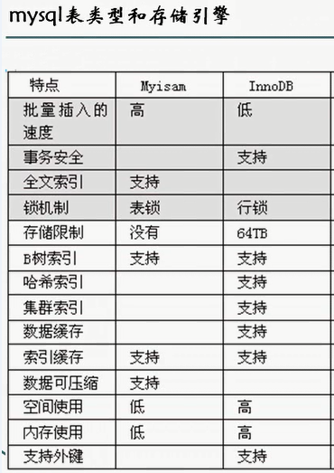
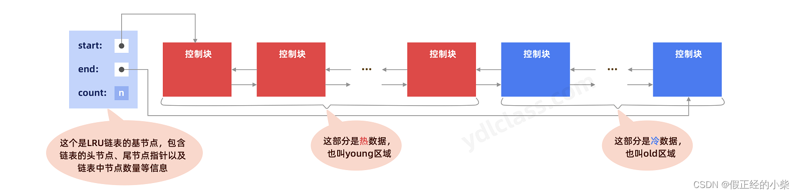
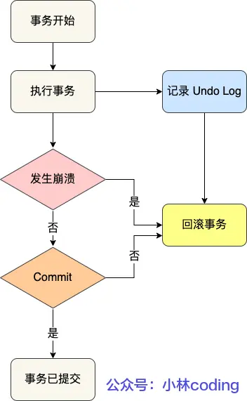
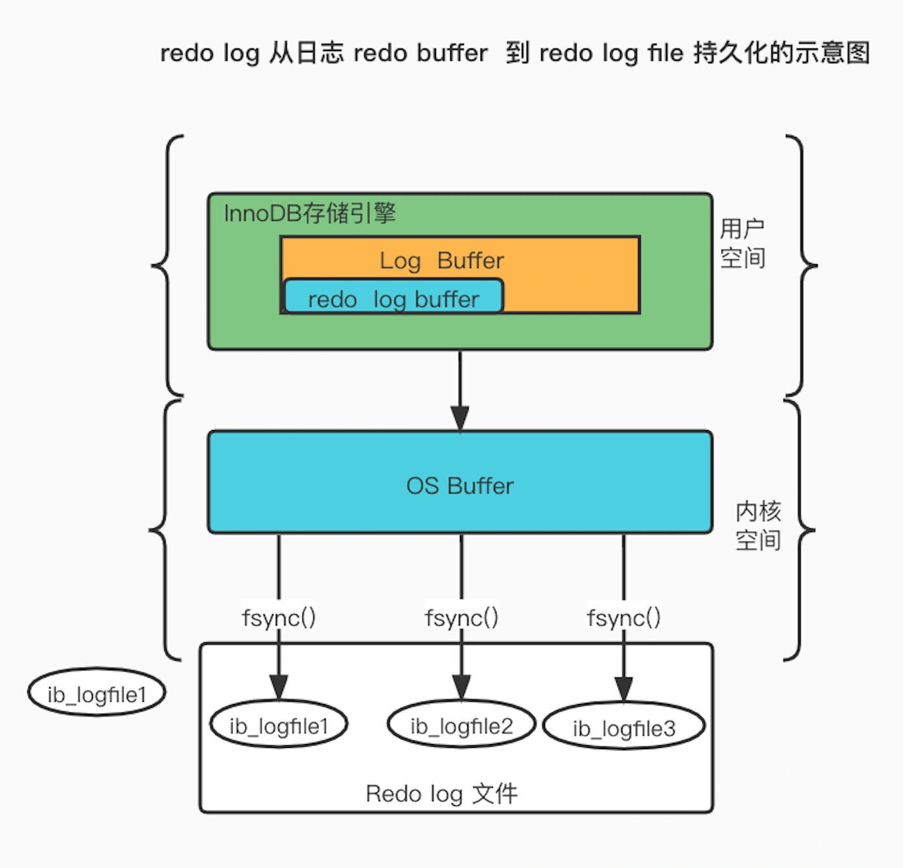
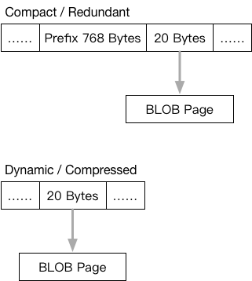

# MySQL笔记

## 架构

### 逻辑架构


MySQL服务器主要分为三层

1. **连接层**
   1. 连接处理
   2. 授权认证
   3. 安全性
2. **核心服务层**
   1. 查询解析
   2. 分析
   3. 优化
   4. 缓存
   5. 内置函数
   6. 跨存储引擎功能
      1. 存储过程
      2. 触发器
      3. 视图
3. **存储引擎层** 详见下述

#### 连接管理与安全性

**每个客户端都有相应的MySQL线程连接 MySQL服务器连接池会根据线程连接认证/验证客户端身份/权限**

#### 优化与执行

##### 执行过程

MySQL核心功能层提供了查询接口、可**解析查询->创建解析树->优化查询(重写/决定表读取顺序)->选择索引->执行语句(与存储引擎交互)**

Note：**SELECT查询解析前服务器先查缓存 如果缓存有不进行解析优化直接执行**

##### 优化器

- **CBO：基于成本优化** 服务器自行优化 不能人为控制 (e.g. **关联表不一定按人为顺序执行 强制人为顺序可用straight_join**)
- RBO：基于规则优化

- 用户可以通过**关键字提示(hint)优化器影响其决策**
- 也可以**让优化器解释(explain)**优化过程
- **存储引擎对优化查询有影响**

### 事务

事务是**一组原子性的SQL语句** 为一个**不可分割的最小工作单元** 

用户可**根据业务判断是否需要事务来选存储引擎** **不需要事务时选非事务型引擎(可以LOCK TABLES提供一定保护)可获得高性能** 

#### ACID

实现了ACID的数据库**CPU处理能力强、内存和磁盘空间需求大**

##### 原子性(Atomicity)

事务中的所有操作要么全部成功 要么全部失败回滚 一个事务**不可能只执行其中一部分操作**

**undo log：保存的是跟执行操作相反的操作（回溯）**

##### 一致性(Consistency)

几个并行执行的事务，其执行结果必须与按某一顺序串行执行的结果相一致 

**事务必须是使数据库从一个一致性状态变到另一个一致性状态**

ACID中**其他三种属性的存在都是为了达成一致性**

##### 隔离性(Isolation)

一个事务所做的**修改在最终提交之前对其他事务不可见**

###### 一致性锁定读

**用户对查询显式加锁**保证数据逻辑一致性

```mysql
# 对读取的行记录加一个X(独占)锁
SELECT...FOR UPDATE;
# 对读取的行记录加一个S(共享)锁
SELECT...LOCK IN SHARE MODE;
```

###### 一致性非锁定读

**通过MVCC在不上锁的情况下读取当前执行时间数据库的行数据** 

读取的行正在执行DELETE/UPDATE时**读取操作不会等待行锁的释放而是读快照数据** 不同事务隔离级别下的快照数据不同(详见MVCC节)

###### 隔离级别

| 事务隔离级别                     | 脏读   | 不可重复读 | 幻读   |
| -------------------------------- | ------ | ---------- | ------ |
| **读未提交（read-uncommitted）** | **是** | **是**     | **是** |
| **不可重复读（read-committed）** | 否     | **是**     | **是** |
| **可重复读（repeatable-read）**  | 否     | 否         | **是** |
| **串行化（serializable）**       | 否     | 否         | 否     |

- **DIRTY READ (脏读)**：**事务可以读取另一事务未提交的脏数据**
- **NONREPEATABLE READ (不可重复读)**：**同一事务执行两次同样的查询 可能会获得不同的结果(读到了其他事务已经提交的更改)**
- **PHANTOM READ (幻读)**
  - **事务在读取某个范围内记录时其他事务又在该范围内并发插入新记录**
  - **此时之前事务再次读取该范围记录时会产生幻行**

1. **READ UNCOMMITED (未提交读)**：**事务中的修改没提交也可以被其他事务读到**
2. **READ COMMITED (提交读/不可重复读)**
   1. **事务开始时只能看到已被提交的修改**
   2. **事务开始直到提交前 所做修改对其他事务不可见**
3. **REPEATABLE READ (可重复读)**
   1. **同一事务中多次读取同样记录结果一致** 
   2. MySQL**默认事务隔离级别** 
   3. **InnoDB通过MVCC+可重复读解决幻读**
4. **SERIALIZABLE (串行化)**：**强制事务串行执行** 读取每一行数据都加锁->大量超时和锁争用

##### 持久性(Durability)

一旦事务**提交** 其所做的**修改就永久保存在数据库中** 即使系统崩溃修改也不会丢失 

**redo log：记录事务对数据的修改 防止事务提交后内存数据丢失**

#### 事务日志

事务日志可以帮助**提高事务效率** 存储引擎可**只修改其内存拷贝 再把修改行为记录到持久硬盘的事务日志中** 不用每次都持久到磁盘

日志采用**追加**方式：**写日志=磁盘块顺序IO**

**预写式日志(WAL)：在数据写入到数据库之前先写入到日志 再将日志记录变更到存储器中 内存中被修改的数据在后台可以慢慢刷回磁盘**

#### 事务一致性

- **强一致性：读操作可以立即读到提交的更新操作**
- **弱一致性：提交的更新操作，不一定立即会被读操作读到** 此种情况会存在一个**不一致窗口，指的是读操作可以读到最新值的一段时间**
- **最终一致性**
  - **弱一致性的特例 事务更新一份数据**
  - **最终一致性保证在没有其他事务更新同样的值的话，最终所有的事务都会读到之前事务更新的最新值**
  - **如果没有错误发生，不一致窗口的大小依赖于：通信延迟，系统负载**等
- 其他一致性变体
  - **单调一致性：如果一个进程已经读到一个值，那么后续不会读到更早的值**
  - **会话一致性：保证客户端和服务器交互的会话过程中，读操作可以读到更新操作后的最新值**

#### MySQL事务

##### 保证失败回滚

- MySQL在开始事务时会**切换到一个延缓操作的状态**(**延缓状态下的操作并不都是立即执行的** 通常情况下语句是立即执行的)
- **commit 时会将延缓执行的操作都执行，并将状态回归到及时写入状态**
- **rollback 时会把延缓写入的操作抛弃掉，此间申请的锁释放掉，并将状态回归到及时写入状态**
  - **释放申请的锁**
  - **回归及时写入状态**
  - **不是放弃未写入的操作（未写入的操作：执行与不执行 rollback 都没有操作写进去 感觉执行或不执行都没什么区别）**
- **显示使用 savepoint，rollback 到之前设置的 savepoint**

##### 自动提交(AUTOCOMMIT)

MySQL**默认采用自动提交**模式 **每个查询都被当作一个事务执行提交操作**

```mysql
SHOW VARIABLES LIKE 'AUTOCOMMIT';
SET AUTOCOMMIT = 0; # 禁用自动提交
```

以下命令**执行之前强制执行COMMIT提交事务**

```mysql
ALTER TABLE ...
LOCK TABLES ...
```

**更改会话隔离级别**

```mysql
SET SESSION TRANSACTION ISOLATION LEVEL READ COMMITTED;
```

**自动提交对非事务性表无效(相当于AUTOCOMMIT一直启用)**

##### 混合使用存储引擎

**服务器层不管理事务** 而是**由存储引擎实现** 同一事务使用不同存储引擎可能会导致事务结果不确定

##### 两阶段锁定协议

**同一事务对任何数据进行读写之前必须对该数据加锁**，在**释放锁之后该事务不再申请和获得任何其他锁 **（**InnoDB**采用）

- **第一阶段（扩展阶段）：获得锁**
- **第二阶段（收缩阶段）：释放锁**

**隐式锁定**：在**事务执行时随时都可以锁定** **所有锁只能在事务提交/回滚时才同时释放** InnoDB会**根据隔离级别自动加锁**

**显示锁定**：可以使用特定语句实现

```mysql
# InnoDB存储引擎层
SELECT ... LOCK IN SHARE MODE
SELECT ... FOR UPDATE

# 服务器层 不能替代事务处理
LOCK TABLES
UNLOCK TABLES
```

Note：**LOCK TABLES最好只在禁用AUTOCOMMIT时显式执行**

### 锁

#### 并发控制

针对服务器层和存储引擎层进行的并发控制

##### 读写锁

- **共享锁(读锁)：共享 互不阻塞  同一时刻多个用户可同时读取同一资源 互不干扰**
- **排他锁(写锁)：非共享 阻塞其他读写锁 同一时刻只有一个用户执行写入**

##### 锁粒度&锁策略

**高并发性：只对会修改的数据进行精准锁定**

**锁粒度**：指锁定数据量大小 **锁粒度越小=锁开销越大=并发性越高**

**锁策略**：在**锁开销和数据安全性**间寻求**平衡**  

**MySQL存储引擎可实现自己的锁策略和锁粒度**

页锁/表锁速度快、冲突多 & 行锁速度慢、冲突少

###### 页锁 datapage lock

**锁住一个逻辑页(相邻的一组记录)**

###### 表锁 table lock

**最基本且开销最小**的锁策略 加锁时**锁定整张表 **MySQL**服务器层在执行ALTER TABLE语句时使用表锁**（忽略存储引擎锁机制）

- **用户对表进行写操作(增删改)时先获得写锁 阻塞其他用户对该表的读写操作**
- **没有写锁时其他用户采用读操作才能获得读锁(读锁不相互阻塞)**

**READ LOCAL表锁支持并发写**

**写锁比读锁有更高的优先级**(写锁可以插队到读锁前 读锁不可以插队到写锁前)

###### 行级锁 row lock

行级锁可以**最大程度的支持并发**且带来**最大的锁开销** **仅在存储引擎层实现**

**InnoDB**行级锁具体看**索引优化-->高性能索引策略-->索引和锁**

#### 意向锁

**提高封锁子系统的效率 申请意向锁的动作是数据库完成的**

##### 表锁

```mysql
# 用读锁锁表，会阻塞其他事务修改表数据
LOCK TABLE my_table_name READ; 
# 用写锁锁表，会阻塞其他事务读和写
LOCK TABLE my_table_name WRITE;
```

##### 行锁

**共享锁(读锁)：一个事务对一行的共享只读锁**

**排他锁(写锁)：一个事务对一行的排他读写锁**

##### 锁共存

1. **事务A锁住了表中的一行，让这一行只能读，不能写(共享行锁)**
2. **事务B申请整个表的写锁(排他表锁)** 

如果**事务B申请成功**，那么理论上它就能**修改表中的任意一行，这与A持有的行锁是冲突的**

##### 避免锁冲突

数据库要避免冲突--让**B的申请阻塞直到A释放行锁**

1. 判断表是否已被其他事务用表锁锁表
2. 判断**表中的每一行是否已被行锁锁住(逐行遍历整表 判断效率不高-->意向锁诞生)**

##### 意向锁

**事务A必须申请表的意向共享锁 成功后再申请所需行的行锁**

1. **判断表是否已被其他事务用表锁锁表**
2. **发现表上有意向共享锁(表中某(些)行有共享行锁) 事务B申请排他表锁被阻塞**

#### 死锁

**死锁检测&死锁超时机制**

1. **检测到死锁循环以来立刻返回错误 将持有最少行级排他锁的事务回滚** (InnoDB)
2. **查询时间达到锁等待超时后放弃锁请求**

**死锁产生**

- **数据冲突**
- **存储引擎的实现方式不同**

#### InnoDB的MVCC(多版本并发控制)

**MVCC是行级锁的变种** 大多数情况**避免了加锁操作（实现了非阻塞的读 写操作只锁定必要行） 开销更低** **保存数据在某个时间点的快照**

**每行记录后面保存两个隐藏列**（**行的创建时间**和**行的过期/删除时间**）存**系统版本号** **每开始一个新事务 系统版本号自动递增** 

Note：MVCC **很好的实现了事务隔离性** **只在REPEATABLE READ/READ COMMITTED**工作

##### REPEATABLE READ隔离级别下MVCC工作流程

- **SELECT** InnoDB必须检查**每行都满足**以下标准
  - **行版本号<=当前版本号**
  - **行删除版本号未定义或>=当前版本号**
- **INSERT**：**新行创建的存储号设为当前版本号**
- **DELETE**：**删除行的删除版本设为当前版本号**
- **UPDATE**
  - **转换为INSERT+DELETE** 
  - **复制新行并将行版本号设为当前版本号 将旧行的删除版本设为当前版本号****
  - 旧行没有真正被删除 此时innoDB**开启后台线程执行清理工作**(purge：**清掉删除版本号<当前版本号的行**)


##### REPEATABLE READ MVCC vs READ COMMITTED MVCC

1. **V1 V2 V3 按序开启事务** 
2. 当**V3修改记录时V2再读取数据**时**取决于锁定的数据是哪个版本**
   1. **READ COMMITTED读取最新的一致性快照版本** 即读V3更新版本
   2. **REPEATABLE READ读取事务开启前的版本** 即读V2事务开始前的版本(V1)


### 存储引擎


**存储引擎是不同的数据文件在物理磁盘上不同的组织形式**

MySQL在文件系统中

- 将每个数据库(schema)保存为数据目录下的一个子目录
- **创建表**时在子目录下创建和表同名的**.frm文件保存表的定义**

**SHOW TABLE STATUS显示表相关信息**

```mysql
SHOW TABLE STATUS LIKE 'user' \G 
*************************** 1. row *************************** 
Name: user 													# 表名
Engine: MyISAM 											# 存储引擎类型
Row_format: Dynamic 								# 行格式 Dynamic--可变行长 Fixed--固定行长 Compressed--行在压缩表
Rows: 6 														# 表的行数
Avg_row_length: 59 
Data_length: 356 
Max_data_length: 4294967295 
Index_length: 2048 									# 索引大小(字节)
Data_free: 0 
Auto_increment: NULL 
Create_time: 2002-01-24 18:07:17 
Update_time: 2002-01-24 21:56:29 
Check_time: NULL 
Collation: utf8_bin 
Checksum: NULL 
Create_options:
	Comment: Users and global privileges 
1 row in set (0.00 sec)
```

#### InnoDB

**MySQL默认事务型引擎 处理大量短期事务**

##### 概览

- **数据存储在表空间(由一系列数据文件(数据+索引)组成)**
- 使用**MVCC支持高并发**
- 实现四个标准隔离级别
- **默认级别：可重复读**
- **防止幻读：间隙锁**(**查询行+索引中的间隙一起锁定**)
- **基于聚簇索引**建立
- **二级(非主键)索引中必须包含主键列**
- 存储格式平台独立

##### 特性

- 可预测性**磁盘预读**
- **自适应哈希索引：自动在内存中创建hash索引加速读操作**
- **插入缓冲区：加速插入操作**
- 支持**热备份**
- **自动崩溃恢复**
- **排序创建索引**
- **删除/增加索引不需复制全表数据**
- 存储格式支持压缩
- 文件格式管理

#### MyISAM

**MySQL5.1之前默认存储引擎**

##### 概览

- 全文索引
- 压缩
- 空间函数
- 不支持事务和行级锁
- 崩溃后无法安全恢复

##### 存储

- **表存储在两个文件中(非聚簇索引)**
  - **数据文件(,MYD)**
  - **索引文件(.MYI)**
- **包含动态/静态行**
- **行记录数**(受限于磁盘)

##### 特性

###### 加锁与并发

**只支持表锁 读取时对读到的所有表加共享锁 写入时加排他锁**

**也支持并发插入：表读取查询时可以插入新记录**

###### 修复

**手动/自动执行检查和修复操作**

```mysql
CHECK TABLE xxxtable; # 检查表错误
REPAIR TABLE xxxtable; # 修复表错误
```

**服务器关闭时用myisamchk命令行工具**

###### 索引特性

- 支持BLOB/TEXT**长字段前缀索引**
- 支持**全文索引** 复杂查询

###### 延迟更新索引键

指定**DELAY_KEY_WRITE**选项

**每次修改后将修改的索引数据写入内存键缓冲区**（不立刻写入磁盘）**清理键缓冲区/关闭表时才将索引块写入磁盘** 极大**提升写入性能**

缺点：数据库/主机崩溃时导致索引损坏

##### MyISAM压缩表

压缩表适用于**不进行修改操作的数据** 极大减少磁盘内存占用/磁盘IO **提升查询性能 支持只读索引**

**表记录独立压缩 读取单行不需要解压表**

##### 性能

**紧密格式**存储数据

**性能问题主要源于表锁**（查询长期处于Locked）

#### InnoDB vs MyISAM

|                    | InnoDB                                                       | MyISAM                                                |
| ------------------ | ------------------------------------------------------------ | ----------------------------------------------------- |
| **适用场景**       | 写多读少<br />可靠性要求高/要求事务<br />表更新频繁、表锁定情况多 | 读多写少<br />不需事务 <br />插入不频繁 查询频繁      |
| **查询速度**       | 慢<br />缓存索引块和数据块<br />寻址先映射块再到行<br />维护MVCC | 快<br />只缓存索引块<br />记录的是文件的偏移量 定位快 |
| **表存储结构**     | .frm表结构文件<br />.ibd文件（存表相关数据、索引、缓存）     | .frm表结构文件<br />.MYD数据文件<br />.MYI索引文件    |
| **数据导出**       | 需导出再导入.sql文件                                         | 只需对应表的存储文件就可运行                          |
| **索引和数据关系** | 索引和数据捆绑 没有压缩 内存占用率大                         | 压缩索引且和数据分开 内存占用率小                     |
| **存储空间**       | 最多64TB                                                     | 无限制 可到64PB                                       |
| InnoDB额外功能     | 支持事务和外键                                               |                                                       |
| **AUTO_INCREMENT** | 有自动提交属性字段必须有索引                                 | 不强制有自动提交属性的字段有索引                      |
| **锁差异**         | 支持行级锁                                                   | 只支持表级锁                                          |
| **全文索引**       | 使用sphinx插件 MySQL5.6后支持                                | 支持                                                  |
| **表行数**         | 不保存表行数                                                 | 保存表行数(SELECT COUNT(*) FROM TABLE)                |
| **CRUD**           | 执行INSERT/UPDATE性能好<br />DELETE时不会重新建立表而是逐行删除 | 执行SELECT性能好                                      |
| **B-Tree索引实现** | B+树                                                         | B树                                                   |




#### 其他内建存储引擎

##### Memory

**可快速访问数据 所有数据保存在内存中 不需要磁盘IO 表重启后数据丢失保留结构**

- 支持**哈希索引** 查找速度极快
- 采用**表锁** 并发写入性能低
- **不支持BLOB/TEXT类型**列 每行长度固定

适合以下场景

- 查找/映射表：**MySQL查询过程需要临时表(即Memory表)保存中间结果** 
- 缓存周期性聚合数据
- **保存中间数据**

Memory表和临时表并不相同：**临时表可使用任何存储引擎 连接断开时临时表会被消除**

##### Archive

**非事务型**引擎 **只支持插入和查询操作 缓存所有写且压缩插入行 比MyISAM磁盘IO更少** 每次查询执行全表扫描 

支持行级锁和专用缓冲区->**高并发插入**

适合**日志/数据采集类应用**

##### Blackhole

没有存储机制 丢弃所有插入数据 由**服务器记录表日志**

适合**特殊复制架构/日志审核**

##### CSV

将CSV文件作为MySQL表处理 **不支持索引**

适合**数据交换**

##### Federated

远程访问其他MySQL服务器的代理

##### Merge

MyISAM变种

分区前适用于日志/数据仓库类应用

##### NDB集群

MySQL集群：MySQL服务器+NDB集群存储引擎+NDB数据库组合(分布式、share-nothing、容灾、高可用)

#### 存储引擎择优

**除非要用InnoDB不具备且没法替代的特性** 否则都**优先使用InnoDB引擎**

##### 考虑因素

- **事务**
  - **需要事务：InnoDB**是最稳定且经过验证的选择
  - **不需要事务且主要是插入/查询** (日志类)：**MyISAM**
- **备份**
  - **忽略备份**因素：**可定期关闭服务器执行备份**
  - **不能忽略备份：InnoDB在线热备份**
- **崩溃恢复**
  - **MyISAM崩溃损坏概率高 恢复速度慢**
  - 即使不需事务也**大多选择InnoDB**
- **特性**
  - **聚簇索引优化**
  - **MyISAM支持地理空间搜索**

##### 日志型应用

- 对插入速度有高要求：**MyISAM/Archive 开销低 插入速度快**
- 对记录日志做分析报表
  - 利用MySQL内置的复制方案复制数据到备库 **备库执行查询 主库执行插入**
  - **日志记录表名中包含年月信息** 区分历史表(查询)/当前表(插入)

##### 只读表

读多写少：**InnoDB 保证崩溃恢复 缓解锁争用**

##### 订单处理

必须**支持事务+外键：InnoDB**

##### 主体讨论区

**支持高读写的存储引擎**

##### CD-ROM应用

使用MySQL数据文件：**MyISAM(压缩)表** 表之间隔离且可相互拷贝

##### 大数据量应用

**建立数据仓库**：Infobright/TokuDB

#### 转换表的引擎

##### ALTER TABLE

**适用于任何存储引擎 但执行时间很长** 数据复制期间**消耗系统所有IO能力 原表加读锁**

**转换过程失去原引擎特性**(InnoDB->MyISAM->InnoDB会导致外键丢失)

```mysql
ALTER TABLE mytable ENGINE = InnoDB;
```

##### 导出+导入

使用**mysqldump工具将数据导出**到文件 然后**更改CREATE TABLE中的引擎选项** 同时**修改表名**

```mysql
CREATE TABLE mytable_new ( 
	...
) ENGINE=InnoDB;
```

##### 创建+查询

**创建新的存储引擎表->INSERT...SELECT语法**

```mysql
CREATE TABLE innodb_table LIKE myisam_table; 
ALTER TABLE innodb_table ENGINE=InnoDB; 
INSERT INTO innodb_table SELECT * FROM myisam_table;
```

**数据量大时分批处理** 

```mysql
# 新表为原表全量复制 原表还在
START TRANSACTION; 
INSERT INTO innodb_table SELECT * FROM myisam_table WHERE id BETWEEN x AND y; 
COMMIT;
```

### 数据完整性&表约束

#### 数据完整性

数据完整性(Data Integrity)是指**数据的精确(Accuracy)和可靠性(Reliability)** 是**对数据的准确性和一致性的一种保证**

1) **实体完整性**：**表的每一行在表中是唯一的实体**

2) **域完整性**：**表中的列必须满足某种特定的数据类型约束(取值范围、 精度等)**

3) **参照完整性：两个表的主关键字和外关键字的数据应一致，保证了表之间的数据的一致性，防止数据丢失或无意义数据扩散**

4) **用户定义的完整性：针对某个特定关系数据库的约束条件 反映某一具体应用必须满足的语义要求**


#### 表约束

**约束确保数据的准确性和一致性**

- **主键约束(PK)primary key constraint：唯一不为空** 
- **唯一约束(UQ)unique constraint：唯一可为空（只能出现一次NULL）**
- **默认约束(DF)default constraint：默认值**
- **检查约束(CK)check constraint：范围以及格式限制**
- **外键约束(FK)foreign key constraint：维护表关系**

### 硬件优化

- CPU：一条SQL语句只能在一个CPU执行
  - 最佳：核心数多+主频高
  - 非密集型查询：主频高
  - 密集型、高并发查询：核心数多
- 内存
  - 大小：和总数据量相近
  - 频率：CPU支持最高频率
- 磁盘
  - 性能比较：PCIe > SSD（随机IO快） > Raid10（提升硬盘性能） > 硬盘 > 网络存储（数据备份）
- 操作系统
  - 合理配置参数
  - 合适文件系统

## Schema与数据类型优化

### 数据类型择优

#### 尽可能小

**尽量使用可正确存储数据的最小数据类型** **可减少磁盘、内存、CPU缓存的占用 CPU处理周期变少** 但要确保**没有低估需要值的范围**

#### 简单

简单数据类型需要**更少CPU周期** 

- **操作代价低：整型>字符**
- **存日期和时间：内建时间类型>字符串**
- **存IP地址：整型>字符串**

#### 避免NULL

**列的默认属性是可为NULL** 

**可为NULL**对MySQL来说**更难优化（索引、索引统计、值比较更复杂）且占用更多存储空间** 且**需要被特殊处理**

可为NULL列**被索引时每个索引记录需要一个额外字节**

InnoDB使用位存储NULL值 **稀疏数据(只有少数行有非NULL值)**有很好的空间效率 MyISAM不适用

#### 整数类型（Whole Numbers）

存储整数类型：TINYINT	SMALLINT	MEDIUMINT	INT		BIGINT（整数计算一般使用BIGINT）

存储空间(位)：		8				16				24				32			64

可存储值范围：−2^(N–1)~2^(N–1)–1	N为位数

**UNSIGNED**属性：可选该属性使**正数上限提高一倍**

MySQL可**为整数类型指定宽度**(例如**INT(11)**) 但不会限制值的合法范围 只是规定显示个数 **存储和计算中INT(1)和INT(20)相同**

#### 实数类型（Real Numbers）

实数是**带有小数部分**的数字 也可以用于**存储比BIGINT还大的整数**

**FLOAT和DOUBLE类型(浮点类型)**支持使用**标准浮点运算**进行近似计算

**DECIMAL类型用于存储精确小数** MySQL5.0后支持精确计算 **可指定精度**：DECIMAL(18,9)小数点两边各存储9个字节数字(X.X X->4 .->1) 计算时DECIMAL会转换为DOUBLE

**浮点类型存储相同范围值比DECIMAL使用更少空间**(FLOAT--4bytes DOUBLE--8bytes)

**数据量大时考虑用BIGINT**代替DECIMAL 将需要单位根据小数位数乘相应倍数 **避免浮点存储计算不准确和DECIMAL精确计算代价高**

#### 字符串类型（String Types）

##### VARCHAR类型

VARCHAR类型**存储可变长字符串** 比定长类型**省空间(仅使用必要空间)**

需要**额外字节记录字符串长度**

- **列最大长度<=255字节--使用1个额外字节**
- 列最大长度>255字节--使用2个额外字节

行变长->UPDATE时可能需要做额外工作->行占用空间变长->**页内没有更多空间存储**

- **MyISAM将行拆成不同字段存储**
- **InnoDB需要分裂页来存储行**

以下情况**适合使用VARCHAR**

- 字符串**列的最大长度比平均长度大很多**
- **列更新少** 不怕碎片化
- 使用**复杂字符集**(如UTF-8)

存储VARCHAR值**不会删除末尾空格**

```mysql
SELECT CONCAT("'", varchar_col, "'") FROM varchar_test; 
+-------------------------------+ 
| CONCAT("'", varchar_col, "'") | 
+-------------------------------+ 
| 'string1' 										| 
| ' string2' 										| 
| 'string3 ' 										| 
+-------------------------------+
```

##### CHAR类型

CHAR类型可**存储定长字符串** 根据定义字符串长度分配足够空间

以下情况**适合使用CHAR**

- **存储很短的列**
- **列所有值接近同一长度**

存储CHAR值会**删除所有末尾空格** **填充/截取空格是由MySQL服务器进行处理的**

```mysql
SELECT CONCAT("'", char_col, "'") FROM char_test; 
+----------------------------+ 
| CONCAT("'", char_col, "'") | 
+----------------------------+ 
| 'string1' 								 | 
| ' string2' 								 | 
| 'string3' 								 | 
+----------------------------+
```

##### BINARY类型

BINARY类型存储的是**二进制字符串(存储的是字节码** 不是字符) **填充BINARY采用零字节**而不是空格 检索时也不会去掉填充

以下情况**适合使用BINARY**

- 需要**存储二进制数据**
- 使用**字节码（二进制）比较**
- **大小写敏感**

##### VARBINARY类型

**存储可变长二进制字符串** 其余特性和CHAR/VARCHAR对比关系的BINARY一致

##### BLOB类型

BLOB类型存储**很大的二进制字符串数据** **没有排序规则/字符集**

**InnoDB将过长VARCHAR存为BLOB**

##### TEXT类型

TEXT类型存储**很大的字符方式字符串数据** **有排序规则/字符集**

##### BLOB & TEXT

MySQL把BLOB和TEXT值都当作**独立对象**处理  **只对每列的最前max_sort_length字节做排序** 

```mysql
# 只需排序前面一部分字符
减小max_sort_length配置
ORDER BY SUBSTRING(col, length)
```

**值太大时 InnoDB在行内存储指针指向在外部存储区域的实际值**

**尽量避免使用BLOB/TEXT**：查询不能使用Memory引擎(不支持BLOB/TEXT)的隐式临时表 需转为MyISAM磁盘临时表造成严重性能开销

**实在不能避免BLOB/TEXT**：所有用到的地方都使用**SUBSTRING(col, length)转为字符串**使用内存临时表(**Extra：Using temporary**)

##### 枚举类型（ENUM）

可以使用枚举列代替常用的字符串类型 把**不重复的字符串存储为预定义集合** 添加/删除枚举元素时必须使用ALTER TABLE

MySQL存储枚举时将每个值在**列表中的位置保存为整数**

```mysql
CREATE TABLE enum_test(
  e ENUM('fish', 'apple', 'dog') NOT NULL
);
INSERT INTO enum_test(e) VALUES('fish'), ('dog'), ('apple');
```

```mysql
SELECT e + 0 FROM enum_test; 
+-------+ 
| e + 0 | 
+-------+ 
| 		1 | 
| 		3 | 
| 		2 | 
+-------+
```

枚举字段**按照内部存储的整数排序**而**不是定义的字符串**排序

```mysql
SELECT e FROM enum_test ORDER BY e; 
+-------+ 
| e 		| 
+-------+ 
| fish 	| 
| apple | 
| dog 	| 
+-------+
```

绕过该限制

- **按照需要的顺序定义枚举列**

- 查询时使用**FIELD()函数显式指定**排序顺序 但**无法利用索引消除排序**

  ```mysql
  SELECT e FROM enum_test ORDER BY FIELD(e, 'apple', 'dog', 'fish');
  ```

##### VARCHAR & ENUM

```mysql
CREATE TABLE webservicecalls ( 
  day date NOT NULL, 
  account smallint NOT NULL, 
  service varchar(10) NOT NULL, 
  method varchar(50) NOT NULL, 
  ... omitted ... 
	PRIMARY KEY (day, account, service, method) 
) ENGINE=InnoDB;
```

把service和method**换成ENUM 可以让表缩小**

```mysql
CREATE TABLE webservicecalls_enum (
  ... omitted ...
  service ENUM(...values omitted...) NOT NULL, 
  method ENUM(...values omitted...) NOT NULL,
 	... omitted ... 
) ENGINE=InnoDB;
```

```mysql
# VARCHAR和VARCHAR关联起来
SELECT SQL_NO_CACHE COUNT(*) 
FROM webservicecalls
JOIN webservicecalls 
USING(day, account, service, method);
# VARCHAR和ENUM关联起来
SELECT SQL_NO_CACHE COUNT(*) 
FROM webservicecalls
JOIN webservicecalls_enum
USING(day, account, service, method);
```

| Test                      | Queries per second |
| ------------------------- | ------------------ |
| VARCHAR joined to VARCHAR | 2.6                |
| VARCHAR joined to ENUM    | 1.7                |
| ENUM joined to VARCHAR    | 1.8                |
| **ENUM joined to ENUM**   | **3.5**            |

#### 日期和时间类型（Date&Time Types）

| DATETIME类型                           | TIMESTAMP类型                          |
| -------------------------------------- | -------------------------------------- |
| 保存**1001年～9999年**精度为秒的范围值 | 保存**1970年～2038年**精度为秒的范围值 |
| 存储空间**8字节**                      | 存储空间**4字节** **空间效率高**       |
| **与时区无关**                         | **与时区有关**                         |
|                                        | 列默认为**NOT NULL**                   |

除特殊行为外**尽量使用TIMESTAMP**

如需**存储比秒更小粒度的时间：BIGINT存储微秒级别时间戳、DOUBLE存储秒之后小数部分**、使用MariaDB代替MySQL

#### 位数据类型（Bit-Packed Data Types）

位数据技术上说都是**字符串类型**

##### BIT类型

**存储一个/多个true/false值** **MyISAM打包存储所有BIT列** **InnoDB/Memory为每个BIT列使用足够的最小整数类型**存放(不能省空间)

MySQL将BIT当作字符串类型 BIT(x)结果是包含二进制值的字符串

**1bit存储1个true/false：创建为空的CHAR(0)列(**保存NULL/空字符串)

##### SET类型

**存储很多true/false值时合并列到SET类型(打包的位集合)** 有效利用存储空间但**无法使用索引且改变列定义的代价高(需要ALTER TABLE)**

##### ACL例子

ACL：保存权限的访问控制列表

**使用SET**

```mysql
CREATE TABLE acl (
  perms SET('CAN_READ', 'CAN_WRITE', 'CAN_DELETE') NOT NULL
);

INSERT INTO acl(perms) VALUES ('CAN_READ,CAN_DELETE'); 
SELECT perms FROM acl WHERE FIND_IN_SET('AN_READ', perms); 
+---------------------+ 
| perms 							| 
+---------------------+ 
| CAN_READ,CAN_DELETE | 
+---------------------+
```

**使用整数变量**

```mysql
SET @CAN_READ := 1 << 0, @CAN_WRITE := 1 << 1,@CAN_DELETE := 1 << 2; 
CREATE TABLE acl (
  perms TINYINT UNSIGNED NOT NULL DEFAULT 0
);
INSERT INTO acl(perms) VALUES(@CAN_READ + @CAN_DELETE);
SELECT perms FROM acl WHERE perms & @CAN_READ; 
+-------+ 
| perms | 
+-------+ 
| 		5 | 
+-------+
```

#### 选择标识符（Choosing Identifiers）

| 整数类型             | ENUM和SET类型      | 字符串类型                     |
| -------------------- | ------------------ | ------------------------------ |
| 查询快               |                    | 查询慢(MyISAM压缩索引)         |
| **标识列最好的选择** | 尽量避免作为标识列 | 尽量避免作为标识列             |
|                      | 存储固定状态       | 消耗空间                       |
|                      |                    | 随机字符串任意分布在很大空间中 |
|                      |                    |                                |

##### 随机新值导致INSERT/SELECT变慢

**插入值随机写到索引不同位置->INSERT变慢->页分裂、磁盘随机访问、聚簇索引碎片**

**逻辑相邻行分布在磁盘不同地方->SELECT变慢**

**访问局部性原理失效->缓存效果差**

#### 特殊类型数据

**IP地址**：不要拿字符串类型存 **用无符号整数存（INET_ATON()&INET_NTOA()）** 

### schema设计陷阱

#### 过多的列

**存储引擎API工作流程**

1. **服务器层<--行缓冲拷贝数据-->存储引擎层**
2. **服务器层将缓冲内容解码：编码列>>行数据结构**

解码代价：**MyISAM变长行、InnoDB行结构需要转换 列越多转换代价越高**

#### 过多的关联

**单个查询最好在12个表以内做关联** 查询执行快且并发性好

#### 全能枚举

**避免过度使用枚举**

```mysql
CREATE TABLE ... country enum('','0','1','2',...,'31')
```

#### 变相枚举

**ENUM允许列中存储一组定义值的单个值 SET允许存储一组定义值的单/多个值**

避免使用SET做真假判断列(列值不能同时出现)

```mysql
CREATE TABLE ... is_default set('Y','N') NOT NULL default 'N'
```

#### NULL

尽可能避免使用NULL(**MySQL索引中存储NULL值**)：**存储事实空值**时可以用**0/特殊值/空字符串**代替

**表示未知值时不要害怕使用NULL**：DATETIME伪造全0值会导致导致问题

### 范式/反范式

- **码（候选码） ：为某表中的一个属性或属性组 除码之外的所有属性都完全函数依赖于码** 
  - **码确定的情况下该表除码之外的所有属性的值也随之确定**
  -  **一张表中可以有超过一个码**
- **部分函数依赖：依赖于码的一部分**
- **非主属性：包含在任何一个码中的属性成为主属性**

1. **第一范式 1NF**：**每个属性都不可再分**，1NF 是所有关系型数据库的基本
2. **第二范式 2NF**：在 1NF 的基础之上，**消除了非主属性对于码的部分函数依赖**
3. **第三范式 3NF**：在 2NF 的基础之上，**消除了非主属性对于码的传递函数依赖**
4. **BCNF 范式**：在 3NF 的基础上，**消除主属性对于码的部分与传递函数依赖**
5. **反范式：增加冗余数据或数据分组**来提高数据库读性能

#### (反)范式优缺点

| 范式                                         | 反范式                                                   |
| -------------------------------------------- | -------------------------------------------------------- |
| **更新操作快**                               | 更新操作慢                                               |
| **只有很少/没有重复数据(修改数据少)**        | 信息冗余                                                 |
| **表通常更小** 占用内存空间小 **执行操作快** | 列多表大 占用内存空间大 执行操作无索引时慢               |
| **查询时更少需要DISTINCT/GROUP BY**          | **查询时最差情况全表扫描(数据大时比关联快--避免随机IO)** |
| 常需关联多个表 关联代价高                    | **避免关联** 数据都在一张表里                            |
| 可能使**索引无效(同索引列分布在不同表)**     | 可用更**有效的索引策略**                                 |

#### 混用范式化和反范式化

**反范式化数据用于复制/缓存 不同表中存储相同的特定列(提升性能)** 

### 缓存表/汇总表

#### 缓存表

**存储较易且慢的从schema获取数据的表** **对优化搜索/检索查询语句有效**

##### 例：不同索引加速查询 

**创建只包含部分列的缓存表且对缓存表使用不同存储引擎**

- 主表使用InnoDB
- **缓存表使用MyISAM 压缩索引且可全文搜素**

#### 汇总表/累积表

**保存GROUP BY聚合数据的表**

##### 例：获得过去24小时消息发送数量

方案一（**不严格计数**）：每小时生成一张汇总表 但计数器并不精确

方案二（**小范围查询填满间隙的严格计数**）：以每小时汇总表为基础 把**之前23小时统计表加起来再加开始/结束阶段不完整小时内的计数** 

```mysql
CREATE TABLE msg_per_hr ( 
  hr DATETIME NOT NULL, 
  cnt INT UNSIGNED NOT NULL, 
  PRIMARY KEY(hr) 
);

# LEFT(NOW(), 14)获得当前日期和时间最接近的小时
SELECT SUM(cnt) FROM msg_per_hr 
WHERE hr BETWEEN
CONCAT(LEFT(NOW(), 14), '00:00') - INTERVAL 23 HOUR
AND CONCAT(LEFT(NOW(), 14), '00:00') - INTERVAL 1 HOUR; 

SELECT COUNT(*) FROM message
WHERE posted >= NOW() - INTERVAL 24 HOUR
AND posted < CONCAT(LEFT(NOW(), 14), '00:00') - INTERVAL 23 HOUR; 

SELECT COUNT(*) FROM message
WHERE posted >= CONCAT(LEFT(NOW(), 14), '00:00');
```

**建立汇总表主要原因**：两个方案都**比计算所有行效率高**

#### 影子表

**影子表保证了重建汇总表/缓存表时数据在操作时依然可用** 

```mysql
DROP TABLE IF EXISTS my_summary_new, my_summary_old; 
CREATE TABLE my_summary_new LIKE my_summary; 
-- populate my_summary_new as desired 
# 可通过原子重命名操作切换影子表和原表 下一次重建之前保留旧版本数据(my_summary_old)
RENAME TABLE my_summary TO my_summary_old, my_summary_new TO my_summary;
```

#### 物化视图

**预先计算且存在磁盘上的表**

#### 计数器表

**使用独立计数器表(小、快)可避免查询缓存失效**

##### 简单计数器表

记录上有互斥锁**事务只能串行执行**

```mysql
CREATE TABLE hit_counter (
  cnt int unsigned not null
) ENGINE=InnoDB;

UPDATE hit_counter SET cnt = cnt + 1;
```

##### 并发更新计数器表

将**计数器保存在多行中 每次随机选择一行更新** 提高事务并发更新性能

```mysql
CREATE TABLE hit_counter (
  slot tinyint unsigned not null primary key,
  cnt int unsigned not null
) ENGINE=InnoDB;

# 预先生成行数据 选择随机槽更新
UPDATE hit_counter SET cnt = cnt + 1 WHERE slot = RAND() * 100;

# 统计结果
SELECT SUM(cnt) FROM hit_counter;
```

##### 时间间隔计数器表

每隔一段时间开始一个新计数器

```mysql
CREATE TABLE daily_hit_counter (
  day date not null,
  slot tinyint unsigned not null,
  cnt int unsigned not null,
  primary key(day, slot)
) ENGINE=InnoDB;

# 不用预先生成行数据 用ON DUPLICATE KEY UPDATE代替
INSERT INTO daily_hit_counter(day, slot, cnt)
VALUES(CURRENT_DATE, RAND() * 100, 1)
ON DUPLICATE KEY UPDATE cnt = cnt + 1;

# 周期执行任务 合并所有结果到0号槽 删除其他槽 减少表行数
UPDATE daily_hit_counter as c
INNER JOIN (
  SELECT day, SUM(cnt) AS cnt, MIN(slot) AS mslot
  FROM daily_hit_counter
  GROUP BY day
) AS x USING(day)
SET c.cnt = IF(c.slot = x.mslot, x.cnt, 0), c.slot = IF(c.slot = x.mslot, 0, c.slot);
DELETE FROM daily_hit_counter WHERE slot <> 0 AND cnt = 0;
```

#### 快读慢写

高性能数据库常用技巧：**额外索引、冗余列、缓存表、汇总表**-->**提升读查询**--> **写操作变慢 增加读写操作开发难度**

### ALTER TABLE优化

由于**大部分ALTER TABLE**都会导**致MySQL服务中断** 需要对其进行优化

ALTER TABLE有**可能不需要重建表**：**移除(不是增加)一个列的AUTO_INCREMENT属性、增删改ENUM/SET常量、删改列默认值**

```mysql
# MODIFY COLUMN操作会导致表重建
ALTER TABLE sakila.film MODIFY COLUMN rental_duration TINYINT(3) NOT NULL DEFAULT 5;

# ALTER COLUMN操作不会导致表重建 (直接修改.frm文件不涉及表数据)
ALTER TABLE sakila.film ALTER COLUMN rental_duration SET DEFAULT 5;
```

#### 常见场景

1. 先在**不提供服务的机器上执行ALTER TABLE** 然后**和提供服务的主库进行切换**
2. **影子拷贝**：按原表**创建表结构一样的新表** 然后**重命名+删表**来交换两张表

#### 特殊场景

##### 只修改.frm文件

为**想要的表结构创建新.frm文件替换掉旧.frm文件**

1. **创建一张相同结构空表 进行所需的修改**
2. 执行**FLUSH TABLES WITH READ LOCK**(关闭所有正使用的表且禁止任何表被打开)
3. **交换.frm文件**
4. 执行**UNLOCK TABLES释放步骤2的读锁**

```mysql
SHOW COLUMNS FROM sakila.film LIKE 'rating'; 
+--------+------------------------------------+------+-----+---------+-------+ 
| Field  | Type 															| Null | Key | Default | Extra | 
+--------+------------------------------------+------+-----+---------+-------+ 
| rating | enum('G','PG','PG-13','R','NC-17') | YES  |		 | G 			 | 			 | 
+--------+------------------------------------+------+-----+---------+-------+

CREATE TABLE sakila.film_new LIKE sakila.film; 
ALTER TABLE sakila.film_new
MODIFY COLUMN rating ENUM('G','PG','PG-13','R','NC-17', 'PG-14') DEFAULT 'G';
FLUSH TABLES WITH READ LOCK;

/var/lib/mysql/sakila# mv film.frm film_tmp.frm 
/var/lib/mysql/sakila# mv film_new.frm film.frm 
/var/lib/mysql/sakila# mv film_tmp.frm film_new.frm

UNLOCK TABLES; mysql> SHOW COLUMNS FROM sakila.film LIKE 'rating'\G 
*************************** 1. row *************************** 
Field: rating 
	Type: enum('G','PG','PG-13','R','NC-17','PG-14')

DROP TABLE sakila.film_new;
```

##### 快速创建MyISAM索引

###### MyISAM表高效载入数据

**禁用索引->载入数据->重新启用索引**

**构建索引工作被延迟到数据完全载入后 可以用排序构建索引 索引树碎片少且紧凑**

**缺点：对唯一索引无效**

```mysql
ALTER TABLE test.load_data DISABLE KEYS; 
-- load the data 
ALTER TABLE test.load_data ENABLE KEYS;
```

###### 唯一索引解决方法

- **依赖于InnoDB快速在线创建索引功能：删除所有非唯一索引->加新列->重新创建删除掉的索引**
- hack
  - **用需要的表结构创建空表 不带索引**
  - **载入数据到表中(创建.MYD文件)**
  - **用需要的表结构创建另一张空表 带索引(创建.frm和.MYI文件)**
  - **获取读锁 刷新表**
  - **重命名第二张表.frm和.MYI文件到第一张表**
  - **释放读锁**
  - **使用REPAIR TABLE重建表索引(排序构建所有索引)**

## 索引优化

#### 索引基础

**索引(键)是存储引擎用于快速找到记录的一种数据结构** 存储引擎先在排好序的索引中找到对应值 根据匹配索引记录找到对应的数据行

##### 局部性原理

数据/程序都有**聚集成群的倾向**

**空间局部性：被查询过的数据很可能会再次被查询**

**时间局部性：被查询过的数据短期内可能会再次被查询**

##### 磁盘预读

**内存和磁盘在进行交互时要保证每次读取都是一个逻辑单位（页 ）而不是单个数据行** 

存储引擎进行读取时一般取4kb整数倍(InnoDB取16kb)

##### 数据结构选择

**InnoDB和MyISAM**两大存储引擎都使用**B-Tree索引作为主要索引结构** 而**不是哈希结构/二叉树/AVL树/红黑树**


###### 哈希表

哈希算法根据键和哈希函数算出哈希值 **哈希结构效率高 但哈希表只能精确查找值 无法执行范围查询** 数据**存在磁盘时需精确查找 IO量大**

且**可能有哈希碰撞** 


###### 二叉搜索树

二叉搜索树作为索引结构时**磁盘IO次数和树高度相关** **极端情况树可能会成链状**


###### AVL树

解决上述二叉搜索树极端链状情况 可以使用AVL树 **AVL树高度平衡**(左子树和右子树高度相差<=1) **查找效率较高**

但AVL树**增删效率低** 多个节点时可能需要**旋转多次**


###### 红黑树

**2-3树**：内部节点可以**有2个子节点和1个数据元素(2节点)**、或有**3个子节点和2个数据元素(3节点)**，**叶子节点有1至2个数据元素**

**红黑树等价于2-3树** **2节点等价于普通AVL节点** **3节点本质上是非平衡性的缓存 ** **增删效率高 用空间换时间**

**需要再平衡/增删改时 2节点和3节点间的转化会吸收不平衡性 减少旋转次数 数据随机且增删相当时3节点非平衡性缓存效果越明显**


红黑树比AVL综合深度低 但**数据量大时深度依然会很高 导致IO变多**

**红黑树特性**

- **节点颜色非黑即红**
- **根节点和所有叶子节点(NIL空节点)是黑色**
- **红色节点的两个子节点都是黑色**
- **任意节点到每个叶子节点的最短路径都包含相同数目的黑色节点**
- **增删改操作时间复杂度O(logn)** 
  - **非严格平衡 插入效率更高 最多旋转三次** 
  - **删除节点情况**
    - **红色节点：直接删除**
    - **只有一个子节点的节点：子节点改为黑色**
    - **黑色节点：复杂调整**
- **左右子树高度最多差一倍**

###### B-Tree

B树**保证了更少的磁盘访问（IO少）高度低** B树的**节点可以看作磁盘块**(包括**指向下面磁盘块的指针**)

**阶：节点的子节点数的最大值**

一个 **M 阶的 B 树（M>2） 且k 的取值范围为 [ceil(M/2), M]** 有以下的特性

1. **根节点包含子节点个数的范围[2,M]**

2. **中间节点包含 k-1 个关键字和 k 个子节点** 

3. **叶子节点包括 k-1 个关键字(无子节点)**

4. 假设中间节点节点的关键字为：Key[1], Key[2], …, Key[k-1]，且**关键字按照升序排序**，即 **Key[i] <Key[i+1]**

5. **所有叶子节点位于同一层**

**B树相比二叉树结构高度更低、磁盘IO更少、查询性能更好**


###### B+Tree

B+树是为磁盘/其他直接存取辅助设备设计的**平衡查找树** 所有**记录节点都按键值大小顺序存放在同一层叶子节点由指针进行连接**

**B+树为B树的变种 仅在叶子节点存储信息（所有关键字）各层节点的关键字均是下一层对应节点中的最大(小)关键字的复写**

B+树满足如下条件，即可称之为m阶B+树

- **根节点只有一个**，**分支数量范围为[2，m]**
- **分支节点每个节点包含分支数范围为[ceil(m/2), m]**
- **分支节点的关键字数量等于其子分支的数量减一**，关键字的数量范围为[ceil(m/2)-1, m-1]，关键字顺序递增
- **所有叶子节点都在同一层**

**B+Tree vs B-Tree**

1. **B+树有 k 个孩子的节点就有 k 个关键字。也就是子节点数量 = 关键字数**，而 **B 树中，子节点数量 = 关键字数 +1**
2. **非叶子节点的关键字也会同时存在在子节点中，并且是在子节点中所有关键字的最大（或最小）**
3. **非叶子节点仅用于索引，不保存数据记录，跟记录有关的信息都放在叶子节点中**。而 **B 树中， 非叶子节点既保存索引，也保存数据记录** 

4. 所有**关键字都在叶子节点出现**，**叶子节点间构成一个有序链表**，而且**叶子节点本身按照关键字的大 小从小到大顺序链接**


##### 索引类型

**索引在存储引擎层实现而非服务器层** 

没有统一的索引标准 不同存储引擎索引工作方式不同 支持索引类型也不同 同一索引不同引擎底层实现可能不同

|                | InnoDB                   | MyISAM   | Memory     | NDB    |
| -------------- | ------------------------ | -------- | ---------- | ------ |
| **B-Tree索引** | **支持**                 | **支持** | **支持**   | 不支持 |
| **哈希索引**   | **支持(自适应哈希索引)** | 不支持   | **支持**   | 支持   |
| **全文索引**   | **支持**                 | **支持** | **不支持** | 不支持 |
| **空间索引**   | 不支持                   | **支持** | 不支持     | 不支持 |

###### B-Tree索引

Note：**实际上大多存储引擎使用的是B+Tree 每个叶子节点都包含指向下一叶子节点的指针方便叶子节点范围遍历**

**存储引擎以不同方式使用B-Tree索引** **B-Tree的所有值都是按序存储且每个叶子页到根的距离相同**

- **MyISAM使用前缀压缩索引 通过数据物理位置引用被索引的行**
- **InnoDB按原数据格式存储 通过主键引用被索引的行**

B-Tree索引**避免了全表扫描加快访问数据速度** 且对**索引列是顺序组织存储的(对定义索引列顺序排序)很适合查找范围数据**

- **存储引擎从索引根节点(槽中存放指向子节点指针)开始搜索**
- **根据指针向下层查找 比较节点页的值和查找的值**
- **找到合适指针进入下层子节点 子节点存储值的上下限** 
- **叶子节点中的指针指向被索引的数据 不是其他节点页**
- **最终找到对应值或记录不存在**

使用B-Tree索引的**查询类型**

- **全值匹配**：匹配所有索引列
- **匹配最左前缀**：从索引第一列开始匹配
- **匹配列前缀**：可以只匹配列前缀(满足最左匹配)
- **匹配范围值**：可以范围查询(满足最左匹配)
- **精确匹配顺序列并范围匹配另一列**：最左列精确匹配 其右面的列可以范围匹配
- **只访问索引的查询**：覆盖索引
- **按序查找**：索引扫描做排序 ORDER BY

**B-Tree索引失效**

- **不符合最左匹配原则**
- **按序跳过索引列**
- **范围查询列右面的所有列都索引失效**
- **计算、函数、类型转换(自动或手动)** （详见高性能索引策略--独立的列）
- 表达式中**使用不等于符号（!=或<>）或通配符%（LIKE前面不能用：左模糊/全模糊）**
- 表达式中使用**IS NOT NULL** （IS NULL可以使用索引）
- **OR前后存在非索引列**
- **字符集转换**

###### B+Tree索引

**B+Tree索引根据键值可快速找到数据** 

但**不能找到给定键值的具体行** 只能**找到被查找数据行所在页->数据库把页读到内存->内存查找**

- 特点：**高扇出性->高度一般维持2-4层(查找行记录最多只需2-4次IO)**
- 聚簇索引
    - InnoDB存储引擎表是**索引组织表 表中数据按照主键顺序存放**
    - 按照**每张表的主键构造B+树 叶子节点存放整个行记录(数据页) 非叶子节点存放键值和指向数据页的偏移量**
    - 索引组织表中数据也是索引的一部分
    - **每张表只能有一个聚簇索引：实际数据页只能按照一棵B+树排序**
    - **存储是逻辑连续而不是物理连续的** 
    - **范围查询：通过非叶子节点(中间节点)得到页的范围 直接读取数据页**
- 非聚簇索引
    - 不影响数据在聚簇索引中的组织 **可以有多个**非聚簇索引 **叶子节点索引行包含主键书签**
    - 不包含完整行记录 可通过书签查找聚簇索引行记录
- 分裂
    - 向左/右分裂 决定分裂点记录
        - PAGE_LAST_INSERT
        - PAGE_DIRECTION
        - PAGE_N_DIRECTION
    - 插入随机 取页中间记录为分裂点记录
- 管理
    - 创建/删除：ALTER TABLE / CREATE/DROP INDEX
    - 查看索引：SHOW INDEX
    - 更新Cardinality：ANALYZE TABLE

###### 哈希索引

哈希索引**基于哈希表实现** 只能在**精准匹配索引所有列的查询**生效

**存储引擎对索引列的每一行数据计算一个哈希码 哈希索引将所有哈希码存储在索引中并在哈希表中保存每一个数据行的指针**

只有**Memory引擎显式支持哈希索引且将其作为默认索引类型** 同时也支持B-Tree索引、**非唯一哈希索引(哈希碰撞时采用链地址法)**

```mysql
# 哈希索引示例
CREATE TABLE testhash (
  fname VARCHAR(50) NOT NULL, 
  lname VARCHAR(50) NOT NULL,
  KEY USING HASH(fname) 
) ENGINE=MEMORY;

SELECT * FROM testhash; 
+--------+-----------+ 
| fname  | lname 		 | 
+--------+-----------+ 
| Arjen | Lentz 		 | 
| Baron | Schwartz	 | 
| Peter | Zaitsev		 | 
| Vadim | Tkachenko	 | 
+--------+-----------+

# 哈希函数f()
f('Arjen')= 2323 
f('Baron')= 7437 
f('Peter')= 8784 
f('Vadim')= 2458
```

| Slot | Value            |
| ---- | ---------------- |
| 2323 | Pointer to row 1 |
| 2458 | Pointer to row 4 |
| 7437 | Pointer to row 2 |
| 8784 | Pointer to row 3 |

```mysql
# 先计算'Peter'的哈希值->使用该值找到对应记录指针
f('Peter')= 8784->索引查找8784->找到第三行指针->比较第三行值是否为'Peter'
SELECT lname FROM testhash WHERE fname='Peter';
```

- 哈希索引**优点**
  - 索引本身**只存对应哈希值** 结构紧凑
  - **查找速度非常快**
- 哈希索引**缺点**
  - **不存字段值** 不能使用索引中的值避免读取行 但**访问内存的行速度很快** 性能影响不明显
  - **无法用于排序 不按照索引值顺序存储**
  - **不支持部分索引列匹配查找**(不能使用最左前缀)
  - **只支持等值比较(=、IN()、<=>)查询 不支持任何范围查询**
  - **哈希冲突必须遍历链表所有行指针逐行比较**
  - **哈希冲突很多时索引维护代价高**

**自定义哈希索引**

**InnoDB特有功能 用户无法控制/设置 当某些索引值被使用的非常频繁时会在内存中基于B-Tree索引之上再创建一个哈希索引**

**创建自定义哈希索引**

**在查询的WHERE手动指定使用哈希函数**：B-Tree基础上创建一个伪哈希索引->还是使B-Tree查找 但使用哈希值不是键本身进行索引查找

示例：**存储大量URL并根据URL搜索查找**

```mysql
# 新增url_crc索引列(选择性高 体积小) 用CRC32做哈希
# 性能高：优化器使用url_crc索引列完成查找
# 缺陷：需要手动维护/触发器维护哈希值
SELECT id FROM url 
WHERE url="http://www.mysql.com" 
AND url_crc=CRC32("http://www.mysql.com");

CREATE TABLE pseudohash ( 
  id int unsigned NOT NULL auto_increment, 
  url varchar(255) NOT NULL, 
  url_crc int unsigned NOT NULL DEFAULT 0, 
  PRIMARY KEY(id) 
);

# 插入/更新时触发器维护哈希值
DELIMITER //

CREATE TRIGGER pseudohash_crc_ins BEFORE INSERT ON pseudohash FOR EACH ROW BEGIN 
SET NEW.url_crc=crc32(NEW.url); 
END; //

CREATE TRIGGER pseudohash_crc_upd BEFORE UPDATE ON pseudohash FOR EACH ROW BEGIN 
SET NEW.url_crc=crc32(NEW.url); 
END; //

DELIMITER ;

# 验证触发器
INSERT INTO pseudohash (url) VALUES ('http://www.mysql.com'); 
SELECT * FROM pseudohash; 
+----+----------------------+------------+ 
| id | url | url_crc | 
+----+----------------------+------------+ 
| 1 | http://www.mysql.com | 1560514994 | 
+----+----------------------+------------+ 

UPDATE pseudohash SET url='http://www.mysql.com/' WHERE id=1; 
SELECT * FROM pseudohash; 
+----+---------------------- +------------+ 
| id | url | url_crc | 
+----+---------------------- +------------+ 
| 1 | http://www.mysql.com/ | 1558250469 | 
+----+---------------------- +------------+

# 不要用SHA()/MD5()强加密函数(哈希值非常长)作为哈希函数

# 数据表非常大时CRC32()出现大量哈希冲突：可以实现简单的64位哈希函数(返回整数)
# 简便方法：MD5函数返回值的一部分作为自定义哈希函数
SELECT CONV(RIGHT(MD5('http://www.mysql.com/'), 16), 16, 10) AS HASH64; 
+---------------------+ 
| HASH64 							| 
+---------------------+ 
| 9761173720318281581 | 
+---------------------+

# 哈希冲突
SELECT word, crc FROM words WHERE crc = CRC32('gnu'); 
+---------+------------+ 
| word 		| crc				 | 
+---------+------------+ 
| codding | 1774765869 | 
| gnu 		| 1774765869 | 
+---------+------------+

# 处理哈希冲突：在WHERE条件中带入哈希值和对应列值
SELECT word, crc FROM words WHERE crc = CRC32('gnu') AND word = 'gnu'; 
+------+------------+ 
| word | crc 				| 
+------+------------+ 
| gnu  | 1774765869 | 
+------+------------+
```

###### R-Tree(空间)索引

MyISAM表支持空间索引 可以用作**地理数据存储** 

**空间索引从所有维度索引数据 无需前缀查询 可以从任意维度组合查询数据(必须使用GIS函数维护数据 但MySQL的GIS并不完善)**

###### 全文索引

**特殊类型索引 查找文本中的关键词而不是直接比较中的值** 类似搜索引擎 **不是简单WHERE条件匹配 **

- **全文检索**
    - 将**存储与数据库中整篇文章的任意内容信息查找出来**的技术
    - 倒排索引(索引结构) 
        - **辅助表**存储单词和单词自身在一个/多个文档所在位置之间的映射 直接根据DocId找到包含查询关键字的文档
            - inverted file index：{单词，单词所在文档ID} 
            - full inverted index：{单词，{单词所在文档ID，在具体文档中的位置}}
                - 更好定位数据 拓展其他搜索特性
    - **InnoDB全文检索**
        - **采用full inverted index**
        - 可以做**Proximity Search**
        - 共有6张**辅助表**
            - 存在**磁盘**
        - **全文检索索引缓存**(FTS Index Cache) 
            - 提高全文检索性能
            - **红黑树结构以(word，ilist)排序**
            - **辅助表先将缓存中对应的word字段合并到辅助表中再查询**
        - **FTS Document ID：与word进行映射的列**
        - **分词插入：事务提交时分词写入全文检索cache再批量更新写入磁盘**
        - **分词删除：事务提交时不删除辅助表记录(记录FTS Document ID并保存在DELETED辅助表中) 只删除缓存记录** 
        - **手动删除分词记录：OPTIMIZE TABLE**
        - **stopword列表**：列表元素不需要对其进行索引分词
        - 限制
            - **每张表只能有一个全文索引**
            - 多列组合的全文索引中必须**每列都有相同字符集和排序规则**
            - **不支持没有单词界定符**(delimiter)的语言(中文、日韩语)

**全文索引创建/检索**

```mysql
# 创建全文索引
CREATE FULLTEXT INDEX index_name ON table_name(text_column);

# 查看分词信息
SET GLOBAL innodb_ft_aux_table='schema_name/table_name';
SELECT * FROM information_schema.INNODB_FT_INDEX_TABLE;

# 全文检索 查询时确保word不在stopword列表里且长度在区间[innodb_ft_min_token_size, innodb_ft_max_token_size]内

# 默认NATURAL LANGUAGE MODE(可省略)
SELECT * FROM table_name WHERE MATCH(text_col) AGAINST ('word' IN NATURAL LANGUAGE MODE);
SELECT * FROM table_name WHERE MATCH(text_col) AGAINST ('word');

# IN BOOLEAN MODE 查询字符串前后字符含有特殊寓意
SELECT * FROM table_name WHERE MATCH(text_col) 
AGAINST (
  '	+must_show 
  	-must_not_show 
  	optional_show 
  	"distance1 distance_30_byte_away" @30
  	>emphasize_with_relevance
  	<not_emphasize_with_relevance
  	~neg_relevance
  	start_with*
  ' IN BOOLEAN MODE);
  
# Query Expansion 扩展查询 根据搜索单词进行全文索引查询->根据前面产生的分词再进行一次全文索引查询
CREATE TABLE (
  ...
  FULLTEXT (title, body)
) ENGINE=InnoDB;

SELECT * FROM table_name WHERE MATCH(title, body) AGAINST('database' WITH QUERY EXPANSION);
...
出现DB/MySQL

# MATCH函数查询返回结果根据相关性进行降序排序 相关性高排前面
# 相关性计算：word是否在文档出现/出现次数/索引列数量/多少个文档包含

# 统计MATCH函数结果数量
SELECT COUNT(*) FROM table_name WHERE MATCH(text_col) AGAINST ('word');

# 查看相关性
SELECT fts_doc_id, text_col, MATCH(text_col) AGAINST('word') AS Relevance FROM table_name;
```

###### MySQL索引分类

- **功能逻辑：普通索引、唯一索引、主键索引、全文索引、R-Tree索引**
- **存储方式：聚簇索引、非聚簇索引**
- **字段数量：单列索引、联合索引**
- **数据结构：B-Tree索引、哈希索引、R-Tree索引、全文索引**

##### 索引优点

1. **极大的减少了服务器需要扫描的数据量**
2. **帮助服务器避免排序和建临时表**
3. **随机IO变为顺序IO**

###### 三星系统

1. 一星：**索引将相关记录放到一起**
2. 二星：**索引中数据顺序和查找中的排列顺序一致**
3. 三星：**索引中的列包含查询所需的所有列**

###### 查询记录择优

只有当索引**帮助存储引擎快速找到记录带来的好处大于其额外工作**时索引才是最有效的

1. **非常小的表：全表扫描**
2. **中到大型表：索引**
3. **特大型的表：分区技术**(创建/使用索引代价随数据量增长)
4. **表的数量极多：元数据信息表**

#### 高性能索引策略

##### 独立的列

**索引列不能是表达式的一部分/函数的参数/出现类型类型转换**

1. 不能在计算表达式中使用索引列

   ```mysql
   # 可用索引
   EXPLAIN SELECT SQL_NO_CACHE id, stuno, NAME FROM student WHERE stuno = 900000 + 1;
   # 索引失效
   EXPLAIN SELECT SQL_NO_CACHE id, stuno, NAME FROM student WHERE stuno + 1 = 900001;
   ```

2. 不能将索引列作为函数的参数

   ```mysql
   # 可用索引
   EXPLAIN SELECT SQL_NO_CACHE * FROM student WHERE student.name LIKE 'abc%';
   # 索引失效
   EXPLAIN SELECT SQL_NO_CACHE * FROM student WHERE LEFT(student.name,3) = 'abc';
   ```

3. 不能将索引列类型转换

   ```mysql
   # 可用索引
   EXPLAIN SELECT SQL_NO_CACHE * FROM student WHERE name = '123';
   # 索引失效
   EXPLAIN SELECT SQL_NO_CACHE * FROM student WHERE name = 123;
   ```

##### 前缀索引

###### **基数**(Cardinality)

**列中唯一值的数量** 

```mysql
# 查看基数
SELECT COUNT(DISTINCT column_name) FROM table_name;
```

- **更新**

    - INSERT/UPDATE操作时发生(不是每次)

    - **表中1/16数据发生变化**

    - **stat_modified_counter(发生变化次数) > 2000000000**

    - ```mysql
        # 重新计算基数的SQL语句
        ANALYZE TABLE
        SHOW TABLE STATUS
        SHOW INDEX
        SELECT * FROM infromation_schema.TABLES/STATISTICS
        ```

- **统计**

    - **放在存储引擎层进行**
    - InnoDB**对8个叶子节点采样**
        - 取得**B+树索引中叶子节点数量为A**
        - **随机取B+树索引中8个叶子节点 统计每个页不同记录个数**为P1,P2...P8
        - 基数预估值=(SUM(P1-8)) * A/8

###### **选择性**

**列基数/表总行数** 

- **选择性越高的索引可过滤掉更多的行 查询效率越高**
- **唯一索引选择性为1**(最好的索引选择性) **性能最好**
- **复合索引中一般把选择性最高的列排最前面** 尽可能缩小匹配行初始候选值
- 帮助创建**前缀索引**

```mysql
SELECT (COUNT(DISTINCT column_name) / COUNT(*)) from table_name;
```

###### **前缀索引**

前缀索引是一种**能使索引更小更快**的索引 但**MySQL无法对前缀索引做分组(GROUP BY)或排序(ORDER BY)或覆盖扫描**

**选择前缀：足够长的前缀保证高选择性 （列前缀的基数要接近于完整列的基数） 同时不能过长以节约空间**

**选择前缀示例**

1. 根据前缀长度测试选择性

```mysql
# 找最常见城市
SELECT COUNT(*) AS cnt, city 
FROM sakila.city_demo 
GROUP BY city 
ORDER BY cnt DESC 
LIMIT 10; 
+-----+----------------+ 
| cnt | city | 
+-----+----------------+ 
| 65 | London | 
| 49 | Hiroshima | 
| 48 | Teboksary | 
| 48 | Pak Kret |
...
+-----+----------------+

# 找最频繁出现的城市前缀 从3个开始
SELECT COUNT(*) AS cnt, LEFT(city, 3) AS pref 
FROM sakila.city_demo 
GROUP BY pref 
ORDER BY cnt DESC 
LIMIT 10; 
+-----+------+ 
| cnt | pref | 
+-----+------+ 
| 483 | San | 
| 195 | Cha | 
| 177 | Tan | 
| 167 | Sou | 
...
+-----+------+

# 增加前缀长度 直到前缀选择性接近完整列的选择性 示例中前缀长度为7
SELECT COUNT(*) AS cnt, LEFT(city, 7) AS pref
FROM sakila.city_demo 
GROUP BY pref 
ORDER BY cnt DESC 
LIMIT 10; 
+-----+---------+ 
| cnt | pref | 
+-----+---------+ 
| 70 | Santiag | 
| 68 | San Fel | 
| 65 | London | 
| 61 | Valle d | 
...
+-----+---------+
```

2. **让前缀选择性接近计算出的完整列的选择性**

```mysql
# 计算完整列选择性
SELECT COUNT(DISTINCT city)/COUNT(*) FROM sakila.city_demo;
+-------------------------------+ 
| COUNT(DISTINCT city)/COUNT(*) | 
+-------------------------------+ 
| 											 0.0312 | 
+-------------------------------+

# 计算各前缀长度选择性
SELECT 
COUNT(DISTINCT LEFT(city, 3))/COUNT(*) AS sel3,
COUNT(DISTINCT LEFT(city, 4))/COUNT(*) AS sel4,
COUNT(DISTINCT LEFT(city, 5))/COUNT(*) AS sel5,
COUNT(DISTINCT LEFT(city, 6))/COUNT(*) AS sel6,
COUNT(DISTINCT LEFT(city, 7))/COUNT(*) AS sel7
FROM sakila.city_demo;

+--------+--------+--------+--------+--------+ 
| sel3 	 | sel4	  | sel5	 | sel6	  | sel7 	 | 
+--------+--------+--------+--------+--------+ 
| 0.0239 | 0.0293 | 0.0305 | 0.0309 | 0.0310 | 
+--------+--------+--------+--------+--------+
```

**创建前缀索引**

```mysql
ALTER TABLE sakila.city_demo ADD KEY (city(7));
```

##### 后缀索引

**MySQL原生不支持反向索引 但可把列值反转存储并建立前缀索引 通过触发器维护这种后缀索引**

##### 索引合并

**每个列上建立独立索引会导致索引效率降低**

MySQL5.0后引入了**索引合并**策略使查询可以**同时使用多个单列索引扫描行并将结果合并**

索引合并算法有三个变种  **EXPLAIN结果中的type=index_merge时Extra列会显示对应算法**

1. 并集union

   ```mysql
   EXPLAIN SELECT film_id, actor_id FROM sakila.film_actor
   WHERE actor_id = 1 OR film_id = 1
   ...
   type: index_merge
   key: PRIMARY,idx_fk_film_id
   ...
   Extra: Using union(PRIMARY,idx_fk_film_id); Using where
   ```

2. 交集intersection

   ```mysql
   EXPLAIN SELECT film_id, actor_id FROM sakila.film_actor
   WHERE actor_id = 1 AND film_id = 1
   ...
   type: index_merge
   key: PRIMARY,idx_fk_film_id
   ...
   Extra: Using intersect(PRIMARY,idx_fk_film_id); Using where
   ```

3. 有序并集sort_union  **在WHERE子句中指定OR组合的多个范围条件 且必须在返回行数据前先获取行ID并对行ID进行排序**

   ```mysql
   EXPLAIN SELECT film_id, actor_id FROM sakila.film_actor
   WHERE actor_id > 1 OR film_id <= 1
   ...
   type: index_merge
   key: PRIMARY,idx_fk_film_id
   ...
   Extra: Using sort_union(PRIMARY,idx_fk_film_id); Using where
   ```

**索引合并本身是优化结果** 但实际是**说明索引建立的不够好** 

- 对**多个索引做相交操作**时意味着需要**一个包含所有相关列的组合索引而不是多个独立的单列索引**
- 对**多个索引做联合操作**时意味着服务器需要**消耗大量CPU/内存资源在算法缓存、排序、合并**操作上
- **优化器不计入索引合并出现的查询成本** 容易使得成本被低估 影响查询并发性

出现索引合并时需要**检查表/查询结构**或通过参数**optimizer_switch关闭索引合并**或使用**优化器IGNORE INDEX提示**

##### 组合索引

**组合索引只创建一棵索引树** **树的叶子节点(InnoDB)存放所有列的值**


###### **不考虑排序和分组**

**只优化WHERE条件查找：需要考虑全局基数和选择性**

1. **性能依赖于所有索引列的选择性：一般将选择性最高的列放在最前面**
2. **性能依赖于查询条件具体值分布**

```mysql
# 示例查询 考虑建(staff_id, customer_id)还是(customer_id, staff_id)组合索引
SELECT * FROM payment WHERE staff_id = 2 AND customer_id = 584;

# 执行sarg 可搜索的参数(searchable argument) 查看各个WHERE条件分支对应的条件值数
SELECT SUM(staff_id = 2), SUM(customer_id = 584) FROM payment;
*************************** 1. row *************************** 
SUM(staff_id = 2): 7992 
SUM(customer_id = 584): 30 # 条件值数量更小 应放前面

# 具体查询：对于customer_id = 584这个条件值 查看对应的staff_id = 2选择性 
SELECT SUM(staff_id = 2) FROM payment WHERE customer_id = 584;
*************************** 1. row *************************** 
SUM(staff_id = 2): 17 # 查询结果非常依赖具体值 可能造成整体性能下降

# 查看两个列的选择性
SELECT COUNT(DISTINCT staff_id)/COUNT(*) AS staff_id_selectivity,
COUNT(DISTINCT customer_id)/COUNT(*) AS customer_id_selectivity,
COUNT(*)
FROM payment
*************************** 1. row *************************** 
staff_id_selectivity: 0.0001 
customer_id_selectivity: 0.0373 # 选择性更高
COUNT(*): 16049

# 组合索引把customer_id放前面
ALTER TABLE payment ADD KEY(customer_id, staff_id);
```

###### 特殊用户

特殊条件值：**基数比正常值高** 如未登录用户、大量好友用户 查询时易出现**服务器性能问题**

```mysql
SELECT COUNT(DISTINCT threadId) AS COUNT_VALUE
FROM Message
WHERE (groupId = 10137) AND (userId = 1288826) AND (anonymous = 0)
ORDER BY priority DESC, modifiedDate DESC;

# EXPLAIN 结果
id: 1 
select_type: SIMPLE 
table: Message 
type: ref 
key: ix_groupId_userId # 优化器使用了(group_Id, userId)组合索引
key_len: 18 
ref: const,const 
rows: 1251162 
Extra: Using where

# sarg 查看各条件匹配行
SELECT COUNT(*), SUM(groupId = 10137), SUM(userId = 1288826), SUM(anonymous = 0) FROM Message

*************************** 1. row *************************** 
# 组合索引基本没用
count(*): 4142217 
sum(groupId = 10137): 4092654 # 几乎满足表中所有行
sum(userId = 1288826): 1288496 # 也很多
sum(anonymous = 0): 4141934

# 解决方案：修改应用程序 区分特殊用户 禁止针对特殊用户执行查询
```

##### 聚簇索引

(非)聚簇索引**不是单独的索引类型** 而是**数据存储方式**  聚簇即**数据行和相邻键值紧凑的存储在一起**

- 表中有聚簇索引时索引的**叶子页中实际存放了表数据行的全部数据** 节点页只包含索引列

- **一个表中只能有一个聚簇索引**(**实际数据页只能按照一棵B+树进行排序**)

- 使用**聚簇主键可能导致性能提升也可能导致性能下降**

- **聚簇索引优点**

  - **可以把相关数据存储在一起**
  - **减少磁盘IO** 最大限度**提高IO密集型应用性能**
  - **数据访问更快**
  - **可使用覆盖索引扫描查询直接获取主键**

- **聚簇索引缺点**

  - 如果**数据都放在内存中访问顺序不重要**时**没有优势**

  - **插入速度严重依赖于插入顺序**

    - 按主键顺序插入最快
    - 不按照主键顺序插入 建议用**OPTIMIZE TABLE**命令重新组织表

  - **更新聚簇索引列代价很高**

  - **不按主键顺序插入新行/主键更新导致移动行**可能出现**页分裂**

    - **行的主键值要求必须将这行插入到已满的页中时**
    - **存储引擎会将该页分裂成两个页面来容纳该行**
    - 页分裂本身易**导致表占用更多磁盘空间**

  - 聚簇索引存储的**行比较稀疏/页分裂导致数据存储不连续**时可能导致**全表扫描变慢** 

  - 使用聚簇索引会导致**非聚簇(二级)索引的叶子节点包含引用行的主键列**

  - **二级索引访问时需要两次索引查找**

    - **二级索引叶子节点保存的不是指向行的物理位置指针而是行的主键值**

    - **回表：存储引擎先找到二级索引的叶子节点获得对应主键值->根据主键值去聚簇索引找到对应行**

    - 二级索引中如果出现**行更新导致的行碎片化/移动行在原位置保存prev指针时会出现查询性能更差**的情况

      ```mysql
      # 表结构
      create table T(
        id int primary key, # 主键(聚簇索引)
        k int not null, 
        name varchar(16),
        index (k) # 非主键 二级索引
      ) engine=InnoDB;
      
      # 插入数据(id, k): R1(100,1)、R2(200,2)、R3(300,3)、R4(500,5)、R5(600,6)
      ```

      

      如图：**左为聚簇索引(叶子节点存整个数据行) 右为二级索引(叶子节点存主键值)**

      ```mysql
      select * from T where k between 3 and 5;
      
      有以下的执行流程
      1、在 k 索引树上找到 k = 3,取得ID = 300
      2、再到 ID 索引树查到 ID=300对应的R3
      3、在 k 索引树取下一个值 k=5，取得ID=500
      4、再回到 ID 索引树查到 ID=500对应的 R4
      5、在 k 索引树取下一个值 k=6，不满足条件，查询结束
      
      从二级索引回到主键索引树查找的过程，称为回表
      上面流程回表了两次，分别是步骤2和步骤4
      ```

##### InnDB索引 vs MyISAM索引

###### **InnoDB索引**

**InnoDB的聚簇索引在同一个结构中保存了B-Tree索引和数据行** **通过主键聚集数据**

###### **InnoDB主键选择**

1. **主键被定义：定义主键作聚簇索引**
2. **主键没有被定义：用唯一的非空索引代替**
3. **没有主键/唯一非空索引：隐式定义主键(6字节自增列)作聚簇索引**

###### **InnoDB表中按主键顺序插入行**

**代理键：一种主键形式 数据与应用无关** 一般使用AUTO_INCREMENT**自增列（保证数据行按顺序写入）**

**尽量避免随机(不连续且值分布范围大)的主键（聚簇索引）特别是IO密集型应用**

**代理键和随机主键对比**

- **随机主键**
  - **写入目标页可能已经刷到磁盘并从缓存删除/没被加载到缓存中** **插入前必须从磁盘查取目标页到内存** 导致大量**随机IO**
  - **写入乱序 频繁页分裂为新行分配空间、移动大量数据、一次插入最少修改三个页**
  - 频繁页分裂导致**页空间稀疏且被不规则填充**最终**数据碎片化**
- **代理键**
  - 主键值是**顺序且单调递增**的 到达页最大填充因子时下一条记录写到新页 **主键页被顺序记录填满**
  - **高并发不适用**
    - **并发插入导致间隙锁竞争**
    - AUTO_INCREMENT锁机制

###### **MyISAM索引**

**MyISAM采用非聚簇索引** 不通过主键聚集数据 **主键索引(名为PRIMARY的唯一非空索引)和其他索引结构无差别**

###### **InnoDB & MyISAM 数据分布对比**

- **MyISAM数据分布**

  - **按照数据插入的顺序存储在磁盘**中 由操作系统缓存
  - **行号从0开始递增且行定长**：MyISAM可以**跳过所需字节找到需要的行**
  - **易创建索引** 且**索引存在内存中方便查询**

- **InnoDB数据分布**

  - InnoDB的**聚簇索引和非聚簇索引存储数据方式不同**
  - **聚簇索引**
    - **每个叶子节点都包括主键列、事务ID、回滚指针(事务/MVCC)、剩余的其他列**
    - 
  - **非聚簇(二级)索引**
    - **每个叶子节点都存储的是索引列和主键列**
    - **主键列当行指针**会**占用更多空间但也保证了InnoDB在移动行的物理位置时不用更新该指针**
    - 

- InnoDB&MyISAM**数据分布对比**

  

##### 覆盖索引

覆盖索引：**索引覆盖了所有需要查询字段 MySQL可以直接通过索引获取列数据而无需读取数据行**

- 覆盖索引不需回表 极大提高性能

- 索引条目远小于数据行大小 只读取索引可减少数据访问量

- 索引在单页内按照列值顺序存储 范围查询可使用完全顺序的索引访问 性能提高

- 覆盖索引如果**在InnoDB表中二级主键可以覆盖查询就能避免回表**

- **索引覆盖查询：EXPLAIN中有Extra：Using index**

  - 索引可以覆盖

    ```mysql
    EXPLAIN SELECT store_id, film_id FROM sakila.inventory
    *************************** 1. row *************************** 
    id: 1
    select_type: SIMPLE 
    table: inventory 
    type: index 
    possible_keys: NULL 
    key: idx_store_id_film_id 
    key_len: 3 
    ref: NULL 
    rows: 4673 
    Extra: Using index
    ```

  - **索引无法覆盖**

    - **没有任何索引可以覆盖所有列(SELECT *)** 
    - **LIKE%(通配符在后)可以做最左前缀匹配**
    - **%LIKE(通配符在前)不可以做最左前缀匹配 只能提取行值而不是索引值**

    ```mysql
    EXPLAIN SELECT * FROM products WHERE actor='SEAN CARREY' AND title like '%APOLLO%'
    *************************** 1. row *************************** 
    id: 1 
    select_type: SIMPLE 
    table: products 
    type: ref 
    possible_keys: ACTOR,IX_PROD_ACTOR 
    key: ACTOR 
    key_len: 52 
    ref: const 
    rows: 10 
    Extra: Using where
    ```

  - 解决以上覆盖索引问题

    - 扩展索引(artist, title, prod_id)
    - **延迟关联(查询第一阶段可使用覆盖索引->在FROM子句的子查询找到匹配prod_id->根据id值在外层查询匹配获取所需列值)**

    ```mysql
    EXPLAIN SELECT *
    FROM products
    	JOIN (
        SELECT prod_id
        FROM products
        WHERE actor='SEAN CARREY' AND title LIKE '%APOLLO%'
      ) AS t1 ON (t1.prod_id=products.prod_id)
    
    *************************** 1. row *************************** 
    id: 1
    select_type: PRIMARY
    table: <derived2> 
    ...omitted...
    *************************** 2. row *************************** 
    id: 1
    select_type: PRIMARY
    table: products ...omitted...
    *************************** 3. row *************************** 
    id: 2
    select_type: DERIVED
    table: products
    type: ref 
    possible_keys: ACTOR,ACTOR_2,IX_PROD_ACTOR 
    key: ACTOR_2
    key_len: 52 
    ref:
    rows: 11
    Extra: Using where; Using index
    ```

##### 索引扫描做排序

MySQL用两种方式**生成有序结果**

- **排序操作**：**Extra列中有Using filesort**
- **索引顺序扫描**：**type列为index**
  - 索引不能覆盖查询全部列时会导致随机IO
  - 当**索引列顺序和ORDER BY顺序完全一致且所有列排序方向一致**才能使用索引排序
  - **查询关联多张表**时只有**ORDER BY子句引用字段全部在一个表**时才能使用索引排序

###### 特殊情况

**ORDER BY在前导列为常量时可以不满足索引最左前缀 （WHERE/JOIN对列指定常量）**

```mysql
# 组合索引 (rental_date, inventory_id, customer_id):

CREATE TABLE rental (
  ...
  PRIMARY KEY (rental_id),
  UNIQUE KEY rental_date (rental_date,inventory_id,customer_id), 
  KEY idx_fk_inventory_id (inventory_id), 
  KEY idx_fk_customer_id (customer_id), 
  KEY idx_fk_staff_id (staff_id), 
  ...
);

# ORDER BY可以用于查询排序且不需要满足最左前缀匹配 
# 索引的第一列(rental_date)被指定为常数
EXPLAIN SELECT rental_id, staff_id FROM sakila.rental
WHERE rental_date = '2005-05-25' 
ORDER BY inventory_id, customer_id;

*************************** 1. row *************************** 
type: ref 
possible_keys: rental_date 
key: rental_date
rows: 1
Extra: Using where 	# 没有 Using filesort


# 可以索引排序：索引第一列为常量且ORDER BY第二列(组合形成最左前缀)
... WHERE rental_date = '2005-05-25' ORDER BY inventory_id DESC;

# 可以索引排序：索引第一列为范围查询但ORDER BY第一、二列(最左前缀)
... WHERE rental_date > '2005-05-25' ORDER BY rental_date, inventory_id;

# 不可以索引排序：索引列排序方向不一致
... WHERE rental_date = '2005-05-25' ORDER BY inventory_id DESC, customer_id ASC;

# 不可以索引排序：ORDER BY不在索引的列
... WHERE rental_date = '2005-05-25' ORDER BY inventory_id, staff_id;

# 不可以索引排序：索引第一列常量+ORDER BY第三列无法形成最左前缀
... WHERE rental_date = '2005-05-25' ORDER BY customer_id;

# 不可以索引排序：索引第一列为范围查询 无法使用索引其余列
... WHERE rental_date > '2005-05-25' ORDER BY inventory_id, customer_id;

# 不可以索引排序：索引第二列使用IN(多个等于条件) 对于排序来说也是范围查询
... WHERE rental_date = '2005-05-25' AND inventory_id IN(1,2) ORDER BY customer_ id;

# 理论上可以使用索引排序 但优化器将film_actor当成关联的第二个表 不能使用索引
EXPLAIN SELECT actor_id, title FROM sakila.film_actor 
INNER JOIN sakila.film USING(film_id) ORDER BY actor_id
+------------+----------------------------------------------+ 
| table 		 | Extra 																				| 
+------------+----------------------------------------------+ 
| film 			 | Using index; Using temporary; Using filesort | 
| film_actor | Using index 																	| 
+------------+----------------------------------------------+
```

##### 压缩索引

**MyISAM使用前缀压缩来减少索引大小** 可提高性能 默认只压缩字符串 可在CREATE TABLE中指定PACK_KEYS控制索引压缩

- **压缩索引块**流程：**完全保存索引块第一个值**->**其他值和第一个值进行比较**得到并保存**相同前缀的字节数和剩余的不同后缀** 
- **压缩块空间占用少 但操作慢(压缩计算依赖第一个值)** 
- **MyISAM查找时无法使用二分 只能从头扫描索引块 倒序扫描时性能差 平均查找某行需要扫描半个索引块**
- **CPU密集（随机查找扫描）：索引查找慢** 倒序扫描更慢
- **IO密集：查询性能高**

##### 冗余&重复索引

###### 重复索引

**相同列上按照相同顺序创建的相同类型索引**

```mysql
CREATE TABLE test ( 
  ID INT NOT NULL PRIMARY KEY, # 主键索引
  A INT NOT NULL, 
  B INT NOT NULL, 
  UNIQUE(ID), 								 # 唯一索引
  INDEX(ID) 									 # 普通索引
) ENGINE=InnoDB;
```

###### 冗余索引

**创建索引(A,B)再创建索引(A)（索引(A)算是索引(A,B)的前缀索引）**

**冗余索引(A, 主键)：主键列已经包含在A列的二级索引中了**

###### 优化冗余&重复索引

- **优化冗余索引**
  - **删除冗余索引**
  - **尽量扩展已有索引而不是创建新索引**
  - **如果特殊情况考虑性能可以使用冗余索引(扩展已有索引会致其过大)**
- **优化重复索引**
  - **删除重复索引**
- **找出冗余&重复索引**
  - 查询INFORMATION_SCHEMA(数据量大时可能导致性能下降)
  - common_schema视图定位
  - Percona Toolkit's pt-duplicate-key-checker 

##### 未使用索引

**考虑删除服务器永远不用的索引（除了用于唯一约束避免产生重复数据的索引）**

##### 索引和锁

- MySQL5.1后：InnoDB可以在**服务端过滤掉行后释放锁**

- MySQL5.1前：**事务提交才能释放锁** 

  ```mysql
  SET AUTOCOMMIT=0;
  BEGIN; 
  SELECT actor_id FROM sakila.actor WHERE actor_id < 5 AND actor_id <> 1 FOR UPDATE;
  # 查询仅返回2-4行
  +----------+ 
  | actor_id |
  +----------+ 
  | 			 2 | 
  | 			 3 | 
  | 			 4 | 
  +----------+
  
  # 实际获取了1-4行排他锁 
  # type:range(索引范围扫描) 
  # Extra:Using where代表服务器将存储引擎返回行后再应用WHERE过滤条件
  EXPLAIN SELECT actor_id FROM sakila.actor WHERE actor_id < 5 AND actor_id <> 1 FOR UPDATE; 
  +----+-------------+-------+-------+---------+--------------------------+ 
  | id | select_type | table | type  | key 		 | Extra 										|
  +----+-------------+-------+-------+---------+--------------------------+ 
  | 1 | SIMPLE 			 | actor | range | PRIMARY | Using where; Using index | 
  +----+-------------+-------+-------+---------+--------------------------+
  ```

- **索引可以让查询锁定更少的行 可以减少行级锁的数量**
- **InnDB在二级索引上使用共享锁 访问主键索引需要排他锁** 
  - 如果**索引无法过滤所有无效列 会导致服务器Using where无法使用覆盖索引(不是所有情况)**
  - **SELECT FOR UPDATE会比LOCK IN SHARE MODE/非锁定查询要慢很多**

###### Innodb三种行锁

1. **行锁**（Record Lock）：**锁直接加在索引记录上面而不是行数据，锁住的是key**
2. **间隙锁**（Gap Lock）：**锁定索引记录间隙，确保索引记录的间隙不变** 针对事务隔离级别为**可重复读或以上**
3. **Next-Key Lock**： **行锁和间隙锁组合**

###### Innodb默认使用Next-Key Lock

默认情况（可重复读隔离级别）**加锁时会以Next-Key Lock的方式对数据进行加锁 防止幻读**

###### Innodb Next-Key Lock加锁规则

**扫描索引记录->先对索引记录加上行锁-> 对索引记录两边的间隙加上间隙锁->其他事务不能在这个间隙修改或者插入记录**

优化1： 索引上的等值查询，给**唯一索引加锁**时next-key lock**退化为行锁**

优化2：索引上的等值查询，**向右遍历时且最后一个值不满足等值条件时**next-key lock**退化为间隙锁**

##### 索引提示

MySQL支持索引提示**显式告知优化器使用哪个索引** 以下情况可能用得到

- **优化器选错索引导致SQL语句执行慢**
- **SQL语句可选索引很多 选择执行计划时间>SQL语句本身**

##### 索引下推(ICP优化)

**索引下推 Index Condition Pushdown(ICP)是MySQL 5.6中的新特性** 将**数据筛选放在磁盘中操作而不是在内存中 减少IO**

索引下推**帮助存储引擎层使用索引过滤数据** **减少存储引擎访问基表的次数以及MySQL服务器访问存储引擎的次数**

###### 没有索引下推

先根据索引查找记录->WHERE条件过滤记录


###### 有索引下推

**取出索引的同时判断是否可以WHERE过滤(放在存储引擎层做)**

大大减少MySQL层对记录的索取 提高性能


###### 使用限制

- **只能用于二级索引**
- **WHERE的条件字段不在索引列时不做索引下推**
- **覆盖索引不能索引下推**

###### 示例

```mysql
SELECT * FROM tuser WHERE NAME LIKE '张%' AND age = 10 AND ismale = 1;
```

没有索引下推 逐行查找 返回时再筛选


有索引下推 直接利用索引条件查找


##### MRR

**MRR优化(Multi-Range Read Optimization)： 二级索引回表在查询主键时会把主键排序 按序访问数据行（顺序IO）**

- **针对范围(range)/联表(join)查询**

    - **将查询得到二级索引键放缓存并根据二级索引键排序**
    - **将缓存中键值按照主键排序**
    - **根据主键排序顺序访问实际数据文件**
    - **某些范围查询中拆分键值对时直接过滤不符查询条件数据**

- 减少磁盘随机访问 将**随机访问转化为较为顺序的访问** 

- 优化器将**随机IO转化为顺序IO**以降低查询过程中IO开销

- **减少缓冲池中页替换次数**

- **批量处理对键值对查询操作**

- ```mysql
    # 开启MRR优化
    SET @@optimizer_switch='mrr=on,mrr_cost_based=off'
    ```

##### FIC

**FIC(Fast Index Creation)可使创建和删除二级索引时不需要拷贝整个表的数据(避免创建临时表)**

- **创建**二级索引：**表加共享锁 不需要重建表 只能对该表进行读操作**
- **删除**二级索引：**更新内部视图 将二级索引空间标记为可用 删除内部视图对该表的索引定义**

##### OSC

**OSC(Online Schema Change)在事务创建过程中可有读写事务对表进行操作** 提高了DDL操作并发性

需要进行修改的**表一定要有主键且表本身无外键和触发器** 可能**导致主从不一致(sql_bin_log=0不同步slave)**

##### Online DDL

InnoDB在执行二级索引创建/删除操作的同时**将DML操作日志写到缓存中 完成索引增删后再重做DML操作达到数据一致性**

**FIC局限：在索引创建时会阻塞表上的DML操作** 

**Online DDL允许以下操作同时进行**

- **DDL操作**
    - **二级索引增删**
    - 外键约束增删
    - 自增长值改变
    - 列的重命名
- **DML操作**
    - **INSERT**
    - **UPDATE**
    - **DELETE**

#### 维护索引和表

##### 找到并修复损坏的表

**MyISAM中的表损坏**通常是**系统崩溃**导致的 

**其他引擎**也会因硬**件问题、MySQL本身缺陷、操作系统问题**出现**索引损坏（可能导致查询返回错误结果/主键冲突/数据库崩溃）**

- 运行**CHECK TABLE**可以**找出大多数表/索引错误**
- 执行**REPAIR TABLE修复损坏表**
- 不支持REPAIR TABLE可通过**no-op的ALTER操作重建表 ** 例如将**当前InnoDB表用ALTER TABLE中ENGINE属性定义为InnoDB**
- **使用myisamchk工具**
- **数据导出再导入**
- 如果损坏的是**系统区域/表的行数据区域**而不是索引
  - **备份中恢复表**
  - 从损坏的数据文件中**尽可能恢复数据**

**InnoDB由于设计并不会轻易出现表损坏** 如果出现损坏可能由于以下原因

- 数据库硬件问题
- 管理员错误操作
- InnoDB本身缺陷(不太可能)

InnoDB**数据损坏**时可定义**innodb_force_recovery参数进入InnoDB强制恢复模式修复数据**或Percona InnoDB Data Recovery Toolkit修复

##### 维护准确的索引统计信息

**查询优化器**通过两个API知道**存储引擎索引值的分布信息**

- **records_in_range()**：向存储引擎传入两个边界值**获取范围记录 MyISAM返回精确值 InnoDB返回估算值**
- **Info()：返回各种类型数据包括索引基数**

**表没有统计信息/统计信息不准确**时可执行**ANALYSE TABLE重新生成统计信息**

- **Memory引擎不存储索引统计信息**
- **MyISAM将索引统计信息存在磁盘** ANALYSE TABLE需要**全索引扫描 锁表**
- **InnoDB**在MySQL5.5后通过**随机索引访问评估将其存储在内存**

###### **查看索引基数**

1. **SHOW INDEX FROM**

```mysql
SHOW INDEX FROM sakila.actor
*************************** 1. row *************************** 
Table: actor 
Non_unique: 0 
Key_name: PRIMARY 
Seq_in_index: 1 
Column_name: actor_id 
Collation: A 
Cardinality: 200 
Sub_part: NULL 
Packed: NULL 
Null:
Index_type: BTREE 
Comment:

*************************** 2. row *************************** 
Table: actor 
Non_unique: 1 
Key_name: idx_actor_last_name 
Seq_in_index: 1 
Column_name: last_name 
Collation: A 
Cardinality: 200 S
ub_part: NULL 
Packed: NULL 
Null:
Index_type: BTREE 
Comment:
```

2. MySQL5.0后可从**INFORMATION_SCHEMA.STATISTICS**表查到

###### InnoDB统计信息

**抽样计算**：随机读取少量索引页面 以此为样本计算索引的统计信息

**计算索引统计信息时机**

- **表首次打开**
- **执行ANALYZE TABLE**
- **表大小发生非常大的变化**(大小变化超过1/16或新插入20亿行)

**更新索引统计信息时机**

- **打开INFORMATION_SCHEMA.STATISTICS**
- **SHOW TABLE STATUS**
- **SHOW INDEX**
- MySQL**客户端开启自动补全**功能

##### 减少索引和数据的碎片

**B-Tree需要随机磁盘访问才能定义到叶子页 随机访问不可避免** 

###### 数据碎片

**数据碎片会导致随机访问次数变多** 查询性能变差

- **行碎片：一个数据行被存储到多个地方的多个片段中**
- **行间碎片：逻辑上顺序的页、行在磁盘上不是顺序存储的 严重影响全表扫描/聚簇索引扫描**
- **剩余空间碎片：数据页中有大量空余空间**导致服务器读取大量不需要的数据

###### 优化数据碎片

- **OPTIMIZE TABLE**

- 不支持OPTIMIZE TABLE时通过**no-op的ALTER TABLE重建表**

  ```mysql
  ALTER TABLE innodb_table ENGINE=INNODB;
  ```

- **数据导出再导入**

- **MyISAM**可通过**排序算法重建索引**消除碎片

- **InnoDB**最新版本可**在线增删索引**

#### 索引案例

- **适合创建索引**

  - **选择性高的列**
  - **频繁作为WHERE查询条件字段**
  - **经常排序(ORDER BY)/分组(GROUP BY)的(多)列**
  - **需要去重的字段(DISTINCT)**
  - **长字符串前缀(前缀索引/哈希索引)**
  - **唯一特性字段（包括组合字段）**

- **不适合创建索引**

  - **复杂且数据量大的字段**
  - **WHERE查询用不到的字段**
  - **表的数据量小**
  - **选择性低的列**
  - **经常更新的表**
  - **无序值(如UUID)**

- **支持多种过滤条件：根据选择性/查询频繁率建普通/组合索引**

  - **选择性低但查询频繁的列**：查询不限制种类时使用**IN(XXX, XXX, XXX)**匹配最左前缀

- **避免多个范围条件**：**范围值/列表值**都会使用EXPLAIN中**type: range**

  - **范围条件查询：<、>、<=、>= 后面不可以用其他索引**
  - **多个等值条件查询：IN() 后面可以用索引**

- **尽量避免OR连接条件**

  - **单列索引OR可使用索引**
  - **组合索引**
    - **表中全部列组成组合索引：OR使用全部列组合索引**
    - **表中部分列组成组合索引：全表扫描**

  - 建议**使用UNION ALL**

- **优化排序**

  - **选择性低的列加特殊索引(选择性低的列+排序列的组合索引)**

  - **翻页优化：加延迟关联**

    ```mysql
    # 普通翻页查询 偏移量大时查询较慢
    SELECT <cols> FROM profiles WHERE sex='M' ORDER BY rating LIMIT 100000, 10;
    
    # 延迟关联优化
    SELECT <cols> FROM profiles 
    INNER JOIN (
      SELECT <primary key cols> FROM profiles
      WHERE x.sex='M' ORDER BY rating LIMIT 100000, 10
    ) AS x 
    USING(<primary key cols>);
    ```

## 查询优化

### 查询基础


### 查询优化器提示

#### HIGH_PRIORITY & LOW_PRIORITY

**多个语句访问某个表时提示某查询语句优先级** **仅对使用表锁的存储引擎有效** 这两种提示会**导致并发插入被禁用 可能导致性能严重下降**

**HIGH_PRIORITY：SELECT重新调度在等待表锁的其他查询语句之前** 用于INSERT时抵消全局LOW_PRIORITY对该插入语句的影响

**LOW_PRIORITY：让SELECT语句一直处于等待 易出现饥饿**

#### DELAYED

**对INSERT/REPLACE有效 使用该提示语句立即返回客户端并将插入行放入缓冲区**以供表空闲时批量写入数据

#### STRAIGHT_JOIN

- **让查询中所有对表按照语句出现的顺序进行关联**
- **固定前后两个表关联顺序**
- **放在SELECT关键字后/任意两个关联表名字间**

#### SQL_SMALL_RESULT & SQL_BIG_RESULT

**对SELECT语句有效**

**SQL_SMALL_RESULT**：提示优化器结果会很小 **将结果集放在内存中的索引临时表 避免排序操作**

**SQL_BIG_RESULT**：提示优化器结果会很大 **建议使用磁盘临时表做排序**

#### SQL_BUFFER_RESULT

提示优化器将**查询结果放入临时表 尽快释放表锁**

#### SQL_CACHE & SQL_NO_CACHE

**提示MySQL结果集是否应该缓存在查询缓存中**

#### SQL_CALC_FOUND_ROWS

让结果集包含更多信息

#### FOR UPDATE & LOCK IN SHARE MODE

**控制SELECT语句锁机制(一致性锁定读) 只对行级锁引擎InnoDB有效** 会让**索引覆盖扫描失效 易导致服务器锁争用**

#### USE INDEX、IGNORE INDEX、FORCE INDEX

查询记录时**控制索引使用**

### SQL语句优化

确认程序**是否存在查询不需要的记录/mysql是否在扫描额外记录** 

1、**查询不需要的记录：使用LIMIT**

2、**尽量避免使用SELECT ***（对 I/O、内存消耗较大）

3、子查询的性能比外连接性能慢：尽量**用外连接来替换子查询**

```mysql
SELECT * FROM A WHERE EXISTS (SELECT * FROM B WHERE id >= 3000 AND A.uuid = B.uuid); 

# 简单优化：用 innerjoin 代替子查询
SELECT * FROM A INNER JOIN B USING(uuid) WHERE b.uuid >= 3000;
```

4、**尽量少排序**	(排序操作会**消耗较多的 CPU 资源**（可以使用索引） )

5、**连续的数值能用 BETWEEN 就不用 IN**

6、**切分查询**：将大查询切分成小查询，每个查询功能一样，只完成一小部分（避免大查询锁粒度大、阻塞其他查询）

### 特定类型查询优化

#### 优化COUNT()查询

##### COUNT()作用

COUNT()是一个特殊函数

主要有两大用途：

- **统计某个列值的数量**
  - **不统计NULL值**(列值需非空)
  - **括号中指定了列/列表达式** 则统计这个列/列表达式**有值的结果数**
- **统计行数**
  - MySQL**确认括号内的表达式值不可能为空时** 统计行数
  - **COUNT(*) 通配符**不会扩展为所有列 而是**忽略所有列直接统计所有(结果集)行数**

Note：

- MySQL知道**某列col不可能有NULL值时**就会内部**将COUNT(col)优化为COUNT(*)**
- MySQL对COUNT(*)和COUNT(1)采取一样的处理和优化 两者性能上无差别 
  - 建议用**COUNT(*)：标准统计行数的语法**

##### MyISAM & COUNT()

使用**MyISAM**作为存储引擎的查询**只有在没有任何WHERE条件时COUNT(*)会非常快** (**直接利用MyISAM特性获得该值**)

##### COUNT(*)特定条件优化

例1：查找**所有ID>5的城市**

```mysql
SELECT COUNT(*) FROM world.City WHERE ID > 5;
```

将**条件反转** 先查找ID<=5的城市数再用总城市数减就能得到相应结果

```mysql
SELECT 
( SELECT COUNT(*) FROM world.City ) # 查询优化时会将子查询直接当常数处理
- COUNT(*) FROM world.City WHERE ID <= 5;
```

```mysql
+----+-------------+-------+...+------+------------------------------+ 
| id | select_type | table |...| rows | Extra 											 | 
+----+-------------+-------+...+------+------------------------------+ 
|  1 | PRIMARY 		 | City  |...| 		6 | Using where; Using index 		 | 
|  2 | SUBQUERY 	 | NULL  |...| NULL | Select tables optimized away | 
+----+-------------+-------+...+------+------------------------------+
```

在**同一查询中统计同一列不同值当数量**来**减少查询语句量**

例2：通过一个查询返回各种不同颜色商品数量

```mysql
# 用SUM
SELECT SUM(color = 'blue') AS blue, SUM(color = 'red') AS red FROM items;
SELECT SUM(IF(color = 'blue', 1, 0)) AS blue,SUM(IF(color = 'red', 1, 0)) AS red FROM items;

# 用COUNT (color为NULL时不计数)
SELECT COUNT(color = 'blue' OR NULL) AS blue, COUNT(color = 'red' OR NULL) AS red FROM items;
```

##### 使用近似值

业务场景有时不要求完全精确的COUNT值 可用近似值代替

**EXPLAIN的优化器估算行数可作为近似值（不需要执行查询 成本低）**

##### 复杂优化

不可能三角**(快速、精确、实现简单) 三者只能满足其二**

- **MySQL层可以使用索引覆盖扫描**
- **修改应用架构 增加汇总表**
- **增加类Memcached的外部缓存系统**

#### 优化关联查询

- **ON/USING子句中的列必须有索引** 
  - 创建该索引时考虑关联顺序
    - 表A和表B用列c关联时 如果优化器关联顺序B->A则不需要在B的对应列建索引
    - 一般**只需要在关联顺序中的第二个表的相应列上创索引**
- **GROUP/ORDER BY中只涉及到一个表中的列(可以用索引)**
- 升级MySQL时注意**关联语法/运算符优先级**(普通关联->笛卡尔积、不同类型关联->不同结果)

#### 优化子查询

MySQL5.6之前：**尽可能使用关联查询代替**

MySQL5.6之后/MariaDB：无需优化子查询

#### 优化GROUP BY & DISTINCT

**优化器会在内部相互转化这两类查询** 

**无法使用索引时 GROUP BY**由两种策略完成

- 使用**临时表**
- **文件排序**做分组

##### 关联查询分组

对**关联查询做GROUP BY(分组)且按照查找表某个列进行分组** 用查找表的**标识列**分组效率更高

```mysql
SELECT actor.first_name, actor.last_name, COUNT(*)
FROM sakila.film_actor
INNER JOIN sakila.actor USING(actor_id) 
# 用first_name, last_name做分组
GROUP BY actor.first_name, actor.last_name;

SELECT actor.first_name, actor.last_name, COUNT(*)
FROM sakila.film_actor
INNER JOIN sakila.actor USING(actor_id)
# 用actor_id(标识列)做分组效率更高
GROUP BY film_actor.actor_id;
# 用actor.actor_id比film_actor.actor_id效率更高
GROUP BY actor.actor_id;
```

以上查询利用first_name、last_name与actor_id直接相关的特性改写后不影响结果 其他情况**SELECT直接使用非分组列可能导致结果不定**

**SELECT后面出现的非分组列一定直接依赖分组列且每组值唯一**（可以**设置SQL_MODE包含ONLY_FULL_GROUP_BY检查**）

##### 分组排序

**没有通过ORDER BY显示指定排序列时自动按照GROUP BY的字段排序**

不关心结果集顺序但默认排序导致文件排序时**可以用ORDER BY NULL消除文件排序**

##### 优化GROUP BY WITH ROLLUP

**WITH ROLLUP**：分组查询变种 **对返回分组结果再做超级聚合**

优化方法

- 用EXPLAIN观察执行计划中分组是否因加/减WITH ROLLUP导致文件排序/加临时表
- 最好的优化是**把聚合功能在应用程序处理**

#### 优化LIMIT分页

**分页操作：LIMIT+偏移量+合适的ORDER BY+合适索引**

##### 延迟关联

**偏移量大**时 如LIMIT10000,20 需要查询10020条记录只返回最后20条 前10000条记录都丢掉 代价非常高

优化偏移量大分页

- **页面中限制分页数量**

- **优化大偏移量性能**

  - 尽可能使用索引覆盖扫描 不查询所有列

  - 做一次关联操作再返回所需列

  - **延迟关联可提升查询效率 扫描尽可能少的页面 获取所需记录再根据关联列回原表查询所需列**

    ```mysql
    # 普通分页
    SELECT film_id, description FROM sakila.film ORDER BY title LIMIT 50, 5;
    
    # 表非常大时延迟关联分页
    SELECT film.film_id, film.description
    FROM sakila.film
    INNER JOIN (
      SELECT film_id FROM sakila.film
      ORDER BY title LIMIT 50, 5
    ) AS lim 
    USING(film_id);
    ```


##### 转换为已知位置查询

将LIMIT查询转换为**已知位置查询** 通过**范围扫描**获得结果

```mysql
# 预先计算边界值且列上有索引
SELECT film_id, description FROM sakila.film 
WHERE position BETWEEN 50 AND 54 ORDER BY position;
```

##### OFFSET偏移量问题

分页中**OFFSET会导致**MySQL**扫描大量不需要的行然后再抛弃掉**

优化：使用**书签记录上次读取数据位置** **下次直接从记录开始位置扫描** 避免OFFSET 无论翻页到多后面性能都比较好

```mysql
# 假设查询返回16049-16030
SELECT * FROM sakila.rental ORDER BY rental_id DESC LIMIT 20;

# 下一次查询可以从16030开始
SELECT * FROM sakila.rental
WHERE rental_id < 16030
ORDER BY rental_id DESC LIMIT 20;
```

##### 使用预先计算汇总表

##### 关联冗余表

冗余表**只包含主键列和需要做排序的数据列**

#### 优化UNION查询

MySQL通过**创建并填充临时表**的方式**执行UNION查询**

除非确实需要服务器消除重复行 否则必须使用**UNION ALL**(**没有ALL会给临时表加DISTINCT做唯一性检查**)

MySQL总会把**结果放入临时表读出再返回给客户端** UNION ALL也得用临时表

#### 静态查询分析

使用Percona Toolkit中pt-query-advisor工具可解析查询日志、分析查询模式、对可能存在问题的查询给出建议

#### 用户自定义变量

用户自定义变量是用来**存储内容的临时容器**

```mysql
# 用SET和SELECT语句定义
SET @one 			 := 1;
SET @min_actor := (SELECT MIN(actor_id) FROM sakila.actor); 
SET @last_week := CURRENT_DATE-INTERVAL 1 WEEK;

# 在任意表达式使用变量
SELECT ... WHERE col <= @last_week;
```

##### 用户自定义变量限制

1. 使用自定义变量的查询**无法使用查询缓存**
2. **不能在使用常量/标识符的地方(表名、列名、LIMIT子句)使用**自定义变量
3. **不能用自定义变量做连接间通信** 其生命周期仅在一个连接内有效
4. 使用连接池/持久化连接时用自定义变量可能会让**无关系代码交互**
5. MySQL5.0之前**大小写敏感**
6. **不能显式声明自定义变量类型(动态类型)** 
7. **优化器可能会消除变量**
8. **赋值顺序/赋值时间点不固定** 取决于优化器
9. 赋值符号:=优先级非常低 **赋值表达式需用明确括号**
10. **使用未定义变量不会产生语法错误**

##### 优化排名语句

变量重要特性：**可以在一个变量赋值的同时使用该变量**（左值）

```mysql
# 行号功能
SET @rownum := 0;
SELECT actor_id, @rownum := @rownum + 1 AS rownum FROM sakila.actor LIMIT 3; 
+----------+--------+ 
| actor_id | rownum | 
+----------+--------+ 
| 			 1 | 			1 | 
| 			 2 | 			2 | 
| 			 3 | 			3 | 
+----------+--------+
```

查询获取电影参演数量最多的演员并根据电影数量排名

```mysql
SELECT actor_id, COUNT(*) as cnt 
FROM sakila.film_actor
GROUP BY actor_id
ORDER BY cnt DESC
LIMIT 10; 
+----------+-----+ 
| actor_id | cnt | 
+----------+-----+ 
| 		 107 | 	42 | 
| 		 102 |  41 | 
|			 198 | 	40 | 
...
```

使用三个变量但无法更新排名(**EXPLAIN**中显示由于**变量赋值时间不同**导致无法更新)

```mysql
SET @curr_cnt := 0, @prev_cnt := 0, @rank := 0;
SELECT 
	actor_id, 
	@curr_cnt := COUNT(*) AS cnt,
	@rank := IF(@prev_cnt <> @curr_cnt, @rank + 1, @rank) AS rank,
	@prev_cnt := @curr_cnt AS dummy
FROM sakila.film_actor
GROUP BY actor_id
ORDER BY cnt DESC
LIMIT 10;
```

**解决变量赋值时间不定：在FROM子句使用子查询生成中间临时表**

```mysql
SET @curr_cnt := 0, @prev_cnt := 0, @rank := 0;
SELECT 
	actor_id, 
	@curr_cnt := cnt AS cnt,
	@rank := IF(@prev_cnt <> @curr_cnt, @rank + 1, @rank) AS rank,
	@prev_cnt := @curr_cnt AS dummy
FROM (
  SELECT actor_id, COUNT(*) AS cnt
  FROM sakila.film_actor
  GROUP BY actor_id
  ORDER BY cnt DESC
  LIMIT 10;
) as der;
+----------+-----+------+-------+ 
| actor_id | cnt | rank | dummy | 
+----------+-----+------+-------+ 
| 		 107 | 	42 | 		1 | 	 42 | 
| 		 102 | 	41 |	  2 | 	 41 | 
| 		 198 | 	40 | 		3 | 	 40 | 
..
```

##### 避免重复查询刚更新的数据

可以用变量**更新行的时候同时返回该行信息**

```mysql
# 更新记录时间戳并查询当前记录存放的时间戳
UPDATE t1 SET lastUpdated = NOW() WHERE id = 1; 
SELECT lastUpdated FROM t1 WHERE id = 1;

# 用变量仍需要两个查询 但第二次查询无需访问任何数据表
UPDATE t1 SET lastUpdated = NOW() WHERE id = 1 AND @now := NOW(); 
SELECT @now;
```

##### 统计更新和插入数量

使用**INSERT ON DEPLICATE KEY UPDATE**时使用变量可知**插入行数据的数量和因数据冲突改写成更新操作的数据数量**

```mysql
# 冲突更新时对变量@x自增 对这个表达式乘0让其不要影响更新内容 MySQL会返回被更改总行数
INSERT INTO t1(c1, c2) VALUES(4, 4), (2, 1), (3, 1) ON DUPLICATE KEY UPDATE
c1 = VALUES(c1) + ( 0 * ( @x := @x +1 ) );
```

##### 确定取值顺序

**SELECT和WHERE执行阶段不同** **加入ORDER BY引入文件排序(WHERE在文件排序前取值)** 

```mysql
SET @rownum := 0;
# 返回表全部记录
SELECT actor_id, @rownum := @rownum + 1 AS cnt
FROM sakila.actor
WHERE @rownum <= 1
ORDER BY first_name;


# 解决办法：变量赋值/取值发生在执行查询同一阶段
SET @rownum := 0;
SELECT actor_id, @rownum AS rownum
FROM sakila.actor
WHERE (@rownum := @rownum + 1) <= 1; 
+----------+--------+ 
| actor_id | rownum | 
+----------+--------+ 
| 			 1 | 1 			| 
+----------+--------+
```

将**赋值语句放到LEAST()函数中**可以在**完全不改变排序顺序的同时完成赋值操作** (**不希望对子句执行结果有影响但又要完成赋值**时使用)

类似函数：GREATEST()、LENGTH()、ISNULL()、NULLIF()、IF()、COALESCE()

```mysql
SET @rownum := 0;
SELECT actor_id, first_name, @rownum AS rownum
FROM sakila.actor
WHERE @rownum <= 1
ORDER BY first_name, LEAST(0, @rownum := @rownum + 1);
```

##### 懒UNION

**懒UNION查询：第一个子查询先执行 找到匹配行跳过第二个子查询** 

**提高缓存命中率**：**先**在频繁访问表**找热数据** **找不到**再去较少访问表**找冷数据**

```mysql
# 常规UNION ALL：必须访问两个表
SELECT id FROM users WHERE id = 123 
UNION ALL 
SELECT id FROM users_archived WHERE id = 123;

# 使用@found变量完成懒UNION
SELECT GREATEST(@found := −1, id) AS id, 'users' AS which_tbl 
FROM users WHERE id = 1 
UNION ALL
	SELECT id, 'users_archived'
	FROM users_archived WHERE id = 1 AND @found IS NULL 
UNION ALL
	SELECT 1, 'reset' FROM DUAL WHERE ( @found := NULL ) IS NOT NULL;
```

##### 用户自变量其他用处

- 查询运行时计算总数/平均值
- 模拟GROUP语句中的函数FIRST()/LAST()
- 大量数据计算
- 计算大表MD5散列值
- 样本处理函数
- 模拟读写游标

## MySQL底层

### MySQL体系结构/存储引擎

#### 定义数据库和实例

- **数据库**：物理操作系统文件或其他形式**文件**类型的**集合**
- **实例**：真正操作数据库文件的**程序**

MySQL是**单进程多线程**架构的数据库 其数据库**实例**在系统上的表现就是**一个进程**

```shell
mysql --help | grep my.cnf
order of preference, my.cnf, $MYSQL_TCP_PORT,
/etc/my.cnf /etc/mysql/my.cnf /usr/local/mysql/etc/my.cnf ~/.my.cnf 
```

几个配置文件都有同一参数时以读到的**最后一个配置文件为准**

#### MySQL体系结构


MySQL**插件式的存储引擎**是**底层物理结构**的实现且是**基于表**的 不基于数据库

### InnoDB存储引擎

#### 版本

| 版本         | 功能                                             |
| ------------ | ------------------------------------------------ |
| 老版本       | 支持**ACID、行锁设计、MVCC**                     |
| InnoDB 1.0.x | 之前版本基础上增加**compress和dynamic页格式**    |
| InnoDB 1.1.x | 之前版本基础上增加**Linux AIO、多回滚段**        |
| InnoDB 1.2.x | 之前版本基础上增加**全文索引支持、在线索引添加** |

#### 体系架构


##### 后台线程

后台线程负责**刷新缓冲池中的数据** **保证缓存池中是最新的内存缓存** 同时将**已修改的数据文件刷新到磁盘文件** 数据库异常可恢复

- **Master Thread**

    - 最高线程优先级别
    - 多个循环
        - 主循环
            - 每秒一次
                - **日志缓冲刷到磁盘**(无论事务有无提交)
                    - 再大的事务提交时间也很短
                - **合并插入缓冲**(前一秒发生IO次数小于5次)
                - 现Page Cleaner Thread代替：**100个缓冲池脏页刷到磁盘**(当前缓冲池脏页比例大于75%)
                    - 原90% 现75% **加快刷新脏页频率 保证磁盘IO负载**
                    - **小于75%时根据自适应刷新参数决定脏页刷新量**
                - 没有用户活动切换到后台循环
            - 每10秒一次
                - 100个缓冲池脏页刷到磁盘(过去10秒内磁盘IO小于200次)
                - 合并最多5个插入缓冲
                - 日志缓冲刷到磁盘
                - 删除无用undo页(full merge操作)
                    - 由innodb_purge_batch_size控制回收数量
                    - **update/delete表时原来的行被标记为删除** 但**一致性读保留行版本信息**
                    - 判断当前事务中已被删除的行是否可以删 可删 立即删除行版本信息
                - 现Page Cleaner Thread代替：10个脏页刷到磁盘(脏页比例<=70%) 100个脏页刷到磁盘(脏页比例>70%)
        - 后台循环
            - 没有用户活动/数据库空闲/关闭
            - 删除无用undo页
            - 合并20个插入缓冲
            - 跳回主循环
            - 不断刷新100个页直到符合条件(可能跳到刷新循环完成)
        - 刷新循环
        - 暂停循环
    - **将缓冲池数据异步刷新到磁盘 保证数据一致性**
        - 脏页刷新
        - 合并插入缓冲
        - undo页回收

- **IO Thread**

    - **负责AIO请求回调处理**

    - ```mysql
        # 设置读写IO线程数 
        SHOW VARIABLES LIKE 'innodb_%io_threads'
        # 观察IO线程
        SHOW ENGINE INNODB STATUS
        ```

    - 读线程ID总小于写线程

- **Purge Thread**

    - **离散读取并回收已经使用并分配的undo页**
    - InnoDB 1.1将purge操作独立到该线程 减轻Master Thread工作 **提高CPU使用率 提升InnoDB性能**
    - InnoDB 1.2后支持多Purge Thread **加快undo页回收 利用磁盘随机读取性能**

- **Page Cleaner Thread**

    - 将之前版本中的**脏页刷新操作都放入到单独线程完成**
    - 减轻Master Thread工作 **减少用户查询线程的阻塞** 提高InnoDB性能

##### 内存

###### 缓冲池

缓冲池是一块内存区域 **通过内存速度弥补磁盘慢速** 

- **InnoDB基于磁盘存储 使用缓冲池基数可提高数据库整体性能**
- InnoDB**支持多个缓冲池实例并将每个页根据哈希值平均分配到不同缓冲池实例** 减少资源竞争 增加并发处理能力

- **读取页**
    - 缓冲池FIX页：**磁盘读到的页放入缓冲池**
    - 下次再读相同页时
        - **首先判断该页是否在缓冲池中**
            - 在 **页被缓冲池命中 直接读取**
            - 不在 **读取磁盘页**
- **修改页**
    - **先修改在缓冲池的页**
    - **通过Checkpoint机制刷新到磁盘上**


###### 管理缓冲池

- **LRU List：管理已经读取的页**
    - 将**新读取到的页放在LRU列表midpoint位置(列表长度5/8)**
        - **直接将页放在首部**的话会在某些SQL操作(**全表扫描**)后**使页被刷出 影响缓冲池效率**
            - 扫描过程中需要新插入的数据页，都被放到old区域
            - 一个数据页里面有多条记录 这个数据页会被多次访问到且被保留在old区域
                - 顺序扫描
                - 第一次被访问和最后一次被访问的时间间隔不会超过1秒
            - 再继续扫描后续的数据
                - 之前的这个数据页之后也不会再被访问到 始终没有机会移到链表头部（young区域）很快就会被淘汰出去
            - **对young区域完全没有影响**，从而保证了缓冲池响应正常业务的查询命中率
    - **midpoint之前为new列表(热点数据) midpoint及其之后为old列表** 
    - **缓冲池满时释放尾端页**
    - 
- **Free List：管理数据库刚启动时LRU列表为空的情况**
    - 页初始放置在空闲列表中
    - 需要在缓冲池分页时从空闲列表**找是否有可用的空闲页**
        - **有 将该页从空闲列表移除 放入LRU列表**
        - 没有 淘汰LRU尾端页 将空闲内存分配给新的页
    - 
- **Flush List：脏页列表**
    - **LRU列表页被修改**后则成为**脏页(缓冲池页和磁盘页数据不一致)** 
        - **脏页在LRU列表和Flush列表中同时存在**(两列表互不影响)
            - LRU管理页可用性
            - Flush管理将页刷回磁盘
    - **checkpoint机制将脏页刷回磁盘**
    - 
- SHOW ENGINE INNODB STATUS：过去某时间段内InnoDB状态
    - Free buffers：空闲列表页数量
    - Database pages：LRU列表页数量
    - Modified db pages：脏页数量
    - pages made young：LRU列表页移动到前端的次数
    - **Buffer pool hit rate：缓冲池命中率 低于95%需要观察是否出现全表扫描引起的LRU列表被污染问题**

###### 重做日志缓冲

InnoDB先将重做日志信息放入重做日志缓冲再以一定条件刷回重做日志文件

- **Master Thread**每秒刷
- **事务提交**刷
- **重做日志缓冲剩余空间(通常8M)小于1/2**刷

###### 额外内存池

**对数据结构本身内存进行分配**

#### CheckPoint

- 缩短数据库恢复时间
- 缓冲池满时将脏页刷回磁盘
    - LRU溢出尾页 
    - 如果尾页是脏页 强制产生checkpoint
- 重做日志满时刷新脏页
    - checkpoint之前的页已刷回磁盘 数据库宕机时不需要重做整个日志 缩短恢复时间
    - 需要重做日志时强制产生checkpoint 将缓冲池页刷到当前重做日志位置
- 种类
    - **Sharp Checkpoint：数据库关闭时将脏页刷回磁盘**
    - **Fuzzy Checkpoint：刷新部分脏页**
        - **Master Thread**：每秒/10秒
        - **FLUSH_LRU_LIST**：检查LRU空间可用页
        - **Async/Sync Flush**：重做日志不可用 刷的脏页**从脏页列表选** 保证重做日志循环可用
        - **Dirty Page too much：保证缓冲池有足够可用页** 脏页数量过多产生

#### InnoDB关键特性

##### 插入缓冲

- 插入缓冲(Insert Buffer)：物理页的一个组成部分 不在缓冲池(只存插入缓冲信息)中
    - 问题
        - **二级索引叶子节点的插入不再有序**
        - **B+树特性决定二级索引插入离散性**
        - **需要离散访问非聚集索引页**
        - **插入性能变低**
    - 机制
        - 二级索引插入/更新时不是每次都直接插入到索引页中
        - **先判断插入的二级索引页是否在缓冲池**
            - **在 直接插入**
            - **不在 先放插入缓冲对象** 以一定的频率/条件进行**插入缓冲和二级索引页子节点合并**
                - 合并缓冲
                    - **二级索引页被读取到缓冲池**
                    - **Master Thread主线程**
                    - **Insert Buffer Bitmap页追踪**到该二级索引页已**无可用空间**
                    - 可以将**同一个索引页中的多个插入合并到一个IO操作**中大大提高写性能
    - 条件
        - **二级索引**
        - **索引不是唯一的**
    - 实现：**全局只有一个Insert Buffer B+树 对所有表的二级索引进行插入缓冲**
    - 缓冲信息 SHOW ENGINE INNODB STATUS
        - seg size:插入缓冲大小
        - free list len:空闲列表长度
        - size:合并记录页的数量
        - Inserts:插入的记录数
        - merged recs:合并的插入记录数量
        - merges:合并次数(实际读取页次数)
        - merges:merged recs:如果为1/3 插入缓冲对二级索引页的离散IO洛基请求降低2/3
    - 问题
        - 大量的非唯一二级索引列插入时如果**数据库宕机会有大量插入缓冲没合并到实际的二级索引 恢复需要很长时间**
        - **写密集情况下插入缓冲占用过多的缓冲池内存** 可修改参数进行控制
    
- **Change Buffer**
  
    - 插入缓冲升级 **缓存记录的变更动作 **
    
    - 允许**对DML操作进行缓冲**
        - **INSERT--Insert Buffer**
        - **DELETE--Delete Buffer(标记删除)**
        - **UPDATE--Purge Buffer(真正删除)**
    
    - **唯一索引不可用**：所有更新操作都要**判断是否违反唯一性约束**(需要将数据页读入内存 在**内存更新更快**)
    
    - **减少随机磁盘访问 提升更新性能**
    
    - **写多读少(读会触发merge)效果最好**
    
    - 和redo log 关系 (**redo log节省随机写磁盘IO change buffer节省随机读磁盘IO**)
    
        - 写 (**事务提交时把change buffer的操作记录到redo log 崩溃恢复时change buffer能找回来**)
    
            
    
        - 读
    
            

##### 两次写

- **IO的最小单位**
    - **数据库IO的最小单位是16K（MySQL默认，oracle是8K）**
    - **文件系统IO的最小单位是4K（也有1K的）**
    - **磁盘IO的最小单位是512字节**
- **部分页失效(partial page write)：服务器宕机可能只做了页的部分写入**
    - **IO写入导致page损坏的风险**
        - **文件系统对一次大数据页写入**（例如InnoDB的16KB）**大多不是原子操作**
        - **16K的数据，写入4K时，发生了系统断电/os crash ，只有一部分写是成功的**
        - **页损坏的情况下没法重做**(checksum损坏无法做校验且重做日志记录对页的物理操作)
- **两次写(double write buffer)：解决部分页失效问题 保证数据页可靠性**
    - 
    - 脏页copy到doublewrite buffer->分两次顺序写入共享表空间->恢复到数据文件->直接离散写入到数据文件
        - 当一系列机制触发数据缓冲池中的**脏页刷新时并不直接写入磁盘**数据文件中
        - **先拷贝至内存中的doublewrite buffer中**
        - **从两次写缓冲区分两次写入磁盘共享表空间中(连续存储，顺序写，性能很高)，每次写1MB**
        - 再将**doublewrite buffer中的脏页数据写入实际的各个表空间文件(离散写)**
            - 脏页数据固化后，即进行标记对应doublewrite数据可覆盖
    - 适合关闭double write的场景
        - 海量DML
        - 不惧怕数据损坏和丢失
        - 系统写负载成为主要负载
        - 提高数据库写性能(更改静态参数，配置文件修改，重启数据库)
    - 为什么没有把double write里面的数据写到data page里面呢？
        - **double write里面的数据是连续的**，如果直接写到data page里面，而**data page的页又是离散的，写入会很慢**
        - double write里面的**数据没有办法被及时的覆盖掉** 短时间内可能会出现**double write溢出**

##### 自适应哈希索引

- **哈希索引是一种非常快的等值查找方法**（必须是等值，**哈希索引对非等值查找方法无能为力**）**查找时间复杂度为常量**
- **InnoDB采用自适用哈希索引技术**
- **实时监控表上索引的使用情况**
    - **认为建立哈希索引可以提高查询效率**
    - **自动在内存中的“自适应哈希索引缓冲区”建立哈希索引**
    - **“自适应”是因为完全由InnoDB自己决定**，不需要DBA人为干预
- 自适应哈希索引是**通过缓冲池中的B+树构造**而来，且不需要对整个表建立哈希索引，因此它的数据非常快
- 启用自适应哈希索引后 **读和写性能可以提高2倍** 对于**辅助索引的连接操作性能可以提高5倍**
- 启用要求
    - **该模式访问100次**
    - **页通过该模式访问N(页中记录* 1/16)次**
- 特点
    - **无序，没有树高**
    - 降低对二级索引树的频繁访问资源 索引树高<=4，访问索引：访问树、根节点、叶子节点
    - **自适应** 
    - **降低逻辑读**
- 缺陷
    - hash自适应索引会占用缓冲池内存
    - 自适应hash索引**只适合搜索等值的查询**，如select * from table where index_col='xxx'
- 限制
    - **只能用于等值比较，例如=， <=>，in**
    - **无法用于排序**
    - **有冲突可能**
    - MySQL自动管理，人为无法干预

##### 异步IO 

- **IO Merge：将多个IO合并为一个IO**
- **read ahead**
- **磁盘写入操作(脏页刷新)**

##### 刷新邻接页

**刷新邻接页：刷新脏页时InnoDB存储引擎检测该页所在区的所有页 如果其中有脏页一起刷新** 传统机械硬盘建议启用

#### InnoDB启动/关闭/恢复

- innodb_fast_shutdown：影响InnoDB关闭行为
    - 0：完成**所有full purge和merge insert buffer**且**所有脏页刷回磁盘**
    - 1：默认值 不需full purge和merge insert buffer 刷一部分脏页回磁盘
    - 2：不需full purge和merge insert buffer 不刷脏页回磁盘 将日志写入日志文件 下次MySQL启动可恢复
- Innodb_force_recovery：影响InnoDB恢复行为
    - 0：需要恢复则恢复 不能恢复时将错误记录到错误日志
    - 非0：对表可进行select/create/drop 不可进行insert/update/delete

### 文件

#### 参数文件

##### 参数概述

参数为**键值对** 可使用以下命令查看某参数

```mysql
SELECT * FROM GLOBAL_VARIABLES WHERE VARIABLE_NAME LIKE 'xxx';
SHOW VARIABLES LIKE 'xxx';
```

##### 参数类型

- **动态参数**

    - **可在数据库实例运行中修改**

    - ```mysql
        SET xxx=xxx;
        SET @@session.xxx=xxx;
        SET @@global.xxx=xxx;
        # 基于当前会话 如autocommit、read_buffer_size
        SELECT @@session.xxx;
        # 基于实例生命周期 如binlog_cache_size、read_buffer_size
        SELECT @@global.xxx;
        ```

- **静态参数**

    - **整个实例生命周期内都不能修改**
    - 修改静态参数报错(xxx is read only variable)

#### 日志文件

- **错误日志(error log)**

    - 对**MySQL启动、运行、关闭过程**进行记录

    - 记录**所有错误信息、某些警告/正确信息**

    - ```mysql
        # 定位错误日志文件
        SHOW VARIABLES LIKE 'log_error';
        ```

    - ```shell
        # 查找错误文件 hostname为主机名
        tail -n 50 hostname.err
        ```

- **慢查询日志(slow query log)**

    - **定位可能存在问题的SQL语句**

    - 影响慢查询日志的**配置参数**

        ```mysql
        # long_query_time：将运行时间超过(大于)该阈值的SQL语句记录到慢查询日志文件
        SHOW VARIABLES LIKE 'long_query_time';
        
        # 启动慢查询日志
        SHOW VARIABLES LIKE 'log_slow_queries';
        
        # log_queries_not_using_indexes：运行的SQL语句没有使用索引时将其记录到慢查询日志文件
        SHOW VARIABLES LIKE 'log_queries_not_using_indexes';
        
        # log_throttle_queries_not_using_indexes：每分钟允许记录到慢查询日志且没使用索引的SQL语句次数
        SHOW VARIABLES LIKE 'log_throttle_queries_not_using_indexes';
        
        # long_query_io：超过指定逻辑IO次数的SQL语句记录到慢查询日志里
        SHOW VARIABLES LIKE 'long_query_io';
        
        # slow_query_type：启用慢查询日志的方式
        # 0：不将SQL语句记录在慢查询日志
        # 1：根据运行时间将SQL语句记录在慢查询日志
        # 2：根据逻辑IO次数将SQL语句记录在慢查询日志
        # 3：根据运行时间和逻辑IO次数将SQL语句记录在慢查询日志
        ```

    -  **分析慢查询日志**：MySQL数据库提供的**mysqldumpslow**命令

        ```shell
        mysqldumpslow xxx.log
        # 查找执行时间最长的10条SQL语句(-s al: sort by average lock time | -n 10: abstract at least 10)
        mysqldumpslow -s al -n 10 xxx.log
        ```

    - 慢查询日志记录可**放入表中**

        ```mysql
        SHOW CREATE TABLE mysql.slow_log;
        
        # log_output：动态参数 指定慢查询输出格式 默认为FILE 可设为TABLE
        SHOW VARIABLES LIKE 'log_output';
        SET GLOBAL log_output='TABLE';
        SHOW VARIABLES LIKE 'log_output';
        SELECT sleep(10);
        SELECT * FROM mysql.slow_log;
        
        # 将CSV引擎转为MyISAM引擎：把slow_log表的引擎转换到MyISAM并在start_time列上添加索引提高查询效率
        SET GLOBAL slow_query_log=off;
        ALTER TABLE mysql.slow_log ENGINE=MyISAM;
        ```

- **查询日志(log)**

    - 记录**所有对MySQL数据库请求**的信息(无论请求是否正确执行)

    - 默认文件名：**主机名.log**

    - **查看**查询日志

        ```shell
        tail hostname.log
        ```

    - 可将查询日志记录放入**mysql架构下的general_log表**中 使用方法如慢查询日志

- **二进制日志(binlog)**

    - 记录**MySQL数据库执行更改的所有操作**以及更改操作时间等额外信息(不包括SELECT/SHOW)

    - 作用

        - **恢复**：point-in-time数据恢复
        - **复制**：与远程MySQL数据库进行实时同步
        - **审计**：判断是否有对数据库进行注入的攻击

    - **启动binlog**

        ```mysql
        # binlog文件默认不启动 需手动指定参数启动
        # 配置参数log-bin[=name] 启动binlog 不指定name默认为主机名 后缀名为binlog序列号
        
        # 所在路径
        show variables like 'datadir'
        /xxx/xxx/xxx/xxx
        
        system ls -lh /xxx/xxx/xxx/xxx
        ...bin_log.000001 # binlog文件
        ```

    - **配置参数**

        - max_binlog_size：单个binlog最大值(默认1G) 超过该值 产生新binlog(后缀名+1)
        - binlog_cache_size：基于会话的未提交binlog缓冲大小(默认32K) 事务提交时直接将binlog缓冲写入binlog文件
        - **sync_binlog：表示每写多少次就同步到磁盘**
            - 0：默认值
            - **1**
                - 采用**同步写磁盘方式写binlog**
                - **不使用操作系统缓冲写binlog**
                - **innodb_support_xa=1：确保binlog和InnoDB存储引擎数据文件的同步**
        - binlog-do-db：需要写入哪些库的日志
        - binlog-ignore-db：需要忽略写入哪些库的日志
        - log-slave-update
            - 设置该值可以搭建master=>slave=>slave
            - slave将从master取得并执行的binlog写入自己的binlog
        - **binlog-format**
            - **STATEMENT：记录日志的逻辑SQL语句**
            - **ROW：记录表的行更改情况**
                - 配合READ COMMITED提高并发
                - **提供数据库恢复/复制的可靠性**
                - 对磁盘空间要求大（增加binlog文件大小）
            - MIXED：前两种混合

    - **查看**binlog文件

        ```shell
        mysqlbinlog --vv --start-position=203 xxx.000001
        ```

##### undo log && redo log && binlog

在**执行增删改行记录**时涉及三种日志

- **undo log（回滚日志）**：是 Innodb 存储引擎层生成的日志，实现了事务中的**原子性**，主要**用于事务回滚和 MVCC**
- **redo log（重做日志）**：是 Innodb 存储引擎层生成的日志，实现了事务中的**持久性**，主要**用于掉电等故障恢复**
- **binlog （归档日志）**：是 Server 层生成的日志，主要**用于数据备份和主从复制**

###### undo log

undo log用于**撤销回退** 

**事务未提交前MySQL先记录更新前的数据到undo log**  **事务回滚**可读取undo log数据 **做原来相反的操作**

- **实现事务回滚，保障事务的原子性**：事务处理过程中，如果出现了错误或者用户执行了 ROLLBACK 语句，MySQL 可以利用 undo log 中的历史数据将数据恢复到事务开始之前的状态
    - 
- 版本链
    - 一条记录的每一次更新操作产生的 undo log 格式都有一个 roll_pointer 指针和一个 trx_id 事务id
        - 通过 **trx_id 可以知道该记录是被哪个事务修改的**
        - 通过 roll_pointer 指针可以将这些 undo log 串成一个链表，这个链表就被称为版本链
    - 
- **实现 MVCC（多版本并发控制）关键因素之一**：MVCC 是通过 **快照 + undo log** 实现的
    - **undo log 为每条记录保存多份历史数据**
    - MySQL **执行快照读(普通 select 语句)**的时候会**根据事务快照**的信息 **顺着 undo log 的版本链**找到满足其可见性的记录
- undo log **刷盘**：**通过 redo log 保证持久化**
    - 对**缓冲池的 undo 页的修改都会记录到 redo log**
    - **redo log 每秒**刷盘，**提交事务**会刷盘
    - 数据页和 undo 页都是靠这个机制保证持久化的

###### redo log

**执行增删改操作物理流程**


当**实例/介质失败**时 InnoDB使用重做日志**恢复到失败前时刻保证数据完整性**


**提高重做日志文件的可用性**

- innoDB存储引擎**至少包含1个重做日志组**，每个重做日志组**至少包含2个重做日志文件**，默认文件名为**ib_logfile0和ib_logfile1**
- 重做日志文件**记录了innoDB存储引擎的事物日志 大小一致，并且采用循环写入的方式运行**
- 可**配置多个镜像日志文件组，不同的文件组放在不同的磁盘上**
- 重做日志的大小对系统性能有比较大的影响
    - 设置的过大：恢复时需要很长时间
    - 设置的过小
        - 一个事务的日志需要多次切换重做日志文件
        - 频繁发生async checkpoint 导致性能抖动
    - 默认小于512GB


**重做日志写入过程**

**先写入重做日志缓冲**中，再**按照一定的条件顺序写入日志文件**

**重做日志缓冲向磁盘写入时按照每次一个扇区(磁盘写入的最小单位)大小(512bytes)进行写入 写入必定成功 不需要两次写**



**重做日志文件写入条件**

- **主线程每秒将重做日志缓冲写入磁盘的重做日志文件中 不论事务是否已经提交**

- 由innodb_flush_log_at_trx_commit控制 表示在提交操作时处理重做日志的方式

    - 0：提交事务时不写入 等主线程写

    - 1：**提交事务时将重做日志缓冲同步写到磁盘(fsync调用)**

        - **保证事务持久性**(每当事务提交时必须确保事务都已写入重做日志文件)

    - 2：提交事务时将重做日志缓冲异步写到磁盘(写到文件系统缓存)

        

**binlog vs redo log**

|          | binlog                                                  | redo log                         |
| -------- | ------------------------------------------------------- | -------------------------------- |
| 记录范围 | **记录全部MySQL数据库有关的日志记录**(包括所有引擎日志) | **只记录InnoDB存储引擎事务日志** |
| 记录内容 | **所有数据变更情况(逻辑日志)**                          | **每个页更改物理情况(物理日志)** |
| 记录时间 | **在事务提交时提交，仅追加写入磁盘一次**                | **事务执行过程中不断循环写入**   |

#### 套接字文件

UNIX系统下本地连接MySQL可以采用UNIX域套接字方式

```mysql
SHOW VARIABLES LIKE 'socket';
```

#### pid文件

**MySQL实例启动时将自己的进程ID写入pid文件中**（主机名.pid）

```mysql
SHOW VARIABLES LIKE 'pid_file';
```

#### 表结构定义文件

MySQL的表采用任何存储引擎都有表的表结构定义文件(后缀名frm)

```shell
cat xxx.frm
```

#### InnoDB存储引擎文件

##### 表空间文件

InnoDB将**存储的数据按表空间进行存放** 

表空间文件以**ibdata**为前缀 可自动增长 **多个表空间文件组成一个表空间**

##### undo/redo log文件

详见日志文件

### 表

#### 索引组织表

索引组织表：InnoDB存储引擎**根据主键顺序组织存放的表**

##### 主键

InnoDB存储引擎中每张表都有一个主键

###### 选择/创建主键

1. 显式定义
2. **非空的唯一索引(unique not null)列** 
    1. 多个非空唯一索引时选择**建表时第一个定义的非空唯一索引**
    2. 选择时**根据定义索引的顺序** 不是建表时列的顺序
3. InnoDB存储引擎自动创建**6字节指针**

```mysql
# 查看表的主键(单个列为主键时有效)
SELECT _rowid FROM table_name;
```

#### InnoDB逻辑存储结构


##### 表空间(Tablespace)

InnoDB存储引擎逻辑结构的最高层 所有数据都存放在表空间中

- **共享表空间**：记录**所有基于InnoDB存储引擎的表的数据** 且**不会在执行回滚时收缩**该空间
- **独立表空间**
    - 用户通过设置**innodb_file_per_table**参数可将每个innoDB存储引擎的表产生一个独立表空间
    - 命名规则：**表名.ibd**
    - 默认大小：**96K**
    - **仅存储该表的数据、索引、插入缓冲**等信息，**其余信息仍然放在共享表空间**中

##### 段(Segment)

**表空间由多个段组成** 由于InnoDB存储引擎表是索引组织的 索引即数据

- 数据段： **B+树叶子节点**
- 索引段： **B+树非叶子节点**
- 回滚段：用来事务回滚

**每个段开始**时先用**32个页大小的碎片页**存放数据(节省磁盘开销) **使用完**碎片页才**开始申请64个连续页** 

##### 区(Extent)

段由多个区组成 区是**连续页组成的空间** 任何情况下**区大小都为1M(64个连续页)** 

InnoDB存储引擎**一次从磁盘申请4-5个区保证页的连续性**

##### 页(Page)

页是InnoDB**磁盘管理的最小单位 默认大小为16K** 可设置参数innodb_page_size更改页大小

##### 行(Row)

InnoDB存储引擎面向行 **数据按行进行存放**

#### InnoDB行记录格式

```mysql
SHOW TABLE STATUS LIKE 'table_name'
...
Row_format:xxx
...
```

##### Compact

**一个页存放的行数据越多其性能越高** Compact是MySQL5.0引入的最常用的行记录格式 其设计可高效存储数据


- 额外信息
    - 变长字段长度列表
        - **非NULL按列逆序放置**
        - 存在
            - 真实的数据内容
            - 占用的字节数
        - 不存在
            - 表中没有变长类型的字段
            - 该记录中所有的变长字段值均为NULL
    - NULL值列表
        - 指示行数据是否有NULL值
            - 二进制位的值为1时，代表该列的值为NULL
            - 二进制位的值为0时，代表该列的值不为NULL
    - 记录头信息
        - 描述行记录 固定大小5字节--40位
        - 预留位1、2：暂未使用
        - delete_mask：标记该记录是否被删除
        - min_rec_mask：B+树的每层非叶子节点中的最小记录都会添加该标记
        - n_owned：当前记录拥有的记录数
        - heap_no：当前记录在记录堆中的位置信息
        - record_type：当前记录类型；0-普通记录，1-B+树非叶子节点记录(即所谓的目录项记录),2-最小记录，3-最大记录
        - next_record：下一条记录的相对位置
- 真实数据
    - **DB_ROW_ID  行ID 唯一标识一条记录** 6字节
    - **DB_TRX_ID 事务ID** 6字节
    - **DB_ROLL_PTR 回滚指针** 7字节
    - 行在每列的值

##### Redundant

兼容MySQL5.0之前版本的页格式


##### 行溢出

- 非行溢出：当行记录的长度没有超过行记录最大长度时，所有数据都会存储在当前页
- **行溢出**
    - **行记录的长度超过行记录最大长度**
    - 变长列会**选择外部溢出页进行存储**（overflow page一般是Uncompressed BLOB Page）
    - **Compact && Redundant**
        - **保留前768Byte在当前页（B+Tree叶子节点）**
        - **其余数据存放在溢出页**
        - 768Byte后面跟着**20Byte的数据**，用来**存储指向溢出页的指针**
    - **Dynamic && Compressed**
        - **仅存储20Byte数据 存储指向溢出页的指针**
        - 比Compact和Redundant更**高效**：**一个B+Tree叶子节点能存放更多的行记录**



##### Compressed&&Dynamic

1. Dynamic和Compressed是**Compact的变种形式**
2. **Compressed会对存储在其中的行数据会以zlib的算法进行压缩**，对BLOB、TEXT、VARCHAR这类**大长度类型的数据能够进行非常有效的存储**
3. Dynamic（或Compressed）与Compact（或Redundant）比较**大的差异是行溢出的处理方式**

##### CHAR行结构存储

不同字符集下CHAR类型列可能不存定长数据：**多字节字符集中CHAR/VARCHAR实际行存储一样**

#### Named File Formats 机制

该机制**解决了不同版本下页结构兼容性问题**

- Barracuda File Format

    - Antelope File Format
        - Compact
        - Redundant

    - Compressed

    - Dynamic

#### InnoDB数据页结构


#### 约束

##### 数据完整性

约束机制保证了数据库中数据完整性

- **实体完整性(保证表中有一个主键)**
    - 定义primary/unique key
    - 编写触发器
- **域完整性(保证数据每列的值满足特定的条件)**
    - 选择合适数据类型确保数据值满足条件
    - 外键约束
    - 编写触发器
    - DEFAULT约束(强制)
- **参照完整性(保证两张表间的关系)**
    - 外键(强制)
    - 编写触发器(强制)

##### 约束类别

- Primary Key
- Unique Key
- Foreign Key
- Default
- NOT NULL

##### 约束的创建和查找

###### 创建约束

- 建立表时定义
    - PRIMARY KEY (xxx)
    - UNIQUE KEY (xxx)
    - FOREIGN KEY (xxx) REFERENCES table_name (xxx)
- ALTER TABLE table_name ADD XXX KEY constraint_name (xxx)
- 唯一约束可用CREATE UNIQUE INDEX

###### 查找约束

```mysql
# 所有约束
SELECT * FROM information_schema.TABLE_CONSTRAINTS WHERE contraint_schema='xxx' and table_name='xxx'
# 外键详细信息
SELECT * FROM information_schema.REFERENTIAL_CONSTRAINTS WHERE contraint_schema='xxx'
```

##### 约束和索引的区别

**约束是逻辑概念** 保证数据完整性

**索引是数据结构** 既**有逻辑概念还有物理存储方式**

##### 对错误数据的约束

MySQL数据库默认允许非法/错误的数据插入更新或在数据库内部将其转化为合法值

```mysql
# 约束提示报错而不是警告 严格审核输入参数
SET sql_mode='STRICT_TRANS_TABLES'
```

##### ENUM和SET约束

MySQL**不支持传统CHECK约束** 

**ENUM和SET类型可以进行离散数值约束** 防止非法输入值插入

**触发器可以实现连续值域/更复杂的约束**

##### 触发器和约束

**触发器是执行INSERT/DELETE/UPDATE命令之前/后自动调用SQL命令/存储过程的功能**

一个表最多建立6个触发器(INSERT/DELETE/UPDATE + BEFORE/AFTER) 且只能**按行记录触发**(FOR EACH ROW)

##### 外键约束

- **父表：被引用的表**

- **子表：引用的表**

- 父表发生DELETE/UPDATE操作时子表操作

    - CASCADE：相同操作
    - SET NULL：更新为NULL值
    - NO ACTION：报错
        - NO ACTION是deferred check 但MySQL外键是immediate check 所以功能和RESRICT一致
    - RESTRICT：报错

- **InnoDB在外键建立时会自动对外键列加索引 避免死锁**

- 导入数据时可忽略外键每一行immediate check节省时间

    ```mysql
    SET foreign_key_checks=0;
    LOAD DATA...
    SET foreign_key_checks=1;
    ```

#### 视图

**视图是命名的虚表** 由SQL查询定义 可当表使用 但视图中的**数据没有实际物理存储**

- 作用
    - 抽象装置
    - 安全层
    - 可更新视图：透过视图定义和WITH CHECK OPTION选项**更新基本表** 
- 物化视图：根据基表实际存在的实表 其数据存储在非易失的存储设备上
    - 预先计算并保存多表的连接/聚集等耗时多的SQL操作结果
    - MySQL不支持物化视图
        - 实现ON DEMAND：表清空重新导入数据
        - 实现ON COMMIT：触发器

#### 分区表

##### 分区概述

分区功能不在存储引擎层完成  **MySQL分区将一个表/索引分解成多个更小且可管理的部分且主要用于数据库高可用性管理** 

- MySQL分区支持

    - **仅支持水平分区(同一表中不同行记录分配到不同物理文件)** 不支持垂直分区(同一表中不同列记录分配到不同物理文件)
    - **仅支持局部分区索引(一个分区同时存放数据和索引)** 不支持全局分区(数据放在各个分区 索引放在同一对象)

- 分区列选择

    - **表中存在主键/唯一索引时分区列必须是唯一索引的一个组成部分**
    - 表中没有指定主键/唯一索引时可指定任意列为分区列

- 物理分布

    - 启用分区后表由建立分区时的各个分区ibd文件组成

    - ```mysql
        SELECT * FROM information_schema.PARTITIONS WHERE table_schema=database() AND table_name='xxx'
        ```

- 分区修剪

    - 当**搜索指定范围仅在一个分区中时SQL优化器只会搜索指定分区** 不搜索所有分区
    - 需要根据分区特性编写最优的SQL语句

```mysql
# 查看分区
SHOW VARIABLES LIKE '%partition%'
SHOW PLUGINS
```

##### 分区类型

- **RANGE分区**
    - 行数据基于给定**连续区间列值**放入分区
    - **VALUES LESS THAN**
    - 插入分区时需严格遵守分区定义 不在分区定义值抛异常
        - 添加MAXVALUE值(正无穷)分区
    - 主要**用与日期列的分区**
    - SQL优化器只能**对YEAR()/TO_DAYS()/TO_SECONDS()/UNIX_TIMESTAMP()优化**
- **LIST分区**
    - 行数据基于给定**离散列值**放入分区
    - **VALUES IN**
    - **插入多行数据入分区时InnoDB将其视为一个事务** 如果中途有分区未定义值时不插入任何数据
- **HASH分区**
    - 行数据基于用户**自定义表达式返回值**(不能为负数)放入分区
    - MySQL自动将**数据均匀的分布到预先定义的各个分区中** 保证各分区数据数量大致都是一样
    - **PARTITION BY HASH (expr) PARTITIONS num**
        - expr：返回一个整数的表达式
        - num：非负整数 表将要被分割成分区的数量
- LINEAR HASH分区
    - 比HASH分区更复杂的算法确定新行插入到已经分区表中位置
    - 增加、删除、合并、拆分分区更快 有利于处理含有大量数据的表
    - 区间数据分布不均衡
- **KEY分区**
    - 行数据基于MySQL数据库提供**哈希函数**放入分区
- COLUMNS分区
    - **根据类型直接比较列值进行分区 可直接使用非整数数据**

##### 子分区

子(复合)分区是分区基础上再进行分区 MySQL允许在**RANGE/LIST分区基础上再进行HASH/KEY子分区**

- 每个子分区数量必须相同
- 需在一个分区表的任何分区上使用SUBPARTITION明确定义任何分区
- 子分区名字必须唯一
- 每个SUBPARTITION子句必须包含子分区的一个名字
- 可用于特别大的表 在多个磁盘间分别分配数据和索引

##### NULL值分区

MySQL允**许对NULL值做分区**且视**NULL值小于任何一个非NULL值**

- **RANGE分区**插入NULL值将该值**放入最左边的分区**
- **LIST分区**需要**显式指出哪个分区**中放入NULL值
- **HASH/KEY分区**中任何分区函数都会将**含有NULL值记录返回为0**

##### 分区和性能

- **OLTP(在线事务处理)**
    - Blog、电子商务、网络游戏
    - 多数情况**索引可代替分区**提高性能
- **OLAP(在线分析处理)**
    - 数据仓库、数据集市
    - **分区提高查询性能**：大多查询需要频繁扫描很大的表
- **1000w行数据**
    - **走主键分区索引**：分区为10个100w行数据 可避免一次IO (1000w的B+树高度3｜100w的B+高度2)
    - **其他列需要查询**：KEY查询扫描10个分区(每个分区查询开销2次IO)需要20次IO 单表只需要2-3次IO

##### 表和分区交换数据

**ALTER TABLE...EXCHANGE PARTITION 允许分区/子分区数据与非分区表进行数据交换**

- 交换表和分区表需有相同表结构且交换表不能含有分区
- 非分区表中数据必须在交换的分区定义内
- 被交换的表不能有外键或其他外键引用
- 使用语句不会触发两表的触发器
- AUTO_INCREMENT列被重置

### 锁

InnoDB存储引擎锁的实现提供了**一致性非锁定读、行级锁(没有额外开销可同时有并发性和一致性)支持**

#### lock vs latch

|          | lock                                                         | latch                                              |
| -------- | ------------------------------------------------------------ | -------------------------------------------------- |
| 对象     | 事务                                                         | 线程                                               |
| 保护     | 数据库内容                                                   | 内存数据结构                                       |
| 持续时间 | 整个事务过程                                                 | 临界资源                                           |
| 模式     | 行锁、表锁、意向锁                                           | 读写锁、互斥量                                     |
| 死锁     | waits-for graph、timeout机制检测/处理死锁                    | 无死锁检测/处理机制 通过应用程序加锁顺序保证无死锁 |
| 存在于   | Lock Manager的哈希表                                         | 每个数据结构的对象                                 |
| 命令     | SHOW ENGINE INNODB STATUS<br />information_schema.INNODB_TRX/INNODB_LOCKS | SHOW ENGINE INNODB MUTEX                           |

#### InnoDB存储引擎锁

##### 锁类型

- **行级锁**
    - **共享锁(S Lock)：允许事务读一行数据**
    - **排他锁(X Lock)：允许事务删除/更新一行数据**
    - **锁兼容：事务T1获得行R共享锁时事务T2可以立即获得行R共享锁**
        - 排他锁和共享锁对同一行的兼容性中只有S * S可兼容 **S * X / X * X都不能兼容**
- **多粒度锁定：允许事务在行锁和表锁同时存在**
- **意向锁**
    - **将锁定对象分为多层 事务尽可能更细粒度的加锁** 支持**不同粒度的加锁**
    - **InnoDB**支持的意向锁为**表锁**
        - 在一个事务中揭示下一行要请求的锁类型
        - **意向共享锁(IS Lock)：事务想获得一张表中某几行的共享锁**
        - **意向排他锁(IX Lock)：事务想获得一张表中某几行的排他锁**
        - **不会阻塞任何请求(除了全表扫描)**

##### 一致性非锁定读(快照读)

**一致性非锁定读指InnoDB通过行多版本控制读取当前执行时间的行数据** 

- 如**读取的行正在DELETE/UPDATE** 
- 读取操作**不会等待行上锁释放** 
- 而是**读取行的一个快照数据**
    - **快照数据**
        - **行之前版本数据**
        - 由undo段完成 undo段用来回滚数据 -> 快照本身没有额外开销
        - **行多版本：行记录可能不止一个快照数据**
- 极大**提高数据库并发性**
- 事务隔离级别下定义
    - **READ COMMITED：读取被锁定行的最新一份快照数据**
    - **REPEATABLE READ：读取事务开始时快照数据**

##### 一致性锁定读(当前读)

**一致性锁定读**指在某些情况下用户需要**显式的对数据库读取操作进行加锁保证数据逻辑的一致性(必须在一个事务中)** 

- **SELECT...FOR UPDATE**
    - **对读取行记录加X锁** 其他事务不能对该行加任何锁
- **SELECT...LOCK IN SHARE MODE**
    - **对读取行记录加S锁** 其他事务可以向被锁定的行加S锁
    - **外键值插入/更新**需要先查询父表记录 此时**查询父表需要用该模式主动对父表加S锁 防止发生数据不一致**

##### 自增长与锁

InnoDB在内存结构中**对每个含有自增长值的表都有一个自增长计数器** 当对**含计数器表进行插入操作时计数器被初始化**

```mysql
# 获取计数器值
SELECT MAX(auto_inc_col) FROM table_name FOR UPDATE
```

**AUTO-INC Locking**

- **插入操作根据自增长计数器值加1赋予自增长列(必须是索引列且是索引第一列)**
- 特殊的表锁机制
- **锁在完成对自增长值插入的SQL语句后立即释放**(不在事务完成才释放)
- **提高并发插入性能**
- 有性能问题：**另一个事务中插入会被阻塞**

#### 行锁算法

InnoDB有三种行锁算法

- **Record Lock：单个行记录上的锁 锁索引记录**
- **Gap Lock：间隙锁 锁定一个范围(不含记录本身)**
    - **阻止多个事务将记录插入到同一范围内**
    - 外键约束/唯一性检查
    - 显式关闭
        - READ COMMITED
        - innodb_locks_unsafe_for_binlog=1
- **Next-Key Lock：Gap+Record Lock 锁定一个范围包括记录本身**
    - **解决幻读**
    - **锁范围是左开右闭(最右即为记录本身)**
    - **查询唯一索引时**
        - **如果单列降级为Record Lock(仅锁住索引本身)**
        - **多列时查找列中之一时使用Next-Key Lock**


#### 锁问题

##### 脏读

**脏读：读到其他事务未提交的数据**

##### 不可重复读

**不可重复读：同一事务下连续执行两次同样的SQL语句可能导致读取的记录数据不一致** 

##### 幻读

**幻读：同一事务下连续执行两次同样的SQL语句可能导致读取的记录数量不一致** 第二次可能返回之前不存在的行

**InnoDB避免幻读**

- 快照读(普通读)：MVCC实现

    - InnoDB存储引擎默认事务隔离级别**REPEATABLE READ**
    - **普通查询是快照读(每次都读事务开始时版本数据) 不会看到别的事务插入的数据**

- 当前读：Next-Key Lock实现

    - **除普通查询以外都是当前读**
    - 有当前读操作时 **Next-Key Lock锁定了操作范围来防止新记录插入 该范围内的插入操作会被lock阻塞**

- 特殊例子(MVCC+Next-Key Lock依然不能避免)

    - 快照读， MVCC 并不能完全避免幻读现象

        - **事务 A 更新了一条事务 B 插入的记录**
        - 

    - 当前读

        - **事务开启后没有执行当前读 ->先快照读->其他事务插入了一条记录->事务后续使用当前读进行查询**

            - ```mysql
                # Transaction A
                SELECT * FROM table_name WHERE xxx < 4;
                # 2 records: 1, 2
                
                # Transaction B
                INSERT INTO table_name(xxx) VALUE(3);
                
                # Transaction A
                SELECT * FROM table_name WHERE xxx < 4 FOR UPDATE;
                # 3 records: 1, 2, 3
                ```

        - **尽量在事务开始后马上执行**SELECT...FOR UPDATE等**当前读语句 加Next-Key Lock**

##### 丢失更新

**丢失更新：一个事务更新操作被另一个事务更新操作覆盖** 

数据库**任何隔离级别都不会导致理论上的丢失更新**：对于**行的DML操作都需要对行/其他粒度对象加锁**

#### 阻塞

在不同锁的兼容性下某些时刻的事务需要等其他事务释放锁 等待过程就是阻塞 **阻塞可确保事务可以并发且正常的运行**

**默认情况下InnoDB不会回滚(超时引发的错误)异常**

#### 死锁

- 概念：**死锁指两个(及以上)事务争夺锁资源造成的互相等待现象**
- 解决
    - **所有等待都转化为回滚 事务重新开始**
        - 线上环境**并发性能下降**
        - 其他死锁外问题难被发现
        - **浪费资源**
    - **超时回滚**
        - **超时的那个事务执行时间长**时容易发生**回滚事务时间>另外事务执行时间**
    - **等待图(wait-for graph)**
        - **主动的死锁检测** 使用**dfs算法**实现 InnoDB1.2后改为**非递归**
        - 用**锁的信息链表+事务等待链表构图 存在回路表明有死锁**
        - **有死锁时回滚**
            - **AB-BA型：undo量最小的事务**
            - **当前事务持有X锁 等待队列有S锁请求：undo量最大的事务**
- 概率
    - 假设：**线程数n+1 事务数n+1**且操作相同 每个事务由**(r+1)操作**完成 每个操作从**R行数据**中随机操作一行数据
    - 系统中**任何一个事务发生死锁**概率非常低(nr << R)：**(n^2 * r^4) / (4R^2)**

#### 锁升级

锁升级指将**当前锁粒度降低** 

**InnoDB存储引擎**根据**每个事务访问的页(无论页中有多少记录)对锁进行管理(位图)** 不根据每个记录产生行锁 **不存在锁升级**

### 事务

#### 事务概述

事务是**访问更新数据库中各种数据项的一个程序执行单元**

- **扁平事务**
    - 实际生产使用**最为频繁**
    - **所有操作处于同一层次**
    - **原子操作(都执行/都回滚)的基本组成模块**
    - 主要限制：**不能提交/回滚事务的某个部分或分步骤提交** 
- **带有保存点的扁平事务**
    - **允许事务执行过程中回滚到同一事务中较早的一个状态**
    - 保存点
        - **通知系统应记住事务当前状态** 之后出错时事务能回到保存点当时的状态 
        - 在**事务内部是递增**的
        - **易失非持久** 系统崩溃所有保存点消失
- **链事务**
    - **提交一个事务时释放不需要的数据对象 将必要的处理上下文隐式传给下一个开始的事务** 
    - **下一个事务会看到上一个事务的结果**
    - **回滚仅限于当前事务** 只能**恢复到最近一个保存点**
- **嵌套事务**(InnoDB原生不支持)
    - **层次结构框架**
    - **顶层事务控制各个层次的事务**
    - **子事务**(顶层事务之下嵌套的事务)**控制每个局部的变换**
- **分布式事务**
    - **分布式环境下运行的扁平事务** 需要根**据数据所在位置访问网络不同节点**

#### 事务实现

##### undo

undo log把**没有commit的事务回滚到事务开始前的状态**

Undo record：**<Transaction, Current_Value, Previous_Value>**

###### undo过程

**从日志尾部开始反序处理记录 撤销没有commit事务的所有修改**

- <COMMIT T>：T已完成
- <ABORT T5>：T结束但未完成
- <START T>：跳过
- **<T, X, V>**
    - **如果T未完成 将X=V写回磁盘** 
    - **T已完成 跳过**

| 日志顺序                                     |
| -------------------------------------------- |
| <T6, X6, V6>X6=V6写入磁盘                    |
| <START T5>跳过                               |
| <START T4>跳过                               |
| <T1, X1, V1>X1=V1写入磁盘                    |
| <T5, X5, V5> 跳过                            |
| <T4, X4, V4> X4=V4写入磁盘                   |
| <COMMIT T5> T5已完成                         |
| <T3, X3, V3> X3=V3写入磁盘                   |
| <T2, X2, V2> 故障发生 开始恢复 X2=V2写入磁盘 |

##### redo

redo log把**已经commit的事务重做一遍** 没有commit的事务abort

Redo record：**<Transaction, Current_Value, New_Value(Updated)>**

###### redo过程

**从日志起始开始正序处理记录 重做已提交事务的所有修改**

- <COMMIT T>：T已完成
- <ABORT T5>：T结束但未完成
- <START T>：跳过
- **<T, X, V>**
    - **如果T已完成 将X=V写回磁盘** 
    - **T未完成 跳过**

| 日志顺序                   |
| -------------------------- |
| <START T1>跳过             |
| <T1, X1, V1> 跳过          |
| <START T2>跳过             |
| <T2, X2, V2> X2=V2写入磁盘 |
| <START T3>跳过             |
| <COMMIT T2> T2已完成       |
| <T3, X3, V3> 跳过          |

##### purge

- **完成记录delete和update**操作 清理之前的delete/update操作
    - **MVCC导致记录不能在事务提交时立即进行处理**(保证如果其他事务在引用此行 InnoDB需要保存记录之前的版本)
- 该**行记录已不被任何事务引用就可真正delete**
- purge**实际上**执行的操作为**delete**操作 **清理之前行记录的版本**
- **避免大量随机读取** 提高purge效率：**先从history list找undo log 再从undo page 找undo log** 

##### group commit

**非只读事务**在每次事务**提交时要进行fsync 保证重做日志写入磁盘**

事务提交两阶段操作

1. 修改内存中事务对应的信息 且将**日志写入重做日志缓冲**
2. **调用fsync**将确保日志都从**重做日志缓冲写入磁盘** (较慢)

group commit功能

- **一次fsync可以刷新保证多个事务日志被写入文件** 提高磁盘fsync效率
- 事务在进行第二段事务提交操作时其他事务可以进行第一段事务提交操作
- 正在提交的事务**完成提交**后再进行第二阶段可**将多个事务重做日志通过一次fsync刷新到磁盘**
- 整个**InnoDB存储引擎层**和**MySQL二进制日志**都是group commit的
- BLGC
    - 提交时按序将事务放入队列中 第一个事务为leader 其他事务为follower leader控制follower行为
    - **FLUSH：每个事务二进制日志写入内存**
    - **SYNC：二进制日志刷回磁盘** **多个事务时用group commit**完成二进制日志写入
    - **COMMIT**：leader**按序调用存储引擎层事务的提交**

#### 事务控制语句

```mysql
# 显式开启事务
START TRANSACTION;
BEGIN;

# 提交事务 将已对数据库做的所有修改变成永久性的
COMMIT;

# 回滚结束事务 撤销正在进行的所有未提交的修改
ROLLBACK;

# 创建事务保存点 可有多个
SAVEPOINT identifier;

# 删除事务保存点
RELEASE SAVEPOINT identifier;

#回滚到保存点
ROLLBACK TO[SAVEPOINT] identifier;

# 设置事务隔离级别
SET TRANSACTION;
```

#### 隐式提交语句

```mysql
# DDL语句：定义或修改数据库对象(数据库、表、视图、存储过程)的数据定义语言
CREATE DATABASE; CREATE EVENT; CREATE INDEX; CREATE PROCEDURE; CREATE TABLE; CREATE TRIGGER;CREATE VIEW;
DROP DATABASE; DROP EVENT; DROP INDEX; DROP PROCEDURE; DROP TABLE; DROP TRIGGER; DROP VIEW;
ALTER DATABASE...UPGREADE DATA DIRECTORY NAME; ALTER EVENT; ALTER PROCEDURE; ALTER TABLE; ALTER VIEW;
RENAME TABLE; TRUNCATE TABLE;

# 修改MySQL架构
CREATE USER; DROP USER; RENAME USER; GRANT; REVOKE; SET PASSWORD;

# 加载数据
LOAD DATA ...;

# 事务控制或关于锁定的语句
# 当在一个事务没提交或回滚时就使用start transaction或者begin语句开启了另一个事务时会隐式提交上一个事务
START TRANSACTION;
BEGIN;
LOCK TABLES;
UNLOCK TABLES;

# 当前的auto commit系统变量值为off，手动改为on时会隐式提交前边的语句所属的事务
SET GLOBAL/SESSION autocommit=1;

# 管理语句
ANALYZE TABLE; CACHE INDEX; CHECK TABLE; FLUSH; LOAD INDEX INTO CACHE; OPTIMIZE TABLE; REPAIRE TABLE; RESET;
```


#### 事务操作统计

**每秒事务处理能力 TPS(Transaction Per Second) = (com_commit + com+rollback) / time (所有事务必须都显式提交)**

#### 分布式事务

分布式事务指**允许多个独立事务资源(关系型数据库系统)参与到一个全局事务中** 

分布式事务**实现为XA事务**且其事务隔离级别**必须为SERIALIZABLE**

- **外部XA事务**
    - 一/多个**资源管理器**(通常为数据库 **提供访问事务资源的方法**)
    - 一个**事务管理器**(**协调参与全局事务中的各个事务** 和资源管理器进行通信)
    - 一个**应用程序(定义事务边界 指定全局事务的操作)**
- 提交方式(**两段式提交**)
    - 第一阶段：**所有参与全局事务的节点都开始准备** 通知事务管理器
    - 第二阶段：**事务管理器告诉资源管理器执行回滚/提交** **任何一个节点显示不能提交时所有节点都被告知回滚**
- **内部XA事务**
    - 在存储引擎和插件/存储引擎之间
    - 

#### 长事务

长事务即**执行时间较长的事务** 可**转化为小批量(batch)事务**进行处理 **事务出错只需回滚部分数据** 接着上次已完成的事务继续进行

## MySQL实战

### 查询语句过程--基础架构

```mysql
select * from T where ID=10;
```


- **连接器**

    - **与客户端建立连接->获取权限->维持/管理连接**

    - ```shell
        mysql -h$ip -P$port -u$user -p
        
        1.TCP握手
        
        2.认证身份
        用户名密码未通过：Access denined for user 客户端程序终止
        用户名密码通过：连接器到权限表里面查出用户拥有的权限
        Note：用户成功连接后即使修改权限也不会影响已连接的权限
        
        3.连接完成
        无后续动作 连接空闲 超过wait_timeout参数自动断开
        ```

    - **长连接**：连接成功后如果客户端**持续有请求一直使用同一个连接**

        - 连接过程相对复杂 尽量避免长连接
            - 导致MySQL占用内存飞涨 被系统OOM
                - **定期断开长连接**
                - **5.7后执行大操作后执行mysql_reset_connection重新初始化连接资源**(恢复刚建立连接状态 无需重连)

    - **短连接**：每次**执行完很少的几次查询就断开连接** 下次查询再重新建立一个

- 查询缓存

    - 语句如果被执行过会以键值对(查询语句-查询结果)形式直接缓存在内存里

    - **尽量不要开启**查询缓存

        - **失效频繁**：更新语句会清空查询缓存

    - 按需使用

        ```mysql
        SET query_cache_type=DEMAND;
        select SQL_CACHE * from T where ID=10；
        ```

    - 8.0以后没有该功能

- **分析器**

    - 词法分析
        - 根据MySQL关键字进行验证解析 识别查询语句的字符串分别代表什么
    - 语法分析
        - 根据语法规则判断查询语句是否满足MySQL语法
        - 有错误会提示：You have an error in your SQL syntax
    - **解析器**
        - **处理语法和解析查询 生成解析树**
    - **预处理器**
        - 进一步检查解析树的合法
            - **数据表和数据列是否存在**：“Unknown column ‘xxx’ in ‘where clause’”
            - **别名是否有歧义**
        - 如通过则生成新的解析树再提交给优化器

- **优化器**

    - **选择**MySQL觉得**合适的索引**
        - **扫描行数**
        - **是否使用临时表**
        - **是否排序**
    - 多表关联时决定**表连接顺序**

- 执行器

    - **权限验证**(后置原因：有些SQL语句(如触发器)在执行过程中才能确定)
    - **获取锁 打开表 根据表引擎执行其接口**

### 更新语句过程--日志系统

查询语句的那一套流程，更新语句也是同样会走一遍且还涉及两个重要**日志模块：redo log（重做日志）和 binlog（归档日志）**

#### WAL

**Write-Ahead Logging：先写日志，再写磁盘**

#### flush

- 概念
    - 内存**脏页：内存数据页跟磁盘数据页内容不一致**
    - 内存**干净页：内存数据写入到磁盘后，内存和磁盘上的数据页的内容一致**
- **flush时机**
    - **InnoDB的redo log写满** 
        - 系统**停止所有更新**操作，把checkpoint往前推进使redo log留出空间可以继续写
        - **尽量避免**
    - **系统内存不足(常态)**
        - **缓冲池管内存页**
            - 还没使用(尽量使用内存的情况下这种页面很少)
            - 使用了的干净页
            - 使用了的脏页
        - 影响性能
            - **淘汰脏页过多 响应时间长**
            - **日志写满 更新堵住 写性能0**
    - MySQL**系统空闲**
    - MySQL**正常关闭**把内存的脏页都flush到磁盘上 下次MySQL启动直接从磁盘上读数据 启动速度会很快
- **flush控制策略**
    - 关键因素：**脏页比例和redo log写盘速度**
    - **脏页比例最好不要经常接近75%**(innodb默认innodb_io_capacity)
    - 

#### redo log

- **记录更新**变成脏页时InnoDB引擎先把记录**写到redo log里面并更新内存** 后续在**适当时机flush脏页**
- **redo log特性**
    - **固定大小**(可以配置为一组4个文件，每个文件的大小是1GB 总共就可以记录4GB)
    - **循环写**
        - **write pos当前记录位置**：一边写一边后移，写到最后文件末尾后就回到最前文件开头
        - **checkpoint当前要擦除位置**：往后推移并且循环，**擦除记录前要把记录更新到数据文件**
        - **write pos和checkpoint之间：可以记录新的操作**
        - **write pos追上checkpoint：先flush把checkpoint推进**
    - **crash-safe：保证即使数据库发生异常重启，之前提交的记录都不会丢失**

###### redo log设置太小会发生什么

**write pos一直追着checkpoint+系统不停更新推进checkpoint=>磁盘压力很小但数据库间歇性能下降**

#### binlog

```mysql
update T set c=c+1 where ID=2;
```

1. 执行器先找引擎取ID=2这一行： ID是主键，引擎直接用树搜索找到这一行。如果ID=2这一行所在的数据页本来就在内存中，就直接返回给执行器；否则，需要先从磁盘读入内存，然后再返回
2. 执行器拿到引擎给的行数据，把这个值加上1(更新操作) 得到新的一行数据，再调用引擎接口写入这行新数据
3. **引擎**将这行**新数据更新到内存**中同时将**更新操作记录到redo log(prepare状态)**里 告知执行器执行完成随时可以提交事务
4. **执行器生成这个操作的binlog**，并**把binlog写入磁盘**
5. **执行器调用引擎的提交事务接口，引擎把刚刚写入的redo log改成commit状态**，更新完成

**深绿：执行器 && 浅绿：InnoDB引擎**


#### redo log vs binlog

1. redo log是InnoDB引擎特有的；binlog是MySQL的Server层实现的，所有引擎都可以使用。
2. redo log是物理日志，记录的是“在某个数据页上做了什么修改”；binlog是逻辑日志，记录的是这个语句的原始逻辑，比如“给ID=2这一行的c字段加1 ”。
3. redo log是循环写的，空间固定会用完；binlog是可以追加写入的。“追加写”是指binlog文件写到一定大小后会切换到下一个，并不会覆盖以前的日志。

#### 两阶段提交

恢复到指定的某一秒

- 找到最近的一次**全量备份恢复到临时库**
- **从备份的时间点开始，将备份的binlog依次取出来，重放到误删表之前的那个时刻**

**两阶段提交解决了redo log和binlog各自执行产生的问题 让两个日志状态在逻辑上保持一致**

1. **先写redo log后写binlog**
    1. **redo log写完之后系统恢复后值是改变的** 但是binlog里面就没有记录 **备份日志时里面就没有这条语句**
    2. 如需binlog来**恢复临时库**的话，由于这个语句的binlog丢失 **临时库就会少了这一次更新**，**恢复出来的值与原库的值不同**
2. **写完binlog后没写redo log**
    1. **崩溃恢复后这个事务无效，所以这一行c的值是未改变的值** 但binlog里面已经记录了改变的值 
    2. 之后**用binlog来恢复的时候就多了一个事务** 恢复出来的值与原库的值不同


**崩溃恢复判断规则**

- **redo log事务完整(已经有了commit标识) 直接提交**
- **redo log事务只有prepare 判断对应的事务binlog是否存在并完整**
    - **binlog完整：提交事务**
    - **binlog不完整：回滚事务**

###### 一天一备 vs 一周一备

**一天一备好处是最长恢复时间更短 最坏情况下需要应用一天的binlog**

**一周一备最坏情况就要应用一周的binlog**

### 事务

#### 隔离级别

- **读未提交**：一个事务还**没提交时做的变更就能被别的事务看到**
- **读提交**：一个事务**提交之后做的变更会被其他事务看到**
- **可重复读**：一个事务**执行过程中看到的跟在启动时看到的是一致的** 且其**未提交变更对其他事务也是不可见的**
- **串行化**：对于**同一行记录 写加写锁 读加读锁** 读写锁冲突时后访问事务必须等到前面事务执行完成才能继续执行

事务实现上数据库里面会创建一个视图，**除了读未提交** 其他隔离级别事务**访问的时候以视图的逻辑结果为准**

**读未提交：直接返回记录上的最新值，没有视图概念**

**读提交**：视图是在**每个SQL语句开始执行的时候创建**的

**可重复读**：视图是在**事务启动时创建**的 **整个事务存在期间都用这个视图**

**串行化：直接加锁 避免并行访问**

###### 事务隔离的实现

**每条记录在更新的时候都会同时记录一条回滚操作**

**多版本并发控制MVCC：同一条记录在系统中可以存在多个版本**

回滚日志删除：系统会**判断当没有事务需要用到这些回滚日志(比这个回滚日志更早的read-view)时删除**

#### 事务启动

1. **显式启动事务语句(begin/start transaction)**
    1. **begin/start transaction** 并不是一个事务的起点 **在执行到第一个快照读的语句事务才真正启动**
    2. **立刻启动一个事务：start transaction with consistent snapshot**
2. **set autocommit=0**
    1. 执行一个select语句 事务就启动 不会自动提交
    2. 事务持续存在直到你主动执行commit/rollback/断开连接
    3. 可能**导致长事务**

**建议：set autocommit=1 使用显式启动事务语句 (嫌麻烦可以commit work and chain 提交事务后自动启动下一事务)**

###### 长事务

- 对**回滚段**的影响

    - 长事务意味着系统里面会**存在很老的事务视图 导致大量占用存储空间**
    - MySQL 5.5及以前**回滚日志是跟数据字典一起放在ibdata文件**里的 即使**长事务最终提交 回滚段被清理 文件也不会变小**

- **占用锁资源**

- **避免长事务**

    - **应用开发端**
        1. 确认是否使用了**set autocommit=0** 
        2. **确认是否有不必要的只读事务**
        3. 根据业务预估 通过**SET MAX_EXECUTION_TIME命令避免单个语句意外执行太长时间**
    - **数据库端**
        1. **监控 information_schema.Innodb_trx表，设置长事务阈值，超过就报警/或者kill**
        2. **Percona的pt-kill**这个工具不错，推荐使用
        3. 在**业务功能测试阶段要求输出所有的general_log**，分析日志行为提前发现问题
        4. 如果使用的是**MySQL 5.6或者更新**版本，把**innodb_undo_tablespaces设置成2**（或更大的值）
            1. 出现大事务导致回滚段过大，这样设置后清理起来更方便

- 查询长事务

    ```mysql
    # 查找持续时间超过60s的事务
    select * from information_schema.innodb_trx where TIME_TO_SEC(timediff(now(),trx_started))>60
    ```

#### 事务可见性

InnoDB为**每个事务构造了一个数组保存这个事务启动瞬间当前正在“活跃”(启动了但还没提交)的所有事务ID**

**数组里面事务ID的最小值记为低水位** 当前系统里面**已经创建过的事务ID的最大值加1记为高水位**

**视图数组和高水位组成了当前事务的一致性视图（read-view）**

视图数组把所有的row trx_id 分成了几种不同的情况


对于**当前事务的启动瞬间**来说，一个数据版本的row trx_id，有以下几种可能

1. 如果**落在绿色部分**，表示这个版本是**已提交的事务或者当前事务自己生成 可见**
2. 如果**落在红色部分**，表示这个版本是由**将来启动的事务生成的 不可见**
3. 如果**落在黄色部分**，那就包括两种情况
    1. 若 **row trx_id在数组中**，表示这个版本是**由还没提交的事务生成的 不可见**
    2. 若 **row trx_id不在数组中**，表示这个版本是**已经被其他事务提交生成的 可见**

###### 事务是如何实现的MVCC

1. **每个事务都有一个事务ID,叫做transaction id(严格递增)**
2. 事务在**启动时找到已提交的最大事务ID记为up_limit_id**
3. 事务在**更新一条语句时 把原来的值和该行之前的row trx_id写到undo log里**
4. 在**数据页上更改的值写入 并且把修改这条语句的transaction id记在该行行头**
5. 一个事务要**查看一条数据**时 必须先用**该事务的up_limit_id与该行的transaction id做比对**
    1. **up_limit_id>=transaction id 可以看**
    2. **up_limit_id<transaction id 去undo log查找数据做比对** 必须up_limit_id>transaction id时 才返回数据

###### 什么是当前读

当前读都是先读后写 只能读当前的值且会**更新事务内的up_limit_id为该事务的transaction id**

###### 为什么rr能实现可重复读而rc不能

- **快照读**的情况下
    - **rr不能更新事务内的up_limit_id**
    - **rc每次会把up_limit_id更新为快照读之前最新已提交事务的transaction id**
- 当前读的情况下
    - **rr是利用next-key lock来实现的**
    - **而rc没有gap**

### 索引

#### 普通索引 vs 唯一索引

**业务确保不会有重复值最好选普通索引(用change buffer)：唯一索引更新要在内存操作(数据从磁盘读入内存涉及随机IO)**

#### 索引选择异常处理

- force index
- 修改SQL语句 引导优化器选择正确索引
- 新建更合适的索引/删除误用索引

#### 字符串加索引

- 直接创建完整索引 
    - 比较占用空间
- **创建前缀索引**
    - **节省空间**
    - **增加查询扫描次数**
    - **不能使用覆盖索引**
- **倒序存储再创建前缀索引**
    - **绕过字符串本身前缀的区分度不够**的问题
    - 不支持范围扫描
- **创建hash字段索引**
    - **查询性能稳定**
    - 有额外的存储和计算消耗
    - 不支持范围扫描

#### 索引失效

- **条件字段函数**操作：**对索引字段做函数操作，可能会破坏索引值的有序性，因此优化器就决定放弃走树搜索功能**

- **隐式类型转换**

    - 字符串和数字做比较时**MySQL将字符串转换成数字**

    - ```mysql
        select * from t where strCol=110717;
        等同于
        select * from t where CAST(strCol AS signed int) = 110717;
        ```

    - Note：**当字段是数字 但查询的值是字符串时会走索引 因为cast函数应用在值上了**

- **隐式字符编码转换**

    - 不同字符集会使用**convert函数**导致索引失效
    - 解决方案
        - **改字符集**
        - **修改SQL语句**(等式右侧加convert)

### 锁

#### 全局锁

- **对整个数据库实例加锁**
- **做全库逻辑备份(把整库每个表都select出来存成文本)**
    - **加全局读锁**
        - 命令：**Flush tables with read lock (FTWRL)**
        - 其他线程以下语句被阻塞
            - 数据更新语句（数据的增删改）
            - 数据定义语句（包括建表、修改表结构等）
            - 更新事务的提交语句
        - **整库只读风险**
            - **主库备份期间不能执行更新 业务停摆**
            - **从库备份期间不能执行主库同步过来的binlog->主从延迟**
        - **不支持事务的引擎也适用**
        - 客户端发生**异常断开时会自动释放这个全局锁**，整个库回到可以正常更新的状态
    - **set global readonly=true**
        - 也可以**全库只读 但不建议使用**
        - readonly的值会被用来做其他逻辑(判断主备库) 修改global变量的方式影响面更大
        - 客户端**发生异常时数据库就会一直保持readonly状态** 导致整个库**不可写时间较长** 风险较高
    - **mysqldump**
        - 官方自带逻辑备份工具
        - 使用**参数–single-transaction** 导数据之前就会**启动一个事务确保拿到一致性视图**
        - MVCC支持下这个过程中**数据是可以正常更新的**
        - **只适用于所有的表使用事务引擎的库**

#### 表锁

- 表锁
    - 命令：**lock tables … read/write**
    - 可用**unlock tables主动释放锁**/在**客户端断开时自动释放锁**
    - **限制别的线程的读写和本线程接下来的操作对象**
- MDL(原数据锁)
    - **访问表时自动加锁 不需要显式使用**
    - **保证读写正确性**
        - 对表**做增删改查**操作的时候，加**MDL读锁**
        - 对表做**结构变更**操作的时候，加**MDL写锁**
        - **读锁之间不互斥** 可多个线程同时对一张表增删改查
        - **读写锁之间、写锁之间是互斥**的 保证变更表结构操作的安全性

#### 行锁

- **针对数据表中行记录的锁**
- **两阶段锁协议**
    - **行锁在需要的时候加 等到事务结束才释放**
    - 事务需要锁多行时**把最可能造成锁冲突/影响并发度的语句往后放**
- **死锁处理**
    - **innodb_lock_wait_timeout超时回滚**
    - **innodb_deadlock_detect=on死锁检测** 主动回滚死锁链条
    - **热点行**
        - **临时把死锁检测关掉**(确保业务不会出现死锁)
        - **控制服务端并发度**(中间件实现)
        - **改成逻辑上的多行**减少锁冲突

#### 加锁规则

```mysql
CREATE TABLE `t` (
	`id` int(11) NOT NULL,
  `c` int(11) DEFAULT NULL,
  `d` int(11) DEFAULT NULL,
  PRIMARY KEY (`id`),
  KEY `c` (`c`)
) ENGINE=InnoDB;

insert into t values(0,0,0),(5,5,5),(10,10,10),(15,15,15),(20,20,20),(25,25,25);

# Note: session 开启时序由字母决定
```

1. 原则1：**加锁的基本单位是next-key lock**
2. 原则2：**查找过程中访问到的对象才会加锁**
3. 优化1：索引上的**等值查询，给唯一索引加锁时next-key lock退化为行锁**
4. 优化2：索引上的**等值查询，向右遍历且最后一个值不满足等值条件时next-key lock退化为间隙锁**
5. 一个bug：**唯一索引上的范围查询会访问到不满足条件的第一个值为止**

##### 等值查询间隙锁

```mysql
# session A 加锁范围(5,10)
# 原则1: 加(5,10]
# 优化2：等值查询(id=7) id=10不满足查询 退化为间隙锁 最终加(5,10)
update t set d = d + 1 where id = 7;
# session B 被锁
insert into t values(8,8,8);
# session C 正常
update t set d = d + 1 where id = 10;
```

##### 非唯一索引等值锁

```mysql
# session A 加锁范围(0,10)
# 原则1: 加(0,5]
# where字段c是普通索引 需要向右遍历查到c=10 原则2:加(5,10]
# 优化2: 等值查询(c=5) c=10不满足查询 退化为间隙锁 最终加(5,10)
select id from t where c = 5 lock in share mode
# session B 正常
# A是覆盖索引查询 主键索引没锁(如果是for update会加锁)
update t set d = d + 1 where id = 5;
# session C 被锁
insert into t values(8,8,8);
```

##### 主键索引范围锁

```mysql
# session A 加锁范围[10,15]
# 给id=10加(5,10] 优化1:退化行锁 只加id=10这一行
# 范围查找需要往后找 id=15停下来 加(10,15]
select * from t where id >= 10 and id < 11 for update;
# session B
insert into t values(8,8,8); # 正常
insert into t values(13,13,13); # 被锁
# session C 被锁
update t set d = d + 1 where id = 15;
```

##### 非唯一索引范围锁

```mysql
# session A 加锁范围(5,15]
# 给c=10加(5,10]
# 范围查找需要往后找 c=15停下来 加(10,15]
select * from t where c >= 10 and c < 11 for update;
# session B 被锁
insert into t values(8,8,8);
# session C 被锁
update t set d = d + 1 where c = 15; 
```

##### 唯一索引范围锁bug

```mysql
# session A 加锁范围(10,20]
# 给id=15加(10,15] bug:唯一索引范围查询访问到不满足条件的第一个值 15往后找是20 加(15,20]
select * from t where id > 10 and id <= 15 for update;
# session B 被锁
update t set d = d + 1 where id = 20;
# session C 被锁
insert into t values(16,16,16);
```

##### 不等号条件中的等值查询

```mysql
# (0,5], (5,10], (10,15)
# order by id desc 优化器先找第一个id<12的值 引擎需要找到id=12这个值 但没找到 找到(10,15)间隙
# 向左遍历 扫描到id=5 加(0,5]
select * from t where id>9 and id<12 order by id desc for update;
```

### 业务

#### 表空间回收

- 数据删除
    - 数据页的复用跟记录的复用是不同的
        - **数据页可复用到任何位置**
        - **记录复用只能限于符合范围条件的数据**
    - **delete命令将记录位置/数据页标记为可复用 磁盘大小不变**
- **重建表**
    - **真正回收表空间 使表文件变小**
    - **online DDL+alter table t engine=InnoDB**
        - 建立一个临时文件 扫描表A主键的所有数据页
        - 用数据页中表A的记录生成B+树，存储到临时文件中
        - 生成临时文件的过程中，将所有对A的操作记录在一个日志文件（row log）中
        - 临时文件生成后，将日志文件中的操作应用到临时文件，得到一个逻辑数据上与表A相同的数据文件
        - 用临时文件替换表A的数据文件
    - **alter table VS analyze table VS optimize table**
        - **alter table重建表**
        - **analyze table重新统计索引信息 加MDL读锁**
        - **optimize table为前两者合并操作**
    - **alter table t engine=InnoDB可能会使表空间变大：表本身已经没有空洞(刚刚做过一次重建表)**

#### COUNT

- 实现方式
    - **MyISAM**引擎：把一个**表的总行数存在了磁盘上** 执行count(*)时会**直接返回**这个数 效率很高
    - **InnoDB**引擎：执行count(*)需要**把数据一行一行地从引擎里面读出来然后累积计数**
        - 由于MVCC InnoDB行数不定
    - 自行计数
        - **缓存系统**Redis **逻辑上行的值不精确**(并发系统无法控制不同线程执行序列)
        - **数据库保存计数：把计数直接放入库中单独的表** 
            - **支持崩溃恢复**
            - **逻辑上保证行的值精确**
- 不同用法
    - 语义：count()是一个**聚合函数** 对于返回的结果集一行行地判断 
        - 参数不是NULL，累计值就加1
        - 否则不加
        - 最后返回累计值
    - 分析性能差别
        - **server层要什么就给什么**
        - **InnoDB只给必要的值**
        - 现在的优化器只优化了count(*)的语义为“取行数”，其他“显而易见”的优化并没有做
    - count(*)
        - 返回满足条件的结果集的总行数
        - **优化(找二级索引扫描页减少)后不取值 按行累加**
    - count(1) 
        - 返回满足条件的结果集的总行数
        - **InnoDB遍历整张表->不取值->server层在返回的每行放数字1 判断行不为空按行累加**
    - count(主键id)
        - 返回满足条件的结果集的总行数
        - **InnoDB遍历整张表->每行id值取出返回server层->server层判断id不为空按行累加**
    - count(字段)
        - 返回满足条件的数据行里面，参数“字段”不为NULL的总个数
        - 字段定义为not null：一行行地从记录里面读出这个字段->判断不能为null按行累加
        - 字段定义允许为null：执行判断到有可能是null时把值取出来再判断一下 不是null才累加
    - 效率排序：**count(1) ≈ count(*) > count(字段) > count(主键id)**
        - 尽量用count(*)：效率最高且被优化过

#### 自增主键

- **自增主键不连续**
    - **唯一键冲突**
    - **事务回滚**
- 自增锁优化
    - **批量插入数据场景**(insert...select/replace...select/load data) 
    - **innodb_autoinc_lock_mode=2 && binlog_format=row**
        - 提升并发性 不会出现数据一致性问题
        - binlog中记录所有插入数据的操作 备库执行时不依赖自增主键

#### 误删数据

- 误删行(delete语句)
    - 恢复：**使用Flashback恢复数据**
        - **binlog_format=row&&binlog_row_image=FULL**
        - 修改binlog内容 拿回原库重放
            - insert语句对应的binlog event类型是Write_rows event 改成Delete_rows event
            - delete语句对应的Delete_rows event改为Write_rows event
            - Update_rows：binlog里面记录了数据行修改前和修改后的值，对调这两行的位置即可
        - **不建议在主库进行**
    - **预防**
        - **sql_safe_updates=on**
            - 忘记在delete或者update语句中写where条件/where条件里面没有包含索引字段 执行报错
        - 代码上线前必须**SQL审计**
- **误删库/表**(drop table/truncate table/drop database)
    - **恢复：mysqlbinlog 全量备份 加增量日志**
        - 备份恢复临时实例并将其设置成线上备库的从库
            - 全量备份->临时实例 
            - binlog备份->线上备库
            - 可并行复制
        - **延迟复制备库 缩短恢复时间**
    - 预防
        - **账号分离** 合适的权限分配避免写错命令
        - **操作规范** 避免写错要删除的表名
- 误删数据库实例(rm命令)
    - 在高可用集群中删除某节点数据不打紧：HA系统选新的主库 保证整个集群的正常工作
    - 批量下线机器：跨机房/地区备份

#### kill命令

- **kill query 线程id**
    - **终止线程执行语句**
- **kill (connection) 线程id**
    - **断开线程连接**(终止线程正在执行语句)
- **kill不掉**
    - **线程没有执行到判断线程状态的逻辑**
        - 发送kill命令的客户端没有强行停止目标线程的执行 
        - 只是设置了个状态，并唤醒对应的线程
        - 被kill的线程需要执行到判断状态的埋点才会开始进入终止逻辑阶段
    - **终止逻辑本身也耗费时间**
        - 超大事务执行期间被kill 删除执行期间所有文件
        - 大查询回滚 删除所有临时文件
        - DDL执行最后阶段被kill 删除所有中间过程文件

#### 客户端误解

- **库中表多导致连接慢：客户端本地需要构建库和表的哈希表(不是连接/服务器的问题)**
- **连接时加-quick可以加快服务端(误区)**
    - 客户端发送请求后 服务端返回结果
        - 本地缓存(默认)：mysql_store_result(查询结果太大可能耗费内存)
        - 不缓存(即加-quick参数)：mysql_use_result
    - -quick效果
        - 跳过表名自动补全
        - 不会把执行命令记录到本地命令文件
        - **让客户端变快**

#### order by语句

- **using filesort (无序)**

    - 排序**数据量大时用磁盘临时文件辅助排序**
    - **全字段排序**
        - 根据**order by字段索引找到主键索引->按select取值到sort_buffer里->按order by字段排序->返回结果集**
        - 查询**返回字段过多时sort_buffer放不下 需要分临时文件** 性能差
        - **内存够大尽可能用**该算法
    - **rowid排序**
        - **单行长度超过max_length_for_sort_data**参数即采用rowid排序
        - 根据order by字段索引找到主键索引->**仅将order by字段和主键放入sort_buffer**->按order by字段排序->**根据主键回表找select值**->返回结果集
        - **回表需要磁盘读** InnoDB不会优先选择

- **using index (有序)**

    - **组合索引(where字段+order by字段)+覆盖索引(查主键)**
    - 根据**order by字段索引找到主键索引->直接取select值到结果集**返回

- **随机排序**

    - **order by rand()**

        - 用using temporary 和 using filesort **执行代价大**

    - **随机算法**

        ```mysql
        # 不需要走索引 但id中间可能有空洞 选择不同行概率不一样
        select max(id),min(id) into @M,@N from t;  # 取得这个表的主键id的最大值M和最小值N
        set @X= floor((@M-@N+1)*rand() + @N); # 用随机函数生成一个最大值到最小值之间的数 X = (M-N)*rand() + N
        select * from t where id >= @X limit 1; # 取不小于X的第一个ID的行
        
        # 严格随机 概率均匀
        select count(*) into @C from t; # 取得整个表的行数，并记为C
        set @Y = floor(@C * rand()); # 取得 Y = floor(C * rand())。 floor函数在这里的作用，就是取整数部分
        # limit Y,1 的做法就是按顺序一个一个地读出来，丢掉前Y个，然后把下一个记录作为返回结果
        set @sql = concat("select * from t limit ", @Y, ",1"); 
        prepare stmt from @sql;
        execute stmt;
        DEALLOCATE prepare stmt;
        
        # 随机取三个值
        select count(*) into @C from t; # 取得整个表的行数，记为C
        set @Y1 = floor(@C * rand());  # 随机方法得到Y1、Y2、Y3
        set @Y2 = floor(@C * rand());
        set @Y3 = floor(@C * rand());
        select * from t limit @Y1，1； # 在应用代码里面取Y1、Y2、Y3值，拼出SQL后执行
        select * from t limit @Y2，1；
        select * from t limit @Y3，1；
        ```

#### join语句

- **A straight_join B on (A.a=B.a) (驱动表A 被驱动表B 连接值a) 驱动表A的行数为M 驱动表B的行数为N** 

- **NLJ (Index Nested-Loop Join)**

    - **驱动表走全表扫描 被驱动表走树搜索(先找二级索引再找主键索引)**

        - **先遍历驱动表**
        - 根据从**驱动表中取出的每行数据中的连接值去被驱动表中查找满足条件的记录**

    - **总扫描行数：M + M * 2 * log2N **

    - 性能比强行拆分多个单表执行SQL语句好

    - 建议用**小表做驱动表**

    - **跟嵌套查询类似**且可以**用上被驱动表的索引**

    - **BKA优化(Batched Key Acess)**

        - **依赖于MRR**

        - **从驱动表里一次性多拿些行放到join_buffer然后一起传给被驱动表**

        - ```mysql
            set optimizer_switch='mrr=on,mrr_cost_based=off,batched_key_access=on';
            ```

- **BNL (Block Nested-Loop Join)**
    - **分段处理驱动表数据及其对应被驱动表数据**
        1. **扫描驱动表 顺序读取数据行放入join_buffer中** 
        2. **join_buffer满了扫描被驱动表 把被驱动表每一行取出来跟join_buffer中的数据做对比**
        3. **满足join条件**的作为结果集的一部分**返回**
        4. **清空join_buffer**
        5. **重复上述步骤**直到结果集完整
    - **总扫描行数：M + K(λ*M) * N** 
        - K代表分段 
        - λ在(0-1)区间 真正影响扫描行数 **越大越好(join_buffer_size)**
    - 建议**用小表做驱动表**
    - **临时表优化**
        - **把被驱动表中满足条件的数据放在临时表tmp_t中**
        - **给临时表tmp_t的字段b加上索引(使用BKA算法)**
        - **让驱动表和tmp_t做join操作**
- **小表**
    - **两个表按照各自的条件过滤**
    - **过滤完成之后计算参与join的各个字段的总数据量**
    - **数据量小的那个表就是小表**(应为驱动表)
- **hash join**
    - MySQL原生不支持
    - 自己实现在业务端
        1. **获取驱动表的全部数据 在业务端存入一个hash结构**
        2. **获取被驱动表中满足条件的数据 一行一行地取到业务端 到hash结构的数据表中寻找匹配的数据**
        3. **满足匹配的条件的这行数据，就作为结果集的一行**

#### 临时表

##### 临时表vs内存表

- **内存表**
    - **使用Memory引擎的表**
    - 建表语法是create table … engine=memory
    - **表的数据都保存在内存里，系统重启的时候会被清空，但是表结构还在**
- **临时表**
    - **可以使用各种引擎类型**
        - 使用InnoDB引擎/MyISAM引擎 写数据写到磁盘
        - 临时表也可以使用Memory引擎 写数据写到内存
    - 建表语法是create temporary table …
    - **只能被创建它的session访问 对其他线程不可见 session结束会自动删除临时表**
    - **可以与普通表同名**
        - 同名的临时表和普通表时show create以及增删改查语句访问的是临时表
    - **show tables命令不显示临时表**

##### 用户临时表

- **用来给join过程优化**
- **binlog_format='row’临时表的操作不记录到binlog**
- **frm文件放在临时文件目录下，文件名的后缀是.frm，前缀是#sql{进程id}_{线程id}_序列号**
- **主备复制**
    - MySQL在记录binlog的时候，会把主库执行这个语句的线程id写到binlog中
    - 备库的应用线程知道执行每个语句的主库线程id，并利用这个线程id来构造临时表的table_def_key
        1. session A的临时表t1，在备库的table_def_key就是：库名+t1+“M的serverid”+“session A的thread_id”
        2. session B的临时表t1，在备库的table_def_key就是 ：库名+t1+“M的serverid”+“session B的thread_id”
    - 由于table_def_key不同，所以这两个表在备库的应用线程里面是不会冲突的

##### 内部临时表

- **union**
    - 创建一个内存临时表 临时表只有一个整型主键字段
    - **执行第一个子查询 结果存入临时表中**
    - **执行第二个子查询 试图将结果插入临时表中**
        - 结果已经存在于临时表 违反了唯一性约束 插入失败 继续执行
        - 取到尚未存在的结果 插入临时表成功
    - 从临时表中按行取出数据，返回结果，并删除临时表
    - Note：**union all不需要去重/唯一约束 不需要临时表**
- **group by**
    - 创建内存临时表，表中存select的字段
    - 扫描表的索引依次取出叶子节点上值 计算按照分组统计的结果记为x
        - 临时表中没有为x的行，就插入一个记录(x,1)
        - 临时表中有为x的行，就将x这一行的c值加1
    - 遍历完成后，再根据group by的字段做排序，得到结果集返回给客户端
    - 技巧
        - **对group by语句的结果没有排序要求在语句后面加 order by null**
        - **尽量让group by用上表的索引**
            - explain结果里没有Using temporary 和 Using filesort
        - group by需要**统计的数据量不大尽量只使用内存临时表**
        - **适当调大tmp_table_size参数避免用到磁盘临时表**
        - **数据量实在太大使用SQL_BIG_RESULT提示 告诉优化器直接使用排序算法**得到group by的结果

#### 查询语句执行慢

- **查询长时间不返回 执行show processlist**查看语句状态

    - **等MDL锁：State栏显示Waiting for table metadata lock** 另外线程正在表上操作字段/持有MDL写锁

        - ```mysql
            select blocking_pid from sys.schema_table_lock_waits
            kill xxx
            ```

    - **等flush：State栏显示Waiting for table flush** 

    - **等行锁：State栏显示statistics**

        - **查询占写锁的事务**

            ```mysql
            select * from t sys.innodb_lock_waits where locked_table=table_name;
            ```

- **查询慢**

    - **一个事务更新了多次 生成了多个回滚日志**
        - **另一个事务用当前读语句可以直接读到结果**
        - **另一个事务用快照读语句根据一致性读需要执行undo log再返回**

#### 短时提高性能

- **短链接风暴**
    - show processlist**找sleep线程**->information_schema.innodb_trx查事务->kill connection + processlist id
    - **跳过权限验证**--加skip-grant-tables重启数据库
- **慢查询**
    - **索引没设计好--Online DDL创建索引**
    - **语句没写好--query rewrite**
    - **选错索引**
- **QPS突增**--数据库端下功能
    - 由全新业务的bug导致的 从数据库端直接把白名单去掉
    - 新功能使用的是单独的数据库用户
        - 用管理员账号把这个用户删掉 断开现有连接
        - 新功能连接不成功其引发的QPS就会变成0
    - 新增的功能跟主体功能是部署在一起的
        - 通过处理语句来限制
        - 查询重写功能，把压力最大的SQL语句直接重写成"select 1"**返回**
