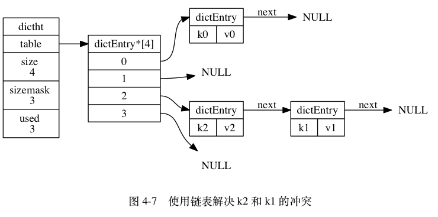
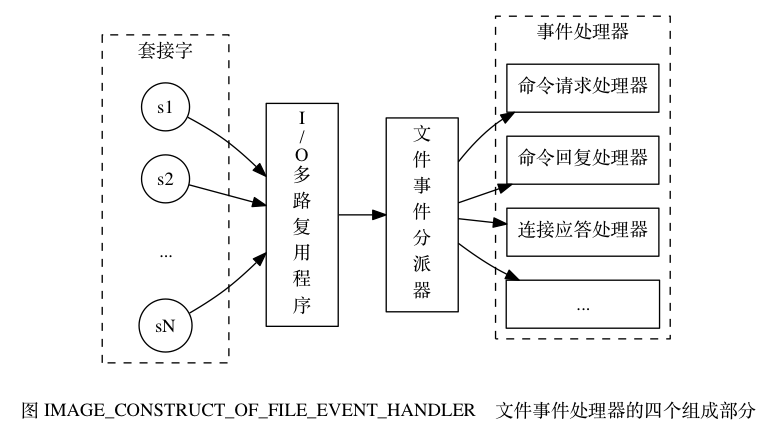
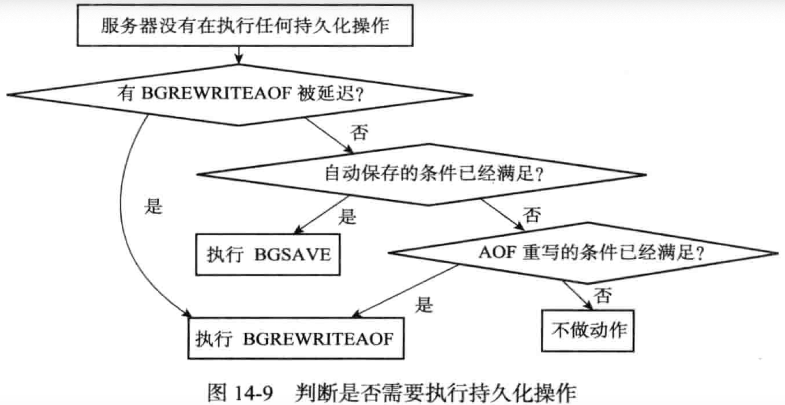
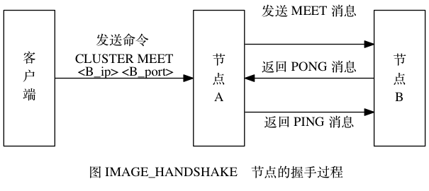

# Redis笔记

## 数据结构与对象

### 简单动态字符串

Redis构建了名为**简单动态字符串(simple dynamic string，SDS)**的抽象类型并以此作为**Redis默认字符串**表示

**SDS**

- **代表一个字符串字面量（C字符串功能）**

- **表示字符串值** 作为字符串值的键值对底层实现

  ```
  redis> RPUSH fruits "apple" "banana" "cherry"
  (integer) 3
  新的键值对：
  键是一个字符串对象， 对象的底层实现是一个保存了字符串 "fruits" 的 SDS
  值是一个列表对象， 列表对象包含了三个字符串对象， 这三个字符串对象分别由三个 SDS 实现
  	第一个 SDS 保存着字符串 "apple" 
  	第二个 SDS 保存着字符串 "banana" 
  	第三个 SDS 保存着字符串 "cherry"
  ```

- **缓冲区**

  - **AOF缓冲区**
  - **客户端状态的输入缓冲区**

#### SDS 的定义

每个 sds.h/sdshdr 结构表示一个 SDS 值

```c
struct sdshdr {
    // 记录 buf 数组中已使用字节的数量
    // 等于 SDS 所保存字符串的长度
    int len;
  
    // 记录 buf 数组中未使用字节的数量
    int free;
  
    // 字节数组，用于保存字符串 (和C字符串一样以空字符(由SDS函数自动完成且不计入len属性)结尾)
    char buf[];
};
```

##### 无未使用空间示例


##### 有未使用空间示例


#### SDS 与 C 字符串的区别

| C 字符串                                                     | SDS                                                          |
| :----------------------------------------------------------- | :----------------------------------------------------------- |
| **获取字符串长度的复杂度为 O(N)** <br />遍历整个字符串 对每个字符计数直到空字符 | **获取字符串长度的复杂度为 O(1)** <br />常数级别：直接从len属性获取(长度变更由SDS的API自动完成) |
| API 是不安全的，**可能会造成缓冲区溢出**                     | API 是安全的(**操作前检查SDS空间 不满足自动扩展**)，**不会造成缓冲区溢出** |
| 修改字符串长度 `N` 次**必然**需要执行 **`N` 次内存重分配**   | 修改字符串长度 `N` 次**最多**需要执行 `N` 次内存重分配<br />**空间预分配**：优化SDS字符串增长 **分配必要空间+额外未使用空间**<br />**惰性空间**：优化SDS字符串缩短 **需要缩短时不立即内存重分配+将缩短字节数量转为free属性的数量** |
| **只能保存文本数据**                                         | 可以保存**文本或者二进制**数据(**可以存空字符**)             |
| 可以**使用所有 `<string.h>` 库中的函数**                     | 兼容**部分** `<string.h>` 库中的函数                         |

### 链表

链表是最常用数据结构之一 Redis构建了**自用链表提供高效节点重排能力、顺序性节点访问方式、增删节点以灵活调整长度**

#### 用途

- **列表键底层实现**为链表：列表键包含**元素数量多/长字符串元素**
- **发布/订阅**
- **慢查询**
- **监视器**
- 保存**客户端状态**信息
- **客户端输出缓冲区**

#### 链表和链表节点的实现

**`adlist.h/listNode` 结构--链表节点**

```c
typedef struct listNode {
    // 前置节点
    struct listNode *prev;
  
    // 后置节点
    struct listNode *next;
  
    // 节点的值
    void *value;
} listNode;
```

**`adlist.h/list` 结构--链表**

`list` 结构为链表提供了**表头指针 `head` 、表尾指针 `tail` 、链表长度计数器 `len`** 

`dup` 、 `free` 和 `match` 是用于实现多态链表所需的类型特定函数

- **`dup` 函数用于复制链表节点所保存的值**
- **`free` 函数用于释放链表节点所保存的值**
- **`match` 函数则用于对比链表节点所保存的值和另一个输入值是否相等**

```c
typedef struct list {

    // 表头节点
    listNode *head;

    // 表尾节点
    listNode *tail;

    // 链表所包含的节点数量
    unsigned long len;

    // 节点值复制函数
    void *(*dup)(void *ptr);

    // 节点值释放函数
    void (*free)(void *ptr);

    // 节点值对比函数
    int (*match)(void *ptr, void *key);

} list;
```

**结构总览**


**Redis 的链表**实现的**特性**

- **双端**： 链表节点带有 `prev` 和 `next` 指针， 获取某个节点的前置节点和后置节点的复杂度都是 O(1) 。
- **无环**： 表头节点的 `prev` 指针和表尾节点的 `next` 指针都指向 `NULL` ， 对链表的访问以 `NULL` 为终点。
- **带表头指针和表尾指针**： `head` 指针和 `tail` 指针， 程序获取链表的表头节点和表尾节点的复杂度为 O(1) 。
- **带链表长度计数器**：  `len` 属性对 `list` 持有的链表节点进行计数， 程序获取链表中节点数量的复杂度为 O(1) 。
- **多态**： 链表节点用 `void*` 指针保存节点值且 `dup` 、 `free` 、 `match` 三个属性为节点值设置类型特定函数 **保存各种不同类型的值**

### 字典

字典是是用于**保存键值对（key-value pair）的抽象数据结构** 

#### 用途

- **表示Redis数据库**（增删改查基于操作字典）
- **哈希键底层实现**为字典：哈希键包含**键值对数量多/长字符串元素**

#### 字典的实现

**`dictEntry` 结构--哈希表节点**

```c
// 每个dictEntry结构都保存一个键值对
typedef struct dictEntry {

    // 键
    void *key;

    // 值 (三选一)
    union {
        void *val; // 指针
        uint64_t u64; // uint64_t 整数
        int64_t s64; // int64_t 整数
    } v;

    // 指向下个哈希表节点，形成链表 解决链冲突
    struct dictEntry *next;

} dictEntry;
```

**`dict.h/dictht` 结构--哈希表**

```c
typedef struct dictht {

    // 哈希表数组 每个元素都是指向哈希表节点(dictEntry)的指针
    dictEntry **table;

    // 哈希表大小 table数组大小
    unsigned long size;

    // 哈希表大小掩码，与哈希值共同用于计算索引值
    // 总是等于 size - 1
    unsigned long sizemask;

    // 该哈希表已有节点(键值对)的数量
    unsigned long used;

} dictht;
```

**`dict.h/dict` 结构--字典**

```c
typedef struct dict {

    // 类型特定函数 指向dictType指针
    dictType *type;

    // 私有数据 保存传给类型特定函数的可选参数
    void *privdata;

    // 哈希表 包含两个哈希表(dictht)数组 一般情况用ht[0] 特殊情况(rehash时)也用ht[1]
    dictht ht[2];

    // rehash索引 记录rehash进度
    // 当 rehash 不在进行时，值为 -1
    int rehashidx; /* rehashing not in progress if rehashidx == -1 */

} dict;
```

**dictType结构--类型特定函数**

```c
// 保存用于操作特定类型键值对的函数
typedef struct dictType {

    // 计算哈希值的函数
    unsigned int (*hashFunction)(const void *key);

    // 复制键的函数
    void *(*keyDup)(void *privdata, const void *key);

    // 复制值的函数
    void *(*valDup)(void *privdata, const void *obj);

    // 对比键的函数
    int (*keyCompare)(void *privdata, const void *key1, const void *key2);

    // 销毁键的函数
    void (*keyDestructor)(void *privdata, void *key);

    // 销毁值的函数
    void (*valDestructor)(void *privdata, void *obj);

} dictType;
```

**结构总览**


#### 哈希算法

将新的键值对添加到字典里：程序先**根据键值对的键计算出哈希值和索引值**->再根据**索引值将哈希表节点放到哈希表数组的指定索引**上

**Redis计算哈希值和索引值的方法**

```
# 使用字典设置的哈希函数，计算键 key 的哈希值
# Redis 使用 MurmurHash2 算法(输入键有规律时依然能保持随机分布性且速度快)来计算键的哈希值
hash = dict->type->hashFunction(key);

# 使用哈希表的 sizemask 属性和哈希值，计算出索引值
# 根据情况不同， ht[x] 可以是 ht[0] 或者 ht[1]
index = hash & dict->ht[x].sizemask;
```

#### 解决键冲突

**键冲突：有两个或以上数量的键被分配到了哈希表数组的同一个索引**

Redis哈希表使用**链地址法（separate chaining）来解决键冲突**：**被分配到同一个索引上的多个节点(都有next指针)可以用单向链表连接**(**新节点添加到链表的表头位置复杂度为O(1)**)




#### rehash 重新散列

程序为了**让哈希表的负载因子在合理范围内**需对**哈希表的大小进行相应的扩展或者收缩** 通过**执行rehash**来完成

1. 为字典的 **ht[1] 哈希表分配空间** 其**大小取决于要执行的操作** 以及 **ht[0] 当前包含的键值对数量** （即 ht[0].used 属性值）
   - **扩展操作**，`ht[1]` 的大小为**第一个大于等于 `ht[0].used * 2` 的 2^n** （`2` 的 `n` 次方幂）
   - **收缩操作**，`ht[1]` 的大小为**第一个大于等于 `ht[0].used` 的 2^n** 
2. 将**保存在 `ht[0]` 中的所有键值对 rehash 到 `ht[1]`** 上：**重新计算键的哈希值和索引值**并将键值对放置到 `ht[1]` 哈希表指定位置
3. **`ht[0]` 变为空表， 释放 `ht[0]`**
4. **将 `ht[1]` 设置为 `ht[0]`** 且在 **原来`ht[1]`位置上 新创建一个空白哈希表**， 为下一次 rehash 做准备

##### 哈希表扩展和收缩

- 以下**条件任一被满足**则执行**哈希表扩展**

- 1. 服务器目前**没有执行 BGSAVE/BGREWRITEAOF 命令且哈希表的负载因子>=1**
  2. 服务器目前**正在执行 BGSAVE/BGREWRITEAOF 命令且哈希表的负载因子>=5**
     1. 执行BGSAVE/BGREWRITEAOF 命令时会由于**写时复制提高子进程效率提高哈希表扩展的负载因子**

- **哈希表的负载因子<=0.1时执行哈希表收缩**

- **负载因子计算**

  ```c
  # 负载因子 = 哈希表已保存节点数量 / 哈希表大小
  load_factor = ht[0].used / ht[0].size
  ```

#### 渐进式 rehash

rehash动作是**分多次、渐进式**的完成的

- **避免一次性rehash对服务器性能造成影响和庞大计算量**
- 分而治之 将rehash**计算工作均摊到对字典的增删改查操作上**

**渐进式rehash步骤**

1. **为 `ht[1]` 分配空间** 字典同时持有 `ht[0]` 和 `ht[1]` 两个哈希表
2. **rehash 正式开始**：字典中维持一个**索引计数器变量 `rehashidx` 将其值设置为 `0`** 
3. 在 **rehash 进行**期间， 每次**对字典执行添加、删除、查找或者更新操作**时
   1. 程序**执行指定的操作**
      1. 字典的**增删改查都在两个哈希表进行**
      2. 查找键时**先从 ht[0] 找** 找不到再去 ht[1] 找
      3. **新添加的键值对都保存在 ht[1]** 里：保证 **ht[0]** 键值对只减不增 **rehash执行完成后成为空表**
   2. 将 `ht[0]` 哈希表在 **`rehashidx` 索引上的所有键值对 rehash 到 `ht[1]`**
   3. rehash 工作完成 程序将 **`rehashidx` 属性的值+1**
4. rehash **操作已完成**
   1. **`ht[0]` 的所有键值对都会被 rehash 至 `ht[1]`** 
   2. 程序将 **`rehashidx` 属性的值设为 `-1`**

### 跳跃表

**跳跃表**是一种通过**节点持有多个访问其他节点的指针**构成的**有序数据结构**

可**快速访问节点**：**节点查找复杂度平均O(log N)**/最坏O(N) 可**顺序性批量处理节点**

#### 用途

- **有序集合键底层实现**为跳跃表：有序集合键包含**元素数量多/长字符串元素成员**
- **集群节点**中用作内部数据结构

#### 跳跃表的实现

**`redis.h/zskiplistNode`结构--跳跃表节点**

```c
typedef struct zskiplistNode {

    // 后退指针 访问表头方向 从后往前遍历时只能后退一个节点
    struct zskiplistNode *backward;

    // 分值 double类型浮点数 节点按该值从小到大排列 同一跳跃表各个节点分值可相同
    double score;

    // 成员对象 指针->字符串对象->SDS值 同一跳跃表各个节点成员对象唯一 分值相同按照成员对象字典序大小排序
    robj *obj;

    // 层 加快访问节点速度
    struct zskiplistLevel {

        // 前进指针 访问表尾方向的节点
        struct zskiplistNode *forward;

        // 跨度 记录前进指针指向节点和当前节点的距离 指向NULL的所有前进指针跨度都为0
        unsigned int span;

    } level[]; // level数组可包含多个元素 大小由创建新zskiplistNode时根据幂次定律随机生成1-32之间的值决定

} zskiplistNode;
```

**`zskiplist` 结构--跳跃表**

```c
typedef struct zskiplist {

    // 表头节点和表尾节点指针 定位表头节点和表尾节点的复杂度为 O(1) 
    struct zskiplistNode *header, *tail;

    // 表中节点的数量 O(1) 复杂度内返回跳跃表长度
    unsigned long length;

    // 表中层数最大的节点的层数 O(1)复杂度内获取跳跃表中层高最大的节点层数量(表头节点的层高不计算在内）
    int level;

} zskiplist;
```

**结构总览**


### 整数集合

整数集合是Redis用于**保存整数值**的集合**抽象数据结构** 可保存int16_t、int32_t、int64_t整数值且**无重复元素**

#### 用途

**集合键的底层实现**为整数集合：**整数值元素不多**

#### 整数集合的实现

**`intset.h/intset` 结构--整数集合**

```c
typedef struct intset {

    // 编码方式
  	// INTSET_ENC_INT16：contents为int16_t类型数组
  	// INTSET_ENC_INT32：contents为int32_t类型数组
  	// INTSET_ENC_INT64：contents为int64_t类型数组
    uint32_t encoding;

    // 集合包含的元素数量 contents数组长度
    uint32_t length;

    // 保存元素的数组 整数集合每个元素都是contents数组的一个数组项(item) 按值大小排序
  	// 声明为int8_t 但实际上由encoding值决定
    int8_t contents[];

} intset;
```

#### 升级

升级(upgrade)：**新元素的类型比整数集合现有所有元素的类型都要长**时需要对整数集合升级

**升级整数集合并添加新元素步骤**

1. 根据**新元素的类型** **扩展整数集合底层数组的空间大小** 并**为新元素分配空间**
2. 将**底层数组现有的所有元素都转换成与新元素相同的类型**并将**类型转换后的元素放置到正确位置并维持底层数组的有序性质**
3. 将**新元素添加到底层数组**里

##### 示例

一个 `INTSET_ENC_INT16` 编码的整数集合， 集合中包含三个 `int16_t` 类型的元素


整数集合的三个元素(每个占16位)在 `48` 位里的位置


将 `int32_t` 的整数值 `65535` 添加到整数集合 先进行整数集合升级

**根据新类型长度+集合元素(包括新元素)数量**对底层数组**空间重分配**


挪动前三个元素在新数组的位置


添加新元素


 **`encoding` 属性值**从 `INTSET_ENC_INT16` **改为 `INTSET_ENC_INT32`** ， 并将 **`length` 属性值**从 `3` **改为 `4`**


每次添加新元素都可能导致升级(对底层数组所有元素类型转换)：**整数集合添加新元素时间复杂度为O(N)**

##### 升级后新元素摆放位置

新元素的值要么就大于所有现有元素（正数） 要么就小于所有现有元素（负数）

- 在**新元素小于所有现有元素**的情况下， 新元素会被**放置在底层数组的最开头（索引 `0` ）**
- 在**新元素大于所有现有元素**的情况下， 新元素会被**放置在底层数组的最末尾（索引 `length-1` ）**

##### 升级的好处

###### 提升灵活性

整数集合通过**自动升级底层数组可以适应新元素**(`int16_t` 、 `int32_t` 或者 `int64_t` 整数**随意整型转换**) **无类型错误**

###### 节约内存

如果**图省事**存 `int16_t` 、 `int32_t` 、 `int64_t` 的值**可直接使用 `int64_t` 类型的数组** 但这样浪费内存

用整数集合可以在**需要添加大元素的时候再升级 节约内存**

#### 降级

**整数集合不支持降级**

### 压缩列表

压缩列表是 Redis 为了**节约内存**而开发的由一系列**特殊编码的连续内存块组成**的**顺序型数据结构**

#### 用途

- **列表键的底层实现**为压缩列表：**列表项是小整数值/短字符串**
- **哈希键的底层实现**为压缩列表：**少量键值对（键和值是小整数值/短字符串）**

#### 压缩列表的构成

压缩表可以**包含任意多个节点(Entry) 节点保存一个字节数组/整数值**


| 属性          | 类型       | 长度      | 用途                                                         |
| :------------ | :--------- | :-------- | :----------------------------------------------------------- |
| **`zlbytes`** | `uint32_t` | `4` bytes | 记录**整个压缩列表占用的内存字节数**：**对压缩列表进行内存重分配或计算 `zlend` 位置时使用** |
| **`zltail`**  | `uint32_t` | `4` bytes | 记录压缩列表**表尾节点距离压缩列表的起始地址有多少字节(偏移量)**： 常数复杂度确定表尾节点的地址 |
| **`zllen`**   | `uint16_t` | `2` bytes | 记录了压缩列表**包含的节点数量**： 当这个属性的值**小于** `UINT16_MAX` （`65535`）时， 这个属性的值就是压缩列表包含**节点的数量**； 当这个值**等于 `UINT16_MAX`** 时， 节点的**真实数量需要遍历整个压缩列表**才能计算得出 |
| **`entryX`**  | 列表节点   | 不定      | 压缩列表包含的**各个节点，长度由节点保存的内容决定**         |
| **`zlend`**   | `uint8_t`  | `1` byte  | **特殊值 `0xFF` （十进制 `255` ）标记压缩列表的末端**        |

#### 压缩列表节点的构成

**每个压缩列表节点(Entry)可以保存一个字节数组或一个整数值**

###### **字节数组选项**

1. 长度小于等于 `63` （2^{6}-1）字节的字节数组
2. 长度小于等于 `16383` （2^{14}-1） 字节的字节数组
3. 长度小于等于 `4294967295` （2^{32}-1）字节的字节数组

###### **整数值选项**

1. `4` 位长，介于 `0` 至 `12` 之间的无符号整数
2. `1` 字节长的有符号整数
3. `3` 字节长的有符号整数
4. `int16_t` 类型整数
5. `int32_t` 类型整数
6. `int64_t` 类型整数

**节点构成**


###### previous_entry_length属性

`previous_entry_length` 属性以**字节为单位记录了压缩列表中前一个节点的长度**

长度可以是 `1` 字节或者 `5` 字节

- 如果前一节点的长度**小于 `254` 字节  `previous_entry_length` 属性的长度为 `1` 字节： 前一节点的长度就保存在这一个字节里**
- 如果前一节点的长度**大于等于 `254` 字节 `previous_entry_length` 属性的长度为 `5` 字节： 其中属性的第一字节会被设置为 `0xFE` （十进制值 `254`）， 而之后的四个字节则用于保存前一节点的长度**

示例： `0xFE00002766`：高位 `0xFE` 代表五字节长、 `0x00002766` （十进制值 `10086` ）是前一节点的实际长度


其值记录了前一个节点的长度 程序可以**通过指针运算 根据当前节点的起始地址来计算出前一个节点的起始地址**

###### encoding属性

 `encoding` 属性记录了节点的 `content` 属性所保存数据的类型以及长度

- **一字节、两字节或者五字节长**， 值的**最高位为 `00` 、 `01` 或者 `10` 的是字节数组编码**： 这种编码表示节点的 `content` 属性保存着字节数组， **数组的长度由编码除去最高两位之后的其他位记录**
- **一字节长**， 值的**最高位以 `11` 开头的是整数编码**： 这种编码表示节点的 `content` 属性保存着整数值， **整数值的类型和长度由编码除去最高两位之后的其他位记录**

Note：**下划线表示留空  b、x表示实际二进制数据  多字节间用空格隔开**

| 编码                                           | 编码长度 | `content` 属性保存的值                                       |
| :--------------------------------------------- | :------- | :----------------------------------------------------------- |
| `00bbbbbb`                                     | `1` 字节 | 长度小于等于 `63` 字节的字节数组                             |
| `01bbbbbb xxxxxxxx`                            | `2` 字节 | 长度小于等于 `16383` 字节的字节数组                          |
| `10______ aaaaaaaa bbbbbbbb cccccccc dddddddd` | `5` 字节 | 长度小于等于 `4294967295` 的字节数组                         |
| `11000000`                                     | `1` 字节 | `int16_t` 类型的整数                                         |
| `11010000`                                     | `1` 字节 | `int32_t` 类型的整数                                         |
| `11100000`                                     | `1` 字节 | `int64_t` 类型的整数                                         |
| `11110000`                                     | `1` 字节 | `24` 位有符号整数                                            |
| `11111110`                                     | `1` 字节 | `8` 位有符号整数                                             |
| `1111xxxx`                                     | `1` 字节 | 节点没有相应的 `content` 属性<br />编码本身 `xxxx` 已经保存了介于 `0` 和 `12` 之间的值<br />无须 `content` 属性。 |

###### content属性

`content` 属性负责**保存节点的值， 节点值可以是一个字节数组或者整数， 值的类型和长度由节点的 `encoding` 属性决定**

#### 连锁更新

##### 特殊节点中增加新节点

 在一个压缩列表中， 有**多个连续的、长度介于 `250` 字节到 `253` 字节之间的节点 `e1` 至 `eN`** 

`e1` 至 `eN` 的**所有节点的长度都小于 `254` 字节**：记录这些节点的长度**只需要 `1` 字节长的 `previous_entry_length` 属性**

此时**将一个长度大于等于 `254` 字节的新节点 `new` 设置为压缩列表的表头节点** 那么 `new` 将成为 `e1` 的前置节点


##### 删除节点也可能引发连锁更新

- `e1` 至 `eN` 都是大小介于 `250` 字节至 `253` 字节的节点且 `big` 节点的长度大于等于 `254` 字节（需要 `5` 字节的 `previous_entry_length` 来保存）
- 而 `small` 节点的长度小于 `254` 字节（只需要 `1` 字节的 `previous_entry_length` 来保存）
- 将 `small` 节点从压缩列表中删除
- 为了让 `e1` 的 `previous_entry_length` 属性可以记录 `big` 节点的长度， 程序将扩展 `e1` 的空间
- 引发之后的连锁更新


##### 连锁更新分析

- 最坏情况需要对压缩列表执行N次空间重分配(O(N))->**连锁更新最坏复杂度为 O(N^2)** 
- 虽然复杂度高 但是**连锁更新真正造成性能问题的几率很低**
  - 压缩列表要恰好有多个连续的、长度介于 `250` 字节至 `253` 字节之间的节点 **条件苛刻不易发生**
  - 出现**连锁更新的节点数量不多**不会影响性能

### 对象

Redis基于以上数据结构创建了一个**对象系统**：包含**字符串对象、列表对象、哈希对象、集合对象和有序集合对象**这五种类型的对象

通过以上五种对象 Redis可以**根据对象类型执行相应命令 优化对象在不同场景下的使用效率**

#### 对象的类型与编码

Redis 使用对象来表示数据库中键值对的键和值 

至少会创建两个对象 一个对象用作键值对的键（键对象）另一个对象用作键值对的值（值对象）

```c
typedef struct redisObject {

    // 类型
    unsigned type:4;

    // 编码
    unsigned encoding:4;

    // 指向底层实现数据结构的指针
    void *ptr;

    // ...

} robj;
```

##### 类型

对象的 `type` 属性记录了对象的类型

 键值对中**键总是一个字符串对象 值可以是五种类型对象的一种** (字符串键：值为字符串对象、列表键：值为列表对象)

| 类型常量       | 对象的名称   |
| :------------- | :----------- |
| `REDIS_STRING` | 字符串对象   |
| `REDIS_LIST`   | 列表对象     |
| `REDIS_HASH`   | 哈希对象     |
| `REDIS_SET`    | 集合对象     |
| `REDIS_ZSET`   | 有序集合对象 |

**不同类型值对象的 TYPE 命令输出(值对象类型 不是键对象类型)**

| 对象         | 对象 `type` 属性的值 | TYPE 命令的输出 |
| :----------- | :------------------- | :-------------- |
| 字符串对象   | `REDIS_STRING`       | `"string"`      |
| 列表对象     | `REDIS_LIST`         | `"list"`        |
| 哈希对象     | `REDIS_HASH`         | `"hash"`        |
| 集合对象     | `REDIS_SET`          | `"set"`         |
| 有序集合对象 | `REDIS_ZSET`         | `"zset"`        |

##### 编码和底层实现

对象的 **`encoding` 属性**记录了**对象使用的编码** **不为特定类型对象关联一种固定编码** 极大**提升Redis灵活性和效率**

**对象编码**

| 编码常量                    | 编码所对应的底层数据结构      |
| :-------------------------- | :---------------------------- |
| `REDIS_ENCODING_INT`        | `long` 类型的整数             |
| `REDIS_ENCODING_EMBSTR`     | `embstr` 编码的简单动态字符串 |
| `REDIS_ENCODING_RAW`        | 简单动态字符串                |
| `REDIS_ENCODING_HT`         | 字典                          |
| `REDIS_ENCODING_LINKEDLIST` | 双端链表                      |
| `REDIS_ENCODING_ZIPLIST`    | 压缩列表                      |
| `REDIS_ENCODING_INTSET`     | 整数集合                      |
| `REDIS_ENCODING_SKIPLIST`   | 跳跃表和字典                  |

每种类型对象都至少使用两种不同编码

| 类型           | 编码                        | 对象                                                 |
| :------------- | :-------------------------- | :--------------------------------------------------- |
| `REDIS_STRING` | `REDIS_ENCODING_INT`        | 使用整数值实现的字符串对象。                         |
| `REDIS_STRING` | `REDIS_ENCODING_EMBSTR`     | 使用 `embstr` 编码的简单动态字符串实现的字符串对象。 |
| `REDIS_STRING` | `REDIS_ENCODING_RAW`        | 使用简单动态字符串实现的字符串对象。                 |
| `REDIS_LIST`   | `REDIS_ENCODING_ZIPLIST`    | 使用压缩列表实现的列表对象。                         |
| `REDIS_LIST`   | `REDIS_ENCODING_LINKEDLIST` | 使用双端链表实现的列表对象。                         |
| `REDIS_HASH`   | `REDIS_ENCODING_ZIPLIST`    | 使用压缩列表实现的哈希对象。                         |
| `REDIS_HASH`   | `REDIS_ENCODING_HT`         | 使用字典实现的哈希对象。                             |
| `REDIS_SET`    | `REDIS_ENCODING_INTSET`     | 使用整数集合实现的集合对象。                         |
| `REDIS_SET`    | `REDIS_ENCODING_HT`         | 使用字典实现的集合对象。                             |
| `REDIS_ZSET`   | `REDIS_ENCODING_ZIPLIST`    | 使用压缩列表实现的有序集合对象。                     |
| `REDIS_ZSET`   | `REDIS_ENCODING_SKIPLIST`   | 使用跳跃表和字典实现的有序集合对象。                 |

查看数据库键的值对象编码：**OBJECT ENCODING `key`**

OBJECT ENCODING **对不同编码的输出**

| 对象所使用的底层数据结构             | 编码常量                    | OBJECT ENCODING 命令输出 |
| :----------------------------------- | :-------------------------- | :----------------------- |
| 整数                                 | `REDIS_ENCODING_INT`        | `"int"`                  |
| `embstr` 编码的简单动态字符串（SDS） | `REDIS_ENCODING_EMBSTR`     | `"embstr"`               |
| 简单动态字符串                       | `REDIS_ENCODING_RAW`        | `"raw"`                  |
| 字典                                 | `REDIS_ENCODING_HT`         | `"hashtable"`            |
| 双端链表                             | `REDIS_ENCODING_LINKEDLIST` | `"linkedlist"`           |
| 压缩列表                             | `REDIS_ENCODING_ZIPLIST`    | `"ziplist"`              |
| 整数集合                             | `REDIS_ENCODING_INTSET`     | `"intset"`               |
| 跳跃表和字典                         | `REDIS_ENCODING_SKIPLIST`   | `"skiplist"`             |

#### 字符串对象

- **保存整数值**：用long类型表示 将**整数值保存在字符串对象结构 `ptr`** 属性里 (void* 替换为long)  `encoding`属性设置为**REDIS_ENCODING_INT**
- **保存字符串值且值长度大于39字节**：将**SDS保存在字符串对象结构 `ptr`** 属性里 (void* 替换为SDS结构指针)  `encoding`属性设置为**REDIS_ENCODING_RAW**
  - raw编码**调用两次内存分配函数分别创建 `redisObject` 结构和 `sdshdr` 结构**
- **保存字符串值且值长度小等于39字节**：将**SDS保存在字符串对象结构 `ptr`** 属性里 (void* 替换为SDS结构指针)  `encoding`属性设置为**REDIS_ENCODING_EMBSTR**
  - **优化短字符串**的embstr编码 
  - **只需调用一次内存分配(释放)函数创建(释放) `redisObject` 结构和 `sdshdr` 结构（连续空间 更好利用缓存）**
- **保存long double类型浮点数**：**先转换为字符串值再保存**

##### 编码的转换

以下条件满足时int/embstr编码会**转换为raw编码的字符串对象**

- **向int编码字符串对象执行命令使得对象保存字符串值**（例：APPEND 追加字符串值）
- **向embstr编码字符串对象执行任何修改命令**（**embstr没有修改程序** 需要先将编码embstr->raw再执行修改命令）

##### 字符串在不同编码下命令的实现

| 命令        | `int` 编码的实现方法                                         | `embstr` 编码的实现方法                                      | `raw` 编码的实现方法                                         |
| :---------- | :----------------------------------------------------------- | :----------------------------------------------------------- | :----------------------------------------------------------- |
| SET         | 使用 `int` 编码保存值。                                      | 使用 `embstr` 编码保存值。                                   | 使用 `raw` 编码保存值。                                      |
| GET         | 拷贝对象所保存的整数值， 将这个拷贝转换成字符串值， 然后向客户端返回这个字符串值。 | 直接向客户端返回字符串值。                                   | 直接向客户端返回字符串值。                                   |
| APPEND      | 将对象转换成 `raw` 编码， 然后按 `raw` 编码的方式执行此操作。 | 将对象转换成 `raw` 编码， 然后按 `raw` 编码的方式执行此操作。 | 调用 `sdscatlen` 函数， 将给定字符串追加到现有字符串的末尾。 |
| INCRBYFLOAT | 取出整数值并将其转换成 `long double` 类型的浮点数， 对这个浮点数进行加法计算， 然后将得出的浮点数结果保存起来。 | 取出字符串值并尝试将其转换成 `long double` 类型的浮点数， 对这个浮点数进行加法计算， 然后将得出的浮点数结果保存起来。 如果字符串值不能被转换成浮点数， 那么向客户端返回一个错误。 | 取出字符串值并尝试将其转换成 `long double` 类型的浮点数， 对这个浮点数进行加法计算， 然后将得出的浮点数结果保存起来。 如果字符串值不能被转换成浮点数， 那么向客户端返回一个错误。 |
| INCRBY      | 对整数值进行加法计算， 得出的计算结果会作为整数被保存起来。  | `embstr` 编码不能执行此命令， 向客户端返回一个错误。         | `raw` 编码不能执行此命令， 向客户端返回一个错误。            |
| DECRBY      | 对整数值进行减法计算， 得出的计算结果会作为整数被保存起来。  | `embstr` 编码不能执行此命令， 向客户端返回一个错误。         | `raw` 编码不能执行此命令， 向客户端返回一个错误。            |
| STRLEN      | 拷贝对象所保存的整数值， 将这个拷贝转换成字符串值， 计算并返回这个字符串值的长度。 | 调用 `sdslen` 函数， 返回字符串的长度。                      | 调用 `sdslen` 函数， 返回字符串的长度。                      |
| SETRANGE    | 将对象转换成 `raw` 编码， 然后按 `raw` 编码的方式执行此命令。 | 将对象转换成 `raw` 编码， 然后按 `raw` 编码的方式执行此命令。 | 将字符串特定索引上的值设置为给定的字符。                     |
| GETRANGE    | 拷贝对象所保存的整数值， 将这个拷贝转换成字符串值， 然后取出并返回字符串指定索引上的字符。 | 直接取出并返回字符串指定索引上的字符。                       | 直接取出并返回字符串指定索引上的字符。                       |

#### 列表对象

- **使用压缩列表：每个压缩列表节点保存一个列表元素**
- **使用双端链表：每个链表节点保存一个字符串元素(五类型对象中唯一一种可被其他类型对象嵌套) 每个字符串元素保存一个列表元素**

##### 编码转换

列表对象可同时**满足以下两个条件时使用 `ziplist` 编码**

1. 列表对象保存的**所有字符串元素的长度都小于 `64` 字节** 上限值用 `list-max-ziplist-value` 选项修改
2. 列表对象保存的**元素数量小于 `512` 个** 上限值用 `list-max-ziplist-entries` 选项修改

**不满足任意以上条件使用 `linkedlist` 编码**

##### 列表键在不同编码下命令的实现

| 命令    | `ziplist` 编码的实现方法                                     | `linkedlist` 编码的实现方法                                  |
| :------ | :----------------------------------------------------------- | :----------------------------------------------------------- |
| LPUSH   | 调用 `ziplistPush` 函数， 将新元素推入到压缩列表的表头。     | 调用 `listAddNodeHead` 函数， 将新元素推入到双端链表的表头。 |
| RPUSH   | 调用 `ziplistPush` 函数， 将新元素推入到压缩列表的表尾。     | 调用 `listAddNodeTail` 函数， 将新元素推入到双端链表的表尾。 |
| LPOP    | 调用 `ziplistIndex` 函数定位压缩列表的表头节点， 在向用户返回节点所保存的元素之后， 调用 `ziplistDelete` 函数删除表头节点。 | 调用 `listFirst` 函数定位双端链表的表头节点， 在向用户返回节点所保存的元素之后， 调用 `listDelNode` 函数删除表头节点。 |
| RPOP    | 调用 `ziplistIndex` 函数定位压缩列表的表尾节点， 在向用户返回节点所保存的元素之后， 调用 `ziplistDelete` 函数删除表尾节点。 | 调用 `listLast` 函数定位双端链表的表尾节点， 在向用户返回节点所保存的元素之后， 调用 `listDelNode` 函数删除表尾节点。 |
| LINDEX  | 调用 `ziplistIndex` 函数定位压缩列表中的指定节点， 然后返回节点所保存的元素。 | 调用 `listIndex` 函数定位双端链表中的指定节点， 然后返回节点所保存的元素。 |
| LLEN    | 调用 `ziplistLen` 函数返回压缩列表的长度。                   | 调用 `listLength` 函数返回双端链表的长度。                   |
| LINSERT | 插入新节点到压缩列表的表头或者表尾时， 使用 `ziplistPush` 函数； 插入新节点到压缩列表的其他位置时， 使用 `ziplistInsert` 函数。 | 调用 `listInsertNode` 函数， 将新节点插入到双端链表的指定位置。 |
| LREM    | 遍历压缩列表节点， 并调用 `ziplistDelete` 函数删除包含了给定元素的节点。 | 遍历双端链表节点， 并调用 `listDelNode` 函数删除包含了给定元素的节点。 |
| LTRIM   | 调用 `ziplistDeleteRange` 函数， 删除压缩列表中所有不在指定索引范围内的节点。 | 遍历双端链表节点， 并调用 `listDelNode` 函数删除链表中所有不在指定索引范围内的节点。 |
| LSET    | 调用 `ziplistDelete` 函数， 先删除压缩列表指定索引上的现有节点， 然后调用 `ziplistInsert` 函数， 将一个包含给定元素的新节点插入到相同索引上面。 | 调用 `listIndex` 函数， 定位到双端链表指定索引上的节点， 然后通过赋值操作更新节点的值。 |

#### 哈希对象

- **使用压缩列表：保存键的压缩列表节点并推入压缩列表表尾且同一键值对的键和值紧挨着**
- **使用字典：字符串对象分别保存字典的键和值**

##### 编码转换

**同时满足以下两个条件**时哈希对象使用 **`ziplist` 编码**

1. 所有键值对的**键和值的字符串长度都小于 `64` 字节**
2. **键值对数量小于 `512` 个**

**不能满足**这两个条件的哈希对象需要使用 **`hashtable` 编码**

##### 哈希键在不同编码下命令的实现

| 命令    | `ziplist` 编码实现方法                                       | `hashtable` 编码的实现方法                                   |
| :------ | :----------------------------------------------------------- | :----------------------------------------------------------- |
| HSET    | 首先调用 `ziplistPush` 函数， 将键推入到压缩列表的表尾， 然后再次调用 `ziplistPush` 函数， 将值推入到压缩列表的表尾。 | 调用 `dictAdd` 函数， 将新节点添加到字典里面。               |
| HGET    | 首先调用 `ziplistFind` 函数， 在压缩列表中查找指定键所对应的节点， 然后调用 `ziplistNext` 函数， 将指针移动到键节点旁边的值节点， 最后返回值节点。 | 调用 `dictFind` 函数， 在字典中查找给定键， 然后调用 `dictGetVal` 函数， 返回该键所对应的值。 |
| HEXISTS | 调用 `ziplistFind` 函数， 在压缩列表中查找指定键所对应的节点， 如果找到的话说明键值对存在， 没找到的话就说明键值对不存在。 | 调用 `dictFind` 函数， 在字典中查找给定键， 如果找到的话说明键值对存在， 没找到的话就说明键值对不存在。 |
| HDEL    | 调用 `ziplistFind` 函数， 在压缩列表中查找指定键所对应的节点， 然后将相应的键节点、 以及键节点旁边的值节点都删除掉。 | 调用 `dictDelete` 函数， 将指定键所对应的键值对从字典中删除掉。 |
| HLEN    | 调用 `ziplistLen` 函数， 取得压缩列表包含节点的总数量， 将这个数量除以 `2` ， 得出的结果就是压缩列表保存的键值对的数量。 | 调用 `dictSize` 函数， 返回字典包含的键值对数量， 这个数量就是哈希对象包含的键值对数量。 |
| HGETALL | 遍历整个压缩列表， 用 `ziplistGet` 函数返回所有键和值（都是节点）。 | 遍历整个字典， 用 `dictGetKey` 函数返回字典的键， 用 `dictGetVal` 函数返回字典的值。 |

#### 集合对象

- **使用整数集合：集合对象所有元素保存在整数集合中**
- **使用字典：字典的每个键都是字符串对象（包含集合元素）值全部被设置成NULL**

##### 编码转换

**同时满足以下两个条件**时集合对象使用 **`intset` 编码**

1. **所有元素都是整数值**
2. **元素数量不超过 `512` 个**

**不能满足**这两个条件的集合对象需要使用 **`hashtable` 编码**

##### 集合键在不同编码下命令的实现

| 命令        | `intset` 编码的实现方法                                      | `hashtable` 编码的实现方法                                   |
| :---------- | :----------------------------------------------------------- | :----------------------------------------------------------- |
| SADD        | 调用 `intsetAdd` 函数， 将所有新元素添加到整数集合里面。     | 调用 `dictAdd` ， 以新元素为键， `NULL` 为值， 将键值对添加到字典里面。 |
| SCARD       | 调用 `intsetLen` 函数， 返回整数集合所包含的元素数量， 这个数量就是集合对象所包含的元素数量。 | 调用 `dictSize` 函数， 返回字典所包含的键值对数量， 这个数量就是集合对象所包含的元素数量。 |
| SISMEMBER   | 调用 `intsetFind` 函数， 在整数集合中查找给定的元素， 如果找到了说明元素存在于集合， 没找到则说明元素不存在于集合。 | 调用 `dictFind` 函数， 在字典的键中查找给定的元素， 如果找到了说明元素存在于集合， 没找到则说明元素不存在于集合。 |
| SMEMBERS    | 遍历整个整数集合， 使用 `intsetGet` 函数返回集合元素。       | 遍历整个字典， 使用 `dictGetKey` 函数返回字典的键作为集合元素。 |
| SRANDMEMBER | 调用 `intsetRandom` 函数， 从整数集合中随机返回一个元素。    | 调用 `dictGetRandomKey` 函数， 从字典中随机返回一个字典键。  |
| SPOP        | 调用 `intsetRandom` 函数， 从整数集合中随机取出一个元素， 在将这个随机元素返回给客户端之后， 调用 `intsetRemove` 函数， 将随机元素从整数集合中删除掉。 | 调用 `dictGetRandomKey` 函数， 从字典中随机取出一个字典键， 在将这个随机字典键的值返回给客户端之后， 调用 `dictDelete` 函数， 从字典中删除随机字典键所对应的键值对。 |
| SREM        | 调用 `intsetRemove` 函数， 从整数集合中删除所有给定的元素。  | 调用 `dictDelete` 函数， 从字典中删除所有键为给定元素的键值对。 |

#### 有序集合对象

- **使用压缩列表：集合元素用两个紧挨着的节点(元素的成员+元素的分值)存储**
  - **集合元素按分值由小到大排序(即在列表中的位置)**
- **使用跳跃表+字典：两者使用指针共享元素成员和分值 保证不产生重复成员/分值 避免内存浪费**
  - **跳跃表节点保存集合元素（`object`属性保存元素成员、`score`属性保存元素分值） 保证对有序集合进行范围操作**
  - **字典保存成员到分值的映射（字典键保存元素成员、字典值保存元素分值）用常数复杂度查找给定成员的分值**

##### 编码转换

**同时满足以下两个条件**时有序集合对象使用 **`ziplist` 编码**

1. **元素数量小于 `128` 个**
2. **所有元素成员的长度都小于 `64` 字节**

**不能满足**以上两个条件的有序集合对象将使用 **`skiplist` 编码**

##### 有序集合键在不同编码下命令的实现

| 命令      | `ziplist` 编码的实现方法                                     | `zset` 编码的实现方法                                        |
| :-------- | :----------------------------------------------------------- | :----------------------------------------------------------- |
| ZADD      | 调用 `ziplistInsert` 函数， 将成员和分值作为两个节点分别插入到压缩列表。 | 先调用 `zslInsert` 函数， 将新元素添加到跳跃表， 然后调用 `dictAdd` 函数， 将新元素关联到字典。 |
| ZCARD     | 调用 `ziplistLen` 函数， 获得压缩列表包含节点的数量， 将这个数量除以 `2` 得出集合元素的数量。 | 访问跳跃表数据结构的 `length` 属性， 直接返回集合元素的数量。 |
| ZCOUNT    | 遍历压缩列表， 统计分值在给定范围内的节点的数量。            | 遍历跳跃表， 统计分值在给定范围内的节点的数量。              |
| ZRANGE    | 从表头向表尾遍历压缩列表， 返回给定索引范围内的所有元素。    | 从表头向表尾遍历跳跃表， 返回给定索引范围内的所有元素。      |
| ZREVRANGE | 从表尾向表头遍历压缩列表， 返回给定索引范围内的所有元素。    | 从表尾向表头遍历跳跃表， 返回给定索引范围内的所有元素。      |
| ZRANK     | 从表头向表尾遍历压缩列表， 查找给定的成员， 沿途记录经过节点的数量， 当找到给定成员之后， 途经节点的数量就是该成员所对应元素的排名。 | 从表头向表尾遍历跳跃表， 查找给定的成员， 沿途记录经过节点的数量， 当找到给定成员之后， 途经节点的数量就是该成员所对应元素的排名。 |
| ZREVRANK  | 从表尾向表头遍历压缩列表， 查找给定的成员， 沿途记录经过节点的数量， 当找到给定成员之后， 途经节点的数量就是该成员所对应元素的排名。 | 从表尾向表头遍历跳跃表， 查找给定的成员， 沿途记录经过节点的数量， 当找到给定成员之后， 途经节点的数量就是该成员所对应元素的排名。 |
| ZREM      | 遍历压缩列表， 删除所有包含给定成员的节点， 以及被删除成员节点旁边的分值节点。 | 遍历跳跃表， 删除所有包含了给定成员的跳跃表节点。 并在字典中解除被删除元素的成员和分值的关联。 |
| ZSCORE    | 遍历压缩列表， 查找包含了给定成员的节点， 然后取出成员节点旁边的分值节点保存的元素分值。 | 直接从字典中取出给定成员的分值。                             |

#### 类型检查与命令多态

**操作键命令**

**对任何类型键执行：DEL 命令、 EXPIRE 命令、 RENAME 命令、 TYPE 命令、 OBJECT 命令**

对**特定类型键**执行

- **SET 、 GET 、 APPEND 、 STRLEN** 等命令只能对**字符串键**执行；
- **HDEL 、 HSET 、 HGET 、 HLEN** 等命令只能对**哈希键**执行；
- **RPUSH 、 LPOP 、 LINSERT 、 LLEN** 等命令只能对**列表键**执行；
- **SADD 、 SPOP 、 SINTER 、 SCARD** 等命令只能对**集合键**执行；
- **ZADD 、 ZCARD 、 ZRANK 、 ZSCORE** 等命令只能对**有序集合键**执行；

##### 类型检查

执行命令：**检查输入键类型是否正确->是否执行给定命令**

**类型检查通过`redisObject`结构的`type`属性实现的**

- **执行类型特定命令之前 服务器检查数据库键的值是否为执行命令所需的类型**
  - **是 对键执行命令**
  - **不是 拒绝执行命令 向客户端返回类型错误**

##### 多态命令

**多态命令：根据值对象的编码方式选择正确命令实现代码来执行命令** 

所有操作键命令都是多态命令(**所有键命令--基于类型的多态、特殊编码命令--基于编码的多态**)

#### 内存回收

Redis**采用引用计数**实现内存回收机制  `redisObject` 结构的 **`refcount` 属性记录对象的引用计数信息**

```c
typedef struct redisObject {
    // 引用计数
    int refcount;
    // ...

} robj;
```

**引用计数变化规则**

- 在**创建一个新对象时引用计数的值会被初始化为 `1`** 
- 当对象被一个**新程序使用时引用计数值+1**
- 当对象**不再被一个程序使用时引用计数值-1**
- 当对象的**引用计数值变为 `0` 时对象所占用的内存会被释放**

对象生命周期：**创建对象->操作对象->释放对象**

#### 对象共享

**多个键共享同一个值(整数值)：值指针指向现有值对象+共享值对象引用计数+1**

**Redis不共享包含字符串/对象的对象(验证操作复杂度高)**

#### 对象的空转时长

**`redisObject` 结构**包含的最后一个属性为 **`lru` 属性** 记录了**对象最后一次被命令程序访问的时间**

```c
typedef struct redisObject {

    // ...

    unsigned lru:22;

    // ...

} robj;
```

**OBJECT IDLETIME 命令**

- **打印出给定键的空转时长**（**当前时间 - 键的值对象的 `lru` 时间**）访问键的值对象时**不会改变 `lru` 属性**
- 打开`maxmemory`选项+回收内存算法为 `volatile-lru` / `allkeys-lru` ：**超过`maxmemory`设置上限值时空转时间最高键先被释放**

## 单机数据库

### 数据库

#### 服务器中的数据库

```c
struct redisServer {
  // ...
  
  // 数组 保存服务器中的所有数据库
  redisDb *db;
  
  // 服务器的数据库数量 由服务器配置的database选项决定 默认为16
  int dbnum;
  
}
```

#### 切换数据库

Redis**客户端目标数据库默认为0号数据库** 

客户端可以执行**`SELECT database_number`命令切换目标数据库 （修改redisClient.db指针指向服务器中不同数据库）**

```c
typedef struct redisClient {
  // ...
  // 记录客户端当前正在使用的数据库 是指向redisDb结构的指针 
  redisDb *db;
}
```

#### 数据库键空间

```c
typedef struct redisDb {
  // ...
  // 数据库键空间(字典) 保存数据库中所有键值对 键空间的键为数据库键 键空间值为数据库值 
  // 对数据库增删改即对键空间字典进行操作 
  dict *dict;
}
```

##### 数据库操作==键空间操作

- **增-添加新键值对到键空间字典**
-   **删-删除键空间字典对应的键值对对象**
-   **改-对键空间的键对应值对象更新**
-   **查-在键空间中取出键对应的值对象**
-   FLUSHDB-删除键空间中所有键值对
-   RANDOMKEY-键空间中随机返回一个键
-   DBSIZE-返回键空间包含键值对的数量
-   EXISTS、RENAME、KEYS...

##### 读写键空间的维护

读取键时**(读/写操作)**需要做相应维护

- **服务器根据键是否存在来更新服务器的键空间(不)命中次数**（通过`INFO stats`命令的`keyspace_hits(misses)`属性查看）
- **更新键的LRU时间**（用`OBJECT ideltime <key>`查看key闲置时间）
- **键已过期时服务器先删除这个过期键再执行余下操作**
- **客户端使用WATCH命令监视了某个键**
  - **服务器对被监视的键进行修改后会将键标记为脏** 事务程序会注意到
  - **修改键时 对脏键计数器的值+1** 触发服务器的持久化/复制操作
- **开启数据库通知功能 对键修改时按配置发送通知**

#### 设置键的生存时间或过期时间

- **EXPIRE/PEXPIRE命令：客户端以秒/毫秒精度为数据库键设置生存空间（Time To Live）到时间自动删除生存时间为0的键**
- **SETEX命令：设置一个字符串键同时为键设置过期时间(限定字符串键)**
- **EXPIREAT/PEXPIREAT命令：客户端以秒/毫秒精度为数据库键设置过期时间（expire time：UNIX时间戳）**
- **TTL/PTTL命令：返回带有生存/过期空间的剩余生存空间**

##### 设置过期空间

- **`EXPIRE <key> <ttl>`：将键key的生存时间设置为`ttl`秒**
- **`PEXPIRE <key> <ttl>`：将键key的生存时间设置为`ttl`毫秒**
- **`EXPIREAT <key> <timestamp>`：将键key的过期时间设置为`timestamp`指定秒数时间戳**
- **`PEXPIREAT <key> <timestamp>`：将键key的过期时间设置为`timestamp`指定毫秒数时间戳**

**`EXPIRE`、`PEXPIRE`、`EXPIREAT`都是`PEXPIREAT`命令实现**的

- 四种命令最终执行效果和执行`PEXPIREAT`命令一样
- **`EXPIRE`->`PEXPIRE`->`PEXPIREAT`**
- **`EXPIREAT`->`PEXPIREAT`**

##### 保存过期时间

**过期字典：`redisDb.expires`字典保存数据库所有键的过期时间**

- **键为指针 指向键空间的某个键对象**
- **值为`long long`类型的整数 保存UNIX时间戳的过期时间**

```c
typedef struct redisDb {
  // ...
  // 过期字典
  dict *expires;
}
```

**键空间和过期字典的键都指向同一个键对象 不会浪费空间**

```python
# PEXPIREAT命令执行时服务器会在数据库的过期字典中关联给定的数据库键和过期时间
def PEXPIREAT(key, expire_time_in_ms):
  # 键不在键空间 
  if key not in redisDb.dict:
    return 0
  # 过期字典关联键和过期时间
  redisDb.expires[key] = expire_time_in_ms
  # 设置过期时间成功
  return 1
```

##### 移除过期时间

**PERSIST命令**是PEXPIREAT命令反操作：**过期字典中查找给定的键并解除键和值(过期时间)在过期字典中的关联**

```python
# PEXPIREAT命令执行时服务器会在数据库的过期字典中关联给定的数据库键和过期时间
def PERSIST(key):
  # 键不在键空间 
  if key not in redisDb.expires:
    return 0
  # 移除过期字典给定的键
  redisDb.expires.remove(key)
  # 删除过期时间成功
  return 1
```

##### 计算并返回剩余生存时间

```python
# TTL/PTTL命令都通过计算键的过期时间和当前时间的差来实现
def PTTL(key):
  if key not in redisDb.dict:
    return -2
  expire_time_in_ms = redisDb.expires.get(key)
  if expire_time_in_ms is None:
    return -1
  now_ms = get_current_unix_timestamp_in_ms()
  return (expire_time_in_ms - now_ms)

def TTL(key):
  ttl_in_ms = PTTL(key)
  if ttl_in_ms < 0:
    return ttl_in_ms
  return ms_to_sec(ttl_in_ms)
```

##### 过期键的判定

- **过期字典检查给定键是否过期步骤**
  - **检查给定键是否存在于过期字典 存在时取得键的过期时间**
  - **检查当前UNIX时间戳是否大于键的过期时间 大于的话说明键过期 小等于键未过期**
- **TTL/PTTL命令返回值大等于0 键未过期**

#### 过期键删除策略

- **定时删除：设置键过期时间时创建定时器 定时器到时间立刻删除键** 主动删除
- **惰性删除：不管过期键 每次从键空间获取键时检查键是否过期 过期就删** 被动删除
- **定期删除：每隔一段时间对数据库检查 删除过期键** 主动删除

##### 定时删除

- **对内存最友好：保证过期键尽可能快的被删且释放内存**
- **对CPU时间最不友好：过期键多时删除过期键(占用CPU时间)造成响应时间慢和吞吐量下降**
- **创建定时器**：用时间事件的**无序链表 查找复杂度O(N)** 不能高效处理事件

##### 惰性删除

- **对内存最不友好：键过期时不删且没被访问到时(无用垃圾数据)会导致内存泄漏**
- **对CPU时间最友好：不会删除无关过期键 节省CPU时间**

##### 定期删除

定期删除是定时删除和惰性删除的**整合和折中** **难点在于确定删除操作执行的时长和频率**

- **限制删除操作执行的时长和频率来减少删除操作对CPU时间的影响**
- **定期删除过期键减少过期键带来的内存浪费**

#### Redis 的过期键删除策略

Redis服务器使用**惰性删除和定期删除**策略配合平衡CPU时间和内存

##### 惰性删除策略实现

惰性删除策略由`expireIfNeeded`函数实现 **命令执行前函数会过滤掉过期的输入键**

**所有读写数据库的Redis命令执行前都要调用`expireIfNeeded`函数对输入键检查**

- **输入键已过期：`expireIfNeeded`函数将输入键从数据库删除** **命令实现函数按照键不存在的情况执行(空回复/错误)**
- **输入键未过期：`expireIfNeeded`函数不做动作** **命令实现函数按照键存在的情况执行**

##### 定时删除策略实现

定时删除策略由**`activeExpireCycle`函数**实现 服务器**周期性操作`serverCron`函数执行时`activeExpireCycle`函数被调用**

- **函数每次运行时都从一定数量的数据库中取出一定数量的随机键进行检查并删除其中的过期键**
- **全局变量`current_db`记录`activeExpireCycle`函数检查进度**
- **所有数据库被检查一遍 `current_db`重置为 0 再开始新一轮检查**

#### AOF 、RDB 和复制功能对过期键的处理

##### 生成RDB文件

**创建新RDB文件时对数据库键检查 过期键不会被保存**

##### 载入RDB文件

- **主服务器：过期键被忽略**
- **从服务器：过期键被载入 但主从同步时从服务器数据库被清空--过期键不会影响载入RDB的从服务器**

##### AOF文件写入

**AOF文件没被删除前不会因为过期键产生任何影响 过期键被删除后向AOF追加一条DEL命令显式的记录该键已被删除**

##### AOF重写

**包含过期键不会对AOF重写造成影响**：重写时对键进行检查 **过期键不会被保存到重写后的AOF文件**

##### 复制

复制模式时**过期键删除由主服务器控制 保持主从数据一致性**

- **主服务器删除过期键时显式向所有从服务器发送一个DEL命令告知删除过期键**
- 从服务器执行读命令时碰到过期键不会删除
- **从服务器只在接收到DEL命令再删除过期键**

#### 数据库通知

数据库通知可让**客户端通过订阅给定的频道或者模式来获知数据库中键的变化和数据库中命令的执行情况**

- **键空间通知：关注某个键执行了什么命令**
- **键事件通知：关注某个命令被什么键执行**

**`notify-keyspace-events`决定了服务器发送通知的类型**

- AKE：所有类型键空间通知+键事件通知
- AK：所有类型键空间通知
- AE：所有类型键事件通知
- K$：和字符串键有关键空间通知
- El：和列表键有关键事件通知

##### 发送通知

发送数据库通知由`notifyKeyspaceEvent`函数 **构建事件通知的内容和接收通知的频道名**

```c
void notifyKeyspaceEvent (int type, char *event, robj *keys, int dbid);
```

 **`type`发送通知的类型 `event`事件名称 `keys`产生事件的键 `dbid`产生事件的数据库号码**

### RDB 持久化

Redis作为内存数据库需要将自己的**数据库状态（服务器的非空数据库及其键值对）存在内存中** 

但不存到磁盘里进程退出数据库状态消失 解决数据库状态无磁盘存储时消失的问题：RDB持久化

**RDB文件：保存在磁盘且经过压缩的二进制文件 可通过文件还原生成文件中的数据库状态**

#### RDB 文件的创建与载入&自动间隔性保存

**生成RDB文件：SAVE命令和BGSAVE命令** 

- **SAVE命令**

  - **阻塞Redis服务器进程(不能处理任何命令请求) 直到RDB文件创建完毕为止** 

    ```python
    def SAVE():
      rdbsave()
    ```

  - **客户端发送命令请求都会被拒绝**

- **BGSAVE命令**

  - **派生出一个子进程负责创建RDB文件 服务器线程继续处理命令请求**

    ```python
    def BGSAVE():
      pid = fork()
      if pid == 0:
        rdbsave()
        signal_parent()
      elif pid > 0:
        handle_request_and_wait_signal()
      else:
        handle_fork_error()
    ```

  - **可以继续处理客户端命令请求**

  - 服务器处理SAVE、BGSAVE、BGREWRITEAOF和平时不同

    - **SAVE命令被拒绝 避免同时执行rdbSave调用产生竞争条件**
    - **BGSAVE命令被拒绝 避免同时执行两个BGSAVE产生竞争条件**
    - BGREWRITEAOF命令
      - **BGSAVE正在执行 BGREWRITEAOF被延迟到BGSAVE执行完以后执行**
      - **BGREWRITEAOF正在执行 BGSAVE被拒绝**

  - Redis允许用户通过**设置服务器配置的save选项**让服务器**每隔一段时间自动执行一次BGSAVE命令**

    - **多个保存条件 满足任意一个条件就会执行BGSAVE命令**

      ```c
      save 900 1 			// 900s之内对数据库进行至少1次修改
      save 300 10			// 300s之内对数据库进行至少10次修改
      save 60 10000		// 60s之内对数据库进行至少10000次修改
      ```

    - 根据`save`选项设置保存条件 设置**服务器状态`redisServer`结构的`saveparams`属性**

    - **服务器状态`dirty`计数器记录上一次成功执行SAVE/BGSAVE命令之后服务器对数据库状态进行了多少次增删改操作**

    - **服务器状态`lastsave`属性是一个UNIX时间戳 记录服务器上一次成功执行SAVE/BGSAVE命令的时间**

    - **周期性操作函数`serverCron`默认每隔100ms执行1次**

      - **遍历并检查`saveparams`数组中所有保存条件 任意条件被满足执行BGSAVE命令**

- **RDB文件的载入工作由服务器启动时自动执行且服务器处于阻塞状态**

- **AOF比RDB更新频率高**

- **优先使用AOF文件还原数据库状态**

#### RDB 文件结构

**完整 RDB 文件**所包含的各个部分如下


- **`REDIS`**
  - 长度5字节 保存“REDIS”五个字符（二进制数据）
  - 程序可根据该属性**快速检查是否为RDB文件**
- **`db_version`**
  - 长度4字节 字符串表示的整数
  - **记录RDB文件版本号**
- **`database`**
  - **0个/多个数据库及各个数据库的键值对数据**
    - 数据库状态为空 该部分为空
    - 数据库状态非空 该部分非空 长度不定
      - 每个非空数据库
        - `SELECTDB`：长度1字节
        - **`db_number`：**数据库号码 （1/2/5字节）**调用`SELECT`命令进行数据库切换**
        - **`key_value_pairs`：数据库所有键值对数据**
          - **不带过期时间**
            - **`TYPE`：记录`value`类型 长度1字节 决定如何读入/解释`value`数据**
            - `key`：键值对的键对象
            - `value`：键值对的值对象
          - **带过期时间**
            - `EXPIRETIME_MS`：长度1字节 告知读入程序**接下来**要读入的是**过期时间**
            - **`ms`：**长度8字节 带符号整数， 记录UNIX 时间戳--**键值对的过期时间**
            - `TYPE`：记录`value`类型 长度1字节 决定如何读入/解释`value`数据
            - `key`：键值对的键对象
            - `value`：键值对的值对象
- **`EOF`**
  - 长度1字节
  - **标志RDB文件正文内容结束**
- **`check_sum`**
  - 长度8字节 无符号整数
  - 保存校验和（对前面四部分进行计算）
  - **检查RDB文件是否有出错/损坏情况**

##### value编码


#### 分析 RDB 文件

- **`od`命令**
  - **`-c`参数以ASCII编码打印输入文件**
  - **`-x`参数以十六进制打印输入文件**
  - **查校验和时用`-cx`**
- **redis-check-dump检查工具**

### AOF 持久化

AOF通过**保存Redis服务器所执行的写命令记录数据库状态** 

**服务器启动时通过载入+执行AOF文件中保存的命令还原服务器关闭之前的数据库状态**

#### AOF 持久化的实现

持久化功能的实现为**命令追加、文件写入、文件同步**

##### 命令追加

AOF处于打开状态：服务器执行完一个写命令后以**协议格式将被执行的写命令追加到服务器状态的`aof_buf`缓冲区的末尾**

##### 文件写入&同步

- 服务器进程是一个**事件循环**
  - **文件事件负责接收客户端的命令请求并向客户端发送命令回复**
  - **时间事件执行需要定时运行的函数**
- **结束一次事件循环调用`flushAppendOnlyFile`函数：考虑是否需要将`aof_buf`缓冲区中的内容写入和保存到AOF文件里**
  - **`flushAppendOnlyFile`函数行为由`appendfsync`选项值决定**
    - **`always`：所有内容写入同步到AOF文件** 最安全最慢
    - **`everysec`：所有内容写入到AOF文件 由一个线程专门负责执行每隔一秒的同步** 足够快 即使停机只丢1ms命令数据
    - **`no`：所有内容写入到AOF文件 不主动进行同步** 同步时间由操作系统决定 最不安全写入最快 但同步时长最长
- **内存缓冲区：提高文件写入效率** 调用write函数时操作系统暂存在缓冲区里 填满后/超时后写到磁盘
  - **fsync和fdatasync同步函数强制写入磁盘 保证安全性**

#### AOF 文件的载入与数据还原


#### AOF 重写

**体积过大的AOF文件会对Redis服务器和宿主计算机造成影响 数据还原所需时间越多** 

**AOF文件重写功能**

- **解决AOF文件体积膨胀** 
- **创建一个新的AOF文件替代现有AOF文件**
- **新旧两个文件保存数据库状态相同**
- **新AOF不包含浪费空间的冗余命令 体积比旧AOF小**

##### 重写实现

重写文件通过**读取服务器当前数据库状态** 不需要对现有的AOF文件进行任何读取、分析、写入

**从数据库读取键现在的值 用一条命令代替之前记录多条命令的键值对 新AOF文件只包括还原当前数据库状态必须的命令 不浪费空间**

Note：重写程序在处理**列表、哈希表、集合、有序集合**时如果**元素数量过多则使用多条命令记录键的值**

##### 后台重写

**AOF重写在子进程中执行：服务器进程继续处理命令请求且子进程带有服务器进程的数据副本 避免使用锁且能保证数据的安全性**

**AOF重写缓冲区**

- **解决新命令致使当前数据库状态和重写后的AOF文件保存的数据库状态不一致**问题
- 服务器创建子进程后开启
- **服务器进程**在子进程执行AOF重写期间
  - **执行客户端发送的命令**
  - **将执行后的写命令追加到AOF缓冲区**
  - **将执行后的写命令追加到AOF重写缓冲区**
- **保证AOF缓冲区内容被定期写入同步到AOF文件中**
- **保证服务器在子进程创建后的写命令记录到AOF重写缓冲区中**

子进程完成AOF重写后向父进程发送信号 父进程调用信号处理函数（仅该函数执行时父进程阻塞 **对服务器性能影响降到最低**）

- **AOF重写缓冲区所有内容写入到新AOF文件中**
- **对新AOF文件改名并原子的覆盖旧AOF文件（新旧文件替换）**

### 事件

**Redis服务器是一个事件驱动程序**

**文件事件：服务器对套接字操作的抽象** 服务器和客户端(或其他服务器)通信时产生相应文件事件并监听处理这些事件完成**网络通信**

**时间事件：服务器对定时操作的抽象**

#### 文件事件

**文件事件处理器**：Redis**基于Reactor模式**自研的**网络事件处理器**

- **IO多路复用同时监听多个套接字** 根据套接字执行任务**关联不同的事件处理器**
- **被监听套接字准备好执行连接应答、读取、写入、关闭操作时**产生对应文件事件 **文件事件处理器负责处理**这些事件

##### 文件事件处理器构成



- **套接字：负责产生文件事件**

  - **AE_READABLE事件**
    - **套接字可读(客户端对套接字执行write/close操作)**
    - **有新的可应答套接字(客户端对套接字执行connect操作)**
  - **AE_WRITEABLE事件**
    - **套接字可写(客户端对套接字执行read操作)**
  - **可读又可写：先读后写**

- **IO多路复用程序：监听多个套接字 将所有事件的套接字放到一个队列里 有序、同步、每次一个套接字的方式向其传送套接字**

  - **编译时自动选择系统性能最高的IO多路复用函数库**作为其底层实现

- **文件事件分派器：接收多路复用传来的套接字 根据套接字产生事件类型调用相应事件处理器**

- **事件处理器：函数定义事件发生时服务器要执行的动作**

  - **连接应答处理器：对连接服务器的各个客户端进行应答**

    

  - **命令请求处理器：接收客户端传来的命令请求**

    

  - **命令回复处理器：向客户端返回命令执行结果**

    

  - **复制处理器：主从复制时主从服务器**都需关联该处理器

#### 时间事件

##### 时间事件分类

- **定时事件：程序指定时间之后执行一次**
- **周期性事件：程序每隔指定时间就执行一次 Redis只支持该类事件**

##### 时间事件组成

- id：服务器为时间事件创建的全局唯一ID（标识号）从小到大递增
- when：UNIX时间戳记录时间事件到达时间
- timeProc：时间事件处理器
  - 返回AE_NOMORE值：定时事件
  - 返回非AE_NOMORE值：周期性事件到达后when属性更新

##### 时间事件实现

- **所有事件都放入无序链表中(不按when属性大小排序)**
- **时间事件执行器运行时遍历整个链表**
- **查找所有已到达的时间事件并调用相应事件处理器**
- **新的时间事件总插入链表表头 按ID逆序排序**
- **无序链表不影响时间事件处理器的性能**
  - 正常模式：serverCron一个时间事件
  - benchmark模式：使用两个时间事件

##### serverCron函数

serverCron函数可使服务器**定期对自身资源和状态进行检查和调整**

- **更新服务器各类统计信息**
- **清理过期键值对**
- **关闭和清理连接失效的客户端**
- **进行AOF和RDB持久化**
- **主服务器对从服务器定期同步**
- **集群模式对集群定期同步和链接测试**

#### 事件的调度与执行


- **aeApiPoll函数最大阻塞时间由到达时间最接近当前时间的时间事件决定**：避免服务器忙等待且确保aeApiPoll函数不会阻塞过长时间
- **等待处理完一次文件事件后没有时间事件到达时服务器再次等待处理文件事件**（时间事件的处理时间通常会比设定到达时间晚一些）
- **事件处理都是同步、有序、原子**执行的 但**事件处理器在有需要时会主动让出执行权降低事件饥饿**可能性

### 客户端

Redis服务器是一对多服务器程序：一个服务器可与多个客户端建立网络连接 

#### 客户端属性

```c
typedef struct redisClient {
  	// 属性值可以是-1 或 >-1的整数
  	// -1：伪客户端 不需要套接字(网络连接)
  	// 大于-1：普通客户端
    int fd;
    
  	// 客户端名字
  	// 没有设置时指向NULL指针
  	// 设置时指向字符串对象
  	robj *name;
  
  	// 客户端角色及所处状态
  	int flags;
  
  	// 输入缓冲区 保存客户端发送的命令请求
  	sds querybuf;
  
  	// 命令数组 argv[0]是执行命令 其他项为命令参数
  	robj **argv;
  	// 命令数组的长度
  	int argc;
  	// 根据argv[0]查找命令表对应的redisCommand结构
  	struct redisCommand *cmd;
  
  	// 固定大小输出缓冲区 保存长度较小的回复
  	char buf[REDIS_REPLY_CHUNK_BYTES];
  	int bufpos; // buf数组目前已使用的字节数
  
  	// 可变大小输出缓冲区 保存长度较大的回复
  	list *reply;
  
  	// 身份验证属性
  	// 0：未通过身份验证 除了AUTH命令外都被拒绝执行 没开启身份验证
  	// 1：通过身份验证
  	int authenticated;
  
  	// 创建客户端的时间
  	time_t ctime;
		
  	// 客户端与服务器最后一次进行互动的时间 可用来计算客户端空转时间
    time_t lastinteraction;
		
  	// 输出缓冲区第一次到达软性限制的时间
    time_t obuf_soft_limit_reached_time;
} redisClient;
```

#### 客户端的创建与关闭

##### 创建普通客户端

**双端使用网络连接**时服务器会调用连接事件处理器为客户端**创建相应客户端状态**并将其**加入到服务器状态结构clients链表末尾**

##### 关闭普通客户端

- **客户端进程退出/被杀死**
- **向服务器发送带有不符合协议格式的命令请求**
- 客户端成为CLIENT KILL命令目标
- **服务器设置timeout选项 客户端空转时间超过timeout值**
  - **除非是**BLPOP命令阻塞/**订阅命令**
- **命令回复大小超过输出缓冲区的限制大小**
  - **硬性限制：超过硬性限制立即关闭客户端**
  - **软性限制：超出软性限制且持续时间超过服务器设定时长关闭客户端**

##### Lua脚本伪客户端

服务器关闭该客户端才关闭

##### AOF文件伪客户端

载入AOF文件时创建 载入完毕关闭

### 服务器

#### 命令请求的执行过程

1. **客户端向服务器发送命令请求`SET KEY VALUE`**

   

2. **服务器接收并处理客户端发来的请求 设置数据库操作 产生命令回复`OK`**

   1. 读取套接字中协议格式的命令请求并保存到客户端状态的输入缓冲区
   2. 对输入缓冲区中的命令请求进行分析 提取出命令请求中包含的命令参数及其个数 保存到客户端状态 `argv` 属性和 `argc` 属性里
   3. 调用命令执行器， 执行客户端指定的命令
      1. 查找命令实现：根据客户端状态 `argv[0]`参数去命令表查(命令名字不分大小写) 存到客户端状态`cmd` 属性里
      2. 执行预备操作
         1. 客户端状态`cmd` 属性是否指向`NULL`
            1. 是 找不到命令实现 返回错误不执行后续操作
         2. 检查命令请求给定参数个数是否正确
            1. 不正确 返回错误不执行后续操作
         3. 检查客户端是否通过身份验证
            1. 未通过并执行非AUTH命令 返回错误不执行后续操作
         4. 打开maxmemory功能 检查内存占用情况 必要时内存回收
      3. 调用命令实现函数
         1. 执行命令`client->cmd->proc(client);`
         2. 产生相应命令回复 存在输出缓冲区里 关联命令回复处理器
      4. 后续工作
         1. 更新慢查询日志
         2. 更新`redisCommand`属性（执行命令所耗费的时长）
         3. 更新AOF缓冲区
         4. 命令传播

3. **服务器将命令回复发送给客户端**

   1. 客户端套接字变为可写状态 服务器执行命令回复处理器
   2. 发送完毕清空客户端状态的输出缓冲区

4. **客户端接收服务器返回的命令回复 将回复打印给用户**

#### serverCron 函数

默认每隔100ms执行一次 **负责管理服务器的资源 保持服务器自身的良好运转**

##### 更新服务器时间缓存

**减少系统调用的执行次数 服务器状态中的`unixtime`属性和`mstime`属性被当作当前时间的缓存** 精度并不高

**时间属性：精度不高** 打印日志、更新服务器的LRU时钟、决定是否执行持久化、计算服务器上线时间

**再次执行系统调用：精度高** 为键设置过期时间、添加慢查询日志 

##### 更新LRU时钟

服务器状态中的**`lruclock`属性保存服务器LRU时钟** 默认10秒更新一次 模糊计算值

Redis对象中的**`lru`属性记录对象最后一次被命令访问的时间**

**计算数据库键空转时间：`lruclock`属性 - `lru`属性**

##### 更新服务器每秒执行命令次数

**`trackOperationsPerSecond`函数**以每100ms一次频率执行 **抽样计算 估算记录服务器最近一秒钟处理的命令请求数量**

##### 更新服务器内存峰值记录

服务器状态中的**`stat_peak_memory`属性记录服务器内存峰值大小**

程序**查看服务器当前使用的内存数量并与`stat_peak_memory`属性比较** 如果比该属性大就更新属性

##### 处理SIGTERM信号

SIGTERM信号处理器**接到SIGTERM信号时打开`shutdown_asap`属性**

服务器状态中的**`shutdown_asap`属性决定是否关闭服务器 1--关闭 0--不做动作**

##### 管理客户端资源

`clientsCron`函数对一定数量的客户端进行检查

- 客户端与服务器之间的**连接超时 释放客户端**
- 客户端的**输入缓冲区的大小超过一定长度 释放并重新创建输入缓冲区** 防止耗费内存

##### 管理数据库资源

**`databasesCron`函数对服务器一部分数据库检查 删除过期键 必要时收缩字典**

##### 执行被延迟的BGREWRITEAOF

服务器状态中的**`aof_rewrite_scheduled`属性记录服务器是否延迟BGREWRITEAOF命令**

BGSAVE和BGREWRITEAOF都没在执行 该属性为1 执行被推延的BGREWRITEAOF命令

##### 检查持久化操作运行状态



##### AOF缓冲区写入

**开启AOF持久化时`serverCron`函数将AOF缓冲区的内容写入AOF文件**

##### 关闭异步客户端

**服务器会关闭输出缓冲区大小超限的客户端**

##### cronloops计数器值

服务器状态中的**`cronloops`属性记录`serverCron`函数执行的次数**

#### 初始化服务器

1. **创建一个`struct redisServer `类型的实例变量作为服务器状态** 为结构中的**各个属性设置默认值(`initServerConfig`函数)**
2. **载入用户给定配置参数/文件** 根据设置对服务器状态相关属性的值进行修改
3. **初始化服务器数据结构** （先载入用户指定配置才能正确的对数据结构初始化）
   1. clients链表
   2. db数组
   3. pubsub_channels字典
   4. lua
   5. slowlog（慢查询日志）
4. **调用`initServer`函数**
   1. 为数据结构分配内存
   2. 设置进程信号处理器
   3. 创建共享对象
   4. 打开服务器监听端口 监听套接字关联连接应答事件处理器
   5. 为`serverCron`函数创建时间事件
   6. AOF功能打开时打开AOF文件 没有就新建
   7. 初始化后台IO模块
5. 还原数据库状态
   1. **启用AOF 使用AOF文件还原**
   2. **没启用AOF 使用RDB文件还原**
6. **执行服务器事件循环**

## 多机数据库

### 复制

- **复制服务器：SLAVEOF命令/设置slaveof选项**
- **主服务器：被复制的服务器**
- **从服务器：复制其他主服务器**
- **数据库状态一致：主从复制双方数据库保存相同数据**

#### 旧版复制功能的实现

##### 同步

**SYNC命令：从服务器数据库状态更新至主服务器当前数据库状态 非常消耗资源**

- **从服务器向主服务器发送SYNC命令**
- **主服务器执行BGSAVE命令 后台生成RDB文件 用缓冲区记录现在开始的所有写命令**
- BGSAVE命令执行完将**RDB文件发送给从服务器** **从服务器根据文件将数据库状态更新至主服务器执行BGSAVE命令时的数据库状态**
- 主服务器将**缓冲区所有写命令发送给从服务器** **从服务器再根据写命令更新数据库状态**

##### 命令传播

**主服务器将字节执行的写命令（造成主从不一致的命令）发送给从服务器** 避免主从服务器状态不一致的情况

#### 旧版复制功能的缺陷

##### 从服务器复制的两种情况

- **初次复制：没复制过任何主服务器/要复制的主服务器和上次复制的主服务器不同**
- **断线后重复制：处于命令传播阶段的主从服务器因网络原因中断复制 自动重连后继续复制**

**旧版复制功能在断线后不保存之前的数据库状态** 重连接复制后主服务器需要把所有数据库状态重新发送给从服务器（SYNC命令）

#### 新版复制功能的实现

**新版复制功能使用PSYNC命令**代替SYNC命令解决旧版复制低效的问题 **所需资源少 同步速度快**

##### PSYNC命令

- **完整重同步：处理初次复制 主服务器创建发送RDB文件 向从服务器发送保存在缓冲区的写命令**
- **部分重同步：处理断线后重复制 从服务器重新连接主服务器时 主服务器只将断开执行的写命令发送给从服务器**

#### 部分重同步的实现

##### 复制偏移量

**主从服务器分别维护各自的复制偏移量**

- **主服务器向从服务器传播的N个字节的数据时将自己的复制偏移量值+N**
- **从服务器每次收到主服务器传播的N字节数据将自己的复制偏移量值+N**
- **对比主从服务器的复制偏移量 程序可知主从服务器是否处于一致状态**
  - **主从一致：双方偏移量相同**
  - 主从不一致：双方偏移量不同

##### 复制积压缓冲区

- **主服务器维护的一个固定长度先进先出队列（入队元素数量>队列长度 先入队的出队）** 默认1MB
- 主服务器进行**命令传播**时将**写命令发送给所有从服务器**并将写命令**入队到复制积压缓冲区里**
- 复制积压缓冲区**保存一部分最近传播的写命令并为队列中的每个字节记录相应的复制偏移量**
- **断线重复制**时主服务器根据从服务器复制偏移量决定同步操作
  - **部分重同步：偏移量后的数据存在复制积压缓冲区**
  - **完整重同步：偏移量后的数据不存在复制积压缓冲区**
- 设置大小 帮助复制重同步
  - **second * write_size_per_second**
    - **second：从服务器断线后重连主服务器的平均时间**
    - **write_size_per_second：主服务器平均每秒产生的写命令数据量**

##### 服务器运行ID

- **每个Redis服务器都有各自的运行ID**
- 运行ID由**服务器自动生成**（40个随机十六进制字符）
- 从服务器对主服务器进行**初次复制时 主服务器将自己的运行ID传送给从服务器**
- **从服务器断线重连**上一个主服务器时**对比之前保存的主服务器运行ID**
  - **相同：主服务器执行部分重同步**
  - **不同：主服务器执行完整重同步**

#### PSYNC 命令的实现


#### 复制的实现

1. **客户端向从服务器发送SLAVEOF命令（异步）**
2. **从服务器设置主服务器的地址和端口** 向客户端返回OK **实际复制工作在返回OK后才真正进行**
3. **从服务器创建连向主服务器的套接字链接** **为套接字关联**一个专门用于**处理复制的文件事件处理器**(接收RDB文件、主服务器写命令)
4. 主服务器接受套接字连接 创建相应客户端状态 （**从服务器是主服务器的客户端**）
5. **从服务器向主服务器发送PING命令（检查套接字的读写状态以及主服务器处理命令请求的能力）**
6. 主服务器向从服务器返回命令回复
   1. 从服务器**不能在规定时限读取命令回复内容 连接中断** 重新创建套接字
   2. 向从服务器返回错误 连接中断 从服务器重新创建套接字
7. **从服务器读取到PONG回复（连接正常 主服务器可以处理命令请求）**
8. **身份验证阶段** （返回错误中止当前复制 重新创建套接字直到身份验证通过/从服务器放弃复制为止）
   1. 从服务器设置masterauth选项 身份验证
      1. 主服务器设置requirepass选项和AUTH命令密码相同 继续执行复制
      2. 主服务器设置requirepass选项和AUTH命令密码不同 返回invalid password错误
      3. 主服务器没设置requirepass选项 返回no password is set 错误
   2. 从服务器没设置masterauth选项 不身份验证
      1. 主服务器没设置requirepass选项 继续执行复制
      2. 主服务器设置requirepass选项 返回NOAUTH错误
9. **从服务器执行`REPLCONF listening-port <port-number>`向主服务器发送自己的监听端口号 ** 主服务器将其存客户端状态里
10. **从服务器向主服务器发送PSYNC命令 执行同步**（**此时主服务器也变成从服务器的客户端**） 更新自己的数据库状态
    1. **完整重同步** 主服务器将保存在**缓冲区的写命令**发送给从服务器执行
    2. **部分重同步** 主服务器将保存在**复制积压缓冲区的写命令**发送给从服务器执行
11. **命令传播阶段 保持主从一致** 
    1. 主服务器一直将自己执行的写命令发送给从服务器
    2. 从服务器一直接收执行主服务器发送的写命令
    3. **心跳检测**：**从服务器默认以每秒一次**的频率**向主服务器发送`REPLCONF ACK <replication_offset>(从服务器偏移量)`**命令
       1. **检测主从服务器网络连接状态**：主服务器超过一秒没收到命令即连接有问题
       2. 辅助实现`min-slaves`选项：`min-slaves-to-write` 和  ` min-slaves-max-lag`防止主服务器不安全的执行写命令
       3. **检测命令丢失：检测复制偏移量 补发缺失数据(在主从服务器没有断线时执行)**

### Sentinel

Sentinel（哨兵）是**Redis高可用性的解决方案**

- **由一/多个Sentinel实例组成的Sentinel系统可监视任意多个主服务器及其属下从服务器**
- **在被监视主服务器下线时自动将下线主服务器属下某个从服务器升级为新主服务器**

#### 启动并初始化 Sentinel

```shell
# 两种命令效果相同
$ redis-sentinel /path/to/your/sentinel.conf

$ redis-server /path/to/your/sentinel.conf --sentinel
```

1. **初始化服务器**
   1. Sentinel本质上是一个**运行在特殊模式下的Redis服务器**
   2. **Sentinel不使用数据库 不载入RDB/AOF文件**
2. 将普通 Redis 服务器使用的代码**替换成 Sentinel 专用代码**
3. **初始化 Sentinel 状态（`sentinelState`结构）** ：**保存服务器所有和Sentinel相关的状态**
4. 根据给定的配置文件， **初始化 Sentinel 的监视主服务器列表**
   1. 初始化**`master`字典（记录所有被Sentinel监视的主服务器相关信息）**
      1. **键为被监视主服务器名字**
      2. **值为被监视主服务器对应的 `sentinelRedisInstance` 结构（主服务器/从服务器/另外的Sentinel）**
5. **创建连向主服务器的网络连接**
   1. **Sentinel成为主服务器的客户端**
   2. 创建**两个异步网络**（为了不丢失 `__sentinel__:hello` 频道的任何信息 需要订阅连接）
      1. **命令连接：向主服务器发送命令及接收命令回复**
      2. **订阅连接：订阅主服务器的 `__sentinel__:hello` 频道**

#### 获取主服务器信息

**`INFO`命令**：**Sentinel**默认每十秒一次的频率**向被监视的主服务器发送**该命令**获取主服务器的当前信息**

- **主服务器本身信息**
  - **根据`run_id`和`role`属性更新主服务器实例结构**
  - `flags`属性：`SRI_MASTER`
  - `name`属性：用户使用Sentinel配置文件配置
- **主服务器属下所有从服务器的信息**
  - **更新主服务器实例结构的`slaves`字典（从服务器名单）**
  - `flags`属性：`SRI_SLAVE`
  - `name`属性：Sentinel根据从服务器IP和端口号自动设置

#### 获取从服务器信息

**`INFO`命令**：**Sentinel**默认每十秒一次的频率**向从服务器发送**该命令**获取从服务器的当前信息更新从服务器实例结构**

- 从服务器运行ID`run_id`
- 从服务器角色`role`
- 主服务器IP地址`master_host`和端口号`master_port`
- 主从服务器的连接状态`master_link_status`
- 从服务器优先级`slave_priority`
- 从服务器复制偏移量`slave_repl_offset`

#### 向主服务器和从服务器发送信息

 **`PUBLISH __sentinel__:hello "<s_ip>,<s_port>,<s_runid>,<s_epoch>,<m_name>,<m_ip>,<m_port>,<m_epoch>"`** 

默认以每秒一次的频率通过**命令连接向所有被监视的主从服务器**发送该命令

- s_开头参数记录Sentinel本身信息 
- m_开头记录主服务器信息
  - Sentinel监视主服务器 参数记录该主服务器
  - Sentinel监视从服务器 参数记录从服务器正在复制的主服务器
- **`epoch`参数为服务器配置纪元**

#### 接收来自主服务器和从服务器的频道信息

- Sentinel与一个主服务器或者从服务器建立**订阅连接后**
- Sentinel向服务器**发送`SUBSCRIBE __sentinel__:hello`** 
- **订阅一直持续到Sentinel与服务器连接断开为止**
- **监视同一个服务器的多个Sentinel**中**一个Sentinel发送的信息会被其他Sentinel收到**
- 分析收到信息
  - **提取Sentinel信息**
    - **检查Sentinel运行ID和接收信息的Sentinel运行ID是否相同**
      - **相同** 信息是Sentinel自己发送的 **丢弃信息不进行下一步处理**
      - **不相同** 信息是监视同一服务器的其他Sentinel发送的 **更新主服务器实例结构**
        - **更新sentinels字典**
          - **目标Sentinel在自己的masters字典**中查找**源Sentinel实例结构是否存在**
            - 存在 更新
            - 不存在 创建新实例结构到sentinels字典
          - **监听同一主服务器的多个Sentinel可自动发现对方**（Sentinel分析频道信息知道+发送频道信息）
        - **创建连向其他Sentinel命令连接（发现新Sentinel时）**
          - 监视同一主服务器的多个Sentinel形成**相互连接的网络**
          - 彼此发送命令请求进行**信息交换**
          - **Sentinel之间不会创建订阅连接**

#### 检测主观下线状态

**`PING`命令：Sentinel**默认以每秒一次的频率向**所有与其创建命令连接的实例**(主/从服务器/其他Sentinel)发送该命令 **判断实例是否在线**

- **有效回复：+PONG、-LOADING、-MASTERDOWN**
- **无效回复：其他回复/没在时限内回复**

**`down-after-milliseconds`选项值**

- **判断主服务器主观下线状态（实例进入主观下线所需的时间长度）**
  - 实例在该值毫秒内连续向Sentinel返回无效回复
  - Sentinel修改实例对应的实例结构 `flag`属性打开`SRI_S_DOWN`标识（进入主观下线状态）
- **判断主服务器属下所有从服务器+所有监视该主服务器的其他Sentinel的主观下线状态**

**多个Sentinel设置的主观下线时长可能不同**

#### 检查客观下线状态

- 主观下线后需要**确认该主服务器是否真的下线**
- 向监视该主服务器的**其他Sentinel进行询问**
- 得到**足够数量已下线判断则判定客观下线** 对主服务器进行**故障转移**

1. **发送**SENTINEL `is_master_down_by_addr`命令：**询问其他Sentinel是否同意主服务器已下线**
2. **接收**SENTINEL `is_master_down_by_addr`命令：**分析命令请求 根据主服务器IP和端口号检查主服务器是否已下线**
3. **接收**SENTINEL `is_master_down_by_addr`**命令回复**
   1. **统计同意主服务器已下线的数量**
   2. **数量达到配置指定的判断客观下线所需的数量(`quorum参数值`)**
   3. **主服务器实例结构`flags`属性的`SRI_O_DOWN` 标识打开** 标志客观下线
4. **不同Sentinel判断客观下线的条件可能不同**

#### 选举领头 Sentinel

**主服务器被判断为客观下线**时各个监控Sentinel进行协商**选举领头Sentinel** 由**领头Sentinel对下线主服务器执行故障转移操作**

- **所有在线Sentinel都有被选资格**
- 不论选举是否成功 **所有Sentinel配置纪元的值都会自增一次**
- **一个配置纪元里所有Sentinel都有1次将某个Sentinel设置为局部领头Sentinel的机会** 局部领头**一旦设置在当前配置纪元不可更改**
- 每个**发现主服务器进入客观下线**的Sentinel都会**要求其他Sentinel将自己设置为局部领头Sentinel**
- **源Sentinel要求目标Sentinel**将前者**设置为**后者的**局部领头Sentinel**时
  - **源Sentinel向目标Sentinel发送SENTINEL `is_master_down_by_addr`命令**
  - **命令中`runid`参数**不是*符号而是**源Sentinel的运行ID**
- 设置**局部领头**Sentinel时**先到先得**
- 目标Sentinel收到SENTINEL `is_master_down_by_addr`命令后发送的命令回复中
  - `leader_runid`和`leader_epoch`分别记录目标Sentinel的局部领头Sentinel运行ID和配置纪元
- **源Sentinel接收SENTINEL `is_master_down_by_addr`命令回复**
  - 检查`leader_epoch`参数值是否和自己配置纪元相同
    - 相同 取出`leader_runid`如果和源Sentinel运行ID一致：**目标Sentinel将源Sentinel设置为局部领头Sentinel**
- **某个Sentinel被半数以上的Sentinel设置为局部领头Sentinel**则成为**领头Sentinel**
- **一个配置纪元里只会出现一个领头Sentinel**
- 给定时限内**没有选举出来领头Sentinel时隔一段时间再选直到选出来为止**

#### 故障转移

**领头Sentinel对已下线的主服务器执行故障转移**

- **在已下线主服务器属下的所有从服务器里挑出来一个从服务器 将其转换为主服务器**
  - 领头Sentinel将已下线主服务器的所有从服务器保存在一个列表里
  - 删除列表里所有处于下线/断线状态的从服务器（保证从服务器正常在线）
  - 删除列表里所有最近五秒没有回复过领头Sentinel的INFO命令的从服务器（保证从服务器最近成功通信）
  - 删除所有与已下线主服务器断开超过`down_after_milliseconds * 10`ms的从服务器（保证从服务器比较新）
  - 按照从服务器优先级(高->低)、复制偏移量(大->小)、运行ID(小->大)排序选择
  - **向选择好的从服务器发送`SLAVEOF no one`命令** 
- **已下线主服务器属下的所有从服务器改为复制新的主服务器**
  - 向其他从服务器发送`SLAVEOF`命令
- **已下线主服务器在重新上线时设置为新的主服务器的从服务器**
  - 重新上线时发送`SLAVEOF`命令

### 集群

**Redis集群是Redis提供的分布式数据库方案** 通过分片进行数据共享、复制、故障转移功能

#### 节点

一个 **Redis 集群通常由多个彼此连接的节点组成**

的工作可以使用 CLUSTER MEET 命令来完成

```shell
# 连接各个节点
# 向一个节点 node 发送 CLUSTER MEET 命令
# 让 node 节点与 ip 和 port 所指定的节点进行握手 握手成功 node 节点将ip 和 port 所指定的节点加入当前集群中
CLUSTER MEET <ip> <port>

# 查看当前集群中的节点
CLUSTER NODES
```

##### 启动节点


##### 集群数据结构

```c
// 一个节点的当前状态
struct clusterNode {

    // 创建节点的时间
    mstime_t ctime;

    // 节点的名字，由 40 个十六进制字符组成
    // 例如 68eef66df23420a5862208ef5b1a7005b806f2ff
    char name[REDIS_CLUSTER_NAMELEN];

    // 节点标识
    // 使用各种不同的标识值记录节点的角色（比如主节点或者从节点），
    // 以及节点目前所处的状态（比如在线或者下线）。
    int flags;

    // 节点当前的配置纪元，用于实现故障转移
    uint64_t configEpoch;

    // 节点的 IP 地址
    char ip[REDIS_IP_STR_LEN];

    // 节点的端口号
    int port;

    // 保存连接节点所需的有关信息
    clusterLink *link;

    // ...

};

// 连接节点所需信息
typedef struct clusterLink {

    // 连接的创建时间
    mstime_t ctime;

    // TCP 套接字描述符
    int fd;

    // 输出缓冲区，保存着等待发送给其他节点的消息（message）。
    sds sndbuf;

    // 输入缓冲区，保存着从其他节点接收到的消息。
    sds rcvbuf;

    // 与这个连接相关联的节点，如果没有的话就为 NULL
    struct clusterNode *node;

} clusterLink;

// 当前节点视角下集群所处状态
typedef struct clusterState {

    // 指向当前节点的指针
    clusterNode *myself;

    // 集群当前的配置纪元，用于实现故障转移
    uint64_t currentEpoch;

    // 集群当前的状态：是在线还是下线
    int state;

    // 集群中至少处理着一个槽的节点的数量
    int size;

    // 集群节点名单（包括 myself 节点）
    // 字典的键为节点的名字，字典的值为节点对应的 clusterNode 结构
    dict *nodes;

    // ...

} clusterState;
```

##### CLUSTER MEET命令的实现(握手)

1. 节点 A 会为节点 B 创建 `clusterNode` 结构并添加到自己的 `clusterState.nodes` 字典
2. 节点 A 根据给定的 IP 地址和端口号向节点 B 发送一条 **`MEET` 消息**
3. 节点 B 接收到节点 A 发送的 `MEET` 消息 为节点 A 创建一个 `clusterNode` 结构并添加到自己的 `clusterState.nodes` 字典
4. 节点 B 向节点 A 返回一条 **`PONG` 消息**
5. 节点 A 将接收到节点 B 返回的 `PONG` 消息可知节点 B 已经成功地接收到了自己发送的 `MEET` 消息
6. 节点 A 将向节点 B 返回一条 `PING` 消息
7. 节点 B 将接收到节点 A 返回的 `PING` 消息可知节点 A 已经成功地接收到了自己返回的 `PONG` 消息 **握手完成**



#### 槽指派

Redis集群通过分片保存数据库中的键值对：**集群数据库被分为16384个槽**

- **数据库每个槽都有节点在处理时集群处于上线状态**
- **数据库任意槽没有节点在处理时集群处于下线状态**

**向节点发送`CLUSTER ADDSLOTS <slot> [slot ...]`命令：将一个/多个槽指派给节点负责**

##### 记录节点的槽指派信息

```c
struct clusterNode {
  // ...
  
  // 二进制位数组 长度为2048字节
  // 以0为起始索引 16383为终止索引 对数组的二进制位进行编号
  // 根据索引i上二进制位值判断节点是否负责处理槽i
  // i值为1 负责处理槽i
  // i值为0 不负责处理槽i
  // 取出/设置slots数组二进制位值为常数复杂度：检查节点是否负责处理某个槽/将某个槽指派给节点负责都是常数复杂度
  unsigned char slots[16384/8];
  
  // 记录节点负责处理槽的数量(slots数组中值为1的二进制位数量)
  int numslots;
}
```

##### 传播节点的槽指派信息

- **节点将自己的slots数组通过消息发送给集群中的其他节点：告知其他节点自己目前负责处理哪些槽**
- 被发送消息的节点在自己的`clusterState.nodes`字典中查找发送消息节点对应的`clusterNode`结构并将其保存或更新
- **集群中每个节点都会知道所有槽分别指派给集群中的哪些节点**

##### 记录集群所有槽的指派信息

- slots数组包含16384个数据项 每项都是指向`clusterNode`结构的指针
  - **slots[i]指针指向NULL：槽i未指派给任何节点**
  - **slots[i]指针指向`clusterNode`结构：槽i指派给`clusterNode`结构所代表节点**
- **同时配合使用`clusterState.slots`数组：可常数复杂度访问槽值**

#### 在集群中执行命令

集群进入上线状态时客户端可以向集群节点发送数据命令


1. **计算键属于哪个槽**

   ```python
   def slot_number(key):
     # 计算键的CRC-16校验和、 & 16383计算出一个介于0-16383的整数作为键的槽号
     return CRC16(key) & 16383
   ```

2. **判断槽是否由当前节点负责处理**

   1. `clusterState.slots[i]`等于`clusterState.myself`：槽i由当前节点负责 可执行命令
   2. `clusterState.slots[i]`不等于`clusterState.myself`：槽i不由当前节点负责 **返回MOVED错误 重转向正在处理槽i的节点**

3. **MOVED错误**

   1. MOVED错误的格式：**`MOVED <slot> <ip>:<port>`**
   2. 集群模式redis-cli客户端不会打印 自动节点转向

4. **节点数据库实现**

   1. **节点只能用0号数据库**
   2. 键值对保存在数据库里
   3. **`clusterState`结构中的`slots_to_keys`跳跃表保存槽和键之间的关系**

#### 重新分片

重新分片将**任意数量已经指派某个节点(源节点)的槽改为指派给另外一个节点(目标节点)** 将**槽所属键值对转移给目标节点**

由`redis-trib`负责执行向源节点和目标节点发送命令来进行重新分片操作 Redis提供重新分片的所有命令

`redis-trib`对集群的单个槽slot重新分片步骤


1. **向目标节点发送`CLUSTER SETSLOT <slot> IMPORTING <source_id>`** 准备好**从源节点导入属于槽slot的键值对**
2. **向源节点发送`CLUSTER SETSLOT <slot> MIGRATING <target_id>`** 准备好**将属于槽slot的键值对迁移到目标节点**
3. 

#### ASK 错误

**属于被迁移槽的一部分键值对保存在源节点里但另一部分键值对保存在目标节点**


**ASK错误的转向不会对客户端今后发送槽i的命令请求产生任何影响**

#### 复制与故障转移

**主节点处理槽 从节点复制某个主节点 被复制主节点下线 代替下线主节点继续处理命令请求**

1. **设置从节点**
2. **故障检测**
3. **故障转移**
4. **选举新的主节点**

#### 消息

- 消息头
  - 消息的信息
  - 发送者自身信息
- 消息正文
  - **MEET消息、PING消息、PONG消息**
    - 各节点通过**Gossip协议交换状态信息** 协议**由MEET消息、PING消息、PONG消息实现**
    - 节点通过消息头的`type`属性判断消息类型
    - **被选中节点不存在接收者已知节点列表：接收者与被选中节点进行握手**
    - 被选中节点**存在**接收者已知节点列表：接收者与**被选中节点结构更新**
  - **FAIL消息**
    - **可以让集群所有节点立即知道某个主节点已下线**
    - 只保存下线节点名字
  - **PUBLISH消息**
    - **向频道发送消息**
    - **向集群广播PUBLISH消息** 接收到消息的节点都向频道发送消息
    - **不向所有节点广播PUBLISH消息**：**不符合**集群的**各个节点通过发送/接收消息进行通信**规则

## 独立功能

### 发布与订阅

发布与订阅功能由**PUBLISH、SUBSCRIBE、PSUBSCRIBE命令**组成

#### 频道的订阅与退订

**执行SUBSCRIBE命令时客户端可以订阅一个/多个频道并成为频道的订阅者** 

**每当其他客户端向被订阅的频道发送消息时所有频道订阅者会收到该消息**


**Redis 将所有频道的订阅关系都保存在服务器状态的 `pubsub_channels` 字典里**

**字典的键是某个被订阅的频道、键的值则是一个链表(记录了所有订阅这个频道的客户端)**

```c
struct redisServer {

    // ...

    // 保存所有频道的订阅关系
    dict *pubsub_channels;
};
```


##### 订阅频道

```python
def subscribe(*all_input_channels):

    # 遍历输入的所有频道
    for channel in all_input_channels:

        # 如果 channel 不存在于 pubsub_channels 字典（没有任何订阅者）
        # 那么在字典中添加 channel 键，并设置它的值为空链表
        if channel not in server.pubsub_channels:
            server.pubsub_channels[channel] = []

        # 将订阅者添加到频道所对应的链表的末尾
        server.pubsub_channels[channel].append(client)
```

##### 退订频道

```python
def unsubscribe(*all_input_channels):

    # 遍历要退订的所有频道
    for channel in all_input_channels:

        # 在订阅者链表中删除退订的客户端
        server.pubsub_channels[channel].remove(client)

        # 如果频道已经没有任何订阅者了（订阅者链表为空）
        # 那么将频道从字典中删除
        if len(server.pubsub_channels[channel]) == 0:
            server.pubsub_channels.remove(channel)
```

#### 模式的订阅与退订

**执行PSUBSCRIBE命令时客户端可以订阅一个/多个模式并成为模式的订阅者** 

**每当其他客户端向被订阅的频道发送消息时所有频道订阅者会收到该消息且所有与该频道相匹配的模式订阅者也会收到消息**


**Redis 将所有模式的订阅关系都保存在服务器状态的 `pubsub_patterns` 字典里**

**字典的键是某个被订阅的频道、键的值则是一个链表(记录了所有订阅这个模式的客户端)**

```c
struct redisServer {

    // ...

    // 保存所有模式的订阅关系
    dict *pubsub_patterns;
};
```

##### 订阅模式

```python
def psubscribe(*all_input_patterns):

    # 遍历输入的所有模式
    for pattern in all_input_patterns:

        # 创建新的pubsubPattern结构
        # 记录被订阅模式及订阅模式的客户端
        pubsubPattern = create_new_pubsubPattern()
        pubsubPattern.client = client
        pubsubPattern.pattern = pattern

        # 将新的pubsubPattern追加到pubsub_patterns的链表的末尾
        server.pubsub_patterns.append(pubsubPattern)
```

##### 退订模式

```python
def punsubscribe(*all_input_patterns):

    # 遍历所有要退订的模式
    for pattern in all_input_patterns:

        # 当前客户端和pubsubPattern记录客户端相同且退订模式也和pubsubPattern记录模式相同
        if client == pubsubPattern.client and pattern == pubsubPattern.pattern:
        	# 将pubsubPattern从链表删除
       	 server.pubsub_patterns.remove(pubsubPattern)
```

#### 发送消息

**执行`PUBLISH <channel> <message>`命令：将消息`message`发送给频道`channel`**

```python
def publish(channel, message):
  channel_publish(channel, message)
  pattern_publish(channel, message)
```

- **服务器将消息`message`发送给频道`channel`的所有订阅者**

  ```python
  def channel_publish(channel, message):
    if channel not in server.pubsub_channels:
      return
    for subscriber in server.pubsub_channels[channel]:
      send_message(subscriber, message)
  ```

- **如果有一个/多个模式`pattern`与频道`channel`相匹配 将消息`message`发送给模式`pattern`的订阅者**

  ```python
  def pattern_publish(channel, message):
    for pubsubPattern in server.pubsub_patterns:
      if match(channel, pubsubPattern.pattern):
        send_message(pubsubPattern.client, message)
  ```

  
