# 数据库底层

## 关系型数据库功能 DBMS Functionality

- 可存储/更改**数据/元数据**
- 定义/存储/维护/检查**约束**
- **声明式declarative编程**
- 扩展性：视图views/触发器triggers/存储过程stored procedures
- **Rules(query rewriting)：规则(查询重写)**
- **Optimisation(indexes)：优化(索引)**
- **transaction：事务**
- **concurrency/recovery：数据库并发控制/还原**

### 数据定义

创建表/列等数据时会将其**元数据存储到catalog**里

- **DDL (Data Definition Language)** provides the ability to **define, create and modify database objects** such as **tables, views, indexes, and users**. 
- **DML (Data Manipulation Language)** allows for **manipulating data in a database**, such as **inserting, updating, and deleting records**.

**DDL操作会更改catalog, DML操作会更改表存储中定义, 索引存储也可能受影响**

## 关系性数据库架构 DBMS Architecture

### Path

1. **SQL query查询语句**
2. **Parser => RA Exp关系代数** 
3. **Optimiser => RA Ops**
4. **DB Engine => Tuples**
5. Display => Results

### Level

***** indicates involvement of **Concurrency Control and Recovery**

- **Query Evaluation**
- **Relational Operations**
- ***Files and Access Methods**
- ***Buffer Management**
- ***Storage Management  <=> Stored Data**

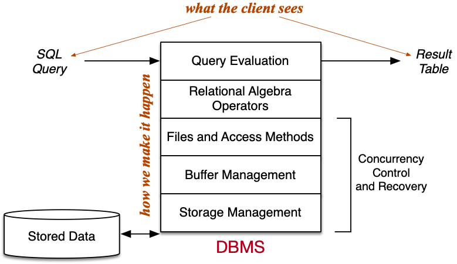

## Storage Management 存储管理

### 术语 Terminology

**Abstract：tuple元组 			page页 			relation关系**

​						**｜						｜			  		｜**

**Physical：record记录 	  block数据块 		table表**

### 存储技术

- **持久性存储**
    - 容量大
    - 便宜
    - 相对速度低
    - 以**页为单位传输**
- **计算性存储**
    - 容量小
    - 贵
    - 相对速度快
    - 以**byte字节为单位传输**

### 目标

- **数据以页/元组的集合形式呈现**
- **数据库表和磁盘文件对应起来**
- **管理磁盘中的数据传输**
- **用缓冲区buffers减少数据传输**
- 作为访问方法的**基础文件结构**

### Disks and Files

多数关系型数据库不会使用单一文件存储所有数据

- 多文件(物理分区/逻辑分区)
    - **页IDPageID = FileID + Page Offset**
    - **元组IDTupleID = PageID + Tuple Index**
    - **页偏移量page offset = page number*PAGESIZE**
    - **一个文件一个表**
        - 更**容易增加新表/扩充表大小/计算页偏移量**
        - **PageID**包含内容
            - **relation identifier 表的标识符**
            - **page number 页ID**
    - **多个文件一个表**
        - **relation identifier 表的标识符**
        - **page number 页ID**
        - **file identifier 文件标识符**

- **数据库层面object (如元数据meta-data) 映射到文件**

### Buffer Management

**缓冲池buffer pool：缓存一些数据库文件中的页**且可能有**复用**的机会

#### buffer pool构成

- **directory 目录 存元数据**
- **frames 数据**
    - **存哪些页 PageID=BufferTag=(rnode,forkNum,blockNum)**
    - **dirty bit：自加载后是否被更改过**
    - **pin count：有多少事务正在使用**
    - **最近访问时间戳**：辅助页替换

#### page eviction 页淘汰

##### 单个页淘汰

- **淘汰没被使用/更改的页 pin count = 0 & dirty bit = 0**
- **dirty bit != 0 => 被更改后刷到磁盘flush to disk**

##### 多页淘汰 -- 替换策略

- Clock Sweep
- LRU
    - **buffer数量比request请求页数少：sequential flooding 顺序洪泛** 
- MRU
- FIFO
- Random

### Tuple/Page Management

#### Page 页格式

**页Page是表示表记录集合的字节数组 array of bytes as a collection of records**

**页格式**取决于：

- **元组/记录的大小及可否变长(fix/variant)**
    - variable-length records变长记录：必须用**record directory 表记录目录** 页中**记录本身位置可以变**但其下标**index不会变**
- **free space management/organization** 即**实际存储记录**的区域
    - compacted 紧凑型 一个free space
    - fragmented 碎片型 多个free space
    - **combination更好**
        - **通常为碎片型fragmented(更容易维护maintain)**
        - **需要时则变为紧凑型 compacted when needed**
- **overflow chain 溢出页链**
    - 数据页data page的free space fragment碎片不够大
        - 先compact
    - 总的free space 不够大
        - 新建一个页make new page
    - 记录本身比整个page都大
        - **spanned records** 即一条记录分布在不同页存储
        - **overflow file**
    - 没有多余的目录槽directory slot
        - 新建一个页make new page
- **大属性存储(TOAST)**
    - The Oversized Attribute Storage Technique
    - 有对应TOAST File单独存储大属性

- **一条记录是否会分布在不同页存储**

#### Tuple Format 元组格式

- **固定长度记录fixed-length record**：存length和offsets
- **变长长度记录variable-length record**
    - prefix each attribute by length：4 int attr 10 char(10) attr
    - delimeter termination  int attr DELIMITER char(10) attr DELIMITER
    - array of offsets length + offsets (0 4 14..)

```c
typedef struct {
  ushort 			nfields;					// 属性数量
  ushort			data_offset;			// 数据偏移量
  FieldDesc		fields[];					// 属性描述
  Record			data;							// 记录指针
} Tuple;

FieldDesc = (offset,length,type)
e.g. (0,4,int),(4,10,char)
```

#### File Structure 文件/页结构

- **heap file：页哪有空元组插哪 tuples added to any avaiable page**
- **sorted file：元组根据键(属性)在页中排好序tuples arranged in file in key order**
- **hash file：元组根据哈希函数存在页中 tuples placed in page using hash function**

## Sorting 排序

### 用途

- **projection去重**
- **排序文件 提高查询效率**
- **实现不同种类的join(连接)**
- **group by时集合元组**

### 种类

- **internal/in memory：quicksort**
- **external/on disk：merge sort**

### N-Way Merge Sort

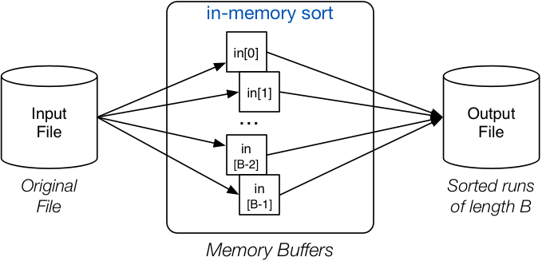


```c
// Produce B-page-long runs
for each group of B pages in Rel {
    read B pages into memory buffers
    sort group in memory
    write B pages out to Temp
}
// Merge runs until everything sorted
numberOfRuns = ⌈b/B⌉
while (numberOfRuns > 1) {
    // n-way merge, where n=B-1
    for each group of n runs in Temp {
        merge into a single run via input buffers
        write run to newTemp via output buffer
    }
    numberOfRuns = ⌈numberOfRuns/n⌉
    Temp = newTemp // swap input/output files
}
```

## Projection 投影(选列)

### Operation

1. **扫描整表作为输入**
2. **删掉不需要的属性 实际上是在建一个新的有所需属性的元组**
3. **有distinct关键字需要去重(sorting/hashing)**

### Sort-based Projection

```c
for each tuple T in Rel {
    T' = mkTuple([attrs],T)
    write T' to Temp
}

sort Temp on [attrs]

for each tuple T in Temp {
    if (T == Prev) continue
    write T to Result
    Prev = T
}
```

### Hash-based Projection

#### partition phase

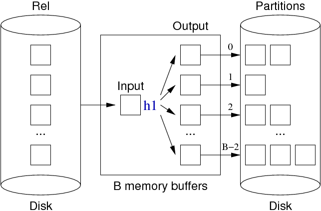

#### duplicate elimination phase

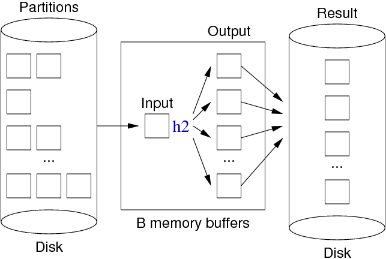


```c
for each tuple T in relation Rel {
    T' = mkTuple([attrs],T)
    H = h1(T', n)
    B = buffer for partition[H]
    if (B full) write and clear B
    insert T' into B
}
for each partition P in 0..n-1 {
    for each tuple T in partition P {
        H = h2(T, n)
        B = buffer for hash value H
        if (T not in B) insert T into B
        // assumes B never gets full
    }
    write and clear all buffers
}
```

### Primary Key Projection

主键投影**无需去重**

```c
bR = nPages(Rel)
for i in 0 .. bR-1 {
   P = read page i
   for j in 0 .. nTuples(P) {
      T = getTuple(P,j)
      T' = mkTuple(pk, T)
      if (outBuf is full) write and clear
      append T' to outBuf
   }
}
if (nTuples(outBuf) > 0) write
```

### Index-only Projection

#### 前提

- **表中有所选属性的索引**
- **所选属性是索引前缀(最左匹配)**

#### 步骤

- **扫描索引文件(已经根据所选属性排好序)**
- **重复元组相邻 易去重**

## Selection 查询(选行)

### styles 样式

- **1-d (one-dimensional) 单属性查询**
- **n-d (multi-dimensional) 多属性查询**
- **similarity 近似查询**

### types 种类

- **one**：select * from R where id = 1234
- **pmr(partial matching retrieval)**
    - 1-d：select * from R where age = 54
    - n-d：select * from R where age = 54 and gender = ‘m’
- **rng(range)**
    - 1-d：select * from R where age < 54
    - n-d：select * from R where age >= 54 and height <= 180

### Implementation 实现

- **physical arrangement of tuples 元组物理位置安排**
    - **sorting (search strategy)**
    - **hashing (static/dynamic/multi-dimensional)**
- **additional indexing information 额外索引信息**
    - **index files (primary/secondary/trees)**
    - **signatures(superimposed/disjoint)**

#### Heap Files

文件中**元组未排序**

#### 1-d Selection in Heap File

```c
// select * from R where C
// linear scan
for each page P in file of relation R {
    for each tuple t in page P {
        if (t satisfies C)
            add tuple t to result set
    }
}
```

#### Insertion in Heap File

- **append to last page**

    ```c
    rel = openRelation("R", READ|WRITE);
    pid = nPages(rel)-1;
    get_page(rel, pid, buf);
    if (size(newTup) > size(buf))
       { deal with oversize tuple }
    else {
       if (!hasSpace(buf,newTup))
          { pid++; nPages(rel)++; clear(buf); }
       insert_record(buf,newTup);
       put_page(rel, pid, buf);
    }
    ```

- **find any available page (enough space)**

    - **preferably page in buffer**

#### Deletion in Heap File

```c
// SQL:  delete from R  where Condition
rel = openRelation("R",READ|WRITE);
for (p = 0; p < nPages(rel); p++) {
    get_page(rel, p, buf);
    ndels = 0;
    for (i = 0; i < nTuples(buf); i++) {
        tup = get_record(buf,i);
        if (tup satisfies Condition)
            { ndels++; delete_record(buf,i); }
    }
    if (ndels > 0) put_page(rel, p, buf);
    if (ndels > 0 && unique) break;
}
```

#### Updates in Heap File

SQL:  `update `*R* `set `*F* `=` *val* `where `*Condition*

1. **scan all pages 扫描全表**
2. **replace any updated tuples  (within each page) 更新元组**
    - **更新的元组过大时：删除要被替换的元组 重新整理空间 然后再插入**
3. **write affected pages to disk 被影响到的页刷回磁盘**


#### Sorted Files

- 文件中**元组按照某些属性排好序**
- 查询快 插入慢
- **减少插入成本**
    - **overflow page 溢出页**

#### Selection in Sorted Files

##### one query -- binary search

```c
// select * from R where k = val  (sorted on R.k)
// f is file for relation
// mid,lo,hi are page indexes
// k is a field/attr
// val,loVal,hiVal are values for k
lo = 0; hi = b-1
while (lo <= hi) {
    mid = (lo+hi) / 2;  // int division with truncation
    (tup,loVal,hiVal) = searchBucket(f,mid,k,val);
    if (tup != NULL) return tup;
    else if (val < loVal) hi = mid - 1;
    else if (val > hiVal) lo = mid + 1;
    else return NOT_FOUND;
}
return NOT_FOUND;

// Search a page and its overflow chain for a key value
searchBucket(f,pid,k,val)
{
    buf = getPage(f,pid);
    (tup,min,max) = searchPage(buf,k,val,+INF,-INF)
    if (tup != NULL) return(tup,min,max);
  	// each page contains index of next page in Ov chain
    ovf = openOvFile(f);
    ovp = ovflow(buf);
    while (tup == NULL && ovp != NO_PAGE) {
        buf = getPage(ovf,ovp);
        (tup,min,max) = searchPage(buf,k,val,min,max)
        ovp = ovflow(buf);
    }     
    return (tup,min,max);
}

getPage(f,pid) = { 
  read_page(f,pid,buf); 
  return buf; 
}

// Search within a page for key; also find min/max key values
searchPage(buf,k,val,min,max)
{
    res = NULL;
    for (i = 0; i < nTuples(buf); i++) {
        tup = getTuple(buf,i);
        if (tup.k == val) res = tup;
        if (tup.k < min) min = tup.k;
        if (tup.k > max) max = tup.k;
    }
    return (res,min,max);
}
```

#### Optimising binary search in sorted file

Approach #1

- **store min,max values for each *bucket* in data page** bucket的**主数据页datapage里存最小/大值**
- avoids need to traverse overflow list if key not in bucket key不在这个范围内不用遍历bucket和其所属溢出页
- disadvantage: may need to write data + overflow if insert new tuple into overflow page 插入新元组需要更新

Approach #2

- store list of (pid,min,max) values in header page **bucket存一个(pid,min,max)列表**
- would allow us to find relevant bucket with 1 page read 列表中定位快
- only then would we need to read data+overflow pages

#### Search with pmr/range queries in Sorted Files

**以下仅限于文件按照属性attribute排序** 如果没按该attribute排序不能用

- **pmr**
    - **non-unique attribute**
        - **元组可能会分布在不同页(112|222|233|445)**
        - **binarysearch二分找到其中一个符合值**
        - **然后中心开花找所有符合值**
- **range**
    - **unique** attribute
        - **二分找最小值lower bound**
        - **顺序读 直到读到最大值upper bound**
    - **non-unique** attribute
        - **二分找最小值(其中一个)**
        - **中心开花**
            - **向前找所有最小值**
            - **向后顺序找一直到最大值**

#### Insertion in Sorted Files

1. **二分找到合适的页**
2. **页没满直接插入**
3. **页满了找下一个有地方的溢出页**

#### Deletion in Sorted Files

1. **找到匹配的元组**
2. **标记为删除**


#### Hashed Files

- hashing **converts key value (any type) into integer value**
- integer value is then **mapped to page index**
    - **b = 2^k => bitwise AND k low-order bits set to one**
    - **b != 2^k => mod b to produce value range [0,b-1]**
- note: can view **integer value as a bit-string**
- aims
    - distribute tuples evenly amongest buskets **元组均匀分布在桶(数据主页+溢出页)中 每个桶有一个hash value**
    - most buckets nearly full minimize wasted space **尽可能让桶满 避免空间浪费**

#### Selection in Hashed Files

##### unique key (one)

```c
// select * from R where k = val
(pid,P) = getPageViaHash(val,R)
for each tuple t in page P {
    if (t.k == val) return t
}
for each overflow page Q of P {
    for each tuple t in page Q {
        if (t.k == val) return t
		}   
}
```

##### non-unique key (per)

```c
// select * from R where nk = val
(pid,P) = getPageViaHash(val,R) 
for each tuple t in page P {
    if (t.nk == val) add t to results
}
for each overflow page Q of P {
    for each tuple t in page Q {
        if (t.nk == val) add t to results
}   }
return results
```

##### range

**哈希对范围查询没用**

#### Insertion in Hashed Files

```c
// insert tuple t with key=val into rel R
(pid,P) = getPageViaHash(val,R) 
if room in page P {
    insert t into P; return
}
for each overflow page Q of P {
    if room in page Q {
        insert t into Q; return
}   }
add new overflow page Q
link Q to previous page
insert t into Q
```

#### Deletion in Hashed Files

```c
// delete from R where k = val
// f = data file ... ovf = ovflow file
(pid,P) = getPageViaHash(val,R)
ndel = delTuples(P,k,val)
if (ndel > 0) putPage(f,P,pid)
for each overflow page qid,Q of P {
    ndel = delTuples(Q,k,val)
    if (ndel > 0) putPage(ovf,Q,qid)
}
```

#### Hashing Problem

传统哈希函数会**预设页大小不变 **=> 改变页大小需要改变哈希函数从而重建文件

**动态变化文件**的哈希

- extendible hashing
- **dynamic hashing**
- **linear hashing**

#### Page Spliting 页分裂

- 所有在一个页的元组都共有一个哈希值hash value
- 前面加一位重算页码(101 -> 0101/1101)
- 部分元组会hash到新的页
- **可扩展数据文件 不用重建**

#### Linear Hashing 线性哈希

- **系统性方法扩展数据文件**
- **split pointer分裂指针负责页分裂且控制溢出页长度**
- **不需要额外的目录**

#### Selection with Linear Hashed Files

```c
// select * from R where k = val
h = hash(val);
pid = bits(d,h);
if (pid < sp) { pid = bits(d+1,h); }
P = getPage(f, pid)
for each tuple t in page P
         and its overflow blocks {
    if (t.k == val) add t to Result;
}
```

#### Insertion with Linear Hashed Files

```c
pid = bits(d,hash(val));
if (pid < sp) pid = bits(d+1,hash(val));
// bucket[pid] = page pid + its overflow pages
for each page P in bucket[pid] {
    if (space in P) {
        insert tuple into P
        break
    }
}
if (no insertion) {
    add new ovflow page to bucket[pid]
    insert tuple into new page
}
// 两种分裂方式
// 1. 每次一个元组插入到满页的时候分裂
// 2. 每次达到阈值就分裂
if (need to split) {
    // partition tuples between two buckets
    newp = sp + 2^d; oldp = sp;
    for all tuples t in bucket[oldp] {
        pid = bits(d+1,hash(t.k));
        if (pid == newp) 
            add tuple t to bucket[newp]
        else
            add tuple t to bucket[oldp]
    }
    sp++;
    if (sp == 2^d) { d++; sp = 0; }
}
```

#### Deletion with Linear Hashed Files

- 足够多的元组被移除后**压缩文件**contract file when enough tuples removed
- **删掉最后一个桶**
- **用d-1哈希位合并元组**

## Indexing 索引

**索引文件由多对(键值，元组ID)组成**

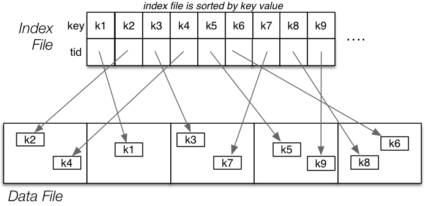

### Indexes

#### 类型

- primary 主键索引：唯一属性 可能排好序
- clustering 聚集索引：非唯一属性 已经排好序
- secondary 二级索引：文件没有按照该索引排序

#### 结构

- dense：每个元组都在索引文件中有对应reference 

    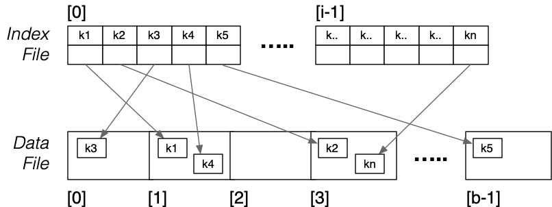

- sparse：有些元组在索引文件中有对应reference 数据文件已经排好序 一个索引目录代表一个数据文件

    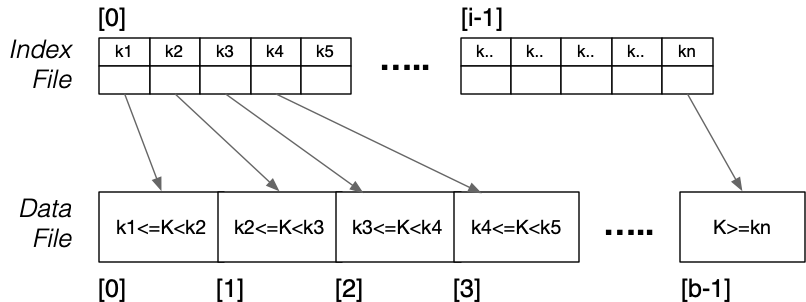

- single-level：元组可以在索引文件中被直接访问

- multi-level：元组需要在多层索引文件中被访问

#### Selection with Primary Index 主键索引查询

##### 主键查询

```c
// Worst case: read log2i  index pages  +  read 1+Ov data pages
ix = binary search index for entry with key K
if nothing found { return NotFound }
P = getPage(pageOf(ix.tid))
t = getTuple(P,offsetOf(ix.tid))
   -- may require reading overflow pages
return t
```

##### 范围查询

For ***range* queries** on primary key:

- use **index search to find lower bound**

- read index **sequentially until reach upper bound**

- **accumulate set of buckets** to be examined

- **examine each bucket in turn to check for matches**

    ```c
    // e.g. select * from R where a between lo and hi
    // data file not sorted
    pages = {}   results = {}
    ixPage = findIndexPage(R.ixf,lo)
    while (ixTup = getNextIndexTuple(R.ixf)) {
       if (ixTup.key > hi) break;
       pages = pages ∪ pageOf(ixTup.tid)
    }
    foreach pid in pages {
       // scan data page plus ovflow chain
       while (buf = getPage(R.datf,pid)) {
          foreach tuple T in buf {
             if (lo<=T.a && T.a<=hi)
                results = results ∪ T
          }  
       }  
    }
    ```

##### 多属性(包含主键)查询

For ***pmr* queries involving primary key**:

- **search as if performing *one* query**.

##### 无主键查询

For queries not involving primary key, **index gives no help**

#### Insertion with Primary Index

```
tid = insert tuple into page P at position p
find location for new entry in index file
insert new index entry (k,tid) into index file 
```

**order of index entries must be maintained** 必须**维持索引顺序**

- need to **avoid overflow pages in index** 避免索引出现溢出页
- either **reorganise index file or mark entries** **重新组织索引文件/标记索引目录**

#### Deletion with Primary Index

```
find tuple using index
mark tuple as deleted
delete index entry for tuple
```

#### Cluster Index 聚集索引

**数据文件排好序 索引文件中的一个项对应一个键值 **Data file sorted; one index entry for each key value

**只有所有该键值元组都被删除时才能删除索引项**  can't mark index entry for value X until all X tuples are deleted

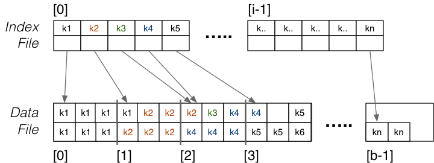

#### Secondary Index 二级索引

**数据文件未排序 每个索引项都有对应键值** Data file not sorted; want one index entry for each key value

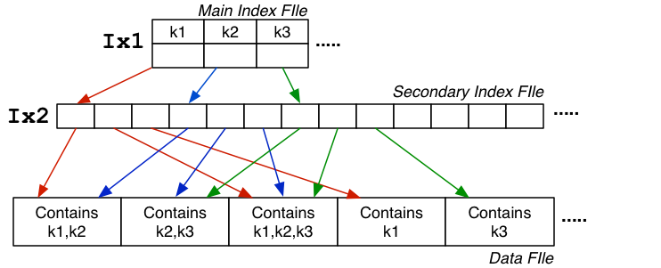

Above Secondary Index used two index files to speed up search

- by keeping the initial index search relatively quick
- `Ix1` small (depends on number of unique key values)
- `Ix2` larger (depends on amount of repetition of keys)
- typically, *b`Ix1` ≪ b`Ix2`*

Could improve further by

- making `Ix1` sparse, since `Ix2` is guaranteed to be ordered
- in this case, *b`Ix1` = ceil( b`Ix2` / ci )*
- if `Ix1` becomes too large, add `Ix3` and make `Ix2` sparse
- if data file ordered on key, could make `Ix3` sparse

Ultimately, reduce top-level of index hierarchy to one page.

#### MultiLevel Index 多级索引

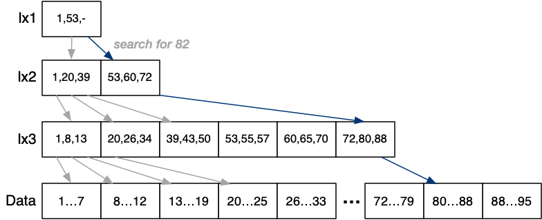

#### Selection with MultiLevel Index

```c
xpid = top level index page
for level = 1 to d {
    read index entry xpid
    search index page for J'th entry
        where index[J].key <= K < index[J+1].key
    if (J == -1) { return NotFound }
    xpid = index[J].page
}
pid = xpid  // pid is data page index
search page pid and its overflow pages
```

#### B-Tree

B-trees are **Multi-way Search Tree**s with the properties:

- **更新后依然保持平衡** they are updated so as to remain balanced 
- **每个节点至少有 *(n-1)/2* entry**  each node has at least *(n-1)/2* entries in it
- **每个节点占整个磁盘页大小** each tree node occupies an entire disk page
    - **容纳非常多的索引项index entry**
    - **有非常大的分支因子branching factor 即多子节点**
    - **树整体变得很浅 worst case表现更好**

B-tree **insertion and deletion** methods

- are moderately **complicated to describe**
- can be implemented very efficiently

Advantages of B-trees over general Multi-way Search Trees

- **better storage utilisation (around 2/3 full)**
- **better worst case performance (shallower)**

例子：Example B-tree (**depth=3, n=3**)  (actually B+ tree) 

**实际数据库中每个节点即数据页 子节点数n会变很大**

in DBs, nodes are pages ⇒ **large branching factor, e.g. *n=500***

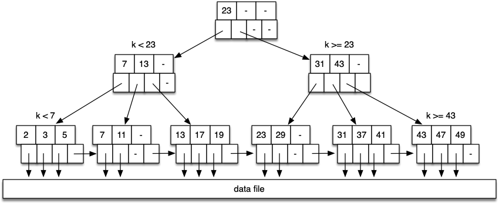

**Depth depends on effective branching factor**  (i.e. how full nodes are).

Simulation studies show **typical B-tree nodes are 69% full.**

Gives  load *Li = 0.69 × ci*  and  depth of tree *~ ceil( logLi r )*.

Example: *ci=128,   Li=88*  Note: *ci* is generally larger than 128 for a real B-tree.

| **Level** | **#nodes** | **#keys** |
| --------- | ---------- | --------- |
| root      | 1          | 87        |
| 1         | 88         | 7656      |
| 2         | 7744       | 673728    |
| 3         | 681472     | 59288064  |

#### Insertion into B-Tree

Overview of the method:

1. 找页子节点可插入位置 find leaf node and position in node where entry would be stored
2. 节点没满 找合适的位置插入 if node is not full, insert entry into appropriate spot
3. 节点满了 分裂节点变成两个半满节点 将节点中间值升级为父节点 if node is full, split node into two half-full nodes and promote middle element to parent
4. 父节点满了 分裂节点并升级节点 if parent full, split and promote upwards
5. 到根节点且已满 同理 if reach root, and root is full, make new root upwards

Note: 如果有唯一性且已经存在则直接停 if duplicates not allowed and key exists, may stop after step 1

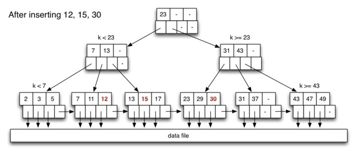

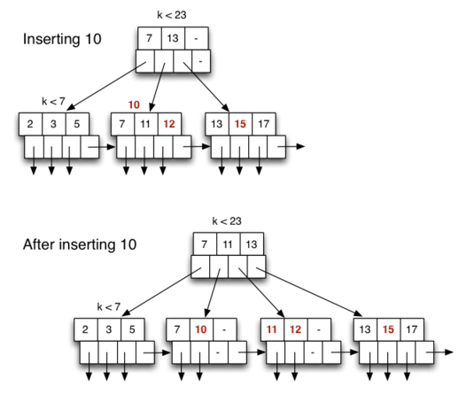

Best case: write one page (most of time)

- traverse from root to leaf
- read/write data page, write updated leaf

Common case: *3* node writes (rearrange 2 leaves + parent)

- traverse from root to leaf, holding nodes in buffer
- read/write data page
- update/write leaf, parent and sibling

Worst case: *2D-1* node writes (propagate to root)

- traverse from root to leaf, holding nodes in buffers
- read/write data page
- update/write leaf, parent and sibling
- repeat previous step *D-1* times

#### Selection with B-Tree

##### one query

```c
N = B-tree root node
while (N is not a leaf node)
   N = scanToFindChild(N,K)
tid = scanToFindEntry(N,K)
access tuple T using tid
```

##### range query

```c
search index to find leaf node for Lo
for each leaf node entry until Hi found {
	access tuple T using tid from entry
}
```

## n-d Queries and Indexes 多属性查询/索引

### n-d Selection in Heap File

```c
// select * from R where C
r = openRelation("R",READ);
for (p = 0; p < nPages(r); p++) {
    buf = getPage(file(r), p);
    for (i = 0; i < nTuples(buf); i++) {
        t = getTuple(buf,i);
        if (matches(t,C))
            add t to result set
    }
}
```

```
select * from R where  a1 op1 C1 and ... and an opn Cn 
pmr : all opi are equality tests.
space : some opi are range tests.
```

- **用一个属性的索引减少查询元组数量**

    - **选择性最强**的属性

    ```c
    // Query: select * from R where a1op1C1 and ... and anopnCn
    // choose ai with best selectivity
    TupleIDs = IndexLookup(R,ai,opi,Ci)
    // gives { tid1, tid2, ...} for tuples satisfying aiopiCi
    PageIDs = { }
    foreach tid in TupleIDs
       { PageIDs = PageIDs ∪ {pageOf(tid)} }
    
    // PageIDs = a set of bqix page numbers
    ```

- **用多个属性的索引将结果集合并**

    ```c
    // Query: select * from R where a1op1C1 and ... and anopnCn
    // assumes an index on at least ai
    TupleIDs = IndexLookup(R,a1,op1,C1)
    foreach attribute ai with an index {
       tids = IndexLookup(R,ai,opi,Ci)
       TupleIDs = TupleIDs ∩ tids
    }
    PageIDs = { }
    foreach tid in TupleIDs
       { PageIDs = PageIDs ∪ {pageOf(tid)} }
    // PageIDs = a set of bq page numbers
    ```

### Bitmap Index

- **一个属性/范围对应一个比特位索引** Index contains bit-strings of *r* bits, one for each value/range

- Storage costs for bitmap indexes:

    - one bitmap for each value/range for each indexed attribute
    - each bitmap has length *ceil(r/8)* bytes
    - e.g. with 50K records and 8KB pages, bitmap fits in one page

    Query execution costs for bitmap indexes:

    - read one bitmap for each indexed attribute in query
    - perform bitwise AND on bitmaps (in memory)
    - read pages containing matching tuples

    Note: bitmaps could index pages rather than tuples (shorter bitmaps)

    ```c
    Matches = AllOnes(r)
    foreach attribute A with index {
       // select ith bit-string for attribute A
       // based on value associated with A in WHERE
       Matches = Matches & Bitmaps[A][i]
    }
    // Matches contains 1-bit for each matching tuple
    foreach i in 0..r-1 {
       if (Matches[i] == 0) continue;
       Pages = Pages ∪ {pageOf(Tids[i])}
    }
    foreach pid in Pages {
       P = getPage(pid)
       extract matching tuples from P
    }
    ```

### Hashing and pmr

```sql
select * from R where a1 = C1 and ... and an = Cn
```

- if **one ai is the hash key, query is very efficient**
- if **no ai is the hash key,** need to **use linear scan**
    - **alleviated using *multi-attribute hashing* (*mah*)**
    - form a **composite hash value involving all attributes**
    - at query time, some components of composite hash are known
        (**allows us to limit the number of data pages which need to be checked)**

#### MAH 多属性哈希

```c
HashVal hash(Tuple t, ChoiceVec cv, int d)
{
    HashVal h[nAttr(t)+1];  // hash for each attr
    HashVal res = 0, oneBit;
    int     i, a, b;
    for (i = 1; i <= nAttr(t); i++)
        h[i] = hash_any(attrVal(t,i));
    for (i = 0; i < d; i++) {
        a = cv[i].attr;
        b = cv[i].bit;
        oneBit = bit(b, h[a]);
        res = res | (oneBit << i);
    }
    return res;
}
```

In a partial match query:

- values of some attributes are known
- values of other attributes are unknown

**未知位用星号代替 需要找的页就是未知位变为0/1的全排列**

```c
// Builds the partial hash value (e.g. 10*0*1)
// Treats query like tuple with some attr values missing
nstars = 0;
for each attribute i in query Q {
    if (hasValue(Q,i)) {
        set d[i] bits in composite hash
            using choice vector and hash(Q,i)
    } else {
        set d[i] *'s in composite hash
            using choice vector
        nstars += d[i]
    }
}
// Use the partial hash to find candidate pages
r = openRelation("R",READ);
for (i = 0; i < 2nstars; i++) {
    pid = composite hash
    replace *'s in pid
        using i and choice vector
    Buf = readPage(file(r), pid);
    for each tuple T in Buf {
        if (T satisfies pmr query)
            add T to results
    }
}
```

#### 选取 choice vector 选择向量

- distribution of query types (**more bits to frequently used attribute**s)
- size of attribute domain (*≤* #bits to represent all values in domain)
- discriminatory power (**more bits to highly discriminating attributes**)

### n-d Tree Indexes

#### Kd-Trees

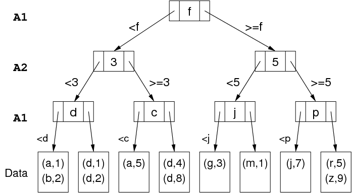

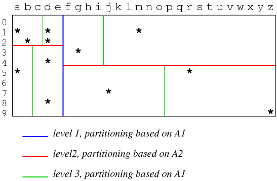

```c
// Started by Search(Q, R, 0, kdTreeRoot)
Search(Query Q, Relation R, Level L, Node N)
{
   if (isDataPage(N)) {
      Buf = getPage(fileOf(R),idOf(N))
      check Buf for matching tuples
   } else {
      a = attrLev[L]
      if (!hasValue(Q,a))
         nextNodes = all children of N
      else {
         val = getAttr(Q,a)
         nextNodes = find(N,Q,a,val)
      }
      for each C in nextNodes
         Search(Q, R, L+1, C)
}  }
```

#### Quad-Trees

Quad trees use regular, disjoint partitioning of tuple space.

- **二维分成东南西北** for *2d*, partition space into quadrants (NW, NE, SW, SE)
- each quadrant can be further subdivided into four, etc.

Basis for the partitioning:

- a quadrant that has no sub-partitions is a leaf quadrant
- each leaf quadrant maps to a single data page
- subdivide until points in each quadrant fit into one data page
- ideal: same number of points in each leaf quadrant (balanced)
- point density varies over space
    *⇒* different regions require different levels of partitioning
- this means that the tree is not necessarily balanced

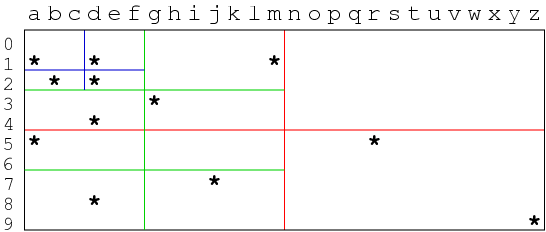

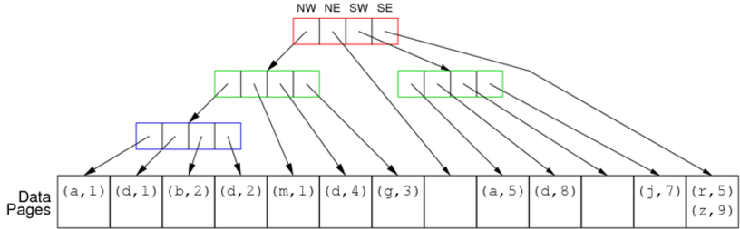

#### R-Trees

R-trees use a **flexible, overlapping partitioning** of tuple space.

- **each node in the tree represents a *k*d hypercube**
- its children represent (possibly overlapping) subregions
- the child regions do not need to cover the entire parent region

Overlap and partial cover means:

- can **optimize space partitioning wrt data distribution**
- so that there are **similar numbers of points in each region**

Aim: **height-balanced, partly-full index pages**  (cf. B-tree)

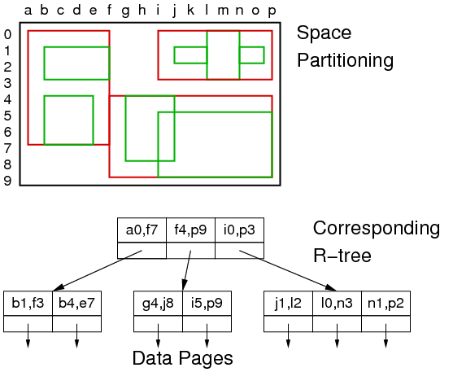

##### query with r-tree

Designed to handle *space* queries and "where-am-I" queries.

"Where-am-I" query: find all regions containing a given point *P*:

- start at root, select all children whose subregions contain *P*
- if there are zero such regions, search finishes with *P* not found
- otherwise, recursively search within node for each subregion
- once we reach a leaf, we know that region contains *P*

*Space* (region) queries are handled in a similar way

- we traverse down any path that intersects the query region

##### GiST

Up to version 8.2, PostgreSQL had R-tree implementation

Superseded by GiST = **Generalized Search Trees**

GiST indexes parameterise: data type, searching, splitting

- via seven user-defined functions (e.g. `picksplit()`)

GiST trees have the following structural constraints:

- **every node is at least fraction *f* full** (e.g. 0.5)
- the **root node has at least two children** (unless also a leaf)
- **all leaves appear at the same level**

#### cost for multidimensional trees

Difficult to determine cost precisely.

Best case: *pmr* query where **all attributes have known values**

- in **kd-trees and quad-trees, follow single tree path** cost is equal to **depth *D* of tree**
- in **R-trees**, may follow **several paths (overlapping partitions)**

Typical case: **some attributes are unknown or defined by range**

- need to **visit multiple sub-trees**
- how many **depends on: range, choice-points in tree nodes**

### Indexing with Signatures

#### Signature-based indexing

- designed for ***pmr* queries  (conjunction of equalities)**
- does not try to achieve better than *O(n)* performance
- attempts to **provide an "efficient" linear scan** 更快的线性扫描

**Each tuple is associated with a signature**

- a **compact (lossy) descriptor** for the tuple

    - A tuple consists of *N* attribute values *A1 .. An*

    - A **codeword *cw(Ai)*** is

        - a bit-string, ***m* bits long**, where ***k* bits are set to 1**  (*k ≪ m*)

        - **derived from the value of a single attribute *Ai***

            ```c
            bits codeword(char *attr_value, int m, int k)
            {
               int  nbits = 0;   // count of set bits
               bits cword = 0;   // assuming m <= 32 bits
               srandom(hash(attr_value));
               while (nbits < k) {
                  int i = random() % m;
                  if (((1 << i) & cword) == 0) {
                     cword |= (1 << i);
                     nbits++;
                  }
               }
               return cword;  // m-bits with k 1-bits and m-k 0-bits
            }
            ```

    - formed by **combining information from multiple attributes**

        - A tuple descriptor (signature) is built by **combining *cw(Ai), i=1..n***
            - could combine by ***overlaying* (or *concatenating*) codewords**
            - aim to have **roughly half of the bits set to 1**

    - stored in a **signature file**, **parallel to data file**

Instead of scanning/testing tuples, **do pre-filtering via signatures.**

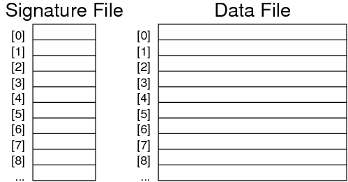

#### Superimposed Codewords SIMC

In a superimposed codewords (simc) indexing scheme

- a tuple descriptor is formed by overlaying attribute codewords 把**所有属性对应的codeword叠加**

A tuple descriptor *desc(r)* is

- a bit-string, *m* bits long, where ***j ≤ nk* bits are set to 1**
- ***desc(r) = cw(A1)* `OR` *cw(A2)* `OR` ... `OR` *cw(An)***

Method (assuming **all *n* attributes are used in descriptor**):

```c
bits desc = 0 
for (i = 1; i <= n; i++) {
   bits cw = codeword(A[i])
   desc = desc | cw
}
```

#### SIMC query

To answer query *q* in SIMC

- first generate a query descriptor *desc(q)* **按已知查询属性生成描述位**
    - *desc(q)* is formed by `OR` of codewords for known attributes
- then use the query descriptor to search the signature file **用描述位查找签名文件**

E.g. consider the query `(Perryridge, ?, ?, ?)`.

| *Ai*       | *cw(Ai)*       |
| ---------- | -------------- |
| Perryridge | `010000000001` |
| `?`        | `000000000000` |
| `?`        | `000000000000` |
| `?`        | `000000000000` |
| *desc(q)*  | `010000000001` |

Consider the query and the example database:

| **Signature**              | **Deposit Record**          |
| -------------------------- | --------------------------- |
| `010000000001`             | (Perryridge,?,?,?)          |
| `100101001001`             | (Brighton,217,Green,750)    |
| `010011000111` *true match | (Perryridge,102,Hayes,400)  |
| `101001001001`             | (Downtown,101,Johnshon,512) |
| `101100000011`             | (Mianus,215,Smith,700)      |
| `010101010101`*false match | (Clearview,117,Throggs,295) |
| `100101010011`             | (Redwood,222,Lindsay,695)   |

False match probablity *pF* = likelihood of a false match

How to **reduce likelihood of false matches**? 

- use **different hash function for each attribute**  (*hi* for *Ai*)
- **increase descriptor size (*m*)**
- choose ***k* so that *≅* half of bits are set**

Larger *m* means reading more descriptor data.

Having ***k* too high  *⇒* increased overlapping**. k太大容易导致位重叠
Having ***k* too low  *⇒* increased hash collisions**. k太小容易导致哈希碰撞

Optimal m and k

- *pF ≤ 10-5* i.e. one false match in 10,000
- *k  = 1/loge2 . loge ( 1/pF )*
- *m  = ( 1/loge 2 )2 . n . loge ( 1/pF )*

#### Page-level SIMC

**one descriptor for each data page.**

**Every attribute of every tuple in page contributes to descriptor**.

**Size of page descriptor (PD)** (clearly larger than tuple descriptor):

- use above formulae but with ***c.n* "attributes"**

E.g. *n = 4, c = 128, pF = 10-3  ⇒  m ≅ c . ( 1/loge 2 )2 . n . loge ( 1/pF ) = 7000bits ≅ 900bytes*

Typically, pages are 1..8KB  *⇒* 1..9 PD/page (*NPD*).

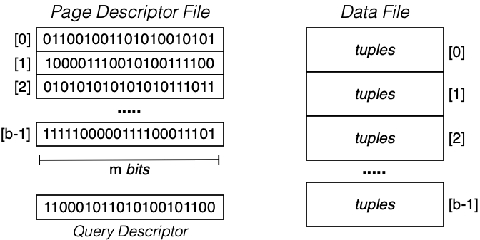

#### Bit-sliced SIMC

Improvement: **store *b* *m*-bit page descriptors as *m* *b*-bit "bit-slices"**

```c
matches = ~0  //all ones
for each bit i set to 1 in desc(q) {
   slice = fetch bit-slice i
   matches = matches & slice
}
for each bit i set to 1 in matches {
   fetch page i
   scan page for matching records
}
```

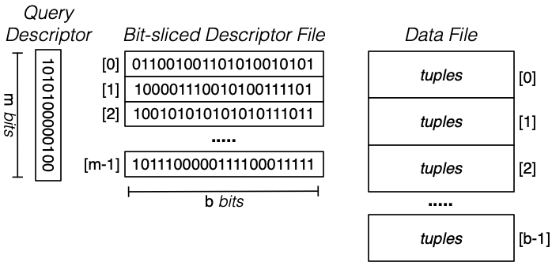

## Join 连接

Join (*⋈*) is the **primary means of combining information.**

Join is **important and potentially expensive**

Most common join condition: equijoin, e.g. `(R.pk = S.fk)`

**Join varieties (natural, inner, outer, semi, anti) all behave similarly.**

We consider three strategies for implementing join

- **nested loop ... simple, widely applicable, inefficient without buffering**
- **sort-merge ... works best if tables are sorted on join attributes**
- **hash-based ... requires good hash function and sufficient buffering**

### Nested Loop Join 嵌套循环连接

#### Naive Nested Loop Join

Cost = bR * bS

```c
// R.a ⋈ S.b 
Result = {}
for each page i in R {
   pageR = getPage(R,i)
   for each page j in S {
      pageS = getPage(S,j)
      for each pair of tuples tR,tS from pageR,pageS {
         if (tR.a == tS.b) Result = Result ∪ (tR:tS)
      }  
   }  
}
```

#### Block Nested Loop Join

- *N* memory buffers
- **读N-2个外表到buffer里** read *N-2*-page chunk of *R* into memory buffers
- **读1次(占1个buffer)内表查连接条件** for each *S* page check join condition on all `(tR,tS)` pairs in buffers
- repeat for all *N-2*-page chunks of *R*

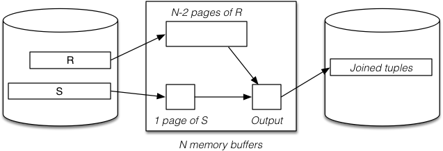

**Best-case** scenario: *bR ≤ N-2* **（外表页数小于缓冲页数-2）**

- read *bR* pages of relation *R* into buffers
- while whole *R* is buffered, read *bS* pages of *S*

**Cost  =  *bR + bS***

**Typical-case** scenario: *bR > N-2* **（外表页数大于缓冲页数-2）**

- read *ceil(bR/(N-2))* chunks of pages from *R* 缓冲区次数变为想上取整外表页数/缓冲页数-2
- for each chunk, read *bS* pages of *S*

**Cost  =  *bR + bS . ceil(bR/N-2)***

Note: always requires *rR.rS* checks of the join condition

block nested loop join is actually **useful in practice**：If outer relation is small ⇒ may fit in memory (in small #buffers)

#### Index Nested Loop Join

A **problem with naive and block nested-loop join:**

- needs **repeated scans of *entire* inner relation *S*** **NNL和BNL需要多次扫描整个内表**

If there is **index on *S*, we can avoid such repeated whole-of-*S* scanning. 内表连接条件的属性上有索引可以避免扫描全表**

- **用一个buffer页扫外表每一个元组** one scan of outer relation R (bR)
    - only one buffer needed, since we use *R* tuple-at-a-time

- **每一个外表元组做一次索引查询找内**表 for each tuple in R (rR), one index lookup on S
    - cost depends on type of index and number of results
    - best case is when each *R.i* matches few *S* tuples

**Cost  =  *bR + rR.SelS***  (*SelS* is the cost of performing a select on *S*).

Typical *SelS* = 1-2 (hashing) .. *bq* (unclustered index)

### Sort-Merge Join 排序-合并连接

#### Basics

Basic approach:

- **两表都按连接条件排好序 sort both relations on join attribute**  (reminder: *Join [i=j] (R,S)*) 
- **一起扫描归并结果集** scan together using **merge to form result `(r,s)` tuples**

Advantages:

- **每个外表元组只需要扫部分内表元组 no need to deal with "entire" *S* relation for each *r* tuple**
- deal with runs of matching *R* and *S* tuples

Disadvantages:

- **cost of sorting both relations**  (already sorted on join key?)
- some **rescanning required when long runs of *S* tuples**

#### Implementation

Method requires several cursors to scan sorted relations:

- `r` = current record in *R* relation

- `s` = start of current run in *S* relation

- `ss` = current record in current run in *S* relation

    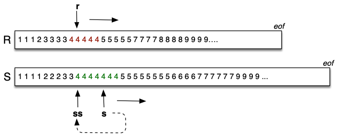

```c
Query ri, si;  Tuple r,s;

ri = startScan("SortedR");
si = startScan("SortedS");
while ((r = nextTuple(ri)) != NULL
       && (s = nextTuple(si)) != NULL) {
    // align cursors to start of next common run
    while (r != NULL && r.i < s.j)
           r = nextTuple(ri);
    if (r == NULL) break;
    while (s != NULL && r.i > s.j)
           s = nextTuple(si);
    if (s == NULL) break;
    // must have (r.i == s.j) here
    // remember start of current run in S
    TupleID startRun = scanCurrent(si)
    // scan common run, generating result tuples
    while (r != NULL && r.i == s.j) {
        while (s != NULL and s.j == r.i) {
            addTuple(outbuf, combine(r,s));
            if (isFull(outbuf)) {
                writePage(outf, outp++, outbuf);
                clearBuf(outbuf);
            }
            s = nextTuple(si);
        }
        r = nextTuple(ri);
        setScan(si, startRun);
    }
}

```

#### Buffer requirements

- for sort phase:
    - as many as possible (remembering that cost is *O(logN)* )
    - if insufficient buffers, sorting cost can dominate
- for merge phase:
    - one output buffer for result
    - one input buffer for relation *R*
    - (preferably) enough buffers for longest run in *S*

#### Cost of sort-merge join

Step 1: **sort each relation**  (if not already sorted):

- Cost = *2.bR (1 + logN-1(bR /N))* + *2.bS (1 + logN-1(bS /N))*
        (where *N* = number of memory buffers)

Step 2: **merge sorted relations:**

- if **every run of values in *S* fits completely in buffers**,
    merge requires single scan,  **Cost = *bR + bS***
- if **some runs in of values in *S* are larger than buffers**,
    need to **re-scan run for each corresponding value from *R***

### Hash-Based Join 哈希连接

Basic idea:

- **用哈希来分表** use hashing as a technique to partition relations
- **不用每次都考虑全表** to avoid having to consider all pairs of tuples

Requires **sufficent memory buffers 缓存页越多越大越好**

- to **hold substantial portions of partitions**
- (preferably) to **hold largest partition of outer relation**

Other issues:

- 只能**等值连接**用 **works only for equijoin**  `R.i=S.j`  (but this is a common case)
- 可能会有**数据倾斜问题** susceptible to data skew  (or poor hash function)

Variations:  *simple*,  *grace*,  *hybrid*.

#### Simple Hash Join

##### Implementation

Basic approach:

- **哈希部分外表到缓存页** hash part of outer relation *R* into memory buffers (build)
- **哈希扫内表** scan inner relation S, using hash to search (probe)
    - **如果等值 会哈希到相同缓存页** if R.i=S.j, then h(R.i)=h(S.j)  (hash to same buffer)
    - **内表元组只需要查一个缓存页** only need to check one memory buffer for each *S* tuple
- **直到所有外表处理完** repeat until whole of *R* has been processed

No overflows allowed in in-memory hash table

- works best with uniform hash function
- can be adversely affected by data/hash skew

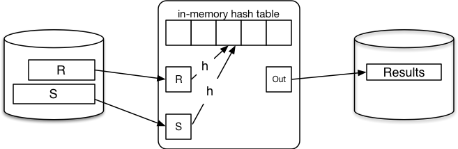

```c
for each tuple r in relation R {
   if (buffer[h(R.i)] is full) {
      for each tuple s in relation S {
         for each tuple rr in buffer[h(S.j)] {
            if ((rr,s) satisfies join condition) {
               add (rr,s) to result
            }  
         }  
      }
      clear all hash table buffers
   }
   insert r into buffer[h(R.i)]
}
```

##### Cost for simple hash join

Best case: all tuples of R fit in the hash table

- Cost = *bR + bS*
- Same page reads as block nested loop, but less join tests

Good case: refill hash table *m* times (where *m ≥ ceil(bR / (N-2))* )

- Cost = *bR + m.bS*
- More page reads that block nested loop, but less join tests

Worst case: everything hashes to same page

- Cost = *bR + bR.bS*

#### Grace Hash Join

##### Implementation

Basic approach (for *R ⋈ S* ):

- **内外表元组都用哈希h1(占一个缓存页)分到N-1个磁盘分区** partition both relations on join attribute using hashing (*h1*)
- **分区中的外表元组哈希h2到哈希表中** load each partition of *R* into N-buffer hash table (*h2*)
- **扫描对应分区的内表元组合并结果集** scan through corresponding partition of *S* to form results
- **所有分区处理完** repeat until all partitions exhausted

For best-case cost (*O(bR + bS)* ):

- need *≥ √bR* buffers to hold largest partition of outer relation

If *< √bR* buffers or poor hash distribution

- need to scan some partitions of *S* multiple times

##### Partition phase (applied to both *R* and *S*)


##### Probe/join phase

The **second hash function (`h2`)** simply **speeds up the matching process**.
**Without it, would need to scan entire *R* partition for each record in *S* partition**.

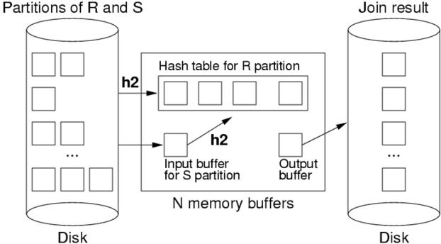

##### Cost of grace hash join

- \#pages in all partition files of *Rel ≅ bRel*  (maybe slightly more)
- **partition relation *R*** ...  Cost  = *bR.Tr + bR.Tw* = ***2bR***
- **partition relation *S*** ...  Cost  = *bS.Tr + bS.Tw* = ***2bS***
- **probe/join** requires **one scan of each (partitioned) relation**
    Cost  = ***bR + bS***
- **all hashing and comparison occurs in memory  *⇒*  *≅0* cost**

Total Cost  =  *2bR + 2bS + bR + bS*  =  *3 (bR + bS)*

#### Hybrid Hash Join

A variant of grace join if we have ***√bR < N < bR+2***

- **create *k≪N* partitions, *m* in memory, *k-m* on disk**
- buffers: 1 input, *k-m* output, *p = N-(k-m)-1* for in-memory partitions

When we come to scan and partition *S* relation

- any tuple with hash in range *0..m-1* can be resolved
- other tuples are written to one of *k* partition files for *S*

Final phase is same as grace join, but with only *k* partitions.

Comparison:

- **grace hash join creates *N-1* partitions on disk**
- 有一些会在内存处理**hybrid hash join creates *m* (memory) + *k* (disk) partitions**

##### First phase (partitioning *R*)

hybrid hash join with *m=1* :

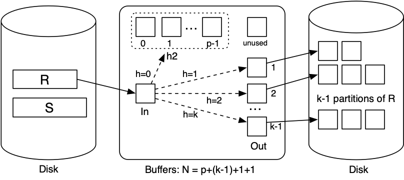

##### Next phase (partitioning *S*)

hybrid hash join with *m=1* :

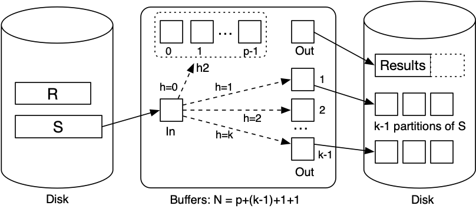

##### Final phase (finishing join)

hybrid hash join with *m=1* :

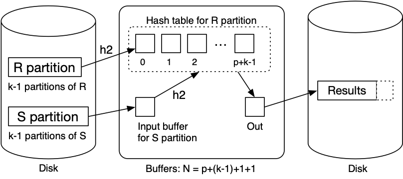

Some observations:

- with *k* partitions, each partition has expected size *bR/k*
- holding *m* partitions in memory needs *ceil(mbR/k)* buffers
- trade-off between in-memory partition space and #partitions

Best-cost scenario:

- *m = 1*,  *k ≅ ceil(bR/N)*  (satisfying above constraint)

Other notes:

- if *N = bR+2*, using block nested loop join is simpler
- cost depends on *N* (but less than grace hash join)

### Join Summary

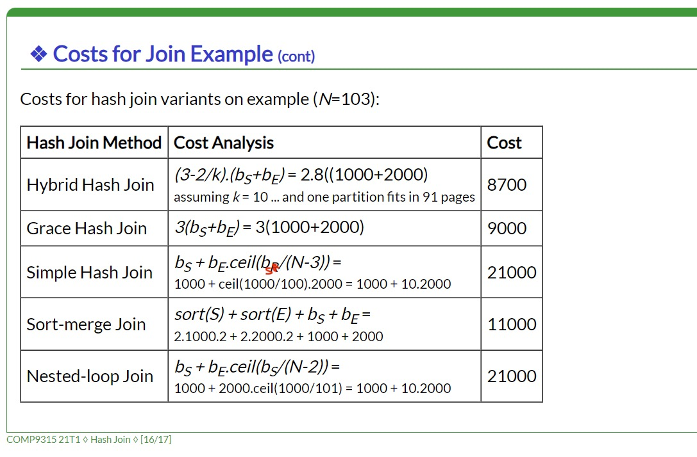

**No single join algorithm is superior in some overall sense.**

Which algorithm is best for a given query depends on:

- **sizes of relations being joined**,  **size of buffer pool**
- any **indexing on relations**,  **whether relations are sorted**
- which **attributes and operations are used** in the query
- **number of tuples in *S* matching each tuple in *R***
- **distribution of data values** (uniform, skew, ...)

Choosing the "best" join algorithm is critical because the cost difference between best and worst case can be very large.

## Query Execution and Optimization 查询执行和优化

**SQL语句->Parser解析->RA Exp关系代数表达式->优化器Optimiser->RelOps关系操作->DB引擎->结果集**

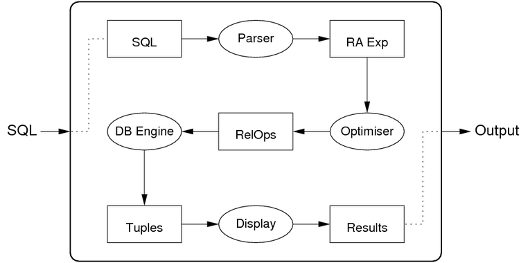

### Query Execution

A query in SQL:

- states *what* kind of answers are required (declarative)
- does not say *how* they should be computed (procedural)

A query evaluator/processor :

- **takes declarative description of query**  (in SQL)
- parses query to **internal representation  (relational algebra)**
- determines **plan for answering query  (expressed as DBMS ops)**
- **executes method via DBMS engine**  (to produce result tuples)

Remaining steps in processing an SQL statement

- parse, map to relation algebra (RA) expression
- transform to more efficient RA expression
- instantiate RA operators to DBMS operations
- execute DBMS operations (aka query plan)

Cost-based optimisation:

- generate possible query plans  (via rewriting/heuristics)
- estimate cost of each plan  (using costs of operations)
- choose the lowest-cost plan  (... and choose quickly)

### Query Optimization

The query optimiser

- **takes relational algebra expression** from SQL compiler
- **produces sequence of RelOps** to evaluate the expression
- query execution plan should **provide efficient evaluation**

"Optimisation" is a misnomer since query optimisers 

- aim to **find a good plan** ... but maybe not optimal 实际上优化器选的**可能不是最优**
    Observed Query Time = Planning time + Evaluation time

Three main classes of techniques developed:

- **algebraic**   (equivalences, rewriting, heuristics)
- **physical**    (execution costs, search-based)
- **semantic**   (application properties, heuristics)
    - good idea, but **expensive/difficult to implement.**
- All driven by **aim of minimising (or at least reducing) "cost".**
- **Real query optimisers** use a combination of **algrebraic+physical.**

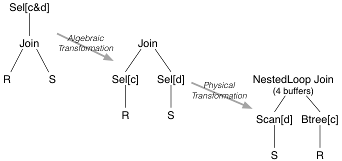

### DB Engine Query Execution Plan

A query execution plan:

- consists of a collection of RelOps
- executing together to produce a set of result tuples

Results may be passed from one operator to the next:

- materialization ... writing results to disk and reading them back
- pipelining ... generating and passing via memory buffers

#### Materialization

Steps in materialization between two operators

- first operator reads input(s) and writes results to disk
- next operator treats tuples on disk as its input
- in essence, the `Temp` tables are produced as real tables

Advantage:

- intermediate results can be placed in a file structure
    (which can be chosen to speed up execution of subsequent operators)

Disadvantage:

- requires disk space/writes for intermediate results
- requires **disk access to read intermediate results**

#### Pipelining

How pipelining is organised between two operators:

- operators execute "concurrently" as producer/consumer pairs
- structured as interacting iterators (open; while(next); close)

Advantage:

- **no requirement for disk access** (results passed via memory buffers)
    - cannot avoid all disk access
        - **within an operation, disk reads/writes are possible**
        - **between operations, no disk reads/writes are needed**

Disadvantage:

- higher-level operators access inputs via linear scan,  or
- requires sufficient **memory buffers to hold all outputs**

## Performance Tuning 性能优化

Improving performance may involve any/all of:

- making applications using the DB run faster
- lowering response time of queries/transactions
- improving overall transaction throughput

Remembering that, to some extent ...

- the **query optimiser** removes choices from DB developers
- by **making its own decision on the optimal execution plan**

Tuning requires us to consider the following:

- **which queries and transactions will be used?**
    (e.g. check balance for payment, display recent transaction history)
- how **frequently does each query/transaction occur**?
    (e.g. 80% withdrawals; 1% deposits; 19% balance check)
- are there **time constraints on queries/transactions**?
    (e.g. EFTPOS payments must be approved within 7 seconds)
- are there **uniqueness constraints on any attributes**?
    (define indexes on attributes to speed up insertion uniqueness check)
- how **frequently do updates occur**?
    (indexes slow down updates, because must update table *and* index)

Performance can be considered at two times:

- **during schema design**
    - typically towards the **end of schema design process**
    - requires **schema transformations such as denormalisation**
- **outside schema design**
    - typically **after application has been deployed/used**
    - **requires adding/modifying data structures such as indexes**

Difficult to predict what query optimiser will do, so ...

- implement queries using methods which *should* be efficient
- observe execution behaviour and modify query accordingly

## Transactions 事务

### Intro

A transaction (tx) is **一个应用级的产生数据库状态改变的多数据库操作** 

- a single application-level operation
- performed by a computation involving multiple DB operations
- effects a state change on the DB
    - `COMMIT` *⇒* all changes preserved
    - `ABORT` *⇒* database unchanged

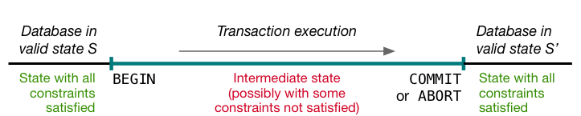

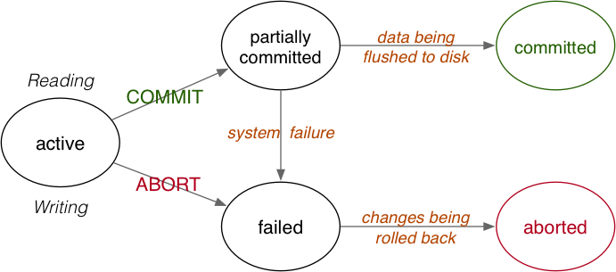

### Concurrent transactions & ACID Properties

并发事务**Concurrent transactions** are

- **desirable, for improved performance (throughput)**
- problematic, because of **potential unwanted interactions**

To ensure **problem-free** concurrent transactions:

- **A**tomic ... whole effect of tx, or nothing 要么事务影响数据库要么不影响
- **C**onsistent ... individual tx's are "correct" (wrt application) 单独事务从应用层面上讲是正确的
- **I**solated ... each tx behaves as if no concurrency 事务执行时都当并发不存在
- **D**urable ... effects of committed tx's persist 事务commit后影响一直在

### Transaction Processing

.png)

The study of techniques for **realising ACID properties**

- **C**onsistency is the property:
    - a tx is correct with respect to its own specification
    - a tx performs a mapping that maintains all DB constraints
    - Ensuring this must be left to application programmers.
- **A**tomicity is handled by the commit and abort mechanisms
    - **commit** ends tx and ensures all changes are saved/persisted
    - **abort** ends tx and *undoes* changes "already made"
- **D**urability is handled by implementing stable storage, via
    - redundancy, to deal with hardware failures
    - logging/checkpoint mechanisms, to recover state
- **I**solation is handled by concurrency control mechanisms
    - possibilities: lock-based, timestamp-based, check-based
    - various levels of isolation are possible (e.g. serializable)

### Terminology

To describe transaction effects, we consider:

- `READ` - transfer data from "disk" to memory
- `WRITE` - transfer data from memory to "disk"
- `ABORT` - terminate transaction, unsuccessfully
- `COMMIT` - terminate transaction, successfully

The `READ`, `WRITE`, `ABORT`, `COMMIT` operations:

- occur in the context of some transaction *T*
- involve manipulation of data items *X, Y, ...*  (`READ` and `WRITE`)

The operations are typically denoted as:

| Terminology | Operations                        |
| ----------- | --------------------------------- |
| *RT(X)*     | read item *X* in transaction *T*  |
| *WT(X)*     | write item *X* in transaction *T* |
| *AT*        | abort transaction *T*             |
| *CT*        | commit transaction *T*            |

Relationship between the above operations and SQL:

- **`SELECT`** produces `READ` operations on the database
- **`UPDATE`** and **`DELETE`** produce `READ` then `WRITE` operations
- **`INSERT`** produces `WRITE` operations

More on transactions and SQL

- **`BEGIN`** starts a transactionthe `begin` keyword in PLpgSQL is not the same thing
- **`COMMIT`** commits and ends the current transactionsome DBMSs e.g. PostgreSQL also provide `END` as a synonymthe `end` keyword in PLpgSQL is not the same thing
- **`ROLLBACK`** aborts the current transaction, undoing any changessome DBMSs e.g. PostgreSQL also provide `ABORT` as a synonym

### Schedules 调度

A schedule gives the **sequence of operations from *≥ 1* tx**

**串行调度 Serial schedule** for a set of tx's *T1* .. *Tn*

- all operations of *Ti* complete before *Ti+1* begins
- E.g.  *RT1(A)  WT1(A)  RT2(B)  RT2(A)  WT3(C)  WT3(B)* 
- **guarantee database consistency**
    - each *Ti* commits before *Ti+1*
    - prior to *Ti* database is consistent
    - after *Ti* database is consistent  (assuming *Ti* is correct)
    - before *Ti+1* database is consistent

**并发调度Concurrent schedule** for a set of tx's *T1* .. *Tn*

- operations from individual *Ti*'s are **interleaved**
- E.g.  *RT1(A)  RT2(B)  WT1(A)  WT3(C)  WT3(B)  RT2(A)* 
- **may produce a database that is not consistent**
- after all of the transactions have committed successfully
- **如果并发调度对一系列事务和串行调度对一系列事务产生相同影响 则称这个并发调度是串行调度**
    - If a concurrent schedule on a set of tx's *TT* ...
        - produces the same effect as a serial schedule on *TT*
        - then we say that the schedule is serializable

**隔离机制的目标是通过整理事务顺序确保产生串行调度**

Primary goal of **isolation mechanisms** (see later) is

- arrange execution of individual operations in tx's in *TT*
- to ensure that a serializable schedule is produced

#### Property of Schedule

- **Serializability, focusing on isolation**
- **Recovering from failures**

### Transaction Anomalies 事务异常

What problems can occur with (uncontrolled) concurrent tx's

- **dirty read**: reading data item written by a concurrent uncommitted tx
    - **脏读：读到其他未提交并发事务写的数据**
- **nonrepeateable read**: re-reading data item, since changed by another concurrent tx
    - **不可重复读：其他并发事务对数据的修改导致当前事务重新读数据时数据也发生改变**
- **phantom read**: re-scanning result set, finding it changed by another tx
    - **幻读：重新扫描数据(结果)集时发现结果集被其他事务改变**

### Recoverability 可恢复性

Consider the serializable schedule:

```
T1:        R(X)  W(Y)  C
T2:  W(X)                 A
```

(where the final value of `Y` is dependent on the `X` value)

Notes:

- the final value of *X* is valid (change from *T2* rolled back)
- ***T1* reads/uses an *X* value that is eventually rolled-back**
- even though ***T2* is correctly aborted, it has produced an effect**

**Produces an invalid database state, even though serializable.**

**可恢复调度可以避免无效读/写** **Recoverable schedules avoid these kinds of problems.**

For a schedule to be recoverable, we require **additional constraints**

- **对于所有被当前事务用到的数据，如果这个数据被其他事务写过，那么其他事务必须比当前事务早提交**
- **并不能避免脏读**
- **all tx's *Ti* that wrote values used by *Tj***
- **must have committed before *Tj* commits**
- and this property must hold for all transactions *Tj*
- Note that recoverability does not prevent "dirty reads".
    - In order to make schedules recoverable in the presence of dirty reads and aborts
        - may need to abort multiple transactions

#### Cascading Aborts/Rollback 级联终止/回滚

Recall the earlier non-recoverable schedule:

```
T1:        R(X)  W(Y)  C
T2:  W(X)                 A
```

To **make it recoverable** requires:

- delaying *T1*'s commit until *T2* commits
- if *T2* aborts, cannot allow *T1* to commit

```
T1:        R(X)  W(Y) ...   C? A!
T2:  W(X)                 A
```

Known as **cascading aborts (or cascading rollback)**

**级联回滚：如果写过共享数据的事务终止了 读写过该共享数据的后面所有事务都需要被终止**

Example: *T3* aborts, causing *T2* to abort, causing *T1* to abort

```
T1:                    R(Y)  W(Z)        A
T2:        R(X)  W(Y)                 A
T3:  W(X)                          A
```

Even though *T1* has no direct connection with *T3*
(i.e. no shared data).

**级联回滚可能会严重影响系统吞吐量和很多并发事务**

This kind of problem ...

- can potentially affect very many concurrent transactions
- could have a significant impact on system throughput

#### ACR (avoid cascading rollback) 调度

- **事务只能读已提交事务写的数据**
- **避免级联回滚**
- **避免脏读**
- **可恢复**
- **并发度降低**

Cascading aborts can be avoided if

- **transactions can only read values written by committed transactions**

    (alternative formulation: no tx can read data items written by an uncommitted tx)

Effectively: eliminate the possibility of reading dirty data.

Downside: reduces opportunity for concurrency.

These are called ACR (avoid cascading rollback) schedules.

All ACR schedules are also recoverable.

#### Strict Schedule 严格调度

- **避免脏写**
- **事务只能读已提交事务写的数据**(ACR)
- **事务只能写已提交事务写的数据**

Strict schedules also eliminate the chance of *writing* dirty data.

A schedule is strict if

- no tx can read values written by another uncommitted tx  (ACR)
- no tx can write a data item written by another uncommitted tx

Strict schedules simplify the task of rolling back after aborts.

#### Classes of Schedules 调度类型

Schedules ought to be **serializable and strict.**

But **more serializable/strict *⇒* less concurrency**.

DBMSs allow users to trade off "safety" against performance.

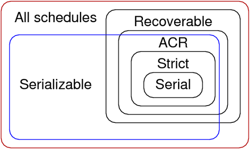

### Transaction Isolation 事务隔离

#### Concurrency control schemes

Simplest form of isolation: serial execution  (*T1 ; T2 ; T3 ; ...*)

Problem: serial execution yields poor throughput.

**Concurrency control schemes (CCSs) aim for "safe" concurrency**

Abstract view of DBMS concurrency mechanisms **事务管理器=>调度器=>缓冲区**

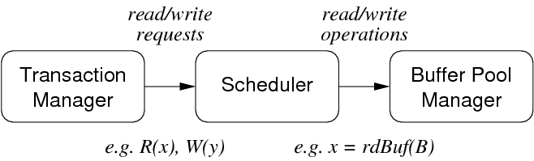

#### Serializibility 可串行性

Consider two schedules *S1* and *S2* produced by

- executing the same set of transactions *T1..Tn* concurrently
- but with a non-serial interleaving of *R/W* operations

*S1* and *S2* are equivalent if *StateAfter(S1)  = StateAfter(S2)*
i.e. final state yielded by *S1* is same as final state yielded by *S2**S* is a serializable schedule (for a set of concurrent tx's *T1 ..Tn*) if

- *S* is equivalent to some serial schedule *Ss* of *T1 ..Tn*

Under these circumstances, consistency is guaranteed
(assuming no aborted transactions and no system failures)

Two formulations of serializability:

- **冲突可串行性 conflict serializibility**
    - i.e. conflicting R/W operations occur in the "right order"
    - check via **precedence graph**优先图; look for **absence of cycles**
- **视域可串行性 view serializibility**
    - i.e. read operations *see* the correct version of data
    - checked via VS conditions on likely equivalent schedules

```
T1: R(X) W(X)           R(Y)                W(Y)
T2:           R(Y)           R(X) W(Y)           W(X)
T3:                R(X)                R(Y)           W(X) W(Y)

Q7

a.
precedence graph:
conflict on X: T1:W(X) --> T3:R(X)
conflict on X: T1:W(X) --> T2:R(X)
conflict on X: T2:W(X) --> T3:W(X)
conflict on Y: T2:W(Y) --> T3:R(Y)
conflict on Y: T3:R(Y) --> T1:W(Y)
conflict on Y: T1:W(Y) --> T3:W(Y)
cycle in T1 and T3, therefore not conflict serializable.

b.
T1: R(X) W(X)           R(Y)                W(Y)
T2:           R(Y)           R(X) W(Y)           W(X)
T3:                R(X)                R(Y)           W(X) W(Y)

condition(X)
determine the first reader of X: T1
determine the last writer of X: T3
T1:R(X) read the original version of X
T2:R(X) read the version of T1:W(X)
T3:R(X) read the version of T1:W(X)
condition(Y)
determine the first reader of Y: T2
determine the last writer of Y: T3
T1:R(Y) read the original version of Y
T2:R(Y) read the original version of Y
T3:R(Y) read the version of T2:W(Y)

T1:R(X) W(X) R(Y) W(Y)
T2:R(Y) R(X) W(Y) W(X)
T3:R(X) R(Y) W(X) W(Y)
in order to satisfy condition(X), need to put T1 serial txs first and put T3 serial txs last which indicate T1->T2->T3
view-equivalence of T1->T2->T3
T1:R(X) W(X) R(Y) W(Y)
T2:                     R(Y) R(X) W(Y) W(X)
T3:                                         R(X) R(Y) W(X) W(Y)
in order to satisfy condition(Y), need to put T2 serial txs first and put T3 serial txs last which indicate T2->T1->T3
view-equivalence of T2->T1->T3
T1:                     R(X) W(X) R(Y) W(Y)
T2:R(Y) R(X) W(Y) W(X)
T3:                                         R(X) R(Y) W(X) W(Y)

These two view equivalent schedule conflict with each other, therefore not view serializable.
```

#### Transaction Isolation Levels

| **Isolation Level**  | **Dirty Read** | **Nonrepeatable Read** | **Phantom Read** |
| -------------------- | -------------- | ---------------------- | ---------------- |
| **Read Uncommitted** | Possible       | Possible               | Possible         |
| **Read Committed**   | Not Possible   | Possible               | Possible         |
| **Repeatable Read**  | Not Possible   | Not Possible           | Possible         |
| **Serializable**     | Not Possible   | Not Possible           | Not Possible     |

#### Transaction Isolation in PostgreSQL

For transaction isolation, PostgreSQL

- provides syntax for all four levels
- **treats read uncommitted as read committed**
    - **Note: cannot implement read uncommitted because of MVCC**
    - **MVCC providing consistent snapshots and preventing dirty reads**
    - each *Si* sees snapshot of DB at start of *Si*
- **repeatable read behaves *like* serializable**
- example：**事务由多个操作Si组成** BEGIN S1; S2; ... Sn; COMMIT;
    - default level is read committed
        - **每次操作看到此操作开始的快照** **read committed**：**each *Si* sees snapshot of DB at start of *Si***

    - **repeatable read && serializable**
        - **每次操作看到的都是该事务开始的快照** **each *Si* sees snapshot of DB at start of tx**
        - serializable checks for extra conditions


## Concurrency Control 并发控制

Approaches to concurrency control:

- **Lock-based 基于锁**
    - Synchronise tx execution via locks on relevant part of DB.
- **Version-based  (MVCC multi-version concurrency control) 多版本并发控制 (基于版本)**
    - Allow multiple consistent versions of the data to exist.
        Each tx has access only to version existing at start of tx.
- **Validation-based  (OCC optimistic concurrency control) 乐观并发控制 (基于验证)**
    - Execute all tx's; check for validity problems on commit.
- **Timestamp-based 基于时间戳**
    - Organise tx execution via timestamps assigned to actions.

### Lock-based Concurrency Control 基于锁的并发控制

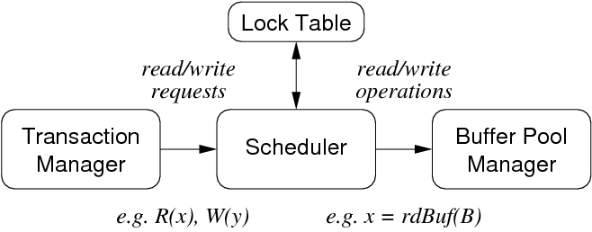

锁表**Lock table** entries contain:

- **被锁的东西object being locked**  (DB, table, tuple, field)
- **锁类型 type of lock: read/shared, write/exclusive**
- **请求锁的事务队列 FIFO queue of tx's requesting this lock**
- **当前拿到锁的事务计数器 count of tx's currently holding lock  (max 1 for write locks)**

加锁/解锁必须是原子性的**Lock and unlock operations *must* be atomic.**

锁升级 Lock upgrade:

- **当前事务是唯一一个事务拿着读锁的** if a tx holds a read lock, and it is the only tx holding that lock
- 则可以把**锁升级为写锁** then the lock can be converted into a write lock

Synchronise access to shared data items via following rules:

- **读X前对X加读(共享)锁** before reading *X*, get read (shared) lock on *X*
- **写X前对X加写(排他)锁** before writing *X*, get write (exclusive) lock on *X*
- **a tx attempting to get a read lock on *X* is blocked if another tx already has write lock on *X***
- **a tx attempting to get an write lock on *X* is blocked if another tx has any kind of lock on *X***
- These rules alone **do not guarantee serializability**

#### Two-Phase Locking 两阶段锁

**两阶段锁保证串行化：任一事务中请求锁都在释放锁之前****

To **guarantee serializability**, we require an additional constraint:

- **in every tx, all *lock* requests precede all *unlock* requests**

**Each transaction** is then structured as:

- **growing phase** where locks are acquired
- **action phase** where "real work" is done
- **shrinking phase** where locks are released

#### Problems with Locking 锁问题

- 死锁 Deadlock：No transactions can proceed; each waiting on lock held by another.
    - **未雨绸缪prevent it happening in the first place**
    - **发生后检测并恢复** let it happen, detect it, recover from it
    - Methods for **managing deadlock**

        - **timeout** : set max time limit for each tx
        - **waits-for graph**: records Tj waiting on lock held by Tk
            - waits-for minimises roll backs because of deadlock
            - ***prevent*** deadlock by **checking for new cycle** *⇒* abort *Ti*
            - ***detect*** deadlock by **periodic check for cycles** *⇒* abort *Ti*
        - **timestamps**: use tx start times as basis for priority **easier to implement than waits-for graph**
            - scenario: ***Tj* tries to get lock held by *Tk*** ...
            - both wait-die and wound-wait are fair
                 - **wait-die**: if ***Tj < Tk*, then *Tj* waits**;  if ***Tj > Tk*, then *Tj* rolls back**
                     - roll back tx's that have **done little workbut** 
                     - **rolls back tx's more often**
                 - **wound-wait**: if ***Tj < Tk*, then *Tk* rolls back**;  if ***Tj > Tk* *Tj* waits**
                     - roll back tx's that may have **done significant work**
                     - but rolls back tx's **less often**
- 饥饿 Starvation：One transaction is permanently "frozen out" of access to data.
- 性能下降 Reduced performance: Locking introduces delays while waiting for locks to be released.

### Optimistic Concurrency Control 乐观并发控制

乐观并发控制适用于**读远大于写的场景**

In scenarios where there are **far more reads than writes** ...

- **don't lock** (allow **arbitrary interleaving of operations**)
- **check just before commit** that **no conflicts occurred**
- if **problems, roll back conflicting transactions**

#### OCC Phases

Under OCC, transactions have **three distinct phases:**

- 读取阶段**Reading**: read from database, modify local copies of data
- 验证阶段**Validation**: check for conflicts in updates
- 写入阶段**Writing**: commit local copies of data to database

Timestamps are recorded at points *S, V, F* :

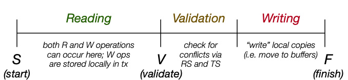

#### **Data structures needed for validation**

- **开始阶段S** ... set of txs that are **reading data and computing results**
- **验证阶段V** ... set of txs that have **reached validation (not yet committed)**
- **完成阶段F** ... set of txs that have **finished (committed data to storage)**
- for **each *Ti*,  timestamps for when it reached *S*, *V*, *F***
- ***RS(Ti)* set of all data items read by *Ti***
- ***WS(Ti)* set of all data items to be written by *Ti***

Use the *V* timestamps as ordering for transactions

- assume serial tx order based on ordering of *V(Ti)*'s

#### Validation check for transaction *T*

- for all transactions Ti ≠ T
    - if *T∈S & Ti∈F*, then ok
    - if *T∉V & V(Ti) < S(T) < F(Ti)*,
        then check *WS(Ti) ∩ RS(T)* is empty
    - if *T∈V & V(Ti) < V(T) < F(Ti)*,
        then check *WS(Ti) ∩ WS(T)* is empty
    - If this check fails for any *Ti*, then *T* is rolled back.
- **对于所有其他事务**
    - **如果当前事务在读取阶段且其他事务在写入阶段则通过**
    - **如果当前事务不属于验证阶段且其读取阶段居于其他事务验证阶段和写入阶段之间**
        - **验证当前事务的读集是否和其他事务的写集有无交集 无交集则通过**
    - **如果当前事务属于验证阶段且其验证阶段居于其他事务验证阶段和写入阶段之间**
        - **验证两事务的写集有无交集 无交集则通过**
    - **任一其他事务不通过则回滚当前事务**

OCC **prevents: *T* reading dirty data, *T* overwriting *Ti*'s changes**

**OCC可防止任一事务脏读及覆盖其他事务的写入**

#### Problems with OCC

- **回滚次数增加increased roll backs**
    - **但是回滚成本其实很低**"Roll back" is **relatively cheap**
        - **changes to data are purely local before Writing phase**
        - **no requirement for logging info or undo/redo** (see later)
- 有可能会回滚已完成的事务 **tendency to roll back "complete" tx's**
- **维护SVF集合的成本 cost to maintain *S,V,F* sets**

### Multi-version Concurrency Control 多版本并发控制

Multi-version concurrency control (MVCC) aims to

- retain benefits of locking, while getting more concurrency
- by **providing multiple (consistent) versions of data items**

Achieves this by

- **读合适**的版本**readers access an "appropriate" version** of each data item
- **写新**的版本**writers make new versions of the data items they modify**

**Main difference between MVCC and standard locking:**

- **MVCC的读写锁互不影响互不阻塞 read locks do not conflict with write locks** *⇒* reading never blocks writing, writing never blocks reading

#### Implementation

**WTS = timestamp of tx that wrote this data item**

Chained tuple versions:  *tupoldest → tupolder → tupnewest*

当**读事务开启**时

- **忽略所有当前读事务开启后创建的数据(不可见数据)：写所有不可见数据的时间戳最小值大于读事务开启时间戳**
- **用当前读事务能获取到的最新的数据版本(可见数据版本)：写所有可见数据版本中时间戳最大值小于读事务开启时间戳**

当**写事务开启**时

- **找到该数据相对写事务开启的最新版本**
- **如果该版本没有后续版本 写事务开启后可以创建新的数据版本**
- **如果该版本有后续版本 终止写事务**
- 如果**读数据也有版本时间戳：读版本时间戳大于写事务开启时间戳则终止写操作**

When a reader *Ti* is accessing the database

- ignore any data item D created after Ti started
    - checked by: min(WTS(D)) *>* TS(*Ti*)
- use only newest version V accessible to Ti
    - determined by: max(WTS(V)) *<* TS(*Ti*)

When a writer *Ti* attempts to change a data item

- find newest version V satisfying WTS(V) *<* TS(*Ti*)
- if no later versions exist, create new version of data item
- if there are later versions, then abort *Ti*
- Some MVCC versions also maintain RTS (TS of last reader)
    - don't allow *Ti* to write D if RTS(D) > TS(*Ti*)

#### Feature of MVCC

Advantage of MVCC

- **降低锁需求** locking needed for serializability considerably reduced

Disadvantages of MVCC

- **额外可视性检查** visibility-check overhead (on every tuple read/write)
- 如果有读版本时间戳需要读也更新 reading an item *V* causes an update of *RTS(V)* (if used)
- **额外存储数据的多个版本** storage overhead for extra versions of data items
- **还得移除过时数据版本** overhead in removing out-of-date versions of data items

**MVCC缺点众多依然高效** Despite apparent disadvantages, MVCC is very effective.

#### Removing old versions

- *Vj* and *Vk* are versions of same item
- *WTS(Vj)* and *WTS(Vk)* precede *TS(Ti)* for all *Ti*
- **remove version with smaller *WTS(Vx)* value**

什么时候**移除旧版本** When to make this check?

- **每次新版本出现** every time a new version of a data item is added?
- **周期性在内存检查** periodically, with fast access to blocks of data
    - **PostgreSQL** uses the latter (**vacuum**).

#### PgSQL Implemetation

**PostgreSQL** uses two styles of concurrency control:

- **DML用MVCC** multi-version concurrency control (MVCC)
    (used in implementing SQL DML statements (e.g. `select`))
- **DDL用两阶段锁** two-phase locking (2PL)
    (used in implementing SQL DDL statements (e.g. `create table`))

From the SQL (PLpgSQL) level:

- can let the **lock/MVCC system handle concurrency**
- can handle it **explicitly via `LOCK` statements**

PostgreSQL provides read committed and serializable isolation levels.

- **用串行化隔离级别**
    - **查询**
        - **只能看见事务开始前已提交的数据**
        - **事务开始后不能看见其他事务后续更改**
    - **更新**
        - **更新已被其他事务更改(不管提没提交)的数据会失败**
        - **包括该更新的整个事务都需要回滚**

Using the **serializable isolation level**, a `select`:

- sees only data committed before the transaction began
- never sees changes made by concurrent transactions

Using the serializable isolation level, an update fails:

- if it tries to modify an "active" data item
    (active = affected by some other tx, either committed or uncommitted)

The transaction containing the update must then rollback and re-start.

实现MVCC

- **一个日志文件维持所有事务的当前状态**
- **每一个记录/元组都要有**
    - xmin **创建记录的事务ID**
    - xmax **替换/删除记录的事务ID**
    - xnew **有记录最新版本的事务ID**
- **每个事务都要有**
    - **事务ID(时间戳)**
    - **快照：事务开启时的活跃事务列表**

Implementing MVCC in PostgreSQL requires:

- a log file to maintain current status of each *Ti*
- in every tuple:
    - `xmin` ID of the tx that created the tuple
    - `xmax` ID of the tx that replaced/deleted the tuple (if any)
    - `xnew` link to newer versions of tuple (if any)
- for each transaction Ti:
    - a transaction ID (timestamp)
    - SnapshotData: list of active tx's when *Ti* started

**Rules for a tuple to be visible to *Ti* :**

- **the`xmin` (creation transaction) value must**
    - **be committed in the log file**
    - **have started before *Ti*'s start time**
    - **not be active at *Ti*'s start time**
- **the`xmax`(delete/replace transaction) value must**
    - **be blank or refer to an aborted tx, or**
    - **have started after *Ti*'s start time, or**
    - **have been active at SnapshotData time**

**Tx's always see a consistent version of the database.**

But **may not see the "current" version** of the database.

E.g. *T1* does select, then concurrent *T2* deletes some of *T1*'s selected tuples

This is OK unless tx's communicate outside the database system.

E.g. *T1* counts tuples; *T2* deletes then counts; then counts are compared

**需要锁才能使所有事务读到当前版本：LOCK TABE 锁整个表 / SELECT FOR UPDATE 锁选定记录**

**Use locks if application needs every tx to see same current version**

- **`LOCK TABLE` locks an entire table**
- **`SELECT FOR UPDATE` locks only the selected rows**

## Atomicity/Durability 原子性/持久性

Implementation of atomicity/durability is intertwined

### system failures

The last requires off-site backup; all others should be locally recoverable.

- single-bit inversion during transfer mem-to-disk
    - parity checking
- decay of storage medium on disk (some data changed)
    - mark "bad" blocks
- failure of entire disk device (data no longer accessible)
    - RAID (levels 4,5,6)
- **failure of DBMS processes (e.g. `postgres` crashes)**
    - keep a log of changes made to database
    - use this log to restore state in case of failures
- **failure of transactions (`ABORT`)**
    - keep a **log of changes** made to database
    - use this log to **restore state in case of failures**
- operating system crash; power failure to computer room
- complete destruction of computer system running DBMS
    - off-site backup

### Architecture for Atomicity/Durability

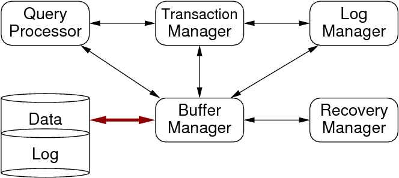


### Execution of Transactions

Transactions deal with three address spaces:

- stored data on the disk  (representing global DB state)
- data in memory buffers  (where held for sharing by tx's)
- data in their own local variables  (where manipulated)

Each of these may hold a different "version" of a DB object.

PostgreSQL processes make heavy use of shared buffer pool ⇒ transactions do not deal with much local data.

Operations available for data transfer:

- **`INPUT(X)` ... read page containing `X` into a buffer**
- **`READ(X,v)` ... copy value of `X` from buffer to local var `v`**
- **`WRITE(X,v)` ... copy value of local var `v` to `X` in buffer**
- **`OUTPUT(X)` ... write buffer containing `X` to disk**

**READ/WRITE are issued by transaction**

`INPUT/OUTPUT` are issued by buffer manager (and log manager)

**`INPUT/OUTPUT` correspond to `getPage()`/`putPage()`** mentioned above

```
t   Action        v  Buf(A)  Buf(B)  Disk(A)  Disk(B)
-----------------------------------------------------
(0) BEGIN         .      .       .        8        5
(1) READ(A,v)     8      8       .        8        5
(2) v = v*2      16      8       .        8        5
(3) WRITE(A,v)   16     16       .        8        5
(4) READ(B,v)     5     16       5        8        5
(5) v = v+1       6     16       5        8        5
(6) WRITE(B,v)    6     16       6        8        5
(7) OUTPUT(A)     6     16       6       16        5
(8) OUTPUT(B)     6     16       6       16        6
```

After tx completes, we must have either Disk(A)=8, Disk(B)=5  or  Disk(A)=16, Disk(B)=6

- If system crashes before (8), may need to undo disk changes.
- If system crashes after (8), may need to redo disk changes.

Two issues arise w.r.t. buffers:

- forcing ... `OUTPUT` buffer on each`WRITE`
    - ensures durability; disk always consistent with buffer pool
    - poor performance; defeats purpose of having buffer pool
- stealing ... replace buffers of uncommitted tx's
    - if we don't, poor throughput (tx's blocked on buffers)
    - if we do, seems to cause atomicity problems?

Ideally, we want stealing and not forcing.

Handling stealing:

- transaction T loads page P and makes changes
- T2 needs a buffer, and P is the "victim"
- P is output to disk (it's dirty) and replaced
- if T aborts, some of its changes are already "committed"
- must log values changed by T in P at "steal-time"
- use these to UNDO changes in case of failure of T

Handling no forcing:

- transaction T makes changes & commits, then system crashes
- but what if modified page P has not yet been output?
- must log values changed by T in P as soon as they change
- use these to support REDO to restore changes

Above scenario may be a problem, even if we are forcing

- e.g. system crashes immediately after requesting a `WRITE()`

### Logging

- **undo移除未提交事务的修改**
- **redo重做已提交事务的修改**
- **都是预写式日志 WAL**：**先写log再真正更新**

Three "styles" of logging

- undo ... removes changes by any uncommitted tx's
- redo ... repeats changes by any committed tx's
- undo/redo ... combines aspects of both

All approaches require:

- a sequential file of log records
- log records describe a change to a data item
- log records are written first
- actual changes to data are written later

Known as write-ahead logging  (PostgreSQL uses WAL)

#### Undo Logging

Simple form of logging which ensures atomicity.

**undo log 确保原子性 日志文件由一连串记录组成**

Log file consists of a sequence of small records:

- **`<START T>` ... transaction `T` begins**
- **`<COMMIT T>` ... transaction `T` completes successfully**
- **`<ABORT T>` ... transaction `T` fails (no changes)**
- **`<T,X,v>` ... transaction `T` changed value of `X` from `v`**

Notes:

- we refer to **`<T,X,v>` generically as `<UPDATE>` log records**
- update log entry created for each `WRITE` (not `OUTPUT`)
- update log entry contains *old* value (new value is not recorded)

**Data must be written to disk** in the following **order**:

1. **`<START>` transaction log record**
2. **`<UPDATE>` log records indicating changes** **the changed data elements themselves**
3. **`<COMMIT>` log record**

Note: sufficient to have  <T,X,v> output before X, for each X

For the example transaction, we would get:

```
t    Action        v  B(A)  B(B)  D(A)  D(B)  Log
--------------------------------------------------------
(0)  BEGIN         .    .     .     8     5   <START T>
(1)  READ(A,v)     8    8     .     8     5
(2)  v = v*2      16    8     .     8     5
(3)  WRITE(A,v)   16   16     .     8     5   <T,A,8>
(4)  READ(B,v)     5   16     5     8     5
(5)  v = v+1       6   16     5     8     5
(6)  WRITE(B,v)    6   16     6     8     5   <T,B,5>
(7)  FlushLog
(8)  StartCommit
(9)  OUTPUT(A)     6   16     6    16     5
(10) OUTPUT(B)     6   16     6    16     6
(11) EndCommit                                <COMMIT T>
(12) FlushLog
```

Note that **T is not regarded as committed until (12) completes.**

**UNDO恢复操作：从日志当前记录往回看** 

- **看到COMMIT 事务 则记录事务为已提交** 
- **看到更新操作但操作事务没有提交 执行还原操作**
- **看到START 事务但事务没提交 加ABORT 事务**

```
Before (5), UNDO log looks like ...
   <START T> <T,A,8>
After UNDO operation, log looks like
   <START T> <T,A,8> ... <ABORT T>

Before (10), UNDO log looks like ...
   <START T> <T,A,8> <T,B,5>
After UNDO operation, log looks like
   <START T> <T,A,8> <T,B,5> ... <ABORT T>

After (12), UNDO log looks like ...
   <START T> ... <T,A,8> ... <T,B,5> ... <COMMIT T>
```

Simplified view of **recovery using UNDO logging**:

- **scan backwards through log**
    - if `<COMMIT T>`, mark `T` as committed
    - if `<T,X,v>` and `T` not committed, set `X` to `v` on disk
    - if `<START T>` and `T` not committed, add `<ABORT T>` to log

Assumes we scan entire log; use checkpoints to limit scan.

```
committedTrans = abortedTrans = startedTrans = {}
for each log record from most recent to oldest {
    switch (log record) {
    <COMMIT T> : add T to committedTrans
    <ABORT T>  : add T to abortedTrans
    <START T>  : add T to startedTrans
    <T,X,v>    : if (T in committedTrans)
                     // don't undo committed changes
                 else  // roll-back changes
                     { WRITE(X,v); OUTPUT(X) }
}   }
for each T in startedTrans {
    if (T in committedTrans) ignore
    else if (T in abortedTrans) ignore
    else write <ABORT T> to log
}
flush log
```

#### Checkpointing

Simple view of recovery implies reading entire log file.

Since log file grows without bound, this is infeasible.

Eventually we can **delete "old" section of log**.

- i.e. where **all prior transactions have completed**

This point is called a **checkpoint**.

- **all of log prior to checkpoint can be ignored for recovery**

As described we need to wait for all active tx to complete

- known as quiescent checkpointing
- tx's taking a long time to complete block the system

Problem: many concurrent/overlapping transactions.

How to know that all have finished?

1. **periodically, write log record `<CHKPT (T1,..,Tk)>`**
    (contains references to all active transactions *⇒* active tx table)
2. **continue normal processing (e.g. new tx's can start)**
3. when **all of `T1,..,Tk` have completed,**
    **write log record `<END CHKPT>` and flush log**

Note: tx manager maintains chkpt and active tx information

These kinds of checkpoints are often written as `<START CHKPT ...>`

Recovery: scan backwards through log file processing as before.

Determining where to stop depends on ...

- whether we meet `<END CHKPT>` or `<CHKPT...>` first

If we **encounter `<END CHKPT>` first**:

- we know that **all incomplete tx's come after prev `<CHKPT...>`**
- thus, can **stop backward scan when we reach `<CHKPT...>`**

If we **encounter `<CHKPT (T1,..,Tk)>` first**:

- **crash occurred *during* the checkpoint period**
- **any of `T1,..,Tk` that committed before crash are ok**
- for **uncommitted tx's, need to continue backward scan**

#### Redo Logging

**光有UNDO不行：所有已经更改的数据在提交之前就必须在磁盘里 违反缓冲区存在的意义**

**还得有REDO：允许更改在提交后仍然在缓冲区里/记录正在改的那些更改(pending)/crash后可以根据记录重新恢复这些已提交的更改**

Problem with UNDO logging:

- all changed data must be output to disk before committing
- conflicts with optimal use of the buffer pool

Alternative approach is redo logging:

- allow changes to remain only in buffers after commit
- write records to indicate what changes are "pending"
- after a crash, can apply changes during recovery

Requirement for redo logging: write-ahead rule.

Data must be written to disk as follows:

1. write start transaction `<START *T*>` log record
2. write `<UPDATE...>` log records indicating changes
3. then write `<COMMIT>` log record (and flush log)
4. then `OUTPUT` changed data elements themselves

Note that update log records now contain **<T,X,v'>, where v' is the *new* value for X**

For the example transaction, we would get:

```
t    Action        v  B(A)  B(B)  D(A)  D(B)  Log
--------------------------------------------------------
(0)  BEGIN         .    .     .     8     5   <START T>
(1)  READ(A,v)     8    8     .     8     5
(2)  v = v*2      16    8     .     8     5
(3)  WRITE(A,v)   16   16     .     8     5   <T,A,16>
(4)  READ(B,v)     5   16     5     8     5
(5)  v = v+1       6   16     5     8     5
(6)  WRITE(B,v)    6   16     6     8     5   <T,B,6>
(7)  COMMIT                                   <COMMIT T>
(8)  FlushLog
(9)  OUTPUT(A)     6   16     6    16     5
(10) OUTPUT(B)     6   16     6    16     6
```

Note that **T is regarded as committed as soon as (8) completes.**

**REDO操作**

- **回头找所有提交的事务**
- **从提交事务的头开始往后看**
    - **如果出现`<T,X,v>`且事务已提交 更新到磁盘**
    - **如果出现`<START T>` 且事务未提交 add `<ABORT T>` to log**

Simplified view of recovery using REDO logging:

- **identify all committed tx's  (backwards scan)**
- **scan forwards through log**
    - **if `<T,X,v>` and `T` is committed, set `X` to `v` on disk**
    - **if `<START T>` and `T` not committed, add `<ABORT T>` to log**

Use checkpoints (like UNDO log checkpoints) to limit scan.

#### Undo/Redo Logging

**Undo/Redo 结合两者`<T,X,v,v'>` gives both old and new values for `X`** 

Undo/Redo logging combines aspects of both

- requires new kind of update log record
    `<T,X,v,v'>` gives both old and new values for `X`
- removes incompatibilities between output orders

For the example transaction, we might get:

```
t    Action        v  B(A)  B(B)  D(A)  D(B)  Log
--------------------------------------------------------
(0)  BEGIN         .    .     .     8     5   <START T>
(1)  READ(A,v)     8    8     .     8     5
(2)  v = v*2      16    8     .     8     5
(3)  WRITE(A,v)   16   16     .     8     5   <T,A,8,16>
(4)  READ(B,v)     5   16     5     8     5
(5)  v = v+1       6   16     5     8     5
(6)  WRITE(B,v)    6   16     6     8     5   <T,B,5,6>
(7)  FlushLog
(8)  StartCommit
(9)  OUTPUT(A)     6   16     6    16     5
(10)                                          <COMMIT T>
(11) OUTPUT(B)     6   16     6    16     6
```

Note that T is regarded as committed as soon as (10) completes.

**UNDO/REDO组合操作**

- **扫描日志判断事务是否提交**
- **没提交的事务全加 `<ABORT T>`** 
- **往回看日志 如果有更新操作且事务没提交 恢复原来的值**
- **往前看日志 如果有更新操作且事务提交了 设置更新的值**

Simplified view of recovery using UNDO/REDO logging:

- scan log to determine committed/uncommitted txs
- for each uncommitted tx `T` add `<ABORT T>` to log
- scan backwards through log
    - if `<T,X,v,w>` and `T` is not committed, set `X` to `v` on disk
- scan forwards through log
    - if `<T,X,v,w>` and `T` is committed, set `X` to `w` on disk

Note: undo/redo logging requires dirty buffers to be flushed at `<CHKPT...>`

#### Aries Algorithm

Aries is a complete algorithm for undo/redo logging.

Differences to what we have described:

- log records contain a sequence number (LSN)
- LSNs used in tx and buffer managers, and stored in data pages
- additional log record to mark `<END>` (of commit or abort)
- `<CHKPT>` contains only a timestamp
- `<END CHKPT..>` contains tx and dirty page info

## Future of Database 

### 关系型数据库优势

**数据库目的：处理大批量数据/高级语言/快查询**

三十年来直到现在关系型数据库依然占主导

- **理论支撑的简洁数据模型**
- 用**高级语言SQL访问数据**
- **约50年的发展 数据库引擎技术成熟**
- 在**处理分布均匀且有结构的数据**时极佳

### 关系型数据库劣势

- **NULL值语义不明** NULL is ambiguous: unknown, not applicable, not supplied
- **限制/规则只有有限支持** "limited" support for constraints/integrity and rules
- **不支持不确定性** no support for uncertainty (data represents the state-of-the-world)
- **数据模型过于简单** data model too simple (e.g. no direct support for complex objects)
- **查询模型过于刻板** query model too rigid (e.g. no approximate matching)
- **不能很好的处理一直变的数据源** continually changing data sources not well-handled
- **数据必须像套模具一样套进固定的规范** data must be "molded" to fit a single rigid schema
- 数据库系统必须手动优化 database systems must be manually "tuned"
- 不能很好的适应处理某些巨型数据集 do not scale well to some data sets (e.g. Google, Telco's)

### Overcome (some) RDBMS limitations

**Extend the relational model** ...

**创建新的数据类型/查询操作来处理数据的不确定性/不准确性/近似性**

- add new data types and query ops for new applications
- deal with uncertainty/inaccuracy/approximation in data

**Replace the relational model** ...

**替换为其他类型数据库**

- object-oriented DBMS ... OO programming with persistent objects
- XML DBMS ... all data stored as XML documents, new query model
- noSQL data stores (e.g. *(key,value)* pairs, json or rdf)

**Performance** ...

**创建更高效的查询算法/数据结构以适应不同类型的查询**

**并行处理**

**数据库自行优化**

- new query algorithms/data-structures for new types of queries
- parallel processing
- DBMSs that "tune" themselves

**Scalability** ...

**分布式存放数据/处理流式数据**

- distribute data across (more and more) nodes
- techniques for handling streams of incoming data

### Database Type

An overview of the possibilities:

- "classical" **RDBMS**  (e.g. **PostgreSQL, Oracle/MySQL, SQLite**)
- **parallel** DBMS  (e.g. XPRS)
- **distributed** DBMS  (e.g. Cohera)
- **deductive** databases  (e.g. Datalog)
- **temporal** databases  (e.g. MariaDB)
- **column** stores  (e.g. Vertica, Druid)
- **object-oriented** DBMS  (e.g. ObjectStore)
- **key-value** stores  (e.g. **Redis**, DynamoDB)
- **wide column** stores  (e.g. **Cassandra**, Scylla, HBase)
- **graph** databases  (e.g. **Neo4J**, Datastax)
- **document** stores  (e.g. **MongoDB**, Couchbase)
- **search engines**  (e.g. Google, Solr)

### Large Data

Some modern applications have massive data sets (e.g. Google)

- far too large to store on a single machine/RDBMS
- query demands far too high even if could store in DBMS

Approach to dealing with such data

- distribute data over large collection of nodes  (also, redundancy)
- provide computational mechanisms for distributing computation

Often this data does not need full relational selection

- represent data via *(key,value)* pairs
- unique *key*s can be used for addressing data
- *values* can be large objects (e.g. web pages, images, ...)

Popular computational approach to such data: map/reduce

- suitable for widely-distributed, very-large data
- allows parallel computation on such data to be easily specified
- distribute (map) parts of computation across network
- compute in parallel (possibly with further mapping)
- merge (reduce) multiple results for delivery to requestor

Some large data proponents see no future need for SQL/relational ...

- depends on application (e.g. hard integrity vs eventual consistency)

### Information Retrieval

DBMSs generally do precise matching (although `like`/regexps)

Information retrieval systems do approximate matching.

E.g. documents containing a set of keywords (Google, etc.)

Also introduces notion of "quality" of matching
(e.g. tuple *T1* is a better match than tuple *T2*)

Quality also implies ranking of results.


Ongoing research in incorporating IR ideas into DBMS context.

Goal: support database exploration better.

### Multimedia Data

Data which does not fit the "tabular model":

- image, video, music, text, ... (and combinations of these)

Research problems:

- how to specify queries on such data? (*image1 ≅ image2*)
- how to "display" results? (synchronize components)

Solutions to the first problem typically:

- extend notions of "matching"/indexes for querying
- require sophisticated methods for capturing data features

Sample query: find other songs like this one?

### Uncertainty

Multimedia/IR introduces approximate matching.

In some contexts, we have approximate/uncertain data.

E.g. witness statements in a crime-fighting database

"I think the getaway car was red ... or maybe orange ..."

"I am 75% sure that John carried out the crime"

Work by Jennifer Widom at Stanford on the Trio system

- extends the relational model (ULDB)
- extends the query language (TriQL)

### Stream Data Management Systems

Makes one addition to the relational model

- stream = infinite sequence of tuples, arriving one-at-a-time

Applications: news feeds, telecomms, monitoring web usage, ...

RDBMSs: run a variety of queries on (relatively) fixed data

StreamDBs: run fixed queries on changing data (stream)

One approach: window = "relation" formed from a stream via a rule

E.g. StreamSQL

```sql
select avg(price)
from examplestream [size 10 advance 1 tuples]
```

### Graph Data

Uses graphs rather than tables as basic data structure tool.

Applications: social networks, ecommerce purchases, interests, ...

Many real-world problems are modelled naturally by graphs

- *can* be represented in RDBMSs, but not processed efficiently
- e.g. recursive queries on  `Nodes`,  `Properties`,  `Edges` tables

Graph data models:  flexible,  "schema-free",  inter-linked

Typical modeling formalisms:  XML,  JSON,  RDF

### Dispersed Databases

Characteristics of dispersed databases:

- very large numbers of small processing nodes
- data is distributed/shared among nodes

Applications: environmental monitoring devices, "intelligent dust", ...

Research issues:

- query/search strategies (how to organise query processing)
- distribution of data (trade-off between centralised and diffused)

Less extreme versions of this already exist:

- grid and cloud computing
- database management for mobile devices

### Parallelism in Databases

RDBMS discussion so far has revolved around systems

- with a single or small number of processors
- accessing a single memory space
- getting data from one or more disk devices

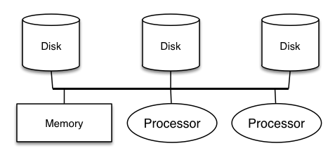

#### Parallel DBMSs

Why parallelism? ... Throughput!

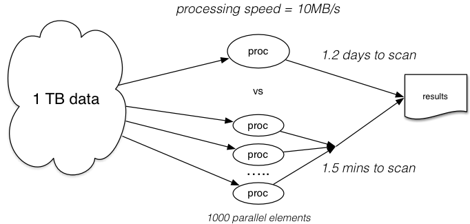

DBMSs are a success story in application of parallelism

- can process many data elements (tuples) at the same time
- can create pipelines of query evaluation steps
- don't require special hardware
- can hide paralleism within the query evaluator
    - application programmers don't need to change habits

Compare this with effort to do parallel programming.

Types:  shared memory,  shared disk,  shared nothing

Example shared-nothing architecture:

Typically same room/LAN  (data transfer cost ~ 100's of μsecs .. msecs)

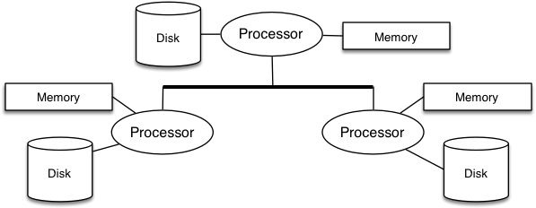

Distributed architectures are effectively shared-nothing, on a global-scale network

Typically on the Internet  (data transfer cost ~ secs)

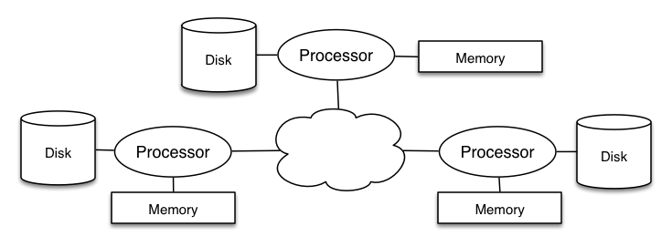

#### Parallel Databases (PDBs)

Parallel databases provide various forms of parallelism ...

- process parallelism can speed up query evaluation
- processor parallelism can assist in speeding up memory ops
- processor parallelism introduces cache coherence issues
- disk parallelism can assist in overcoming latency
- disk parallelism can be used to improve fault-tolerance (RAID)
- one limiting factor is congestion on communication bus


Types of parallelism

- pipeline parallelism
    - multi-step process,  each processor handles one step
    - run in parallel and pipeline result from one to another
- partition parallelism
    - many processors running in parallel
    - each performs same task on a subset of the data
    - results from processors need to be merged


Data Storage in PDBs

Assume that each table/relation consists of pages in a file

Can distribute data across multiple storage devices

- duplicate all pages from a relation  (replication)
- store some pages on one store, some on others  (partitioning)

Replication example:

.png)

Data-partitioning example:

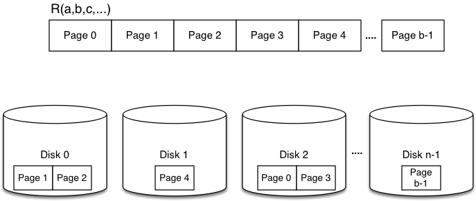


A table is a collection of pages (aka blocks).

Page addressing on single processor/disk: *(Table, File, Page)*

- *Table* maps to a set of files (e.g. named by tableID)
- *File* distinguishes primary/overflow files
- *PageNum* maps to an offset in a specific file

If multiple nodes, then addressing depends how data distributed

- partitioned: *(Node, Table, File, Page)*
- replicated: *({Nodes}, Table, File, Page)*


Assume that partitioning is based on one attribute

Data-partitioning strategies for one table on *n* nodes:

- round-robin,  hash-based,  range-based


Round-robin partitioning

- cycle through nodes, new tuple added on "next" node
- e.g. *i* th tuple is placed on (*i* mod *n*)th node
- balances load on nodes;  no help for querying

Hash partitioning

- use hash value to determine which node and page
- e.g. *i = hash(tuple)* so tuple is placed on *i* th node
- helpful for equality-based queries on hashing attribute

Range partitioning

- ranges of attr values are assigned to processors
- e.g. values 1-10 on node0,  11-20 on node1, ...,  99-100 noden-1
- potentially helpful for range-based queries

In both cases, data skew may lead to unbalanced load


Parallelism in DB Operations

Different types of parallelism in DBMS operations

- intra-operator parallelism
    - get all machines working to compute a given operation
        (scan, sort, join)
- inter-operator parallelism
    - each operator runs concurrently on a different processor
        (exploits pipelining)
- Inter-query parallelism
    - different queries run on different processors

Parallel scanning

- scan partitions in parallel and merge results
- maybe ignore some partitions (e.g. range and hash partitioning)
- can build indexes on each partition

Effectiveness depends on query type vs partitioning type

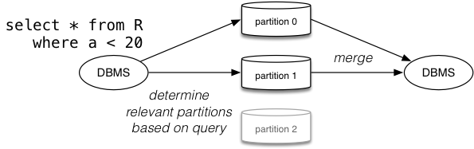

Parallel sorting

- scan in parallel, range-partition during scan
- pipeline into local sort on each processor
- merge sorted partitions

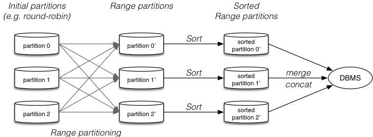
Potential problem:

- data skew because of unfortunate choice of partition points
- resolve by initial data sampling to determine partitions


Parallel nested loop join

- each outer tuple needs to examine each inner tuple
- but only if it could potentially join
- range/hash partitioning reduce partitions to consider


Parallel sort-merge join

- as noted above, parallel sort gives range partitioning
- merging partitioned tables has no parallelism (but is fast)


Parallel hash join

- distribute partitions to different processors
- partition 0 of R goes to same node as partition 0 of S
- join phase can be done in parallel on each processor
- then results need to be merged
- very effective for equijoin

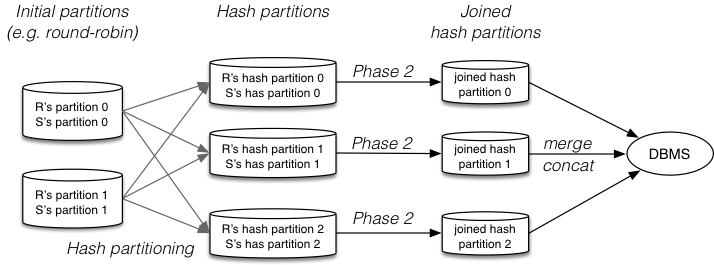

Fragment-and-replicate join

- outer relation R is partitioned (using any partition scheme)
- inner relation S is copied to all nodes
- each node computes join with R partition and S


PostgreSQL and Parallelism

PostgreSQL assumes

- shared memory space accessable to all back-ends
- files for one table are located on one disk

PostgreSQL allows

- data to be distributed across multiple disk devices

So could run on ...

- shared-memory, shared-disk architectures
- hierarchical architectures with distributed virtual memory

PostgreSQL can provide

- multiple servers running on separate nodes
- application #1: high availability
    - "standby" server takes over if primary server fails
- application #2: load balancing
    - several servers can be used to provide same data
    - direct queries to least loaded server

Both need data synchronisation between servers

PostgreSQL uses notion of master and slave servers.

High availability ...

updates occur on master, recorded in tx log

tx logs shipped/streamed from master to slave(s)

slave uses tx logs to maintain current state

configuration controls frequency of log shipping

bringing slave up-to-date is "fast" (~1-2secs)

Note: small window exists for data loss (committed tx log records not sent)

Load balancing ...

- not provided built-in to PostgreSQL, 3rd-party tools exist