# RPC笔记

## RPC原理

**RPC（Remote Procedure Call）远程过程调用**：帮助用户**屏蔽网络细节 使调用远程计算机的服务像调用本地一样**

### 通信流程

- **服务调用(消费)方：发起调用请求的一方**
- **服务提供方：被调用的一方**

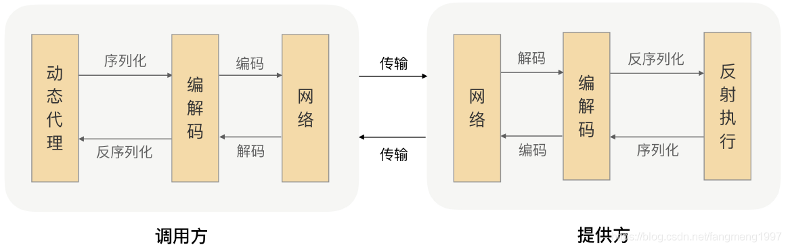

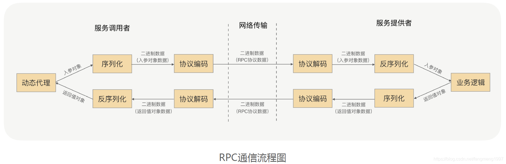


1. **动态代理**
    1. **服务提供者**给出**业务接口声明**
    2. **调用方程序**
        1. **RPC 框架根据调用的服务接口提前生成动态代理实现类**
            1. **拦截所有的方法调用**
            2. 在**提供的方法处理逻辑里**面完成一整套的**远程调用**
            3. 把**远程调用结果返回给调用方**
            4. 调用方在**调用远程方法的时候就获得了像调用本地接口一样的体验**
        2. 通过**依赖注入**等技术注入到**声明了该接口的相关业务逻辑**
2. **消费方请求**：服务消费方调用以**本地调用方式调用服务**
3. **消费方编码/序列化**：`client stub`接收到调用后负责将方法、参数等**按照协议组装**成**能进行网络传输的消息体**
4. **消费方发送**：**`client stub`找到服务地址，并将消息发送**到服务端
5. **提供方接收+解码/反序列化**：**`server stub`收到消息后进行解码和反系列化**
6. **提供方调用API**：`server stub`**根据解码结果调用本地的服务**
7. **提供方返回结果**：**本地服务执行并将结果返回**给`server stub`
8. **提供方编码/序列化+发送**：`server stub`将**返回结果打包成消息并发送至消费方**
9. **消费方接受+解码/反序列化**：`client stub`接收到消息，并进行解码
10. **消费方接收结果**：服务消费方得到最终结果

## 架构设计

### 微服务化

- 帮助**解决系统拆分后的通信问题**
- 能让用户**像调用本地一样调用远程方法**
- 将**应用架构从“单体”演进成“微服务化”**
    - **解决实际开发**过程中的**效率低下、系统耦合**等问题
    - 系统架构整体**清晰、健壮，应用可运维度增强**
- RPC应用的其他场景：**MQ、分布式缓存、数据库**等
    - 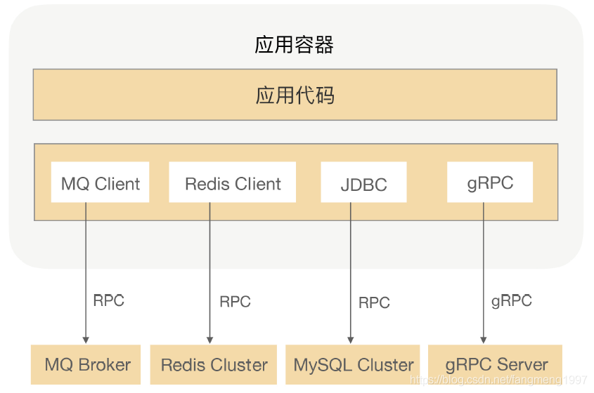
    - **RPC调用**
        - 使用了 MQ 来处理异步流程
        - Redis 缓存热点数据
        - MySQL 持久化数据
        - 在系统中调用另外一个业务系统的接口
    - **MQ、MySQL 持久化的数据**会存在于一个**分布式文件系统**中，通过**RPC来完成数据交互**

### 微内核架构

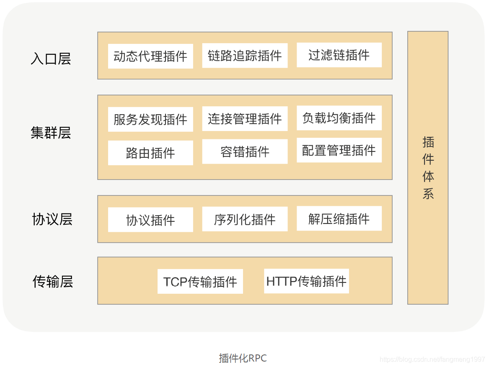

1. **核心功能体系**
    1. **传输模块**
        1. **收发二进制数据**
        2. **屏蔽网络传输复杂性**
        3. **可靠性（TCP协议）**
    2. **协议模块**
        1. **序列化**：入参对象->二进制数据
        2. **协议封装**：在二进制数据后面加入数据分割指示语义
        3. **解压缩**：对**大型二进制数据**进行无损解压缩保证数据完整性/方便传输
    3. **集群模块**
        1. **服务发现：帮助调用方找到所有的服务提供方**(维护接口/服务提供方关系)
        2. **连接管理：维护TCP连接状态**
        3. **负载均衡**
        4. 路由
        5. 容错
        6. **配置管理：管理服务治理功能**
    4. **入口(Bootstrap)模块**
        1. **动态代理**：利用接口的依赖注入**屏蔽粘合底层传输/协议模块的代码细节**
        2. 链路追踪
        3. 过滤链
2. **插件体系**
    1. 将**每个功能点抽象为接口作为插件契约** 将功能接口和功能实现分离 并提供接口默认实现
    2. **可扩展性高** 实现开闭原则
    3. 保持核心功能体系精简

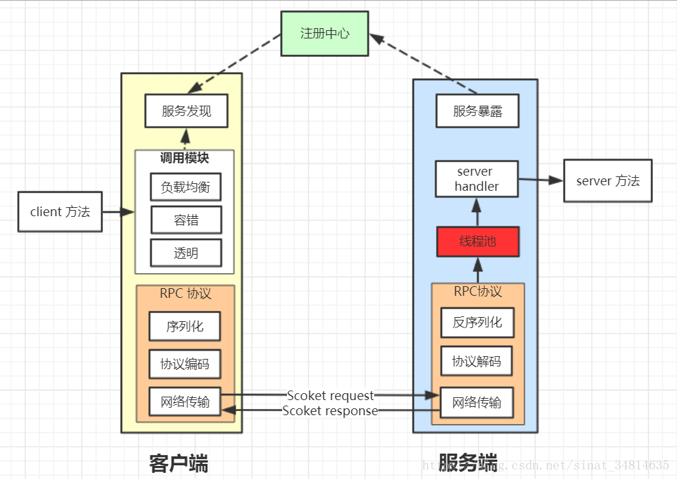

### 层次关系

**protocol > transport > codec > serialize**

1. **protocol 层**主要用于**配置 refer（发现服务） 和 exporter（暴露服务） 的实现方式**
2. **transport 层**定义了**传输方式**
3. **codec 层**诠释了具体传输过程中**报文解析的方式**
4. **serialize 层**负责将**对象转换成字节**以用于传输
5. **proxy 层**负责将这些**细节屏蔽**

## 协议

### 协议作用

**只有二进制能在网络中传输->发送到网络前需要将RPC请求转成二进制->写入本地Socket->被网卡发送到网络设备中**

**为避免二进制转换时语义不一致导致的问题 需要在发送请求时设定边界并在接受请求时按照边界分割数据->边界语义(协议)**

### 设计RPC协议

**RPC协议是应用层协议** 负责**应用间的通信 性能要求高且请求不定长** 需要设计比HTTP**紧凑的可扩展私有协议**满足需求

- **协议头固定部分**
    - Bit Offset
    - 魔术位--判断版本
    - **整体长度--三部分总和**
    - **头长度--协议头部分**
    - 协议版本
    - 消息类型
    - **序列化方式**
    - 消息ID
- **协议头扩展部分（扩展字段）**
- 协议体（Payload）

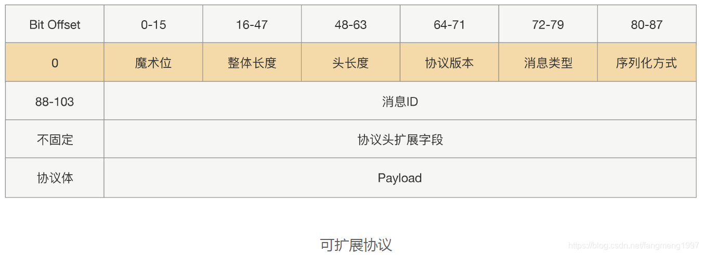

### Dubbo协议

| 协议名称       | 简介                                                         | 优点                                                         | 缺点                     | 适用场景                                            |
| -------------- | ------------------------------------------------------------ | ------------------------------------------------------------ | ------------------------ | --------------------------------------------------- |
| dubbo://       | Dubbo 缺省协议采用单一长连接和 NIO 异步通讯                  | 适合于小数据量高并发的服务调用服务<br />消费者机器数远大于服务提供者机器数 | 不适合传送大数据量的服务 | 常规远程服务方法调用                                |
| rmi://         | RMI 协议采用 JDK 标准的 `java.rmi.*` 实现，采用阻塞式短连接和 JDK 标准序列化方式 |                                                              |                          | 常规远程服务方法调用<br />与原生RMI服务互操作       |
| hessian://     | Hessian 协议用于集成 Hessian 服务做远程通信                  |                                                              |                          | 页面传输<br />文件传输<br />与原生hessian服务互操作 |
| http://        | 基于 HTTP 表单的远程调用协议，采用 Spring 的 HttpInvoker 实现 |                                                              |                          | 需同时给应用程序和浏览器 JS 使用的服务              |
| webserivice:// | 基于 WebService 的远程调用协议，基于 Apache CXF 的 `frontend-simple` 和 `transports-http` 实现<br />可以和原生 WebService 服务互操作 |                                                              |                          | 系统集成<br />跨语言调用                            |
| thrift://      | 对 thrift 原生协议的扩展                                     |                                                              |                          |                                                     |
| memcached://   | 基于 memcached 实现的 RPC 协议                               |                                                              |                          |                                                     |
| redis://       | 基于 Redis 实现的 RPC 协议                                   |                                                              |                          |                                                     |
| rest://        | JAX-RS 是标准的 Java REST API                                | 没有 vendor lock-in 问题                                     |                          | 跨语言调用                                          |
| jsonrpc://     | JSON-RPC 2.0 规范 和 JAX-RS 一样，也是一个规范，JAVA 对其的支持可参考 jsonrpc4j |                                                              |                          | 跨语言调用                                          |

#### Why HTTP

在互联网快速迭代的大潮下产生了**大量的跨语言的调用需求**

**http、json是天然合适作为跨语言的标准**，各种语言都有成熟的类库

#### Why Not RESTful

REST 架构和 dubbo 原有的 RPC 架构有区别

REST 架构需要有资源 (Resources) 的定义 **更合适互联网系统之间的调用**

**RPC 更合适一个系统内的调用**， 所以我们使用了**和 Dubbo 理念较为一致的 JsonRPC**

### Motan协议

| 协议名称        | 简介                                                         | 适用场景                                  |
| --------------- | ------------------------------------------------------------ | ----------------------------------------- |
| motan://        | motan 协议之于 motan，地位等同于 dubbo 协议之于 dubbo<br />各自默认的且都是自定义的协议<br />内部使用 netty 进行通信<br />默认使用 hessian 作为序列化器 | 常规远程服务方法调用                      |
| injvm://        | jvm内部调用，不经过本地网络，一般在服务化拆分时，作为过渡方案使用 | Provider 和 Consumer <br />位于同一个 jvm |
| grpc://和yar:// | 诞生缘起于一定的历史遗留问题 为解决跨语言问题，这两个协议进而出现 | 较为局限的跨语言调用                      |
| restful://      | 主要实现的是 java 对 restful 指定的规范，即 javax.ws.rs 包下的类 | 跨语言调用                                |
| motan2://       | motan2 把请求的一些元数据作为单独的部分传输，更适合不同语言解析 | 跨语言调用                                |

## 序列化

### 序列化简介

**因为网络传输的数据必须是二进制数据，所以在 RPC 调用中，对入参对象与返回值对象进行序列化与反序列化是一个必须的过程**

#### **序列化**

**将对象转换成二进制数据的过程**

- **调用方请求的出入参数都是对象**（**不能直接在网络中传输**）
- 需要**提前把对象转成可传输的二进制**且**转换算法是可逆的**

#### **反序列化**

**反过来将二进制转换为对象的过程**

- **服务提供方**可以**正确地从二进制数据中分割出不同的请求**
- 根据请求类型和序列化类型，把**二进制的消息体逆向还原成请求对象**

#### **图析**

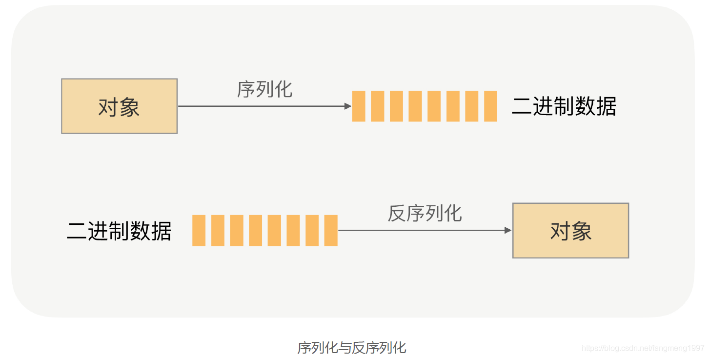

### 序列化框架

#### 核心思想

- **设计一种序列化协议**
- **完成序列化**：将对象的类型、属性类型、属性值**按照固定的格式写到二进制字节流中**
- **完成反序列化**：按照**固定的格式读出**对象的类型、属性类型、属性值并通过这些信息**重新创建出一个新的对象**

#### JDK原生序列化

```java
public class Main {
    public static void main(String[] args) throws Exception {
        Student honne = new Student("honne");
        // 序列化具体实现由 ObjectOutputStream 完成
        ObjectOutputStream oos = new ObjectOutputStream(new FileOutputStream("student.txt"));
        oos.writeObject(honne);
        oos.close();
        // 反序列化具体实现是由 ObjectInputStream 完成
        ObjectInputStream ois = new ObjectInputStream(new FileInputStream("student.txt"));
        Student student = (Student) ois.readObject();
        ois.close();
        assert "honne".equals(student.getName());
        // 输出结果 Student(name=honne)
        System.out.println(student);    
    }
}
@Data
@AllArgsConstructor
class Student implements Serializable{
    private String name;
}

```

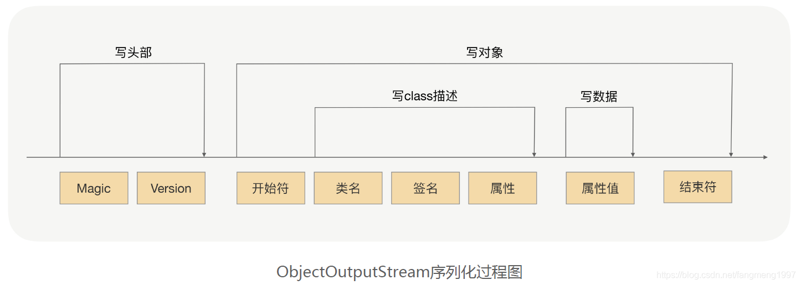

**JDK序列化过程：在读取对象数据的时候，不断加入一些特殊分隔符 这些特殊分隔符用于在反序列化过程中截断用**

- **头部数据**用来声明序列化协议/版本 用于**高低版本向后兼容**
- **对象数据**主要包括类名、签名、属性名、属性类型及属性值，还有开头结尾等数据
    - **属性值属于真正的对象值**
    - **其他都是**为了反序列化用的**元数据**
- **存在对象引用、继承**的情况下，就是**递归遍历“写对象”**逻辑

#### Kryo

##### 快速入门

```java
public class Sample {
    public static void main(String[] args) throws Exception{
        Kryo kryo = new Kryo();
        kryo.register(Student.class);
        Student honne = new Student("honne");
        // 序列化
        Output output = new Output(new FileOutputStream("student_kryo.txt"));
        kryo.writeObject(output, honne);
        output.close();

        // 反序列化
        Input input = new Input(new FileInputStream("student_kryo.txt"));
        Student student = kryo.readObject(input, Student.class);
        input.close();
        assert "honne".equals(student.getName());
        // 输出结果 Student(name=honne)
        System.out.println(student);
    }
}

@Data
@AllArgsConstructor
@NoArgsConstructor
class Student implements Serializable {
    private String name;
}
```

##### 读写方式

1. ```java
    // 知道class字节码且对象不为空
    kryo.writeObject(output, someObject);
    // ...
    SomeClass someObject = kryo.readObject(input, SomeClass.class);
    ```

2. ```java
    // 知道class字节码且对象可为空
    kryo.writeObjectOrNull(output, someObject);
    // ...
    SomeClass someObject = kryo.readObjectOrNull(input, SomeClass.class);
    ```

3. ```java
    // 字节码未知且对象可为空
    // 将字节码信息直接放到序列化结果中(牺牲一些空间性能)然后用反序列化读取
    // RPC调用中序列化/反序列化在不同端点 适用该方法
    kryo.writeClassAndObject(output, object);
    // ...
    Object object = kryo.readClassAndObject(input);
    if (object instanceof SomeClass) {
    // ...
    }
    ```

##### 注意事项

- **不支持Bean中增删字段**
- **反射创建类序列化的支持不同**
- **不支持不包含无参构造器类的反序列化**

##### 常用工具类

- <1> Kryo的Input和Output接收一个InputStream和OutputStream
    - **Kryo通常完成字节数组和对象的转换**
    - 常用的输入输出流实现为**ByteArrayInputStream/ByteArrayOutputStream**
- <2> **writeClassAndObject和readClassAndObject**配对使用在**分布式**场景下是最常见的
    - **序列化时将字节码存入序列化结果中**
    - **可以在反序列化时不必要传入字节码信息**
- <3> 使用**ThreadLocal维护Kryo实例**，**减少了每次使用都实例化一次Kryo的开销**又可以保证其**线程安全**

```java
public class KryoSerializer implements Serialization {
  public byte[] serialize(Object obj) {
    Kryo kryo = kryoLocal.get();
    ByteArrayOutputStream byteArrayOutputStream = new ByteArrayOutputStream();
    Output output = new Output(byteArrayOutputStream);//<1>
    kryo.writeClassAndObject(output, obj);//<2>
    output.close();
    return byteArrayOutputStream.toByteArray();
  }
  
  public <T> T deserialize(byte[] bytes, Class<T> clz) {
    Kryo kryo = kryoLocal.get();
    ByteArrayInputStream byteArrayInputStream = new ByteArrayInputStream(bytes);
    Input input = new Input(byteArrayInputStream);// <1>
    input.close();
    return (T) kryo.readClassAndObject(input, clz);//<2>
  }
	
  private static final ThreadLocal<Kryo> kryoLocal = new ThreadLocal<Kryo>() {//<3>
    @Override
    protected Kryo initialValue() {
      Kryo kryo = new Kryo();
      // setReferences支持循环引用开关
      // 默认为true 可关闭提高性能(不推荐)
      kryo.setReferences(true);
      // setRegistrationRequired支持注册行为开关
      // 默认为false
      // 开启注册功能会导致分布式序列化产生问题(同一机器重启/不同机器可能发生注册乱序)
      kryo.setRegistrationRequired(false);
      return kryo;
    }
  };
}
```

#### Hessian

```java
public interface Serialization {   
  byte[] serialize(Object obj) throws IOException;   
  <T> T deserialize(byte[] bytes, Class<T> clz) throws IOException;
}
```

```java
public class Hessian2Serialization implements Serialization {
  @Override
  public byte[] serialize(Object data) throws IOException {
    ByteArrayOutputStream bos = new ByteArrayOutputStream();
    Hessian2Output out = new Hessian2Output(bos);
    out.writeObject(data);
    out.flush();
    return bos.toByteArray();
  }
  
  @Override
  public <T> T deserialize(byte[] bytes, Class<T> clz) throws IOException {
    Hessian2Input input = new Hessian2Input(new ByteArrayInputStream(bytes));
    return (T) input.readObject(clz);
  }
}
```

#### Protostaff

- <1> 使用 Protostuff 的一个坑点在于其反序列化时**需用户自己实例化序列化后的对象**，所以才有了 `T message=objenesis.newInstance(clz);` 这行代码。使用 objenesis 工具实例化一个需要的对象，而后使用 `ProtostuffIOUtil` 完成赋值操作。
- <2> 上述的 `objenesis.newInstance(clz)` 可以由 `clz.newInstance()` 代替，后者也可以实例化一个对象，但如果对象缺少无参构造函数，则会报错。**借助于 `objenesis` 可以绕开无参构造器实例化一个对象，且性能优于直接反射创建**。所以一般在选择 Protostuff 作为序列化器时，一般配合 objenesis 使用

```java
public class ProtostuffSerialization implements Serialization {
  @Override
  public byte[] serialize(Object obj) throws IOException {
    Class clz = obj.getClass();
    LinkedBuffer buffer = LinkedBuffer.allocate(LinkedBuffer.DEFAULT_BUFFER_SIZE);
    try {
      Schema schema = RuntimeSchema.createFrom(clz);
      return ProtostuffIOUtil.toByteArray(obj, schema, buffer);
    } catch (Exception e) {
      throw e;
    } finally {
      buffer.clear();
    }
  }
  
  @Override
  public <T> T deserialize(byte[] bytes, Class<T> clz) throws IOException {
    T message = objenesis.newInstance(clz); // <1>
    Schema<T> schema = RuntimeSchema.createFrom(clz);
    ProtostuffIOUtil.mergeFrom(bytes, message, schema);
    return message;
  }
  
  private Objenesis objenesis = new ObjenesisStd(); // <2>

}
```

#### fastjson

**<1> JSON序列化注意对枚举类型的特殊处理；额外补充类名可以在反序列化时获得更丰富的信息**

```java
public class FastJsonSerialization implements Serialization {
  static final String charsetName = "UTF-8";
  
  @Override
  public byte[] serialize(Object data) throws IOException {
    SerializeWriter out = new SerializeWriter();
    JSONSerializer serializer = new JSONSerializer(out);
    serializer.config(SerializerFeature.WriteEnumUsingToString, true);//<1>
    serializer.config(SerializerFeature.WriteClassName, true);//<1>
    serializer.write(data);
    return out.toBytes(charsetName);
  } 
  
  @Override
  public <T> T deserialize(byte[] data, Class<T> clz) throws IOException {
    return JSON.parseObject(new String(data), clz);
  }
}
```

### RPC序列化选择

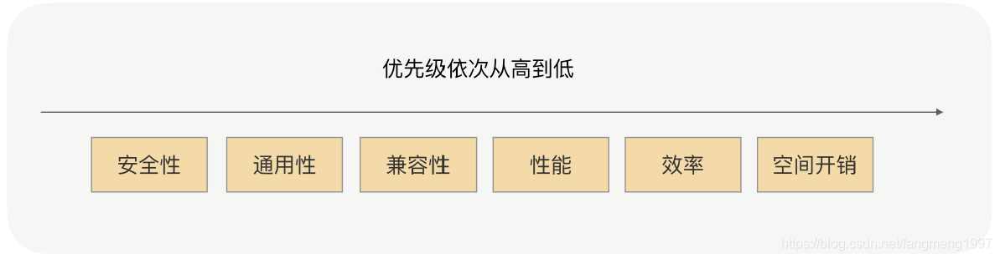

- **Kryo**
    - **专为 JAVA 定制**的序列化协议
    - **序列化后字节数少，利于网络传输**
    - 但**不支持跨语言**（或支持的代价比较大）
    - dubbox 扩展中支持了 kryo 序列化协议
- **Hessian**
    - **支持跨语言，序列化后字节数适中，API 易用**
    - 是**国内主流 rpc 框架**：**dubbo，motan 的默认序列化协议**
- **Protostuff**
    - **Protobuf**
        - **grpc框架**便是使用protobuf作为序列化协议
        - **语言无关 平台无关**
        - 复杂性：需要使用**特定的语法编写 `.prpto` 文件**，然后静态编译
    - **Protostuff**：实际是**对 protobuf 的扩展**
        - protostuff-runtime 模块继承了protobuf 性能，且**不需要预编译文件但失去了跨语言的特性**
        - JAVA 序列化框架，其**性能略优于 Hessian**
        - tip ：**protostuff 反序列化时需用户自己初始化序列化后的对象**，其只负责将该对象进行赋值
- **Fastjson**：**motan** RPC 框架支持了 fastjson 的序列化 可以将其作为一个**跨语言序列化的简易实现方案**

### RPC序列化注意事项

- **对象需要尽量简单：避免多层嵌套/关联/依赖**(序列化时易出现问题/浪费性能)
- **对象体积不宜过大：防止入参对象过大导致RPC请求超时**
- **避免使用序列化框架不支持的类作为入参类：尽量使用原生/常用类**
- **避免对象有复杂的继承关系**：有父子类的情况下**序列化过程会一直寻找父类遍历属性** 浪费性能

## 动态代理

动态代理以**面向接口编程**的方式**帮助用户屏蔽RPC调用细节** 

### 远程调用流程

1. **RPC 会自动给接口生成一个代理类**
2. 用户在项目中**注入接口时 运行过程中实际绑定的是这个接口生成的代理类**
3. 在**接口方法被调用时实际上是被生成代理类拦截**了
4. 在**生成的代理类里面，加入远程调用逻辑**
5. **帮用户屏蔽远程调用的细节** 实现**像调用本地一样地调用远程**的体验

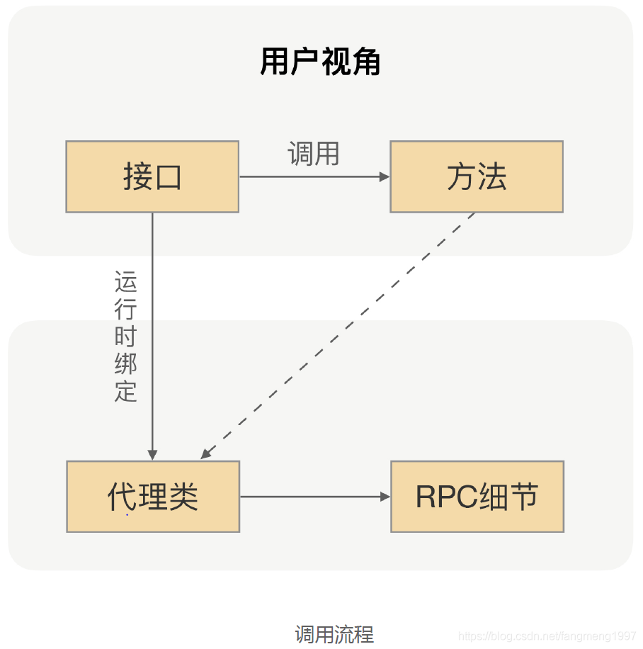

### 实现原理

示例：

1. **给Hello接口生成JDKProxy动态代理类** 
2. **调用Hello::say(实际上被转发到JDKProxy::invoke) **
3. **返回值是RealHello::invoke里的值**

```java
/**
* 要代理的接口
*/
public interface Hello {
	String say();
}

/**
* 真实调用对象
*/
public class RealHello {
	public String invoke(){
		return "i'm proxy";
	}
}

/**
* JDK代理类生成
*/
public class JDKProxy implements InvocationHandler {
	private Object target;
	JDKProxy(Object target) {
		this.target = target;
	}
	@Override
	public Object invoke(Object proxy, Method method, Object[] paramValues) {
		return ((RealHello)target).invoke();
	}
}

/**
* 测试例子
*/
public class TestProxy {
	public static void main(String[] args){
		// 构建代理器
		JDKProxy proxy = new JDKProxy(new RealHello());
		ClassLoader classLoader = ClassLoaderUtils.getCurrentClassLoader();
		// 把生成的代理类保存到文件
		System.setProperty("sun.misc.ProxyGenerator.saveGeneratedFiles","true");
		// 生成代理类
		Hello test = (Hello) Proxy.newProxyInstance(classLoader, new Class[]{Hello.class});
		// 方法调用
		System.out.println(test.say());
	}
}

```

**`Proxy.newProxyInstance`动态代理类类生成流程**

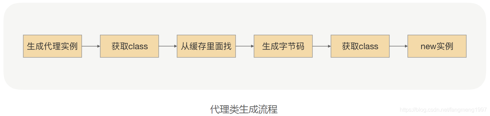

### 反射调用

RPC 框架在 **Provider 服务端需要根据客户端传递来的 className + method + param 来找到容器中的实际方法执行反射调用**

反射调用可以**加速执行**

#### JDK反射调用

```java
Method method = serviceClass.getMethod(methodName, new Class[]{});
method.invoke(delegate, new Object[]{});
```

#### Cglib调用

```java
FastClass serviceFastClass = FastClass.create(serviceClass);
FastMethod serviceFastMethod = serviceFastClass.getMethod(methodName, new Class[]{});
serviceFastMethod.invoke(delegate, new Object[]{});
```

### 技术选型

#### 统一接口

```java
public interface BookApi {
	void sell();
}
```

**在真正的 RPC 调用中 ，需要填充‘整理报文’，‘确认网络位置’，‘序列化’,'网络传输'，‘反序列化’，'返回结果'等逻辑****

#### jdk

```java
private static BookApi createJdkDynamicProxy(final BookApi delegate) {
  BookApi jdkProxy = (BookApi) Proxy.newProxyInstance(
    ClassLoader.getSystemClassLoader(), 
    new Class[]{BookApi.class}, 
    new JdkHandler(delegate)
  );
  return jdkProxy;
}

private static class JdkHandler implements InvocationHandler {
  final Object delegate;
  JdkHandler(Object delegate) {
    this.delegate = delegate;
  }
  
  @Override
  public Object invoke(Object object, Method method, Object[] objects) throws Throwable {
    //添加代理逻辑
    if(method.getName().equals("sell")){
      System.out.print("");
    }
    return method.invoke(delegate, objects);

}
```

#### javassist

```java
private static BookApi createJavassistBytecodeDynamicProxy() throws Exception {
  ClassPool mPool = new ClassPool(true);
  CtClass mCtc = mPool.makeClass(BookApi.class.getName() + "JavaassistProxy");
  mCtc.addInterface(mPool.get(BookApi.class.getName()));
  mCtc.addConstructor(CtNewConstructor.defaultConstructor(mCtc));
  mCtc.addMethod(CtNewMethod.make("public void sell() { System.out.print(\"\") ; }", mCtc));
  Class<?> pc = mCtc.toClass();
  BookApi bytecodeProxy = (BookApi) pc.newInstance();
  return bytecodeProxy;
}
```

#### cglib

```java
private static BookApi createCglibDynamicProxy(final BookApi delegate) throws Exception {
  Enhancer enhancer = new Enhancer();
  enhancer.setCallback(new CglibInterceptor(delegate));
  enhancer.setInterfaces(new Class[]{BookApi.class});
  BookApi cglibProxy = (BookApi) enhancer.create();
  return cglibProxy;
}

private static class CglibInterceptor implements MethodInterceptor {
  final Object delegate;
  CglibInterceptor(Object delegate) {
    this.delegate = delegate;
  }
  
  @Override
  public Object intercept(Object object, Method method, Object[] objects, MethodProxy methodProxy) throws Throwable {
    //添加代理逻辑
    if(method.getName().equals("sell")) {
      System.out.print("");
    }
    return methodProxy.invoke(delegate, objects);
  }
}
```

#### 影响因素

##### 性能

**javassist ≈ cglib > jdk**

##### 依赖

**jdk > javassist ≈ cglib**

##### 易用性

**jdk > cglib > javassist**

## 服务注册/发现

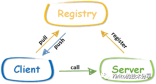

- **注册中心**：用于**服务端注册**远程服务以及**客户端发现**服务
- **服务端**：对外提供后台服务，**将自己的服务信息注册到注册中心**
- **客户端**：**从注册中心获取远程服务的注册信息**，然后进行远程过程调用

### 注册中心抽象

**提供一个存储介质 供服务提供者/消费者共同连接** 这里的存储信息是URL

#### Motan服务注册接口

```java
public interface RegistryService {

  //1. 向注册中心注册服务 最常用
  void register(URL url);

  //2. 从注册中心摘除服务
  void unregister(URL url);

  //3. 将服务设置为可用，供客户端调用
  void available(URL url);

  //4. 禁用服务，客户端无法发现该服务
  void unavailable(URL url);

  //5. 获取已注册服务的集合
  Collection<URL> getRegisteredServiceUrls();

}
```

#### Motan服务发现接口

```java
public interface DiscoveryService {

  //1. 订阅服务
  void subscribe(URL url, NotifyListener listener);

  //2. 取消订阅
  void unsubscribe(URL url, NotifyListener listener);

  //3. 发现服务列表 最常用
  List<URL> discover(URL url); 

}
```

#### URL类

```java
public class URL {
	// 协议名称
  private String protocol;
	private String host;
  private int port;
  // interfaceName 代表路径
  private String path;
  private Map<String, String> parameters;
  private volatile transient Map<String, Number> numbers;
}
```

### 注册信息

以zookeeper为例

#### Server节点

由服务提供者创建 供服务消费者获取节点信息以定位服务提供者真正网络拓扑位置

```shell
motan://192.168.150.1:6666/com.sinosoft.student.api.DemoApi?serialization=hessian2&protocol=motan&isDefault=true&maxContentLength=1548576&shareChannel=true&refreshTimestamp=1515122649835&id=motanServerBasicConfig&nodeType=service&export=motan:6666&requestTimeout=9000000&accessLog=false&group=demo_group
```

- motan:// 对应使用协议前缀(Motan协议)
- serialization 对应序列化方式
- protocol 对应协议名称
- maxContentLength 对应 RPC 传输中数据报文的最大长度
- shareChannel 是传输层用到的参数
- netty channel 中的一个属性
- group 对应分组名称

#### Client 节点

```shell
motan://192.168.150.1:0/com.sinosoft.student.api.DemoApi?singleton=true&maxContentLength=1548576&check=false&nodeType=service&version=1.0&throwException=true&accessLog=false&serialization=hessian2&retries=0&protocol=motan&isDefault=true&refreshTimestamp=1515122631758&id=motanClientBasicConfig&requestTimeout=9000&group=demo_group
```

- 与Server节点属性相同不赘述
- singleton 代表服务是否单例
- check 检查服务提供者是否存在
- retries 代表重试次数

#### UnavailableServer 节点

unavailableServer 节点**不是必须存在**的一个节点 主要用来**做 server 端的延迟上线和优雅关机**

- **延迟上线**
    - 一般**推荐的服务端启动流程**为
        - **server 向注册中心的 unavailableServer 注册**，状态为 unavailable
        - 此时整个服务**处于启动状态，但不对外提供服务**
        - 在**服务验证通过**，预热完毕，**打开心跳开关，正式提供服务**
- **优雅关机**
    - 当需要**对 server 方进行维护升级**时，如果**直接关闭会影响到客户端的请求**
    - 理想的情况应当是**首先切断流量，再进行 server 的下线**
    - 具体的做法便是：**先关闭心跳开关，客户端感知停止调用后，再关闭服务进程**

### 感知服务下线

#### 临时节点+长连接

- 节点分类
    - **持久化节点一经创建，只要不主动删除，便会一直持久化存在**
    - **临时节点的生命周期则是和客户端的连接同生共死**的
- 临时节点+长连接**实现**
    - **应用连接到 zookeeper 时创建一个临时节点**
    - **使用长连接维持会话**
    - **无论何种方式服务发生下线，zookeeper 都可以感知到，进而删除临时节点**

#### 主动下线+心跳检测

**对服务提供者进行心跳检测 N次心跳结果没有返回值时将服务主动下线**

### 注册中心对比

| 特性                 | Consul                 | zookeeper             | etcd              | euerka                       |
| :------------------- | :--------------------- | :-------------------- | :---------------- | :--------------------------- |
| **服务健康检查**     | 服务状态，内存，硬盘等 | (弱)长连接，keepalive | 连接心跳          | 可配支持                     |
| **多数据中心**       | 支持                   | —                     | —                 | —                            |
| **kv存储服务**       | 支持                   | 支持                  | 支持              | —                            |
| **一致性**           | raft                   | paxos                 | raft              | —                            |
| **cap**              | ca                     | cp                    | cp                | ap                           |
| **使用接口**         | 支持http和dns          | 客户端                | http/grpc         | http                         |
| **watch支持**        | 全量/支持long polling  | 支持                  | 支持 long polling | 支持 long polling/大部分增量 |
| **自身监控**         | metrics                | —                     | metrics           | metrics                      |
| **安全**             | acl /https             | acl                   | https支持         | —                            |
| **spring cloud集成** | 已支持                 | 已支持                | 已支持            | 已支持                       |

## 集群

### 概述

Cluster顶层接口

```java
@Spi(scope = Scope.PROTOTYPE)
public interface Cluster<T> extends Caller<T> {
  @Override
  void init();
  void setUrl(URL url);
  void setLoadBalance(LoadBalance<T> loadBalance);//<1>指定负载均衡算法
  void setHaStrategy(HaStrategy<T> haStrategy);//<2>指定高可用策略（容错机制）
  void onRefresh(List<Referer<T>> referers);
  List<Referer<T>> getReferers();
  LoadBalance<T> getLoadBalance();
}
```

### 负载均衡

- 服务端负载均衡
    - 软件负载均衡(nginx)
    - 硬件负载均衡
- **客户端负载均衡(RPC调用)**
    - **客户端通过配置持有所有的服务端节点引用**
    - **自行通过负载均衡算法选择一个节点进行访问**

#### 负载均衡接口

负载均衡策略：**根据请求返回一个服务节点**

##### Motan

对服务端的点对点调用抽象成了 Referer

```java
@Spi(scope = Scope.PROTOTYPE)
public interface LoadBalance<T> {
  void onRefresh(List<Referer<T>> referers);
  Referer<T> select(Request request);//<1>
  void selectToHolder(Request request, List<Referer<T>> refersHolder);
  void setWeightString(String weightString);
}
```

##### ribbon

对服务端的点对点调用抽象成了Server

```java
public interface IRule{
  public Server choose(Object key);//<1>
  public void setLoadBalancer(ILoadBalancer lb);
  public ILoadBalancer getLoadBalancer();
}
```

#### 负载均衡算法

1. **轮询（Round Robin）**
2. 加权轮询（Weight Round Robin）
3. **随机（Random）**
4. 加权随机（Weight Random）
5. 源地址哈希（Hash）
6. 一致性哈希（ConsistentHash）
7. 最小连接数（Least Connections）
8. 低并发优先（Active Weight）

### 高可用

#### 高可用策略

##### 失效转移（failover）

- **当出现失败，重试其他服务器**
- 通常用于读操作等**幂等行为**，**重试会带来更长延迟**
- 会**受到负载均衡算法的限制**（一致性 Hash 这类负载均衡算法便会与其存在冲突）

##### 快速失败（failfast）

- **只发起一次调用，失败立即报错**
- 通常用于**非幂等性**的写操作
- 在 motan，dubbo 等配置中设置了重试次数>0+配置了该高可用策略则重试效果也不会生效

##### 失效安全（failsafe）

**出现异常时忽略 但记录这一次失败在日志中**

##### 失效自动恢复（failback）

- **后台记录失败请求，定时重发**
- **通常用于消息通知操作**

##### 并行调用（forking）

- **只要一个成功即返回**
- **通常用于实时性要求较高的读操作**
- **需要牺牲一定的服务资源**

##### 广播（broadcast）

- **广播调用，所有提供逐个调用，任意一台报错则报错**
- **通常用于更新提供方本地状态**
- **速度慢**

### 健康检测

RPC框架在集群中需要保证**调用方实时感知到节点的状态变化**

#### 逻辑

**心跳检测**服务提供方状态

1. **健康状态<->亚健康状态->死亡状态->健康状态**
2. **健康状态：建立连接成功，并且心跳探活也一直成功**
3. **亚健康状态：建立连接成功，但是心跳请求连续失败**
4. **死亡状态：建立连接失败**

#### 实现

- **可用率**
    - **某一个时间窗口内接口调用成功次数的百分比（成功次数 / 总调用次数）**
    - **可用率低于某个比例就认为这个节点存在问题->亚健康列表**
    - **考虑了高低频的调用接口+兼顾接口响应时间不同**
- **心跳机制+分布式检测程序**

## RPC项目

### 架构

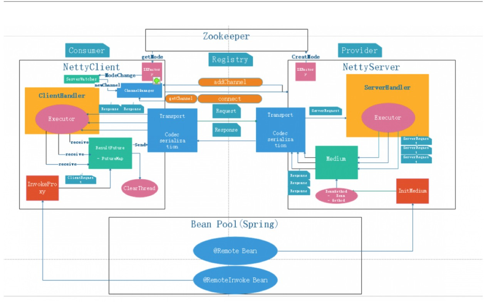

### 基于Netty进⾏RPC⽹络通信的选型

#### Netty优点

Netty是业界最流行的**NIO框架**之一 其**健壮性、功能、性能、可定制性、可扩展性**首屈一指

- **API使用简单** 开发门槛低
- 功能强大 **预置多种编解码功能 支持多种主流协议**
- **定制能力强** 通过**ChannelHandler**对通信框架灵活扩展
- **综合性能**较其他NIO框架**最优**
- 稳定 **修复已知所有NIO BUG**
- 社区活跃 **版本迭代周期短**
- 经历大规模**商业应用考验** 质量得到验证

#### Netty高性能

1. **异步非阻塞通信** 解决传统同步阻塞I/O模式中一个服务端不能平滑接收线性增长客户端的问题
2. **高效Reactor线程模型**
    1. Netty服务器采用Reactor**主从线程模型**(两个NioEventLoopGroup)
    2. **主**Reactor线程池(**bossGroup**)
        1. **处理客户端连接请求**
        2. **初始化NioSocketChannel参数**
        3. **链路变更时通知ChannelPipeline**
    3. **从**Reactor线程池(**workerGroup**)
        1. **处理I/O操作**
        2. **异步读取/发送消息**
        3. **执行定时任务/系统调用**
3. **TCP连接的接收/发送缓冲区使用直接内存** 避免内存复制 提升I/O性能
4. **内存池循环利用ByteBuf(缓冲区)** 避免频繁创建/销毁ByteBuf带来的性能损耗
5. **可定制的调优参数**(I/O线程数、TCP灵活调参)
6. **环形数组缓冲区实现无锁化并发**
7. **单线程串行化处理关键资源** 避免并发锁竞争/CPU消耗
    1. 用户不切换线程时默认**一直由bossGroup调用ChannelHandler**
8. **高性能序列化**框架
9. **Netty零拷贝**
    1. **读写socket的零拷贝**
        1. Netty**默认使用Direct Buffer**来接收/发送ByteBuffer
        2. **ByteBuffer使用堆外直接内存进行socket读写** **不需要进行字节缓冲区的二次拷贝**
        3. 如果使用**传统的堆内存**进行socket读写
            1. **JVM会将堆内存Buffer拷贝到直接内存**
            2. 然后再写入socket中
            3. 消息发送过程**多一次缓冲区内存拷贝**
    2. **文件传输的零拷贝**
        1. Netty文件传输类 DefaultFileRegion通过**FileChannel.transferTo()** 将**文件发送到目标Channel中**
        2. **直接把文件缓冲区的内容，发送到目标的Channel中，不需要循环拷贝**
    3. **使用CompositeByteBuf的零拷贝**
        1. 将多个ByteBuf封装成一个ByteBuf，对外提供统一封装后的ByteBuf接口
        2. 零拷贝：**在添加ByteBuf时，不需要内存拷贝**
10. **高效并发编程**：合理使用线程安全容器/原子类 提高系统并发处理能力
11. **引用计数器+细粒度内存管理** 降低GC频率

#### Netty高可靠性

- **链路有效性检测**
    - Netty的心跳检测的**实现**：利用**链路空闲检测机制**

        - **读空闲**：链路持续时间T，没有读取到任何消息 触发超时Handler进行链路检测

        - **写空闲**：链路持续时间T，没有发送任何消息 触发超时Handler进行链路检测

        - **读写空闲**：链路持续时间T，没有接收或者发送任何消息
            - Netty的**默认读写空闲机制是发生超时异常时关闭连接** 可自定义超时逻辑支持不同的用户场景
- **内存保护机制**
    - **链路总数控制**：**每条链路都包含收发缓冲区** 链路过多会导致内存溢出
    - **单个缓冲区的上限控制**：防止非法长度/消息过大导致内存溢出
    - **缓冲区内存释放**：防止缓冲区使用不当导致的内存溢出
        1. **缓冲区内存泄漏保护**
            1. Netty引入了内存池/对象池 对象的生命周期作为全局引用由内存池管理 
            2. **内存申请/使用/释放**时Netty自动**进行引用计数检测** 防止非法使用内存
            3. 防止用户遗漏导致的内存泄漏 Netty在**Pipeline的TailHandler中自动对内存进行释放**
        2. **缓冲区内存溢出保护**
            1. **对消息进行解码时，需要创建缓冲区** 缓冲区的创建方式通常有两种
                1. **容量预分配** 在实际读写过程中如果不够再扩展
                2. 根据**协议消息长度创建缓冲区**
            2. Netty提供了编解码框架 **对缓冲区进行上限保护**
                1. **内存分配时指定缓冲区长度上限**
                2. **对缓冲区写入时 判断最大容量**
                    1. 容量不足：扩展
                    2. 扩展后容量超过上限：拒绝扩展
                3. **消息解码 判断消息长度**
                    1. 超过最大容量上限：抛出解码异常 拒绝分配内存
    - **NIO消息发送队列长度上限控制**
- **优雅停机**
    - Netty在所有涉及资源操作的地方都提供了**优雅停机**接口
    - 当**系统退出**时**JVM通过**注册的**Shutdown Hook拦截到退出信号量**
    - **释放相关模块的资源占用，将缓冲区的消息处理完成或者清空**
    - 将**待刷新的数据持久化到磁盘或者数据库中** 等到**资源回收和缓冲区消息处理完成后再退出**
    - 设置一个**最大的超时时间T** 如果**达到T后仍然没有退出** 用**kill -9 pid 强杀**当前的进程

### 短连接 vs 长连接

长连接和短连接的区别在于**client和server采取的关闭策略**

- **短连接：在client/server间传递一次读写操作 client主动发起close操作(一般情况)**
    - client向server发起连接请求->server接到请求->双方建立连接->client向server发送消息->server回应client
    - 管理简单：**存在的连接都是有用的连接**，不需要额外的控制手段
- **长连接：在client/server间传递多次读写操作 双方在完成业务处理后再主动发起close操作(client不主动关闭)**
    - client向server发起连接->server接受client连接->双方建立连接->client与server完成一次读写->连接并不会主动关闭->**后续的读写操作会继续使用该连接**
    - **TCP保活功能**
        - 主要为**服务器提供**
        - 知道客户主机是否崩溃
        - 客户已经消失，使得服务器上保留一个**半开放的连接(检测这种连接)**
    - **管理连接**
        - **关闭一些长时间没有读写事件发生的连接** 避免恶意连接导致server端服务受损
        - **以客户端机器为颗粒度限制每个客户端的最大长连接数** 完全避免某个客户端连累后端服务
    - **省去⼤量tcp/ip建⽴过程(消耗连接时间/字节浪费)**

### 同步 vs 异步

#### IO模型对比

- 阻塞I/O模型：**应用进程空间调用**`recvfrom` **其系统调用直到数据包到达且被拷贝到应用进程的缓冲区中**/发生错误时**才返回**且在此期间**进程一直阻塞**
- 非阻塞I/O模型：**应用进程空间调用**`recvfrom` **如缓冲区没有数据 系统调用返回错误 进程需要持续轮询检查内核缓存区** 
- I/O复用模型
    - 进程通过**将一个/多个fd传递给select/poll并阻塞在select/poll上** **而不阻塞在真正的I/O系统调用之上**
    - 当数据准备好时执行`recvfrom` 
    - 将**多个I/O的阻塞复用到同一个select的阻塞上**使得系统在**单线程下可同时处理多个客户端请求**
- 信号驱动I/O模型
    - **开启信号驱动I/O功能 系统调用sigaction执行一个信号处理函数(非阻塞)** 
    - **数据就绪时为进程生成一个SIGIO信号 信号回调通知进程调用`recvfrom`**
- 异步I/O模型：**告知内核启动某操作 内核在整个操作完成后通知进程**

#### I/O模型对比

|                           | 同步阻塞I/O(BIO) | 伪异步I/O    | 非阻塞I/O(NIO) | 异步I/O(AIO)                         |
| ------------------------- | ---------------- | ------------ | -------------- | ------------------------------------ |
| **客户端个数：I/O线程数** | **1:1**          | **M:N**(M>N) | **M:1**        | **M:0**(不需要启动额外线程 被动回调) |
| **I/O类型(阻塞/非阻塞)**  | **阻塞**         | **阻塞**     | **非阻塞**     | **非阻塞**                           |
| **I/O类型(同步/非同步)**  | **同步**         | **同步**     | **同步**       | **异步**                             |
| **API使用难易程度**       | 简单             | 简单         | 非常复杂       | 复杂                                 |
| **调试难度**              | 简单             | 简单         | 复杂           | 复杂                                 |
| **可靠性**                | 非常差           | 差           | 高             | 高                                   |
| **吞吐量**                | 低               | 中           | 高             | 高                                   |

#### select vs poll vs epoll

|                  | select                             | poll                               | epoll                                    |
| ---------------- | ---------------------------------- | ---------------------------------- | ---------------------------------------- |
| **底层数据结构** | **数组**                           | **链表**                           | **红黑树+双链表**                        |
| **获取就绪fd**   | **顺序遍历扫描**                   | **顺序遍历扫描**                   | **事件驱动(fd就绪立即回调函数rollback)** |
| **事件复杂度**   | **O(n)**                           | **O(n)**                           | **O(1)**                                 |
| **最大连接数**   | **1024**                           | **无限制**                         | **有限制 1G--10万左右**                  |
| **fd数据拷贝**   | **fd数据从用户空间拷贝到内核空间** | **fd数据从用户空间拷贝到内核空间** | **使用mmap(内存映射)不需要频繁拷贝**     |

### 心跳机制

#### 目的

**确认当前链路可用、对方存活且能够正常接收和发送消息**

#### 三个层面

- **TCP层面的心跳检测**：即**TCP的Keep-Alive机制** 作用域是整个TCP协议栈
- **协议层的心跳检测**：主要存在于**长连接协议**中
- **应用层的心跳检测**：主要由各**业务产品通过约定方式定时给对方发送心跳消息**实现

#### 分类

- **Ping-Pong型心跳**(“请求-响应型”)
    - 由通信一方定时发送Ping消息
    - 对方接收到Ping消息之后
    - 立即返回Pong应答消息给对方
- **Ping-Ping型心跳**(“双向型”)
    - 不区分心跳请求和应答
    - 由通信双方按照约定
    - 定时向对方发送心跳Ping消息

#### 策略

1. **心跳超时：连续N次心跳检测都没有收到对方的Pong应答消息或者Ping请求消息**，则认为**链路已经发生逻辑失效**
2. **心跳失败：读取和发送心跳消息时直接发生了IO异常**，说明**链路己经失效**
3. 无论发生心跳超时还是心跳失败，**都需要关闭链路**，由**客户端发起重连**操作，保证链路能够恢复正常

#### Netty心跳检测

- **IdleStateHandler**：**链路空闲时，并没有关闭链路，而是触发IdleStateEvent事件** 
    - 用户可以订阅IdleStateEvent事件，自定义逻辑处理
    - **可以处理读、写、读写空闲事件的超时**
    - **在超时之后，会触发ServerHandler重写的 userEventTriggered() 在读空闲时关闭channel 读写空闲时发送ping**
    - **ClientHandler中对服务器发送的ping消息予以回应(pong)**
    
- ReadTimeoutHandler：在指定的时间内没有数据被读取，则抛出一个异常，并且断开通道的链接
- WriteTimeoutHandler：在指定时间内写操作没有完成，则直接抛出一个异常，并且断开通道的链接

#### Dubbo心跳检测

1. **检测provider和consumer间的connection连接是否存在 如果断开作出相应处理**
2. **provider：60s内没有接收信息发送心跳消息 连着3次(180s)没收到心跳响应则关闭channel**
3. **consumer：60s内没有接收信息发送心跳消息 连着3次(180s)没收到心跳响应则进行重连**

### 序列化

| JSON                                                         | Hessian                                                      | Protobuf                                                     | Thrift                            | JBoss Marshalling                                            |
| ------------------------------------------------------------ | ------------------------------------------------------------ | ------------------------------------------------------------ | --------------------------------- | ------------------------------------------------------------ |
| k-v文本型                                                    |                                                              | 结构化数据存储                                               | 静态数据交换                      | Java序列化API包                                              |
| 应用广泛<br />基于http的RPC框架通信<br />磁盘存储文本数据<br />前端Ajax调用 | 序列化字节数小<br />兼容性&稳定性好                          | 支持语言种类多<br />序列化体积最小<br />IDL清晰描述语义<br />序列化速度快<br />无需反射获取类型<br />兼容性好 | 跨平台<br />支持大数据量通信      | 修正JDK序列化问题<br />兼容Serializable接口<br />可插拔类解析器<br />可插拔对象替换<br />可插拔预定义缓存表 |
| 额外空间开销大<br />没有数据类型<br />传输数据量大时严重影响性能 | 对Java常见对象类型不支持<br />（Linkedxxx类、Locale、Byte/Short） | 需要预编译<br />对于有反射/动态能力的语言难用                | 数据结构变化时必须重新编辑IDL文件 | JBOSS内部使用<br />应用范围有限                              |

### 动态代理

#### 项目处理请求过程(cglib动态代理)

1. **创建代理类实现`BeanPostProcessor`**

2. 重写`postProcessBeforeInitialization`和`postProcessAfterInitialization`⽅法

3. **在`postProcessBeforeInitialization`⽅法中获得bean的所有的Field**

4. 在**遍历Field并判断Field上的注解是否有`RemoteInvoke`（自定义）的注解**

5. 如果**有则进⾏修改，先将Accessible 设置为true，再设置这个`field`的`value`**

6. **`value`是⼀个动态代理，同`Enhancer`来完成动态代理**

7. 先创**建⼀个`Enhancer`对象**

8. **设置需要动态代理的接口`enhancer.setInterfaces(new Class[]{field.getType()})`**

9. **调⽤`enhancer.setCallback(new MethodInterceptor(){…})`⽅法,重写⾥⾯的`intercept `拦截⽅法**

10. 拦截时**采⽤netty客户端去调⽤服务器获取结果完成整个动态代理**

11. **`postProcessAfterInitialization`⽅法直接返回`bean`**

#### Java代理模式

**代理类和委托类有相同接口且为委托类预处理消息、过滤消息、消息转发、执行后的处理消息**

- **静态代理**
    - **编译时已经将接口/委托类/代理类确定 程序运行之前代理类.class文件已生成**
- **动态代理**
    - **运行时创建代理类(根据代码指示动态生成)**
    - **方便对代理类函数统一处理**
    - **接口中声明的所有方法都被转移到调用处理器一个集中的方法中处理，解耦和易维护**
    - **JDK动态代理（`reflect`包下`Proxy`类和`InvocationHandler`接口）**
        - **定义一个接口及其实现类**
        - **定义`InvocationHandler` 并重写`invoke`方法（调用被代理类的方法并自定义一些处理逻辑）**
        - **`Proxy.newProxyInstance() `创建代理对象**
    - **Spring AOP**
        - **在ProxyFactory类中创建代理类**
        - **获取classLoader和所有接口类型**
        - **创建InvocationHandler并重写`invoke`方法(在不同切点进行Advice->执行目标对象的目标方法->返回结果)**
        - **`Proxy.newProxyInstance(ClassLoader loader, Class<?>[] interfaces,InvocationHandler h) `创建代理对象**
        - **目标对象实现了接口默认采用JDK动态代理 目标对象没有实现接口采用CgLib进行动态代理(没实现接口也可)**

### BeanPostProcessor机制

- **处理容器内所有符合条件的实例化后的对象实例** (如替换/字节码增强当前对象实例)
- 接口有两个方法：postProcessBeforeInitialization和postProcessAfterInitialization
- **Spring的AOP**使⽤BeanPostProcessor来**为对象⽣成相对应的代理对象**
- **是容器提供的对象实例化阶段的强有⼒的扩展点**

#### 项目实现

1. **完成对bean对象的动态代理**(详见动态代理--项目处理请求过程(cglib动态代理))
2. bean初始化后将**有Controller注解的bean放到Medium类中的HashMap⾥⾯**
    1. **获取有Controller注解的bean**

    2. **获取bean的所有⽅法**

    3. **获取bean⽅法全名（bean的类+name+”.”+⽅法名）**

    4. 把**全名和⽅法⼀起放到Medium类中的HashMap中**

### ApplicationListener机制

#### 项目实现

1. **`NettyInitialization`通过`ApplicationListener`监听Spring初始化完毕事件`ContextRefreshedEvent`**
2. **初始化完毕后产生并发布`ApplicationEvent`类型事件**
3. **通过重写的`onApplicationEvent`启动`NettyServer`**

### 进程间异步通信

使⽤**`ReentrantLock`和`Condition`**进⾏控制

1. 创建`ReentrantLock`和`Condition`

2. 在**主线程获取数据前，先要等待结果**

3. 在**获取时候结果时，先上锁，防⽌多个线程同时获取结果**

4. 如果还**没有结果**，则进⼊**`condition`的等待室进⾏等待（`condition.await`）在finally块中释放锁** 

5. 当**获取到消息时，通过`condition.signal`⽅法唤醒在`condition`等待室中等待的线程**

### TCP粘包/拆包

#### 发生原因

- **应用程序写入字节大小>套接口发送缓冲区大小**
- **MSS大小的TCP分段**
- 以太网**帧payload>MTU->IP分片**

#### 解决策略

底层TCP无法理解上层业务数据 无法保证数据不被拆分/重组 只能通过**应用协议栈设计解决**

- **消息定长**：发送端将每个包都封装成固定的长度，长度不足可通过补0或空等进行填充到指定长度
- 包尾符号分割：**发送端在每个包的末尾使用固定的分隔符** 例如\r\n 发生拆包需等其他包发来之后再找到其中的\r\n进行合并
- 将**消息分为头部和消息体** **头部中保存消息总长度/消息体长度** 只有**读取到足够长度的消息之后才算是读到了一个完整的消息**
- 通过**自定义应用层协议**进行粘包和拆包的处理

#### 项目解决

**DelimiterBasedFrameDecoder + StringDecoder ---> 按行切换的文本解码器(解决TCP粘包/粘包)**

```java
// 设置分隔符\r\n(换行+回车)+设置单行获取数据最大值(超过还没分隔符则抛异常)
p.addLast(new DelimiterBasedFrameDecoder(65535, Delimiters.lineDelimiter()));
// 接收对象->字符串
p.addLast(new StringDecoder());
```

### Zookeeper

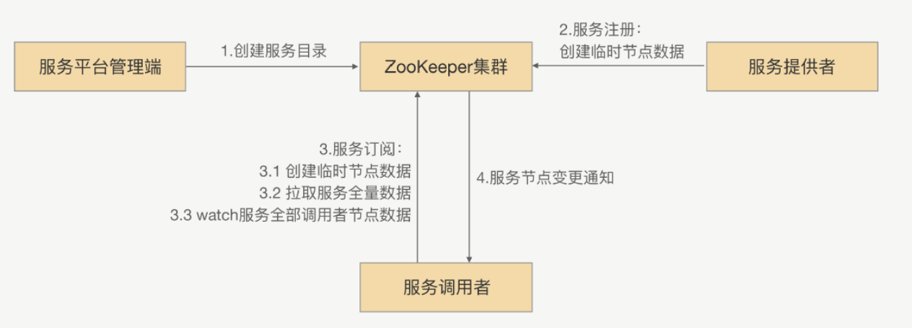

1. **利用Curator框架搭建Zookeeper集群(即RPC的注册中心)**
2. **服务注册时只需服务节点向Zookeeper节点写入注册信息即可**
3. **Zookeeper的Watcher机制完成服务订阅/下发功能**
4. **强一致性（CP）：节点更新实时通知**
5. **消息总线保证最终一致性**
    1. **注册数据全量缓存在注册中心内存**
    2. 消息总线**同步数据**
        1. **注册中心节点接收到服务节点注册时产生消息推送到消息总线**
        2. **消息总线通知其他注册中心节点更新数据+服务下发**

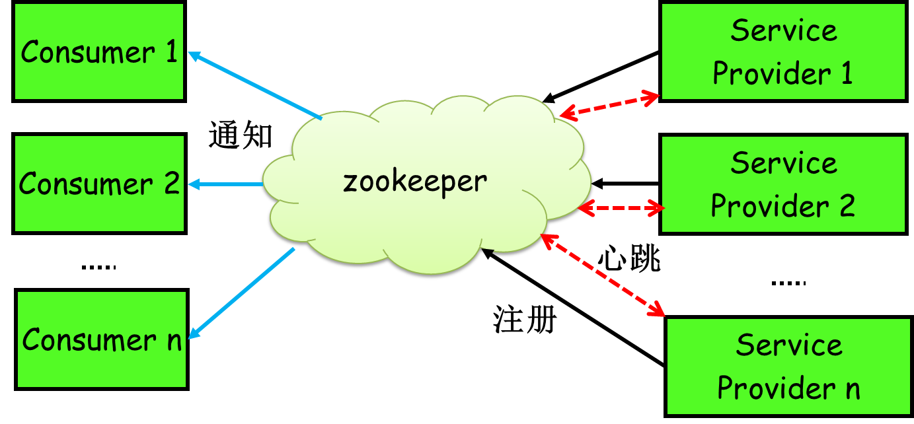

## Netty实现RPC示例

### 设计分析

- 创建一个接口，定义抽象方法。用于消费者和提供者之间的约定
- 创建一个提供者，该类需要监听消费者的请求，并按照约定返回数据
- 创建一个消费者，该类需要透明的调用自己不存在的方法，内部需要使用 `Netty` 请求提供者返回数据

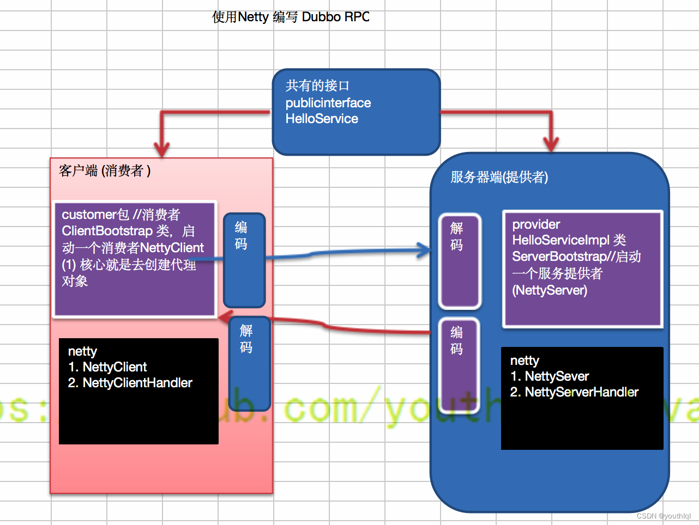

### 示例代码

#### RPC.common.HelloService

```java
// 服务提供方和服务消费方共用接口
public interface HelloService {
    String hello(String mes);
}
```

#### RPC.consumer.ClientBootstrap

```java
public class ClientBootstrap {


    //这里定义协议头
    public static final String providerName = "HelloService#hello#";

    public static void main(String[] args) throws  Exception{

        //创建一个消费者
        NettyClient customer = new NettyClient();

        //创建代理对象
        HelloService service = (HelloService) customer.getBean(HelloService.class, providerName);

        for (;; ) {
            Thread.sleep(2 * 1000);
            //通过代理对象调用服务提供者的方法(服务)
            String res = service.hello("你好 dubbo~");
            System.out.println("调用的结果 res= " + res);
        }
    }
}
```

#### RPC.provider.HelloServiceImpl

```java
public class HelloServiceImpl implements HelloService {

    private static int count = 0;
    //当有消费方调用该方法时， 就返回一个结果
    @Override
    public String hello(String message) {
        System.out.println("收到客户端消息=" + message);
        System.out.println();
        // 根据消息返回不同的结果
        if(message != null) {
            return "你好客户端, 我已经收到你的消息。消息为：[" + message + "] ，第" + (++count) + " 次 \n";
        } else {
            return "你好客户端, 我已经收到你的消息 ";
        }
    }
}
```

#### RPC.provider.ServerBootstrap

```java
//ServerBootstrap 会启动一个服务提供者，就是 NettyServer
public class ServerBootstrap {
    public static void main(String[] args) {
        NettyServer.startServer("127.0.0.1", 7000);
    }
}
```

#### RPC.netty.NettyClient

```java
public class NettyClient {

    //创建线程池
    private static ExecutorService executor = Executors.newFixedThreadPool(Runtime.getRuntime().availableProcessors());

    private static NettyClientHandler client;
    private int count = 0;

    //编写方法使用代理模式，获取一个代理对象

    public Object getBean(final Class<?> serivceClass, final String providerName) {

        return Proxy.newProxyInstance(Thread.currentThread().getContextClassLoader(),
                new Class<?>[]{serivceClass}, (proxy, method, args) -> {
                    //{}  部分的代码，客户端每调用一次 hello, 就会进入到该代码

                    System.out.println("(proxy, method, args) 进入...." + (++count) + " 次");

                    if (client == null) {
                        initClient();
                    }

                    //设置要发给服务器端的信息
                    //providerName：协议头，args[0]：就是客户端要发送给服务端的数据
                    client.setPara(providerName + args[0]);

                    //
                    return executor.submit(client).get();

                });
    }

    //初始化客户端
    private static void initClient() {
        client = new NettyClientHandler();
        //创建EventLoopGroup
        NioEventLoopGroup group = new NioEventLoopGroup();
        Bootstrap bootstrap = new Bootstrap();
        bootstrap.group(group)
                .channel(NioSocketChannel.class)
                .option(ChannelOption.TCP_NODELAY, true)
                .handler(
                        new ChannelInitializer<SocketChannel>() {
                            @Override
                            protected void initChannel(SocketChannel ch) throws Exception {
                                ChannelPipeline pipeline = ch.pipeline();
                                pipeline.addLast(new StringDecoder());
                                pipeline.addLast(new StringEncoder());
                                pipeline.addLast(client);
                            }
                        }
                );

        try {
            bootstrap.connect("127.0.0.1", 7000).sync();
        } catch (Exception e) {
            e.printStackTrace();
        }
    }
}
```

#### RPC.netty.NettyClientHandler

```java
public class NettyClientHandler extends ChannelInboundHandlerAdapter implements Callable {

    private ChannelHandlerContext context;//上下文
    private String result; //返回的结果
    private String para; //客户端调用方法时，传入的参数


    //与服务器的连接创建后，就会被调用, 这个方法是第一个被调用(1)
    @Override
    public void channelActive(ChannelHandlerContext ctx) throws Exception {
        System.out.println(" channelActive 被调用  ");
        context = ctx; //因为我们在其它方法会使用到 ctx
    }

    //收到服务器的数据后，调用方法 (4)
    //
    @Override
    public synchronized void channelRead(ChannelHandlerContext ctx, Object msg) throws Exception {
        System.out.println(" channelRead 被调用  ");
        result = msg.toString();
        notify(); //唤醒等待的线程
    }

    @Override
    public void exceptionCaught(ChannelHandlerContext ctx, Throwable cause) throws Exception {
        ctx.close();
    }

    //被代理对象调用, 发送数据给服务器，-> wait -> 等待被唤醒(channelRead) -> 返回结果 (3)-》5
    @Override
    public synchronized Object call() throws Exception {
        System.out.println(" call1 被调用  ");
        context.writeAndFlush(para);
        //进行wait
        wait(); //等待channelRead 方法获取到服务器的结果后，唤醒
        System.out.println(" call2 被调用  ");
        return  result; //服务方返回的结果

    }
    //(2)
    void setPara(String para) {
        System.out.println(" setPara  ");
        this.para = para;
    }
}
```

#### RPC.netty.NettyServer

```java
public class NettyServer {

    public static void startServer(String hostName, int port) {
        startServer0(hostName,port);
    }

    //编写一个方法，完成对NettyServer的初始化和启动

    private static void startServer0(String hostname, int port) {

        EventLoopGroup bossGroup = new NioEventLoopGroup(1);
        EventLoopGroup workerGroup = new NioEventLoopGroup();

        try {

            ServerBootstrap serverBootstrap = new ServerBootstrap();

            serverBootstrap.group(bossGroup,workerGroup)
                    .channel(NioServerSocketChannel.class)
                    .childHandler(new ChannelInitializer<SocketChannel>() {
                                      @Override
                                      protected void initChannel(SocketChannel ch) throws Exception {
                                          ChannelPipeline pipeline = ch.pipeline();
                                          pipeline.addLast(new StringDecoder());
                                          pipeline.addLast(new StringEncoder());
                                          pipeline.addLast(new NettyServerHandler()); //业务处理器

                                      }
                                  }

                    );

            ChannelFuture channelFuture = serverBootstrap.bind(hostname, port).sync();
            System.out.println("服务提供方开始提供服务~~");
            channelFuture.channel().closeFuture().sync();

        }catch (Exception e) {
            e.printStackTrace();
        }
        finally {
            bossGroup.shutdownGracefully();
            workerGroup.shutdownGracefully();
        }

    }
}
```

#### RPC.netty.NettyServerHandler

```java
public class NettyServerHandler extends ChannelInboundHandlerAdapter {

    @Override
    public void channelRead(ChannelHandlerContext ctx, Object msg) throws Exception {
        System.out.println("---服务端开始收到来自客户单的消息---");
        //获取客户端发送的消息，并调用服务
        System.out.println("原始消息：" + msg);

        /*
         1.客户端在调用服务器的api 时，我们需要定义一个协议，比如我们要求 每次发消息是都
         必须以某个字符串开头 "HelloService#hello#你好"
         2.Dubbo注册在Zookeeper里时，这种就是类的全路径字符串，你用IDEA的zookeeper插件
         就可以清楚地看到
         */
        if(msg.toString().startsWith(ClientBootstrap.providerName)) {

            String result = new HelloServiceImpl().hello(msg.toString().substring(msg.toString().lastIndexOf("#") + 1));
            ctx.writeAndFlush(result);
        }
    }

    @Override
    public void exceptionCaught(ChannelHandlerContext ctx, Throwable cause) throws Exception {
        ctx.close();
    }
}
```

### 调用过程

1. `ClientBootstrap#main`**发起调用**

2. ```java
    HelloService service = (HelloService) customer.getBean(HelloService.class, providerName);
    ```

3. 调用`NettyClient#getBean` **与服务端建立链接**

4. 执行**`NettyClientHandler#channelActive`**

5. 回到`NettyClient#getBean`调用**`NettyClientHandler#setPara`**调用完再到`NettyClient#getBean` **用线程池提交任务**

6. 就准备**执行`NettyClientHandler#call`线程任务**

7. 在`NettyClientHandler#call`中**发送数据给服务提供者**

    ```java
    context.writeAndFlush(para);
    ```

    由于**还没收到服务提供者的数据结果**，所以**wait**

8. **服务提供者**从Socket通道中**收到数据**执行`NettyServerHandler#channelRead`，然后因为此方法中执行

    ```java
    String result = new HelloServiceImpl().hello(msg.toString().substring(msg.toString().lastIndexOf("#") + 1));
    ```

9. 去**`HelloServiceImpl#hello`中执行业务逻辑**

10. **返回数据给`NettyServerHandler#channelRead`再把数据发给客户端**

11. `NettyClientHandler#channelRead`**收到服务提供者发来的数据，唤醒之前wait的线程**

12. **之前wait的线程从`NettyClientHandler#call`苏醒**，**返回结果给`NettyClient#getBean`**

13. `NettyClient#getBeanget`得到数据，**`ClientBootstrap#main`中的此函数调用返回，得到服务端提供的数据**

    ```java
    String res = service.hello("你好 dubbo~");
    ```

14. 至此一次**RPC调用结束**
    
    


