# 网络编程/Netty

## I/O基础

### I/O概念

#### Socket(套接字)

**计算机网络中进程间进行双向通信端点的抽象** 由**IP地址和端口组成**（IP Address : Port Number）

#### Socket缓冲区

**Socket被创建后**在**内核中分配**两个缓冲区：**输入缓冲区和输出缓冲区**

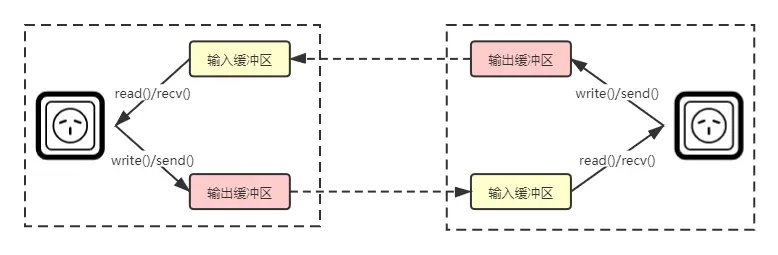

#### 系统调用

操作系统进程空间分为**用户空间(User Space)和内核空间(Kernel Space)**

- 大多**系统交互式操作**（如 **设备I/O**）需在**内核空间**运行
- **应用程序**在**用户空间**运行 不具备系统交互操作权限
- **系统调用**在**内核空间**运行 是**操作系统为应用程序提供的访问系统资源/功能的接口**
  - Linux内核将所有外部设备都看作文件来处理
  - **对文件的读写会调用内核提供的系统命令并返回一个fd (file descriptor即文件描述符)**

##### 系统调用函数

- select/poll**会**顺序扫描检查fd就绪状态**
- **epoll**会基于**事件驱动**检查fd状态(**有fd就绪时立即回调函数rollback**)

|                    | select                         | poll                           | epoll                                    |
| ------------------ | ------------------------------ | ------------------------------ | ---------------------------------------- |
| **底层数据结构**   | 数组                           | 链表                           | 红黑树+双链表                            |
| **获取就绪fd方式** | **顺序遍历扫描**               | **顺序遍历扫描**               | **事件驱动(fd就绪立即回调函数rollback)** |
| **事件复杂度**     | O(n)                           | O(n)                           | O(1)                                     |
| **最大连接数**     | 1024                           | 无限制                         | 无限制                                   |
| **fd数据拷贝方式** | fd数据从用户空间拷贝到内核空间 | fd数据从用户空间拷贝到内核空间 | 使用mmap(内存映射)不需要频繁拷贝         |

#### 阻塞/非阻塞

描述**调用者在等待返回结果时的状态**

- **阻塞：调用者发起请求后一直等待返回结果**（线程被挂起）
- **非阻塞：调用者发起请求后立刻返回 不阻塞当前线程 调用不会立刻得到结果 调用者需要定时轮询查看结果**

#### 同步/异步

描述**调用结果的返回机制(通信机制)**

- **同步**：调用者发起请求后一直等待返回结果 由**调用者主动等待这个调用结果**
- **异步**：调用者发起请求后立刻返回 调用不会立刻得到结果 **由被调者在执行任务结束后主动通知调用者**（如 Callback）

#### IO读写流程

**操作系统内核处理IO操作**分为两个阶段

**等待数据**：系统内核**等待网卡接收到数据后把数据写到内核中**

**拷贝数据**：系统内核在**获取到数据后将数据拷贝到用户空间中**

**应用进程写操作(数据拷贝两次)** ps.读操作将整个流程反过来(同样数据拷贝两次)

1. 把**数据写到用户空间的缓冲区中**
2. 由 **CPU 将数据拷贝到系统内核的缓冲区中**
3. 由 **DMA 将这份数据拷贝到网卡中**
4. 由**网卡发送**出去

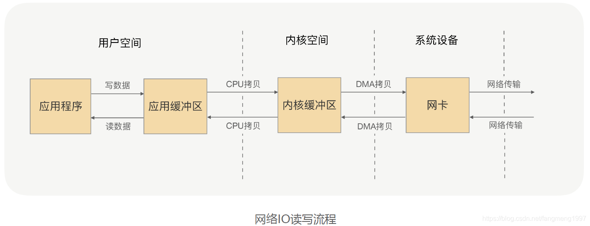

#### 零拷贝

- 应用进程的**一次完整的读写操作**，都需要在**用户空间与内核空间中来回拷贝**
- **每一次拷贝都需要 CPU 进行一次上下文切换**（由用户进程切换到系统内核，或由系统内核切换到用户进程）
- 浪费 CPU 和性能

##### 零拷贝简介

- 取消用户空间与内核空间之间的数据拷贝操作

- 可以通过一种方式**直接将数据写入内核或从内核中读取数据** 再通过DMA将内核中数据拷贝到网卡/将网卡中数据 copy 到内核

- **用户空间与内核空间都将数据写到虚拟内存**

    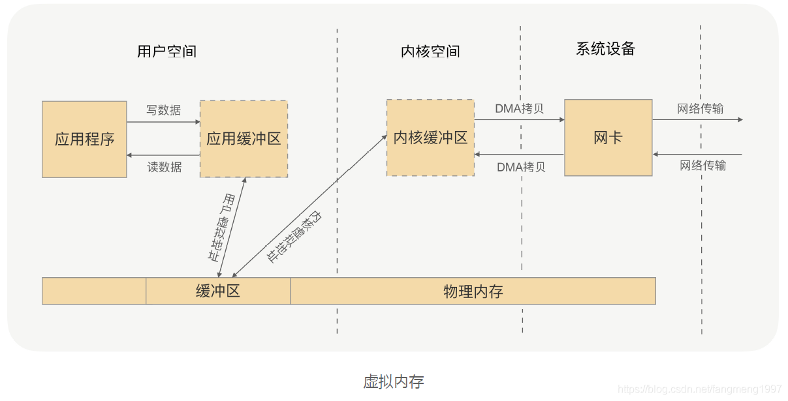

- 两种实现方式：**mmap+write和sendfile**

- **减少进程间的数据拷贝，提高数据传输的效率**

##### mmap+write

**mmap** 是Linux提供的一种**内存映射文件方法**（**将一个进程的地址空间中的一段虚拟地址映射到磁盘文件地址**）

```
// mmap + write的伪代码
tmp_buf = mmap(file_fd, len);
write(socket_fd, tmp_buf, len);
```

###### 原理

使用 mmap + write 代替原来的 read + write 方式，**减少了 1 次 CPU 拷贝操作**

- 使用 mmap 将**内核读缓冲区（read buffer）的地址与用户空间缓冲区（user buffer）进行映射**
- 实现**内核缓冲区与应用程序内存的共享**
- **省去了将数据从内核读缓冲区（read buffer）拷贝到用户缓冲（user buffer）**的过程
- **内核读缓冲区（read buffer）仍需将数据到内核写缓冲区（socket buffer）**

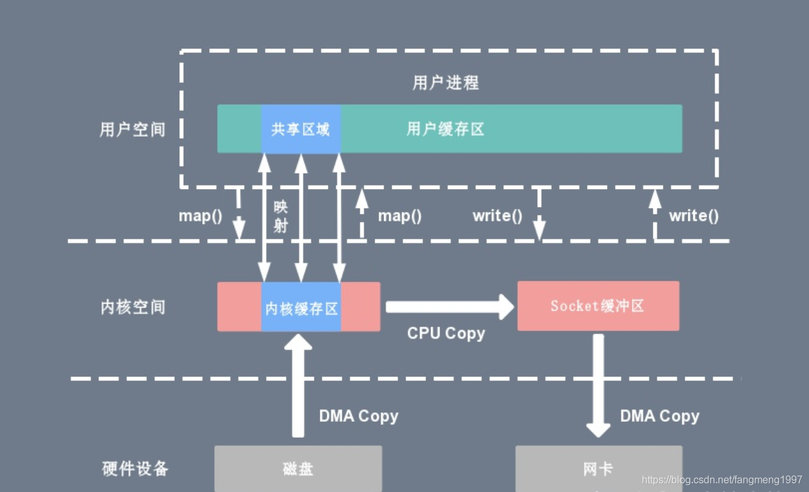

###### 读写过程

mmap + write零拷贝在整个IO读写过程会进行 **4 次上下文切换，1 次 CPU 拷贝和 2 次 DMA拷贝**

1. 用户进程通过 **mmap()** 向内核（kernel）发起**系统调用**：**上下文从用户态（user space）切换为内核态（kernel space）**
2. 将用户进程的**内核空间的读缓冲区（read buffer）与用户空间的缓存区（user buffer）进行内存地址映射**
3. CPU利用**DMA控制器**将数据从**主存或硬盘拷贝到内核空间的读缓冲区（read buffer）**
4. **上下文从内核态（kernel space）切换回用户态（user space）** **mmap 系统调用执行返回**
5. 用户进程通过 **write()** 函数向内核（kernel）发起**系统调用**：**上下文从用户态（user space）切换为内核态（kernel space）**
6. **CPU将读缓冲区（read buffer）中的数据拷贝到的网络缓冲区（socket buffer）**
7. CPU利用**DMA控制器**将数据从**网络缓冲区（socket buffer）拷贝到网卡进行数据传输**
8. **上下文从内核态（kernel space）切换回用户态（user space）write 系统调用执行返回**

###### 优缺点

- **针对大文件提高 I/O 性能** **小文件**会导致**碎片空间的浪费**(内存映射总是要**对齐页边界**)
- 多进程问题
    - **mmap 一个文件**时，如果这个文件**被另一个进程所截获** 
    - **write 系统调用**会因为**访问非法地址被 SIGBUS 信号终止**
    - SIGBUS 默认会杀死进程并产生一个 coredump，**服务器可能因此被终止**

##### sendfile

**sendfile** 系统调用在 Linux 内核版本 2.1 中被引入 **简化通过网络在两个通道之间进行的数据传输过程**

```
sendfile伪代码
sendfile(socket_fd, file_fd, len);
```

###### 原理

通过 sendfile 系统调用**减少了 CPU 拷贝的次数且减少了上下文切换的次数**

- 数据可以**直接在内核空间内部进行 I/O 传输**
- **省去了数据在用户空间和内核空间之间的来回拷贝**
- sendfile 调用中 **I/O 数据对用户空间是完全不可见**的

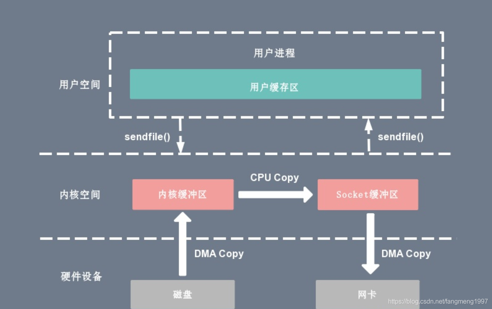

###### 读写过程

sendfile零拷贝在整个IO读写过程会进行 **2 次上下文切换，1 次 CPU 拷贝和 2 次 DMA 拷贝**

1. 用户进程通过 **sendfile()** 向内核（kernel）发起**系统调用**：**上下文从用户态（user space）切换为内核态（kernel space）**
2. CPU 利用 **DMA 控制器**将数据从**主存或硬盘拷贝到内核空间的读缓冲区（read buffer**）
3. **CPU 将读缓冲区（read buffer）中的数据拷贝到的网络缓冲区（socket buffer）**
4. CPU 利用 **DMA 控制器**将数据从**网络缓冲区（socket buffer）拷贝到网卡进行数据传输**
5. **上下文从内核态（kernel space）切换回用户态（user space）sendfile 系统调用执行返回**

###### 优缺点

- **相比较于 mmap 内存映射**，sendfile **少了 2 次上下文切换**，但**仍然有 1 次 CPU 拷贝操作**
- **用户程序不能对数据进行修改** 而只是单纯地完成了一次数据传输过程

### I/O模型

#### 操作系统的I/O过程

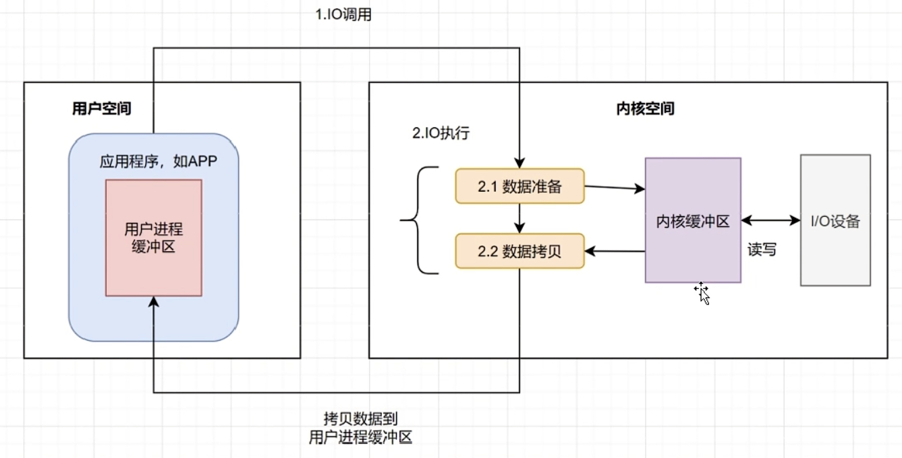

1. **应用程序进程---I/O调用请求--->操作系统**
2. **操作系统准备数据：I/O外部设备数据--->内核缓冲区**
3. **操作系统拷贝数据：内核缓冲区数据--->用户进程缓冲区**

Note：以下五种I/O模型中将**`recvfrom`函数视为系统调用：调用时需要用户和内核空间相互切换** 

#### 阻塞I/O模型

应用进程空间调用`recvfrom` **其系统调用直到数据包到达且被拷贝到应用进程的缓冲区中**/发生错误时**才返回**且在此期间**进程一直阻塞**

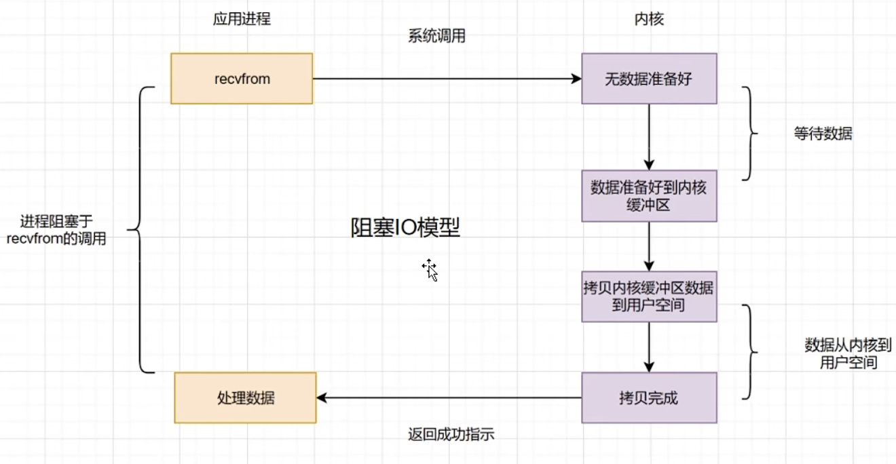

#### 非阻塞I/O模型

应用进程空间调用`recvfrom` **如缓冲区没有数据 系统调用返回错误 进程需要持续轮询检查内核缓存区** 

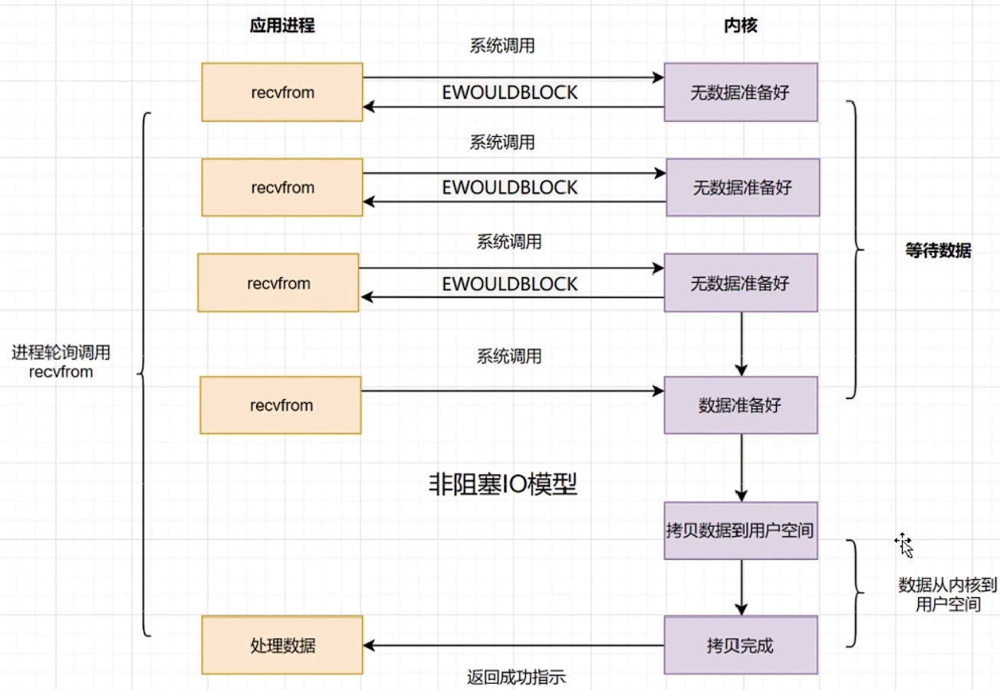

#### I/O复用模型

进程通过**将一个/多个fd传递给select/poll并阻塞在select/poll上** **而不阻塞在真正的I/O系统调用之上** 当数据准备好时执行`recvfrom` 

Note：**select实际需要两个系统调用 但可以等待多个描述符就绪**

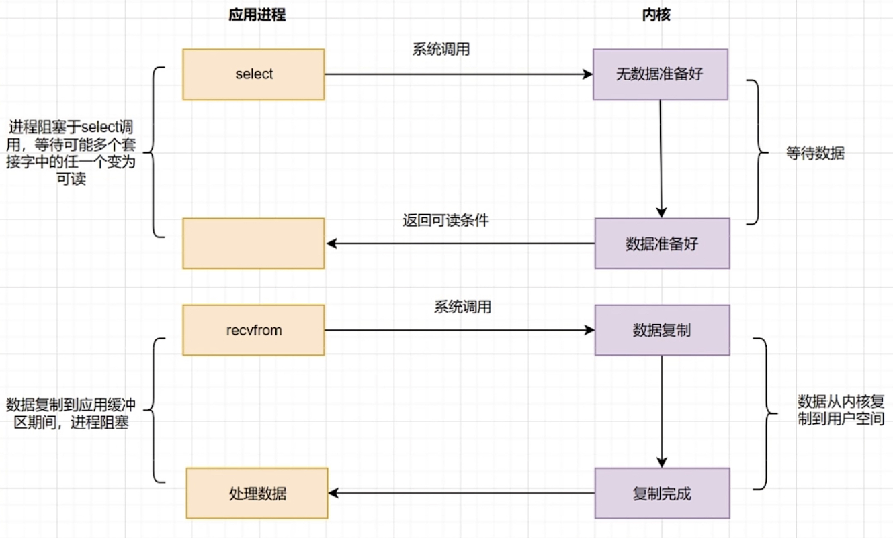

##### I/O多路复用技术

I/O多路复用：将**多个I/O的阻塞复用到同一个select的阻塞上**使得系统在**单线程下可同时处理多个客户端请求**

- 系统开销小
- 不需要创建和维护额外进程/线程
- **可同时处理多个客户端请求**
- 主要应用场景
  - 服务器**需同时处理多个处于监听状态/连接状态的套接字**
  - 服务器**需同时处理多种网络协议的套接字**
- 支持I/O多路复用的系统调用：select、pselect、poll、epoll
  - **select**：轮询/网络事件通知 有固有缺陷：**监听I/O最大连接数有限、需要遍历fd（I/O效率随着fd增加线性下降）**
  - **epoll**
    - **支持进程打开的socket描述符不受限制(仅受限于操作系统的最大文件句柄数)**
    - **基于事件驱动 活跃fd才主动调用callback函数 I/O效率高**
    - **mmap内存映射加速内核与用户空间的消息传递**：mmap在同一块内存
    - API更简单

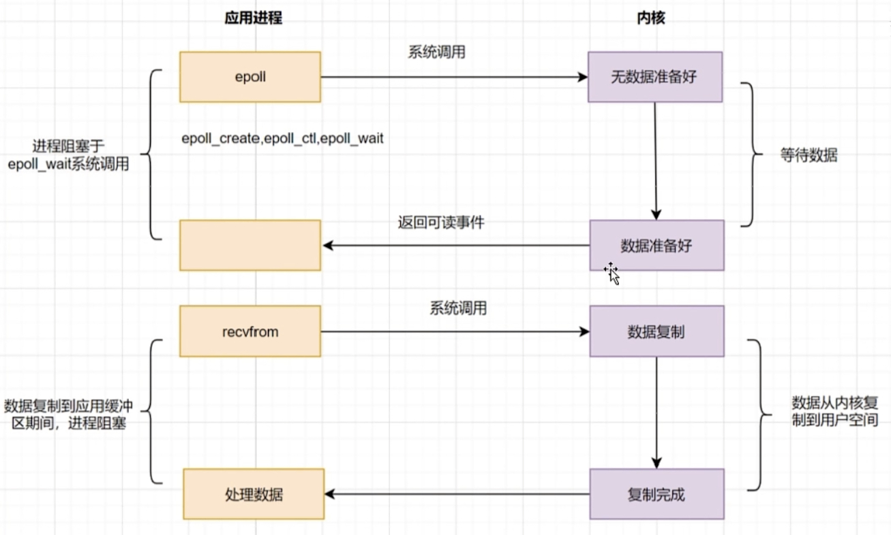

#### 信号驱动I/O模型

**开启信号驱动I/O功能 系统调用sigaction执行一个信号处理函数(非阻塞)** 

**数据就绪时为进程生成一个SIGIO信号 信号回调通知进程调用`recvfrom`**

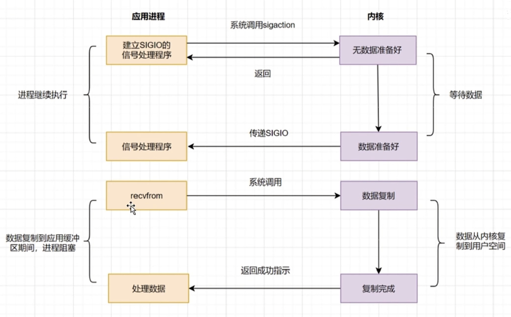

#### 异步I/O模型

**告知内核启动某操作 内核在整个操作完成后通知进程**

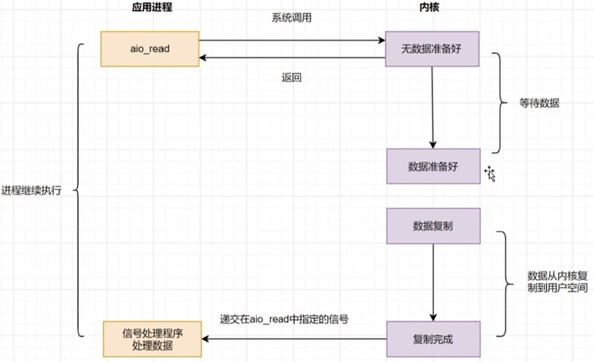

#### I/O模型对比

用**进程对内核发起 IO 系统调用后，内核会经过两个阶段来完成数据的传输**

- **第一阶段：应用进程发起 IO 系统调用后，会一直等待数据->当有数据传入服务器，会将数据放入内核空间，此时数据准备好**
- **第二阶段：将数据从内核空间复制到用户空间并返回给应用程序成功标识**

| IO 模型          | 第一阶段           | 第二阶段 |
| ---------------- | ------------------ | -------- |
| **阻塞式IO**     | **阻塞**           | **阻塞** |
| **非阻塞式IO**   | **非阻塞**         | **阻塞** |
| **IO复用**       | **阻塞（Select）** | **阻塞** |
| **信号驱动式IO** | **异步**           | **阻塞** |
| **异步IO**       | **异步**           | **异步** |

### Java 的 I/O演进

- **JDK1.4前：BIO**
  - 同步阻塞
- **JDK1.4：NIO** 促进异步非阻塞编程的发展和应用
  - 异步I/O缓冲区ByteBuffer
  - 异步I/O管道Pipe
  - 异/同步I/O通道Channel
  - 多种字符集编码/解码
  - 非阻塞I/O多路复用器selector
  - 正则表达式类库
  - 文件通道FileChannel
- **JDK1.7：NIO2.0**
  - 批量获取文件属性的平台无关API
  - AIO功能：基于文件/网络socket的异步I/O 
  - 支持配置和多播数据报的通道功能

### I/O模型编程

#### BIO编程

**服务端**

1. **一个独立的Acceptor线程负责监听客户端的连接**
2. **Acceptor接受到客户端连接请求之后为每一个客户端创建一个新的线程进行链路处理**
3. **处理完成通过输出流返回应答给客户端**
4. **线程被销毁**

**缺乏弹性伸缩能力 服务端和客户端线程并发访问数1:1** 线程增多->系统性能下降->并发访问量增大->线程堆栈溢出->进程宕机/僵死

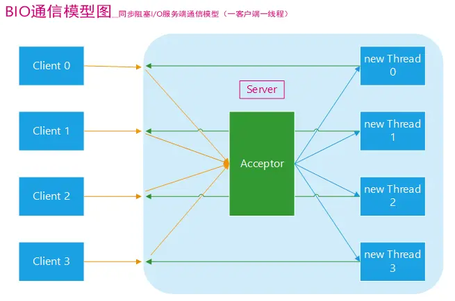

#### 伪异步IO编程

**服务器维护一个线程池处理多个客户端的请求介入** 线程池可**灵活调配线程资源 防止大量并发介入导致线程耗尽**

1. **客户端接入时将客户端socket封装为Task投入服务器线程池进程处理**
2. **线程池维护消息队列和N个活跃线程** 对消息队列中的Task处理
3. 客户端并发访问时线程池对资源占用可控 防止资源耗尽

缺陷

- 还是同步阻塞 如果**发送请求/应答消息/网络传输较慢**时 读取输入流方**通信线程会被长时间阻塞** **其他消息只能在消息队列排队**
- 通信双方应答时间过长引起**级联故障**
  - **服务端处理缓慢 返回应答信息耗费时间长**
  - 伪异步IO**线程读取故障服务节点响应时同步阻塞**服务端耗费的时间
  - **所有可用线程被故障服务器阻塞** 后续所有消息在消息队列排队
  - **消息队列积满 后续入队操作被阻塞**
  - **Acceptor线程**被阻塞在线程池的同步阻塞队列后**新的客户端消息被拒绝 客户端大量连接超时**
  - 所有连接超时 调用者认为**系统崩溃 无法接收新的请求消息**

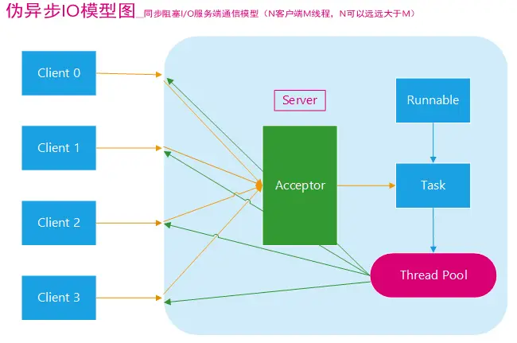

#### NIO编程

##### 缓冲区Buffer

- **Buffer是一个对象 包含一些要写入/读出的数据**
- 在NIO库中**所有数据都是用缓冲区处理**的
- 在**读取数据时直接读出到缓冲区中**
- 在**写入数据时直接写入到缓冲区中**
- 任何时候**访问NIO中的数据，都是通过缓冲区进行操作**
- 缓冲区**实质上是一个数组(通常为ByteBuffer)** 且提供了**对数据的结构化访问及维护读写位置**的信息

##### 通道Channel

- Channel是一个通道 **网络数据通过Channel读取和写入**
- 通道与流的不同之处在于**通道是双向**的，流只是在一个方向上移动（一个流必须是InputStream和OutputStream的子类）
- 通道可以用于**读、写或者两者同时进行**（即通道Channel是**全双工**的）

##### 多路复用Selector

- **Selector会不断地轮询注册在其上的Channel**
- **某个Channel上面发生读或者写事件** 该Channel就处于**就绪状态**，会**被Selector轮询出来**
- 通过**SelectionKey可以获取就绪Channel的集合，进行后续的I/O操作**

##### NIO流程

（1）创建**ServerSocketChannel**，配置其为**非阻塞模式**

（2）**绑定监听，配置TCP参数**

（3）创建一个**独立的I/O线程**，用于**轮询多路复用器Selector**

（4）创建**Selector**，将之前创建的**ServerSocketChannel注册到Selector上**，**监听SelectionKey.OP_ACCEPT**

（5）**启动I/O线程**，在**循环体中执行Selector.select()方法，轮询就绪的Channel**

（6）当**轮询到了处于就绪状态的Channel**时，需要**对其进行判断**，如果是**OP_ACCEPT状态，说明是新的客户端接入**，则调用**ServerSocketChannel.accept()方法接受新的客户端**

（7）**设置新的客户端链路SocketChannel为非阻塞模式**，配置其他的一些TCP参数

（8）将**SocketChannel注册到Selector，监听OP_READ操作位**

（9）如果**轮询的Channel为OP_READ**，则说明**SocketChannel中有新的就绪的数据包需要读取，则构造ByteBuffer对象，读取数据包**

（10）如果**轮询的Channel为OP_WRITE，说明还有数据没有发送完成，需要继续发送**


#### AIO编程

- 异步通道通过以下方式获取操作结果
    - **java.util.concurrent.Future类**
    - **执行异步操作时传入一个java.nio.channels**
- **操作完成的回调由CompletionHandler接口的实现类**完成
- **不需要通过Selector对注册通道轮询即可实现异步读写**

#### IO编程对比

|                           | 同步阻塞I/O(BIO) | 伪异步I/O    | 非阻塞I/O(NIO) | 异步I/O(AIO)                         |
| ------------------------- | ---------------- | ------------ | -------------- | ------------------------------------ |
| **客户端个数：I/O线程数** | **1:1**          | **M:N**(M>N) | **M:1**        | **M:0**(不需要启动额外线程 被动回调) |
| **I/O类型(阻塞/非阻塞)**  | 阻塞             | 阻塞         | 非阻塞         | 非阻塞                               |
| **I/O类型(同步/非同步)**  | 同步             | 同步         | 同步           | 异步                                 |
| **API使用难易程度**       | 简单             | 简单         | 非常复杂       | 复杂                                 |
| **调试难度**              | 简单             | 简单         | 复杂           | 复杂                                 |
| **可靠性**                | 非常差           | 差           | 高             | 高                                   |
| **吞吐量**                | 低               | 中           | 高             | 高                                   |

#### 选择Netty

##### 不选Java原生NIO编程的原因

- **NIO类库和API繁杂 使用麻烦**
- **具备额外技能以铺垫**(NIO涉及Reactor模式 需对Java多线程和网络编程非常熟悉)
- **可靠性能力补齐的工作量和难度非常大**
- BUG没得到根本解决 **epoll bug导致Selector空轮询和CPU100%** 

##### Netty优点

Netty是业界最流行的**NIO框架**之一 其**健壮性、功能、性能、可定制性、可扩展性**首屈一指

- **API使用简单** 开发门槛低
- 功能强大 **预置多种编解码功能 支持多种主流协议**
- **定制能力强** 通过**ChannelHandler**对通信框架灵活扩展
- **综合性能**较其他NIO框架**最优**
- 稳定 **修复已知所有NIO BUG**
- 版本迭代周期短
- 经历大规模商业应用考验 质量得到验证

## Netty开发

### Netty最佳实践

1. 创建**两个NioEventLoopGroup**：**逻辑隔离NIO Acceptor 和NIO的I/O线程**
2. 尽量**不要在ChannelHandler启动用户线程**
3. **解码放在NIO线程调用的解码Handler执行** 不要切换到用户线程来解码消息
4. 如果**业务逻辑操作非常简单** 可以**直接在NIO线程上完成逻辑编排** 无需切换到用户线程
5. 如果**业务逻辑操作非常复杂** 不要在NIO线程上完成逻辑编排
    1. **解码后到POJO消息封装为Task**
    2. **将Task派发到业务线程池 由业务线程执行Task**
    3. **保证NIO线程尽快被释放** 处理其他I/O操作
6. 推荐的线程数量计算
    1. **线程数量=(线程总时间/瓶颈资源时间) * 瓶颈资源的线程并行数**
    2. **QPS=1000/线程总时间*线程数**

### TCP粘包/拆包问题

#### 问题说明

TCP是一个**流协议**(**流--没有界限**的一串数据) **操作系统在发送TCP数据时通过缓冲区优化导致TCP粘包/拆包**

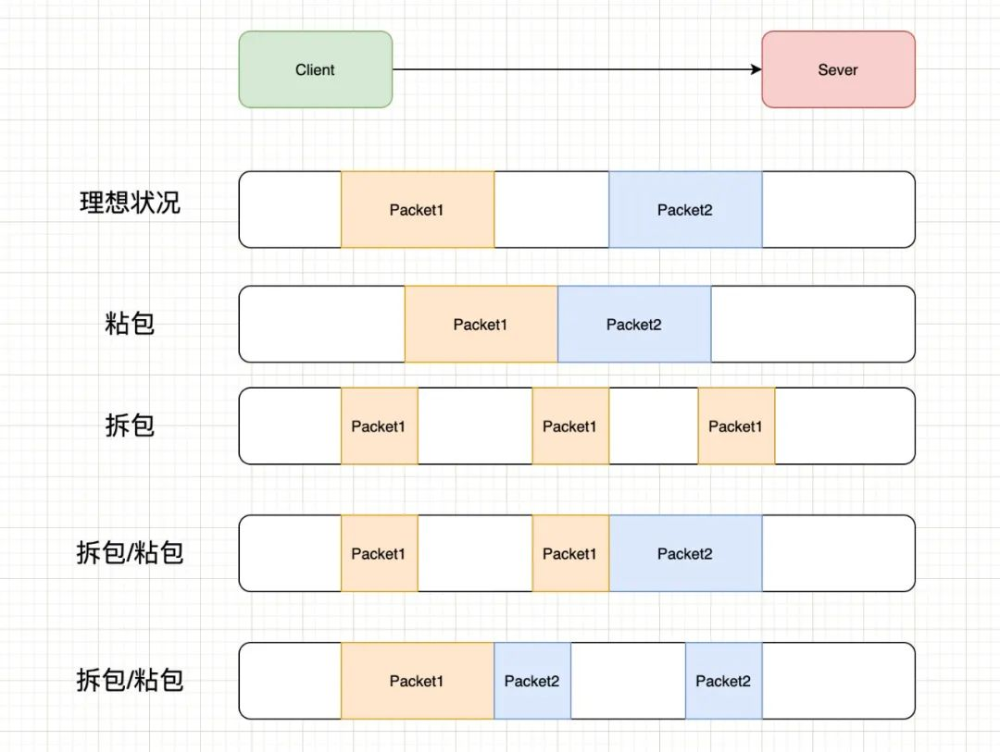

#### 发生原因

- 应用程序写入字节大小>套接口发送缓冲区大小
- MSS大小的TCP分段
- 以太网帧payload>MTU->IP分片

#### 解决策略

底层TCP无法理解上层业务数据 无法保证数据不被拆分/重组 只能通过**应用协议栈设计解决**

- **消息定长**：发送端将每个包都封装成固定的长度，长度不足可通过补0或空等进行填充到指定长度
- 包尾符号分割：**发送端在每个包的末尾使用固定的分隔符** 例如\r\n 发生拆包需等其他包发来之后再找到其中的\r\n进行合并
- 将**消息分为头部和消息体** **头部中保存消息总长度/消息体长度** 只有**读取到足够长度的消息之后才算是读到了一个完整的消息**
- 通过**自定义应用层协议**进行粘包和拆包的处理

#### Netty解码器解决TCP粘包/拆包

Netty对解决粘包和拆包的方案做了抽象 提供了一些解码器（Decoder）来解决粘包和拆包的问题

- **LineBasedFrameDecoder：以行为单位进行数据包的解码**
- **DelimiterBasedFrameDecoder：以特殊的符号作为分隔来进行数据包的解码**
- **FixedLengthFrameDecoder：以固定长度进行数据包的解码**
    - 对于**高并发、大流量**的系统来说**每个数据包都不应该传输多余的数据**（**补齐的方式不可取**）
- **LengthFieldBasedFrameDecoder：适用于消息头包含消息长度的协议（最常用）**

##### 行单位解码器 LineBasedFrameDecoder

- **依次遍历ByteBuf可读字节 以”/n“或者“\r\n”为结束位置 可读索引到结束位置区间字节成为一行**
- 以换行符为结束标志
- 支持携带结束符/不携带结束符两种解码方式
- 支持配置单行最大长度 (超过最大长度抛异常)
- **与StringDecoder组合为按行切换的文本解码器** 解决TCP粘包/拆包

```java
private class ChildChannelHandler extends ChannelInitializer<SocketChannel> {
      @Override
      protected void initChannel(SocketChannel arg0) throws Exception {
          arg0.pipeline().addLast(new LineBasedFrameDecoder(1024));
          // 接收到的对象转换为字符串 继续调用后续Handler
          arg0.pipeline().addLast(new StringDecoder());
          arg0.pipeline().addLast(new TimeServerHandler());
      }
   }
```

##### 分隔符解码器 DelimiterBasedFrameDecoder

```java
// server
protected void initChannel(SocketChannel ch) throws Exception {
    String delimiter = "_$";
    // 将delimiter设置到DelimiterBasedFrameDecoder中，经过该解码一器进行处理之后，源数据将会
    // 被按照_$进行分隔，这里1024指的是分隔的最大长度，即当读取到1024个字节的数据之后，若还是未
    // 读取到分隔符，则舍弃当前数据段，因为其很有可能是由于码流紊乱造成的
    ch.pipeline().addLast(new DelimiterBasedFrameDecoder(1024,
        Unpooled.wrappedBuffer(delimiter.getBytes())));
    // 将分隔之后的字节数据转换为字符串数据
    ch.pipeline().addLast(new StringDecoder());
    // 这是自定义的一个编码器，主要作用是在返回的响应数据最后添加分隔符
    ch.pipeline().addLast(new DelimiterBasedFrameEncoder(delimiter));
    // 最终处理数据并且返回响应的handler
    ch.pipeline().addLast(new EchoServerHandler());
}

// DelimiterBasedFrameEncoder是自定义的编码器，其主要作用是在返回的响应数据之后添加分隔符
public class DelimiterBasedFrameEncoder extends MessageToByteEncoder<String> {

  private String delimiter;

  public DelimiterBasedFrameEncoder(String delimiter) {
    this.delimiter = delimiter;
  }

  @Override
  protected void encode(ChannelHandlerContext ctx, String msg, ByteBuf out) 
      throws Exception {
    // 在响应的数据后面添加分隔符
    ctx.writeAndFlush(Unpooled.wrappedBuffer((msg + delimiter).getBytes()));
  }
}
```

```java
// client与server类似
protected void initChannel(SocketChannel ch) throws Exception {
    String delimiter = "_$";
    // 对服务端返回的消息通过_$进行分隔，并且每次查找的最大大小为1024字节
    ch.pipeline().addLast(new DelimiterBasedFrameDecoder(1024, 
        Unpooled.wrappedBuffer(delimiter.getBytes())));
    // 将分隔之后的字节数据转换为字符串
    ch.pipeline().addLast(new StringDecoder());
    // 对客户端发送的数据进行编码，这里主要是在客户端发送的数据最后添加分隔符
    ch.pipeline().addLast(new DelimiterBasedFrameEncoder(delimiter));
    // 客户端发送数据给服务端，并且处理从服务端响应的数据
    ch.pipeline().addLast(new EchoClientHandler());
}
```

##### 定长解码器 FixedLengthFrameDecoder

```java
// server
.childHandler(new ChannelInitializer<SocketChannel>() {
    @Override
    protected void initChannel(SocketChannel ch) throws Exception {
      // 这里将FixedLengthFrameDecoder添加到pipeline中，指定长度为20
      ch.pipeline().addLast(new FixedLengthFrameDecoder(20));
      // 将前一步解码得到的数据转码为字符串
      ch.pipeline().addLast(new StringDecoder());
      // 这里FixedLengthFrameEncoder是自定义的，用于将长度不足20的消息进行补全空格
      ch.pipeline().addLast(new FixedLengthFrameEncoder(20));
      // 最终的数据处理
      ch.pipeline().addLast(new EchoServerHandler());
 }

// FixedLengthFrameEncoder实现了decode()方法 主要是将消息长度不足20的消息进行空格补全
public class FixedLengthFrameEncoder extends MessageToByteEncoder<String> {
  private int length;

  public FixedLengthFrameEncoder(int length) {
    this.length = length;
  }

  @Override
  protected void encode(ChannelHandlerContext ctx, String msg, ByteBuf out)
      throws Exception {
    // 对于超过指定长度的消息，这里直接抛出异常
    if (msg.length() > length) {
      throw new UnsupportedOperationException(
          "message length is too large, it's limited " + length);
    }

    // 如果长度不足，则进行补全
    if (msg.length() < length) {
      msg = addSpace(msg);
    }

    ctx.writeAndFlush(Unpooled.wrappedBuffer(msg.getBytes()));
  }

  // 进行空格补全
  private String addSpace(String msg) {
    StringBuilder builder = new StringBuilder(msg);
    for (int i = 0; i < length - msg.length(); i++) {
      builder.append(" ");
    }

    return builder.toString();
  }
}
  

// EchoServerHandler的作用主要是打印接收到的消息，然后发送响应给客户端
public class EchoServerHandler extends SimpleChannelInboundHandler<String> {
	// 只重写了channelRead0()方法
  // 因为服务器只需要等待客户端发送消息过来，然后在该方法中进行处理，处理完成后直接将响应发送给客户端
  @Override
  protected void channelRead0(ChannelHandlerContext ctx, String msg) throws Exception {
    System.out.println("server receives message: " + msg.trim());
    ctx.writeAndFlush("hello client!");
  }
}
```

```java
// client
.handler(new ChannelInitializer<SocketChannel>() {
    @Override
    protected void initChannel(SocketChannel ch) throws Exception {
      // 对服务端发送的消息进行粘包和拆包处理，由于服务端发送的消息已经进行了空格补全，
      // 并且长度为20，因而这里指定的长度也为20
      ch.pipeline().addLast(new FixedLengthFrameDecoder(20));
      // 将粘包和拆包处理得到的消息转换为字符串
      ch.pipeline().addLast(new StringDecoder());
      // 对客户端发送的消息进行空格补全，保证其长度为20
      ch.pipeline().addLast(new FixedLengthFrameEncoder(20));
      // 客户端发送消息给服务端，并且处理服务端响应的消息
      ch.pipeline().addLast(new EchoClientHandler());
    }

public class EchoClientHandler extends SimpleChannelInboundHandler<String> {
	// channelRead0()主要是在服务器发送响应给客户端时执行 主要是打印服务器的响应消息
  @Override
  protected void channelRead0(ChannelHandlerContext ctx, String msg) throws Exception {
    System.out.println("client receives message: " + msg.trim());
  }
	
  // channelActive()会在客户端连接上服务器时执行 其连上服务器之后就会往服务器发送消息
  @Override
  public void channelActive(ChannelHandlerContext ctx) throws Exception {
    ctx.writeAndFlush("hello server!");
  }
}
```

##### 自定义长度解码器LengthFieldBasedFrameDecoder

- **`LengthFieldBasedFrameDecoder`与`LengthFieldPrepender`需要配合使用**
- 两者一个解码一个编码 在**生成的数据包中添加一个长度字段，用于记录当前数据包的长度**
- `LengthFieldBasedFrameDecoder`会**按照参数指定的包长度偏移量数据对接收到的数据进行解码得到目标消息体数据**
    - 例子：12Hello->Hello
    - 构造函数参数
        - maxFrameLength：最大数据包大小
        - lengthFieldOffset：长度字段在字节码中的偏移量
        - lengthFieldLength：长度字段所占用的字节长度
        - lengthAdjustment：修正字节 与lengthFieldLength共同确定消息头长度
        - initialBytesToStrip：跳过消息头长度 为消息体实际起始偏移量
- `LengthFieldPrepender`会在**响应的数据前面添加指定的字节数据(保存了当前消息体的整体字节数据长度)**
    - 例子：Hello->12Hello

```java
// server
.childHandler(new ChannelInitializer<SocketChannel>() {
          @Override
          protected void initChannel(SocketChannel ch) throws Exception {
            // 这里将LengthFieldBasedFrameDecoder添加到pipeline的首位，因为其需要对接收到的数据
            // 进行长度字段解码，这里也会对数据进行粘包和拆包处理
            ch.pipeline().addLast(new LengthFieldBasedFrameDecoder(1024, 0, 2, 0, 2));
            // LengthFieldPrepender是一个编码器，主要是在响应字节数据前面添加字节长度字段
            ch.pipeline().addLast(new LengthFieldPrepender(2));
            // 对经过粘包和拆包处理之后的数据进行json反序列化，从而得到User对象
            ch.pipeline().addLast(new JsonDecoder());
            // 对响应数据进行编码，主要是将User对象序列化为json
            ch.pipeline().addLast(new JsonEncoder());
            // 处理客户端的请求的数据，并且进行响应
            ch.pipeline().addLast(new EchoServerHandler());
          }
  
// 从接收到的数据流中读取字节数组，然后将其反序列化为一个User对象
public class JsonDecoder extends MessageToMessageDecoder<ByteBuf> {

  @Override
  protected void decode(ChannelHandlerContext ctx, ByteBuf buf, List<Object> out) 
      throws Exception {
    byte[] bytes = new byte[buf.readableBytes()];
    buf.readBytes(bytes);
    User user = JSON.parseObject(new String(bytes, CharsetUtil.UTF_8), User.class);
    out.add(user);
  }
}
  
// 将响应得到的User对象转换为一个json对象，然后写入响应中
public class JsonEncoder extends MessageToByteEncoder<User> {

  @Override
  protected void encode(ChannelHandlerContext ctx, User user, ByteBuf buf)
      throws Exception {
    String json = JSON.toJSONString(user);
    ctx.writeAndFlush(Unpooled.wrappedBuffer(json.getBytes()));
  }
}

// 接收客户端数据，并且进行响应
public class EchoServerHandler extends SimpleChannelInboundHandler<User> {

  @Override
  protected void channelRead0(ChannelHandlerContext ctx, User user) throws Exception {
    System.out.println("receive from client: " + user);
    ctx.write(user);
  }
}
```

```java
// client
@Override
protected void initChannel(SocketChannel ch) throws Exception {
    ch.pipeline().addLast(new LengthFieldBasedFrameDecoder(1024, 0, 2, 0, 2));
    ch.pipeline().addLast(new LengthFieldPrepender(2));
    ch.pipeline().addLast(new JsonDecoder());
    ch.pipeline().addLast(new JsonEncoder());
    ch.pipeline().addLast(new EchoClientHandler());
}

public class EchoClientHandler extends SimpleChannelInboundHandler<User> {
	//	连接上服务器时，往服务器发送一个User对象数据
  @Override
  public void channelActive(ChannelHandlerContext ctx) throws Exception {
    ctx.write(getUser());
  }

  private User getUser() {
    User user = new User();
    user.setAge(27);
    user.setName("zhangxufeng");
    return user;
  }
	
  // 接收到服务器响应之后，会打印服务器响应的数据
  @Override
  protected void channelRead0(ChannelHandlerContext ctx, User user) throws Exception {
    System.out.println("receive message from server: " + user);
  }
}
```

### 编解码技术

#### 评判编解码框架

- **是否支持跨语言 支持的语言种类是否丰富**
- **编码后的码流大小**
- **编解码性能**
- **类库是否小巧 API是否使用方便**
- **使用者需要手工开发的工作量和难度**

#### Java序列化缺点

- **无法跨语言**
    - 需要与异构语言交互时无法胜任
    - Java序列化后的字节数组其他语言无法将其反序列化
- **序列化后的码流太大**
    - 存储占空间
    - 硬件成本高
    - 网络传输带宽高
    - 系统吞吐量低
- **序列化性能太低**

#### 业界主流编解码框架

##### Protobuf

将**数据结构以.proto文件描述** 通过代码生成工具**可生成对应POJO对象和Protobuf相关方法和属性**

- **结构化数据存储格式** 文档更易管理和维护
- **协议前向兼容**(根据标识字段顺序)
- **高效编解码性能**
    - **二进制编码**(比XML空间开销小)
- **语言无关、平台无关、扩展性强**
- **自动代码生成**
- 官方支持Java、C++、Python

##### Thrift

**高性能的通信中间件 支持数据序列化和多种类型的RPC服务 适用于静态数据交换 搭建大型数据交换/存储的通用工具**

###### 编解码框架TProtocol

- **支持8种Java基本类型**
- **可定义数据结构中字段顺序**
- **支持协议前向兼容**
- 支持三种编解码
    - **二进制**编解码
    - **压缩二进制**编解码
    - **优化的可选字段**压缩编解码

##### JBoss Marshalling

**Java对象的序列化API包** 修正了JDK自带序列化包的诸多问题 保持和Serializable接口的兼容  增加可调参数和附加特性

- **可插拔的类解析器**
- **可插拔的对象替换技术 不需继承**
- **可插拔的预定义类缓存表 减小序列化字节数组长度**
- **无需实现Serializable接口即可实现Java序列化**
- **缓存技术提升对象序列化性能**

### Netty私有协议栈开发

#### 功能描述

Netty协议栈承载了业务内部各模块之间的消息交互和服务调用

- **基于 Netty** 的NIO通信框架，提高性能的**异步通信**能力
- 提供**消息的编解码框架**，可以实现**POJO的序列化和反序列化**
- 提供**基于IP地址的白名单接入认证机制**
- **链路的有效性校验机制**
- **链路的断连重连机制**

#### 通信模型

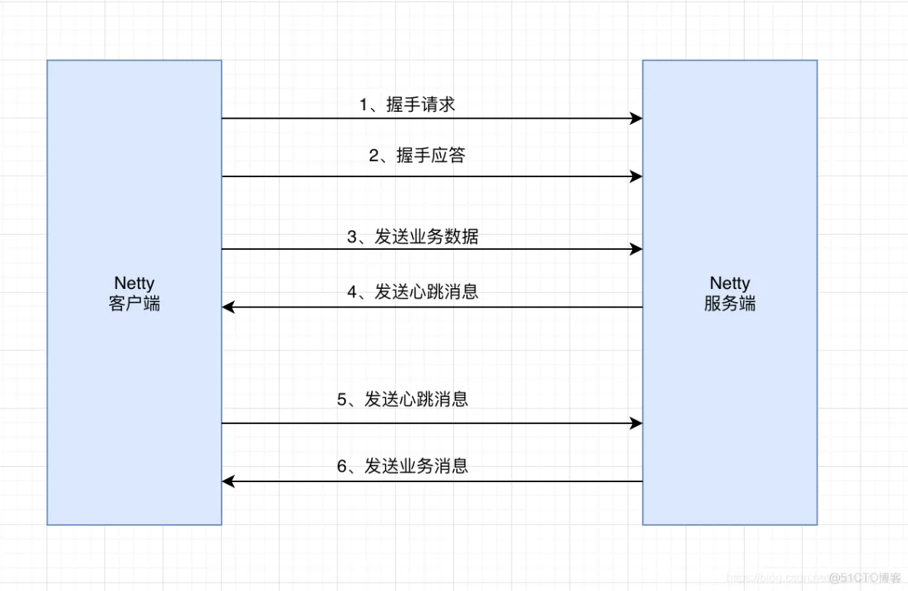

1. 客户端发送握手消息，携带节点ID等有效身份认证信息
2. 服务端对握手请求消息进行合法性校验
    1. 包括节点ID有效性检验
    2. 节点重复校验和IP地址合法性校验
    3. 校验通过后，返回登录成功的握手应答消息
3. 链路建立成功 客户端发送业务数据
4. 服务端发送心跳消息
5. 客户端发送心跳消息
6. 服务端发送业务数据
7. 服务退出时，**服务端关闭连接**，客户端感知对方关闭连接后，**被动关闭客户端连接**
8. Note
    1. 全双工通信：双端都可主动发送消息给对方
    2. 心跳机制：Ping-Pong

#### 消息定义

##### NettyMessage

| 名称   | 类型   | 长度 | 描述                                                 |
| ------ | ------ | ---- | ---------------------------------------------------- |
| header | Header | 变长 | 消息头定义                                           |
| body   | Object | 变长 | 对于**请求消息是方法参数**；对于**响应消息是返回值** |

##### Header

| 名称       | 类型               | 长度 | 描述                                                         |
| ---------- | ------------------ | ---- | ------------------------------------------------------------ |
| crcCode    | int                | 32   | **Netty消息校检码** 由三部分组成<br />1：OxABEF：固定值，表明该消息是协议消息，2个字节 <br />2：主版本号：1 - 255 ，1个字节 <br />3：次版本号：1 - 255， 1个字节 <br />**crcCode = 0xABEF + 主版本号 + 次版本号** |
| length     | int                | 32   | **消息总长度** 包括消息头和消息体                            |
| sessionID  | long               | 64   | **集群节点内全局唯一** 由会话ID生成器生成                    |
| type       | Byte               | 8    | 0: 表示请求消息<br />1: 业务响应消息<br />2: 业务ONE WAY消息(即是请求又是响应消息)<br />3: 握手请求消息<br />4: 握手应答消息<br />5: 心跳请求消息<br />6: 心跳应答消息 |
| priority   | Byte               | 8    | 消息优先级: 0-255                                            |
| attachment | Map<String,Object> | 变长 | 可选字段，用于**扩展消息头**                                 |

#### 编码规范

- crcCode：ByteBuffer.putInt(int value),如果采用其他缓冲区实现，必须与其等价
- length：ByteBuffer.putInt(int value),如果采用其他缓冲区实现，必须与其等价
- sessionID：ByteBuffer.putLong(int value),如果采用其他缓冲区实现，必须与其等价
- type：ByteBuffer.put(byte value),如果采用其他缓冲区实现，必须与其等价
- priority：ByteBuffer.put(byte value),如果采用其他缓冲区实现，必须与其等价
- attachment
    - 如果长度为 0，表示没有可选附件，则将其长度编码为 0，ByteBuffer.put(0)；
    - 如果大于 0，说明有附件需要编码
        - 首先对附件个数进行编码：ByteBuffer.putInt(attachment.size())
        - Key的编码：buffer.writeString(key)
        - Value的编码：转换成 Byte[] 数组，buffer.writeBinary(value)
- body：序列化为 byte[] 数组，然后调用 ByteBuffer.put(byte[] src)，最后重新确定 length 字段，将其重新写进ByteBuffer中

#### 解码规范

- crcCode：ByteBuffer.getInt(),如果采用其他缓冲区实现，必须与其等价
- length：ByteBuffer.getInt(),如果采用其他缓冲区实现，必须与其等价
- sessionID：ByteBuffer.getLong(),如果采用其他缓冲区实现，必须与其等价
- type：ByteBuffer.get(),如果采用其他缓冲区实现，必须与其等价
- priority：ByteBuffer.get(),如果采用其他缓冲区实现，必须与其等价
- attachment：首先 ByteBuffer.getInt() 获取附件的长度
    - 如果为 0，说明附件为空，解码结束
    - 如果不为空，则根据长度进行循环解码
- 获取附件长度：ByteBuffer.getInt()
- Key的解码：buffer.readString()
- Value的解码：buffer.readBinary(), 根据获取的数据在根据解码框架进行反序列化
- body：通过框架对其进行解码

#### 链路建立

客户端界定：A节点需要调用B节点服务但A和B没建立链路->调用方发起连接->**调用方为客户端 被调用方为服务端**

##### 客户端握手请求

- 消息头的type字段值为3
- 可选附件为0
- 消息体为空
- 握手消息的长度为22个字节

##### 服务端握手应答

- 消息头的type字段值为4
- 可选附件个数为0
- 消息体为byte类型的结果
    - 0：认证成功
    - -1：认证失败

**链路建立成功后就可互发业务消息**

#### 链路关闭

客户端/服务端发生以下情况需关闭连接（采用TCP双全工通信，通信双方都要关闭连接）

- 当**对方宕机或者重启**时，会主动关闭链路
    - 当得知对方 REST 链路需要关闭连接
    - 释放自身的句柄等资源
- **消息读写过程中发生了 I/O 异常**，需要主动关闭连接
- **心跳消息读写过程中发生了 I/O 异常**，需要主动关闭连接
- **心跳超时**，需要主动关闭
- 发生**编码异常等不可回复错误**时，需要主动关闭连接

#### 可靠性设计

##### 心跳机制

**Ping-Pong双向心跳机制**保证无论通信**哪一方出现网络故障，都能被即时的检测出来 ** 防止对方短时间没有及时返回应答造成的误判

1. 当网络处于**空闲时间达到 T**（连续周期没有读写消息） 时，**客户端主动发送 Ping**
2. 如果在**下一个周期 T** 到来时**客户端没有收到对方发送的 Pong 心跳应答**，则**心跳失败计数器 +1**
3. **接收到**服务端的**业务消息或者Pong**时，将**心跳计数器清零**
4. **连续N次没有接收到服务端的Pong消息或者业务消息**
    1. **关闭链路，间隔INTERVAL时间后发起重连**操作
5. **服务端网络空闲时间达到T时将心跳计数器+1**
6. **服务端接收到客户端的消息将心跳计数器清零**
7. **连续N次没有接收到服务端的Pong消息或者业务消息**
    1. **关闭链路，等待客户端重连**

##### 重连机制

- **链路中断，等待INTERVAL时间后由客户端发起重连操作**
    - 如果重连失败，间隔周期INTERVAL后再次发起重连，直到重连成功。
- **首次断连时客户端需要等待INTERVAL时间之后再发起重连**，而不是失败后就立即重连
    - 保证服务端能够有充足的时间释放句柄资源
- **重连失败时客户端都必须保证自身的资源被及时释放**，包括但不限于SocketChannel、Socket 等
    - 保证句柄资源能够及时释放
- **重连失败后需要打印异常堆栈信息** 方便后续的问题定位

##### 重复登录保护

当客户端握手成功之后**不允许客户端重复登录** **防止客户端在异常状态下反复重连导致句柄资源被耗尽**

- 服务端接收到客户端的握手请求消息之后对IP地址进行合法性检验
    - 如果校验成功，在缓存的地址表中查看客户端是否已经登录
        - 如果已经登录，则拒绝重复登录，返回错误码-1，同时关闭TCP链路，并在服务端的日志中打印握手失败的原因
- 客户端接收到握手失败的应答消息之后，关闭客户端的TCP连接，等待INTERVAL时间之后再次发起TCP连接，直到认证成功

- 当**服务端连续N次心跳超时之后需要主动关闭链路 清空该客户端的地址缓存信息**
    - 保证后续该客户端可以重连成功，防止被重复登录保护机制拒绝掉
    - 防止由服务端和客户端对链路状态理解不一致导致的客户端无法握手成功

##### 消息缓存重发

- 在**链路恢复之前缓存在消息队列中待发送的消息不能丢失**
- 等**链路恢复之后重新发送这些消息，保证链路中断期间消息不丢失**
- 建议**消息缓存队列设置上限**
    - 当达到上限之后应该拒绝继续向该队列添加新的消息
    - 避免内存溢出

#### 安全性设计

- **内部长连接采用基于IP地址的安全认证机制** 保证整个集群环境的安全
    - **服务端对握手请求消息的IP地址进行合法性校验**
        - 如果在白名单之内，则校验通过
        - 否则，拒绝对方连接
- 放到**公网**中使用，需要采用**更加严格的安全认证机制**
    - 基于密钥和AES加密的用户名+密码认证机制
    - 采用SSL/TSL安全传输

示例程序Netty 协议栈采用最简单的基于IP地址的白名单安全认证机制

#### 可扩展性设计

通过**Netty消息头中的可选附件attachment字段 业务可以在消息头中自定义业务域字段**，如消息流水号、业务自定义消息头等

## Netty原理

### Reactor模式

Reactor模式使用**异步非阻塞I/O：所有I/O操作都不会导致阻塞**

#### Reactor单线程模型

##### 模型介绍

**所有I/O操作**都在**同一个NIO线程**上完成(理论上一个线程可以独立处理所有I/O相关操作)

- **NIO服务端 接收客户端的TCP连接**
- **NIO客户端 向服务端发起TCP连接**
- **读取通信对端的请求/应答消息**
- **想通信对端发送请求/应答消息**

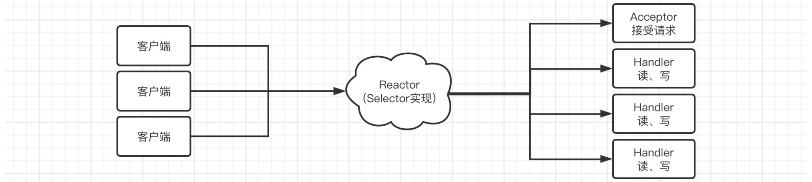

1. **Reactor内部通过selector监控连接事件**
2. **收到事件后通过dispatch进行分发**
    1. **连接建立请求事件由Acceptor处理**：Acceptor通过**accept接受连接**并**创建一个Handler**来处理连接后续的各种事件
    2. **读写事件直接调用连接对应的Handler**来处理
3. **Handler完成read->业务处理(decode->compute->encode)->send的全部流程**

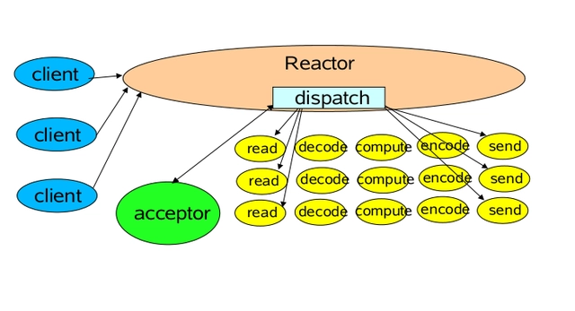

##### Netty单线程模型服务端

```java
NioEventLoopGroup reactorGroup = new NioEventLoopGroup();

try {
    ServerBootstrap bootstrap = new ServerBootstrap();
    bootstrap.group(reactorGroup)
            .channel(NioServerSocketChannel.class)
            ...
```

##### 缺陷

**高负载、大并发的场景下**

- **性能无法支撑一个NIO线程同时处理大量链路**
- **NIO线程负载过重->处理速度变慢->大量客户端连接超时->超时连接重发->加重线程负载->消息积压和处理超时**
- **单线程不可靠：一旦NIO线程意外跑飞/进入死循环->整个系统通信模块不可用->节点故障**

#### Reactor多线程模型

##### 模型介绍

**所有I/O操作都由一组NIO线程**来处理 

- 专门**一个NIO线程(Acceptor)来监听服务端 接收客户端的TCP连接请求**
- 一个**NIO线程池负责网络的读写I/O操作**
    - 由标准JDK线程池实现
    - 包含一个**任务队列**和N个**可用线程(负责消息的读取、编解码、发送)**
- **一个NIO线程可同时处理N条链路 一个链路只对应一个NIO线程 防止并发操作**

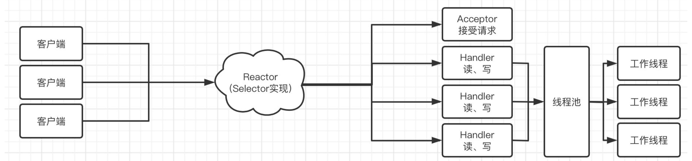

1. **主线程中，Reactor对象通过selector监控连接事件**
2. **收到事件后通过dispatch进行分发**
    1. **连接建立请求事件由Acceptor处理**：Acceptor通过**accept接受连接**并**创建一个Handler**来处理连接后续的各种事件
    2. **Handler只负责响应事件（只进行read读取数据和write写出数据）**
    3. **业务处理交给一个线程池进行处理**
3. **线程池分配一个线程完成真正的业务处理**
4. **线程将响应结果交给主进程的Handler处理**
5. **主进程Handler将结果发给客户端**

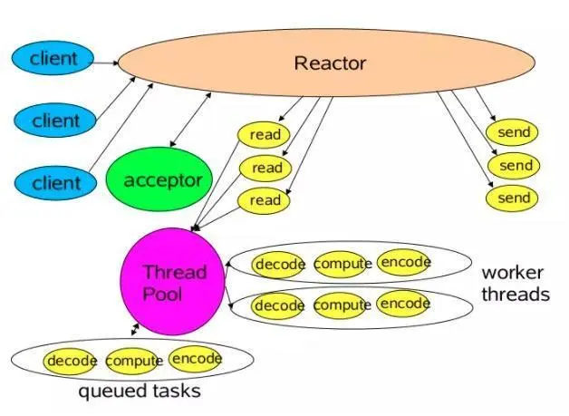

##### Netty多线程模型服务端

```java
NioEventLoopGroup bossGroup = new NioEventLoopGroup(1);
NioEventLoopGroup workerGroup = new NioEventLoopGroup();

try {
    ServerBootstrap bootstrap = new ServerBootstrap();
    bootstrap.group(bossGroup, workerGroup) 
            .channel(NioServerSocketChannel.class)
            ...
```

##### 缺陷

**并发百万客户端连接**/**服务端需对客户端进行安全认证**时会损耗性能 **单个Acceptor线程**可能会存在**性能不足**问题

#### Reactor主从线程模型

##### 模型介绍

**服务端用于接收连接客户端连接更替为一个独立的NIO线程池**

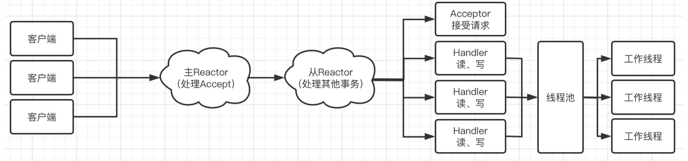

1. 存在**多个Reactor** **每个Reactor都有自己的selector选择器，线程和dispatch**
2. **主线程中的mainReactor**
    1. 通过**自己的selector监控连接建立事件**
    2. **收到事件后通过Accpetor接收 将新的连接分配给某个子线程**
3. **子线程中的subReactor**
    1. **将mainReactor分配的连接加入连接队列中**
    2. 通过自己的selector进行监听，并**创建一个Handler用于处理后续事件**
4. **Handler完成read->业务处理->send的完整业务流程**

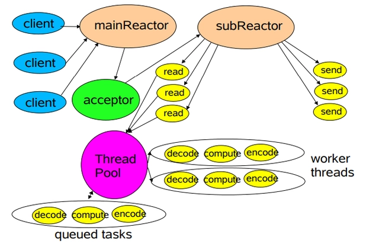

##### Netty主从线程模型服务端

```java
NioEventLoopGroup bossGroup = new NioEventLoopGroup();
NioEventLoopGroup workerGroup = new NioEventLoopGroup();

try {
    ServerBootstrap bootstrap = new ServerBootstrap();
    bootstrap.group(bossGroup, workerGroup) 
            .channel(NioServerSocketChannel.class)
            ...
```

### Netty线程模型

#### 模型介绍

- **服务器启动创建两个NioEventLoopGroup**
    - **bossGroup：一个用于接收客户端请求的Reactor线程池**
        - **接收客户端TCP连接 初始化Channel参数**
        - **链路状态变更事件通知给ChannelPipeline**
    - **workerGroup：一个用于处理I/O操作的Reactor线程池**
        - **异步读取通信对端的数据报 发送读事件到ChannelPipeline**
        - **异步发送消息到通信对端 调用ChannelPipeline的消息发送接口**
        - **执行系统调用Task**
        - **执行定时任务Task(链路空闲检测机制)**
- **启动器绑定端口 将NioServerSocketChannel注册到bossGroup中****
- **客户端连接到服务端**
- **bossGroup接收客户端连接 初始化NioSocketChannel参数**
- **将NioSocketChannel注册到workerGroup线程池中的一个NioEventLoop**
- 每个**NioEventLoop读取到消息直接调用ChannelPipeline的fireChannelRead**
    - 只要用户不切换线程 
    - **就一直由NioEventLoop调用用户的Handler 不进行线程切换**
    - **串行化处理避免多线程导致的锁竞争 性能最优**

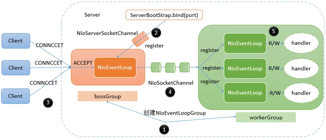

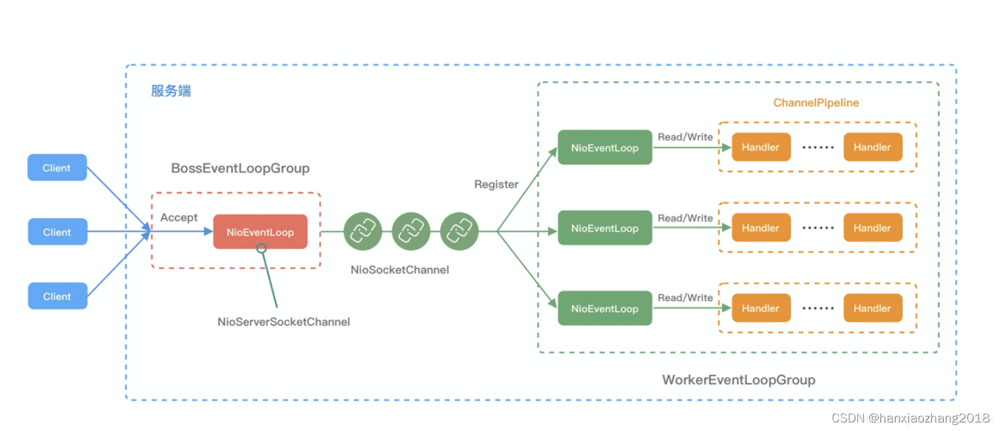

### 服务端创建

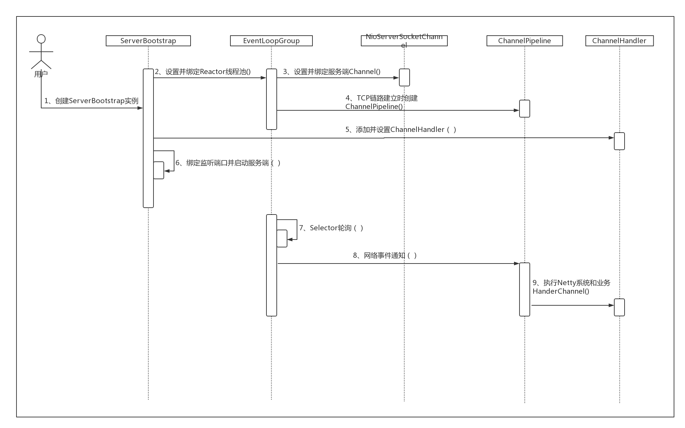

1. **创建`ServerBootstrap`实例**
2. **设置并绑定`Reactor`线程池(创建`EventLoopGroup`)**
3. **设置并绑定`Channel`(创建`ServerSocketChannel`)**
4. **链路建立时创建并初始化`ChannelPipeline`(处理`ChannelHandler`)**
5. **添加并设置`ChannelHandler`**
6. **绑定监听端口并启动服务器(将`ServerSocketChannel`注册到`Selector`上监听客户端连接)**
7. **`Selector`轮询(由`EventLoopGroup`调度和执行 选择就绪`Channel`集合)**
8. **网络事件发生 通知`Selector`轮询到就绪`Channel`**
9. **`EventLoopGroup`执行`ChannelPipeline`响应方法->`ChannelPipeline`调度执行`ChannelHandler`**

### 客户端创建

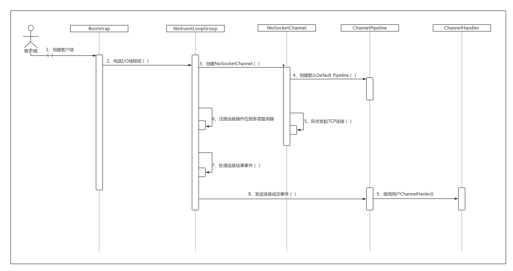

1. **用户线程创建`Bootstrap`实例** 通过API设置创建客户端相关的参数 **异步发起客户端连接**
2. **创建处理客户端连接、I/O读写的Reator线程组`NioEventLoopGroup`**
3. 通过`Bootstrap`的`ChannelFactory`和用户指定的`Channel`类型**创建用于客户端连接的`NioSocketChannel`**
4. **创建默认的`ChannelPipeline`调度和执行网络事件**
5. 异步发起TCP连接，判断连接是否成功
    1. 成功，则直接将NioSocketChannel注册到多路复用器上，监听读操作位，用于数据报读取和消息发送
    2. 没有立即连接成功，则注册连接监听位到多路复用器，等待连接结果
6. **注册对应的网络监听状态位到多路复用器`Selector`**
7. `Selector`在I/O现场中**轮询`Channel `处理连接结果**
8. 客户端连接成功 **设置`Future`结果 发送连接成功事件 触发`ChannelPipeline`执行**
9. **`ChannelPipeline`调度和执行系统和用户的`ChannelHandler`** 执行业务逻辑

### Netty架构分析

#### Netty逻辑架构

分层的架构使得Netty**实现了NIO框架各层间的解耦** **帮助业务协议栈开发和业务逻辑定制**

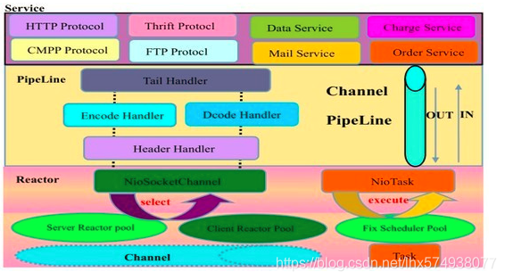

##### Reactor通信调度层

**监听网络的读写和连接操作** 将**网络层的数据读取到内存缓冲区中 触发各种网络事件到Pipeline中** 

由一系列**辅助类组成**

- Reactor 线程**NioEventLoop** 以及其父类
- **NioSocketChannel/NioServerSocketChannel** 以及其父类
- **ByteBuffer** 以及由其衍生出来的各种 Buffer
- **Unsafe** 以及其衍生出的各种内部子类等

##### 职责链ChannelPipeline

**负责事件在职责链中有序的向前/后传播 同时负责动态的编排职责链**

**Pipeline用Handler可以选择监听和处理自己关心的事件 不同的Handler节点功能不同**

##### 业务逻辑编排层(Service ChannelHandler)

- **纯粹的业务逻辑处理**，例如日志、订单处理
- **其他的应用层协议插件**，用于**特定协议相关的会话和链路管理**

#### Netty架构属性

##### 高性能

1. 采用**异步非阻塞的I/IO类库+基于Reactor模式实现** **解决**了同步阻塞I/O一个**服务端无法平滑地处理线性增长的客户端**问题

2. **TCP接收和发送缓冲区使用直接内存代替堆内存** 避免内存复制 提升了I/O读取和写入的性能
3. 支持通过**内存池的方式循环利用ByteBuf** 避免了频繁创建和销毁ByteBuf带来的性能损耗

4. **可配置的I/O线程数、TCP参数**等 为不同的用户场景提供**定制化的调优参数并满足不同的场景**
5. 采用**环形数组缓冲区实现无锁化并发编程** 代替传统的线程安全容器或者锁
    1. 环形缓冲区使用改进的数组版本，缓冲区容量为2的幂
    2. 缓冲区满阻塞生产者，消费者进行消费后，缓冲区又有可用资源，由消费者唤醒生产者
    3. 缓冲区空阻塞消费者，生产者进程生产后，缓冲区又有可用资源，由生产者唤醒消费者   
6. **合理地使用线程安全容器、原子类**等，**提升系统并发处理能力**
7. **关键资源的处理使用单线程串行化**的方式 **避免多线程并发访问带来的锁竞争和额外的CPU资源消耗**问题
8. 通过**引用计数器**及时地申请释放不再被引用的对象+**细粒度的内存管理** **减少频繁GC带来的时延和CPU损耗**

##### 可靠性

1. **链路有效性检测**：为保证长连接的链路有效性 支持周期性心跳检测
    1. **心跳消息通常在链路空闲时发送**
    2. 两种**链路空闲检测机制(连续周期T没消息可读/写触发超时Handler->发送心跳信息->连续N周期没收到主动关闭连接)**
        1. 读空闲超时机制
        2. 写空闲超时机制
2. **内存保护机制**
    1. **对象引用计数器**对Netty的ByteBuf等内置对象**进行细粒度的内存申请和释放** 对非法的对象引用进行检测和保护
    2. 通过**内存池来重用ByteBuf**，节省内存
    3. **可设置的内存容量上限**，包括ByteBuf、线程池线程数等
3. 所有涉及资源操作的地方都增加了**优雅停机**方法
    1. 当**系统退出**时**JVM通过**注册的**Shutdown Hook拦截到退出信号量**
    2. **释放相关模块的资源占用，将缓冲区的消息处理完成或者清空**
    3. 将**待刷新的数据持久化到磁盘或者数据库中** 等到**资源回收和缓冲区消息处理完成后再退出**
    4. 设置一个**最大的超时时间T** 如果**达到T后仍然没有退出** 用**kill -9 pid 强杀**当前的进程

##### 可定制性

1. **责任链模式的ChannelPipeline**便于**业务逻辑的拦截、定制、拓展**
2. **基于接口开发**，关键的类库都提供了接口或者抽象类 **用户可自定义实现相关接口满足需求**
3. **大量工厂类**，通过**重载这些工厂类可以按需创建出用户实现的对象**
4. **大量的系统参数供用户按需设置 增强系统的场景定制性**

##### 可扩展性

**基于Netty的基础NIO**，可以**方便地进行应用层协议的定制** (如基于Netty的**Http**协议、**Dubbo**协议、**RocketMQ**内部私有协议)

### 高性能

#### RPC调用性能分析

##### 传统RPC调用性能差原因

1. **网络传输方式问题：采用同步阻塞I/O** 频繁wait使I/O线程阻塞 I/O处理能力下降
2. **序列化性能差**
    1. **无法跨语言**
    2. **序列化码流大**
    3. **CPU资源占用率高**
3. **线程模型问题：每个TCP连接占用一个线程** 线程资源宝贵 阻塞线程无法释放会导致性能下降

##### I/O通信性能三原则

影响网络服务通信性能的主要因素有：网络I/O模型、线程（进程）调度模型和数据序列化方式

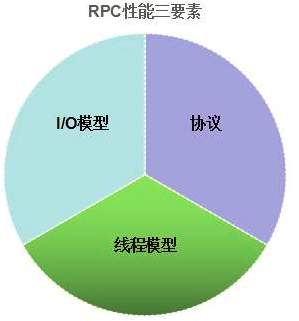

1. **传输（I/O模型）：用什么样的通道将数据发送给对方**
2. **协议：采用什么样的通信协议，HTTP等共有协议或者内部私有协议**
3. **线程：数据如何读取，读取之后的编解码在哪个线程进行，如何派发，Reactor线程模型的不同，对性能影响巨大**

#### 异步非阻塞通信

- **Netty的I/O线程（NioEventLoop）聚合了多路复用器（Selector）**
    - 可以**同时并发处理成百上千的客户端SocketChannel**
    - **读写操作是非阻塞的 充分提升I/O线程运行效率 避免频繁I/O阻塞导致的线程挂起**
- Netty采用**异步通信**模式
    - **一个I/O线程可以并发处理N个客户端链接和读写操作**
    - 从**根本上解决**了**传统同步阻塞IO**"一连接一线程"模型架构的**性能、弹性伸缩能力和可靠性的问题**

#### 高效Reactor线程模型

Netty创造服务端时只需要**调整构造方法参数和线程组实例化个数就可灵活的切换到不同的Reactor线程模型**

#### 无锁化串行

每个**NioEventLoop读取到消息直接调用ChannelPipeline的fireChannelRead**

- 只要用户不切换线程 
- **就一直由NioEventLoop调用用户的Handler 不进行线程切换**
- **串行化处理避免多线程导致的锁竞争 性能最优**

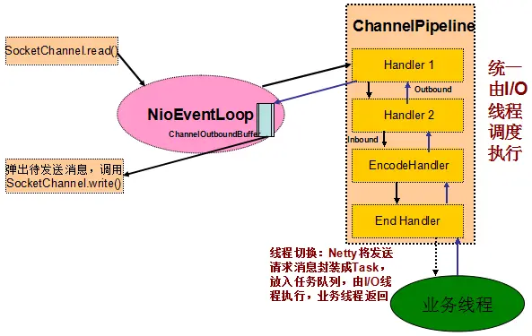

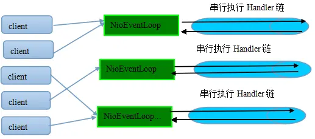

#### 高性能序列化框架

- **Netty默认提供Protobuf支持**
- **用户可扩展Netty编解码接口实现其他高性能序列化框架(如Thrift)**

#### 零拷贝

1. **读写socket的零拷贝**
    1. Netty**默认使用Direct Buffer**来接收/发送ByteBuffer
    2. **ByteBuffer使用堆外直接内存进行socket读写** **不需要进行字节缓冲区的二次拷贝**
    3. 如果使用**传统的堆内存**进行socket读写
        1. **JVM会将堆内存Buffer拷贝到直接内存**
        2. 然后再写入socket中
        3. 消息发送过程**多一次缓冲区内存拷贝**
2. **文件传输的零拷贝**
    1. Netty文件传输类 DefaultFileRegion通过**FileChannel.transferTo()** 将**文件发送到目标Channel中**
    2. **直接把文件缓冲区的内容，发送到目标的Channel中，不需要循环拷贝**
3. **使用CompositeByteBuf的零拷贝**
    1. 将多个ByteBuf封装成一个ByteBuf，对外提供统一封装后的ByteBuf接口
    2. 零拷贝：**在添加ByteBuf时，不需要内存拷贝**

#### 内存池

Netty提供了**基于内存池的缓冲区重用机制** 

1. 通过**RECYCLER.get()循环使用ByteBuf对象**(如果非内存池则新建对象)
2. 从缓冲池获取ByteBuf
3. 调用AbstractReferenceCountedByteBuf**.getRefCnt()设置引用计数器** 用于对象引用计数/垃圾回收

#### TCP灵活调参

对性能影响比较大的TCP配置项

- **SO_RCVBUF和SO_SNDBUF：通常建议值为128KB/256KB**
- **SO_TCPNODELAY：NAGLE算法**
    - 通过将**缓冲区内的小封包，自动相连组成较大的封包 阻止大量小封包的发送阻塞网络** 提高网络应用效率
    - 对于**时延敏感**的应用场景需要**关闭**该优化算法
- **软中断**：如果Linux内核版本支持RPS(2.6.35以上版本)，**开启RPS后可以实现软中断，提升网络吞吐量**

#### 高效并发编程

##### 同步共享可变数据

被synchronized同步的区域具有**共享可变性(某线程修改了可变数据并释放锁后其他线程可以获取可变数据的最新值)**

Netty中**所有类的成员变量必须被正确同步且锁粒度尽可能小**

```java
/**
 * {@link AbstractBootstrap} is a helper class that makes it easy to bootstrap a {@link Channel}. It support
 * method-chaining to provide an easy way to configure the {@link AbstractBootstrap}.
 *
 * <p>When not used in a {@link ServerBootstrap} context, the {@link #bind()} methods are useful for connectionless
 * transports such as datagram (UDP).</p>
 */
public abstract class AbstractBootstrap<B extends AbstractBootstrap<B, C>, C extends Channel> implements Cloneable {
		// LinkedHashMap 非线程安全 所以多线程操作该变量时需要在外部进行必要的同步
    private final Map<ChannelOption<?>, Object> options = new LinkedHashMap<ChannelOption<?>, Object>();

    /**
     * Allow to specify a {@link ChannelOption} 
     * which is used for the {@link Channel} instances once they got created. 
     * Use a value of {@code null} to remove a previous set {@link ChannelOption}.
     */
    public <T> B option(ChannelOption<T> option, T value) {
      	// 传参合法性判断不需要加锁
        ObjectUtil.checkNotNull(option, "option");
      	// 对判断分支枷锁 保证锁的最细粒度
        synchronized (options) {
          	// 
            if (value == null) {
                options.remove(option);
            } else {
                options.put(option, value);
            }
        }
        return self();
    }
  
  ...
```

##### 锁应用

- **wait方法用来使线程等待某个条件 必须在同步块(锁定当前对象实例)内调用**
- **始终使用while循环调用wait方法**：其他线程如果在不满足唤醒条件时被notifyAll()方法意外唤醒会破坏锁约束关系
- **notify方法：处于等待的所有线程都在等待同一个条件 每次只有一个线程可以从该条件中唤醒**
- notifyAll方法：唤醒所有等待线程
- **多个线程共享同一个变量时 每个读写操作都必须加锁进行同步**

##### volatile应用

**volatile(线程可见/禁止指令重排)适合一个线程写 多个线程读的场景**

```java
public final class NioEventLoop extends SingleThreadEventLoop {
    ...
    // volatile变量
    private volatile int ioRatio = 50;
    ...
    // 更改ioRatio的公共方法 NioEventLoop没有调用该方法 调整I/O执行时间是外部(业务线程)发起的操作
    // 形成一个线程(业务线程)写 多个线程读(NioEventLoop)的场景
    public void setIoRatio(int ioRatio) {
        if (ioRatio <= 0 || ioRatio > 100) {
            throw new IllegalArgumentException("ioRatio: " + ioRatio + " (expected: 0 < ioRatio <= 100)");
        }
        this.ioRatio = ioRatio;
    }
```

##### CAS和原子类应用

**CAS+原子类可避免同步锁带来的并发访问性能降低**问题

```java
public final class ChannelOutboundBuffer {
  	// 实现totalPendingSize的原子更新 保证totalPendingSize多线程修改并发安全性
    private static final AtomicLongFieldUpdater<ChannelOutboundBuffer> TOTAL_PENDING_SIZE_UPDATER =
            AtomicLongFieldUpdater.newUpdater(ChannelOutboundBuffer.class, "totalPendingSize");
		// volatile变量保证某个线程对于totalPendingSize修改可被其他线程立刻访问
    private volatile long totalPendingSize;
  
  	while (!TOTAL_PENDING_SIZE_UPDATER.compareAndSet(this, oldValue, newValue)) {
      	oldValue = totalPendingSize;
      	newValue = oldValue + size;
    }

```

##### 线程安全类应用

Netty应用了JUC内置线程安全类 **对线程安全类的实例进行读写操作不需要加锁**

##### 读写锁应用

**读写锁适用于读多写少场景 可重入且可降级 可设置公平锁**

```java
public abstract class ReferenceCountedOpenSslContext extends SslContext implements ReferenceCounted {
    public final long sslCtxPointer() {
        Lock readerLock = ctxLock.readLock();
        readerLock.lock();
        try {
            return SSLContext.getSslCtx(ctx);
        } finally {
            readerLock.unlock();
        }
    }
      public final void setPrivateKeyMethod(OpenSslPrivateKeyMethod method) {
        ObjectUtil.checkNotNull(method, "method");
        Lock writerLock = ctxLock.writeLock();
        writerLock.lock();
        try {
            SSLContext.setPrivateKeyMethod(ctx, new PrivateKeyMethod(engineMap, method));
        } finally {
            writerLock.unlock();
        }
    }
```

##### 不要依赖线程优先级

程序**不能依赖JDK自带的线程优先级来保证执行顺序/比例/策略**

### 高可靠性

#### Netty可靠性需求

- **应用场景**
    - **RPC框架的基础网络通信框架(分布式节点的通信/数据交换)**
    - **私有协议的基础通信框架**
    - **公有协议的基础通信框架**
    - 出现bug后果严重
        - 重启应用
        - 业务中断
- **运行环境**
    - 各地**网络环境**不同 可能会出现闪断/网络单通
    - 恶劣网络环境导致底层故障降低Netty复用性

#### Nerry高可靠性设计

##### 网络通信类故障

###### 客户端连接超时

- NIO非阻塞模式
    - 会直接返回连接结果
    - 没有连接成功/发生IO异常->将SocketChannel注册到Selector上监听连接结果
    - 异步连接超时，无法在API层面直接设置->定时器来主动监测
    - NIO类库没提供现成的连接超时接口 需要NIO框架或者用户自己封装实现
- **Netty支持客户端连接超时**
    - **创建客户端时支持配置连接超时时间**-> **发起连接**
    - 根据超时时间创建**ScheduledFuture**并将其**挂载到Reactor线程** 用于**定时监测是否发生链接超时**
    - 创建完连接超时的定时任务后，会有**NioEventLoop负责执行**
    - **已经连接超时，但是服务端仍然没有返回TCP握手应答**-> **关闭连接**
    - **超时期限内处理完任务则取消连接超时的定时任务**

###### 通信对端强制关闭连接

双端通信过程中如发生网络闪断、对方进程突然宕机或者其他**非正常关闭链路事件**时->**TCP链路就会发生异常**

**TCP是全双工**的 **通信双方都需要关闭和释放Socket句柄**才不会发生资源泄漏

**Netty将所有IO异常上抛交给NioByteUnsafe统一处理**

###### 链路关闭

- NIO编程的一种**误区**：认为只要是**对方关闭连接，就会发生IO异常**，捕获IO异常之后再关闭连接即可
- 实际上，**连接的合法关闭不会发生IO异常，它是一种正常场景，如果遗漏了该场景的判断和处理就会导致连接句柄泄漏**
- 如果SocketChannel被设置为非阻塞 其read操作可能返回三个值

    - 大于0：表示读取到了字节数

    - 等于0：没有读取到消息，可能TCP处于Keep-Alive状态，接收到的是TCP握手消息

    - -1：连接已经被对方关闭
- **Netty通过判断Channel.read操作的返回值进行不同的逻辑处理**
    - **返回-1**--链路已经关闭，**调用closeOnRead() 关闭句柄 释放资源**
    - **任意一方主动关闭连接不属于异常**场景 **不产生Exception**事件通知Pipeline

###### 定制IO故障

特殊场景下用户可能需要感知这些异常，并针对这些异常进行定制处理 如

- 客户端的断连重连机制

- 消息的缓存重发

- 接口日志中详细记录故障细节

- 运维相关功能，例如告警、触发邮件/短信等


Netty的I/O异常处理策略(**保证了异常处理的安全性**同时向上层**提供了灵活的定制能力**)

- 在发生IO异常时，**底层的资源由Netty负责释放** 将异常堆栈信息以事件的形式通知给上层用户
- 用户对IO异常进行定制
- **Netty支持用户自定义处理IO异常具体实现的接口：ChannelHandlerAdapter.exceptionCaught()**

##### 链路有效性检测

###### 心跳检测机制

心跳检测**目的**：**确认当前链路可用、对方存活且能够正常接收和发送消息**

心跳检测机制的**三个层面**

- **TCP层面的心跳检测**：即**TCP的Keep-Alive机制** 作用域是整个TCP协议栈
- **协议层的心跳检测**：主要存在于**长连接协议**中
- **应用层的心跳检测**：主要由各**业务产品通过约定方式定时给对方发送心跳消息**实现

心跳检测机制的**分类**

- **Ping-Pong型心跳**(“请求-响应型”)
    - 由通信一方定时发送Ping消息
    - 对方接收到Ping消息之后
    - 立即返回Pong应答消息给对方
- **Ping-Ping型心跳**(“双向型”)
    - 不区分心跳请求和应答
    - 由通信双方按照约定
    - 定时向对方发送心跳Ping消息

心跳检测的**策略**

1. **心跳超时：连续N次心跳检测都没有收到对方的Pong应答消息或者Ping请求消息**，则认为**链路已经发生逻辑失效**
2. **心跳失败：读取和发送心跳消息时直接发生了IO异常**，说明**链路己经失效**
3. 无论发生心跳超时还是心跳失败，**都需要关闭链路**，由客户端发起重连操作，保证链路能够恢复正常


**心跳检测原理示意图**

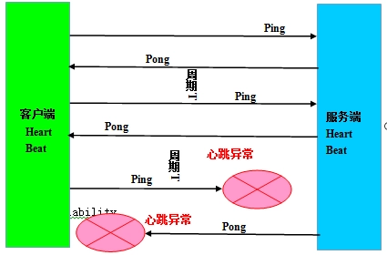

###### Netty的心跳检测机制

Netty的心跳检测的**实现**：利用**链路空闲检测机制**

Netty空闲检测机制的**分类**

- 读空闲：链路持续时间T，没有读取到任何消息 触发超时Handler进行链路检测

- 写空闲：链路持续时间T，没有发送任何消息 触发超时Handler进行链路检测

- 读写空闲：链路持续时间T，没有接收或者发送任何消息
    - Netty的**默认读写空闲机制是发生超时异常时关闭连接** 可自定义超时逻辑支持不同的用户场景

**Netty框架实现**的**心跳检测Handler**

- IdleStateHandler：可以处理读、写、读写空闲事件的超时，在超时之后，会触发用户 handler 的 userEventTriggered()

- ReadTimeoutHandler：在指定的时间内没有数据被读取，则抛出一个异常，并且断开通道的链接

- WriteTimeoutHandler：在指定时间内写操作没有完成，则直接抛出一个异常，并且断开通道的链接


**链路空闲时，并没有关闭链路，而是触发IdleStateEvent事件** 用户可以订阅IdleStateEvent事件，自定义逻辑处理

##### Reactor线程保护

**Reactor线程是IO操作的核心，NIO框架的发动机**

一旦出现故障，将会导致挂载在其上面的多路用复用器和多个链路无法正常工作

###### 谨慎处理异常

- 为了**防止仅捕获IO异常会导致Reactor线程跑飞**
- 在**循环体内一定要捕获Throwable**
    - 发生意外异常线程不会跑飞
    - **休眠1s防止死循环导致的异常绕接 然后继续恢复执行**
        - 某消息异常不应导致整条链路不可用
        - 某链路不可用不应导致其他链路不可用
        - 某进程不可用不应导致其他集群节点不可用

###### 规避NIO BUG

**Netty解决NIO BUG策略**

1. **根据BUG特征 首先侦测该BUG是否发生**
2. **将问题Selector上注册的Channel转移到新建的Selector上**
3. **关闭问题Selector 使用新建Selector替换**

Netty提供了一种检测机制**判断线程是否可能陷入空轮询**

- **每次执行Select**操作之前**记录当前时间**currentTimeNanos
- time - TimeUnit.MILLISECONDS.toNanos(timeoutMillis) >= currentTimeNanos
    - 如果事件轮询的持续时间大于等于 timeoutMillis 说明是正常的
    - **事件轮询的持续时间小于 timeoutMillis** 表明阻塞时间并未达到预期，可能**触发了空轮询的Bug**
- Netty引入了计数变量 selectCnt
    - 在正常情况下，selectCnt 会重置，否则会对selectCnt自增计数
    - 当 selectCnt达到SELECTOR_AUTO_REBUILD_THRESHOLD（默认512） 阈值时，会触发重建 Selector 对象

##### 内存保护

1. **链路总数控制**：**每条链路都包含收发缓冲区** 链路过多会导致内存溢出
2. **单个缓冲区的上限控制**：防止非法长度/消息过大导致内存溢出
3. **缓冲区内存释放**：防止缓冲区使用不当导致的内存溢出
    1. **缓冲区内存泄漏保护**
        1. Netty引入了内存池/对象池 对象的生命周期作为全局引用由内存池管理 
        2. **内存申请/使用/释放**时Netty自动**进行引用计数检测** 防止非法使用内存
        3. 防止用户遗漏导致的内存泄漏 Netty在**Pipeline的TailHandler中自动对内存进行释放**
    2. **缓冲区内存溢出保护**
        1. **对消息进行解码时，需要创建缓冲区** 缓冲区的创建方式通常有两种
            1. **容量预分配** 在实际读写过程中如果不够再扩展
            2. 根据**协议消息长度创建缓冲区**
        2. Netty提供了编解码框架 **对缓冲区进行上限保护**
            1. **内存分配时指定缓冲区长度上限**
            2. **对缓冲区写入时 判断最大容量**
                1. 容量不足：扩展
                2. 扩展后容量超过上限：拒绝扩展
            3. **消息解码 判断消息长度**
                1. 超过最大容量上限：抛出解码异常 拒绝分配内存
4. **NIO消息发送队列长度上限控制**

##### 流量整形

流量整形(traffic shaping)是一种**主动调整流量输出速率**的措施

###### 流量整形 vs 流量监管

- **流量整形对流量监管中需要丢弃的报文进行缓存**
    - 通常是将丢弃的报文放入缓冲区或队列内 
    - 当令牌桶有足够的令牌时，再均匀的向外发送这些被缓存的报文
- **整形可能会增加延迟**  **监管几乎不引入额外的延迟**

###### Netty的流量整形

- 原理
    - **计算每次读取到的ByteBuf可写字节数**
    - **获取当前报文流量与流量整形阈值对比**
        - **当前报文流量>=流量整形阈值**
            - **计算等待时间delay 将ByteBuf放入定时任务Task缓存**
            - **定时任务线程池在延迟delay后继续处理ByteBuf**
            - Note：定时任务延时时间根据检测周期和流量整形阈值计算
- 目的
    - **防止由于上下游网元性能不均衡导致下游网元被压垮，业务流程中断**
    - **防止由于通信模块接收消息过快，后端业务线程处理不及时**导致的“撑死”问题
- 特点
    - **不拒绝/丢弃消息**
    - **阈值limit越大精度越高**
- 全局流量整形
    - 作用域：进程级/所有Channel
- 链路级流量整形
    - 作用域：单个链路
    - 可对不同链路设置不同(可自定义)整形策略

##### 优雅停机接口

Netty在所有涉及资源操作的地方都提供了**优雅停机**接口

1. 当**系统退出**时**JVM通过**注册的**Shutdown Hook拦截到退出信号量**
2. **释放相关模块的资源占用，将缓冲区的消息处理完成或者清空**
3. 将**待刷新的数据持久化到磁盘或者数据库中** 等到**资源回收和缓冲区消息处理完成后再退出**
4. 设置一个**最大的超时时间T** 如果**达到T后仍然没有退出** 用**kill -9 pid 强杀**当前的进程

#### 优化建议

##### 控制发送队列容量上限

- Netty的NIO消息发送队列**ChannelOutboundBuffer没有容量限制**
- 如果**网络对端处理速度慢->TCP划窗长时间为0/消息发送速度过快/大->ChannelOutboundBuffer内存膨胀->系统内存溢出**
- 优化：**在启动客户端/服务端时 在启动项的ChannelOption设置发送队列的长度/通过-D启动参数配置该长度**

##### 回推发送失败的消息

- **网络发生故障时Netty会关闭链路** 循环释放(**销毁)尚未发送的消息** 通知监听listener
- 用户不关心底层网络IO异常 **希望链路恢复时将尚未发送的消息重发给对端** 不销毁
- 优化：使用**RPC框架**
    - **缓存重发策略：尚未发送成功的消息自动缓存**
    - **失败删除策略：尚未发送成功的消息自动销毁**

### 源码分析

#### 服务端启动

##### 创建线程组

###### NioEventLoopGroup

- **Reactor线程池**
- 负责**调度和执行具体的任务**
    - client接入
    - 网络读写事件处理
    - 用户自定义任务
    - 定时任务
- **管理EventLoop的生命周期**

###### ServerBootstrap

**ServerBootstrap实例中需要两个NioEventLoopGroup实例** 按照职责划分成boss和worker有着不同的分工

```java
// boss负责请求的accept
EventLoopGroup bossGroup = new NioEventLoopGroup();
// worker负责请求的read、write
EventLoopGroup workerGroup = new NioEventLoopGroup();
```

通过**ServerBootstrap的group方法将两个EventLoopGroup实例传入**

```java
    public ServerBootstrap group(EventLoopGroup parentGroup, EventLoopGroup childGroup) {

        //1. 调用父类的group方法传入parentGroup
        super.group(parentGroup);

        //2. 设置childGroup
        if (childGroup == null) {
            throw new NullPointerException("childGroup");
        }
        if (this.childGroup != null) {
            throw new IllegalStateException("childGroup set already");
        }
        this.childGroup = childGroup;

        return this;
    }
```

**只传一个参数，则2个线程池会被重用**

```java
    public ServerBootstrap group(EventLoopGroup group) {
        return group(group, group);
    }
```

##### 设置服务端Channel用于端口监听和客户端链路接入

Netty通过**Channel工厂类**ReflectiveChannelFactory**根据传入的channel class创建对应的服务端Channel**

**服务端需要创建NioServerSocketChannel**

```java
public class ReflectiveChannelFactory<T extends Channel> implements ChannelFactory<T> {
  
    private final Class<? extends T> clazz;

    public ReflectiveChannelFactory(Class<? extends T> clazz) {
        if (clazz == null) {
            throw new NullPointerException("clazz");
        }
        this.clazz = clazz;
    }

    @Override
    public T newChannel() {
        try {
            return clazz.newInstance();
        } catch (Throwable t) {
            throw new ChannelException("Unable to create Channel from class " + clazz, t);
        }
    }

    @Override
    public String toString() {
        return StringUtil.simpleClassName(clazz) + ".class";
    }
}
```

##### 设定服务端TCP参数

Netty使用一个**LinkedHashMap来保存参数**

```java
private final Map<ChannelOption<?>, Object> options = new LinkedHashMap<ChannelOption<?>, Object>();
```

**主要参数是TCP的backlog参数**，底层C对应的接口为

```java
int listen(int fd, int backlog);
```

**backlog指定了内核为此套接字接口排队的最大连接个数** 规定**未连接队列和已连接队列总和的最大值**

内核要为**套接字维护2个队列：未连接队列和已连接队列（根据TCP三路握手的三个分节分隔这2个队列）** 

- 服务器处于listen状态时，**收到客户端SYN分节(connect)时在未完成队列中创建一个新的条目**
- 用三路握手的第二个分节即**服务器的SYN响应客户端** 在**第三个分节到达前一直保留在未完成队列中**
- **三路握手完成** 从未完成连接队列搬到**已完成队列尾部**
- 当进程调用accept时，从已完成队列中的头部取出一个条目给进程
- 当**已完成队列为空时进程将进入睡眠**，直到有条目在已完成队列中才唤醒

Note：backlog大多数实现值为5，但是在高并发场景中显然不够 需要设置此值更大原因是未完成连接队列可能因为**客户端syn的到达以及等待握手第三个分节的到达延时而增大** Netty默认是100，用户可以调整

##### 为启动辅助类和其父类分别指定Handler

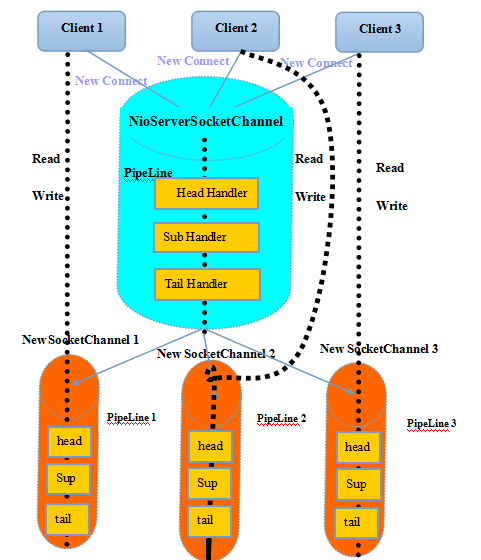

- **ServerBootstrap中的Handler是NioServerSocketChannel使用**的，**所有连接该监听端口的客户端都会执行它**
- **父类AbstractBootstrap中的Handler是个工厂类**为**每个新接入的客户端都创建一个新的Handler**

##### 绑定本地端口，启动服务

```java
    private ChannelFuture doBind(final SocketAddress localAddress) {
    		// 1. 调用initAndRegister方法创建Channel
        final ChannelFuture regFuture = initAndRegister();
        final Channel channel = regFuture.channel();
        if (regFuture.cause() != null) {
            return regFuture;
        }
				// 
        if (regFuture.isDone()) {
            // At this point we know that the registration was complete and successful.
            ChannelPromise promise = channel.newPromise();
            doBind0(regFuture, channel, localAddress, promise);
            return promise;
        } else {
            // Registration future is almost always fulfilled already, but just in case it's not.
            final PendingRegistrationPromise promise = new PendingRegistrationPromise(channel);
            regFuture.addListener(new ChannelFutureListener() {
                @Override
								// 
                public void operationComplete(ChannelFuture future) throws Exception {
                    Throwable cause = future.cause();
                    if (cause != null) {
                        // Registration on the EventLoop failed so fail the ChannelPromise directly to not cause an
                        // IllegalStateException once we try to access the EventLoop of the Channel.
                        promise.setFailure(cause);
                    } else {
                        // Registration was successful, so set the correct executor to use.
                        promise.registered();
                        doBind0(regFuture, channel, localAddress, promise);
                    }
                }
            });
            return promise;
        }
    }
```

```java
    final ChannelFuture initAndRegister() {
        Channel channel = null;
        try {
        		// 创建NioServerSocketChannel
            channel = channelFactory.newChannel();
            init(channel);
        } catch (Throwable t) {
         ...
    }
```

```java
		void init(Channel channel) throws Exception{
      final Map<ChannelOption<?>, Object> options = options0();
        synchronized (options) {
            channel.config().setOptions(options);
        }
        final Map<AttributeKey<?>, Object> attrs = attrs0();
        synchronized (attrs) {
          	// 设置Socket参数和NioServerSocketChannel附加属性
            for (Entry<AttributeKey<?>, Object> e: attrs.entrySet()) {
                @SuppressWarnings("unchecked")
                AttributeKey<Object> key = (AttributeKey<Object>) e.getKey();
                channel.attr(key).set(e.getValue());
            }

        }
    }
       
```

```java
p.addLast(new ChannelInitializer<Channel>() {
            @Override
            public void initChannel(Channel ch) throws Exception {
                final ChannelPipeline pipeline = ch.pipeline();
              	// 将AbstractBootstrap的Handler添加到NioServerSocketChannel的ChannelPipeline中
                ChannelHandler handler = config.handler();
                if (handler != null) {
                    pipeline.addLast(handler);
                }
                // We add this handler via the EventLoop as the user may have used a ChannelInitializer as handler.
                // In this case the initChannel(...) method will only be called after this method returns. Because
                // of this we need to ensure we add our handler in a delayed fashion so all the users handler are
                // placed in front of the ServerBootstrapAcceptor.
                ch.eventLoop().execute(new Runnable() {
                    @Override
                    public void run() {
                      	// 将用于服务端注册的Handler ServerBootstrapAcceptor添加到ChannelPipeline中
                        pipeline.addLast(new ServerBootstrapAcceptor(
                                currentChildGroup, currentChildHandler, currentChildOptions, currentChildAttrs));
                    }
                });
            }
        });
```

以上**Netty服务端监听的相关资源已经初始化完毕**

##### 注册NioServerSocketChannel到Reactor线程的多路复用器上，然后轮询客户端连接事件

**NioServerSocketChannel的ChannelPipeline的组成**


```java
public final void register(EventLoop eventLoop, final ChannelPromise promise) {
						// 是否是NioEventLoop自身发起的操作
            if (eventLoop.inEventLoop()) {
								// 是 不存在并发操作 直接执行Channel注册
                register0(promise);
            } else {
								// 不是 由其它线程发起 则封装成一个Task放入消息队列中异步执行
                try {
                    eventLoop.execute(new Runnable() {
                        @Override
                        public void run() {
                            register0(promise);
                        }
                    });
                } catch (Throwable t) {
								...
```

```java
        // 是由ServerBootstrap所在线程执行的注册操作，所以会将其封装成Task投递到NioEventLoop中执行
        private void register0(ChannelPromise promise) {
            try {
                // check if the channel is still open as it could be closed in the mean time when the register
                // call was outside of the eventLoop
                if (!promise.setUncancellable() || !ensureOpen(promise)) {
                    return;
                }
                boolean firstRegistration = neverRegistered;
                doRegister();
                neverRegistered = false;
                registered = true;
                // Ensure we call handlerAdded(...) before we actually notify the promise
              	// This is needed as the
                // user may already fire events through the pipeline in the ChannelFutureListener.
                pipeline.invokeHandlerAddedIfNeeded();
                safeSetSuccess(promise);
                pipeline.fireChannelRegistered();
                // Only fire a channelActive if the channel has never been registered	
              	// This prevents firing
                // multiple channel actives if the channel is deregistered and re-registered.
                if (isActive()) {
                    if (firstRegistration) {
                        pipeline.fireChannelActive();
                    } else if (config().isAutoRead()) {
                        // This channel was registered before and autoRead() is set. 
                      	// This means we need to begin read
                        // again so that we process inbound data.
                        beginRead();
                    }
                }
            } catch (Throwable t) {
						...
```

```java
    protected void doRegister() throws Exception {
        boolean selected = false;
        for (;;) {
            try {
              	// 将NioServerSocketChannel注册到NioEventLoop的Selector上
                selectionKey = javaChannel().register(eventLoop().selector, 0, this);
                return;
            } catch (CancelledKeyException e) {
						...
```

**0表示只注册，不监听任何网络操作**

- **注册方法是多态**的
    - 既**可被NioServerSocketChannel用来监听客户端的连接接入**
    - 也**可用来注册SocketChannel，用来监听网络读或者写操作**
- 通过**SelectionKey的interestOps(int ops)方法可以方便的修改监听操作位**
    - 此处注册需要获取SelectionKey并给AbstractNioChannel的成员变量selectionKey赋值

```java
                safeSetSuccess(promise);
								// 注册成功之后，触发ChannelRegistered事件
                pipeline.fireChannelRegistered();
```

- Netty的**HeadHandler不需要处理ChannelRegistered事件**，所以直接调用下一个Handler
- 当**ChannelRegistered事件传递到TailHandler后结束**，**TailHandler也不关心ChannelRegistered事件**
- ChannelRegistered事件传递完成后，**判断ServerSocketChannel监听是否成功**
    - 成功，需要**触发NioServerSocketChannel的ChannelActive事件**，判断方法即isActive().

```java
                // Only fire a channelActive if the channel has never been registered. 
                // This prevents firing
                // multiple channel actives if the channel is deregistered and re-registered.
								// isActive()多态方法
								// 如果是服务端则判断监听是否启动
								// 如果是客户端，判断TCP连接是否完成
                if (isActive()) {
                    if (firstRegistration) {
                        pipeline.fireChannelActive();
                    } else if (config().isAutoRead()) {
                        // This channel was registered before and autoRead() is set. This means we need to begin read
                        // again so that we process inbound data.
                        beginRead();
                    }
                }
```

**ChannelActive**事件在**ChannelPipeline**()传递，完成之后根据配置决定是否自动触发Channel的读操作

```java
        public final void beginRead() {
            assertEventLoop();
            if (!isActive()) {
                return;
            }
            try {
								// 读方法 多态 不同类型的Channel对读的准备工作不同
                doBeginRead();
            } catch (final Exception e) {
						...
        }
```

NIO通信中**双端都要设置网络监听操作位为自己感兴趣**的

```java
 @Override
    protected void doBeginRead() throws Exception {
        // Channel.read() or ChannelHandlerContext.read() was called
      	// NioServerSocketChannel感兴趣的是OP_ACCEPT(16) 修改操作位
        final int interestOps = selectionKey.interestOps();
      	// 某些情况下，当前监听的操作类型和Channel关心的网络事件是一致的，不需要重复注册，所以增加了&的判断
        if ((interestOps & readInterestOp) == 0) {
            selectionKey.interestOps(interestOps | readInterestOp);
        }
    }
```

SelectionKey有4种操作类型 用int标识 **每个操作位代表一种网络操作类型** 提升操作性能

1. OP_READ = 1 << 0
2. OP_WRTE = 1 << 2
3. OP_CONNECT = 1 << 3
4. OP_ACCEPT = 1 << 4

#### 客户端接入

```java
    private void processSelectedKeys() {
        if (selectedKeys != null) {
          // 当多路复用器Selector检测到新的Channel时默认执行processSelectedKeysOptimized方法·
            processSelectedKeysOptimized(selectedKeys.flip());
        } else {
            processSelectedKeysPlain(selector.selectedKeys());
        }
    }
```

```java
            if (a instanceof AbstractNioChannel) {
								// Channel的Attachment是NioServerSocketChannel，所以执行processSelectedKey方法
                processSelectedKey(k, (AbstractNioChannel) a);
            } else {

                @SuppressWarnings("unchecked")

                NioTask<SelectableChannel> task = (NioTask<SelectableChannel>) a;

                processSelectedKey(k, task);

            }
```

```java
 // 由于监听的是连接操作，会执行unsafe.read()方法
 // 不同的Channel执行不同的操作 NioUnsafe被设计为接口
        public void read() {
            final ChannelConfig config = config();
            final ChannelPipeline pipeline = pipeline();
            final RecvByteBufAllocator.Handle allocHandle = unsafe().recvBufAllocHandle();
            allocHandle.reset(config);
            boolean closed = false;
            Throwable exception = null;

            try {
                try {
                    do {
                      	// 接受新的客户端连接并且创建NioSocketChannel
                        int localRead = doReadMessages(readBuf);
                        if (localRead == 0) {
                            break;
                        }
                      　...
    }
```

```java
   protected int doReadMessages(List<Object> buf) throws Exception {
     		// 接受新的客户端连接并且创建NioSocketChannel
        SocketChannel ch = javaChannel().accept();
        try {
            if (ch != null) {
                buf.add(new NioSocketChannel(this, ch));
                return 1;
            }
    }
```

```java
                // 接收到新的连接之后，触发ChannelPipeLine的ChannelRead方法
                int size = readBuf.size();
                for (int i = 0; i < size; i ++) {
                    readPending = false;
                    pipeline.fireChannelRead(readBuf.get(i));

                }
```

```java
        // 触发pipeLine调用链，事件在ChannelPipeline中传递
				// 执行ServerBootstrapAcceptor中的channelRead方法
        public void channelRead(ChannelHandlerContext ctx, Object msg) {
            final Channel child = (Channel) msg;
						// (1) 加入childHandler到客户端SocketChannel的ChannelPipeline中
            child.pipeline().addLast(childHandler); 
						...
　　　　　　　// (2) 设置SocketChannel的TCP参数
            for (Entry<AttributeKey<?>, Object> e: childAttrs) {
                child.attr((AttributeKey<Object>) e.getKey()).set(e.getValue());
            }
　　　　　　　　// (3) 注册SocketChannel到多路复用器
            try {
								// register注册也是注册操作位为0
                childGroup.register(child).addListener(new ChannelFutureListener() {
                    @Override
                    public void operationComplete(ChannelFuture future) throws Exception {
                        if (!future.isSuccess()) {
                            forceClose(child, future.cause());
                        }
                    }
                });
            } catch (Throwable t) {
						...
```

执行完注册后，紧接着会**触发ChannelReadComplete事件**

Netty的Header和Tailer本身不关心这个事件，因此**ChannelReadComplete是直接透传**

执行完ChannelReadComplete后，接着执行**PipeLine的read()方法**

最终到**HeadHandler的read()方法把操作位修改OP_READ**

**客户端连接处理完成，可以进行网络读写等I/O操作**

#### 客户端创建

##### 客户端连接辅助类Bootstrap

###### 设置I/O线程组

**只需要一个线程组EventLoopGroup**

###### TCP参数设置

```java
    public <T> B option(ChannelOption<T> option, T value) {
        if (option == null) {
            throw new NullPointerException("option");
        }
        if (value == null) {
            synchronized (options) {
                options.remove(option);
            }
        } else {
            synchronized (options) {
              	// 设置TCP参数
                options.put(option, value);
            }
        }
        return (B) this;
    }
```

主要TCP参数

- **SO_TIMEOUT: 控制读取操作将阻塞多少毫秒**，如果返回值为**0** 计时器就被禁止 该**线程将被无限期阻塞**
- **SO_SNDBUF**: 套接字使用的**发送缓冲区大小**
- **SO_RCVBUF**: 套接字使用的**接收缓冲区大小**
- **SO_REUSEADDR : 是否允许重用端口**
- **CONNECT_TIMEOUT_MILLIS: 客户端连接超时时间** Netty使用的是**自定义连接超时定时器检测和超时控制**
- **TCP_NODELAY : 是否使用Nagle算法**

###### channel接口

同样**使用反射创建NioSocketChannel**

###### 设置Handler接口

Bootstrap为了简化Handler的编排，提供了ChannelInitializer，当**TCP链路注册成功后**，调用initChannel接口设置Handler接口

```java
    public final void channelRegistered(ChannelHandlerContext ctx) throws Exception {
        if (initChannel(ctx)) {
            ctx.pipeline().fireChannelRegistered();
        } else {
            ctx.fireChannelRegistered();
        }
    }
```

```java
    private boolean initChannel(ChannelHandlerContext ctx) throws Exception {
        if (initMap.putIfAbsent(ctx, Boolean.TRUE) == null) { // Guard against re-entrance.
            try {
                initChannel((C) ctx.channel());
            } catch (Throwable cause) {
            ...
    }
```

##### 客户端连接操作

```java
ChannelFuture f = b.connect(host, port).sync();
```

###### 创建和初始化NioSocketChannel

```java
    private ChannelFuture doResolveAndConnect(final SocketAddress remoteAddress, final SocketAddress localAddress) {
				// 注册NioSocketChannel
        final ChannelFuture regFuture = initAndRegister();
        final Channel channel = regFuture.channel();
　　　　  //.....
```

```java
final ChannelFuture initAndRegister() {
        Channel channel = null;
        try {
          	// 创建和初始化NioSocketChannel
            channel = channelFactory.newChannel();
            init(channel);
        } catch (Throwable t) {
        ...
```

###### 连接操作会异步执行，最终调用到HeadContext的connect方法

```java
        public void connect(
                ChannelHandlerContext ctx,
                SocketAddress remoteAddress, SocketAddress localAddress,
                ChannelPromise promise) throws Exception {
            unsafe.connect(remoteAddress, localAddress, promise);
        }
```

```java
 if (doConnect(remoteAddress, localAddress)) {
                    fulfillConnectPromise(promise, wasActive);
                } else {
//...
```

**doConnect**三种可能结果

- **连接成功：true**
- **暂时没有连接上**，服务器端没有返回ACK应答，连接结果不确定：**false**
    - 此种结果下需要**将NioSocketChannel中的selectionKey设置为OP_CONNECT，监听连接结果**
- **接连失败：抛出I/O异常**

**异步返回之后，需要判断连接结果**->成功则**触发ChannelActive事件**->将**NioSocketChannel中的selectionKey**设置为**SelectionKey.OP_READ**，用于监听网络读操作

##### 异步连接结果通知

**NioEventLoop的Selector轮询客户端连接Channel，当服务端返回应答后，进行判断**

```java
// NioEventLoop中的processSelectedKey方法
if ((readyOps & SelectionKey.OP_CONNECT) != 0) {
                int ops = k.interestOps();
                ops &= ~SelectionKey.OP_CONNECT;
                k.interestOps(ops);
								// 分析finishConnect
                unsafe.finishConnect();
            }
```

```java
        @Override
        public final void finishConnect() {
            try {
                boolean wasActive = isActive();
                doFinishConnect(); //判断SocketChannel的连接结果，true表示成功 其他值/异常表示失败
                fulfillConnectPromise(connectPromise, wasActive); //触发链路激活
            } 
        }
```

```java
        // 连接成功后调用fulfillConnectPromise方法则触发链路激活事件，并由ChannelPipeline进行传播
        private void fulfillConnectPromise(ChannelPromise promise, boolean wasActive) {
            // Get the state as trySuccess() may trigger an ChannelFutureListener 
          	// that will close the Channel.
            // We still need to ensure we call fireChannelActive() in this case.
            boolean active = isActive();
            // trySuccess() will return false if a user cancelled the connection attempt.
            boolean promiseSet = promise.trySuccess();
            // Regardless if the connection attempt was cancelled, 
          	// channelActive() event should be triggered,
            // because what happened is what happened.
            if (!wasActive && active) {
                pipeline().fireChannelActive(); // 跟之前类似，将网络监听修改为读操作
            }
            // If a user cancelled the connection attempt, close the channel, which is followed by channelInactive().
            if (!promiseSet) {
                close(voidPromise());
            }
        }
```

##### 客户端连接超时机制

由**Netty自己实现的客户端超时机制**，在**AbstractNioChannel的connect方法**中

```java
 public final void connect(final SocketAddress remoteAddress, final SocketAddress localAddress, final ChannelPromise promise) {
            try {
                if (connectPromise != null) {
                    // Already a connect in process.
                    throw new ConnectionPendingException();
                }
                boolean wasActive = isActive();
                if (doConnect(remoteAddress, localAddress)) {
                    fulfillConnectPromise(promise, wasActive);
                } else {
                    connectPromise = promise;
                    requestedRemoteAddress = remoteAddress;
                    // Schedule connect timeout.
                  	// 发起连接同时启动连接超时检测定时器
                    int connectTimeoutMillis = config().getConnectTimeoutMillis();
                    if (connectTimeoutMillis > 0) {
                        connectTimeoutFuture = eventLoop().schedule(new Runnable() {
                            @Override
                            public void run() {
                                ChannelPromise connectPromise = AbstractNioChannel.this.connectPromise;
                                ConnectTimeoutException cause =
                                        new ConnectTimeoutException("connection timed out: " + remoteAddress);
                                if (connectPromise != null && connectPromise.tryFailure(cause)) {
                                    close(voidPromise());
                                }
                            }
                        }, connectTimeoutMillis, TimeUnit.MILLISECONDS);
                    ...
```

- **一旦超时定时器执行，则说明客户端超时，构造异常，将异常结果设置到connectPromise中，同时关闭客户端句柄**
- **如果在超时之前获取结果，则直接删除定时器，防止其被触发**
- 无论连接是否成功 **只要获取到连接结果就删除连接超时定时器**

#### `NioEventLoopGroup`

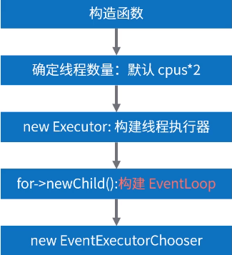

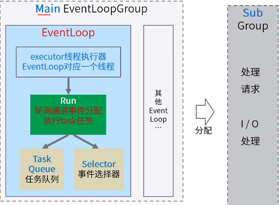

#### `NioEventLoop`

##### 简介

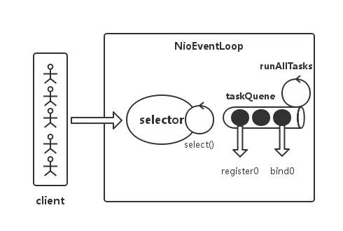

NioEventLoop中维护了一个线程，线程启动时会调用NioEventLoop的run方法，执行I/O任务和非I/O任务

- **I/O任务**：selectionKey中ready的事件 由processSelectedKeys方法触发
    - **accept**
    - **connect**
    - **read**
    - **write**
- **非IO任务**：添加到taskQueue中的任务 由runAllTasks方法触发
    - **register0**
    - **bind0**
- **两种任务的执行时间比由变量ioRatio控制**，默认为50，则表示允许非IO任务执行的时间与IO任务的执行时间相等

##### **NioEventLoop.run** 方法实现

```java
protected void run() {
    for (;;) {
        boolean oldWakenUp = wakenUp.getAndSet(false);
        try {
          	// 判断当前任务队列是否有任务
            if (hasTasks()) {
                selectNow();
            } else {
                select(oldWakenUp);
                if (wakenUp.get()) {
                    selector.wakeup();
                }
            }

            cancelledKeys = 0;
            needsToSelectAgain = false;
            final int ioRatio = this.ioRatio;
            if (ioRatio == 100) {
                processSelectedKeys();
                runAllTasks();
            } else {
                final long ioStartTime = System.nanoTime();

                processSelectedKeys();

                final long ioTime = System.nanoTime() - ioStartTime;
                runAllTasks(ioTime * (100 - ioRatio) / ioRatio);
            }

            if (isShuttingDown()) {
                closeAll();
                if (confirmShutdown()) {
                    break;
                }
            }
        } catch (Throwable t) {
            logger.warn("Unexpected exception in the selector loop.", t);

            // Prevent possible consecutive immediate failures that lead to
            // excessive CPU consumption.
            try {
                Thread.sleep(1000);
            } catch (InterruptedException e) {
                // Ignore.
            }
        }
    }
}
```

##### hasTasks()方法判断当前taskQueue是否有元素

 1、 如果**taskQueue中有元素**，执行 **selectNow()** 方法，最终执行selector.selectNow()，该方法会立即返回

```csharp
void selectNow() throws IOException {
    try {
        selector.selectNow();
    } finally {
        // restore wakup state if needed
        if (wakenUp.get()) {
            selector.wakeup();
        }
    }
}
```

2、 如果**taskQueue没有元素**，执行 **select(oldWakenUp)** 方法 

**解决了Nio中臭名昭著的bug：selector的select方法导致cpu100%**

1.  **delayNanos(currentTimeNanos)**
    1. 计算延迟任务队列中第一个任务的到期执行时间（即最晚还能延迟多长时间执行），默认返回1s
    2. 每个SingleThreadEventExecutor都持有一个延迟执行任务的优先队列PriorityQueue 启动线程时，往队列中加入任务
2. 如果延迟任务队列中第一个任务的最晚还能延迟执行的时间小于500000纳秒，且selectCnt == 0 
    1. 执行selector.selectNow()方法并立即返回
    2. **selectCnt 用来记录selector.select方法的执行次数和标识是否执行过selector.selectNow()**
3. 否则**执行selector.select(timeoutMillis)**
4.  如果已经存在ready的selectionKey/selector被唤醒/taskQueue不为空/scheduledTaskQueue不为空 退出循环
5. 如果 **selectCnt 没达到阈值SELECTOR_AUTO_REBUILD_THRESHOLD（默认512），则继续进行for循环** 
    1. currentTimeNanos 在select操作之后会重新赋值当前时间
    2. 如果selector.select(timeoutMillis)行为真的阻塞了timeoutMillis
        1. 第二次的timeoutMillis肯定等于0
        2. selectCnt 为1
        3. 会直接退出for循环
6. 如果**触发了epool cpu100%的bug**
    1. selector.select(timeoutMillis)操作会立即返回，不会阻塞timeoutMillis，导致 currentTimeNanos 几乎不变
        1. 反复执行**selector.select(timeoutMillis)，变量selectCnt 会逐渐变大**
    2. 当**selectCnt 达到阈值，则执行rebuildSelector方法，进行selector重建，解决cpu占用100%的bug**

```java
private void select(boolean oldWakenUp) throws IOException {
    Selector selector = this.selector;
    try {
        int selectCnt = 0;
        long currentTimeNanos = System.nanoTime();
        long selectDeadLineNanos = currentTimeNanos + delayNanos(currentTimeNanos);
        for (;;) {
            long timeoutMillis = (selectDeadLineNanos - currentTimeNanos + 500000L) / 1000000L;
            if (timeoutMillis <= 0) {
                if (selectCnt == 0) {
                    selector.selectNow();
                    selectCnt = 1;
                }
                break;
            }

            int selectedKeys = selector.select(timeoutMillis);
            selectCnt ++;

            if (selectedKeys != 0 || oldWakenUp || wakenUp.get() || hasTasks() || hasScheduledTasks()) {
                // - Selected something,
                // - waken up by user, or
                // - the task queue has a pending task.
                // - a scheduled task is ready for processing
                break;
            }
            if (Thread.interrupted()) {
                // Thread was interrupted so reset selected keys and break so we not run into a busy loop.
                // As this is most likely a bug in the handler of the user or it's client library we will
                // also log it.
                //
                // See https://github.com/netty/netty/issues/2426
                if (logger.isDebugEnabled()) {
                    logger.debug("Selector.select() returned prematurely because " +
                            "Thread.currentThread().interrupt() was called. Use " +
                            "NioEventLoop.shutdownGracefully() to shutdown the NioEventLoop.");
                }
                selectCnt = 1;
                break;
            }

            long time = System.nanoTime();
            if (time - TimeUnit.MILLISECONDS.toNanos(timeoutMillis) >= currentTimeNanos) {
                // timeoutMillis elapsed without anything selected.
                selectCnt = 1;
            } else if (SELECTOR_AUTO_REBUILD_THRESHOLD > 0 &&
                    selectCnt >= SELECTOR_AUTO_REBUILD_THRESHOLD) {
                // The selector returned prematurely many times in a row.
                // Rebuild the selector to work around the problem.
                logger.warn(
                        "Selector.select() returned prematurely {} times in a row; rebuilding selector.",
                        selectCnt);

                rebuildSelector();
                selector = this.selector;

                // Select again to populate selectedKeys.
                selector.selectNow();
                selectCnt = 1;
                break;
            }

            currentTimeNanos = time;
        }

        if (selectCnt > MIN_PREMATURE_SELECTOR_RETURNS) {
            if (logger.isDebugEnabled()) {
                logger.debug("Selector.select() returned prematurely {} times in a row.", selectCnt - 1);
            }
        }
    } catch (CancelledKeyException e) {
        if (logger.isDebugEnabled()) {
            logger.debug(CancelledKeyException.class.getSimpleName() + " raised by a Selector - JDK bug?", e);
        }
        // Harmless exception - log anyway
    }
}
```

##### rebuildSelector过程

1. **通过方法openSelector创建一个新的selector**
2. **将old selector的selectionKey执行cancel**
3. **将old selector的channel重新注册到新的selector中**
4. **对selector进行rebuild后，需要重新执行方法selectNow，检查是否有已ready的selectionKey**

```java
public void rebuildSelector() {  
        if (!inEventLoop()) {  
            execute(new Runnable() {  
                @Override  
                public void run() {  
                    rebuildSelector();  
                }  
            });  
            return;  
        }  
        final Selector oldSelector = selector;  
        final Selector newSelector;  
        if (oldSelector == null) {  
            return;  
        }  
        try {  
            newSelector = openSelector();  
        } catch (Exception e) {  
            logger.warn("Failed to create a new Selector.", e);  
            return;  
        }  
        // Register all channels to the new Selector.  
        int nChannels = 0;  
        for (;;) {  
            try {  
                for (SelectionKey key: oldSelector.keys()) {  
                    Object a = key.attachment();  
                    try {  
                        if (key.channel().keyFor(newSelector) != null) {  
                            continue;  
                        }  
                        int interestOps = key.interestOps();  
                        key.cancel();  
                        key.channel().register(newSelector, interestOps, a);  
                        nChannels ++;  
                    } catch (Exception e) {  
                        logger.warn("Failed to re-register a Channel to the new Selector.", e);  
                        if (a instanceof AbstractNioChannel) {  
                            AbstractNioChannel ch = (AbstractNioChannel) a;  
                            ch.unsafe().close(ch.unsafe().voidPromise());  
                        } else {  
                            @SuppressWarnings("unchecked")  
                            NioTask<SelectableChannel> task = (NioTask<SelectableChannel>) a;  
                            invokeChannelUnregistered(task, key, e);  
                        }  
                    }  
                }  
            } catch (ConcurrentModificationException e) {  
                // Probably due to concurrent modification of the key set.  
                continue;  
            }  
  
            break;  
        }    
        selector = newSelector;  
        try {  
            // time to close the old selector as everything else is registered to the new one  
            oldSelector.close();  
        } catch (Throwable t) {  
            if (logger.isWarnEnabled()) {  
                logger.warn("Failed to close the old Selector.", t);  
            }  
        }    
        logger.info("Migrated " + nChannels + " channel(s) to the new Selector.");  
    }  
```

**方法selectNow()或select(oldWakenUp)返回后，执行方法processSelectedKeys和runAllTasks**

##### **processSelectedKeys**

用来处理有事件发生的selectkey，对优化过的方法processSelectedKeysOptimized进行分析

**有事件发生的selectkey存放在数组selectedKeys中，通过遍历selectedKeys，处理每一个selectkey**

```java
private void processSelectedKeysOptimized(SelectionKey[] selectedKeys) {
    for (int i = 0;; i ++) {
        final SelectionKey k = selectedKeys[i];
        if (k == null) {
            break;
        }
        // null out entry in the array to allow to have it GC'ed once the Channel close
        // See https://github.com/netty/netty/issues/2363
        selectedKeys[i] = null;

        final Object a = k.attachment();

        if (a instanceof AbstractNioChannel) {
            processSelectedKey(k, (AbstractNioChannel) a);
        } else {
            @SuppressWarnings("unchecked")
            NioTask<SelectableChannel> task = (NioTask<SelectableChannel>) a;
            processSelectedKey(k, task);
        }

        if (needsToSelectAgain) {
            // null out entries in the array to allow to have it GC'ed once the Channel close
            // See https://github.com/netty/netty/issues/2363
            for (;;) {
                i++;
                if (selectedKeys[i] == null) {
                    break;
                }
                selectedKeys[i] = null;
            }

            selectAgain();
            // Need to flip the optimized selectedKeys to get the right reference to the array
            // and reset the index to -1 which will then set to 0 on the for loop
            // to start over again.
            //
            // See https://github.com/netty/netty/issues/1523
            selectedKeys = this.selectedKeys.flip();
            i = -1;
        }
    }
}
```

##### **runAllTasks** 

**处理非I/O任务**

方法runAllTasks的执行时间为ioTime * (100 - ioRatio) / ioRatio，其中ioTime 是方法processSelectedKeys的执行时间

```java
protected boolean runAllTasks(long timeoutNanos) {
    fetchFromScheduledTaskQueue();
    Runnable task = pollTask();
    if (task == null) {
        return false;
    }

    final long deadline = ScheduledFutureTask.nanoTime() + timeoutNanos;
    long runTasks = 0;
    long lastExecutionTime;
    for (;;) {
        try {
            task.run();
        } catch (Throwable t) {
            logger.warn("A task raised an exception.", t);
        }
        runTasks ++;
        // Check timeout every 64 tasks because nanoTime() is relatively expensive.
        // XXX: Hard-coded value - will make it configurable if it is really a problem.
        if ((runTasks & 0x3F) == 0) {
            lastExecutionTime = ScheduledFutureTask.nanoTime();
            if (lastExecutionTime >= deadline) {
                break;
            }
        }
        task = pollTask();
        if (task == null) {
            lastExecutionTime = ScheduledFutureTask.nanoTime();
            break;
        }
    }
    this.lastExecutionTime = lastExecutionTime;
    return true;
}
```

方法**fetchFromScheduledTaskQueue**把scheduledTaskQueue中已经超过延迟执行时间的任务移到taskQueue中等待被执行。

```java
private void fetchFromScheduledTaskQueue() {
    if (hasScheduledTasks()) {
        long nanoTime = AbstractScheduledEventExecutor.nanoTime();
        for (;;) {
            Runnable scheduledTask = pollScheduledTask(nanoTime);
            if (scheduledTask == null) {
                break;
            }
            taskQueue.add(scheduledTask);
        }
    }
}
```

1. **依次从taskQueue任务task执行**
2. **每执行64个任务 进行耗时检查**
3. 如果已执行时间超过预先设定的执行时间，则停止执行非IO任务，避免非IO任务太多，影响IO任务的执行

#### `ChannelPipeline&ChannelHandler`

##### 简介

**每个channel内部都会持有一个ChannelPipeline对象**pipeline

pipeline默认实现DefaultChannelPipeline内部**维护了一个DefaultChannelHandlerContext链表**

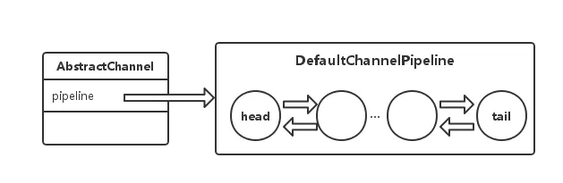

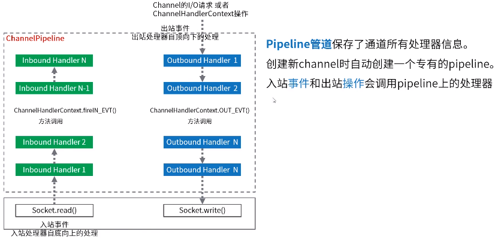

###### ChannelPipeline简介

Netty将Channel的数据管道抽象为**ChannelPipeline**

- **消息在ChannelPipeline中流动和传递**
- ChannelPipeline是ChannelHandler的容器，内部维护了一个I/O事件拦截器ChannelHandler的链表和迭代器
- 可以方便地通过**增删ChannelHandler来实现不同的业务逻辑定制**，不需要对已有的ChannelHandler进行修改
- **负责ChannelHandler的管理和事件拦截与调度**
- 当**发生某个I/O事件(链路建立、链路关闭、读取操作完成)时**
    - **事件在pipeline中得到传播和处理**
    - **ChannelPipeline是事件处理的总入口**
- 当**channel完成register、active、read等操作时，会触发pipeline的相应方法**
    -  **当channel注册到selector时，触发pipeline的fireChannelRegistered方法**
    -  **当channel的socket绑定完成时，触发pipeline的fireChannelActive方法**
    -  当**有客户端请求时，触发pipeline的fireChannelRead方法**
    -  当本次客户端请求，pipeline**执行完fireChannelRead，触发pipeline的fireChannelReadComplete方法**

######  ChannelPipeline主要特性

- **ChannelPipeline支持运行态动态的添加或者删除ChannelHandler**
    - 如当业务高峰期需要对系统做拥塞保护时，就可以根据当前的系统时间进行判断
        - 处于业务高峰期，则动态地将系统拥塞而保护ChannelHandler添加到当前的ChannelPipeline中
        - 当高峰期过去之后，就可以动态删除拥塞保护ChannelHandler了
- **ChannelPipeline是线程安全**的
    - N个业务线程可以并发地操作ChannelPipeline而不存在多线程并发问题

###### ChannelPipeline的inbound事件

pipeline中以**fireXXX命名的方法**都是从**I/O线程流向用户业务Handler的inbound事件**

（1）调用HeaderHandler对应的fireXXX方法

（2）执行事件相关的逻辑操作

###### ChannelPipeline的outbound事件

由**用户线程或者代码发起的I/O操作**被称为outbound事件

1. **Pipeling负责将I/O事件通过TailHandler进行调度和传播**
2. **最终调用Unsafe的I/O方法进行I/O操作**

###### ChannelHandler简介

- ChannelHandler**对I/O事件进行拦截和处理**
- ChannelHandler**不是线程安全的** 用户仍然需要自己保证ChannelHandler的线程安全

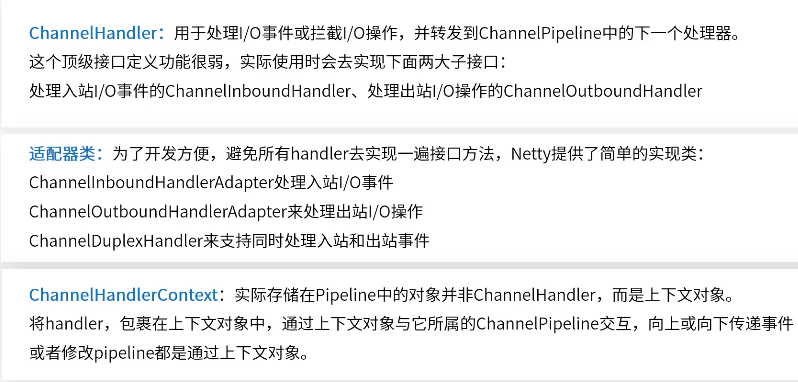

###### ChannelPipeline管理ChannelHandlerAPI

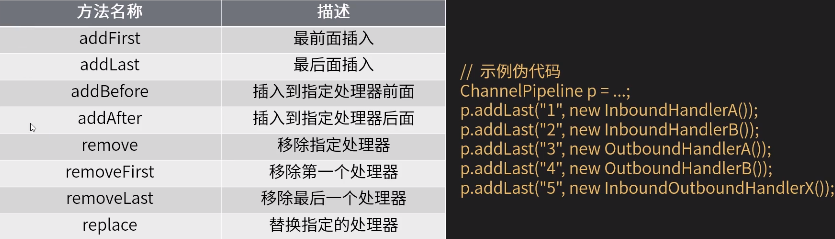

###### ChannelHandler执行分析

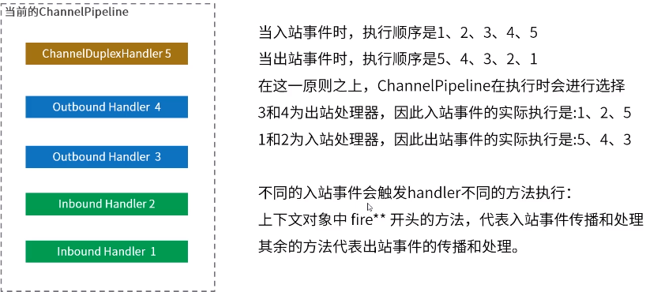

###### ChannelHandler主要分类

- ChannelPipeline的**系统ChannelHnadler，用于I/O操作和对事件进行预处理**
    - 对于用户不可见 主要包括**HeadHandler和TailHandler**
- **编解码ChannelHandler，包括ByteToMessageCodec、MessageToMessageDecoder**等
- **其他系统功能性ChannelHandler**：包括流量整型Handler、读写超时Handler、日志Handler等

###### 事件简介

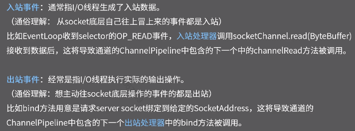

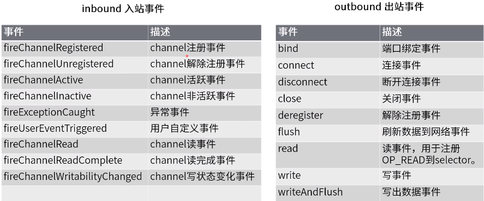


##### 源码流程

###### DefaultChannelPipeline

**组织并运行handler对应的方法**

其中**DefaultChannelHandlerContext保存了当前handler的上下文，如channel、pipeline**等信息，默认实现了head和tail

1、TailContext实现了ChannelOutboundHandler接口
2、HeadContext实现了ChannelInboundHandler接口
3、head和tail形成了一个链表

```java
class DefaultChannelPipeline implements ChannelPipeline {
    final Channel channel; // pipeline所属的channel
    //head和tail都是handler上下文
    final DefaultChannelHandlerContext head;
    final DefaultChannelHandlerContext tail;
    ...
    public DefaultChannelPipeline(AbstractChannel channel) {
        if (channel == null) {
            throw new NullPointerException("channel");
        }
        this.channel = channel;

        tail = new TailContext(this);
        head = new HeadContext(this);

        head.next = tail;
        tail.prev = head;
    }  
}
```

###### Inbound操作

1. 当**channel注册到selector时，触发pipeline的fireChannelRegistered**
2. 从**head开始遍历，找到实现了ChannelInboundHandler接口的handler**并**执行其fireChannelRegistered方法**

```java
@Override
public ChannelPipeline fireChannelRegistered() {
    head.fireChannelRegistered();
    return this;
}

@Override
public ChannelHandlerContext fireChannelRegistered() {
    final DefaultChannelHandlerContext next = findContextInbound();
    EventExecutor executor = next.executor();
    if (executor.inEventLoop()) {
        next.invokeChannelRegistered();
    } else {
        executor.execute(new Runnable() {
            @Override
            public void run() {
                next.invokeChannelRegistered();
            }
        });
    }
    return this;
}

private DefaultChannelHandlerContext findContextInbound() {
    DefaultChannelHandlerContext ctx = this;
    do {
        ctx = ctx.next;
    } while (!(ctx.handler() instanceof ChannelInboundHandler));
    return ctx;
}

private void invokeChannelRegistered() {
    try {
        ((ChannelInboundHandler) handler()).channelRegistered(this);
    } catch (Throwable t) {
        notifyHandlerException(t);
    }
}
```

###### Inbound例子

假如我们通过**pipeline的addLast方法添加一个inboundHandler实现**

```java
public class ClientHandler extends ChannelInboundHandlerAdapter {
    @Override  
    public void channelRegistered(ChannelHandlerContext ctx)  
            throws Exception {  
        super.channelRegistered(ctx);  
        System.out.println(" ClientHandler  registered channel ");  
    }  
}  
```

1. 当**channel注册完成时会触发pipeline的channelRegistered**方法
2. 从**head开始遍历，找到ClientHandler，并执行channelRegistered方法**

###### Outbound操作

**从tail向前遍历，找到实现ChannelOutboundHandler接口的handler，具体实现和Inbound一样**

###### 服务启动

1. **ServerBootstrap在init方法中**给**ServerSocketChannel的pipeline添加ChannelInitializer对象**
2. ChannelInitializer继承ChannelInboundHandlerAdapter，并实现了ChannelInboundHandler接口
3. **ServerSocketChannel注册到selector之后，会触发其channelRegistered方法**
4. 在**initChannel实现**中，**添加ServerBootstrapAcceptor实例到pipeline中**
5. **ServerBootstrapAcceptor**继承自ChannelInboundHandlerAdapter
    1. **负责把接收到的客户端socketChannel注册到childGroup中**
    2. 由childGroup中的**eventLoop负责数据处理**

```java
public final void channelRegistered(ChannelHandlerContext ctx) throws Exception {
    initChannel((C) ctx.channel());
    ctx.pipeline().remove(this);
    ctx.fireChannelRegistered();
}

public void initChannel(Channel ch) throws Exception {
    ChannelPipeline pipeline = ch.pipeline();
    ChannelHandler handler = handler();
    if (handler != null) {
        pipeline.addLast(handler);
    }
    pipeline.addLast(new ServerBootstrapAcceptor(
            currentChildGroup, currentChildHandler, currentChildOptions, currentChildAttrs));
}
```

```java
public void channelRead(ChannelHandlerContext ctx, Object msg) {
    final Channel child = (Channel) msg;

    child.pipeline().addLast(childHandler);

    for (Entry<ChannelOption<?>, Object> e: childOptions) {
        try {
            if (!child.config().setOption((ChannelOption<Object>) e.getKey(), e.getValue())) {
                logger.warn("Unknown channel option: " + e);
            }
        } catch (Throwable t) {
            logger.warn("Failed to set a channel option: " + child, t);
        }
    }

    for (Entry<AttributeKey<?>, Object> e: childAttrs) {
        child.attr((AttributeKey<Object>) e.getKey()).set(e.getValue());
    }

    try {
        childGroup.register(child).addListener(new ChannelFutureListener() {
            @Override
            public void operationComplete(ChannelFuture future) throws Exception {
                if (!future.isSuccess()) {
                    forceClose(child, future.cause());
                }
            }
        });
    } catch (Throwable t) {
        forceClose(child, t);
    }
}
```

#### `accept`过程

**分析服务端如何accept客户端的connect请求**

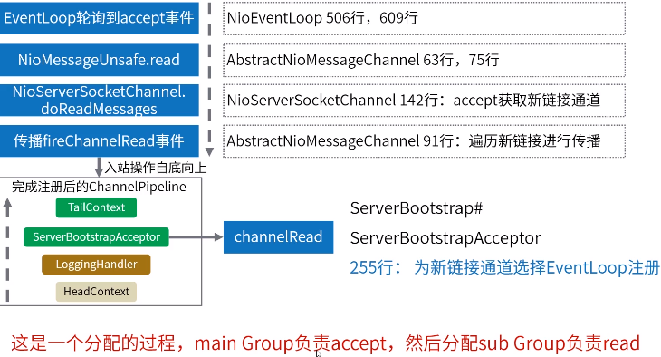

##### NioEventLoop的工作机制

1. 当有客户端connect请求
2. selector可以返回其对应的SelectionKey
3. 方法processSelectedKeys进行后续的处理

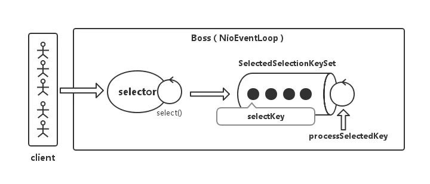

##### processSelectedKeys

**默认采用优化过的SelectedSelectionKeySet保存有事件发生的selectedKey**

1. SelectedSelectionKeySet内部使用两个大小为1024的SelectionKey数组keysA和keysB保存selectedKey
2. 把SelectedSelectionKeySet实例映射到selector的原生selectedKeys和publicSelectedKeys

```csharp
private void processSelectedKeys() {
    if (selectedKeys != null) {
        processSelectedKeysOptimized(selectedKeys.flip());
    } else {
        processSelectedKeysPlain(selector.selectedKeys());
    }
}
```

##### processSelectedKeysOptimized

因为**selector的I/O多路复用机制，一次可以返回多个selectedKey**，所以用**for循环处理全部selectionKey**

假设这时**有请求进来，selectedKeys中就存在一个selectionKey**

1. 通过**k.attachment()可以获取ServerSocketChannel注册时绑定上去的附件(ServerSocketChannel自身)**

```java
private void processSelectedKeysOptimized(SelectionKey[] selectedKeys) {
    for (int i = 0;; i ++) {
        final SelectionKey k = selectedKeys[i];
        if (k == null) {
            break;
        }
        // null out entry in the array to allow to have it GC'ed once the Channel close
        // See https://github.com/netty/netty/issues/2363
        selectedKeys[i] = null;

        final Object a = k.attachment();

        if (a instanceof AbstractNioChannel) {
            processSelectedKey(k, (AbstractNioChannel) a);
        } else {
            @SuppressWarnings("unchecked")
            NioTask<SelectableChannel> task = (NioTask<SelectableChannel>) a;
            processSelectedKey(k, task);
        }

        if (needsToSelectAgain) {
            // null out entries in the array to allow to have it GC'ed once the Channel close
            // See https://github.com/netty/netty/issues/2363
            for (;;) {
                i++;
                if (selectedKeys[i] == null) {
                    break;
                }
                selectedKeys[i] = null;
            }

            selectAgain();
            // Need to flip the optimized selectedKeys to get the right reference to the array
            // and reset the index to -1 which will then set to 0 on the for loop
            // to start over again.
            //
            // See https://github.com/netty/netty/issues/1523
            selectedKeys = this.selectedKeys.flip();
            i = -1;
        }
    }
}
```

###### processSelectedKey

2. **selectedKey的附件是AbstractNioChannel类型**的，执行processSelectedKey(k, (AbstractNioChannel) a)方法
    1. 获取ServerSocketChannel的unsafe对象
    2. 当前**selectionKey发生的事件是SelectionKey.OP_ACCEPT，执行unsafe的read方法**

```csharp
private static void processSelectedKey(SelectionKey k, AbstractNioChannel ch) {
    final NioUnsafe unsafe = ch.unsafe();
    if (!k.isValid()) {
        // close the channel if the key is not valid anymore
        unsafe.close(unsafe.voidPromise());
        return;
    }

    try {
        int readyOps = k.readyOps();
        // Also check for readOps of 0 to workaround possible JDK bug which may otherwise lead
        // to a spin loop
        if ((readyOps & (SelectionKey.OP_READ | SelectionKey.OP_ACCEPT)) != 0 || readyOps == 0) {
            unsafe.read();
            if (!ch.isOpen()) {
                // Connection already closed - no need to handle write.
                return;
            }
        }
        if ((readyOps & SelectionKey.OP_WRITE) != 0) {
            // Call forceFlush which will also take care of clear the OP_WRITE once there is nothing left to write
            ch.unsafe().forceFlush();
        }
        if ((readyOps & SelectionKey.OP_CONNECT) != 0) {
            // remove OP_CONNECT as otherwise Selector.select(..) will always return without blocking
            // See https://github.com/netty/netty/issues/924
            int ops = k.interestOps();
            ops &= ~SelectionKey.OP_CONNECT;
            k.interestOps(ops);

            unsafe.finishConnect();
        }
    } catch (CancelledKeyException ignored) {
        unsafe.close(unsafe.voidPromise());
    }
}
```

##### Unsafe.read

定义在NioMessageUnsafe类中

1. **readBuf 用来保存客户端NioSocketChannel**，默认一次不超过16个
2. 方法**doReadMessages进行处理ServerSocketChannel的accept操作**

```java
private final List<Object> readBuf = new ArrayList<Object>();

@Override
public void read() {
    assert eventLoop().inEventLoop();
    final ChannelConfig config = config();
    if (!config.isAutoRead() && !isReadPending()) {
        // ChannelConfig.setAutoRead(false) was called in the meantime
        removeReadOp();
        return;
    }

    final int maxMessagesPerRead = config.getMaxMessagesPerRead();
    final ChannelPipeline pipeline = pipeline();
    boolean closed = false;
    Throwable exception = null;
    try {
        try {
            for (;;) {
                int localRead = doReadMessages(readBuf);
                if (localRead == 0) {
                    break;
                }
                if (localRead < 0) {
                    closed = true;
                    break;
                }

                // stop reading and remove op
                if (!config.isAutoRead()) {
                    break;
                }

                if (readBuf.size() >= maxMessagesPerRead) {
                    break;
                }
            }
        } catch (Throwable t) {
            exception = t;
        }
        setReadPending(false);
        int size = readBuf.size();
        for (int i = 0; i < size; i ++) {
            pipeline.fireChannelRead(readBuf.get(i));
        }

        readBuf.clear();
        pipeline.fireChannelReadComplete();

        if (exception != null) {
            if (exception instanceof IOException && !(exception instanceof PortUnreachableException)) {
                // ServerChannel should not be closed even on IOException because it can often continue
                // accepting incoming connections. (e.g. too many open files)
                closed = !(AbstractNioMessageChannel.this instanceof ServerChannel);
            }

            pipeline.fireExceptionCaught(exception);
        }

        if (closed) {
            if (isOpen()) {
                close(voidPromise());
            }
        }
    } finally {
        // Check if there is a readPending which was not processed yet.
        // This could be for two reasons:
        // * The user called Channel.read() or ChannelHandlerContext.read() in channelRead(...) method
        // * The user called Channel.read() or ChannelHandlerContext.read() in channelReadComplete(...) method
        //
        // See https://github.com/netty/netty/issues/2254
        if (!config.isAutoRead() && !isReadPending()) {
            removeReadOp();
        }
    }
}
```

###### doReadMessages

1. **javaChannel()：返回NioServerSocketChannel对应服务端的ServerSocketChannel**
2. ServerSocketChannel.**accept()：返回客户端的socketChannel**
3. **把 NioServerSocketChannel 和 socketChannel 封装成 NioSocketChannel**，并**缓存到readBuf**
4. **遍历redBuf中的NioSocketChannel**
5. **触发各自pipeline的ChannelRead事件**
6. **从pipeline的head开始遍历**
7. 最终**执行ServerBootstrapAcceptor的channelRead方法**

```csharp
protected int doReadMessages(List<Object> buf) throws Exception {
    SocketChannel ch = javaChannel().accept();
    try {
        if (ch != null) {
            buf.add(new NioSocketChannel(this, ch));
            return 1;
        }
    } catch (Throwable t) {
        logger.warn("Failed to create a new channel from an accepted socket.", t);
        try {
            ch.close();
        } catch (Throwable t2) {
            logger.warn("Failed to close a socket.", t2);
        }
    }
    return 0;
}
```

##### channelRead

1. child.pipeline().addLast(childHandler)：**添加childHandler到NioSocketChannel的pipeline**
    1. childHandler是通过ServerBootstrap的childHandler方法进行配置的，和NioServerSocketChannel类似 
2. childGroup.register(child)：**将NioSocketChannel注册到work的eventLoop中**
    1. 这个过程和NioServerSocketChannel注册到boss的eventLoop的过程一样
    2. 最终由work线程对应的selector进行read事件的监听
3. **当readBuf中缓存的NioSocketChannel都处理完成后，清空readBuf，并触发ChannelReadComplete**

```cpp
public void channelRead(ChannelHandlerContext ctx, Object msg) {
    final Channel child = (Channel) msg;
    child.pipeline().addLast(childHandler);
    for (Entry<ChannelOption<?>, Object> e: childOptions) {
        try {
            if (!child.config().setOption((ChannelOption<Object>) e.getKey(), e.getValue())) {
                logger.warn("Unknown channel option: " + e);
            }
        } catch (Throwable t) {
            logger.warn("Failed to set a channel option: " + child, t);
        }
    }
    for (Entry<AttributeKey<?>, Object> e: childAttrs) {
        child.attr((AttributeKey<Object>) e.getKey()).set(e.getValue());
    }
    try {
        childGroup.register(child).addListener(new ChannelFutureListener() {
            @Override
            public void operationComplete(ChannelFuture future) throws Exception {
                if (!future.isSuccess()) {
                    forceClose(child, future.cause());
                }
            }
        });
    } catch (Throwable t) {
        forceClose(child, t);
    }
}
```

至此执行完accept流程

#### `read`过程

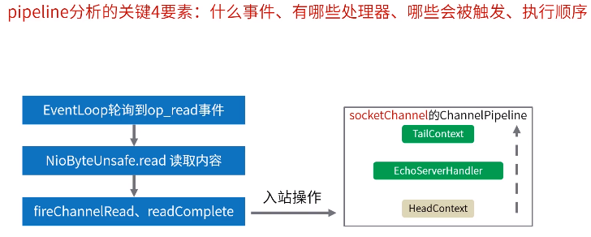

##### accept->read

1. boss线程主要负责监听并处理accept事件
2. 将socketChannel注册到work线程的selector
3. **由worker线程来监听并处理read事件**

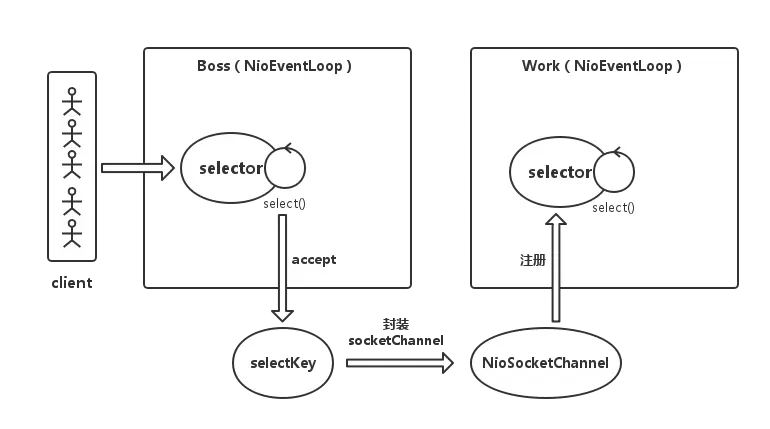

当**work线程的selector检测到OP_READ事件发生时，触发read操作**

```csharp
//NioEventLoop  
if ((readyOps & (SelectionKey.OP_READ | SelectionKey.OP_ACCEPT)) != 0 || readyOps == 0) {  
    unsafe.read();  
    if (!ch.isOpen()) {  
        // Connection already closed - no need to handle write.  
        return;  
    }  
} 
```

##### NioByteUnsafe.read

```java
//AbstractNioByteChannel.NioByteUnsafe
public final void read() {
    final ChannelConfig config = config();
    if (!config.isAutoRead() && !isReadPending()) {
        // ChannelConfig.setAutoRead(false) was called in the meantime
        removeReadOp();
        return;
    }

    final ChannelPipeline pipeline = pipeline();
    final ByteBufAllocator allocator = config.getAllocator();
    final int maxMessagesPerRead = config.getMaxMessagesPerRead();
    RecvByteBufAllocator.Handle allocHandle = this.allocHandle;
    if (allocHandle == null) {
        this.allocHandle = allocHandle = config.getRecvByteBufAllocator().newHandle();
    }

    ByteBuf byteBuf = null;
    int messages = 0;
    boolean close = false;
    try {
        int totalReadAmount = 0;
        boolean readPendingReset = false;
        do {
            byteBuf = allocHandle.allocate(allocator);
            int writable = byteBuf.writableBytes();
            int localReadAmount = doReadBytes(byteBuf);
            if (localReadAmount <= 0) {
                // not was read release the buffer
                byteBuf.release();
                byteBuf = null;
                close = localReadAmount < 0;
                break;
            }
            if (!readPendingReset) {
                readPendingReset = true;
                setReadPending(false);
            }
            pipeline.fireChannelRead(byteBuf);
            byteBuf = null;

            if (totalReadAmount >= Integer.MAX_VALUE - localReadAmount) {
                // Avoid overflow.
                totalReadAmount = Integer.MAX_VALUE;
                break;
            }

            totalReadAmount += localReadAmount;

            // stop reading
            if (!config.isAutoRead()) {
                break;
            }

            if (localReadAmount < writable) {
                // Read less than what the buffer can hold,
                // which might mean we drained the recv buffer completely.
                break;
            }
        } while (++ messages < maxMessagesPerRead);

        pipeline.fireChannelReadComplete();
        allocHandle.record(totalReadAmount);

        if (close) {
            closeOnRead(pipeline);
            close = false;
        }
    } catch (Throwable t) {
        handleReadException(pipeline, byteBuf, t, close);
    } finally {
        // Check if there is a readPending which was not processed yet.
        // This could be for two reasons:
        // * The user called Channel.read() or ChannelHandlerContext.read() in channelRead(...) method
        // * The user called Channel.read() or ChannelHandlerContext.read() in channelReadComplete(...) method
        //
        // See https://github.com/netty/netty/issues/2254
        if (!config.isAutoRead() && !isReadPending()) {
            removeReadOp();
        }
    }
}
```

###### allocHandle

负责自适应调整当前缓存分配的大小，以防止缓存分配过多或过少

AdaptiveRecvByteBufAllocator内部实现

- **SIZE_TABLE**：按照从小到大的顺序预先存储可以分配的缓存大小 
    - 从16开始，每次累加16，直到496，接着从512开始，每次增大一倍，直到溢出
- **DEFAULT_MINIMUM**：最小缓存（64），在SIZE_TABLE中对应的下标为3
- **DEFAULT_MAXIMUM **：最大缓存（65536），在SIZE_TABLE中对应的下标为38
- **DEFAULT_INITIAL **：初始化缓存大小，第一次分配缓存时没有上一次实际收到的字节数做参考，需要给一个默认初始值。
- **INDEX_INCREMENT**：上次预估缓存偏小，下次index的递增值
- **INDEX_DECREMENT **：上次预估缓存偏大，下次index的递减值

```java
public class AdaptiveRecvByteBufAllocator implements RecvByteBufAllocator {
    static final int DEFAULT_MINIMUM = 64;
    static final int DEFAULT_INITIAL = 1024;
    static final int DEFAULT_MAXIMUM = 65536;
    private static final int INDEX_INCREMENT = 4;
    private static final int INDEX_DECREMENT = 1;
    private static final int[] SIZE_TABLE;
}
```

###### allocHandle.allocate(allocator) 

**申请一块指定大小的内存**

```cpp
//AdaptiveRecvByteBufAllocator.HandleImpl
public ByteBuf allocate(ByteBufAllocator alloc) {
    return alloc.ioBuffer(nextReceiveBufferSize);
}
```

通过ByteBufAllocator的ioBuffer方法申请缓存

```cpp
//AbstractByteBufAllocator
public ByteBuf ioBuffer(int initialCapacity) {
    if (PlatformDependent.hasUnsafe()) {
        return directBuffer(initialCapacity);
    }
    return heapBuffer(initialCapacity);
}
```

**根据平台是否支持unsafe，选择使用直接物理内存还是堆上内存**

direct buffer方案

```cpp
//AbstractByteBufAllocator
public ByteBuf directBuffer(int initialCapacity) {
    return directBuffer(initialCapacity, Integer.MAX_VALUE);
}

public ByteBuf directBuffer(int initialCapacity, int maxCapacity) {
    if (initialCapacity == 0 && maxCapacity == 0) {
        return emptyBuf;
    }
    validate(initialCapacity, maxCapacity);
    return newDirectBuffer(initialCapacity, maxCapacity);
}

//UnpooledByteBufAllocator
protected ByteBuf newDirectBuffer(int initialCapacity, int maxCapacity) {
    ByteBuf buf;
    if (PlatformDependent.hasUnsafe()) {
        buf = new UnpooledUnsafeDirectByteBuf(this, initialCapacity, maxCapacity);
    } else {
        buf = new UnpooledDirectByteBuf(this, initialCapacity, maxCapacity);
    }
    return toLeakAwareBuffer(buf);
}
```

UnpooledUnsafeDirectByteBuf

- **实现缓存管理**：对Nio的ByteBuffer进行了封装，通过ByteBuffer的**allocateDirect**方法实现缓存的申请
- **memoryAddress** = PlatformDependent.directBufferAddress(buffer)：**获取buffer的address字段值，指向缓存地址**
- **capacity** = buffer.remaining()：**获取缓存容量**

```csharp
protected UnpooledUnsafeDirectByteBuf(ByteBufAllocator alloc, ByteBuffer initialBuffer, int maxCapacity) {
    //判断逻辑已经忽略
   this.alloc = alloc;
   setByteBuffer(allocateDirect(initialCapacity));
}

protected ByteBuffer allocateDirect(int initialCapacity) {
    return ByteBuffer.allocateDirect(initialCapacity);
}

private void setByteBuffer(ByteBuffer buffer) {
    ByteBuffer oldBuffer = this.buffer;
    if (oldBuffer != null) {
        if (doNotFree) {
            doNotFree = false;
        } else {
            freeDirect(oldBuffer);
        }
    }
    this.buffer = buffer;
    memoryAddress = PlatformDependent.directBufferAddress(buffer);
    tmpNioBuf = null;
    capacity = buffer.remaining();
}
```

方法toLeakAwareBuffer(buf)

对申请的buf又进行了一次包装

Netty中使用**引用计数机制**来管理资源，**ByteBuf实现了ReferenceCounted接口**

- 当实例化一个ByteBuf时引用计数为1， 代码中需要保持一个该对象的引用时需要调用retain方法将计数增1，
- 对象使用完时调用release将计数减1。
- 当引用计数变为0时，对象将释放所持有的底层资源或将资源返回资源池。

```csharp
protected static ByteBuf toLeakAwareBuffer(ByteBuf buf) {
    ResourceLeak leak;
    switch (ResourceLeakDetector.getLevel()) {
        case SIMPLE:
            leak = AbstractByteBuf.leakDetector.open(buf);
            if (leak != null) {
                buf = new SimpleLeakAwareByteBuf(buf, leak);
            }
            break;
        case ADVANCED:
        case PARANOID:
            leak = AbstractByteBuf.leakDetector.open(buf);
            if (leak != null) {
                buf = new AdvancedLeakAwareByteBuf(buf, leak);
            }
            break;
    }
    return buf;
}
```

###### doReadBytes(byteBuf)

**将socketChannel数据写入缓存** 最终底层采用ByteBuffer实现read操作

int localReadAmount = doReadBytes(byteBuf)

-  如果返回0，则表示没有读取到数据，则退出循环
-  如果返回-1，表示对端已经关闭连接，则退出循环
-  否则，表示读取到了数据
    - 数据读入缓存后，触发pipeline的ChannelRead事件
    - byteBuf作为参数进行后续处理，这时自定义Inbound类型的handler就可以进行业务处理了

```java
//NioSocketChannel
@Override
protected int doReadBytes(ByteBuf byteBuf) throws Exception {
    return byteBuf.writeBytes(javaChannel(), byteBuf.writableBytes());
}

//WrappedByteBuf
@Override
public int writeBytes(ScatteringByteChannel in, int length) throws IOException {
    return buf.writeBytes(in, length);
}

//AbsractByteBuf
@Override
public int writeBytes(ScatteringByteChannel in, int length) throws IOException {
    ensureAccessible();
    ensureWritable(length);
    int writtenBytes = setBytes(writerIndex, in, length);
    if (writtenBytes > 0) {
        writerIndex += writtenBytes;
    }
    return writtenBytes;
}

//UnpooledUnsafeDirectByteBuf
@Override
public int setBytes(int index, ScatteringByteChannel in, int length) throws IOException {
    ensureAccessible();
    ByteBuffer tmpBuf = internalNioBuffer();
    tmpBuf.clear().position(index).limit(index + length);
    try {
        return in.read(tmpBuf);
    } catch (ClosedChannelException ignored) {
        return -1;
    }
}

private ByteBuffer internalNioBuffer() {
    ByteBuffer tmpNioBuf = this.tmpNioBuf;
    if (tmpNioBuf == null) {
        this.tmpNioBuf = tmpNioBuf = buffer.duplicate();
    }
    return tmpNioBuf;
}
```

其中参数**msg，就是对应的byteBuf，当请求的数据量比较大时，会多次触发channelRead事件**

默认最多触发16次，可以通过maxMessagesPerRead字段进行配置

如果**客户端传输的数据过大，可能会分成好几次传输**，因为TCP一次传输内容大小有上限

**同一个selectKey会触发多次read事件**，剩余的数据会在下一轮select操作继续读取

```java
static class DiscardServerHandler extends ChannelInboundHandlerAdapter {
    @Override
    public void channelRead(ChannelHandlerContext ctx, Object msg) throws Exception {
        ByteBuf in = (ByteBuf) msg;
        try {
          	// 在实际应用中，应该把所有请求数据都缓存起来再进行业务处理
          	// 所有数据都处理完，触发pipeline的ChannelReadComplete事件
          	// allocHandle记录这次read的字节数，进行下次处理时缓存大小的调整
            while (in.isReadable()) { // (1)
                System.out.print((char) in.readByte());
                System.out.flush();
            }
        } finally {
            ReferenceCountUtil.release(msg); // (2)
        }
    }
}
```

至此整个**NioSocketChannel的read事件已经处理完成**

#### `write`过程

分析**Netty如何把数据写回客户端**

1. **申请一块缓存buf，写入数据**
2. **将buf保存到ChannelOutboundBuffer中**
3. **将ChannelOutboundBuffer中的buf输出到socketChannel中**

```java
  public void channelRead(ChannelHandlerContext ctx, Object msg) throws Exception {
      ReferenceCountUtil.release(msg);

      ByteBuf buf1 = ctx.alloc().buffer(4);
      buf1.writeInt(1);

      ByteBuf buf2 = ctx.alloc().buffer(4);
      buf2.writeInt(2);

      ByteBuf buf3 = ctx.alloc().buffer(4);
      buf3.writeInt(3);

      ctx.write(buf1);
      ctx.write(buf2);
      ctx.write(buf3);
      ctx.flush();
  }
```

##### ctx.write()

默认情况下，**findContextOutbound()会找到pipeline的head节点，触发write方法**

```java
//AbstractChannelHandlerContext.java
public ChannelFuture write(Object msg) {
  return write(msg, newPromise());
}

private void write(Object msg, boolean flush, ChannelPromise promise) {
    AbstractChannelHandlerContext next = findContextOutbound();
    EventExecutor executor = next.executor();
    if (executor.inEventLoop()) {
        next.invokeWrite(msg, promise);
        if (flush) {
            next.invokeFlush();
        }
    } else {
        AbstractWriteTask task;
        if (flush) {
            task = WriteAndFlushTask.newInstance(next, msg, promise);
        }  else {
            task = WriteTask.newInstance(next, msg, promise);
        }
        safeExecute(executor, task, promise, msg);
    }
}
```

##### write

outboundBuffer 随着Unsafe一起实例化，最终将msg通过outboundBuffer封装起来

```java
//HeadContext.java
public void write(ChannelHandlerContext ctx, Object msg, ChannelPromise promise) throws Exception {
    unsafe.write(msg, promise);
}

//AbstractUnsafe
public final void write(Object msg, ChannelPromise promise) {
    ChannelOutboundBuffer outboundBuffer = this.outboundBuffer;
    if (outboundBuffer == null) {
        safeSetFailure(promise, CLOSED_CHANNEL_EXCEPTION);
        ReferenceCountUtil.release(msg);
        return;
    }

    int size;
    try {
        msg = filterOutboundMessage(msg);
        size = estimatorHandle().size(msg);
        if (size < 0) {
            size = 0;
        }
    } catch (Throwable t) {
        safeSetFailure(promise, t);
        ReferenceCountUtil.release(msg);
        return;
    }

    outboundBuffer.addMessage(msg, size, promise);
}
```

**ChannelOutboundBuffer内部维护了一个Entry链表，并使用Entry封装msg**
 1、unflushedEntry：指向链表头部
 2、tailEntry：指向链表尾部
 3、totalPendingSize：保存msg的字节数
 4、unwritable：不可写标识

##### addMessage

通过**Entry.newInstance返回Entry实例，Netty对Entry采用了缓存策略，使用完的Entry实例需要清空并回收**

```csharp
public void addMessage(Object msg, int size, ChannelPromise promise) {
    Entry entry = Entry.newInstance(msg, size, total(msg), promise);
    if (tailEntry == null) {
        flushedEntry = null;
        tailEntry = entry;
    } else {
        Entry tail = tailEntry;
        tail.next = entry;
        tailEntry = entry;
    }
    if (unflushedEntry == null) {
        unflushedEntry = entry;
    }

    // increment pending bytes after adding message to the unflushed arrays.
    // See https://github.com/netty/netty/issues/1619
    incrementPendingOutboundBytes(size, false);
}
```

**新的entry默认插入链表尾部，并让tailEntry指向它**

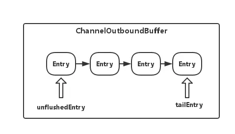

##### incrementPendingOutboundBytes

主要**采用CAS更新totalPendingSize字段**

1. 判断当前totalPendingSize是否超过阈值writeBufferHighWaterMark，默认是65536
2. totalPendingSize >= 65536，则采用CAS更新unwritable为1，并触发ChannelWritabilityChanged事件

**至此全部的buf数据已经保存在outboundBuffer中**

```java
private void incrementPendingOutboundBytes(long size, boolean invokeLater) {
    if (size == 0) {
        return;
    }
    long newWriteBufferSize = TOTAL_PENDING_SIZE_UPDATER.addAndGet(this, size);
    if (newWriteBufferSize >= channel.config().getWriteBufferHighWaterMark()) {
        setUnwritable(invokeLater);
    }
}
```

##### ctx.flush()

默认情况下，**findContextOutbound()会找到pipeline的head节点，触发flush方法**

```java
public ChannelHandlerContext flush() {
    final AbstractChannelHandlerContext next = findContextOutbound();
    EventExecutor executor = next.executor();
    if (executor.inEventLoop()) {
        next.invokeFlush();
    } else {
        Runnable task = next.invokeFlushTask;
        if (task == null) {
            next.invokeFlushTask = task = new Runnable() {
                @Override
                public void run() {
                    next.invokeFlush();
                }
            };
        }
        safeExecute(executor, task, channel().voidPromise(), null);
    }

    return this;
}
```

方法addFlush主要对write过程添加的msg进行flush标识

```java
//HeadContext.java
public void flush(ChannelHandlerContext ctx) throws Exception {
    unsafe.flush();
}

//AbstractUnsafe
public final void flush() {
    assertEventLoop();
    ChannelOutboundBuffer outboundBuffer = this.outboundBuffer;
    if (outboundBuffer == null) {
        return;
    }
    outboundBuffer.addFlush();
    flush0();
}
```

##### flush0

- 如果**当前selectionKey 是写事件，说明有线程执行flush过程，则直接返回**
- 否则**直接执行flush操作**

```java
protected final void flush0() {
    // Flush immediately only when there's no pending flush.
    // If there's a pending flush operation, event loop will call forceFlush() later,
    // and thus there's no need to call it now.
    if (isFlushPending()) {
        return;
    }
    super.flush0();
}

private boolean isFlushPending() {
    SelectionKey selectionKey = selectionKey();
    return selectionKey.isValid() && (selectionKey.interestOps() & SelectionKey.OP_WRITE) != 0;
}
```

- 如果当前socketChannel已经关闭，或断开连接，则执行失败操作
- 否则执行**doWrite把数据写入到socketChannel**

```java
protected void flush0() {
    if (inFlush0) {
        // Avoid re-entrance
        return;
    }

    final ChannelOutboundBuffer outboundBuffer = this.outboundBuffer;
    if (outboundBuffer == null || outboundBuffer.isEmpty()) {
        return;
    }

    inFlush0 = true;

    // Mark all pending write requests as failure if the channel is inactive.
    if (!isActive()) {
        try {
            if (isOpen()) {
                outboundBuffer.failFlushed(NOT_YET_CONNECTED_EXCEPTION, true);
            } else {
                // Do not trigger channelWritabilityChanged because the channel is closed already.
                outboundBuffer.failFlushed(CLOSED_CHANNEL_EXCEPTION, false);
            }
        } finally {
            inFlush0 = false;
        }
        return;
    }

    try {
        doWrite(outboundBuffer);
    } catch (Throwable t) {
        if (t instanceof IOException && config().isAutoClose()) {
            /**
             * Just call {@link #close(ChannelPromise, Throwable, boolean)} here which will take care of
             * failing all flushed messages and also ensure the actual close of the underlying transport
             * will happen before the promises are notified.
             *
             * This is needed as otherwise {@link #isActive()} , {@link #isOpen()} and {@link #isWritable()}
             * may still return {@code true} even if the channel should be closed as result of the exception.
             */
            close(voidPromise(), t, false);
        } else {
            outboundBuffer.failFlushed(t, true);
        }
    } finally {
        inFlush0 = false;
    }
}

public boolean isActive() {
    SocketChannel ch = javaChannel();
    return ch.isOpen() && ch.isConnected();
}
```

##### doWrite

1. size方法：返回outboundBuffer有多少Entry实例
2. in.nioBuffers()
    1. 负责把Entry中保存的ByteBuf类型的msg，重新返回Nio的ByteBuffer实例
    2. 并返回ByteBuffer数组nioBuffers
    3. msg和ByteBuffer实例指向的是同一块内存(在UnpooledDirectByteBuf实现类中，已经维护了ByteBuffer的实例)
3. socketChannel.write()方法把nioBuffers的数据写到socket中，这是Nio中的实现

至此**nioBuffers的数据都flush到socket，客户端可以准备接收**

```java
protected void doWrite(ChannelOutboundBuffer in) throws Exception {
    for (;;) {
        int size = in.size();
        if (size == 0) {
            // All written so clear OP_WRITE
            clearOpWrite();
            break;
        }
        long writtenBytes = 0;
        boolean done = false;
        boolean setOpWrite = false;

        // Ensure the pending writes are made of ByteBufs only.
        ByteBuffer[] nioBuffers = in.nioBuffers();
        int nioBufferCnt = in.nioBufferCount();
        long expectedWrittenBytes = in.nioBufferSize();
        SocketChannel ch = javaChannel();

        // Always us nioBuffers() to workaround data-corruption.
        // See https://github.com/netty/netty/issues/2761
        switch (nioBufferCnt) {
            case 0:
                // We have something else beside ByteBuffers to write so fallback to normal writes.
                super.doWrite(in);
                return;
            case 1:
                // Only one ByteBuf so use non-gathering write
                ByteBuffer nioBuffer = nioBuffers[0];
                for (int i = config().getWriteSpinCount() - 1; i >= 0; i --) {
                    final int localWrittenBytes = ch.write(nioBuffer);
                    if (localWrittenBytes == 0) {
                        setOpWrite = true;
                        break;
                    }
                    expectedWrittenBytes -= localWrittenBytes;
                    writtenBytes += localWrittenBytes;
                    if (expectedWrittenBytes == 0) {
                        done = true;
                        break;
                    }
                }
                break;
            default:
                for (int i = config().getWriteSpinCount() - 1; i >= 0; i --) {
                    final long localWrittenBytes = ch.write(nioBuffers, 0, nioBufferCnt);
                    if (localWrittenBytes == 0) {
                        setOpWrite = true;
                        break;
                    }
                    expectedWrittenBytes -= localWrittenBytes;
                    writtenBytes += localWrittenBytes;
                    if (expectedWrittenBytes == 0) {
                        done = true;
                        break;
                    }
                }
                break;
        }

        // Release the fully written buffers, and update the indexes of the partially written buffer.
        in.removeBytes(writtenBytes);

        if (!done) {
            // Did not write all buffers completely.
            incompleteWrite(setOpWrite);
            break;
        }
    }
}
```

