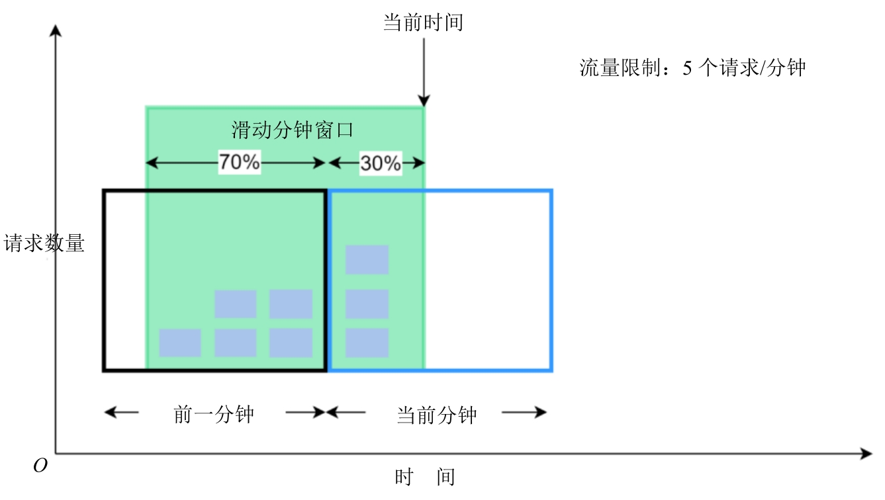
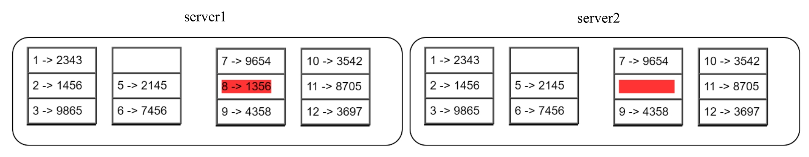
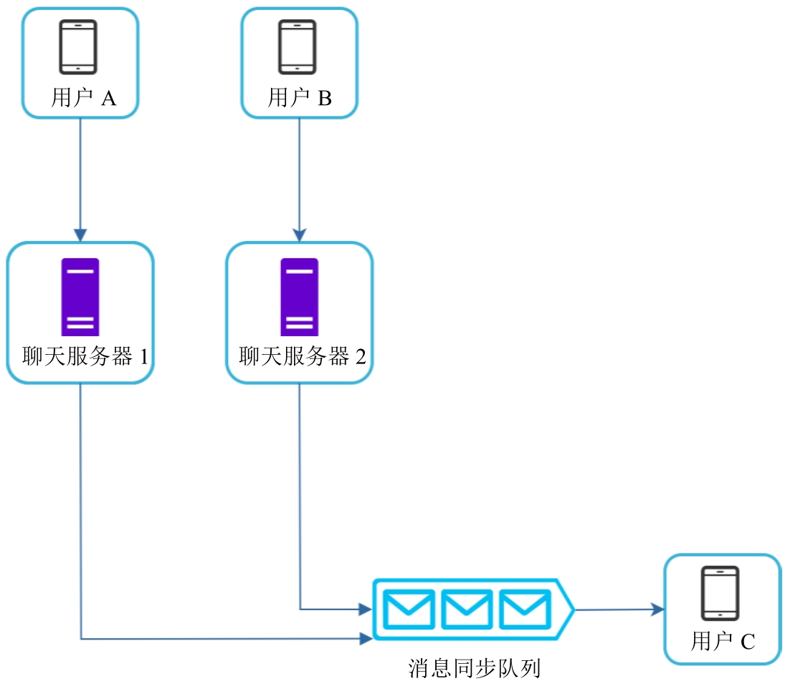
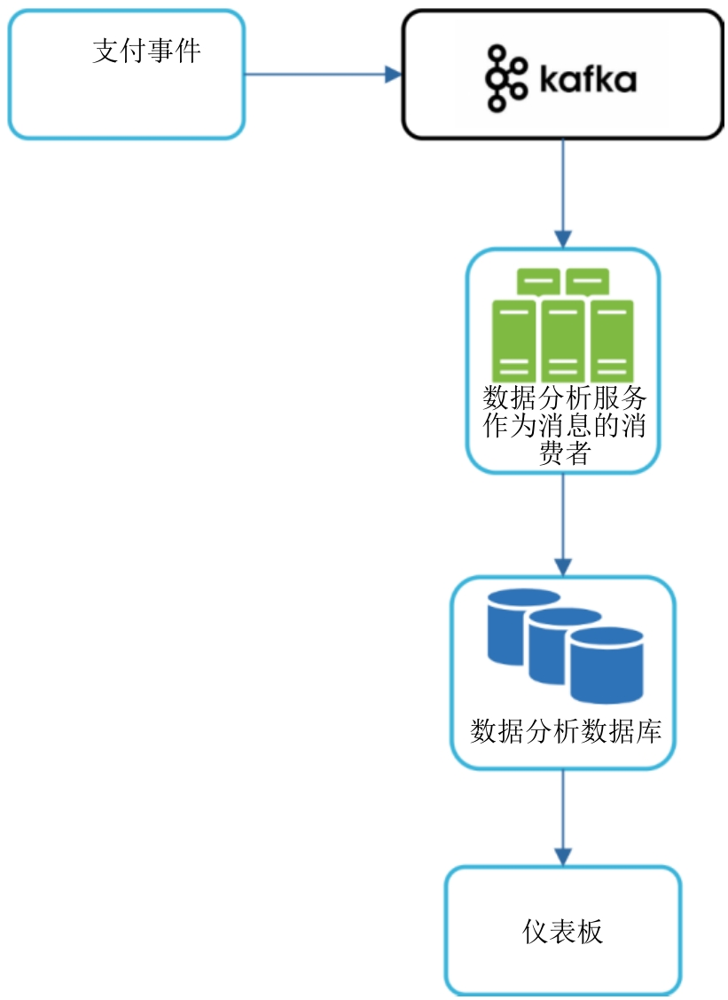
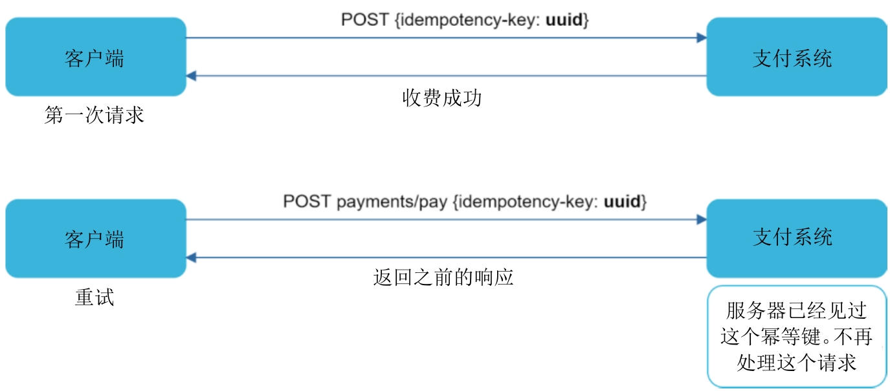
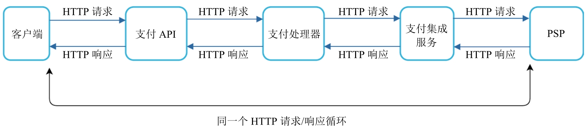
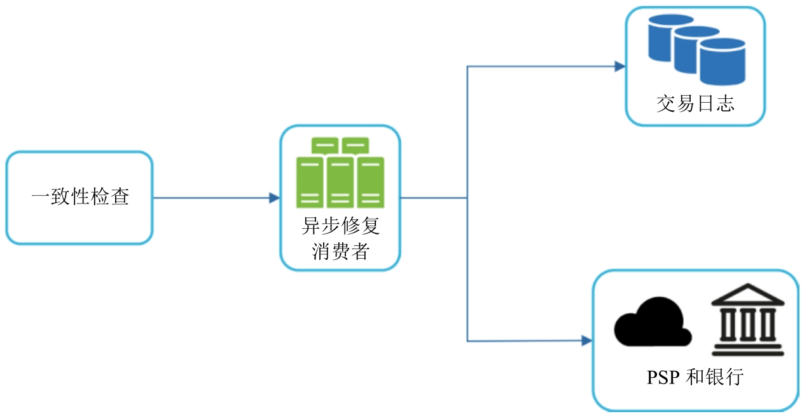
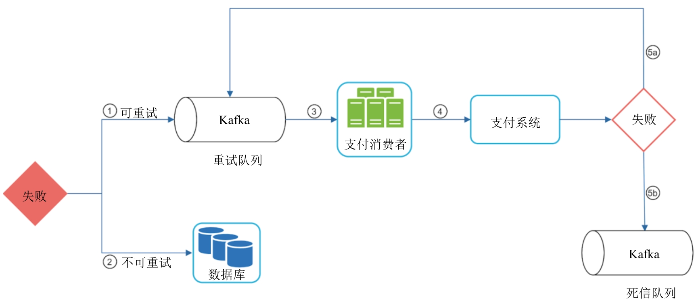

# System Design Interview An Insider’s guide

## 1 从0到100万用户的扩展

### 1.1 单服务器配置


1. **用户通过输入域名(api.mysite.com)访问网站** [**域名系统（DNS）是由第三方提供的付费服务，并不是由服务器来托管的**]
2. **IP地址被返回给网页浏览器或者移动应用** 图1-2被返回的IP地址是15.125.23.214
3. 一旦**获知IP地址，HTTP请求就被直接发送给Web服务器**
4. Web**服务器返回HTML页面或者JSON响应来渲染页面**

Web**服务器流量源头**

1. **Web应用：用服务器端语言处理业务逻辑、数据存储 + 用客户端语言展示内容**
2. **移动应用：用HTTP与服务器通信 + 用JSON作数据传输API响应格式**

### 1.2 数据库

将处理Web应用/移动应用的服务器(网络层)和数据库服务器(数据层)分开


#### 1.2.1 使用何种数据库

- **关系型数据库 RDBMS**
- **非关系型数据库 NoSQL**
    - 类型
        - 键值存储
        - 图存储
        - 列存储
        - 文档存储
    - 特殊使用场景(满足其一考虑NoSQL)
        - 应用只能接受**低延时**
        - **应用数据非结构化**/没有任何关系型数据
        - **只需(反)序列化数据**
        - **存储海量数据**

### 1.3 纵向扩展 vs 横向扩展

|      | 纵向扩展(👆)                                                  | 横向扩展(👈👉)           |
| ---- | ------------------------------------------------------------ | ---------------------- |
|      | **提升服务器能力**                                           | **添加更多服务器**     |
| 局限 | **硬性限制**(不可能无限添加能力)<br />**没有故障转移和冗余** 单点故障完全不可用 | 重新分片/热点键/规范化 |

### 1.4 负载均衡器

- 功能
    - **输入流量均匀分配到负载均衡集的各个Web服务器上**
        - 在客户端和服务器中间加一层
        - **客户端直接连接**负载均衡器的**公共IP**地址
        - **服务器之间和负载均衡器**通过**私有IP**地址通信
    - **解决网络层故障转移**问题 提高网络层可用性
        - 服务器离线后其流量被路由到其他服务器 避免整个网站宕机
        - **网站流量增长非常快时只需要加更多服务器** 负载均衡器自动将请求转移


### 1.5 数据库复制


- **性能好** 写/更新操作在主库上 读操作分配到从库 **系统能并行处理更多读操作**
- **可靠性高** 数据如果在一个数据库损坏 还有其他数据库有复制的数据
- **可用性高** 一个数据库down掉 还有其他数据库顶着
    - **从库宕机**
        - **只有一个从库：暂时将读操作分给主库 同时找一个新从库代替** 
        - **多个从库可用：读操作重定向到其他正常工作的从库 同时找一个新从库代替** 
    - **主库宕机**
        - **推选从库其一为新的主库 所有数据库操作在新主库暂停执行 另一个从库代替新主库复制数据**
        - 生产环境中从库数据不一致 **解决缺失数据问题**
            - **运行数据恢复脚本**
            - **多主复制**
            - **循环复制**


### 1.6 缓存

缓存是临时存储空间 用于**存储耗时响应结果/内存中经常被访问的数据** 后续访问数据能更快

#### 1.6.1 缓存层

**独立缓存层可以提高系统性能/减轻数据库压力/单独扩展缓存层**

Ref：Codeahoy文章“Caching Strategies and How to Choose the Right One”

#### 1.6.2 使用缓存时的注意事项

- 决定何时应该使用缓存：**读频繁改不频繁**可使用缓存
- **过期策略**：考虑过期时间长短
- **保持数据存储和缓存间一致性** Ref：“Scaling Memcache at Facebook”
- 减轻出错影响：**单缓存服务器容易出现单点故障SPOF**
    - **不同数据中心部署多个缓存服务器**
    - **为缓存超量提供一定比例的内存**
- **驱逐策略：缓存已满时新请求导致的对已有条目的删除**
    - LRU
    - LFU
    - FIFO

### 1.7 内容分发网络

**内容分发网络(CDN)是在地理上分散的服务器组成的网络** 用于**传输/缓存静态内容** 


#### 1.7.1 使用CDN时的注意事项

- **花销**：CDN由第三方供应商运营 需要花费
- **合理缓存过期时间**
    - 过长 内容不够新
    - 过短 内容频繁重加载
- CDN回退：应对**CDN故障**
- **作废文件**：可在文件过期前从CDN中移除
    - 调用CDN服务商提供API作废
    - **对象版本化**(查询字符串/URL添加版本号参数)


### 1.8 无状态网络层

**无状态网络层：将状态(用户session)从网络层移出并存在持久性存储中** 集群中**所有Web服务器可以经由数据库访问状态数据**

#### 1.8.1 有状态架构


#### 1.8.2 无状态架构


#### 无状态架构加入整体设计

**会话数据从网络层->持久化存储(NoSQL)**


### 1.9 数据中心


设置**多数据中心**

- **流量重定向**(有能把流量引导到正确数据中心的工具)
- **数据同步**(不同地区用户可使用不同本地数据库/缓存)
    - 在多个数据中心复制数据 ref: https://netflixtechblog.com/active-active-for-multi-regional-resiliency-c47719f6685b
- 测试部署 确保**服务一致性**

### 1.10 消息队列

消息队列：存储**在内存**的支持**异步通信**的**持久化组件** 被用作**缓冲区 分配异步请求**

### 1.11 记录日志、收集指标与自动化

- 记录日志：监控各服务器的错误日志
- 收集指标：收集不同类型的指标数据
    - 主机级别指标：CPU/内存/磁盘I/O
    - 聚合级别指标：数据库/缓存层性能
    - 关键业务指标：DAU/留存率/收益
- 自动化：自动化工具将构建/测试/部署流程自动化

#### 1.11.1 添加消息队列和各种工具


### 1.12 数据库扩展


#### 1.12.1 纵向扩展

为**已有机器增加算力(CPU/内存/硬盘)** 但有缺陷

- **硬件能力有上限**
- **单点故障**风险
- 总**成本高**

#### 1.12.2 横向扩展/分片

添加更多服务器

分片策略最重要的是选择分片键(Sharding Key) 示例将user_id作为分片键


复杂性

- 重分片数据
    - **数据快速增长**到单分片无法存储更多数据
    - **数据分布不均匀**
    - 解决：**一致性哈希算法**
- 热点键问题
    - **过多访问一个特定Shard**造成**服务器过载**
    - 解决：**每个热点键分配一个Shard 再进一步分区**
- 连接和去规范化de-normalization
    - **跨数据库分片的连接很难做**
    - 解决：**数据冗余**
- ref:https://highscalability.com/what-the-heck-are-you-actually-using-nosql-for/

### 1.13 超过100万的用户量

- **网络层无状态**
- 每一层都**冗余**
- 多**缓存**数据
- **多数据中心**
- **CDN**承载静态资源
- **分片**拓展数据层
- **不同架构层分为不同服务**
- 监控系统并使用自动化工具

## 2 封底估算

封底估算(Back-of-the-Envelope Estimation)：利用**常见性能指标数据结合设想实验来估计系统能力/性能要求**

### 2.1 [2的幂]


### 2.2 每个程序员都应该知道的操作耗时


- **内存快 硬盘慢**
- **简单压缩算法快**
- 尽量将**数据压缩**再传输
- 数据中心传输需要时间(不同地区)

### 2.3 可用性相关的数字

可用性用百分比衡量 / SLA服务水平协议规定可用时长


### 2.4 案例：估算推特的QPS和存储需求

#### 推特假设/需求

- **3亿月活用户**
- **50%**用户**每天**使用
- 用户平均**每天发两条**tweets
- **10%**tweets包含**多媒体数据**
- **数据存储5年**

#### 估算

##### QPS

- **每日活跃用户(DAU)** = 3亿 * 50% = 1.5亿
- **推文QPS** = 1.5亿 * 2(每天发两条) / 24(hrs) / 3600(s) = 3500
- **峰值QPS** = 推文QPS * 2 = 7000

##### 数据存储量(多媒体)

- 平均推文大小
    - tweet_id：64 bytes
    - 文本：140 bytes
    - 多媒体文件：1 MB
- **多媒体数据存储量 = 1.5亿 * 2 * 10% * 1MB = 30TB/day**
- 五年...：30 * 365 * 5 = 55PB

### 2.5 小技巧

- 凑整/取近似
- 写假设
- 标单位
- 常用指标(QPS/峰值QPS/存储大小/缓存大小/服务器数量)

## 3 系统设计面试的框架

### 3.1 有效的系统设计面试的四个步骤

#### 3.1.1 第一步：理解问题并确定设计的边界

- **不要在没有彻底了解需求时下结论**
- **提出问题**
    - 构建的功能
    - 用户有多少
    - 系统扩展周期
    - 技术栈
- **写下假设**

#### 3.1.2 第二步：提议高层级的设计并获得认同

- **初始蓝图** 征求反馈
- 画出**关键组件** (客户端/API/服务器/数据存储/缓存/CDN/消息队列等)
- **封底估算** 评估初步设计是否满足需求
- 考虑**具体用例** (发现corner case)
- **积极沟通** 确保设计包含的内容

#### 3.1.3 第三步：设计继续深入

- 确认系统**整体目标/功能范围**
- 勾画系统整体设计**高层级蓝图**
- 得到关于系统高层级**设计反馈**
- 识别**架构组件**并划**优先级**顺序
- 时间管理 **避免不必要细节讨论**

#### 3.1.4 第四步：总结

追问/自由讨论

- **识别系统瓶颈 讨论潜在改进方案**
- **复述可行设计方案**
- 讨论**故障场景**
- **运维问题**：监控指标/错误日志/发布系统
- 应对**下一次扩展**

面试正确操作

- 不要自行预设需求 向面试官**寻明解释**
- **理解问题需求**
- **没有最佳答案**
- 持续**沟通**
- 尽可能提出**多个方案**
- 设计蓝图达成一致后**先设计讨论细节中的最重要组件**
- **永不放弃**

面试禁忌

- 未准备好常见面试问题
- 没有弄清需求/假设就给出解决方案
- 一开始就讨论某组件大量细节
- **思路卡住时要提示**
- **面试官说结束才是真的结束** 尽早且频繁征求面试官反馈

### 3.2 面试中每一步的时间分配

- 第一步：理解问题并确定设计的边界（3～10min）
- 第二步：提议高层级的设计并获得认同（10～15min）
- 第三步：设计继续深入（10～25min）
- 第四步：总结（3～5min）

## 4 设计限流器

API限流器优点

- 预防DoS
- 降低成本
- 预防服务器过载

### 4.1 第一步：理解问题并确定设计的边界

- **准确限制过量请求**
- **低延时**
- 少占内存
- **分布式** 多个服务器/进程共享
- 处理异常
- **高容错性**

### 4.2 第二步：提议高层级的设计并获得认同

#### 4.2.1 在哪里实现限流器

- **客户端**限流器：**客户端不是强制实行限流的可靠位置(客户端请求易伪造/无法控制客户端实现)**

- **服务器端**限流器

    

    - 所有功能/模块都在服务器端实现 可自由选择流量限制算法

- **中间件**限流器

    

    - 使用了微服务机构/API网关
    - 创建限流器很费时间

#### 4.2.2 流量限制算法

##### 代币桶算法 Token Bucket

- 原理

    - **Token Bucket有预定容量** **token按预定速率放入bucket** 一旦bucket放满token溢出

    - **每个request消耗一个token** **没有足够token时request被丢弃**

         

    -  代币消耗/重新注入/流量限制 bucket size=4 refill rate=4

        

- **参数**

    - **bucket size(容纳多少token)**
    - **重新注入token速度 token refill rate**

- 流量限制

    - **不同API端点**使用**不同bucket**
    - 基于IP限流需要**每个IP一个bucket**

- 优点

    - 算法**容易实现**
    - **内存使用效率高**
    - **允许短时间内突发流量**

- 缺点

    - 两个参数的衡量

##### 漏桶算法 Leaking Bucket

- 原理
    - request到达时系统先检查桶是否已满
        - 没满加到FIFO队列里
        - 满了丢弃请求
    - 定期从队列取出request处理
    - 
- 参数
    - **bucket size = 队列大小**
    - **出队速度 每秒可处理请求数**
- 优点
    - 队列大小有限 **内存使用更高效**
    - 请求按**固定速率**处理 **适合出队速度稳定场景**
- 缺点
    - **突发流量使队列堆积大量旧请求 新请求会被限流**
    - 两个参数难以调校好

##### 固定窗口计数器算法 Fixed Window Counter

- 原理

    - 时间轴分成固定大小时间窗口 每个时间窗口分配一个counter

    - 到达一个请求 counter+1

    - counter到达预设阈值 新请求被丢弃 直到开启新时间窗口

        

- 优点

    - 内存使用效率高
    - 易于理解
    - 每个窗口结束时重置请求数阈值

- 缺点

    - 时间窗口边界流量激增 导致请求数超过阈值被丢弃

        

##### 滑动窗口日志算法 Sliding Window Log

- 原理

    - **记录每个请求时间戳 新请求到达时移除所有过时时间戳**(早于当前时间窗口起始时间)

    - 新请求时间戳记录到日志

    - **日志条数<=允许的请求数 请求通过** 否则被拒

        

- 优点

    - **流量控制非常准确** 任何滑动窗口请求数量不会超过阈值

- 缺点

    - **消耗内存多** 请求被拒绝其时间戳依然存在内存中

##### 滑动窗口计数器算法 Sliding Window Counter

- 原理

    - **滑动窗口允许请求数：当前窗口请求数 + 之前窗口请求数*滑动窗口和之前窗口重合率**

        

- 优点
    - **平滑流量波动** 当前窗口请求速率有部分是基于之前算出来的
    - **内存使用高效**
- 缺点
    - 只对不严格回溯窗口起作用

#### 4.2.3 高层级架构

**Redis实现计数器(INCR/EXPIRE)：记录多少请求是由同一用户/IP地址发来的**

- 客户端发送请求给限流器中间件
- 中间件在Redis对应bucket中获取计数器并检查
    - 达到阈值 拒绝请求
    - 没到阈值 请求发送给API服务器 增加计数器值


### 4.3 第三步：设计继续深入

#### 4.3.1 流量限制规则

**Lyft开源流量限制组件**


#### 4.3.2 超过流量的限制

限流器返回HTTP头

- **X-Ratelimit-Remaining**：在当前时间窗口内剩余的允许通过的请求数量
- **X-Ratelimit-Limit**：客户端在每个时间窗口内可以发送多少个请求
- **X-Ratelimit-Retry-After**：在被限流之后，需要等待多少秒才能继续发送请求而不被拦截
    - **响应码：429** 请求过多

#### 4.3.3 详细设计


- **流量限制规则存硬盘** 工作进程(worker)从硬盘获取规则将其存在缓存中
- 客户端发起请求 首先发到限流器中间件
- 限流器中间件从缓存加载规则(Redis中获取计数器/上次请求时间戳)
    - 请求没被限流 转发给API服务器
    - 请求被限流 返回给客户端429 请求被丢弃/转发到消息队列

#### 4.3.4 分布式系统中的限流器

##### 竞争条件 Race Condition

Redis计数器在高并发环境下会加错正确值

- 锁
    - 最直观解决
    - 显著拖慢系统
- **Lua脚本**
- **Redis有序集合Sorted Set**
    - Ref：Better Rate Limiting With Redis Sorted Sets
    - Ref：Scaling your API with rate limiters

##### 同步问题

**限流器之间必须同步以接受所有客户端请求**

- **黏性会话 Sticky Session：允许客户端将请求发到同一个限流器**

    - 不灵活 不建议使用

- **中心化的数据存储(e.g. Redis)**

    

#### 4.3.5 性能优化

- **设置多数据中心：降低延时**
- **最终一致模型：同步数据**

#### 4.3.6 监控

- 确保**流量限制算法有效**
- 确保**流量限制规则有效**

### 4.4 第四步：总结

- 流量限制算法
    - token bucket
    - leaking bucket
    - fixed window counter
    - sliding window counter
    - sliding window log
- 系统架构
- 分布式限流器
- 性能优化
- 监控
- 扩展
    - **硬/软流量限制**
        - 硬流量限制：请求数量不能超过阈值
        - 软流量限制：请求数量可以短时间超过阈值
    - 不同层级做流量限制
        - HTTP(应用层)(该章)
        - **Iptables(IP层)**
    - **避免被限流**
        - **客户端缓存** 避免频繁调API
        - 理解流量限制 不要短时间发过多请求
        - 添加代码**捕获异常/错误** **做好**客户端**异常恢复**
        - **重试**逻辑添加**足够退避时间**

## 5 设计一致性哈希系统

### 5.1 重新哈希的问题

N个缓存服务器 平衡负载时如果用 服务器序号 = hash(key) % N


- 服务器数量固定不变时效果好且数据分布均匀

- **服务器数量变化**时产生问题

    - **数据分布不均匀**
    - **数据错误分配** 大量**缓存未命中 Cache Miss**

    

### 5.2 一致性哈希

一致性哈希平均只需要**重新映射k/n个键 k=键的数量 n=槽的数量**

#### 5.2.1 哈希空间和哈希环

假设使用SHA-1为**哈希函数f 哈希空间为0(x0) - 2^160 - 1(xn)** 


#### 5.2.2 哈希服务器

将4个**服务器根据其IP/名字映射到哈希环上**


#### 5.2.3 哈希键

哈希键被映射到哈希环上


#### 5.2.4 查找服务器

**确定某个键存储在哪个服务器**上：**从这个键在环上位置顺时针查找 直到找到一个服务器为止**


#### 5.2.5 添加服务器

**添加新服务器(server4) 只有key0需要重新分配位置到server4**


#### 5.2.6 移除服务器

**移除服务器(server1) 只有key1需要重新映射到server2**


#### 5.2.7 两个问题

一致性哈希算法步骤

- 使用均匀分布的哈希函数将服务器和键映射到哈希环上
- 要找出某个键被映射到了哪个服务器上，就从这个键的位置开始顺时针查找，直到找到哈希环上的第一个服务器

两个问题

- **添加/移除**服务器时很**难保证哈希环上所有服务器分区大小相同**

    

- **键在哈希环上非均匀分布**

    

**解决：虚拟节点**

#### 5.2.8 虚拟节点

虚拟节点是**实际节点在哈希环上的逻辑划分/映射**


**确定某个键存储在哪个服务器：这个键所在位置顺时针找到第一个虚拟节点**(k0在server1存储)


**虚拟节点数量增加时键分布更均匀--标准差(数据分散程度)变小** 但虚拟节点**需要空间存储** 需要作权衡

#### 5.2.9 找到受影响的键

**添加节点时找到受影响的键范围：从新添加节点开始逆时针直到遇到另一个服务器为止需要分配给新添加服务器**


**移除节点时找到受影响的键范围：从移除节点开始逆时针直到遇到另一个服务器为止需要分配给顺时针下一个服务器**


### 5.3 总结

一致性哈希优点

- **添加/移除服务器时重新分配键最少**
- **容易横向扩展 数据分布更均匀**
- **减轻热点键问题**

## 6 设计键值存储系统

键值存储==键值数据库(非关系型数据库)

键值对：唯一标识符为键(key) 和 与其关联的值(value)存储在一起

### 6.1 理解问题并确定设计的边界

- 键值对不大(size < 10KB)
- **可存储大数据**
- **高可用性**
- **高可扩展性**
- **自动伸缩**
- **可调节一致性**
- **低延时**

### 6.2 单服务器的键值存储

单服务器**存储优化**

- **压缩数据**
- **频繁使用数据存到内存 其他放硬盘**

### 6.3 分布式键值存储/哈希表

#### 6.3.1 CAP理论

- **Consistency：所有客户端相同时间点看到的是相同数据** 任意节点故障会导致其他节点也不可接受写操作
- **Availability：有节点发生故障时任意客户端发出请求都能被其他可用节点响应处理**
- **Partition Tolerance**：网络分区是一种故障类型 **分区容错时必须一致性和可用性二选一(CP/AP)**

#### 6.3.2 系统组件

6.3.3～6.3.10

大部分内容基于**Dynamo/Cassandra/BigTable**

#### 6.3.3 数据分区

使用一致性哈希

- **自动伸缩：可基于负载自动添加/移除服务器**
- 异质性：服务器**虚拟节点数量**可以**和服务器性能成正比**


#### 6.3.4 数据复制

必须在**N个服务器上异步复制**：一个键被映射到哈希环上后从其位置**顺时针找到先遇到的N个服务器存储数据副本**


**虚拟节点**会出现**少于N个物理服务器**：顺时针遍历**不重复的服务器**

**数据副本存储在不同数据中心(通过高速网络连接)**：保证系统可靠性/可用性/容错性

#### 6.3.5 一致性

##### **仲裁一致性 Quorum Consensus**

- 保证读写操作一致性

- **N – Total number of nodes in our system**
- **W – Minimum number of nodes required for a successful write operation**
- **R – Minimum number of nodes required for a successful read operation**
- for an **N node system**, we must confirm **a write as successful if it is confirmed by at least W replicas** and **read operation to be successful if confirmed by at least R replicas**
- 可能配置
    - **读写操作至少有一个共同副本参与** 保证**强一致性**： **R + W > N**
    - **快速读：R=1 && W=N**
    - **快速写：W=1 && R=N**
    - 弱一致性：**R + W <= N**

##### 一致性模型

- **强一致性模型：任何读操作返回值都是最新写入的值 客户端永不会看到过时数据**
    - 实现：**强制一个副本在当前写入成功前不再接收新的读写操作**
    - **有阻塞** 不能实现高可用 
- **弱一致性模型：读操作返回的可能不是最新的值**
- **最终一致性模型：弱一致性特殊形态 足够长时间后所有数据更新传播且所有副本变为一致状态**
    - **推荐**的键值存储使用模型
    - **并行写 允许不一致的值进入系统并强制客户端读取这些值进行协调**

#### 6.3.6 不一致性的解决方案：版本控制

##### 不一致性问题


##### 向量时钟

**D([Sn, vn]) == D是数据项/Sn是服务器编号/vn是版本计数器值**

- **[Si, vi]存在 增加vi值**
- **[Si, vi]不存在 增加新纪录[Si, 1]**


- 检测冲突
    - **版本Y所有参与者版本号都大等于版本X对应参与者版本号 ==> X为Y祖先** (e.g. X: D([s0, 1], [s1, 1]) Y: D([s0, 1], [s1, 2]))
    - **版本Y任一参与者版本号小于版本X对应参与者版本号 ==> 存在冲突** (e.g. X: D([s0, 2], [s1, 1]) Y: D([s0, 1], [s1, 2]))
- 缺点
    - 增加客户端复杂性(**客户端需要实现冲突解决逻辑**)
    - 向量时钟数据迅速增长 **超过阈值老数据会被移除 可能无法判断后代关系**

#### 6.3.7 处理故障

##### 故障检测

###### 全对全多播 All-to-All Multicasting

**简单 但服务器数量多时效率低**


###### Gossip协议

- 去中心化
- 原理
    - 每个节点**维护一个节点成员列表**(成员ID+心跳计数)
    - 每个节点定期**增加自己的心跳计数**
    - 每个节点定期**给一组随机节点发送心跳信号** 接着信号传递给另一组节点
    - 节点**收到心跳信号 更新成员列表**
    - **心跳计数在预定时间没增加则被认为宕机**


##### 处理临时故障

###### 松散仲裁

- **提高可用性**
- 原理
    - **在哈希环上最先发现的W个正常工作服务器进行写操作**
    - **在哈希环上最先发现的R个正常工作服务器进行读操作**
    - **发生故障的服务器被忽略**

###### 暗示性传递

**服务器不可用时另一个服务器会临时处理请求 服务器恢复可用时其故障期间的变更会被推送回来**


##### 处理永久故障

###### 反熵协议

**保持副本同步--Merkle树**

- 键空间分成不同的桶


- 桶里**每个键都用一致哈希Uniform Hashing Method计算哈希值**



- 为每个桶创建一个**哈希节点**


- 向上构建树 通过**计算子节点哈希值得到父节点哈希值**


- 比较两个树：从根节点哈希值匹配->先左后右比较子节点哈希值

##### 处理数据中心故障

建立**多数据中心**

#### 6.3.8 系统架构图

##### 架构图

- **客户端和键值存储系统**间通过**API通信(get/put)**
- **协调者是一个节点** 在客户端和键值存储系统间作**代理**
- **节点**通过一致性哈希**分布在哈希环上**
- **系统完全去中心化**
- **数据被复制到多个节点**
- **没有单点故障** 每个节点职能一样


#### 6.3.9 写路径

1. **写请求在提交日志文件commit log中被持久化**
2. **数据被保存在内存缓存中**
3. **缓存已满/达到阈值时数据被刷新到硬盘SSTable中**


#### 6.3.10 读路径

1. **先检查数据是否在缓存**

    1. 在缓存 **数据直接返回给客户端**

        

    2. 不在缓存

        1. **用布隆过滤器确定哪个SSTable包含所需数据所在键**
        2. **SSTable返回数据**
        3. **数据返回给客户端**

        

### 6.4 总结


## 7 设计分布式系统中的唯一ID生成器

### 7.1 第一步：理解问题并确定设计的边界

- **必须唯一**
- **只包含数字**
- **64位**
- **按日期排序**
- **每秒生成超过10000个ID**

### 7.2 第二步：提议高层级的设计并获得认同

#### 7.2.1 多主复制 Multi-master Replication

- 利用数据库自增特性 **下一个ID加k(即正在使用的服务器数量)**
- ID可**随着服务器增加同步扩展**
- 缺点
    - **很难和多个数据中心一起扩展** 需要额外同步/协调
    - 分布式环境下多服务器同时生成ID导致**ID不连续且不随时间递增**
    - **服务器被添加/移除**时**ID不能随之变化**


#### 7.2.2 UUID Universally Unique Identifier

- **独立生成且不需在服务器间作协调/同步**
- **生成ID简单**
- 系统**易于扩展** ID生成器可随Web服务器扩展
- 缺点
    - ID长**128位**
    - ID**不随时间增加**
    - ID可能是**非数字**的


#### 7.2.3 工单服务器 Ticket Server

- **工单服务器：中心化的单数据库服务器** Ref：https://code.flickr.net/2010/02/08/ticket-servers-distributed-unique-primary-keys-on-the-cheap/
- **ID为数字**
- **容易实现**
- 缺点
    - **单点故障**
    - **多工单服务器**有**数据同步**问题


#### 7.2.4 推特的雪花系统 Snowflake System

将64位ID分为五个部分

- **符号位（1位）**：它始终为数字0，留作未来使用 它有**可能被用来区分有符号数和无符号数**
- **时间戳（41位）**：它是**从纪元或者自定义纪元开始以来的毫秒数**
    - Snowflake默认纪元（epoch）：1，288，834，974，657 <==> UTC时间2010年11月4日01:42:54
- **数据中心ID（5位）**：最多可以有32(2^5)个数据中心
- **机器ID（5位）**：每个数据中心最多可以有32(2^5)台机器
- **序列号（12位）**：对于**某个机器/进程，每生成一个ID，序列号就加1** 这个数字**每毫秒开始时都会被重置为0**


### 7.3 第三步：设计继续深入

#### 符号位/数据中心ID/机器ID

**数据中心ID/机器ID在系统运行时是固定的**

#### 时间戳

**二进制表示->十进制数+推特纪元->毫秒数->UTC时间**


#### 序列号

序列号有4096(2^12)种组合**(理论上一个服务器每毫秒最多生成4096个ID)** 一般是0(除非1毫秒内同一服务器生成多个ID)

### 7.4 第四步：总结

- 扩展
    - **时钟同步：NTP(网络时间协议)是解决方案**
    - **调整ID个部分长度**
        - 低并发+长时间持续运行应用：减少序列号部分长度 增加时间戳部分长度
    - **高可用性**

## 8 设计URL缩短器

### 8.1 第一步：理解问题并确定设计的边界

- **缩短URL：提供长URL 返回短URL**
- **重定向URL：提供短URL 重定向到原URL**
- **高可用/扩展性/容错性**

#### 8.1.1 封底估算

- 写：生成1亿URL
    - 每秒写：1亿/(24*3600) = 1160
- 每秒读：读写操作假设10:1 1160 * 10 = 11600
- 运行10年 支持1亿 * 365 * 10 = 3650亿条记录
- URL平均长度100bytes 10年存储容量：3650亿 * 100bytes = 36.5TB

### 8.2 第二步：提出高层级的设计并获得认同

#### 8.2.1 API端点

- **缩短URL**
    - **POST api/v1/data/shorten**
    - request param：**{longUrl: longURLString}**
    - return: shorten url
- **重定向URL：提供短URL 重定向到原URL**
    - **GET api/v1/shorUrl**
    - return: long url

#### 8.2.2 URL重定向


- **301**
    - **永久重定向**
    - **浏览器缓存响应** 可**降低服务器负载**
- **302**
    - **暂时重定向**
    - **浏览器不缓存响应**
    - **跟踪点击率/点击来源** 有助于数据分析
- **哈希表**：实现URL重定向
    - <shortURL, longURL>
    - **获取长URL：longURL=hashtable.get(shortURL) 然后URL重定向**

#### 8.2.3 缩短URL

**哈希函数**满足要求

- **每个长URL必须可通过该函数转换成哈希值hashValue**
- **每个哈希值可被映射回原始的长URL**


### 8.3 第三步：设计继续深入

#### 8.3.1 数据模型


#### 8.3.2 哈希函数

##### 哈希值长度

**哈希值由数字(0-9)和字母(a-z/A-Z)组成 62种可能字符 找到足够小的n使其62的n次幂大于等于3650亿**


##### 哈希+解决冲突

**取函数哈希值的前7个字符->布隆过滤器检查是否有对应的短url->哈希冲突->递归加预先设置的字符串->直到不再发现冲突**


##### Base62转换(基数转换)

**十进制数11157 => Base 62 representation**

2 * 62^2 + 55 * 62^1 + 59 * 62^0 = [2, 55, 59] => **[2, T, X]**


##### 两种方法对比


#### 8.3.3 深入探讨URL缩短流程

1. **输入长URL**
2. 系统检查**数据库是否有长URL**
3. **有 之前被转为短URL 数据库直接获取短URL返回**
4. **没有** 是新的长URL 系统**唯一ID生成器生成新的唯一ID(主键)**
5. **ID == Base 62 转换 ==>短URL**
6. **创建新数据库记录**：ID/短URL/长URL


#### 8.3.4 深入探讨URL重定向流程

1. 用户**点击短url**
2. **负载均衡器**将**请求转发给Web服务器**
3. 短url**在缓存 直接返回对应长url**
4. 短url**不在缓存 去数据库取 将对应<shortURL, longURL>存在缓存里**
5. Z将**长url返回**给用户


### 8.4 第四步：总结

- API设计/数据模型/哈希函数/URL缩短/重定向
- 扩展
    - 限流器
    - Web服务器伸缩
    - 数据库扩展：复制/分片
    - 数据分析
    - 可用性/一致性/可靠性

## 9 设计网络爬虫

**网络爬虫：收集网页 沿着网页链接收集内容**

用途

- **搜索引擎索引**
- **网页存档**
- **网络挖掘**
- **网络监控**


### 9.1 第一步：理解问题并确定设计的边界

#### 爬虫基本算法

1. **给定一组URL 下载URL对应网页**
2. **网页中提取URL**
3. **新的URL添加到下载列表**
4. **重复1-3**

#### 封底估算

- **每月**下**10亿网页**
- **QPS：10亿 / (24 * 3600 * 30) = 400**
- **峰值QPS：2 * QPS** = 800
- 假设平均每个**网页大小=500KB**
- **每月存储**：**10亿 * 500** = 500TB
- 数据**保存5年**：**500TB * 12 * 5** = 30PB

### 9.2 第二步：提议高层级的设计并获得认同

#### 高层级设计

- **种子URL**

    - **爬虫起点**
    - 种子选择
        - 基于**地理位置**划分
        - 基于**话题**选择

- **URL前线 Frontier**：一个用于**存储即将下载的URL**且基于FIFO队列的组件

- **HTML下载器：从互联网上下载网页**

- **DNS解析器：将URL转为IP地址**

- **内容解析器：解析和校验下载的网页**

- **数据结构”已见过的内容？“(哈希表)**

    - **重复内容处理**
    - **消除数据冗余**
    - **缩短处理时间**
    - **比较两个文件哈希值**

- **内容存储**

    - **大部分内容存硬盘**
    - **热门内容存内存**

- **URL提取器：从HTML页面解析/提取链接**

    

- **URL过滤器：排除特定内容类型/文件扩展名/问题链接/黑名单网站**

- **已见过的URL？**数据结构

    - 追踪记录已访问过的/已在URL前线的URL
    - **避免重复添加同一URL增加负载导致的无限循环**
    - **布隆过滤器/哈希表**

- **URL存储：存储用于保存已访问的URL**

#### 爬虫工作流程

1. 种子URL添加到URL前线
2. HTML下载器从URL前线获取URL列表
3. HTML下载器从DNS中获取URL对应IP并开始下载
4. 内容解析器解析/检查HTML页面
5. 内容解析器将内容传给已见过的内容组件
6. 已见过的内容组件检查HTML页面是否已在数据库中
    1. 已经在数据库中 页面被丢弃
    2. 不再数据库中 页面传递给链接提取器
7. 链接提取器从HTML页面提取链接
8. 提取的链接交给URL过滤器筛选
9. 筛选的链接被传递给已见过的URL组件
10. 已见过的URL组件检查URL是否已经在数据库中 是的话不再作处理
11. URL没被处理过 添加到URL前线


### 9.3 第三步：设计继续深入

#### 9.3.1 DFS vs. BFS

BFS

- 爬虫常用 URL按照FIFO队列顺序出列

- 问题

    - **同一个网页大部分链接指向同一主机**时**大量爬虫请求容易淹没服务器**

        

    - **标准BFS没有考虑URL优先级**

#### 9.3.2 URL前线

- 确保爬虫**礼貌性**

    - **避免短时间内对同一服务器发送太多请求**

    - 原理

        - **同一主机每次只下载一个网页**

        - 两次下载**任务间加入延时**

        - **礼貌性约束：维护网站主机名和下载线程(worker)的映射**

            

            - **队列路由器**：确保每个队列b1-bn只包含来自同一个主机的URL

            - **映射表**

                

            - **FIFO队列**

            - **队列选择器**：按照映射表分配队列给worker

            - **下载线程**Worker1-Workern：一个接一个下载同一主机网页 两次任务间加入延时

- 确定**URL优先级**

    - **PageRank**
    - **网站流量**
    - **网站更新频率**

    

- https://ics.uci.edu/~djp3/classes/2009_01_02_INF141/Lectures/

##### URL前线设计

- **前队列：优先级管理**
- **后队列：礼貌性管理**
- **新鲜度**
    - 爬虫**必须定期重新爬取下载过的网页** 确保数据更新
    - 优化新鲜度
        - **根据网页更新历史判断**
        - **URL优先频繁重新爬取重要网页**
- 存储
    - **大部分URL放硬盘**
    - **内存维护buffer进行入队/出队 数据定期写入硬盘**


#### 9.3.3 HTML下载器

##### Robots Exclusion Protocal：robots.txt

**网站和爬虫间的通信标准 定义了允许爬虫下载的网页**

##### 分布式爬取

**爬取任务被分配给多服务器 每个服务器运行多线程**


##### 缓存DNS

- **避免频繁向DNS服务器发起请求**
- **保存域名和IP映射**
- **定时任务更新**

##### 本地性

**将爬虫服务器按地理位置分布**

##### 短超时时间

**确定最长等待时间 超过改该时间即停止任务爬取其他页面**

#### 9.3.4 健壮性

- **一致性哈希：负载可在HTML下载器间均匀分布**
- **保存爬取状态/数据：易重启被中断的爬取过程**
- **异常处理**
- **数据校验**

#### 9.3.5 可扩展性


#### 9.3.6 检测和避免有问题的内容

##### 重复内容

**哈希/check sum 帮助检测重复内容**

##### 蜘蛛陷阱

蜘蛛陷阱：**导致爬虫陷入无限循环的网页**

- **设置最大URL长度避免无限深的目录结构URL**
- 手动验证/识别
- 定制URL过滤器

##### 数据噪声

尽可能排除**广告/代码片段/垃圾邮件URL**

### 9.4 第四步：总结

扩展

- 解析网页前进行**服务端渲染**
- **反垃圾组件** 过滤低质量垃圾页面
- **数据库复制/分片**
- **横向扩展 保持服务器无状态**
- 数据分析

## 10 设计通知系统


### 10.1 第一步：理解问题并确定设计的边界

- **支持什么类型/设备**
- **实时性**
- **触发通知方式**
- **用户端体验**
- **发送通知数量**

### 10.2 第二步：提议高层级的设计并获得认同

#### 10.2.1 不同类型的通知

##### IOS推送通知


##### 安卓推送通知


##### 短信推送通知


##### 邮件推送通知


##### 整合


#### 10.2.2 联系信息的收集流程

**用户安装应用/注册->到负载均衡器->分配API服务器处理请求->收集联系信息(移动设备令牌/手机号/邮箱信息/...)->存数据库**


**一个用户(用户信息)可拥有多个设备(设备令牌) 可将一个通知推送到用户所有设备中**


#### 10.2.3 通知的发送与接收流程

- **服务 1-N：微服务/定时服务/触发通知发送事件的分布式系统**
- **通知系统：给服务提供API并为第三方服务构建通知载荷**
- **第三方服务**：发送通知给用户
- 问题
    - 单点故障(单台通知服务器)
    - 难以扩展
    - 性能瓶颈：构建HTML页面/第三方服务响应费时
- 解决
    - 把**数据库和缓存从通知服务器移出**
    - 加入**多台通知服务器**设置**自动横向扩展**
    - 引入**消息队列**解耦系统组件


- **服务1-N：不同的服务调用通知服务器提供的API来发送通知**
- **通知服务器**
    - **为服务提供API**且API只在内部/验证过的客户端访问
    - 实施**基本的身份校验**
    - **查询数据库/缓存获取渲染通知所需的数据**
    - **通知数据放到消息队列以并行处理**
- **缓存：缓存用户信息/设备信息/通知模版**
- **数据库：存储用户/通知/设置**等数据
- **消息队列**
    - **通知缓冲区**
    - **每种类型通知都有对应队列：第三方服务故障时不会影响其他通知**
- **Worker**：一组服务器**从消息队列中拉取通知事件并将其发送给对应的第三方服务**
- 第三方服务


### 10.3 第三步：设计继续深入

#### 10.3.1 可靠性

- **通知系统在数据库端的持久化：重试机制**


- **去重机制**
    - **通知事件第一次到达时检查事件ID**
    - 出现过 丢弃事件
    - 没出现过 发出通知

#### 10.3.2 其他组件和要考虑的因素

##### 通知模版


##### 通知设置


##### 流量限制

**限制用户能收到的通知数量**

##### 重试机制

**第三方发送通知失败时加入消息队列重新发送 问题持续时告警开发人员**

##### 推送通知的安全问题

IOS/安卓：**appKey/appSecret确保推送通知API的安全**

##### 监控队列通知

**监控队列中的通知总数以便调整Worker数量**

##### 事件追踪


#### 10.3.3 更新后的设计


## 11 设计news feed系统

### 11.1 第一步：理解问题并确定设计的边界

- **功能**
    - 发布帖子
    - 查看帖子
- **排序**
    - 时间倒序
    - 话题分数
    - 优先亲密度
- **好友数量限制**：5000
- **网络流量**：1000万DAU
- 是否包含**多媒体文件**

### 11.2 第二步：提议高层级的设计并获得认同

两个流程：发布feed / 构建feed

- **发布feed**：当用户发布帖子时，相应的数据会写入缓存和数据库 帖子会发布到用户好友的news feed中
- **构建news feed**：假设news feed按时间倒序聚合好友帖子

#### 11.2.1 news feed API

##### 发布feed

**POST /v1/me/feed**

- **content**：帖子的文本内容
- **auth_token**：用于对 API 请求进行身份验证的令牌

##### 获取news feed

**GET /v1/me/feed**

- **auth_token**：用于对 API 请求进行身份验证的令牌

#### 11.2.2 feed的发布

- **用户：用户可以在浏览器或移动应用上查看news feed**
    - 用户使用内容 “Hello” 通过 API发布帖子：**POST /v1/me/feed?content=Hello&auth_token={auth_token}**
- **负载均衡器：将流量分配到 Web 服务器**
- **Web 服务器：将流量重定向到不同的内部服务**
- **帖子服务：将帖子保留在数据库和缓存中**
- **广播服务fanout service：将新内容推送到好友的news feed中** 
    - **news feed数据存储在缓存**以便快速检索
- **通知服务：通知好友有新内容可用，并发送推送通知**


#### 11.2.3 news feed的构建

- **用户：发送请求以检索其新闻提要** 
    - 请求如下所示：/ v1/me/feed
- **负载均衡器：将流量重定向到 Web 服务器**
- **Web 服务器：将请求路由到news feed服务**
- **news feed服务：从缓存中获取news feed**
- **news feed缓存：存储**渲染news feed所需的**news feed ID**


### 11.3 第三步：设计继续深入

#### 11.3.1 深入探讨feed的发布流程


##### web服务器

**与客户端通信/验证用户身份/限流**

##### 广播服务

广播/扇出是将**帖子发送给所有朋友的过程**

- **写广播/推模型**：**news feed在写入时预先计算的 一个新的帖子发布后会立即发送到朋友的缓存中**
    - 优点
        - **实时生成news feed 且立刻推送好友**
        - **获取news feed很快** 帖子写入时系统计算好哪些人会订阅
    - 缺点
        - **热点问题：获取朋友列表并为所有朋友生成news feed慢又耗时**
        - **不活跃的用户 预计算浪费资源**
- **读广播/拉模型：读取时才生成news feed 按需加载最近帖子**
    - 优点
        - 对于不活跃用户 **不浪费资源**
        - **不存在热点问题 数据不会被推给好友**
    - 缺点
        - **没有预先计算 获取news feed很慢**
- 折中
    - **大部分用户：使用写广播/推模型保证快速获取news feed**
    - **名人/粉丝数多用户：粉丝按需拉取新news feed避免系统过载 + 一致性哈希帮助均匀分配请求/数据**


###### 广播服务工作原理

1. 从**图形数据库中获取好友 ID** (图数据库适合管理好友/好友推荐)
2. 从**用户缓存中获取好友信息**
    - **系统会根据用户过滤掉好友设置** e.g.屏蔽某人/选择与特定朋友分享信息或对其他人隐藏信息
3. **发送好友列表/新帖子的ID给消息队列**
4. **Worker从消息队列中获取数据，并将news feed数据存储在news feed缓存**
    - **news feed缓存视为<post_id, user_id>映射表**
    - **每当有新帖子发布时，它都会被附加到新闻提要表中**
    - **控制内存消耗来设置可配置的限制**：大多数用户只对**新内容感兴趣，缓存丢失率很低**
5. **<post_id, user_id>存到news feed缓存里**


#### 11.3.2 深入探讨news feed的获取流程

客户端获取news feed

1. **用户发送请求以检索其news feed (/v1/me/feed)**
2. **负载均衡器将请求重新分发到 Web 服务器**
3. **Web 服务器调用news feed服务来获取news feed**
4. **news feed服务从缓存（用户缓存和post缓存）获取完整的用户和帖子对象以构造完整的news feed**
    - 用户的news feed：帖子 ID 列表 + 用户名 + 头像 + 帖子内容 + 帖子图片... 
5. 整合好的**news feed以 JSON 格式返回**给客户端用于渲染


#### 11.3.3 缓存架构

- **news feed 层: 存储news feed ID**
- **内容层：存储每条帖子的数据**
    - **热点内容存热点内容缓存里**
- **社交图谱层：存储用户关系数据**
- **操作层：存储用户对帖子的操作信息**
- **计数器层：存储点赞、回复、关注、关注等计数器**


### 11.4 第四步：总结

扩展

- 数据库
    - 纵向/横向扩展
    - RDBMS 与 NoSQL
    - 主从复制
    - 只读副本
    - 一致性模型
    - 数据库分片
- 其他
    - 保持网络层无状态
    - 缓存尽可能多的数据
    - 支持多数据中心
    - 消息队列解耦组件
    - 监控关键指标：高峰期QPS/用户刷新news feed 延时

## 12 设计聊天系统

### 12.1 第一步：理解问题并确定设计的边界

- **私聊 消息延时低**
- **小型群聊(最多100人)**
- **显示在线状态**
- **支持多设备登录**
- **推送通知**
- **5000万DAU**

### 12.2 第二步：提议高层级的设计并获得认同

**客户端间不直接通信** 每个客户端链接到一个**聊天服务**

#### 聊天服务功能

- **接收客户端消息**
- **为每条消息找到正确接收者并发送消息**
- **接收者不在线时在服务器暂存消息直到接收者上线**


#### 网络协议连接选择

- **发送者端：HTTP协议**
    - 保持请求头 使客户端和聊天服务间**保持持久连接**
- **接收者端：模拟服务器发起连接**
    - 轮询
    - 长轮询
    - WebSocket

#### 12.2.1 轮询

轮询：**客户端周期性询问服务器是否有新消息**

- **开销可能很大** 取决于轮询频率


#### 12.2.2 长轮询

**长轮询：客户端保持连接处于打开状态 直到有新消息可用/超时阈值**

- **发送者和接收者可能没连到一块去**(Round Robin负载均衡)
- **服务器没有好方法判断客户端有无断开连接**
- 效率不高


#### 12.2.3 WebSocket

**WebSocket：连接由客户端发起且双向持续 服务器可向客户端发送异步更新消息**


**WebSocket可同时用于发送端和接收端**


#### 12.2.4 高层级设计

##### 基础架构

- **无状态服务**
    - 基于HTTP协议的**请求/响应服务**
        - **管理登录/注册/用户个人信息**
        - **服务发现**：给客户端提供一个服务器DNS主机名列表
    - 位于**负载均衡器之后**
- **有状态服务：聊天服务**
    - **每个客户端都维持了一个和聊天服务器的持久连接**
    - **服务发现和聊天服务合作可避免服务器过载**
- **第三方集成：推送通知**
    - **新消息到达时通知用户**的方法


##### 模块整合

- **客户端和聊天服务器间持久WebSocket连接用于实时通信**
- **聊天服务器实现消息发送/接收**
- **在线状态服务器管理在线/离线状态**
- **API服务器处理用户登录/注册/修改个人信息**
- **通知服务器发送推送通知**
- **键值存储用于存储聊天历史**


##### 数据类型

- 通用数据(存关系型数据库)：用户个人信息/设置/用户好友列表
- **聊天历史数据**
    - 特征
        - **数据量庞大**
        - 大部分情况**最近聊天记录被访问**
        - **随机访问数据**
            - 搜索/查看自己被提及
            - 跳转特定消息
        - **私聊的读写比率1:1**
    - **键值存储**
        - **轻松横向扩展**
        - **数据访问延时低**
        - **善于处理长尾Long Tail数据**

#### 12.2.5 数据模型

##### 私聊消息表


##### 群聊消息表

**channel_id为分区键**


##### 消息ID(message_id)

- **必须唯一**
- **按时间排序**
- 实现
    - **全局64位序列号生成器(Snowflake)**
    - **本地(群组ID唯一)序列号生成器**

### 12.3 第三步：设计继续深入

#### 12.3.1 服务发现

1. 用户A登录
2. 负载均衡将请求发送给API服务器
3. 后端验证身份 **服务发现找到对于A最佳的聊天服务器**
4. A和聊天服务器连接


#### 12.3.2 消息流

##### 私聊

1. A**发送消息**给聊天服务器1
2. 聊天服务器1**获取消息ID**
3. 聊天服务器1将**消息发送到消息同步队列**
4. **消息存储到键值存储**里
5. B状态
    - 在线：**消息转发到聊天服务器2**
    - 离线：**发送推送通知**给推送通知服务器
6. 聊天服务器2和用户B用**持久WebSocket连接**


##### 多设备同步消息

cur_max_message_id用于追踪设备上**最新消息ID**

- **接收者ID = 现在登录用户ID**
- **键值存储中的消息ID > cur_max_message_id**


##### 群聊

**每个用户都有各自的消息同步队列("收件箱")**

- 只需查看**自己的收件箱获取新消息**
- **群成员少时消息复制开销不大**




#### 12.3.3 显示在线状态

##### 用户登录

客户端和实时服务间建立WebSocket连接 用户**在线状态status和last_active_at**存到键值存储中


##### 用户退出

更改status


##### 用户连接断开

心跳机制


##### 在线状态广播

在线状态服务器使用**发布-订阅模型**

群聊人多的时候只有当用户进群/手动刷新好友列表时才获取在线状态


### 12.4 第四步：总结

扩展

- 扩展聊天系统支持多媒体文件：压缩/云存储/缩略图
- 端到端加密(End-To-End Encryption)
- 客户端缓存消息：减少客户端和服务器间的数据传输
- 缩短加载时间：地理广泛分布的网络缓存信息
- 错误处理
    - 聊天服务器错误时服务发现要处理
    - 消息重发

## 13 设计搜索自动补全系统


### 13.1 第一步：理解问题并确定设计的边界

- **快速响应**：当用户输入搜索查询时，必须快速**显示自动补全建议**
- **相关性**：自动补全建议应该**与搜索关键词相关**
- **排序**：系统返回的结果**必须按照流行度或其他排序模型**
- **可扩展**：系统可以**处理高访问量**
- **高可用性**：系统应保持可用性和可访问性(系统脱机、变慢或出现意外网络错误出现时)

#### 13.1.1 封底估算

- **DAU=1000万**

- 平均**每人每天执行10次搜索**

- 使用ASCII字符编码 假设查询包含4个单词，每个单词平均包含5个字符 每次查询的**字节数为4 x 5 = 20**

- 搜索框中输入的每个字符，客户端都向后端发送一个请求查询自动补全建议 **平均每个搜索查询发送20个请求**

    - 6个请求在完成输入时被发送到后端

        ```
        “dinner”.
        search? q=d
        search? q=di
        search? q=din
        search? q=dinn
        search? q=dinne
        search? q=dinner
        ```

- **每秒约处理24000次查询(QPS)** = 10,000,000个用户 * 10次查询/天* 20个字符/24小时/ 3600秒

- **峰值QPS = QPS * 2** = ~48,000

- 假设20%的日常查询是新的 **1000万* 10次查询/天* 20字节/天查询* 20% = 0.4 GB新数据**

### 13.2 第二步：提议高层级的设计并获得认同

- **数据收集服务：收集用户输入的查询并实时聚合**
    - 对于大数据集来说并不实用 13.3更多细节
- **查询服务：给定一个搜索查询或前缀，返回5个最常被搜索的词**

#### 13.2.1 数据收集服务

**频率表<查询字符串, 其频率>**


#### 13.2.2 查询服务


查询基于上表


获得前5个频繁搜索的查询 数据集量大时访问会成为瓶颈


### 13.3 第三步：设计继续深入

#### 13.3.1 字典树数据结构Trie

- 类似树的数据结构 可以**紧凑地存储字符串 为字符串检索而设计**
- **根表示一个空字符串**
- **每个节点存储一个字符，有26个子节点，每个子节点对应一个可能的字符** (为了节省空间不会绘制空链接)
- **每个树节点表示一个单词或前缀字符串**

下图展示了一个包含搜索查询" tree “、” try “、” true “、” toy “、” wish “、” win "的树结构 搜索查询用较粗的边框高亮显示


**支持按照频率排序还需要在节点包括频率信息**


更新后的Tire


- p：前缀长度
- n：树中节点的总数
- c：给定节点的子节点数

##### 获取前k个被搜索次数最多

查询的步骤 **时间复杂度O(p) + O(c) + O(clogc) [太慢]**

1. **查找前缀** 时间复杂度O(p)

2. 从**前缀节点开始遍历子树，获取所有有效的子节点(可以形成有效的查询字符串)** 时间复杂度O(c)

3. 对**子节点进行排序**，得到前k个 时间复杂度O(clogc)

4. 示例：假设k=2 输入"tr"

    1. 第一步:查找前缀节点“tr”
    2. 第二步:遍历子树，获取所有有效的子节点 在这个例子中，nodes [tree: 10]， [true:[try: 29]都是有效的
    3. 第三步:对子元素排序，得到前2个 [true: 35]和[try: 29]

    

优化方法

- **限制前缀的最大长度**
- 在每个节点**缓存高频搜索查询词**

##### 限制前缀的最大长度

用户**很少在搜索框中输入冗长的查询 <==> p是一个很小的整数**

“查找前缀”的时间复杂度O(p)->**O(1)**

##### 每个节点缓存高频搜索查询词

- **搜索查询为了避免遍历整个trie树，我们将前k个最常用的查询存储在每个节点上**
- 由于5 ~ 10条自动补全建议对用户来说已经足够了，**k是一个相对较小的数字**
- 需要大量的空间来存储顶级查询每一个节点 用**空间换取时间是值得的 快速响应时间非常重要**
- 下图展示前5(k)个查询存储在每个节点上：前缀为“be”的节点存储如下信息:[best: 35, bet: 29, bee: 20, be: 15，beer:10)


实现两个优化方法后的时间复杂度

- **查找前缀节点 时间复杂度O(1)**
- **返回前k个查询(被缓存) 时间复杂度O(1)**
- 每一步的时间复杂度降低到O(1) 算法只需**执行一次O(1)来获取前k个查询**

#### 13.3.2 数据收集服务

##### 数据实时更新的问题

- 用户每天**可能输入数十亿次查询** 在**每个查询中更新trie显著降低查询服务的速度**
- trie构建完成后，高频词建议可能不会有太大变化 => **没有必要经常更新trie树**

##### 更新的数据收集服务架构


##### 数据分析日志

**存储查询相关的原始数据 追加写入 没有索引**


##### 聚合器

数据分析日志通常非常大且数据格式不太适合系统对其进行处理 需要聚合数据

根据不同的用例，我们可能会以不同的方式聚合数据

- 实时应用：较短的时间间隔内聚合数据 实时结果很重要
- 非实时应用：一周一次

##### 聚合数据

**时间列表示一周的开始时间 频次列表示对应查询词在这周出现次数总和**


##### Worker

**一组定期执行异步任务的服务器 负责构建trie数据结构并将其存储在Trie DB**

##### 字典树缓存

**分布式缓存系统 将Trie保存在内存中以实现快速读 每周对数据库进行快照**

##### 字典树数据库 Trie DB

Trie DB是**持久存储**

- **文档存储**：新的trie树是每周构建的 可以定期对它进行快照 对其进行序列化，并将序列化后的数据存储在数据库中

- **键值存储**

    - **trie中的每个前缀映射到散列表中的一个键Key**

    - **每个trie节点上的数据映射到散列表中的一个值Value**

    - 下图表示**Trie和哈希表的映射**：左边的每个trie节点都被映射到右边的<key, value> pair

        

#### 13.3.3 查询服务

1. 搜索查询被发送到负载均衡器
2. 负载均衡器将请求路由到API服务器
3. API服务器从trie缓存中获取trie数据并为其构造自动补全建议给客户端
4. **数据不在Trie缓存中 将数据填充回缓存** 所有**对相同前缀的后续请求将从缓存返回**
    - 缓存服务器内存溢出/宕机会发生缓存未命中


##### 查询服务优化速度

- **AJAX请求 发送/接收请求/响应不会刷新整个网页**

- **浏览器缓存**：cache-control

    

- **数据抽样**

#### 13.3.4 字典树操作

##### 创建

**Trie是由worker使用聚合的数据创建的** 数据**来源：数据分析日志/数据库**

##### 更新

- **每周更新Trie 新旧Trie替换**

- **直接更新每个Trie节点**

    - 尽量避免 如果trie树很小可以接受

    - **更新Trie节点时其直到根节点的祖先节点都必须更新**

        

##### 删除

**必须删除仇恨、暴力、色情或危险的自动补全建议：在Trie缓存前面添加过滤层**(根据结果灵活地删除不同的过滤规则)


#### 13.3.5 扩展存储

英文可以26字母作为分片


### 13.4 第四步：总结

后续问题

- **支持其他非英语查询：将Unicode字符存储在trie节点中**
- **一个国家的搜索结果和其他国家不一样：不同国家不同Trie + 存CDN提升响应速度**
- 支持趋势化(实时)搜索查询
    - 分片减轻工作数据集大小
    - 改变排序模型 给最新查询词高权重
    - 流处理

## 14 设计视频分享系统

### 14.1 第一步：理解问题并确定设计的边界

- **快速上传视频**
- **流畅的视频播放效果**
- **可调视频质量**
- **基础设施成本低**
- **高可用性/可扩展性/可靠性要求**
- 支持的客户端：移动应用/web浏览器/智能电视

#### 14.1.1 封底估算

- 500万DAU(日活跃用户)
- 用户每天观看5个视频
- 10%的用户每天上传1个视频
- 平均视频大小为300 MB：每日总存储空间需求:500万 * 10% * 300 MB = 150TB
- CDN成本：500万* 5个视频* 0.3GB * 0.02美元= 15万美元/天


### 14.2 第二步：提议高层级的设计并获得认同

- 客户端：电脑/手机/智能电视上观看
- CDN：视频存储在CDN中 **按下播放键时视频就会从CDN流式传输过来**
- **API服务器：除了视频流，其他所有内容都要通过API服务器**
    - feed推荐
    - 生成视频上传URL
    - 更新元数据库和缓存
    - 用户注册等


#### 14.2.1 视频上传流程

- 用户(客户端)
- 负载均衡器：将请求均匀地分发到API服务器
- API服务器：除了视频流之外所有用户请求都要经过API服务器
- **元数据数据库：视频元数据存储**在元数据数据库中 **被分片并复制到满足性能和高可用性**需求
- 元数据缓存：将视频元数据和用户对象进行缓存以提升性能
- **原始存储：使用blob存储系统存储原始视频**
- **编码转码/编码服务器**：将视频格式转换为其他格式(MPEG, HLS等) **基于不同设备/带宽提供最合适的视频流**
- **转换编码存储 Transcoded storage：一个blob存储系统用于存储转码后的视频文件**
- **CDN：视频缓存在CDN中**
- **完成队列：一个消息队列负责存储关于视频转码的信息完成事件**
- **完成处理器 Completion handler：包含一组Worker 从完成队列并更新元数据缓存和数据库**


##### 并行运行子流程--上传实际视频

1. 视频被上传至**原始存储**
2. **转码服务器**从原始存储中获取视频并开始编码转换
3. 转码结束 3a和3b并行执行
    - a
        - 转码后视频发到**转码存储**里
        - 转码后的视频被分配到**CDN**中
    - b
        - 转码完成事件被**加入完成队列**并开始排队
        - **完成处理器Worker**不断从完成队列拉取事件/更新元数据数据库和缓存
4. **API服务器通知客户端**视频已经成功上传


##### 并行运行子流程--更新视频原数据

**文件上传到原始存储时客户端并行发送一个请求更新视频原数据**


#### 14.2.2 视频流式传输流程

- **流协议 Streaming Protocol**

    - **控制视频流式传输的标准方法**
    - **不同的流媒体协议支持不同的视频编码/播放器**

- 视频**直接从CDN开始流式传输**

    

### 14.3 第三步：设计继续深入

#### 14.3.1 视频转码

##### 视频转码重要性

- **原始视频占用大量存储空间**
- 许多设备和浏览器只支持某些类型的视频格式 转码**确保兼容性**
- **根据用户带宽提供不同分辨率视频**
- 网络状况可能会发生变化，**可根据网络自动或手动切换视频质量条件**确保用户体验

##### 编码格式

- **容器(Container)**：像**包含视频文件、音频和元数据的篮子**
    - 通过文件扩展名告诉容器格式(avi/mov/mp4)
- **编解码器(Codecs)**：压缩和解压缩算法，目的是**压缩视频尺寸同时保留视频质量**
    - 最常用的视频编解码器：H.264/VP9/HEVC

#### 14.3.2 有向无环图DAG模型

**处理应用在视频文件上的任务**

- **检查**：确保视频质量良好 无畸形

- 视频编码：视频被转换以支持不同的分辨率/编解码器/比特率等

    

- 缩略图：用户上传/系统自动生成

- 水印：覆盖在视频上的图像 包含视频识别信息


#### 14.3.3 视频转码架构


##### 预处理器


- **视频分割**：视频流分割/进一步分割为更小的图片组(GOP)并确保GOP位置对齐

    - GOP是按特定顺序排列的一组/块的视频帧 每一块都可独立播放 长度为数秒

- 基于**GOP对齐为旧客户端(不支持视频分割)分割视频**

- **DAG生成**

    

    

- **缓存数据**：存储GOP和原数据提高可靠性

##### DAG调度器

DAG调度器**把一个DAG分成不同阶段的任务**并将它们**放入资源管理器的任务队列**


原始视频被分为两个阶段


##### 资源管理器

**管理资源分配效率**


- **任务队列(Task queue)：一个优先级队列**，包含要执行的任务 
- **工作队列：包含工作进程利用率信息的优先队列** 
- **正在运行的队列：包含当前正在运行的任务和工作进程的信息的任务** 
- **任务调度器：选择最优的任务/worker**并通知选中的任务worker执行任务
    -  从任务队列获取**优先级最高的任务**
    - 从worker队列中**获取最优的worker**
    - 指示选中的任务**worker运行该任务**
    - **任务和Worker信息绑定放到运行队列**
    - 任务完成 从**运行队列移除任务**


##### 任务Worker


任务Worker**执行DAG定义的任务** **不同任务Worker执行不同任务**


##### 临时存储

此处使用了多种存储系统 存储系统的选择取决于以下因素数据类型、数据大小、访问频率、数据寿命等 例如，元数据经常出现由worker访问，数据量通常较小 因此，在内存中缓存元数据是好主意 对于视频或音频数据，我们将它们放在blob存储中 临时存储中的数据在相应的视频处理完成后释放


##### 编码后的视频

**编码流水线的最后输出** e.g.文件xxx.mp4


#### 14.3.4 系统优化

##### 速度优化

###### 并行上传

上传失败时可快速重传


###### 上传中心靠近用户

使用CDN作为上传中心

###### 处处并行

原来的依赖关系


**低耦合关系--引入消息队列 编码模块不需要等待下载模块的输出** 如果消息队列中有事件，则编码模块可以并行执行这些任务 


##### 安全优化

###### 预签名上传URL

更新上传流程

1. **客户端向API服务器发出HTTP请求以获取预签名URL赋予URL中标识的对象访问权限**
2. **API服务器响应一个预签名URL**
3. 客户端收到响应后**使用预先签名的URL上传视频**


###### 保护版权视频

- **数字版权管理(DRM)系统**：Apple FairPlay/Google Widevine/Microsoft PlayReady 
- **AES加密**：支持**对视频进行加密并配置授权策略**  加密后的视频播放后解密 确保了只有授权用户可以观看加密视频 
- **可视水印**：浮在视频上的图像 包含视频的标识信息

###### 节省开销措施

遵循**长尾分布：少数热门视频会被频繁播放**

- **仅经由CDN提供最流行的视频 其他视频由大容量视频服务器提供**

    

- **不那么流行的视频按需编码**

- 特定地区流行视频不分发到其他地区

#### 14.3.5 错误处理

##### 错误类型

- **可恢复的错误**：如视频段转码失败 一般做法是重试操作几次
    - 如果任务继续失败，则系统认为它是不可恢复的，它返回一个合适的错误码给客户端 
- **不可恢复的错误**：例如格式不正确的视频格式系统停止运行与视频相关的任务并返回正确的错误码给客户 

##### 各系统组件典型错误及应对方案

- **上传错误：重试几次**
- 拆分视频错误：**旧版本的客户端不能通过GOP对齐拆分视频**则整个视频被传递到服务器 **分割视频的工作在服务器端完成** 
- **转码错误：重试**
- **预处理器错误：重新生成DAG图** 
- **DAG调度器错误：重新调度任务** 
- **资源管理器队列不可用：使用副本** 
- **任务worker不可用**：在**新的worker上重试该任务** 
- **API服务器不可用**：API服务器是无状态的 因此**请求将被定向到不同的API服务器** 
- **元数据缓存不可用：数据复制多次** 如果一个节点宕机仍然可以访问其他节点来获取数据
- **元数据数据库不可用**
    - **主库不可用：推举从库做新主库**
    - **从库不可用：用另一个从库读 启用一个数据库服务器替换不可用的**

### 14.4 第四步：总结

- 扩展API层：无状态 易横向扩展API层
- 扩展数据库：数据库复制和数据库分片 
- **直播**流媒体：实时录制和广播视频
    - **直播对延迟的要求较高**：可能需要修**改流媒体协议** 
    - **直播流对并行性的要求较低** 数据块较小已经被实时处理 
    - **直播需要不同的错误处理** 任何错误处理花太多时间是不能接受的 
- 视频下架：涉及侵犯版权、色情或其他违法行为的视频被删除 上传过程中被系统发现/通过用户标记来发现 

## 15 设计云盘


### 15.1 第一步：理解问题并确定设计的边界

- **添加文件**：最简单方法是将文件拖放到谷歌驱动器中
- **下载文件**
- **跨多个设备同步文件**
- **查看文件修改历史**
- **与多人分享文件**
- **当文件被编辑、删除或共享时发送通知**

非功能性需求

- **可靠性**：数据丢失不可接受
- **同步速度快**
- **带宽占用率低**
- **可伸缩性：能够处理高流量**
- **高可用性**

#### 15.1.1 封底估算

- **5000万注册用户和1000万DAU**
- **10GB免费空间** 
- 用户**每天上传2个文件 平均文件大小为500KB**
- **1:1的读写比例** 
- **总存储空间 = 5000万 * 10 GB = 500 PB**
- **上传API的QPS = 1000万* 2次上传/ 24小时/ 3600秒 =  240**
- 峰值QPS = QPS * 2 = 480

### 15.2 第二步：提议高层级的设计并获得认同

单服务器配置

- 用于**上传和下载文件的web服务器** 
- 一个**数据库用于跟踪元数据，如用户数据、登录信息、文件信息**等
- **用于存储文件的存储系统** 分配1TB的存储空间来存储文件 
- drive/的根目录：用于存放上传的文件 在驱动器/目录下，有一个列表目录的名称，称为命名空间 每个命名空间都包含上传的所有文件用户 服务器上的文件名与原始文件名保持一致 每个文件或文件夹可以通过连接命名空间和相对路径来唯一标识 


#### 15.2.1 API

##### 上传文件至云盘

- 上传类型
    - **简单上传**
    - **可续传上传**
        - API：https://api.example.com/files/upload?uploadType=resumable
        - 参数
            - uploadType=resumable
            - data: 需要上传的本地文件
        - 步骤
            - **发送初始请求获取可续传URL**
            - **上传数据并监控上传状态** 
            - **如果上传受到干扰则恢复上传** 

##### 从云盘下载文件

- API：https://api.example.com/files/download

- 参数

    - path：下载文件路径

        示例

        ```
        {
        “path”: “/recipes/soup/best_soup.txt”
        }
        ```

##### 获取文件修改信息

- API：https://api.example.com/files/list_revisions

- 参数

    - path：获取其修改历史的文件路径
    - limit：可返回的修改记录最大数量

    示例

    ```
    {
    “path”: “/recipes/soup/best_soup.txt”,
    “limit”: 20
    }
    ```

**所有API都需要用户身份验证并使用HTTPS 安全套接层(SSL)保护客户端与后端服务器之间的数据传输** 

#### 15.2.2 跳出单服务器设计

云盘空间已满警告


数据分片


**Amazon S3 对象存储服务--数据不丢 数据可用性/可扩展性/安全性/性能**


改进点

- **负载均衡器：网络流量的分流** 如果web服务器宕机，它将重新分配流量 
- **Web服务器：根据流量负载轻松的添加/移除Web服务器**
- **元数据库**：将数据库从服务器解耦出来以**避免单点故障** + 设置**数据复制和分片满足可用性和可扩展性**要求
- **文件存储：使用Amazon S3存储文件 文件复制在两个独立的地理区域中确保可用性和持久性** 


#### 15.2.3 同步冲突

用户2遇到同步冲突


系统显示同一个文件的两个副本：用户2本地版本和服务器最新版本

用户2可以选择**合并文件/版本覆盖**


**同时编辑保持文件同步**：Neil Fraser Differential Synchronization

#### 15.2.4 高层级设计

- **用户：通过浏览器或移动应用程序使用应用程序** 

- **块服务器：将数据块上传到云存储**
    - 块存储是一种在云环境下存储数据文件的技术
        - **一个文件可以拆分为多个块**
        - **每个块具有唯一的哈希值**
        - **存储在元数据中数据库** 
        - 每个块被视为一个**独立的对象并存储在存储系统**中(S3) 
        - 重建文件时块按特定的顺序连接
        - 块大小使用Dropbox作为参考为4MB
- **云存储：存储块**
- **冷存储：专门存储不活跃数据(长时间没被访问的文件)的计算机系统**
- **负载均衡器：将请求均匀地分发到API服务器** 
- **API服务器：除了上传流程之外的几乎所有事情**(用户身份验证、管理用户配置文件、更新文件元数据等)
- **元数据数据库：存储用户、文件、块、版本等的元数据**
    - Note：文件存储在云端，元数据数据库只包含元数据 
- **元数据缓存：缓存一些元数据以快速检索** 
- **通知服务：pub-sub系统 当文件操作有变时通知相关客户端知晓文件最新状态**
- **离线备份队列：客户端处于离线状态，无法拉取最新的文件更改，则离线备份队列存储信息，以便在客户端在线时同步更改**


### 15.3 第三步：设计继续深入

#### 15.3.1 块服务器

**优化常传输的大文件传输数据量**

- **增量同步：当文件被修改时只同步被修改的块 而不同步整个文件使用同步算法**
- **数据块压缩**

##### 新文件添加时快服务器工作流程

- 文件被**分割为更小的块**
- 使用**压缩算法**对每个块进行压缩 
- 为了保证**安全性** 每个数据块在**上传到云存储前都会被加密** 
- 将**数据块上传到云存储** 


增量同步例子：只有黑色块被改过


#### 15.3.2 高一致性需求

**元数据缓存实现强一致性**

- **缓存副本中的数据和主数据库中的数据是一致的**
- **在数据库写入时使缓存失效，以确保缓存和数据库保存相同的值** 

**元数据数据库实现强一致性**：**ACID**

#### 15.3.3 元数据数据库

- **User：包含用户的基本信息**，如用户名、email、头像照片等 
- **Device：存储设备信息 Push_id用于发送和接收mobile推送通知** **一个用户可以有多个设备** 
- **命名空间：用户的根目录** 
- **文件：存储与最新文件相关的所有内容** 
- **file_version：存储文件的版本历史** 现有的行是只读的文件修订历史的完整性 
- **块block：存储与文件块相关的所有内容 任何版本的文件都可以被重建**


#### 15.3.4 上传流程

**并行发送两个请求：添加文件元数据和上传文件到云存储 两个请求都来自客户端1**

- **添加文件元数据** 

    - 1.客户端1发送一个请求来添加新文件的元数据 

    - 2.将新创建的文件元数据存储到元数据数据库中，并将文件上传状态修改为“等待” 

    - 3.通知通知服务有新文件添加 

    - 4.通知服务通知相关的客户端(客户端2)有一个文件正在运行上传 

- **上传文件到云存储** 

    - 2.1客户端1上传文件内容到块服务器 

    - 2.2块服务器将文件分块，压缩、加密和将它们上传到云存储 

    - 2.3文件上传完成后，云存储触发上传完成回调 的请求被发送到API服务器 

    - 2.4元数据数据库中文件状态变为“已上传” 

    - 2.5通知通知服务文件状态为“已上传” 

    - 2.6通知服务通知相关客户端(客户端2)某个文件已用完上传 


#### 15.3.5 下载流程

客户端知晓有文件被添加/别的客户端在编辑文件

- **变更发生时客户端在线 通知服务告知 拉取最新数据**
- **变更发生时客户端离线 数据被存储到缓存中 再次上线时拉取最新数据**

下载流程

1. 通知服务通知客户端2某个文件在其他地方发生了更改 

2. 一旦客户端2知道有新的更新可用，它就会发送一个获取元数据的请求 
3. API服务器调用元数据数据库(metadata DB)来获取更改的元数据 
4. 元数据返回到API服务器 
5. 客户端2获取元数据 
6. 一旦客户端收到元数据，它就会发送请求阻止服务器下载块 
7. 块服务器首先从云存储下载块 
8. 云存储向块服务器返回块 
9. 客户端2下载所有新的块来重建文件 


#### 15.3.6 通知服务

在事件发生时将数据传输到客户端

- **长轮询**
- **WebSocket**

##### **选择长轮询**

- **通知服务的通信不是双向的** 
- **通知发送不频繁 没有突发数据** 

#### 15.3.7 节约存储空间

- **数据块去重：相同哈希值**即相同数据块
- 智能数据备份策略
    - **设置阈值**：存储的版本数 LRU代替版本
    - **仅保存有价值的版本**
- **不常用的数据放冷存储**

#### 15.3.8 故障处理

- **负载均衡器故障：备用服务器**启动并接管流量
- **块服务器故障：其他服务器**将继续未完成工作
- **云存储故障：S3桶在不同区域复制多次** 可以从**不同的地区中获取** 
- **API服务器故障：流量将被重定向**通过负载均衡器连接到其他API服务器 
- **元数据缓存失败：元数据缓存服务器多次复制 可以访问其他节点来获取数据并启用一个新的缓存更换故障服务器** 
- **元数据数据库不可用/故障** 
    - **主库不可用：推举从库做新主库**
    - **从库不可用：用另一个从库读 启用一个数据库服务器替换不可用的**
- **通知服务失败：所有与之相连的客户端需要重新建立连接另一个通知服务服务器**
- **离线备份队列失败：队列复制多次** 队列失败时其使用者可能需要**重新订阅备份队列** 

### 15.4 第四步：总结

不同的设计选择

- **直接从客户端将文件上传到云存储中**
    - 使文件上传更快因为一个文件只需要传输一次到云存储
    - 必须实现相同的分块、压缩和加密逻辑不同的平台(iOS, Android, Web)
    - 很容易出错
- **在线服务：将在线/离线逻辑移动到单独的服务**
    - 将到场服务移出通知服务器，在线/离线功能易与其他服务集成
- **不在客户端实现加密逻辑**

## 16 设计支付系统

### 16.1 第一步：理解问题并确定设计的边界

- **收款流程：支付系统代表卖家向顾客收款**

- **付款流程：支付系统每个月给全世界的卖家付款**

- **实时卖家仪表仪：显示卖家将要收到的款项**

- 考虑问题

    

### 16.2 第二步：提议高层级的设计并获得认同

#### 16.2.1 收款流程

##### 示例


- 顾客：产品添加到购物车
- **订单系统：生成订单**
- **支付系统：记录资金流动**
- **支付服务处理器(Payment Service Processor)：PSP把资金从账户A转到账户B**

##### 流程抽象

- **业务时间：触发资金流动**
- **支付系统：记录资金流动**
- **PSP：资金真正流动**


支付系统组成

- **支付API**：隐藏系统其他组件的复杂性 **为业务事件提供了高层级借口**
- **支付核心**：系统核心 极其稳定
- **支付传输**：具有可扩展性以接纳新PSP


#### 16.2.2 复式记账系统（Double-Entry System）

复式记账系统是**支付系统的基础**且对**记录资金流动**很关键

- **把每笔支付交易记录在两个相互独立的账户中 金额相同 一个借记一个贷记**
- **所有交易分录之和必须等于0**
- **端到端的可追踪性 确保整个支付周期的一致性**
- 实现：https://developer.squareup.com/blog/books-an-immutable-double-entry-accounting-database-service/


#### 16.2.3 托管支付页面

**托管支付页面可直接获取客户的信用卡信息 不需要从支付系统取**


##### 高层级架构

- **业务事件：触发资金流动**

- **支付API**

    - **创建支付**：请求付款

        ```
        POST /v1/payments
        
        header/params：amount/currency
        ```

    - **重试支付**：网络故障/超时而重试

        ```
        POST /v1/payments
        
        幂等性键Idempotency-Key:<key>header 避免重试收两次钱
        ```

    - **获取支付细节**：获取特定支付的相关信息

        ```
        GET /v1/payments/{id}
        ```

    - **退款**

        ```
        POST /v1/payments/{id}/refunds
        ```

- **支付处理器**

    - **调用反欺诈和风险服务 检查支付是否有欺诈行为**
    - **调用路由服务 选择最适合的PSP**
    - **调用支付集成服务 处理支付交易**

- **反欺诈和风险服务**

    - 支付周期任意阶段都有可能调用该服务

- **路由服务**：定义路由规则 动态路由交易到合适的PSP

    - **降低支付处理成本**
    - **最大化成功率**
    - **减小故障的影响**
    - **降低支付处理的延时**

- **支付集成服务**

    - **实时API集成(HTTPS协议)：实现实时支付**
    - **批量文件集成(SFTP协议)：将交易汇总到文件中批量发送给银行**

    

- **PSP和银行：负责实际的资金收付**

- **数据层**

    - **交易日志数据库：RDBMS 存储所有支付交易**

    - **令牌数据库：RDBMS 集中存储支付令牌 可不暴露信用卡信息 无卡支付 必须符合PCI规程**

        

    - **支付档案**

        - **支付方式**
        - **订阅/定期支付数据**
        - **支付方式对应账户持有人信息**

        

    - **用户档案**：用户数据

    - **缓存**：提升读请求(查询支付状态)速度


#### 16.2.4 付款流程

1. **支付锦盒汇总在支出表**
2. **调度器从支出表获取支出金额**
3. **调用支付API请求付款给卖家**
4. **付钱给卖家(API->支付处理器->PSP->卖家)**


#### 16.2.5 实时卖家仪表板

实时卖家仪表板**展示卖家在下一个付款周期将要收到的总金额实时数据**

注意 **Kafka的消息被处理后没被移除而是停在队列里**



### 16.3 第三步：设计继续深入

#### 16.3.1 重试和幂等

##### 重试(交易至少一次)


###### 重试策略

- **立即重试**
- **固定间隔**
- **递增间隔**
- **指数退避：每次重试失败后指数增加重试等待时间**
- **取消**

###### 选择重试策略

- 指数退避：网络故障长时间解决不了
- 激进策略容易浪费计算资源/服务过载
- **Retry-After请求头加错误码**

###### 重试问题：重复支付


###### 解决重复支付--幂等性

幂等性：**操作可以进行多次但结果在第一次操作后就不会改变**

**幂等键是客户端生成的唯一值(常用UUID) 将其添加到HTTP请求中**




**支付系统遇到过幂等键后会认为请求是重试 检测到拥有相同幂等键的多个并发请求 只有一个会被处理 其他429状态码**

应对响应丢失--**和PSP交互维持幂等性+跟踪支付状态**

1. 支付系统在**交易日志数据库记录带幂等键的支付请求**
2. 支付系统向PSP A初始化**收款请求**
3. PSP A执行收款请求 网络错误 **收款成功的响应丢失**
4. 支付系统在**重试支付前从交易日志数据库获取之前的支付状态和连接的PSP信息**
5. 支付系统**知道PSP A处理过请求 向PSP A发送重试支付包含幂等键**
6. **PSP A使用幂等键确保不会多次收款 返回之前的响应**
7. **交易日志数据库记录PSP A返回的响应**


分布式解决双重支付：https://medium.com/airbnb-engineering/avoiding-double-payments-in-a-distributed-payments-system-2981f6b070bb

#### 16.3.2 同步支付 vs. 异步支付

##### 客户端和服务器键的通信

- **同步通信**：客户端发送支付请求 等待服务器的响应 知道服务器响应交易结果前将连接保持打开

    

- **异步通信**：客户端不等待服务器响应 请求被处理后用Webhook网络回调获取结果

    

- **使用场景**
    - 异步通信
        - 客户**网上买实体商品** 需要商家需要时间准备发货
        - **订阅数字内容**
        - **数字钱包应用**
    - 同步通信
        - 客户网上买的是**可下载的虚拟商品**

##### 内部服务之间的通信

- 同步通信

    - HTTP协议

        

    - 问题

        - 性能低
        - 故障隔离差
        - 耦合度高
        - 很难扩展

- 异步通信

    - **单接收者：共享消息队列的每个请求由一个服务/接收者处理 消费后请求被队列移除**

        

        

    - 多接收者：每个请求由多个服务/接收者处理 消费后请求没有被队列移除

        - 很适合支付系统：一个请求可能触发多个操作(发送推送通知/更新财务报表/数据分析)

        

#### 16.3.3 一致性

##### 支付状态机

- 开始：启动一个支付交易
- 授权：支付服务商确保支付方式有效且有钱
- 捕获Capture：通知信用卡公司需要付必要金额的资金
- 结算Clearing：支付交易被记入持有持卡人的信用卡账户
- 入账Funding：资金存入商家账户
- 取消支付Void：未结算的交易可以被取消
- 退款：资金退还顾客
- 失败：任何支付操作都有可能失败


##### 保持支付系统内部的状态与PSP外部状态一致


##### 数据库存储交易状态数据

###### 单体数据库

- **transcation：记录每个支付交易**
- **transaction_entry：存储支付交易的不同状态**
    - **只能追加写(不可变)**
    - **必须存储完整交易历史**
    - **支付交易出错时可追溯**


###### 分布式数据库

数据一致性问题--副本n3由于复制滞后没有最新数据


- 只在**主数据库上存储幂等数据 缺乏可扩展性**
- 使用**强一致性模型 牺牲性能** 等待最慢响应
- **共识协议复制 大部分节点必须接受提议值**

##### 修复不一致状态(数据)

- **同步修复：通过后续的读写请求修复不一致的状态**

    

    - **数据库事务处于活动状态时不发送网络请求**
        - **API请求分为3阶段：预RPC/RPC/RPC后**
            - **数据库交互应只发生在预RPC/RPC后阶段**
            - **网络请求应只发生在RPC阶段**
        - **外部请求设置超时**

- **异步修复(支付对账)：使用消费者/定时任务/表扫描等发现一致性问题并修复不一致的状态**

    

#### 16.3.4 处理支付失败

##### 持久化保持支付状态

**持久化存储在一个只可追加写的数据库** 保证支付周期任一阶段都有明确支付状态

##### 重试队列 & 死信队列 Dead Letter Queue

重试队列：可重试的错误被路由到重试队列

死信队列：消息一次又一次失败 最终放入死信队列

##### 对支付消费者实现幂等性

- 给每个事件指派唯一ID
- 事件被处理钱存在持久化存储里
- 唯一ID用来确保事件之辈处理一次

##### 处理支付失败流程

1. 可重试失败交易路由到重试队列
2. 不可重试失败(不合规输入)将错误存储数据库
3. 支付消费者从重试队列拉取事件
4. 支付消费者请求支付系统执行支付交易
5. 支付交易失败
    1. 重试次数没超阈值 路由到重试队列
    2. 重试次数超阈值 路由到死信队列



#### 16.3.5 支付安全


### 16.4 第四步：总结

扩展

- 监控
- 告警
- 调试工具
- 自动扩展
- 货币兑换
- 地理位置
- 现金支付
    - https://medium.com/airbnb-engineering/scaling-airbnbs-payment-platform-43ebfc99b324
    - https://www.uber.com/en-AU/blog/india-payments/#utm_source=rss&utm_medium=rss&utm_campaign=india-payments
- 与Google/Apple Pay集成
